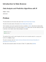
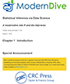

---
title       : Introduction to Course
author      : Adam J Sullivan 
job         : Assistant Professor of Biostatistics
work        : Brown University
framework   : io2012        # {io2012, html5slides, shower, dzslides, ...}
highlighter : highlight.js # {highlight.js, prettify, highlight}
hitheme     :  github     # 
widgets     : [mathjax, quiz, bootstrap, interactive] # {mathjax, quiz, bootstrap}
ext_widgets : {rCharts: [libraries/nvd3, libraries/leaflet, libraries/dygraphs]}
mode        : selfcontained # {standalone, draft}
knit        : slidify::knit2slides
logo        : publichealthlogo.png
biglogo     : publichealthlogo.png
assets      : {assets: ../../assets}
---  .segue bg:grey


```{r setup, include = FALSE, cache = FALSE}
knitr::opts_chunk$set(error = TRUE)
knitr::opts_chunk$set(cache=FALSE)
knitr::opts_chunk$set(warning=FALSE)
knitr::opts_chunk$set(message=FALSE)
```


# PHP 1510/2510 Principles of Biostatistics and Data Analyis

---  .segue bg:grey


# Course Basics

--- .class #id

## Course Staff

* Instructor: Adam J Sullivan, PhD
* TAs:
    + 
* Masters Tutoring Office Hour Help:
    + 

--- .class #id

## Course Website

* Main: [https://php-1510-2510.github.io](https://php-1510-2510.github.io)
* Canvas:
    + PHP 1510: [https://canvas.brown.edu/courses/](https://canvas.brown.edu/courses/1078851)
    + PHP 2510: [https://canvas.brown.edu/courses/](https://canvas.brown.edu/courses/1078852)
* Github: [https://github.com/php-1510-2510](https://github.com/php-1510-2510)
* Slack: [https://php-1510-2510-fall-2019.slack.com/](https://php-1510-2510.slack.com/)


--- .class #id


## Course Goals

* Develop the ability to explore and engage new data. 
* Recognize and understand basic concept around basic probability distributions.
* Work with modern tools for reproducible research. 
* Develop statistical thinking skills. 
* Bring in, Clean and Analyze data with R.
* Coherently summarize results.


--- .class #id


## Course Expectations

* Attend all lectures and actively participate in discussion.
* Read all assigned material prior to coming to class and actively participate in class discussions. ***Students in the past have found that reading the notes works, but make sure you know what you need to learn best, as we will move fast. ***
* Complete and turn in all assignments on time. Solutions to homework must be clearly written with appropriate tables and figures included.
* Demonstrate an understanding on material on examinations.
* Respect each other, each others questions and each others discussion.

--- .class #id

## Overall Course Topics

- Course topics will be drawn (but subject to change) from

* Basic Probability
* Random Variables
* Exploratory Data Analysis
* Sampling Distributions
* Hypothesis Testing
    * Basic Methods
    * Categorical Data Comparisons
    * Non-parametric Methods
* Confidence Intervals
* Linear Regression


--- .class #id

## Main Textbooks


- **R for Data Science** by
  Hadley Wickham and Garrett Grolemund
  [R4DS](https://r4ds.had.co.nz/).
  


--- .class #id

## Main Tetbooks


-  **Mathematical Statistics with Resampling and R** by
   Laura M. Chihara, Tim C. Hesterberg
  [Amazon](https://www.amazon.com/Mathematical-Statistics-Resampling-Laura-Chihara/dp/111941654X/ref=sr_1_1?crid=1RCTXHSU4E7TI&keywords=mathematical+statistics+with+resampling+and+r&qid=1566224929&s=gateway&sprefix=mathematical+statistics+%2Caps%2C134&sr=8-1).
  


--- .class #id

## Main Tetbooks


- **Foundations of Statistics with R** by 
  Darrin Speegle
  [Bookdown](https://bookdown.org/speegled/foundations-of-statistics/)
  


--- .class #id

## Main Textbooks




- **Introduction to Data Science** by 
  Rafael A. Irizarry
  [Bookdown](https://rafalab.github.io/dsbook/)


--- .class #id

## Main Textbooks




- **Statistical Inference via Data Science** by 
  Chester Ismay and Albert Y. Kim
  [Bookdown](https://moderndive.com/)
  


--- .class #id


## Additional Resources

* Other resources for reference books, statistical computing using R,
  etc are provided on the [Resource]({{site.baseurl}}/resources) tab

--- .class #id

## Grading:


-Students will be evaluated based on:


| Grade  Category | Percentage |
| --------------- | ----------------- | ------------- |
| Participation       |                    5%   |
| Homework             |                   20%  | 
| Exam 1 (10/24/2019)   |                  25% | 
| Exam 2 (12/12/2019)  |                 25%  |
| Final Take Home   |           25% |


--- .class #id

## Participation

* This course will move very fast and it is crucial to success in the course that students attend and participate. 
* Unexcused absences will result in a loss of percentage points. 


--- .class #id

## Homework

* Assignments will be given out to students. Assignments will require data handling, data cleaning and interpretation of the results.  
* It is expected that all assignments are completed on time. **No late assignments will be accepted.** 
* Students will also be graded on the conciseness and quality of work. 
* Turning in many pages of just computer code and output will affect the grade in a negative fashion.
* All work must be done in R. No other Stat software is accepted. 

--- .class #id

## Exam 1 (October 24, 2019)

* An in class exam will be given. 
* Students will be expected to interpret and analyze regression models. 
* Students will also be expected to understand conceptual ideas. 


--- .class #id


## Exam  2 (December 12, 2019)

* An in class exam will be given. 
* Students will be expected to interpret and analyze regression models. 
* Students will also be expected to understand conceptual ideas. 


--- .class #id


## Final Take Home Exam

There will be a comprehensive take home data analysis from a real dataset.


--- .class #id


## PHP 1510s: Specifics

| Grade Category | Comments | 
| ----------------- | ---------------------------------------------------- |
| Participation  |                 Graded the same as all students, Must be in class and prepared to work in groups.  |
| Homework        |                Students will be expected to complete a portion of the material with the exception of some more difficult problems which may be attempted but do not have to be complete. | 
| Exam 1 & 2              |        Students will be expected to complete a portion of the exam.  |
|Take Home Exam | This will be a complete data analysis. No part of this exam is to be discussed or collaborated on with any other student.  |


--- .class #id

## PHP 2510: Specifics

| Grade Category | Comments | 
| ----------------- | ---------------------------------------------------- |
| Participation  |                 Graded the same as all students, Must be in class and prepared to work in groups.  |
| Homework        |                 Students will be expected to complete the entire assignment. | 
| Exam 1 & 2              |       Students will be expected to complete the entire exam.  |
|Take Home Exam | This will be a complete data analysis. No part of this exam is to be discussed or collaborated on with any other student.  |


--- .class #id

## Statistical Analysis


* We will use R as a programming language for data analysis and use existing packages written in R to support the course. 
* You should have access to a laptop   or desktop capable of running [R or RStudio]({{site.baseurl}}/resources).  
* We will also provide access   to a dedicated server running RStudio Pro for all students that will have a unified environment.  
* See the [Resources]({{site.baseurl}}/resources) page for books and other resources for learning R.


--- .class #id

## Email and Discussion Forums

* We will be using [Slack](https://join.slack.com/t/php15112511sp-uym3228/shared_invite/enQtNTI5OTM4MzczMTY5LWRkMzdjODdjODc0MjRhNzVhMWU5OGUyZTE3NTE2YWUyYjk0ZjVmZGJjMDAzODA1MDBmMWZiODM5ZTA5YjcxOWU) for class discussion. 
* The system is highly catered to getting you help fast and efficiently from classmates, the TAs, and myself. 
* Rather than emailing questions to the teaching staff, I encourage you to post your questions on Slack (peer answers earn participation points!). 
* Any non-personal questions related to the material covered in class, problem sets, labs, projects, etc. should be posted on slack.
* Before posting a new question please make sure to check if your question has already been answered. 
* The TAs and myself will be answering questions on the forum daily and all students are expected to answer questions as well. Please use informative titles for your posts.


--- .class #id


## What Slack does not mean: 

* This does not mean that the professor or staff will be available 24/7.
* Do not expect a fast answer from the staff after 5pm on a week night. 
* Do not expect a fast answer from the staff on the weekends. 


--- .class #id


## Students with Special Needs


* Brown University is committed to full inclusion of all students. 
* Students who, by nature of a documented disability, require academic accommodations should contact the professor during office hours.
* Students may also speak with Student and Employee Accessibility Services at 401-863-9588 to discuss the process for requesting accommodations.


--- .class #id


## Diversity Statement

* This course is designed to support an inclusive learning environment where diverse perspectives are recognized, respected and seen as a source of strength. 
* It is our intent to provide materials and activities that are respectful of various levels of diversity: mathematical background, previous computing skills, gender, sexuality, disability, age, socioeconomic status, ethnicity, race, and culture.  
* It is the nature of data analysis that we will touch on sensitive subjects. 
* My goal will be to approach these with as much respect and kindness as I can. 
* Please come see me if you ever feel hurt or upset about class discussions. 


--- .class #id


## English Language Learners

*  Brown University welcomes students from around the world, and the unique perspectives international students bring enrich the campus community.  *  To empower students whose first language is not English, an array of ELL support is available on campus including language and culture workshops and individual appointments. 
* For more information about English Language Learning at Brown, contact the ELL Specialists at ellwriting@brown.edu.

