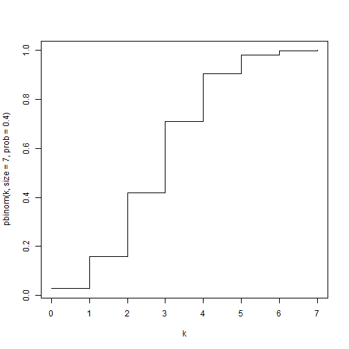
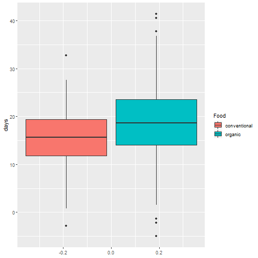
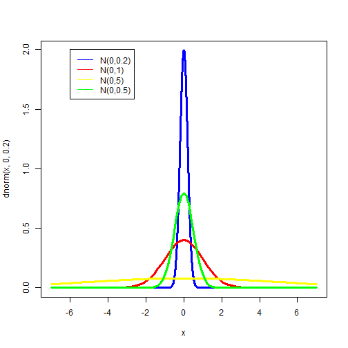

---
title       : Random Variables Part 2
author      : Adam J Sullivan 
job         : Assistant Professor of Biostatistics
work        : Brown University
framework   : io2012        # {io2012, html5slides, shower, dzslides, ...}
highlighter : highlight.js # {highlight.js, prettify, highlight}
hitheme     :  github     # 
widgets     : [mathjax, quiz, bootstrap, interactive] # {mathjax, quiz, bootstrap}
ext_widgets : {rCharts: [libraries/nvd3, libraries/leaflet, libraries/dygraphs]}
mode        : selfcontained # {standalone, draft}
knit        : slidify::knit2slides
logo        : publichealthlogo.png
biglogo     : publichealthlogo.png
assets      : {assets: ../../assets}
---  .segue bg:grey

# Random Variables


--- .class #id

## Continuous Random Variables

- The actual definition of a random variable is:

A random variable in which the CDF is differentiable. It is possible for a finite set of points for where the CDF is continuous but not differentiable.

- What does this mean? 


--- .class #id

## Binomial CDF

- Lets consider the Binomial CDF


```r
k <- seq(0,7, by=0.0001)
plot(k,pbinom(k,size=7,prob=.4),type="l")
```


--- .class #id

## Binomial CDF

- Lets consider the Binomial CDF




--- .class #id

## Key Features

- CDF is a step function. 
- This is due to the fact that it can only take on certain values. 
- What does a continuous CDF look like?

--- .class #id

## Normal CDF

- Lets consider the Normal CDF


```r
k <- seq(-4,4, by=0.0001)
plot(k,pnorm(k),type="l")
```

--- .class #id

## Differences

- CDF of normal is smooth
- This smoothness relates to the differentiable nature of it. 
- This happens because the normal can take on an infinite number of points between any discrete value. 

--- .class #id

## Continuous Random Variables

- We will consider the following in the course sequence:
    - Uniform
    - Normal
    - t-distribution (Later during hypothesis testing)
    - Exponential (1511/2511)
    

--- .class #id

## Uniform Distribution

- Uniform distribution is a specific distribution where all values have the same probability. 
- Some call it a rectangular distribution
- To see why we will graph it. 

--- .class #id

## Uniform Distribution


```r
k <- seq(-1,2, by = 0.001)
plot(k, dunif(k,  min=0, max=1), type="l")
```


--- .class #id

## Uniform Distribution


--- .class #id

## Further Uniform


```r
k <- seq(-2,3, by = 0.001)
plot(k, dunif(k,  min=-1, max=2), type="l")
```


--- .class #id

## Further Uniform




--- .class #id

## Is this really continuous? 

- Look at the CDF


--- .class #id

## Properties of Uniform

- Uniform on (a, b)
- PDF
$$f(x) = \dfrac{1}{b-a}, \text{ for } a\le x \le b$$
- Mean
$$\dfrac{a+b}{2}$$
- Variance
$$\dfrac{(b-a)^2}{12}$$

--- .class #id

## Why the Uniform? 

- We use the uniform because each value has the same probability of occuring. 
- This allows us to randomly pick uniform values for each person and then use those values for assignment. 
- The uniform distribution also has a powerful feature. 
    - Any distribution can be constructed from a uniform. 
    - This means if we do not have a special R function, we can still use the uniform to create the distribution. 


--- .class #id

## Normal Distribution

- Most of you know this as the Bell Shaped Curve. 
- The most used distribution. 
- Extremely important in all statistics. 

--- .class #id

## Features of a Normal Distribution

- Symmetric about the mean. 
- Mean and Median are equal. 


--- .class #id

## Properties of a Normal Distribution

- Normal$(\mu, \sigma^2)$
- PDF
$$f(x) = \dfrac{1}{\sigma\sqrt{2\pi}} e^{\dfrac{-(x-\mu)^2}{2\sigma^2}}$$
- Mean
$$\mu$$
- Variance
$$\sigma^2$$

--- .class #id

## Normal PDF Plot


```r
x <- seq(-7,7, by =0.001)
plot(x, dnorm(x, 0, 0.2), type="l", col="blue", lwd=3)
curve(dnorm(x, 0, 1.0), add=TRUE, col="red", lwd=3)
curve(dnorm(x, 0, 5.0), add=TRUE, col="yellow", lwd=3)
curve(dnorm(x, 0, 0.5), add=TRUE, col="green", lwd=3)
legend(-6,2,legend=c("N(0,0.2)","N(0,1)","N(0,5)", "N(0,0.5)"),lty=1,col=c("blue", "red",
"yellow", "green"))
```


--- .class #id

## Normal PDF Plot


--- .class #id

## Normal CDF Plot


```r
x <- seq(-7,7, by =0.001)
plot(x, pnorm(x, 0, 0.2), type="l", col="blue", lwd=3)
curve(pnorm(x, 0, 1.0), add=TRUE, col="red", lwd=3)
curve(pnorm(x, 0, 5.0), add=TRUE, col="yellow", lwd=3)
curve(pnorm(x, 0, 0.5), add=TRUE, col="green", lwd=3)
legend(-6,2,legend=c("N(0,0.2)","N(0,1)","N(0,5)", "N(0,0.5)"),lty=1,col=c("blue", "red", 
"yellow", "green"))
```

--- .class #id

## Normal CDF Plot



--- .class #id

## Why Normal? 

- We will spend some time talking about this in the future, but it is the most important distribution you will learn about. 
- Most of statistics that you will ever use are derived from this distribution. 

--- .class #id

## Interesting facts about Continuous Distributions.

- $Pr(X=k)= 0$ for any $k$
    - This is because a continuous distribution has an infinite number of points so the probability of any point is 0. 
- CDF: $Pr(X\le x)$
    - We use the CDF to help us understand probability ranges. 
    - Since we cannot calculate $Pr(x=1)$, we may wish to calculate $Pr(0.9\le1.1)$ instead. 
    
--- .class #id

## Using CDF to calculate Probabilities

- If we wish to calculate the following: 
