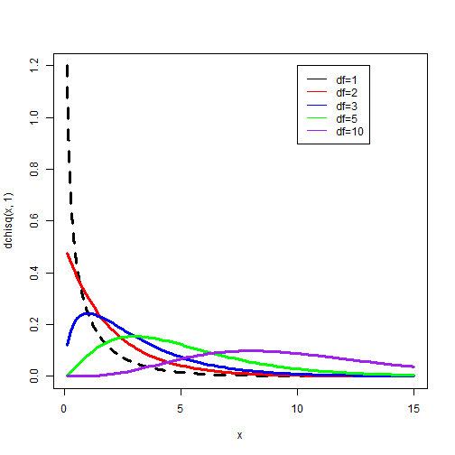
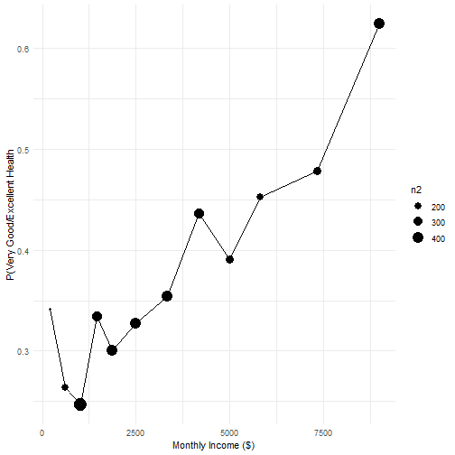
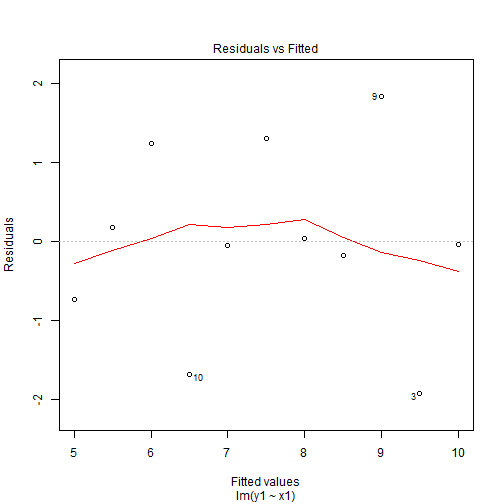
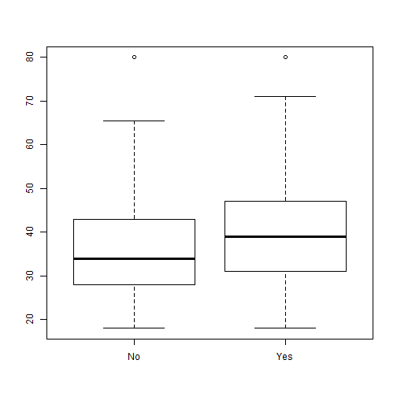
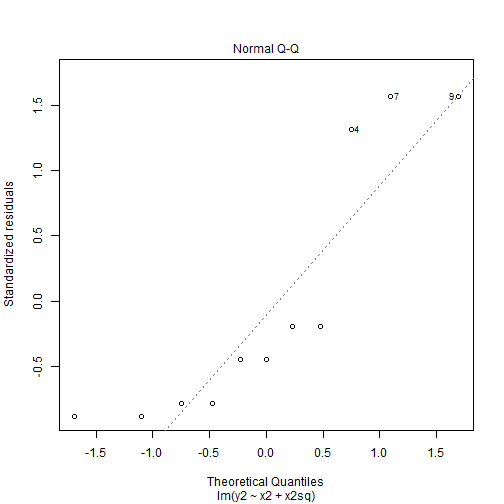
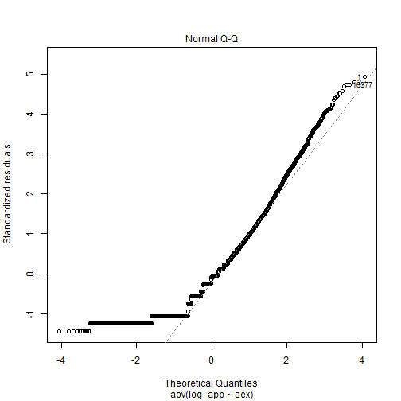
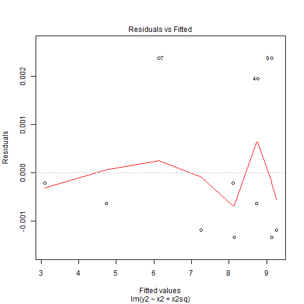

---
title       : Interactions and Regression Assumptions
author      : Adam J Sullivan 
job         : Assistant Professor of Biostatistics
work        : Brown University
framework   : io2012        # {io2012, html5slides, shower, dzslides, ...}
highlighter : highlight.js # {highlight.js, prettify, highlight}
hitheme     :  github     # 
widgets     : [mathjax, quiz, bootstrap, interactive] # {mathjax, quiz, bootstrap}
ext_widgets : {rCharts: [libraries/nvd3, libraries/leaflet, libraries/dygraphs]}
mode        : selfcontained # {standalone, draft}
knit        : slidify::knit2slides
logo        : publichealthlogo.png
biglogo     : publichealthlogo.png
assets      : {assets: ../../assets}
---  .segue bg:grey


# Interaction

--- .class #id


## Interaction

- The definition of interaction is the direct effect that one kind of particle has on another.
- This is similar to how we view it in statistics. 
- When there is an interaction, the effect of one variable is different in one group than in another. 
- For example, if we feel there is a interaction between sex and treatment, then the effect of ones treatment is directly related to what their sex is. 


--- .class #id


## Example with Categorical Interaction

- This data is from 18 women and 14 men to investigate a certain theory on why women exhibit a lower tolerance for alcohol and develop alcohol–related liver disease more readily than men.
- This data is from [The Statistical Sleuth: A Course in Methods of Data Analysis](http://www.statisticalsleuth.com/)


--- .class #id

## Example with Categorical Interaction

| Variable Name | Description | 
| :-------------: | :-------------------- |
| Subject | subject number in the study | 
| Metabol | first–pass metabolism of alcohol in the stomach (in mmol/liter-hour) |
| Gastric  | gastric alcohol dehydrogenase activity in the stomach (in mumol/min/g of tissue) | 
| Sex | sex of the subject | 
| Alcohol | whether the subject is alcoholic or not | 


--- .class #id

## Data Exploration: Metabolism by Gastric Activity



--- .class #id


## Data Exploration: Metabolism by Sex


--- .class #id


## Data Exploration: Metabolism by Alcoholism


--- .class #id


## Data Exploration: Metabolism by Gastric and Sex


--- .class #id


## Regression Model


```
## # A tibble: 2 x 5
##   term        estimate       p.value conf.low conf.high
##   <chr>          <dbl>         <dbl>    <dbl>     <dbl>
## 1 (Intercept)    -1.83 0.00428          -3.03    -0.620
## 2 Gastric         2.28 0.00000000527     1.70     2.86
```

--- .class #id

## Regression Model


```
## # A tibble: 3 x 5
##   term        estimate      p.value conf.low conf.high
##   <chr>          <dbl>        <dbl>    <dbl>     <dbl>
## 1 (Intercept)    -1.95 0.000796       -3.01     -0.884
## 2 Gastric         1.97 0.0000000424    1.42      2.51 
## 3 SexMale         1.62 0.00365         0.572     2.66
```

--- .class #id


## Regression Model


```
## # A tibble: 4 x 5
##   term            estimate p.value conf.low conf.high
##   <chr>              <dbl>   <dbl>    <dbl>     <dbl>
## 1 (Intercept)       -0.197  0.808    -1.84       1.45
## 2 Gastric            0.837  0.0947   -0.154      1.83
## 3 SexMale           -0.988  0.365    -3.19       1.21
## 4 Gastric:SexMale    1.51   0.0118    0.362      2.65
```

--- .class #id


## Regression Model


```
## # A tibble: 3 x 5
##   term            estimate  p.value conf.low conf.high
##   <chr>              <dbl>    <dbl>    <dbl>     <dbl>
## 1 (Intercept)       -0.750 0.168      -1.84      0.336
## 2 Gastric            1.15  0.00237     0.443     1.85 
## 3 Gastric:SexMale    1.04  0.000166    0.549     1.54
```

--- .class #id


## Interpretation

- We have to consider the model that we have:

$$Metabolism = \beta_0 + \beta_1 Gastric + \beta_2 Gastric*Male$$
- Females: 
$$ Metabolism = \beta_0 + \beta_1 Gastric$$
- Males:
$$ Metabolism = \beta_0 + (\beta_1+\beta_2) Gastric$$


--- .class #id


## Continuous Interaction

- This is a little harder to figure out when it is happening. 
- We have simulated data of GPA based on work ethic and GPA


--- .class #id


## Data Exploration


--- .class #id


## Data Exploration



--- .class #id


## Check for Interaction: Try Quantiles


```r
gpa_data %>%
  summarise(`0%`=quantile(iq, probs=0),
            `33%`=quantile(iq, probs=0.33),
            `66%`=quantile(iq, probs=0.66),
            `100%`=quantile(iq,probs=1))
```

```
##         0%      33%      66%     100%
## 1 53.44964 92.72525 106.0709 136.3098
```

--- .class #id


## Create a Factor


```r
gpa_data <-gpa_data %>%
    mutate(iq_fact = cut(iq, 3, labels =c('low', 'medium', 'high')))
```


--- .class #id


## Graph Interaction


--- .class #id


## Linear Model


```r
mod <- lm(data=gpa_data, gpa~work_ethic*iq)
tidy(mod, conf.int = T)[,-c(3:4)]
```

```
## # A tibble: 4 x 5
##   term           estimate   p.value conf.low conf.high
##   <chr>             <dbl>     <dbl>    <dbl>     <dbl>
## 1 (Intercept)   -0.857    1.85e-166 -0.880    -0.833  
## 2 work_ethic    -0.000492 9.05e-  1 -0.00857   0.00758
## 3 iq             0.00129  1.28e- 22  0.00106   0.00153
## 4 work_ethic:iq  0.00894  5.35e-284  0.00886   0.00902
```


--- .segue bg:grey


# Linear Regression Assumptions


--- .class #id

## Assumptions of Linear Regression

- ***Linearity:*** Function $f$ is linear. 
- Mean of error term is 0. 
    \[E(\varepsilon)=0\]
- ***Independence:*** Error term is independent of covariate. 
    \[Corr(X,\varepsilon)=0\]
- ***Homoscedacity:*** Variance of error term is same regardless of value of $X$. 
    \[Var(\varepsilon)=\sigma^2\]
- ***Normality:*** Errors are normally Distributed


--- .class #id

## Diagnostics for  Linear Regression


- A remarkable paper came out in 1973 called *Graphs in Statistical Analysis* by Francis J. Anscombe.
- We will explore this data as we discuss diagnostics and transformations for simple linear regression.
- These examples show how much your regression output may mislead you if you are not careful about the assumptions. 


--- .class #id

## The Data


```r
anscombe
```

```
##    x1 x2 x3 x4    y1   y2    y3    y4
## 1  10 10 10  8  8.04 9.14  7.46  6.58
## 2   8  8  8  8  6.95 8.14  6.77  5.76
## 3  13 13 13  8  7.58 8.74 12.74  7.71
## 4   9  9  9  8  8.81 8.77  7.11  8.84
## 5  11 11 11  8  8.33 9.26  7.81  8.47
## 6  14 14 14  8  9.96 8.10  8.84  7.04
## 7   6  6  6  8  7.24 6.13  6.08  5.25
## 8   4  4  4 19  4.26 3.10  5.39 12.50
## 9  12 12 12  8 10.84 9.13  8.15  5.56
## 10  7  7  7  8  4.82 7.26  6.42  7.91
## 11  5  5  5  8  5.68 4.74  5.73  6.89
```


--- .class #id


## The Model Set ups

- Notice in this data that for $X_1$ - $X_3$ we have the same data points but all of the $Y$ values differ. 
- Let us first consider their regression outputs from R:


```r
mod1 <- lm(y1 ~ x1, data=anscombe)
mod2 <- lm(y2 ~ x2, data=anscombe)
mod3 <- lm(y3 ~ x3, data=anscombe)
mod4 <- lm(y4 ~ x4, data=anscombe)
```


--- .class #id

## Coefficients 


```r
library(broom)
library(dplyr)
tidy1 <- tidy(mod1, conf.int = T)
tidy2 <- tidy(mod2, conf.int = T)
tidy3 <- tidy(mod3, conf.int = T)
tidy4 <- tidy(mod4, conf.int = T)

knitr::kable(bind_rows(tidy1,tidy2, tidy3, tidy4)[,-c(3,4)])
```


--- .class #id


## Coefficients


|term        |  estimate|   p.value|  conf.low| conf.high|
|:-----------|---------:|---------:|---------:|---------:|
|(Intercept) | 3.0000909| 0.0257341| 0.4557369| 5.5444449|
|x1          | 0.5000909| 0.0021696| 0.2333701| 0.7668117|
|(Intercept) | 3.0009091| 0.0257589| 0.4552982| 5.5465200|
|x2          | 0.5000000| 0.0021788| 0.2331475| 0.7668525|
|(Intercept) | 3.0024545| 0.0256191| 0.4587013| 5.5462078|
|x3          | 0.4997273| 0.0021763| 0.2330695| 0.7663851|
|(Intercept) | 3.0017273| 0.0255904| 0.4592412| 5.5442134|
|x4          | 0.4999091| 0.0021646| 0.2333841| 0.7664341|


--- .class #id

## Model Stats


```r
glance1 <- glance(mod1)
glance2 <- glance(mod2)
glance3 <- glance(mod3)
glance4 <- glance(mod4)

knitr::kable(bind_rows(glance1,glance2, glance3, glance4))
```


--- .class #id

## Model Stats


| r.squared| adj.r.squared|    sigma| statistic|   p.value| df|    logLik|      AIC|      BIC| deviance| df.residual|
|---------:|-------------:|--------:|---------:|---------:|--:|---------:|--------:|--------:|--------:|-----------:|
| 0.6665425|     0.6294916| 1.236603|  17.98994| 0.0021696|  2| -16.84069| 39.68137| 40.87506| 13.76269|           9|
| 0.6662420|     0.6291578| 1.237214|  17.96565| 0.0021788|  2| -16.84612| 39.69224| 40.88593| 13.77629|           9|
| 0.6663240|     0.6292489| 1.236311|  17.97228| 0.0021763|  2| -16.83809| 39.67618| 40.86986| 13.75619|           9|
| 0.6667073|     0.6296747| 1.235696|  18.00329| 0.0021646|  2| -16.83261| 39.66522| 40.85890| 13.74249|           9|


--- .class #id

## What do we notice? 

- All of the regression coefficients are the same. 
- All of the regression diagnostics are the same. 
- They appear to be the same models. 

--- .class #id

## What About the Assumptions

- Lets check our model plots.


```r
library(ggplot2)
library(gridExtra)
p1 <- ggplot(anscombe, aes(x1,y1)) + geom_point() + geom_smooth(method="lm", se=FALSE)+theme_bw()
p2 <- ggplot(anscombe, aes(x2,y2)) + geom_point() + geom_smooth(method="lm", se=FALSE)+theme_bw()
p3 <- ggplot(anscombe, aes(x3,y3)) + geom_point() + geom_smooth(method="lm", se=FALSE)+theme_bw()
p4 <- ggplot(anscombe, aes(x4,y4)) + geom_point() + geom_smooth(method="lm", se=FALSE)+theme_bw()
grid.arrange(p1,p2,p3, p4, ncol=2)
```

--- .class #id

## What About the Assumptions


--- .class #id


## What Do we Notice? 


- We can see that the line looks appropriate for model 1 but not for the other 3. 
- For Model 2 it appears the data is curved. 
- For model 3 it appears that an outlier is really driving the model. 
- Finally for Model 4 it appears that we have only one differing $X$ value and that is driving the slope.  
- What are the values of these regression lines?


--- .class #id


## What Does this Mean? 

- If we look at these closely we can see that these are almost the exact same regressions.
- This is a major issue for us if we just blindly ran our regressions. 
- We need to discuss tools to help us not make these mistakes. 


--- .segue bg:grey


# Residuals to the Rescue

--- .class #id


## Residuals to the Rescue!!


- One method to help us evaluate a linear fit and to check assumptions is to consider the residuals. 
- The benefit of examining the residuals is that unlike the plots previously is that we can evaluate them regardless of how many predictors are in the model. 


--- .class #id

## Enter Residual Plots


```r
  plot(mod1,1)
 plot(mod2,1)
 plot(mod3,1)
 plot(mod4,1)
```


--- .class #id

## Enter Residual Plots




--- .class #id


## Enter Residual Plots


--- .class #id

## Enter Residual Plots


--- .class #id

## Enter Residual Plots




--- .class #id


## What do we see?


- Looking at the plots we can see that our residuals take on different patterns. 
- This is due to how we defined residual error as 
\[\varepsilon_i = Y_i - \beta_0 - \beta_1 X_i.\]
- We first look at Model 1 there is no pattern to these residuals and they seem to be randomly spread around 0. 
- This is indicator of a good linear fit. Recall that we assume that $E(\varepsilon_i)=0$, so we would expect to see the residuals spread around 0 and without pattern. 


--- .class #id


## Patterns in Residuals

- Patterns in residuals show us that our model is not an adequate summary of the data. 
- Consider what happens when our line is truly linear in nature then
\[Y_i = E(Y_i|X_i=x_i) + \varepsilon_i = \beta_0 + \beta_1x_i + \varepsilon_i\]
- We then fit our regression line $\hat{y}_i= \hat{\beta}_0 + \hat{\beta}_1x_i$. This leads to the residuals
\[\hat{\varepsilon}_i = y_i - \hat{y}_i = \beta_0 + \beta_1x_i + \varepsilon_i - \hat{\beta}_0 - \hat{\beta}_1x_i \approx \varepsilon_i\]
- So the residuals are randomly distributed and centered about 0.


--- .class #id


## Quadratic Patterns in Residuals

 - In the second figure, we can see that we have a quadratic pattern in this. 
- This happens when the true model is quadratic
\[y_i = \beta_0 + \beta_1x_i + \beta_2x_i^2 + \varepsilon_i\]
then we again fit our linear model $\hat{y}_i= \hat{\beta}_0 + \hat{\beta}_1x_i$.
- This leads to the residuals
\[\hat{\varepsilon}_i = y_i - \hat{y}_i = \beta_0 + \beta_1x_i + \beta_2x_i^2+  \varepsilon_i - \hat{\beta}_0 - \hat{\beta}_1x_i \approx\beta_2x_i^2+ \varepsilon_i\]
- So we have a quadratic relationship given our $x$. 


--- .class #id

## Quadratic Patterns in Residuals


- This means we may have been better off by choosing a model that would include a quadratic term for $x$. 
- In model 2 of Anscombe's data had we run a model with a quadratic term we would then have


```r
anscombe$x2sq <- anscombe$x2^2
mod2a <- lm(y2 ~ x2 +  x2sq, data=anscombe)
tidy(mod2a, conf.int=T)[,-c(3,4)]
glance(mod2a)


plot(mod2a,1)
```


--- .class #id


## Quadratic Patterns in Residuals


|term        |   estimate| p.value|  conf.low|  conf.high|
|:-----------|----------:|-------:|---------:|----------:|
|(Intercept) | -5.9957343|       0| -6.005719| -5.9857494|
|x2          |  2.7808392|       0|  2.778441|  2.7832375|
|x2sq        | -0.1267133|       0| -0.126845| -0.1265816|

--- .class #id


## Quadratic Patterns in Residuals


| r.squared| adj.r.squared|     sigma| statistic| p.value| df|   logLik|       AIC|       BIC| deviance| df.residual|
|---------:|-------------:|---------:|---------:|-------:|--:|--------:|---------:|---------:|--------:|-----------:|
| 0.9999995|     0.9999993| 0.0016725|   7378133|       0|  3| 56.47107| -104.9421| -103.3506| 2.24e-05|           8|


--- .class #id


## Quadratic Patterns in Residuals


## Tools for Checking Validity of a Model

When fitting a regression model we will take these steps to verify the validity of the model:

1. Regression Model is Linear in parameters.
2. Residuals are normally distributed.
3. Mean of Residuals is 0. 
4. Homoscedasticity of variances.
5. Variables and residuals are not correlated. 
6. No Influential Points or Outliers


--- .class #id


## Linear in Parameters

- We say it is linear in parameters if the $\beta$ values are linear in nature. 
- Consider the 2nd Anscombe model: 

\[E[Y|x] = \beta_0 + \beta_1 x + \beta_2 x^2\]
- Even though `x2` has been transformed to a square term, the $beta$ values are still linear. 


--- .class #id


## Residuals Plots


```r
plot(mod2,1)
```


--- .class #id

## Residuals Plots


--- .class #id

## Residuals Plots

- The residuals shows us that the residuals did not change by much and we can still see the pattern is the exact same as before but the range of the residuals is what has changed. 


--- .class #id

## Assessing Normality of Residuals: QQ-Plot

- Recall our model 2a. 

```r
plot(mod2a, 2)
```

--- .class #id

## Assessing Normality of Residuals: QQ-Plot





--- .class #id


## Mean of Residuals

- We can test if the mean of residuals is zero with a simple mean function. 


```r
mean(mod2a$residuals)
```

```
## [1] 0
```

--- .class #id


## Homoscedasticity of residuals



--- .class #id


## Homoscedasticity of residuals

- We can see that there is no pattern to the residuals. 
- They appear to be flat and not have a difference in width of the range of values. 
- If we saw a pattern like a cone shape then we would not have homoscedasticity. 


--- .class #id

## Residuals Plot


