---
title       : Summarization of Data
author      : Adam J Sullivan 
job         : Assistant Professor of Biostatistics
work        : Brown University
framework   : io2012        # {io2012, html5slides, shower, dzslides, ...}
highlighter : highlight.js # {highlight.js, prettify, highlight}
hitheme     :  github     # 
widgets     : [mathjax, quiz, bootstrap, interactive] # {mathjax, quiz, bootstrap}
ext_widgets : {rCharts: [libraries/nvd3, libraries/leaflet, libraries/dygraphs]}
mode        : selfcontained # {standalone, draft}
knit        : slidify::knit2slides
logo        : publichealthlogo.png
biglogo     : publichealthlogo.png
assets      : {assets: ../../assets}
---  .segue bg:grey


# `ggplot2`


--- .segue .quote bg:#C0C8CE


<q>  Appropriate graphical analysis may make the conclusions so clearcut that detailed specific analysis is unnecessary </q>

<q>-- David Cox (1978)</q>


--- .class #id

## `ggplot2`


- We will begin our journey into statistical graphics with the package `ggplot2`. 
- This is a package by Hadley Wickham and is part of the tidyverse. 
- It is a very comprehensive and easily adaptable language of graphics. 

--- .class #id

## What can't `ggplot2` do?


- A good place to start might be with what  `ggplot2` cannot do:
  - 3d graphs.
  - Interactive graphs, use `ggvis`
  - DAGs, see `igraph`
- We will now focus on all the things it can do.


--- .class #id


## `ggplot2` components


- `ggplot2` is built off the grammar of graphics with a very intuitive structure. 
- The base graphics built into R require the use of many different functions and each of them seem to have their own method for how to use them.   
- `ggplot2` will be more fluid and the more you learn about it the more amazing of graphics you can create. 

--- .class #id


## `ggplot2` components


- We will get started with the components of every `ggplot2` object:
  1. **data**
  2. **aesthetic mappings** between variables in the data and visual properties.
  3. At least one layer which describes how to render the data. 
    - Many of these are with the `geom_foo()` function. 


--- .class #id

## `ggplot()` Basics

- We will begin with a basic graph of appearances by alignment


```r
library(ggplot2)
library(fivethirtyeight)
ggplot(data=comic_characters, aes(x=align, y=appearances))
```


--- .class #id

## `ggplot()` Basics

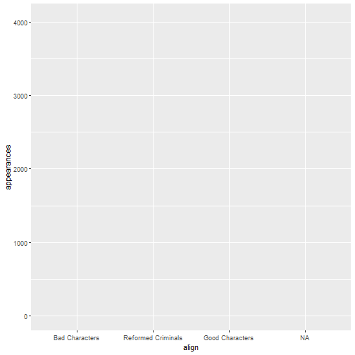

--- .class #id

## `ggplot()` Statement

- We can see that all we have is the basic layout of axis. 
- The data and aes gives us the basic layout. 
- We need `geom_foo()` to make a proper graph. 


--- .class #id

## `geom_point()` Statement

- We can add`geom_point()` to this:


```r
ggplot(data=comic_characters, aes(x=align, y=appearances)) + 
  geom_point()
```


--- .class #id

## `geom_point()` Statement


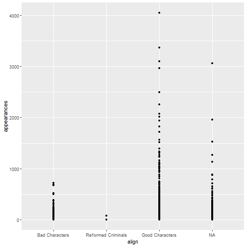


--- .class #id

## Other graphs

- This graph is not the best use for out data. 
- We could try boxplots instead:
  


```r
ggplot(data=comic_characters, aes(x=align, y=appearances)) + 
  geom_boxplot()
```


--- .class #id

## Other graphs


  


--- .class #id 


## Quick Transformation

- We may be having a hard time seeing this due to the outliers in the data. 
- We can try a log transform. 
- The code below will do this
- By the end of today you will understand this code


```r
comic_characters <- comic_characters %>%
  mutate(log_app = log(appearances))
```


--- .class #id 


## Boxplots Again


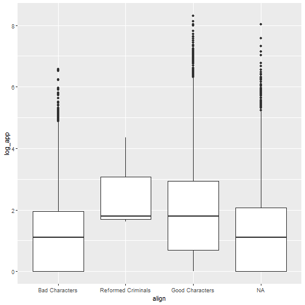


--- .class #id

## Bar Graphs

- We could then consider simple bar graphs
- For example if we wanted to know how many characters of each type there were:
  

```r
ggplot(data=comic_characters, aes(x=align)) + 
  geom_bar()
```
- Note: With bar graphs we only need the x-axis. 

--- .class #id

## Bar Graphs


  
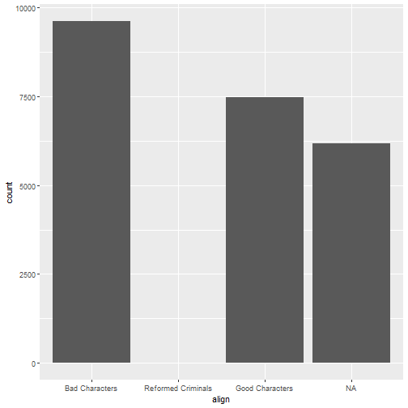


--- .class #id

## Basic Template

```
ggplot(data= <DATA>, aes(x=<X-VARIABLE>, y=<Y-VARIABLE>)) + 
    <GEOM_FUNCTION>()
```

---  .segue bg:grey


# Aesthetics


--- .class #id

## Aesthetics

- The basic aesthetics are mapping the data to the x and y axis. 
- We can also add:
  - `alpha`: makes points transparent to see overlaps better
  - `fill`: Fills objects with color 
  - `color`: Changes color of points or lines.
  - `shape`: Changes spape of points


--- .class #id


## Aesthetics:  `alpha`


```r
ggplot(data=comic_characters, aes(x=align, y=log_app)) + 
  geom_point(aes(alpha=1/100))
```

--- .class #id

## Aesthetics:  `alpha`


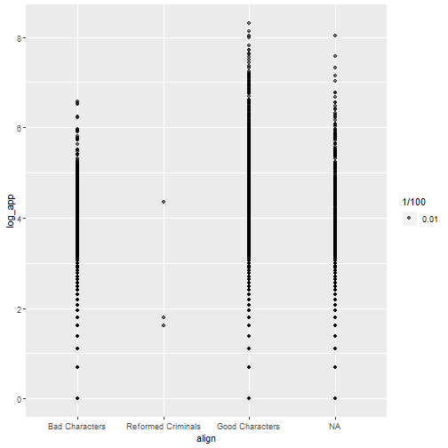

--- .class #id

## Aesthetics:  `alpha`

- It can be hard to see the transparency when they are so close.
- We can set the transparency to a variable


--- .class #id

## On Your Own: RStudio Practice

- Set `alpha=year`
- How does this change things?

--- .class #id

## On Your Own: RStudio Practice


Your end result should be:


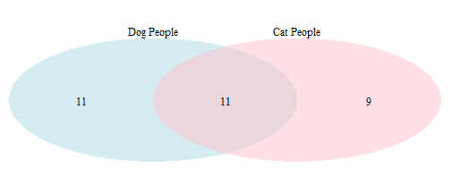

--- .class #id

## Aesthetics:  `color`

- We can easily change the color of points and lines using `color`


```r
ggplot(data=comic_characters, aes(x=align, y=log_app)) + 
  geom_point(aes(color=publisher))
```


--- .class #id

## Aesthetics:  `color`


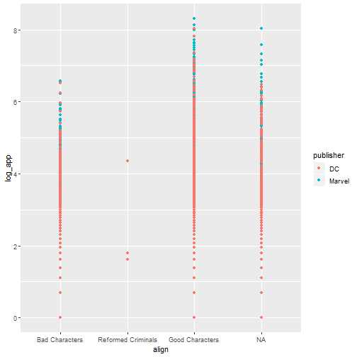

--- .class #id 

## On Your Own: RStudio Practice

- Set `color="blue"`
- How does this change things?


--- .class #id

## Aesthetics: `shapes`

- We can change the shape of points based on different variables.


```r
ggplot(data=comic_characters, aes(x=align, y=log_app)) + 
  geom_point(aes(shape=publisher))
```


--- .class #id

## Aesthetics: `shapes`


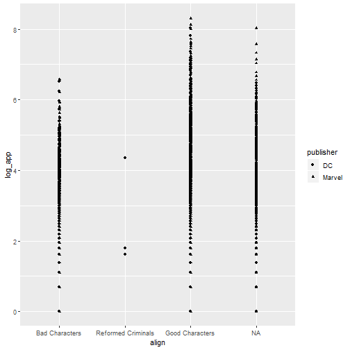


--- .class #id

## On Your Own: RStudio Practice

- Try using both shape and color. 
- How does this add dimensionality to the graph?


--- .class #id

## Aesthetics: `fill`

- We can fill objects with color as well


```r
ggplot(data=comic_characters, aes(x=align)) + 
  geom_bar(aes(fill="blue"))
```


--- .class #id

## Aesthetics: `fill`

- This doesnt have the same effect as `color`

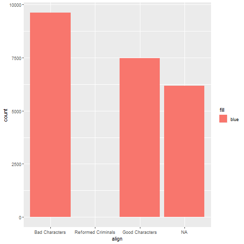


--- .class #id

## Aesthetics: `fill`

- We can use other variables to add dimensionality


```r
ggplot(data=comic_characters, aes(x=align)) + 
  geom_bar(aes(fill=publisher))
```


--- .class #id

## Aesthetics: `fill`


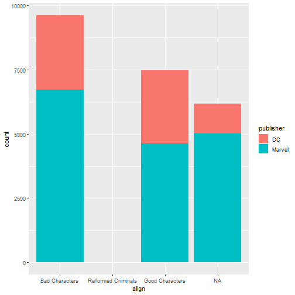


---  .segue bg:grey

# Geoms

--- .class #id

## Geoms

- There are many `geom_foo()` functions we can use. 
- The Cheatsheet on   `ggplot()` is a good place to start for more. 


--- .class #id

## Other Plots: Density


```r
ggplot(data=comic_characters, aes(x=log_app)) + 
  geom_density()
```


--- .class #id

## Other Plots: Density


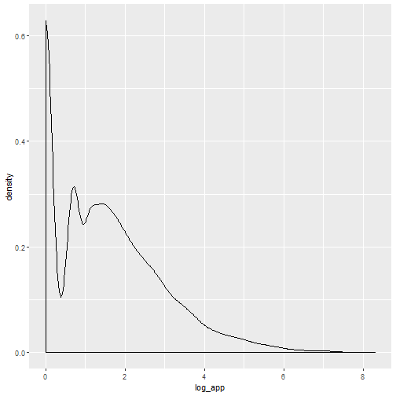


--- .class #id

## Other Plots: Density


```r
ggplot(data=comic_characters, aes(x=log_app)) + 
  geom_density(aes(color=publisher))
```

--- .class #id

## Other Plots: Density


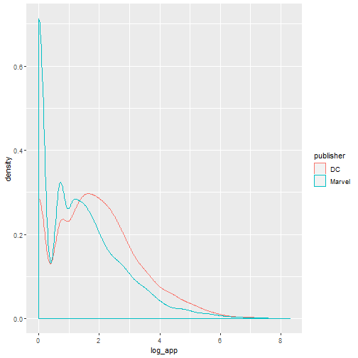


--- .class #id

## Other Plots: Histogram


```r
ggplot(data=comic_characters, aes(x=log_app)) + 
  geom_histogram(aes(fill=publisher))
```


--- .class #id

## Other Plots: Histogram


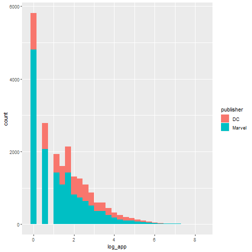
