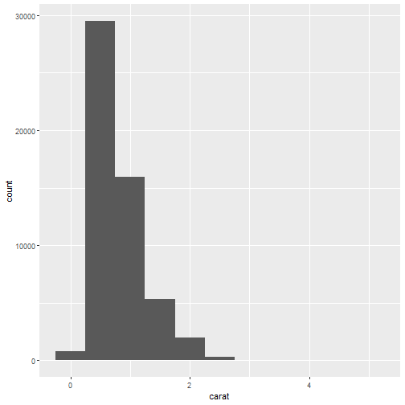
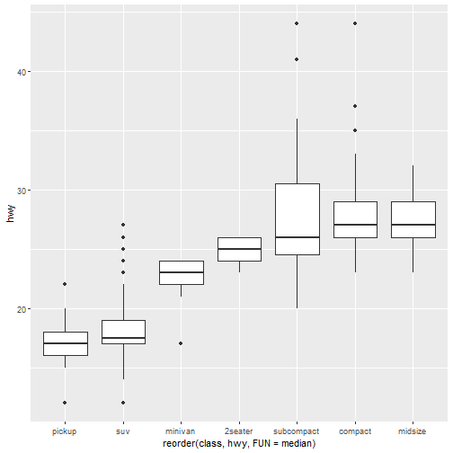
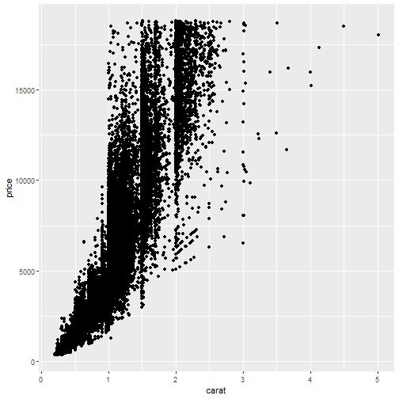
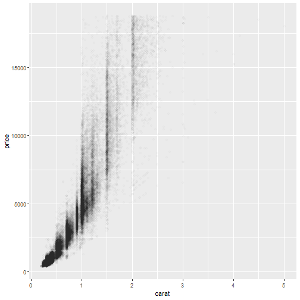
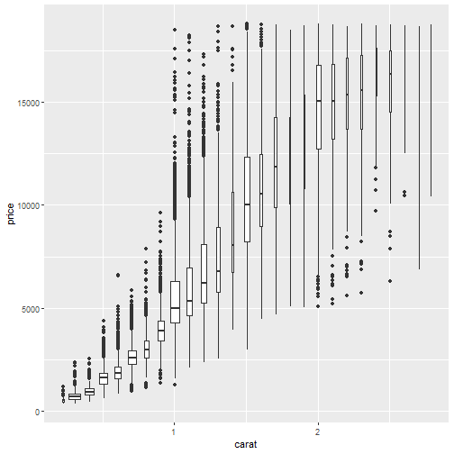
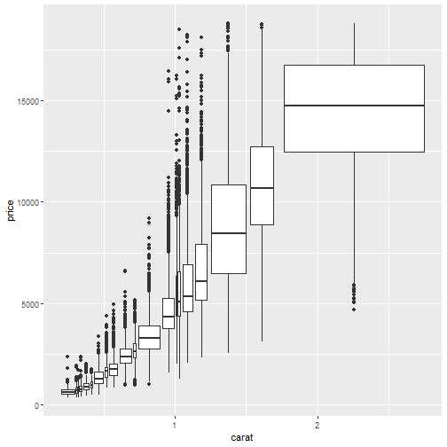

---
title       : Exploratory Data Analysis
author      : Adam J Sullivan 
job         : Assistant Professor of Biostatistics
work        : Brown University
framework   : io2012        # {io2012, html5slides, shower, dzslides, ...}
highlighter : highlight.js # {highlight.js, prettify, highlight}
hitheme     :  github     # 
widgets     : [mathjax, quiz, bootstrap, interactive] # {mathjax, quiz, bootstrap}
ext_widgets : {rCharts: [libraries/nvd3, libraries/leaflet, libraries/dygraphs]}
mode        : selfcontained # {standalone, draft}
knit        : slidify::knit2slides
logo        : publichealthlogo.png
biglogo     : publichealthlogo.png
assets      : {assets: ../../assets}
---  .segue bg:grey


# Exploratory Data Analysis

--- .class #id

## Exploratory Data Analysis

- We have already started the basic steps to exploratory data analysis. 
- So far we have:
    - Looked at Data
    - Summarized characteristics
    - Graphed relationships and distributions. 


--- .class #id

## Exploratory Data Analysis

- First step
- Know your dataset. 

 

--- .class #id

## Checkout the Data


```r
library(dplyr)
library(ggplot2)
glimpse(diamonds)
str(diamonds)
```

--- .class #id

## `glimpse()` Function


```
## Observations: 53,940
## Variables: 10
## $ carat   <dbl> 0.23, 0.21, 0.23, 0.29, 0.31, 0.24, 0.24, 0.26, 0.22, ...
## $ cut     <ord> Ideal, Premium, Good, Premium, Good, Very Good, Very G...
## $ color   <ord> E, E, E, I, J, J, I, H, E, H, J, J, F, J, E, E, I, J, ...
## $ clarity <ord> SI2, SI1, VS1, VS2, SI2, VVS2, VVS1, SI1, VS2, VS1, SI...
## $ depth   <dbl> 61.5, 59.8, 56.9, 62.4, 63.3, 62.8, 62.3, 61.9, 65.1, ...
## $ table   <dbl> 55, 61, 65, 58, 58, 57, 57, 55, 61, 61, 55, 56, 61, 54...
## $ price   <int> 326, 326, 327, 334, 335, 336, 336, 337, 337, 338, 339,...
## $ x       <dbl> 3.95, 3.89, 4.05, 4.20, 4.34, 3.94, 3.95, 4.07, 3.87, ...
## $ y       <dbl> 3.98, 3.84, 4.07, 4.23, 4.35, 3.96, 3.98, 4.11, 3.78, ...
## $ z       <dbl> 2.43, 2.31, 2.31, 2.63, 2.75, 2.48, 2.47, 2.53, 2.49, ...
```


--- .class #id

## `str()` Function


```
## Classes 'tbl_df', 'tbl' and 'data.frame':	53940 obs. of  10 variables:
##  $ carat  : num  0.23 0.21 0.23 0.29 0.31 0.24 0.24 0.26 0.22 0.23 ...
##  $ cut    : Ord.factor w/ 5 levels "Fair"<"Good"<..: 5 4 2 4 2 3 3 3 1 3 ...
##  $ color  : Ord.factor w/ 7 levels "D"<"E"<"F"<"G"<..: 2 2 2 6 7 7 6 5 2 5 ...
##  $ clarity: Ord.factor w/ 8 levels "I1"<"SI2"<"SI1"<..: 2 3 5 4 2 6 7 3 4 5 ...
##  $ depth  : num  61.5 59.8 56.9 62.4 63.3 62.8 62.3 61.9 65.1 59.4 ...
##  $ table  : num  55 61 65 58 58 57 57 55 61 61 ...
##  $ price  : int  326 326 327 334 335 336 336 337 337 338 ...
##  $ x      : num  3.95 3.89 4.05 4.2 4.34 3.94 3.95 4.07 3.87 4 ...
##  $ y      : num  3.98 3.84 4.07 4.23 4.35 3.96 3.98 4.11 3.78 4.05 ...
##  $ z      : num  2.43 2.31 2.31 2.63 2.75 2.48 2.47 2.53 2.49 2.39 ...
```

--- .class #id

## Data Look

- Using the `glimpse()` function and `str()` function. 
- This shows you the variables, what type they are and some information on values. 
- This is the first step you take with any dataset. 

--- .class #id

## Exploring the Dataset

- The rest of exploring comes from summaries and visualizations. 
- We tend to use different statistical summaries and visualizations depending on the type of data:
    - Categorical (Discrete)
    - Continuous

--- .class #id


## Descriptive Statistics

| Categorical | Continuous| 
| ----- | ----- | 
| Frequency | Mean |
| Proportion | Median |
| | Variance | 
| | Standard Deviation | 
| | Minimum | 
| | Maximum | 
| | Percentiles | 
| | etc. | 

--- .class #id

## Graphical Methods

| Categorical | Continuous| 
| ----- | ----- | 
| Bar Plots | Histograms | 
| | Boxplots | 
| | etc. |


--- .class #id

## Again with all of them?

- In the class on summarizing data we actually showed how to do these counts and basic stats. 
- In the class on data visualizations we showed how to make graphs. 
- What should we be doing for EDA? 

--- .class #id

## Purpose of EDA

- For now we will consider the purpose of EDA to be:
    - Visualizing the distribution.
    - Understanding the center. 
    - Understanding the variation.
    - Relationships of variables. 
    


--- .class #id

## Purpose of EDA

- We will use EDA to:
    - Help us explore interesting features of the data. 
    - Generate more questions about data. 
    - Learn what models might be possible. 
    - Connect data to mathematical models. 
- There is **no right way** to do EDA but it is crucial to begin with this. 

--- .segue bg:grey

# EDA

--- .class #id

## Exploring Distributions

- We learned about the story of different distributions. 
- We also need to know what data looks like to help us know if the data follows that story or a similar one. 
- We will do this with some basic graphs. 

--- .class #id

## Distribution of Categorical


```r
library(ggplot2)
ggplot(data = diamonds) + 
      geom_bar(aes(x=cut))
```


--- .class #id

## Distribution of Categorical


--- .class #id

## Counts with R


```r
diamonds %>%
    count(cut)
```

```
## # A tibble: 5 x 2
##   cut           n
##   <ord>     <int>
## 1 Fair       1610
## 2 Good       4906
## 3 Very Good 12082
## 4 Premium   13791
## 5 Ideal     21551
```


--- .class #id

## What do we see? 

- We can see that this not even close to a uniform distribution. 
- It appear to increase with quality. 

--- .class #id


## Distribution of Continuous

- We can do similar plots for continuous values. 


```r
ggplot(data = diamonds) +
  geom_histogram(aes(x = carat), binwidth = 0.5)
```


--- .class #id


## Distribution of Continuous

 




--- .class #id

## Count in R


```r
diamonds %>% 
  count(cut_width(carat, 0.5))
```

```
## # A tibble: 11 x 2
##    `cut_width(carat, 0.5)`     n
##    <fct>                   <int>
##  1 [-0.25,0.25]              785
##  2 (0.25,0.75]             29498
##  3 (0.75,1.25]             15977
##  4 (1.25,1.75]              5313
##  5 (1.75,2.25]              2002
##  6 (2.25,2.75]               322
##  7 (2.75,3.25]                32
##  8 (3.25,3.75]                 5
##  9 (3.75,4.25]                 4
## 10 (4.25,4.75]                 1
## 11 (4.75,5.25]                 1
```

--- .class #id

## What do we see? 

- There are the most in 0.25 to 0.75 carat. 
- We should try other bin sizes to see if there are differences. 

--- .class #id

## Bin size 0.1


--- .class #id

## Hardly any beyond 3


```r
diamonds2 <- diamonds %>%
                  filter(carat<3)
```


--- .class #id

## Plotting Again


--- .class #id

## EDA Questions

- EDA leads us to more questions as we explore. 
    - Which values are most common? Why?
    - Which value are rare? Does this make sense?
    - Any patterns in the data? 

--- .class #id

## Bin width 0.01


--- .class #id

## Questions raised

- Why are there more whole number than fractional carats? 
- Why are there more diamonds slightly to the right and left of each peak? 
- Why are there none larger than 3? 


--- .class #id

## Clusters

- How are the observations within each cluster similar to each other?
- How are the observations in separate clusters different from each other?
- How can you explain or describe the clusters?
- Why might the appearance of clusters be misleading?

--- .class #id

## Variation

- Variance: 0.2201044
- Standard Deviation: 0.4691529
- Just the number doesn't tell the whole story. 
- It doesn't show us the groupings or relationships. 
- We need to understand how a distribution looks and varies within itself. 


---  .segue bg:grey

# Relationships Between Variables


--- .class #id

## Relationships Between Variables

- We will explore how variables covary together by considering the following:
    - Categorical and Continuous Variables
    - Two Categorical Variables
    - Two Continuous Variables

   

---  .segue bg:grey

# Categorical and Continuous Variables


--- .class #id

## Box plots


--- .class #id

## Boxplot


```r
ggplot(data = diamonds, aes(x = cut, y = price)) +
  geom_boxplot()
```

--- .class #id

## Boxplot


--- .class #id

## Boxplots: What we see

- Display a lot of information.
- We get a sense of the center by the median line. 
- We get a sense of variation based on the width of the box. 
- We get a sense of outliers by the points that are graphed. 

--- .class #id

## More Boxplots


```r
ggplot(data = mpg, aes(x = class, y = hwy)) +
  geom_boxplot()
```

--- .class #id

## More Boxplots


```r
ggplot(data = mpg, aes(x = class, y = hwy)) +
  geom_boxplot()
```

--- .class #id

## Categories

- `cut` had a natural ordering. 
- `class` does not, so we could order in our own fashion. 

--- .class #id

## Re-ordering


```r
ggplot(data = mpg) +
  geom_boxplot( aes(x = reorder(class, hwy, FUN = median), y = hwy))
```


--- .class #id

## Re-ordering




--- .class #id

## Flipping the Coordinates


```r
ggplot(data = mpg) +
  geom_boxplot(aes(x = reorder(class, hwy, FUN = median), y = hwy)) +
  coord_flip()
```


--- .class #id

## Flipping the Coordinates


---  .segue bg:grey

# Two Categorical Variables

--- .class #id

## Count Plots


```r
ggplot(data = diamonds) +
  geom_count(aes(x = cut, y = color))
```


--- .class #id

## Count Plots


--- .class #id

## Points Counted


```r
diamonds %>%
    count(color, cut)
```

```
## # A tibble: 35 x 3
##    color cut           n
##    <ord> <ord>     <int>
##  1 D     Fair        163
##  2 D     Good        662
##  3 D     Very Good  1513
##  4 D     Premium    1603
##  5 D     Ideal      2834
##  6 E     Fair        224
##  7 E     Good        933
##  8 E     Very Good  2400
##  9 E     Premium    2337
## 10 E     Ideal      3903
## # ... with 25 more rows
```

--- .class #id

## Color Plots


```r
diamonds %>% 
  count(color, cut) %>%  
  ggplot(aes(x = color, y = cut)) +
    geom_tile(aes(fill = n))
```


--- .class #id

## Color Plots


---  .segue bg:grey

# Two Categorical Variables


--- .class #id

## Scatterplots


```r
ggplot(data = diamonds) +
  geom_point(aes(x = carat, y = price))
```

--- .class #id

## Scatterplots



--- .class #id

## What Can we See?

- There appears to be a relationship between price and carat. 
- The relationship is not exactly linear. 
- There are so many points it is hard to tell. 

--- .class #id

## Transparent Scatterplot


```r
ggplot(data = diamonds) + 
  geom_point(aes(x = carat, y = price), alpha = 1 / 100)
```


--- .class #id

## Transparent Scatterplot




--- .class #id

## Binning Observations


```r
ggplot(data = diamonds2) +
  geom_bin2d( aes(x = carat, y = price))
```


--- .class #id 

## Binning Observations


--- .class #id

## Turning to Categorical


```r
ggplot(data = diamonds2, aes(x = carat, y = price)) + 
  geom_boxplot(aes(group = cut_width(carat, 0.1)), varwidth=TRUE)
```


--- .class #id

## Turning to Categorical



--- .class #id

## Another binning


```r
ggplot(data = diamonds2, aes(x = carat, y = price)) + 
  geom_boxplot(aes(group = cut_number(carat, 20))   , varwidth=TRUE)
```


--- .class #id

## Another binning




--- .class #id

## Differences

- `cut(x, width)` divides the `x` axis variable by the `width`. 
- `varwidth` increases the width of the boxplot based on the number of points contained in the summary. 
- `cutnumber` cuts the data up into a pre-specified number of points. 

