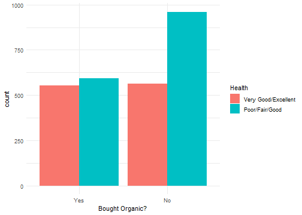
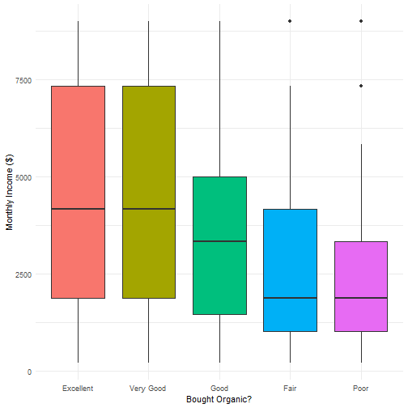
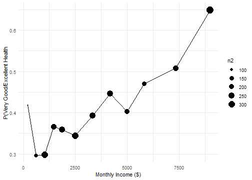
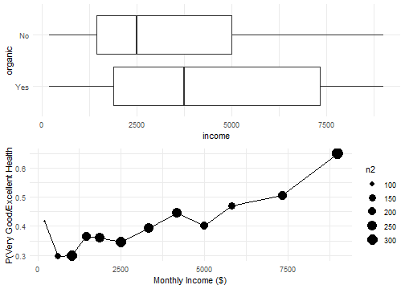
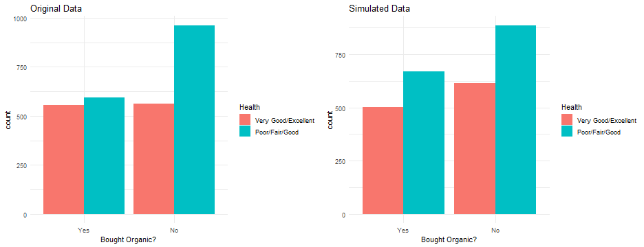
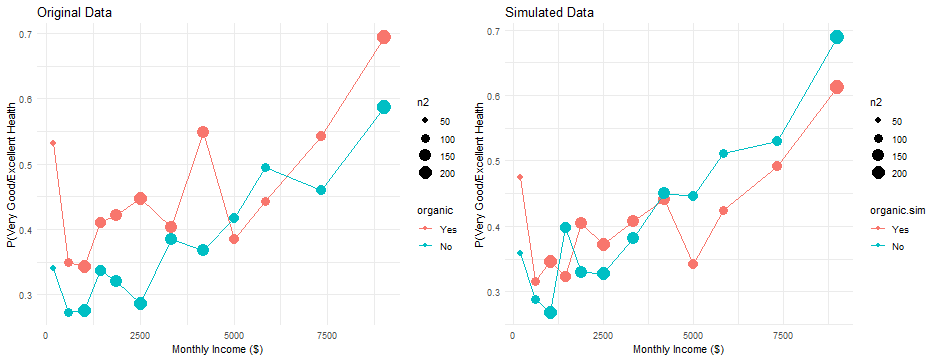

---
title       : Introduction to Hypothesis Testing
author      : Adam J Sullivan 
job         : Assistant Professor of Biostatistics
work        : Brown University
framework   : io2012        # {io2012, html5slides, shower, dzslides, ...}
highlighter : highlight.js # {highlight.js, prettify, highlight}
hitheme     :  github     # 
widgets     : [mathjax, quiz, bootstrap, interactive] # {mathjax, quiz, bootstrap}
ext_widgets : {rCharts: [libraries/nvd3, libraries/leaflet, libraries/dygraphs]}
mode        : selfcontained # {standalone, draft}
knit        : slidify::knit2slides
logo        : publichealthlogo.png
biglogo     : publichealthlogo.png
assets      : {assets: ../../assets}
---  .segue bg:grey


# Introduction to Hypothesis Testing

--- .class #id

## Introduction to Hypothesis Testing


- In most statistics courses you get to hypothesis testing at the end of the course. 
- We will do things a little different. 
- We should consider important concepts when trying to understand testing hypothesis. 

--- .class #id

## What is hypothesis Testing? 

- Many times we want to be able to compare things. 
- We wish to test whether something is better than something else. 
    - Should you buy computer "A" vs computer "B". 
- We also wish to test the validity of statements. 
    - A friend says they can force a coin to get Heads.
    - You give them a coin and they flip three times in a row and get heads. 
    - Do you believe them?

--- .class #id

## Coin Toss


```r
coin <- c(1, 0)

flips <- replicate(100000, sum(sample(coin, 3, replace=T)))
tab <- table(flips)
prop.table(tab)
```

```
## flips
##       0       1       2       3 
## 0.12352 0.37410 0.37730 0.12508
```


--- .class #id

## Testing Our Friend

- The probability of 3 heads in 3 coin flips is 12.5%
- We may not believe that they can force heads. 
- Many times our hypothesis testing is about different groups. 


--- .class #id

## Big Question

- Does eating organic food improve your health? 
- Consider some evidence

--- .class #id

## Data Study 1

- This data comes from [NHANES: National Health and Nutrition Examination Survey](https://www.cdc.gov/nchs/nhanes/index.htm)
- Large national random sample
- 2009 – 2010 data
- n = 3777

--- .class #id

## Organic Food

"In the past 30 days, did you buy any food that had the word 'organic' on the package?"


--- .class #id

## Current Health Status

"Would you say your health in general is Excellent, Very Good, Good, Fair or Poor"


--- .class #id

## Current Health Status


--- .class #id

## Health by Organic




--- .class #id

## The Difference

- We could consider the difference between healthy with organic food vs healthy with conventional food. 


```
## # A tibble: 4 x 4
## # Groups:   health.bin [2]
##   health.bin          organic     n  freq
##   <fct>               <fct>   <int> <dbl>
## 1 Very Good/Excellent Yes       555 0.497
## 2 Very Good/Excellent No        562 0.503
## 3 Poor/Fair/Good      Yes       593 0.382
## 4 Poor/Fair/Good      No        961 0.618
```

```
## [1] 0.127
```

--- .class #id

## Evaluating Evidence

- In this data, people who bout organic are healthier. 
- Possible Explanations
    - Eating organic improves health.
    - Groups Differed at Baseline.
    - <del>Random Chance.</del> 

--- .class #id

## Evaluating Evidence

- In this data, people who bout organic are healthier. 
- Possible Explanations
    - Eating organic improves health.
    - Groups Differed at Baseline.
    - <del>Random Chance.</del> 
- P-value: <0.00000000000002 (Will Explain Later)

--- .class #id

## People Who Buy Organic Make More Money


--- .class #id


## People Make More are Healthier



--- .class #id


## People Make More are Healthier





--- .class #id

## People Make More are Healthier





--- .class #id


## Evaluating Evidence

- In this data, people who bout organic are healthier. 
- Possible Explanations
    - Eating organic improves health.
    - Groups Differed at Baseline.
    - <del>Random Chance.</del> 
- **We cannot make a decision here with their being more than one option**

--- .class # id

## Causal Claims

- We cannot make causal claims with groups that are not comparable at baseline. 
- We can look within similar groups to compare though. 


--- .class #id

## Line Plots by Organic vs Conventional


--- .class #id

## Evidence Enough?

- Does this satisfy our thoughts? 


--- .class #id

## Health by Smoking

- Poople who buy organic are less likely to smoke


--- .class #id

## Health by Veggies


--- .class #id

## Conclusions

- Cannot make comparisons on non-comparable groups. 
- What can happen? 
     - Baseline difference shifts effect. 
     - Baseline difference reverses effect. 
     - Baseline difference masks true effect. 
     - Baseline difference creates false effect. 


--- .class #id

## Still Not Convinced?

- Let's simulate organic based on income only. 
- Then organc food choice is only associated with income and not with health directly. 

--- .class #id

## Simulation


--- .class #id 


## Health by Organic Sim

- Difference exists even though we made up organic food purchases. 




--- .class #id

## Simulated Line Plots by Organic vs Conventional




--- .class #id

## What do we do? 

- Ideally We randomize at baseline so that we can make causal claims. 
- If not, there are methods to determine causal inference but they are much more difficult. 


--- .class #id

## Data Problem #2: Fruit Flies

- Fruit flies **randomly** divided into two groups of 500 each
- One group fed organic food, the other conventional food
- Measured longevity, fertility, stress resistance, activity
-  Study done by a 16-year-old girl for a science project!
- [Organically Grown Food Provides Health Benefits to Drosophila melanogaster](http://journals.plos.org/plosone/article?id=info:doi/10.1371/journal.pone.0052988)


--- .class #id

## Longevity by Organic Food

- *Data simulated to be similar to paper*


