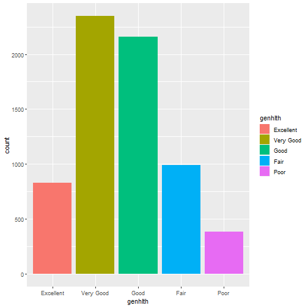
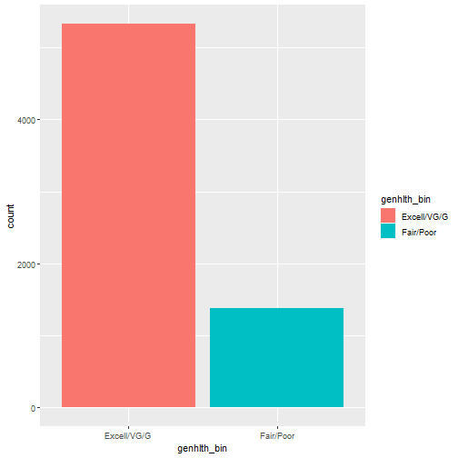
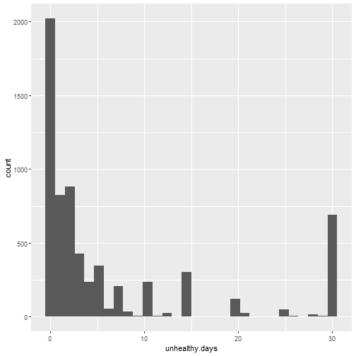
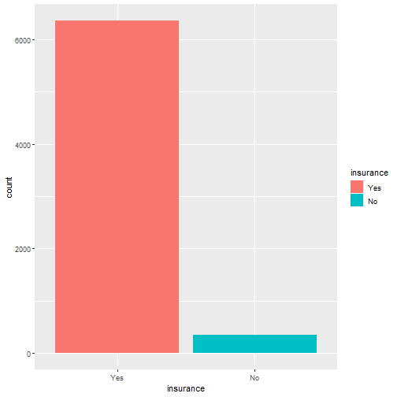
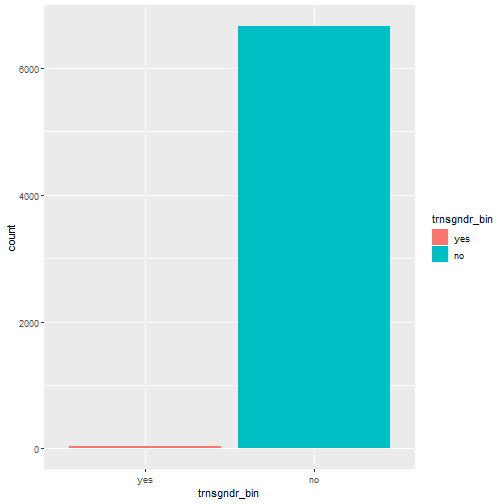
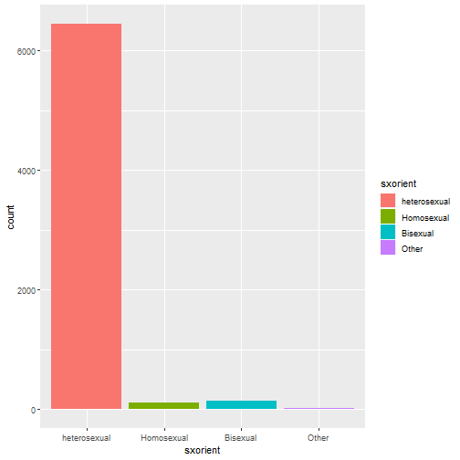
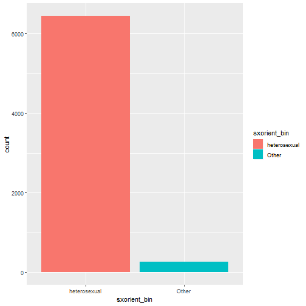
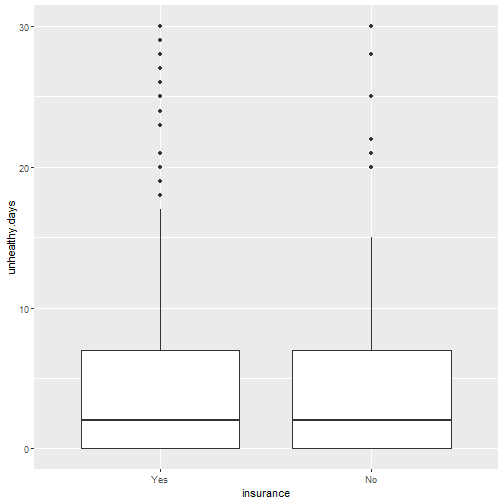
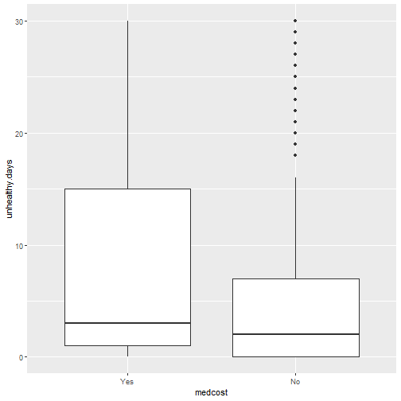

---
title       : Case Study in Data Exploration and Hypothesis Testing
author      : Adam J Sullivan 
job         : Assistant Professor of Biostatistics
work        : Brown University
framework   : io2012        # {io2012, html5slides, shower, dzslides, ...}
highlighter : highlight.js # {highlight.js, prettify, highlight}
hitheme     :  github     # 
widgets     : [mathjax, quiz, bootstrap, interactive] # {mathjax, quiz, bootstrap}
ext_widgets : {rCharts: [libraries/nvd3, libraries/leaflet, libraries/dygraphs]}
mode        : selfcontained # {standalone, draft}
knit        : slidify::knit2slides
logo        : publichealthlogo.png
biglogo     : publichealthlogo.png
assets      : {assets: ../../assets}
---  .segue bg:grey


# Case Study in Data Exploration and Hypothesis Testing

--- .class #id

## The Data

- We will begin working with data from the Behavioral Risk Factor Surveillance System 2014 data. 
- We have a small segment of data that contains information on health and access to healthcare. 

--- .class #id

## The data


```r
load("Data/brfss.rda")
str(brfss2)
```


--- .class #id


```
## 'data.frame':	6706 obs. of  16 variables:
##  $ genhlth       : Factor w/ 5 levels "Excellent","Very Good",..: 4 2 4 3 2 4 2 2 5 1 ...
##  $ genhlth_bin   : Factor w/ 2 levels "Excell/VG/G",..: 2 1 2 1 1 2 1 1 2 1 ...
##  $ unhealthy.days: num  25 0 15 0 0 0 2 23 30 30 ...
##  $ imprace       : Factor w/ 6 levels "white-non-hisp",..: 1 1 1 1 1 5 5 1 1 1 ...
##  $ insurance     : Factor w/ 2 levels "Yes","No": 1 1 1 1 1 1 1 1 1 1 ...
##  $ trnsgndr_bin  : Factor w/ 2 levels "yes","no": 2 2 2 2 2 2 2 2 2 2 ...
##  $ trnsgndr      : Factor w/ 4 levels "yes-mtf","yes-ftm",..: 4 4 4 4 4 4 4 4 4 4 ...
##  $ sxorient_bin  : Factor w/ 2 levels "heterosexual",..: 1 1 1 1 1 1 1 1 1 1 ...
##  $ sxorient      : Factor w/ 4 levels "heterosexual",..: 1 1 1 1 1 1 1 1 1 1 ...
##  $ menthlth      : num  10 2 15 5 2 30 0 4 15 2 ...
##  $ poorhlth      : num  25 0 15 0 0 15 0 5 NA 0 ...
##  $ lsatisfy      : Factor w/ 4 levels "Very Satisfied",..: 2 1 3 2 1 4 1 2 2 2 ...
##  $ lsatisfy_bin  : Factor w/ 2 levels "Satisfied","Disatisfied": 1 1 2 1 1 2 1 1 1 1 ...
##  $ emtsuprt      : Factor w/ 5 levels "Always","Usually",..: 3 2 1 2 1 3 1 2 5 2 ...
##  $ emtsuprt_bin  : Factor w/ 2 levels "Always/Usually",..: 2 1 1 1 1 2 1 1 2 1 ...
##  $ medcost       : Factor w/ 2 levels "Yes","No": 2 2 2 2 2 2 2 2 2 2 ...
```

---  .segue bg:grey

# Codebook

--- .class #id

## General Health

- `genhlth` : Would you say your general health is?
    - Excellent
    - Very Good
    - Good
    - Fair
    - Poor

--- .class #id

## Plot



--- .class #id

## General Health Binary

- `genhlth_bin` : Would you say your general health is?
    - Excellent/Very Good/Good
    - Fair/Poor

--- .class #id

## Plot



--- .class #id

## Unhealthy Days

- `unhealthy.days` : Now thinking about your physical health, which includes physical illness and injury, for how many days during the past
30 days was your physical health not good?
- Values: 0-30

--- .class #id

## Plot




--- .class #id

## Mental Health Days

- `menthlth` : : Now thinking about your mental health, which includes stress, depression, and problems with emotions, for how many
days during the past 30 days was your mental health not good?
- Values: 0-30

--- .class #id

## Plot


--- .class #id

## Poor Physical or Mental Health

- `poorhlth` :  During the past 30 days, for about how many days did poor physical or mental health keep you from doing your usual
activities, such as self-care, work, or recreation?
- Values: 0-30

--- .class #id

## Plot


--- .class #id

## Imputed Race

- `imprace` : Imputed race/ethnicity value (This value is the reported race/ethnicity or an imputed race/ethnicity, if the respondent
refused to give a race/ethnicity. The value of the imputed race/ethnicity will be the most common race/ethnicity response for that region of the state) 
    - White, Non-Hispanic
    - Black, Non-Hispanic
    - Asian, Non-Hispanic
    - American Indian/Alaska Native, Non-Hispanic
    - Hispanic
    - Other Race, Non-Hispanic

--- .class #id

## Plot


--- .class #id

## Insurance

- `insurance` : Do you have any kind of health care coverage, including health insurance, prepaid plans such as HMOs, or government
plans such as Medicare, or Indian Health Service?
    - Yes
    - No

--- .class #id

## Plot




--- .class #id

## Gender

- `trnsgndr` :  Do you consider yourself to be transgender? (If yes, ask “Do you consider yourself to be male-to-female, female-to-male, or gender non-conforming?)
    - Yes, mtf
    - Yes, ftm
    - Yes, non-conforming
    - No

--- .class #id

## Plot


--- .class #id

## Gender Binary

- `trnsgndr_bin` :  Do you consider yourself to be transgender? (If yes, ask “Do you consider yourself to be male-to-female, female-to-male, or gender non-conforming?)
    - Yes
    - No

--- .class #id

## Plot



--- .class #id

## Sexual Orientation

- `sxorient` :  Do you consider yourself to be: (We ask this question in order to better understand the health and health care needs of
people with different sexual orientations.)
    - Heterosexual
    - Homosexual
    - Bisexual
    - Other

--- .class #id

## Plot




--- .class #id

## Sexual Orientation Binary

- `sxorient_bin` :  Do you consider yourself to be: (We ask this question in order to better understand the health and health care needs of
people with different sexual orientations.)
    - Heterosexual
    - Other

--- .class #id

## Plot



--- .class #id

## Life Satisfaction

- `lsatisfy`: In general, how satisfied are you with life?
    - Very Satisfied
    - Satisfied
    - Disatisfied
    - Very Disatisfied

--- .class #id

## Plot


--- .class #id

## Life Satisfaction Binary

- `lsatisfy`: In general, how satisfied are you with life?
    - Satisfied
    - Disatisfied


--- .class #id

## Plot


--- .class #id

## Emotional Support

- `emtsuprt`: How often do you get the social and emotional support you need?
    - Always
    - Usually
    - Sometimes
    - Rarely
    - Never


--- .class #id

## Plot


--- .class #id

## Emotional Support Binary

- `emtsuprt_bin`: How often do you get the social and emotional support you need?
    - Always/Usually
    - Sometimes/Rarely/Never


--- .class #id

## Plot


--- .class #id

## Medical Cost Barrier

- `medcost`: Was there a time in the past 12 months when you needed to see a doctor but could not because of cost?
    - Yes
    - No


--- .class #id

## Plot


---  .segue bg:grey

# Relationships

--- .class #id

## Unhealthy Days  vs Insurance


```
## # A tibble: 2 x 4
##   insurance  mean median    sd
##   <fct>     <dbl>  <dbl> <dbl>
## 1 Yes        6.43      2  9.63
## 2 No         5.95      2  9.20
```


--- .class #id




--- .class #id

## Unhealthy Days  vs Medical Cost


```
## # A tibble: 2 x 4
##   medcost  mean median    sd
##   <fct>   <dbl>  <dbl> <dbl>
## 1 Yes      8.90      3 10.8 
## 2 No       6.09      2  9.40
```


--- .class #id




--- .class #id

## Unhealthy Days  vs Emotional Support


```
## # A tibble: 2 x 4
##   emtsuprt_bin     mean median    sd
##   <fct>           <dbl>  <dbl> <dbl>
## 1 Always/Usually   6.08      2  9.35
## 2 Sometimes-Never  7.98      2 10.6
```


--- .class #id


--- .class #id

## Unhealthy Days  vs Gender


```
## # A tibble: 4 x 4
##   trnsgndr         mean median    sd
##   <fct>           <dbl>  <dbl> <dbl>
## 1 yes-mtf         10.8     2   13.5 
## 2 yes-ftm         10.2     5   12.0 
## 3 yes-non-conform  7.17    3.5 11.5 
## 4 no               6.38    2    9.58
```


--- .class #id


--- .class #id

## Unhealthy Days  vs Gender


```
## # A tibble: 2 x 4
##   trnsgndr_bin  mean median    sd
##   <fct>        <dbl>  <dbl> <dbl>
## 1 yes          10.0     3.5 12.4 
## 2 no            6.38    2    9.58
```


--- .class #id


--- .class #id

## Unhealthy Days  vs Race


```
## # A tibble: 6 x 4
##   imprace         mean median    sd
##   <fct>          <dbl>  <dbl> <dbl>
## 1 white-non-hisp  6.32      2  9.58
## 2 black-non-hisp  8.38      4 10.4 
## 3 asian-non-hisp  4.29      2  7.21
## 4 aian-non-hisp   9.28      3 11.2 
## 5 hisp            6.4       2  9.23
## 6 other-non-hisp  7.29      2  9.78
```


--- .class #id


--- .class #id

## Unhealthy Days by General Health


```
## # A tibble: 5 x 4
##   genhlth    mean median    sd
##   <fct>     <dbl>  <dbl> <dbl>
## 1 Excellent  2.33      1  5.15
## 2 Very Good  3.23      1  6.32
## 3 Good       5.36      2  8.05
## 4 Fair      13.2      10 11.5 
## 5 Poor      23.8      30  9.61
```


--- .class #id


--- .class #id

## Unhealthy Days by General Health


```
## # A tibble: 2 x 4
##   genhlth_bin  mean median    sd
##   <fct>       <dbl>  <dbl> <dbl>
## 1 Excell/VG/G  3.95      1  7.02
## 2 Fair/Poor   16.2      15 12.0
```


--- .class #id


--- .class #id

## Question: Does Reported General Health imply Number of Unhealthy Days

- Consider the data


```
## # A tibble: 2 x 2
##   genhlth_bin `mean(unhealthy.days, na.rm = T)`
##   <fct>                                   <dbl>
## 1 Excell/VG/G                              3.95
## 2 Fair/Poor                               16.2
```

```
## [1] 12.25
```


--- .class #id

## Hypothesis Testing: What is Happening?

- Self Reported Health predicts number of days unhealthy. 
- Groups Differ at Baseline
- Random Chance

--- .class #id

## Groups Differ at Baseline

- We may have noticed that most comparisons in here were not showing a strong connection of unhealthy days. 
- This means that with the data we have, there may not be a problem with groups differing at baseline. 
- On the exam, you can agree with a statement like this or show otherwise. 
- If you were to show otherwise, show a connection between another variable and the outcome (unhealthy days) and that variable and the exposure (self reported health)

--- .class #id

## Hypothesis Testing: What is Happening?

- Self Reported Health predicts number of days unhealthy. 
- <delete>Groups Differ at Baseline</delete>
- Random Chance


--- .class #id

## Random Chance

- We will simulate this. 
- Based on Probabilities


```r
brfss2 %>% 
    group_by(genhlth_bin) %>% 
    summarise(n=n()) %>% 
    mutate(freq=n/sum(n))
```

--- .class #id

## Random Chance

- We will simulate this. 
- Based on Probabilities


```
## # A tibble: 2 x 3
##   genhlth_bin     n  freq
##   <fct>       <int> <dbl>
## 1 Excell/VG/G  5330 0.795
## 2 Fair/Poor    1376 0.205
```

--- .class #id

## Simplify Data


```r
brfss3 <- brfss2 %>%
          select(unhealthy.days, genhlth_bin)
```

--- .class #id

## Simulations

- One simulation

```r
library(tidyverse)
T = dim(brfss2)[1]
health.sim = replicate(T, sample(c("Excell/VG/G", "Fair/Poor"), size=1, prob=c(0.795, 0.205)))
health.sim = enframe(health.sim, name=NULL, value="health.sim")
brfss3 <- bind_cols(brfss3, health.sim)
test <- brfss3 %>% group_by(health.sim) %>% summarise(m=mean(unhealthy.days, na.rm=TRUE))
difference = test$m[1] - test$m[2]
difference
```

```
## [1] -0.1923031
```

--- .class #id

## Simulations


```r
brfss3 <- brfss2 %>%
          select(unhealthy.days, genhlth_bin)
          
diff_sim <- function(data){

health.sim = replicate(T, sample(c("Excell/VG/G", "Fair/Poor"), size=1, prob=c(0.795, 0.205)))
health.sim = enframe(health.sim, name=NULL, value="health.sim")
data <- bind_cols(data, health.sim)
test <- data %>% group_by(health.sim) %>% summarise(m=mean(unhealthy.days, na.rm=TRUE))
difference = test$m[1] - test$m[2]
return(difference)
}

diff = replicate(1000, diff_sim(brfss3))
```


--- .class #id

## Histogram of Simulated Differences


--- .class #id

## How Likely is our value?


```r
mean(diff>12.25)
```

```
## [1] 0
```


--- .class #id

## Hypothesis Testing: What is Happening?

- Self Reported Health predicts number of days unhealthy. 
- <delete>Groups Differ at Baseline</delete>
- <delete>Random Chance</delete>
- **Note there is a possibilty that the number of days was asked first prompting their answer for the general health as well.** 


