---
title       : Sampling Distributions and Central Limit Theorem
author      : Adam J Sullivan 
job         : Assistant Professor of Biostatistics
work        : Brown University
framework   : io2012        # {io2012, html5slides, shower, dzslides, ...}
highlighter : highlight.js # {highlight.js, prettify, highlight}
hitheme     :  github     # 
widgets     : [mathjax, quiz, bootstrap, interactive] # {mathjax, quiz, bootstrap}
ext_widgets : {rCharts: [libraries/nvd3, libraries/leaflet, libraries/dygraphs]}
mode        : selfcontained # {standalone, draft}
knit        : slidify::knit2slides
logo        : publichealthlogo.png
biglogo     : publichealthlogo.png
assets      : {assets: ../../assets}
---  .segue bg:grey


# Law of Large Numbers and Central Limit Theorem

--- .class #id

## Important Statistical Concepts

- Two things we use more than most any other concepts is the Law of Large Numbers (LLN) and the Central Limit Theorem (CLT). 
- There are similar to what we discussed in probability with the idea of looking at things in the long run. 
- In other words considering large sample sizes. 
- We will begin with the Law of Large Numbers. 

--- .class #id

## Law of Large Numbers (LLN)

- As sample size increases, the sample mean becomes closer to the true population mean. 

$$\lim_{n\to\infty}\bar{X}_n= \mu$$

--- .class #id


## Displaying the Law of Large Numbers

- Let's consider flipping a coin. 
- We expect to get heads 50% of the time. 


--- .class #id

## Law of Large Numbers: 10 Coin Tosses

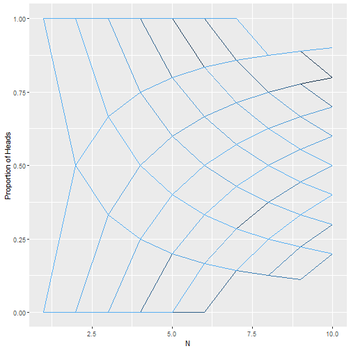


--- .class #id

## Law of Large Numbers: 100 Coin Tosses


--- .class #id

## Law of Large Numbers: 1000 Coin Tosses

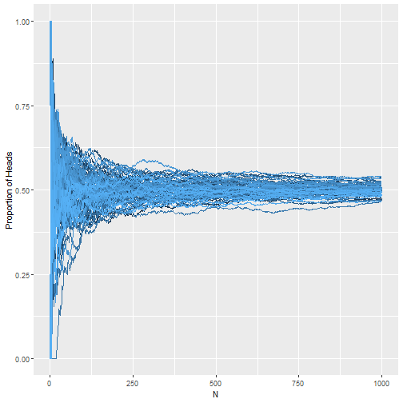


--- .class #id

## Law of Large Numbers: 10000 Coin Tosses

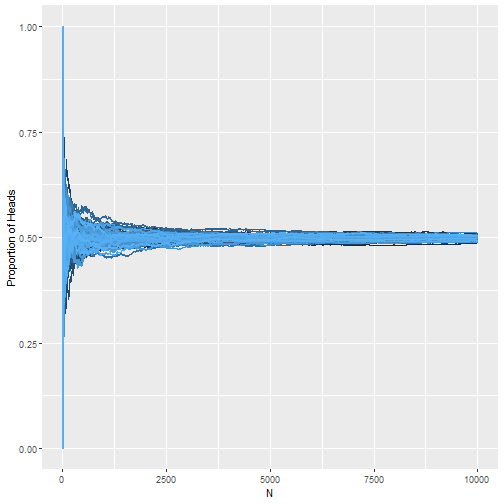


--- .class #id

## Additional Expectations

- Consider rolling a die. 
- Remember that expectation is the center or what we get on average:

$$\dfrac{1+2+3+4+5+6}{6}= 3.5$$

--- .class #id

## LLN Expectation of Dice


--- .class #id

##  LLN Convergence to mean

- I have shown you some examples where we can see that the LLN converges to the true average. 
- How do we know what sample we might need? 
- Answer: Variation matters


--- .class #id

## Consider the Following

- Let's say that we have two groups of people
    - Group A: Heights which are $N(63.8,3.86)$
    - Group B: Heights which are $N(63.8, 12.01)$
- We will sample from these groups and then plot their relationships


--- .class #id

## What do you see? 

- Consider the plots
- What do you notice about the differences?
- What does variation tell us about the LLN?

--- .class #id


## Example 


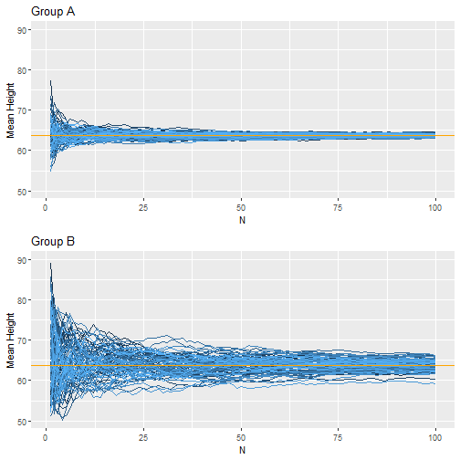


--- .class #id

## What did you see?

- Within about 50 rolls the smaller variance group was very close to the true mean. 
- After 100 rolls the large variance has still not converged on the mean. - The larger the variance, the larger the samples size in order to have the estimate be the true mean. 

--- .class #id

## Why do we care about the LLN?

- If we can get a good sample size, then we can have a true estimate of the population. 
- Casinos care because even with a few good gamblers, in the long run they come ahead and do not lose money. 


--- .class #id

## The Central Limit Theorem

- If you sample repeatedly from the same population with replacement, then the means of each of the samples will be approximately normal in distribution. 
- Break down:
    - Take a sample from any population. 
    - Take the mean. 
    - Repeat this over and over again. 
    - Those means follow a normal distribution. 

--- .class #id

## Assumptions Behind Central Limit Thorem

- Data must be randomly sampled. 
- Sample are independent of each other. 
- Sample size needs to be sufficiently large (LLN). 
- Sample should not be bigger than 10% of the population. (Due to sampling with replacement)

--- .class #id


## Central Limit Theorem with Normal Data

- Let's consider the data from a $N(63.8, 3.86)$. 
- This is already normal but let's sample from this with 10 samples each time and see what the distribution of means looks like. 

--- .class #id

## 10 Samples of 10 Each

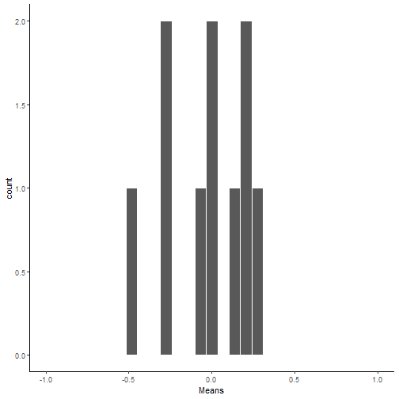


--- .class #id

## 100 Samples of 10 Each

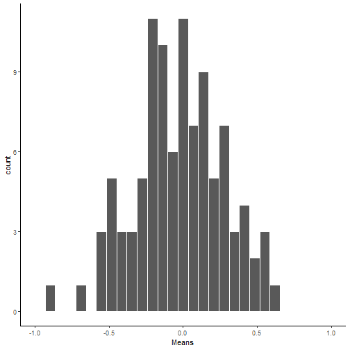


--- .class #id

## 1000 Samples of 10 Each

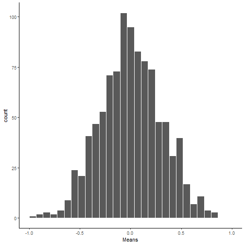


--- .class #id

## 10000 Samples of 10 Each

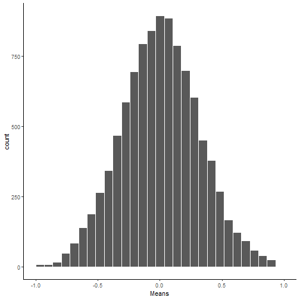

--- .class #id

## Progression

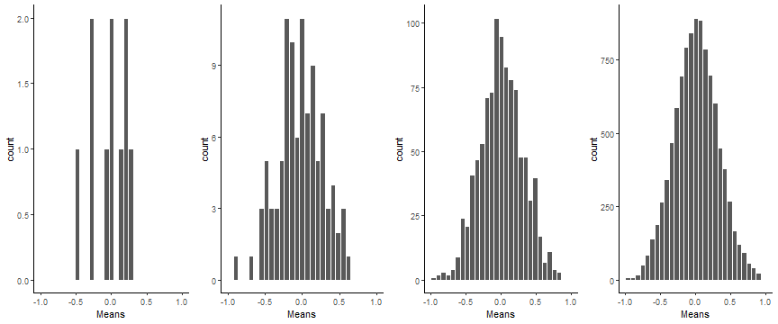


--- .class #id


## Central Limit Theorem with Normal Data

- Let's consider the data from a $N(63.8, 3.86)$. 
- This is already normal but let's sample from this with 100 samples each time and see what the distribution of means looks like. 

--- .class #id

## 10 Samples of 100 Each

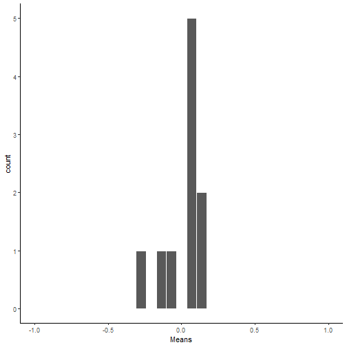


--- .class #id

## 100 Samples of 100 Each

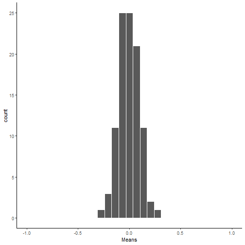


--- .class #id

## 1000 Samples of 100 Each

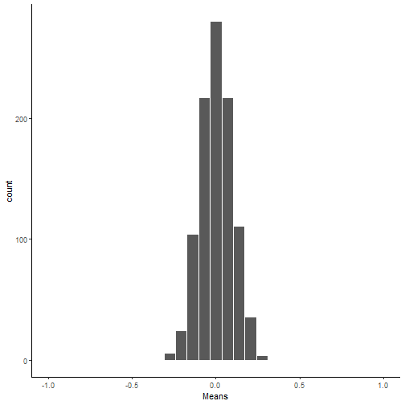


--- .class #id

## 10000 Samples of 10 Each

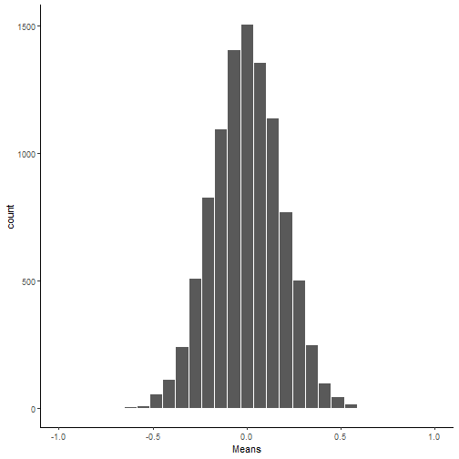

--- .class #id

## Progression

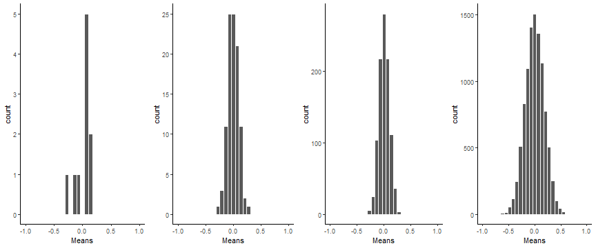


--- .class #id

## Progression of Both

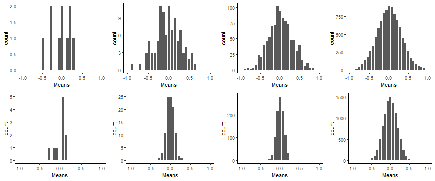

--- .class #id

## Conclusions

- Even with small samples, normally distributed data's means converge to normal relatively quickly. 
- When the sample size of each sample is increased, we see that there is a decrease in the variance of the sample mean distribution. 


--- .class #id

## Non-normal Data

- Consider the Poisson Distribution. 
- Poisson distribution takes on data where we wish to count. 
- It can also be used with rare events data. With Poisson we have a rate and time associated. 
- So let's consider a Poisson distribution with the rate of events beinng 1.2 per day. 

--- .class #id

## Distribution


--- .class #id

## 10 Samples of 10 Each

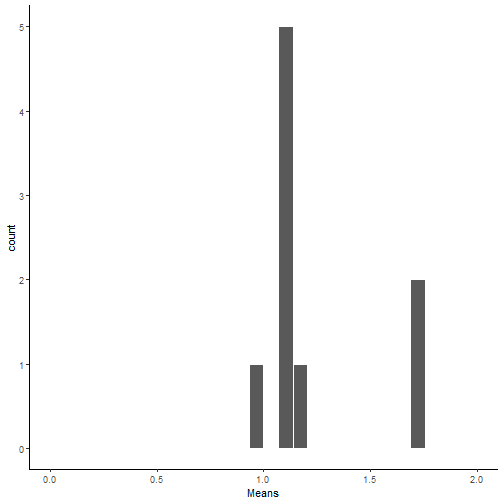


--- .class #id

## 100 Samples of 10 Each

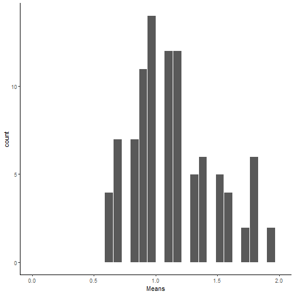


--- .class #id

## 1000 Samples of 10 Each

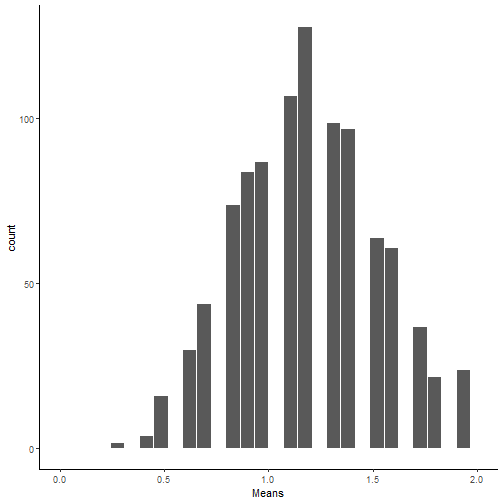


--- .class #id

## 10000 Samples of 10 Each

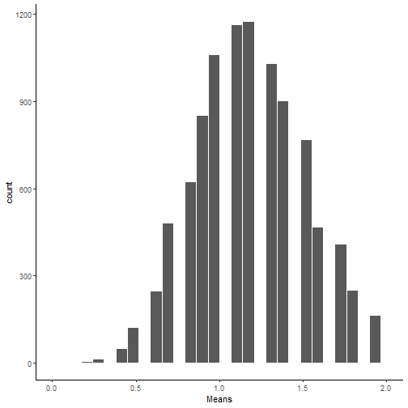

--- .class #id

## Progression


--- .class #id


## Central Limit Theorem with Poisson Data

- We will be looking at the same population with rate of 1.2 per day.
- This time we will do samples of 30 each. 

--- .class #id

## 10 Samples of 30 Each

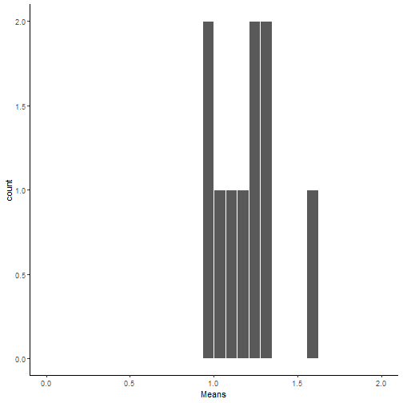


--- .class #id

## 100 Samples of 30 Each

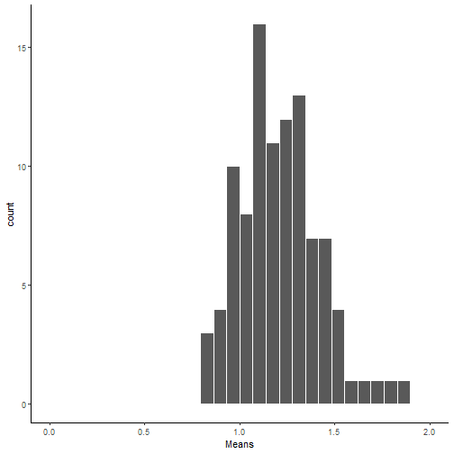


--- .class #id

## 1000 Samples of 30 Each

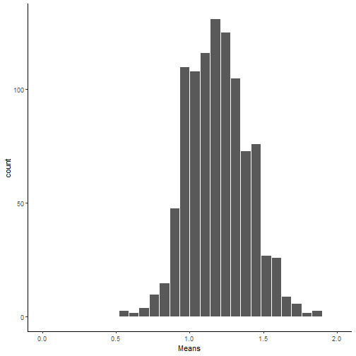


--- .class #id

## 10000 Samples of 30 Each

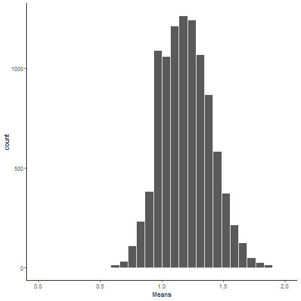

--- .class #id

## Progression

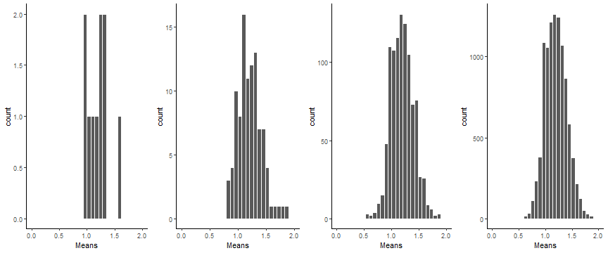


--- .class #id

## Progression of Both

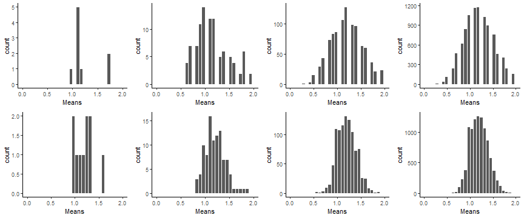


--- .class #id

## Conclusions

- Even with skewed data we can see the sample means have a normal distribution. 
- Once again with the increase in sample size, the distribution of means has a tighter variance. 


--- .class #id

## LLN and CLT review

- The LLN shows us that with a large sample size, the mean of our sample will be the same as the population mean. 
- The CLT states that if we perform sampling over and over again, then the distribution of the means of each sample approaches the normal distribution. 

--- .class #id

## How Do they work together? 

- When we increase sample size the LLN tells us we are closer to our true mean. 
- This means each estimate with a larger sample size is closer to one true value. 
- The CLT takes many many samples and when each of those samples is closer to the true mean, then there is less variance. 
- We have seen both of these work together. 

--- .class #id

## Variance of Sampling Distributions

- Consider the previous example with the Poisson Distribution with rate 1.2. 
- We generated the sample to display the distribution


```r
data <- rpois(100000000, 1.2)
```


--- .class #id

## Mean and Variance of Poisson

- Mean: 1.1998299
- Var: 1.1998921

--- .class #id

## Sampling distributions


```r
t=1000000
n=10

scores <- rpois(t*n, 1.2)
samples <- rep(1:t,each=n)
my_df <- data.frame(samples,scores)

# get the means of the samples

my_df %>%
    group_by(samples) %>%
    summarise(means=mean(scores)) %>%
    summarise(var(means))
```


--- .class #id

## Sampling distributions


```
## # A tibble: 1 x 1
##   `var(means)`
##          <dbl>
## 1        0.120
```


--- .class #id

## Sampling distributions


```r
t=1000000
n=100

scores <- rpois(t*n, 1.2)
samples <- rep(1:t,each=n)
my_df <- data.frame(samples,scores)

# get the means of the samples

my_df %>%
    group_by(samples) %>%
    summarise(means=mean(scores)) %>%
    summarise(var(means))
```


--- .class #id

## Sampling distributions


```
## # A tibble: 1 x 1
##   `var(means)`
##          <dbl>
## 1       0.0120
```


--- .class #id

## What do we see?

- Original Distribution 1.2
- Variance of Means of Samples size 10: 0.12
- Variance of Means of Samples size 100: 0.012


--- .class #id

## Conclusions

- With a sample of size 10, the variance of the sample means are 1/10th the original. 
- What a sample of size 100, the variance of the sample means are 1/100th the original. 

--- .class #id

## Other samples

What if the sample is size 26:


```
## # A tibble: 1 x 1
##   `var(means)`
##          <dbl>
## 1       0.0460
```


--- .class #id

## Comparing Variance

- Variance of means with sample size 26: `round(var3, 3)`
- Variance of original divided by 26: 0.0461538

--- .class #id

## Variance of Sample Means

- In short, if the variance of a distribution is $\sigma^2$, then the variance of the sample means is $\dfrac{\sigma^2}{n}$. 
- Given that each sample is of size $n$. 
- This means that the larger the sample, the smaller the variance. 

--- .class #id

## Sampling Distribution of the mean

- Consider taking samples of size $n$ from a population. 
- Then the mean, $\bar{X}$, will follow a normal distribution. 
- Specifically:
$$ \bar{X} \sim N\left(\mu, \dfrac{\sigma^2}{n}\right)$$
- Where, $\mu$ is the mean of the population. 

--- .class #id

## Why is this special? 

- Many times data follows a distribution where we do not know the exact distribution of the data. 
- We can then use the mean and the central limit theorem to assume that the mean follows a normal distribution. 
- This means we now understand what the mean is, how it varies and all information on probabilities associated with it. 

