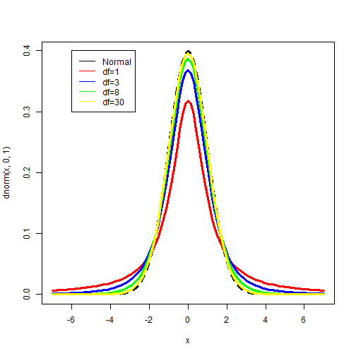

---
title       : Confidence Intervals
author      : Adam J Sullivan 
job         : Assistant Professor of Biostatistics
work        : Brown University
framework   : io2012        # {io2012, html5slides, shower, dzslides, ...}
highlighter : highlight.js # {highlight.js, prettify, highlight}
hitheme     :  github     # 
widgets     : [mathjax, quiz, bootstrap, interactive] # {mathjax, quiz, bootstrap}
ext_widgets : {rCharts: [libraries/nvd3, libraries/leaflet, libraries/dygraphs]}
mode        : selfcontained # {standalone, draft}
knit        : slidify::knit2slides
logo        : publichealthlogo.png
biglogo     : publichealthlogo.png
assets      : {assets: ../../assets}
---  .segue bg:grey


# Beginning Confidence Intervals

--- .class #id

## Statistical Estimates


- We have been discussing many types of estimates
    - mean
    - median
    - min
    - max
- These are all what we call point estimates. 
- Estimates are almost always wrong.

--- .class #id

## Problems with Samples

- Each time we sample, we get a different mean. 
- The center of the mean distribution is the true mean of the population but we have no way of knowing if our sample mean is the true mean. 
- How do we deal with this?

--- .class #id

## What can we do? 

- We know we are probably wrong. 
- We wish to understand just how wrong we are. 
- We use a confidence interval (CI)


--- .class #id

## Confidence Intervals

- We quanity how wrong by calculating a **margin of error (MOE)**. 
- We then add and subtract this from our estimate
$$\text{CI} = \text{Point Estimate} \pm \text{MOE}$$


--- .class #id

## Margin of Error

- This is the maximum amount of error we expect in our point estimate. 
- We wish to quantify this within a certain amount of confidence. 
- We call this: 
    - "level of confidence"
    - "confidence level"
- The margin of error is found by using the probability distribution of the point estimate. 

--- .class #id

## Confidence Interval on the Mean

- We already know the distribution of the sample mean. 
- This distribution is normal, so we can find which value of a normal would give us a certain confidence. 
- Suppose we wish to have 95% confidence, then we wish to know what value of the normal distribution give us 95%. 
- We need the values that would then cut 2.5% on the left of and 2.5% on the right. This would then mean 95% in the middle. 
- We can do this in R. 

--- .class #id

## Critical Values


```r
# 2.5 Percentile

qnorm(0.025)

# 9.5 Percentile
qnorm(0.975)
```

```
## [1] -1.959964
## [1] 1.959964
```


--- .class #id

## What do we see? 

- The normal is symmetric, so we can see that the values are -1.96 and 1.96. 
- We can just use the positive value here as both will help the same way. 


--- .class #id

## Making the Confidence Interval

$$\bar{x} \pm z * \dfrac{sigma}{\sqrt{n}}$$

- Where:
    - $\bar{x}$ is the sample mean. 
    - $z$ critical value assocatiated with % of confidence
    - $\sigma$ is population standard deviation. 
    - $n$ is the sample size. 

--- .class #id

## Example


```r
data <- rbinom(10, 10, 0.3)

mn <- mean(data)
std.dev <- sd(data)

mn - 1.96*std.dev
mn + 1.96*std.dev
```


--- .class #id

## Example


```
## [1] 0.215969
## [1] 0.784031
```


--- .class #id

## What does this mean? 

- It means that 95% of the intervals constructed like this will cover over thepopulation mean. 
- Consider the following app:
- [Agresti Shiny App](https://istats.shinyapps.io/ExploreCoverage/)

--- .class #id

## Interpretation

- The interpretation for the previous example is that we are 95% sure that the interval (0.215969, 0.784031) contains the mean. 
- This is not the same as saying there is a 95% chance that the population mean is in this interval. 

--- .class #id

## Interpretation

- While it seems similar, you must remember. 
- There is one true population mean. 
- You construct a sample, then you create a confidence interval. 
- We said that with a 95% confidence interval we know that 95% of these intervals will cover the true mean. 
- The interval is what moves each time. 

--- .class #id

## What about when we do not know $\sigma$? 

- We have shown an example of a binomial where we know the standard devation of the popultion, $\sqrt{n*p*(1-p)}$. 
- What happens when we do not know this? 
- The Student's T Distribution!

--- .class #id

## Student's T Distribution

- Created by a man named Sealy Gosset in 1908. 
- Published under the name "Student" as he was working for Guinness Brewery in Dublin at the time. 
    - Either he didn't want to be known or Guinness did not. 
- His Desire what to understand the distribution of small samples of data. 
- This was for his work in analyzing barley for beer where they may have only very few samples. 

--- .class #id

## Standard Normal

- The standard normal is a normal distribution with mean 0 and variance 1. 
- This is important since if we have:
$$ X\sim N(\mu, \sigma^2)$$
- Then we can standardize this as:

$$Z = \dfrac{X-\mu}{\sigma}$$

--- .class #id

## In Sample Data

- We know that $\bar{X}$ is normal such that
$$ \bar{X}\sim N\left(\mu, \dfrac{\sigma^2}{n}\right)$$
- Then we can make this a standard normal:

$$Z= dfrac{X-\mu}{\sigma/\sqrt{n}}$$

--- .class #id

## Student's t Distribution

$$t_{n-1} = \dfrac{\bar{X}-\mu}{S/\sqrt{n}}$$

- Where:
    - $t_{n-1}$ represents a t distribution with $n-1$ degrees of freedom. 
    - S is the sample variance:
$$S=\dfrac{1}{n-1}\sum_{i=1}^n(x_i-\bar{X})^2$$

--- .class #id

## Student's t Distribution plots




--- .class #id

## Student's t Confidence Intervals

- Let's assume we have some data that we believe to be a from a normal distribution. 
- We then would wish to create confidence intervals for the mean. 
$$\text{CI} = \text{Point Estimate} \pm \text{MOE}$$
$$ \bar{x} \pm t * \dfrac{S}{\sqrt{n}}$$

--- .class #id

## Example

- We can simulate some data:
- 10 Samples from a $N(63.8, 3.86)$ distribution. 

```r
data = rnorm(10, 63.8, 3.86)
```
- In real life we have data that is normal yet we do not know $\sigma$. 

--- .class #id

## Margin of Error

- We know that we need to calculate the margin of error. 
$$\text{MOE} = z*\dfrac{\sigma}{\sqrt{n}}$$
- We do not know $\sigma$ but we can calculate $S$. 
$$\text{MOE} = t*\dfrac{S}{\sqrt{n}}$$


--- .class #id

## Critical Value of $t$


```r
# 2.5 percentile
qt(0.025, 9)

# 97.5 percentile
qt(0.975, 9)
```

```
## [1] -2.262157
## [1] 2.262157
```

--- .class #id

## What can we see?

- The critical value is 2.26. 
- This is larger than the critical value for the standard normal. 
- Why might this be? 


--- .class #id

## Using R to Calculate


```
## [1] 53.99775
## [1] 75.43369
```


--- .class #id

## Recap

- We have the concept of a Confidence Interval, which is our sample mean plus or minus some margin of error. 
- In order to find that margin of error we needed to use a critical value. 
- Those critical values came from the "Normal" and "Student's t" Distributions.
- What does that mean? 

--- .class #id

## Confidence Intervals without Normal Assumption

- What if we wish to find intervals without assuming we have  a normal distribution? 
- We can do a technique called ***bootstrapping***
--- .class #id
