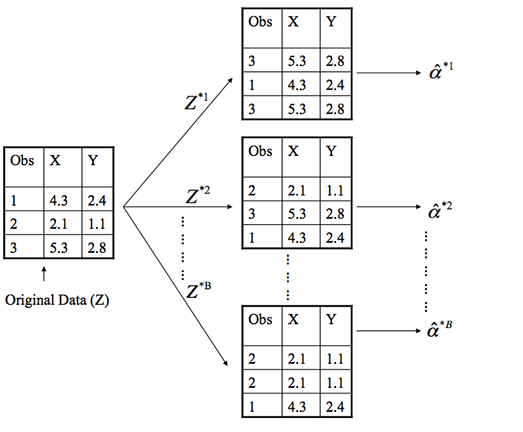

---
title       : Confidence Intervals - part 2
author      : Adam J Sullivan 
job         : Assistant Professor of Biostatistics
work        : Brown University
framework   : io2012        # {io2012, html5slides, shower, dzslides, ...}
highlighter : highlight.js # {highlight.js, prettify, highlight}
hitheme     :  github     # 
widgets     : [mathjax, quiz, bootstrap, interactive] # {mathjax, quiz, bootstrap}
ext_widgets : {rCharts: [libraries/nvd3, libraries/leaflet, libraries/dygraphs]}
mode        : selfcontained # {standalone, draft}
knit        : slidify::knit2slides
logo        : publichealthlogo.png
biglogo     : publichealthlogo.png
assets      : {assets: ../../assets}
---  .segue bg:grey


```{r setup, include = FALSE, cache = FALSE}
knitr::opts_chunk$set(error = TRUE)
knitr::opts_chunk$set(warning=FALSE)
knitr::opts_chunk$set(message=FALSE)
knitr::opts_chunk$set(results="hold")
knitr::opts_chunk$set(cache=FALSE)
library(ggplot2)
library(fivethirtyeight)
require(tidyverse)
library(broom)
```

# Continuing Confidence Intervals


--- .class #id

## Advantages

- Very simple once you get used to it. 
- Straight forward and does not require extra data. 
- Works with extremely complex things where you may not understand the math enough to find a margin of error. 
- Naturally checks for stability. 
- Many times more accurate than a normal distribution assumption. 

--- .class #id

## Disadvantages

- Works well with small data but does not have any guarantees with small data. 
- Hidden assumptions:
    - independence of samples. 
    - Population is large enough that the sample effect is not too big. 
    - Others depending on what statistic you are bootstrapping. 
    


--- .class #id

## What does it do?

- Basically, bootstrapping treats the data as a population. 
- The we repeatedly draw independent samples to create *bootstrapped* datasets. 
- We sample with replacement, allowing observations to be sampled more than once. 


--- .class #id





--- .class #id

## How do we do this?

- Each bootstrap data set $$Z^{*1}, Z^{*2}, \dots, Z^{*B}$$ contains *n* observations, sampled with replacement from the original data set.  
- Each bootstrap is used to compute the estimated statistic we are interested in $\hat\alpha^*$. 


--- .class #id

## Then what?

- We can then use all the bootstrapped data sets to compute the standard error of $$\hat\alpha^{*1}, \hat\alpha^{*2}, \dots, \hat\alpha^{*B}$$ desired statistic as
$$ SE_B(\hat\alpha) = \sqrt{\frac{1}{B-1}\sum^B_{r=1}\bigg(\hat\alpha^{*r}-\frac{1}{B}\sum^B_{r'=1}\hat\alpha^{*r'}\bigg)^2}  \tag{4} $$
- $$SE_B(\hat\alpha)$$ serves as an estimate of the standard error of $$\hat\alpha$$ estimated from the original data set. 

--- .class #id

## Example 1: Estimating the accuracy of a single statistic

- Performing a bootstrap analysis in R entails two steps:
    1. Create a function that computes the statistic of interest.
    2. Use the `boot` function from the [`boot`](http://cran.r-project.org/web/packages/boot/index.html) package to perform the boostrapping

--- .class #id


## The Data

- This data comes from out midterm. 
- We were considering whether or not the number of poor mental health days in the past 30 days was different for those apart of the transgender experience. 
- We first might be interested in understanding the average number of days for both groups. 


--- .class #id


## Doing this with tidyverse

- You will need the following packages:
   
```{r}
library(rsample)
library(purrr)
library(ggplot2)
library(dplyr)
load("../Notes/Data/brfss.rda")
```

--- .class #id

## The Data

```{r}
brfss3 <- brfss2 %>%
      filter(trnsgndr_bin=="no") %>%
      select(menthlth)
```


--- .class #id

## Generate Bootstraps

- Let's say we want to do 1000 bootstraps

```{r, eval=F}
bt_data <- bootstraps(brfss3, times = 1000)
bt_data
```


--- .class #id

## Generate Bootstraps


```{r, echo=F}
set.seed(123)
bt_data <- bootstraps(brfss3, times = 1000)
bt_data
```


--- .class #id

## Structure of Bootstraps

```{r}
bt_data$splits[[1]]
```

- 6663 values in the bootstrap. 
- 2465 observations picked. 
- 6663 values in original sample. 

--- .class #id

## Creating our function

- We need a function to create the bootstrap over. 

```{R}
get_mean <- function(split) {
  # access to the sample data 
  split_data <- analysis(split)
  # calculate the sample mean value 
  split_mean <- mean(split_data$menthlth, na.rm=T)
  return(split_mean)
}
```


--- .class #id

## Pass Function to Bootstraps


```{R, echo=FALSE}
bt_data$bt_means <- map_dbl(bt_data$splits, get_mean)
bt_data
```


--- .class #id

## What does the distribution look like? 

```{r, eval=F}

ggplot(bt_data, aes(x = bt_means)) + 
  geom_line(stat = "density") + 
  xlab("Mean of Poor Mental Health Days")
```


--- .class #id

## What does the distribution look like? 

```{r boot-means-density, echo=F}

ggplot(bt_data, aes(x = bt_means)) + 
  geom_line(stat = "density") + 
  xlab("Mean of Poor Mental Health Days")
```


--- .class #id


## Confidence Intervals

- We can get this with the following function

```{r}
bt_ci <- round(quantile(bt_data$bt_means, c(0.025, 0.975)), 3)
bt_ci
```


--- .class #id

## What about traditional ways?

```{r}
brfss3 %>% 
    summarise(mean(menthlth, na.rm=T), sd(menthlth, na.rm=T), n=n())
 qt(0.975, df=6662)

5.498013 - 1.96032 * 8.639915/sqrt(6663)
5.498013 + 1.96032 * 8.639915/sqrt(6663)
```


--- .class #id

## What do we notice?

- Not a big difference in confidence intervals. 
- Value of t is the same as the normal. 


--- .class #id

## Graph of this


```{r boostrap-ci, echo=F}
bt_ci_lower <- quantile(bt_data$bt_means, c(0.025))
bt_ci_upper <- quantile(bt_data$bt_means, c(0.975))
bt_mean <- mean(bt_data$bt_means)
 
bt_data <- bt_data %>% 
  dplyr::mutate(Color = ifelse(bt_means < bt_ci_lower | bt_means > bt_ci_upper, "Out of 95% CI", "In 95% CI"))
 
 
ggplot(bt_data, aes(x = bt_means, y = 0)) + 
  geom_jitter(aes(color = Color), alpha = 0.6, size = 3, width = 0) + 
  geom_vline(xintercept = round(c(bt_ci_lower, bt_mean, bt_ci_upper),2), linetype = c(2,1,2)) + 
  scale_x_continuous(breaks = round(c(bt_ci_lower, bt_mean, bt_ci_upper),2),
                     labels = c("Lower CI (95%)", "Mean", "Upper CI (95%)"),
                     sec.axis = sec_axis(~., breaks = round(c(bt_ci_lower, bt_mean, bt_ci_upper),2),
                                         labels = round(c(bt_ci_lower, bt_mean, bt_ci_upper),2))) + 
  scale_color_manual(values = c("gray40", "firebrick4")) + 
  theme_void() + 
  theme(legend.title = element_blank(),
        legend.position = "top", 
        legend.text = element_text(size = 14), 
        axis.text.x = element_text(size = 14))
```


--- .class #id

## More Difficult Confidence Intervals 

- Consider the difference in poor mental health among different groups. 
- We can consider the difference between `emtsuprt_bin`. 
- We may wish to know if those with emotional support have less poor mental health days than those without emotional support. 

--- .class #id

## Graphing Relationship

```{R emt-supt-metnhlth, echo=F}
load("Data/brfss.rda")
library(dplyr)
library(ggplot2)
ggplot(brfss2, aes(x=emtsuprt_bin, y=menthlth)) + geom_boxplot()
```

--- .class #id

## What Can we see?

- The median appears to be higher in the group without as much emotional support. 
- It can be hard to tell if there is a difference with the variation between the groups. 
-  We can see a relationship but are unsure if it is due to chance or not. 

--- .class #id

## Hypothesis Testing

- What can be happening? 
    - Emotional Support influences mental health days. 
    - Groups differed at Baseline. 
    - Random Chance


--- .class #id

## Random Chance

- We can test this with the permutations as we did in lecture 13 and on the exam. 
- Let's do this with a permutation test. 

--- .class #id

## Proportions

```{R}
brfss2 %>% 
    group_by(emtsuprt_bin) %>% 
    summarise(n=n()) %>% 
    mutate(freq=n/sum(n))
```

--- .class #id

## The Code

```{r}
library(tidyverse)
brfss3 <- brfss2 %>%
          select(menthlth, emtsuprt_bin) %>%
          filter(!is.na(menthlth) & !is.na(emtsuprt_bin))
          
diff_sim <- function(data){
T=dim(data)[1]
health.sim = replicate(T, sample(c("Always/Usually", "Sometimes-Never"), size=1, prob=c(0.828, 0.172)))
health.sim = enframe(health.sim, name=NULL, value="health.sim")
data <- bind_cols(data, health.sim)
test <- data %>% group_by(health.sim) %>% summarise(m=mean(menthlth, na.rm=TRUE))
difference = test$m[1] - test$m[2]
return(difference)
}

diff = replicate(1000, diff_sim(brfss3))
```


--- .class #id

## The outcome

```{r emtsuprt-menthlth-diff,  echo=F}
ggplot(data=NULL, aes(diff)) + geom_histogram(binwidth = 0.1)
```


--- .class #id

## The Difference in the Data

```{r}

brfss2 %>%
    group_by(emtsuprt_bin) %>%
    summarise(mean(menthlth, na.rm=T))

#Difference

4.52-10.3

mean(diff<=-5.78)
```


--- .class #id

## What do we see? 

- If we randomly assign people to emotional support or no emotional support, the average difference in poor mental health days is centered around 0 days. 
- However, we saw that those with support have on average $\approx 6$ days. 
- What other ways could we consider this? 


--- .class #id

## In Comes Confidence Intervals

- Let's create our confidence intervals. 

```{r}
brfss2 %>%
    group_by(emtsuprt_bin) %>%
    summarise(mean(menthlth, na.rm=T), sd(menthlth, na.rm=T))
```

--- .class #id

## What can we do? 

- Our normal way of doing this gives us 2 means and 2 standard deviations. 
- We do not know how to handle this. 
- We could think of the mean of the differences but we cannot find the SD of this. 
- Why cant we find the SD?

--- .class #id

## Bootstrapping Saves the Day

- We can bootstrap in this instance. 
- Even if we do not have a nice way to calculate the standard error, bootstrapping will work for us. 


--- .class #id
## The Data

```{r}
brfss4 <- brfss2 %>%
    select(menthlth, emtsuprt_bin)
```

--- .class #id


## The bootstraps

- We will create 1000 bootstraps

```{r, eval=F}
set.seed(123)
bt_data2 <- bootstraps(brfss4, times = 1000)
bt_data2
```


--- .class #id

## The bootstraps

- We will create 1000 bootstraps

```{r, echo=F}
set.seed(123)
bt_data2 <- bootstraps(brfss4, times = 1000)
bt_data2
```


--- .class #id

## What the data is like. 

```{r, eval=F}
analysis(bt_data2$splits[[1]]) %>% as_tibble()
```


--- .class #id

## What the data is like. 

```{r, echo=F}
analysis(bt_data$splits[[1]]) %>% as_tibble()
```


--- .class #id


## Creating our function


```{R}
get_diff <- function(splits) {
  d <- analysis(splits)
  mean_yes <- mean(d$menthlth[d$emtsuprt_bin=="Always/Usually"], na.rm=T) 
  mean_no <- mean(d$menthlth[d$emtsuprt_bin=="Sometimes-Never"], na.rm=T)
  mean_yes - mean_no
}
```


--- .class #id

## Get Differences

```{R}
bt_data2$bt_diff <- map_dbl(bt_data2$splits, get_diff)
```


--- .class #id

## What does the distribution look like? 

```{r, eval=F}

ggplot(bt_data2, aes(x = bt_diff)) + 
  geom_line(stat = "density") + 
  xlab("Difference in Average Poor Mental Health Days (Emotional SUpport vs Not)")
```


--- .class #id

## What does the distribution look like? 

```{r brfss-diff-density, echo=F}

ggplot(bt_data2, aes(x = bt_diff)) + 
  geom_line(stat = "density") + 
  xlab("Difference in Average Poor Mental Health Days (Emotional SUpport vs Not)")
```


--- .class #id


## Confidence Intervals

- We can get this with the following function

```{r}
bt_ci <- round(quantile(bt_data2$bt_diff, c(0.025, 0.975)), 3)
bt_ci
```


--- .class #id


## What does this mean? 

- We are 95% confident that on average, those with emotional support have less poor mental health days than those without it.
- Approximately, 6.482 to 5.093 less days. 


--- .class #id

## Graph of this


```{r boostrap-ci-diff, echo=F}
bt_ci_lower <- quantile(bt_data2$bt_diff, c(0.025))
bt_ci_upper <- quantile(bt_data2$bt_diff, c(0.975))
bt_diff <- mean(bt_data2$bt_diff)
 
bt_data2 <- bt_data2 %>% 
  dplyr::mutate(Color = ifelse(bt_diff < bt_ci_lower | bt_diff > bt_ci_upper, "Out of 95% CI", "In 95% CI"))
 
 
ggplot(bt_data2, aes(x = bt_diff, y = 0)) + 
  geom_jitter(aes(color = Color), alpha = 0.6, size = 3, width = 0) + 
  geom_vline(xintercept = round(c(bt_ci_lower, bt_diff, bt_ci_upper),2), linetype = c(2,1,2)) + 
  scale_x_continuous(breaks = round(c(bt_ci_lower, bt_diff, bt_ci_upper),2),
                     labels = c("Lower CI (95%)", "Mean", "Upper CI (95%)"),
                     sec.axis = sec_axis(~., breaks = round(c(bt_ci_lower, bt_diff, bt_ci_upper),2),
                                         labels = round(c(bt_ci_lower, bt_diff, bt_ci_upper),2))) + 
  scale_color_manual(values = c("gray40", "firebrick4")) + 
  theme_void() + 
  theme(legend.title = element_blank(),
        legend.position = "top", 
        legend.text = element_text(size = 14), 
        axis.text.x = element_text(size = 14))
```


--- .class #id

## Hypothesis Testing

- What can be happening? 
    - Emotional Support influences mental health days. 
    - Groups differed at Baseline. 
    - <strike> Random Chance </strike>
