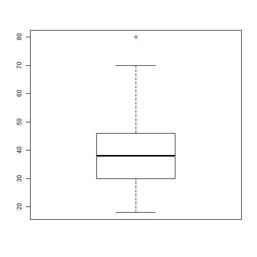
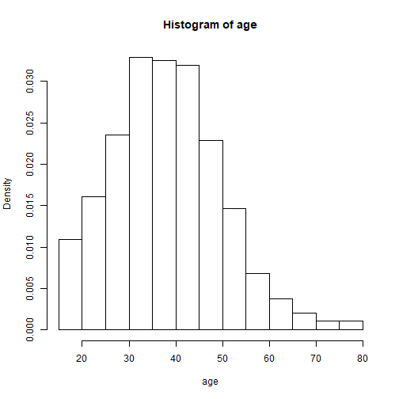

---
title       : Poisson Regression
author      : Adam J Sullivan 
job         : Assistant Professor of Biostatistics
work        : Brown University
framework   : io2012        # {io2012, html5slides, shower, dzslides, ...}
highlighter : highlight.js # {highlight.js, prettify, highlight}
hitheme     :  github     # 
widgets     : [mathjax, quiz, bootstrap, interactive] # {mathjax, quiz, bootstrap}
ext_widgets : {rCharts: [libraries/nvd3, libraries/leaflet, libraries/dygraphs]}
mode        : selfcontained # {standalone, draft}
knit        : slidify::knit2slides
logo        : publichealthlogo.png
biglogo     : publichealthlogo.png
assets      : {assets: ../../assets}
---  .segue bg:grey


# Random Sampling


--- .class #id

## Random Sampling

- Simple Random Sampling is where each member of the population has the same probability of being sampled. 
- The goal is to produce a representative sample that does not have problems with selection bias. 


--- .class #id

## Sampling Error and Bias

- Sampling error is the inherent error that is a produce of the variation of different samples. 
    - Can change with survey design.
    - Clustering and Stratification add further errors and bias in. 
- Bias:  Difference between estimator's value based on sample and the true value of the
population parameter being estimated. 
    - An estimate is biased if the *center* of it's distribution is not the population mean. 


--- .class #id

## Bias Variance Tradeoff


--- .segue bg:grey

# Why Surveys


--- .class #id

## Why Surveys

- Randomly sampling from populations can be extremely expensive
- Many times you also want to guarantee that you reach certain parts of population that you you are concerned about having enough information on. 
- We use Surveys to save cost and make sure we hear from specific subpopulations we are interested in.


--- .class #id


## Types of Survey Data


- **Stratified Sampling** - Sample across different strata to make representative. 
- **Cluster Sampling** - Sample across clusters, for example neighborhoods. 
- **Weighted Sampling** - You may choose to oversample from important subpopulations, for example ethnic minorities or impoverished neighborhoods. 


--- .class #id


## How Does this Change our Analysis?

- We can no longer assume that everyone has an equal probability of being selected. 
- We assume that we know a certain probability of being selected, $\pi_i$ for each individual. 
- We then need to weight based on this $\pi_i$


--- .class #id

## How Does this Change our Anaysis?

- For example if we randomly sample from the population a good estimate for the total sample size is simple
\[T_x = \sum_{i=1}^N x_i\]
- For a survey we sampled based on unequal probabilities
\[T_X = \sum_{i=1}^N \dfrac{1}{\pi_i}x_i\]


--- .class #id


## What else does this effect?

- We no longer get the correct estimate of variance.
- We need to adjust things like means for the new total population. 


--- .class #id

## Methods for Variance?

- We could estimate variances using:
    - delta method
    - jackknife
    - bootstrap
    - Other resampling tools


--- .class #id


## What Do we Do?

- We can no longer use regular summary, regression or even graphic techniques. 
- Each person does not count as 1 anymore in this data. 
- Luckily statistical software has been created to deal with these issues. 


--- .class #id

## What Do we Need to Know?

- Describing your survey design. 
- Summary Statistics
- Tables
- Graphics
- Regression Modeling
- Calibration


--- .segue bg:grey


# The `survey` package in R


--- .class #id

## Enter the `survey` Package in R

- The survey package in R has been built to handle survey data.
- It can do all of the procedures above. 
- It can also work directly with databases for connecting to surveys stored in databases. 


--- .class #id


## Describing the Design

```
library(survey)
brfss.design <- svydesign(data=brfss, nest=TRUE,
weight= ~llcpwt,id= ~psu, strata= ~ststr) 
```

- `data` the data for your survey.
- `nest` if your data needs to be relabeled due to nesting.
- `weight` weights for the specific sampling.
- `id` unique ids for the sampling groups. 
- `strata` strata that weights and ids refer to. 


--- .class #id

## Enter BRFSS Data

- BRFSS is the Behavioral Risk Factor Surveillance System (BRFSS).
- This is a national health-related telephone survey. 
- There are more than 400,000 interviews done every year from all 50 states and the district of Columbia. 
- To learn more about this survey please go to their website: [Behavioral Risk Factor Surveillance System](http://www.cdc.gov/brfss/). 


--- .class #id

## BRFSS Information


* [Codebook](http://www.cdc.gov/brfss/annual_data/2014/pdf/codebook14_llcp.pdf)
* [Data](https://drive.google.com/file/d/0B8CsRLdwqzbzd1RrRWp2RnBGTDg/view?usp=sharing)
* [Variable Layout](http://www.cdc.gov/brfss/annual_data/2014/llcp_varlayout_14_onecolumn.html)


--- .class #id


## Reading the Data 


--- .class #id


```r
# Download file and then run this code:
# https://drive.google.com/open?id=1KiFP1xip0aM5sq7W8Mg-TRmi-34TaIXw

load("BRFSS_2014.rda")
names(brfss) <- tolower(names(brfss)) # Make sure they line up with SAS names
names(brfss) <- gsub("x_", "", names(brfss)) # Make sure they line up with SAS names
```


--- .class #id


## The Design in R


```r
library(survey)
brfss.design <- svydesign(data=brfss_sub_com, nest=TRUE,  
                          weight= ~llcpwt,id= ~psu, strata= ~ststr) 
```


--- .class #id


## What Does this tell us?


```r
brfss.design
```

```
## Stratified Independent Sampling design (with replacement)
## svydesign(data = brfss_sub_com, nest = TRUE, weight = ~llcpwt, 
##     id = ~psu, strata = ~ststr)
```


--- .class #id


## What else can we view?


```r
summary(brfss.design)
```


--- .class #id

## What else can we view?

```
Stratified Independent Sampling design (with replacement)
svydesign(data = brfss_sub_com, nest = TRUE, weight = ~llcpwt, 
    id = ~psu, strata = ~ststr)
Probabilities:
     Min.   1st Qu.    Median      Mean 
0.0000346 0.0012320 0.0030010 0.0076400 
  3rd Qu.      Max. 
0.0071610 0.7931000 
Stratum Sizes: 
           11011 11012 11021 11022 11031
           11032 11041 11042 11051 11052
           11061 11062 11071 11072 11081
           ...
`

--- .class #id


## What else can we view?

```
[ reached getOption("max.print") -- omitted 3 rows ]
Data variables:
 [1] "insurance"      "imprace"       
 [3] "pcp"            "education"     
 [5] "age"            "annual_income" 
 [7] "employed"       "sex"           
 [9] "military"       "cost"          
[11] "children_count" "llcpwt"        
[13] "psu"            "ststr"  
```

--- .class #id


## Data


```r
names(brfss.design)
```

```
## [1] "cluster"    "strata"     "has.strata" "prob"       "allprob"   
## [6] "call"       "variables"  "fpc"        "pps"
```


--- .class #id

## Basic Summaries: Totals


```r
#Sometimes strata only have one person in them
# We need to tell R how to adjust for this


options(survey.lonely.psu = "adjust")
svytotal(~insurance, brfss.design)
svytotal(~imprace, brfss.design)


#We could also have this done for more than one
#variable at a time:

svytotal(~insurance + imprace, brfss.design)
```


--- .class #id


## Basic Summaries: Totals


```r
options(survey.lonely.psu = "adjust")
svytotal(~insurance, brfss.design)
```

```
##                 total     SE
## insuranceNo  13654714 201653
## insuranceYes 65124829 255568
```


--- .class #id


## Basic Summaries: Totals


```r
options(survey.lonely.psu = "adjust")
svytotal(~imprace, brfss.design)
```

```
##                    total     SE
## impraceWhite    44507752 216030
## impraceBlack    10111446 159564
## impraceAsian     3975911 140229
## impraceAI/AN      866153  37770
## impraceHispanic 17769428 225292
## impraceOther     1548855  49807
```

--- .class #id


## Basic Summaries: Totals


```r
options(survey.lonely.psu = "adjust")
svytotal(~insurance + imprace, brfss.design)
```

```
##                    total     SE
## insuranceNo     13654714 201653
## insuranceYes    65124829 255568
## impraceWhite    44507752 216030
## impraceBlack    10111446 159564
## impraceAsian     3975911 140229
## impraceAI/AN      866153  37770
## impraceHispanic 17769428 225292
## impraceOther     1548855  49807
```


--- .class #id


## Basic Summaries: Means


```r
options(survey.lonely.psu = "adjust")

#Continuous: give means
svymean(~age,brfss.design)

#Categorical: gives proportions
svymean(~insurance, brfss.design)
svymean(~imprace, brfss.design)


#Also with multiple variables
svymean(~age+insurance+imprace, brfss.design)
```


--- .class #id


## Basic Summaries: Means


```
##     mean   SE
## age 38.7 0.07
##               mean SE
## insuranceNo  0.173  0
## insuranceYes 0.827  0
##                   mean SE
## impraceWhite    0.5650  0
## impraceBlack    0.1284  0
## impraceAsian    0.0505  0
## impraceAI/AN    0.0110  0
## impraceHispanic 0.2256  0
## impraceOther    0.0197  0
```


--- .class #id


## Basic Summaries: Means


```
##                    mean   SE
## age             38.6604 0.07
## insuranceNo      0.1733 0.00
## insuranceYes     0.8267 0.00
## impraceWhite     0.5650 0.00
## impraceBlack     0.1284 0.00
## impraceAsian     0.0505 0.00
## impraceAI/AN     0.0110 0.00
## impraceHispanic  0.2256 0.00
## impraceOther     0.0197 0.00
```


--- .class #id

## Basic Summaries: Means


```
##                    mean   SE
## age             38.6604 0.07
## insuranceNo      0.1733 0.00
## insuranceYes     0.8267 0.00
## impraceWhite     0.5650 0.00
## impraceBlack     0.1284 0.00
## impraceAsian     0.0505 0.00
## impraceAI/AN     0.0110 0.00
## impraceHispanic  0.2256 0.00
## impraceOther     0.0197 0.00
```

--- .class #id


## Basic Summaries: Quantiles

- Necessary for Boxplots


```r
options(survey.lonely.psu = "adjust")
svyquantile(~age, brfss.design, c(.25,.5,.75), ci=TRUE)
```


--- .class #id

## Basic Summaries: Quantiles

- Necessary for Boxplots


```
## $quantiles
##     0.25 0.5 0.75
## age   30  38   46
## 
## $CIs
## , , age
## 
##        0.25 0.5 0.75
## (lower   30  38   46
## upper)   31  38   46
```

--- .class #id


## Tables in R

- With survey data we would like to be able to have contingency tables as well. 
- For example lets say that we want to consider insurance and race:


--- .class #id

## Survey Tables in R


```r
# This produces a table with the means in one column
a <- svymean(~interaction(insurance, imprace), design = brfss.design)
a

# This produces the table in a contingency table format
b <- ftable(a, rownames = list(insurance = c("No", "Yes"), 
      imprace = c("White", "Black", "Asian", "Ai/AN", "Hispanic", "Other")))
b


# we can turn these to percents and round better
round(100*b,2)
```


--- .class #id


## Survey Tables in R


```
##                                                mean SE
## interaction(insurance, imprace)No.White     0.05911  0
## interaction(insurance, imprace)Yes.White    0.50586  0
## interaction(insurance, imprace)No.Black     0.02329  0
## interaction(insurance, imprace)Yes.Black    0.10506  0
## interaction(insurance, imprace)No.Asian     0.00574  0
## interaction(insurance, imprace)Yes.Asian    0.04473  0
## interaction(insurance, imprace)No.AI/AN     0.00167  0
## interaction(insurance, imprace)Yes.AI/AN    0.00932  0
## interaction(insurance, imprace)No.Hispanic  0.08040  0
## interaction(insurance, imprace)Yes.Hispanic 0.14516  0
## interaction(insurance, imprace)No.Other     0.00311  0
## interaction(insurance, imprace)Yes.Other    0.01655  0
```


--- .class #id

## Survey Tables in R


```
##               insurance       No      Yes
## imprace                                  
## White    mean           0.059106 0.505860
##          SE             0.001293 0.002744
## Black    mean           0.023290 0.105061
##          SE             0.000984 0.001788
## Asian    mean           0.005744 0.044725
##          SE             0.000705 0.001610
## Ai/AN    mean           0.001675 0.009320
##          SE             0.000200 0.000438
## Hispanic mean           0.080404 0.145155
##          SE             0.001908 0.002295
## Other    mean           0.003110 0.016550
##          SE             0.000273 0.000575
```


--- .class #id

## Survey Tables in R

we can turn these to percents and round better


```
##               insurance    No   Yes
## imprace                            
## White    mean            5.91 50.59
##          SE              0.13  0.27
## Black    mean            2.33 10.51
##          SE              0.10  0.18
## Asian    mean            0.57  4.47
##          SE              0.07  0.16
## Ai/AN    mean            0.17  0.93
##          SE              0.02  0.04
## Hispanic mean            8.04 14.52
##          SE              0.19  0.23
## Other    mean            0.31  1.66
##          SE              0.03  0.06
```


--- .class #id


## Chi-SQuare Test Over Table


```r
svytable(~insurance+imprace, design=brfss.design)
svychisq(~insurance+imprace, design=brfss.design,
         statistic="Chisq")
```

--- .class #id


## Chi-SQuare Test Over Table


```
##          imprace
## insurance    White    Black    Asian    AI/AN Hispanic    Other
##       No   4656358  1834760   452476   131934  6334172   245014
##       Yes 39851393  8276686  3523435   734219 11435255  1303841
## 
## 	Pearson's X^2: Rao & Scott adjustment
## 
## data:  svychisq(~insurance + imprace, design = brfss.design, statistic = "Chisq")
## X-squared = 8000, df = 5, p-value <2e-16
```


--- .class #id


## Graphics: Boxplots


```r
#Single boxplot
svyboxplot(age~1, brfss.design)

#Boxplot by categorical variable
svyboxplot(age~insurance, brfss.design)
```

--- .class #id


## Graphics: Boxplots



--- .class #id


## Graphics: Boxplots


--- .class #id

## Graphics: Histograms


```r
svyhist(~age, brfss.design)
```


--- .class #id


## Graphics: Histograms




--- .class #id

## Regressions 

- Linear
```
svyglm( outcome ~ covariate1 + covariate2, 
      design=brfss.design
```
- Logistic
```
svyglm( outcome ~ covariate1 + covariate2, 
      design=brfss.design, family="binomial")
```
- Cox-PH
```
svycoxph( Surv(time,event)~ covariates, 
      design=brfss.design)
```


