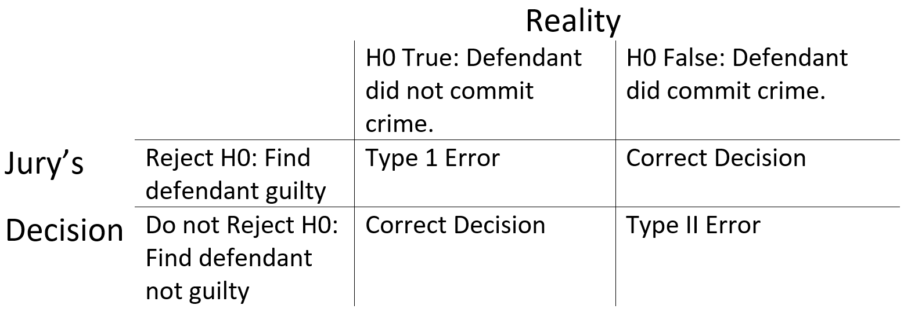

---
title       : Hypothesis Testing
author      : Adam J Sullivan 
job         : Assistant Professor of Biostatistics
work        : Brown University
framework   : io2012        # {io2012, html5slides, shower, dzslides, ...}
highlighter : highlight.js # {highlight.js, prettify, highlight}
hitheme     :  github     # 
widgets     : [mathjax, quiz, bootstrap, interactive] # {mathjax, quiz, bootstrap}
ext_widgets : {rCharts: [libraries/nvd3, libraries/leaflet, libraries/dygraphs]}
mode        : selfcontained # {standalone, draft}
knit        : slidify::knit2slides
logo        : publichealthlogo.png
biglogo     : publichealthlogo.png
assets      : {assets: ../../assets}
---  .segue bg:grey


```{r setup, include = FALSE, cache = FALSE}
knitr::opts_chunk$set(error = TRUE)
knitr::opts_chunk$set(warning=FALSE)
knitr::opts_chunk$set(message=FALSE)
knitr::opts_chunk$set(results="hold")
knitr::opts_chunk$set(cache=FALSE)
library(ggplot2)
library(fivethirtyeight)
require(tidyverse)
library(broom)
```

# Hypothesis Testing

--- .class #id

## Hypothesis Testing Recap

- Let's consider our last hypothesis test. 
- We were wondering whether mental health days were associated with emotional support. 


```{r}
load("../Notes/Data/organic.rda")
organic
```


--- .class #id

## What could be happening?

- Emotional Support influences mental health days. 
- Groups differed at Baseline. 
- Random Chance

--- .class #id

## What have we done so far?

- We have ran multiple permutations and determined that this was not due to random chance. 
- We also created bootstrapped confidence intervals and determined that this was not due to chance. 
- Why did we use 95% confidence intervals? 
- What does 95% have to do with hypothesis testing? 

--- .class #id

## What is Hypothesis Testing? 

- *Hypothesis testing* is a procedure where claims about the value of a population parameter (such as $\mu$ or $\pi$) may be considered using the evidence from the sample.  
- Two competing statements, or *hypotheses*, are crafted about the parameter value:
    - The *null hypothesis* $H_0$ is the status quo hypothesis, representing what has been assumed about the value of the parameter.
    - The *alternative hypothesis* represents the alternative claim about the value of the parameter.


--- .class #id

## What do we get from this? 

- We typically have drawn two possible conclusions
    - Reject $H_0$
    - Fail to reject $H_0$ based on a *p*-value. (Typically *p*-value < 0.05)


--- .class #id

## Why 0.05

- Consider a court case. 
- In many court systems it is said that a defendant is innocent until proven guilty. 
- This means:
$$ H_0: \text{Defendant is innocent} \hspace{.75cm} \text{vs.} \hspace{.75cm} H_a: \text{Defendant is guilty} $$


--- .class #id


## What our the outcomes? 




--- .class #id

## What are the possible outcomes? 

- There are four possible outcomes of a criminal trial with respect to the jury's decision, and what is true in reality.

- Correct decisions:
    - Do not reject $H_0$ if there is not enough evidence against the defendant. The jury acquits an innocent person.
    - Reject $H_0$ if there is sufficient evidence against the defendant. The jury convicts a guilty person.

--- .class #id

## What are the possible outcomes? 

- Erroneous decisions:
    - Type I error: Reject $H_0$ when $H_0$ is true. The jury convicts an innocent person.
    - Type II error: Do not reject $H_0$ when $H_0$ is false. The jury acquits a guilty person.

--- .class #id

## Notation in Statistics

- The probability of a Type I error is denoted as $\alpha$.
- The probability of a Type II error is denoted as $\beta$. 
- For the same sample size,  decrease in $\alpha$ leads to a decrease in $\beta$. 
- Most of the time $\alpha$ is fixed at 0.05. 

--- .class #id

## What does this mean? 

- We decide it is most important to fix $\alpha$. 
- Why?

--- .class #id

## Type I Error

- We believe it is more important to fix the amount of type I error.
- Remember the Type I error is the act of finding an innocent person guilty. 
- This means we find it worse to convict an innocent person than to let a guilty person go free. 

--- .class #id

## How does $\alpha$ come into play? 

- Recall how we made the confidence intervl. 
- We did the following: 
$$\bar{x} \pm \text{Margin of Error}$ 
- How was this done:

$$\bar{x} \pm t_{\alpha/2, n-1} \dfrac{S}{\sqrt{n}}$$

--- .class #id

## The $t$-test

- We know that
$$ t= \dfrac{\bar{x} - \mu_0}{s/\sqrt{n}}$$
- Where
    - $\bar{x}$ is the sample mean
    - $\mu_0$ is the population average stated in the null hypothesis. 
    - $s$ is the sample standard deviation. 
    - $n$ is the sample size. 


--- .class #id

## What does the $t$ mean?

- The value of *t* is interpreted as the number of standard errors above or below the hypothesized mean $\mu_0$. 
- When *t* is large, it provides supporting evidence against the null hypothesis $H_0$. 
- How do we determing if we have enough supporting evidence to reject $H_0$?  
- This is measured by the *p*-value.


--- .class #id

## What is the p-value?

- The *p*-value is the probability of observing a sample statistic (such as $\bar x$) at least as extreme as the statistic actually observed, if we assume $H_0$ is true.  
- This is the clarified version by the way. 

--- .class #id

## What does the *p*-value tell us?

- Thus, a *p*-value of 0.05 suggests there is only a 5% probability of observing $\bar x$ if the population value is actually $\mu_0$ as $H_0$ suggests.  
- The smaller the *p*-value, the smaller the probability that $\bar x$ aligns with the null hypothesis $H_0$.  


--- .class #id

## What exactly is this? 

- We know some stuff. 
- We want to know some more. 
- We design an experiment. 
- We collect data from the experiement. 
- We then summarize the results, *Statistic*


--- .class #id


--- .class #id

## How small does the p-value need to be?


Historically, $$p\texttt{-value} \leq 0.05$$ has been the cutoff commonly used to reject $$H_0$$.  However, it is becoming more common for data analysts to not think in terms of whether or not to reject $$H_0$$ so much as to *assess the strength of evidence against the null hypothesis*. The following table provides a rule-of-thumb for interpreting the strength of evidence against $$H_0$$ for various *p*-values.[^domains]

*p*-value                            | Strength of Evidence Against $$H_0$$
------------------------------------ | ----------------
$$p\texttt{-value} \leq 0.001$$        | Extremely strong evidence
$$0.001 < p\texttt{-value} \leq 0.01$$ | Very strong evidence
$$0.01 < p\texttt{-value} \leq 0.05$$  | Solid evidence
$$0.05 < p\texttt{-value} \leq 0.10$$  | Mild evidence
$$0.10 < p\texttt{-value} \leq 0.15$$  | Slight evidence
$$0.15 < p\texttt{-value}$$            | No evidence

To perform a t-test in R we use the `t.test` function.  For example, if we believe the average square footage of all homes sold in Ames, IA is 1,600 square feet then our hypothesis test would state:

- $$H_0$$: $$\mu = 1600$$
- $$H_a$$: $$\mu \ne 1600$$

We can test this with `t.test`, which shows that $$t = -8.5491$$, which is sufficiently large.  In fact, it is so large that the *p*-value states there is less than $$2.2 \times 10^{-16}$$ probability of $$\bar x = 1492.856$$ if the population mean was 1600. This provides extremely strong evidence against $$H_0$$. The results also tell us that the 95% confidence interval for the population mean $$\mu_0$$, suggesting that the $$\mu_0$$ likely falls between 1468-1517 square feet.


