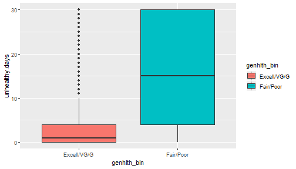

---
title       : Hypothesis Testing
author      : Adam J Sullivan 
job         : Assistant Professor of Biostatistics
work        : Brown University
framework   : io2012        # {io2012, html5slides, shower, dzslides, ...}
highlighter : highlight.js # {highlight.js, prettify, highlight}
hitheme     :  github     # 
widgets     : [mathjax, quiz, bootstrap, interactive] # {mathjax, quiz, bootstrap}
ext_widgets : {rCharts: [libraries/nvd3, libraries/leaflet, libraries/dygraphs]}
mode        : selfcontained # {standalone, draft}
knit        : slidify::knit2slides
logo        : publichealthlogo.png
biglogo     : publichealthlogo.png
assets      : {assets: ../../assets}
---  .segue bg:grey


# Hypothesis Testing

--- .class #id

## Hypothesis Testing Recap

- Let's consider our last hypothesis test. 
- We were wondering whether mental health days were associated with emotional support. 


```r
load("../Notes/Data/organic.rda")
organic
```

```
## # A tibble: 2,671 x 12
##     SEQN IND235 CBD740 SMQ020 HSD010 CBD630 health organic income smoke
##    <dbl>  <dbl>  <dbl>  <dbl>  <dbl>  <dbl> <fct>  <fct>    <dbl> <fct>
##  1 51628      3      2      1      4    2   Fair   No       1024. Yes  
##  2 51630      6      1      1      3    6   Good   Yes      2500. Yes  
##  3 51635      4      2      1      3    1   Good   No       1450. Yes  
##  4 51643      7      1      2      5    2   Poor   Yes      3324. No   
##  5 51647      9      2      2      2    5   Very ~ No       5000. No   
##  6 51648      2      2      1      4    2   Fair   No        600. Yes  
##  7 51656     12      1      2      2    6   Very ~ Yes      9000  No   
##  8 51664     12      2      1      1    4   Excel~ No       9000  Yes  
##  9 51668      2      2      1      3    1.5 Good   No        600. Yes  
## 10 51670      1      1      2      1    5   Excel~ Yes       200. No   
## # ... with 2,661 more rows, and 2 more variables: veggies <dbl>,
## #   health.bin <fct>
```


--- .class #id

## What could be happening?

- Emotional Support influences mental health days. 
- Groups differed at Baseline. 
- Random Chance

--- .class #id

## What have we done so far?

- We have ran multiple permutations and determined that this was not due to random chance. 
- We also created bootstrapped confidence intervals and determined that this was not due to chance. 
- Why did we use 95% confidence intervals? 
- What does 95% have to do with hypothesis testing? 

--- .class #id

## What is Hypothesis Testing? 

- *Hypothesis testing* is a procedure where claims about the value of a population parameter (such as $\mu$ or $\pi$) may be considered using the evidence from the sample.  
- Two competing statements, or *hypotheses*, are crafted about the parameter value:
    - The *null hypothesis* $H_0$ is the status quo hypothesis, representing what has been assumed about the value of the parameter.
    - The *alternative hypothesis* represents the alternative claim about the value of the parameter.


--- .class #id

## What do we get from this? 

- We typically have drawn two possible conclusions
    - Reject $H_0$
    - Fail to reject $H_0$ based on a *p*-value. (Typically *p*-value < 0.05)


--- .class #id

## Why 0.05

- Consider a court case. 
- In many court systems it is said that a defendant is innocent until proven guilty. 
- This means:
$$ H_0: \text{Defendant is innocent} \hspace{.75cm} \text{vs.} \hspace{.75cm} H_a: \text{Defendant is guilty} $$


--- .class #id


## What our the outcomes? 


--- .class #id

## What are the possible outcomes? 

- There are four possible outcomes of a criminal trial with respect to the jury's decision, and what is true in reality.

- Correct decisions:
    - Do not reject $H_0$ if there is not enough evidence against the defendant. The jury acquits an innocent person.
    - Reject $H_0$ if there is sufficient evidence against the defendant. The jury convicts a guilty person.

--- .class #id

## What are the possible outcomes? 

- Erroneous decisions:
    - Type I error: Reject $H_0$ when $H_0$ is true. The jury convicts an innocent person.
    - Type II error: Do not reject $H_0$ when $H_0$ is false. The jury acquits a guilty person.

--- .class #id

## Notation in Statistics

- The probability of a Type I error is denoted as $\alpha$.
- The probability of a Type II error is denoted as $\beta$. 
- For the same sample size,  decrease in $\alpha$ leads to a decrease in $\beta$. 
- Most of the time $\alpha$ is fixed at 0.05. 

--- .class #id

## What does this mean? 

- We decide it is most important to fix $\alpha$. 
- Why?

--- .class #id

## Type I Error

- We believe it is more important to fix the amount of type I error.
- Remember the Type I error is the act of finding an innocent person guilty. 
- This means we find it worse to convict an innocent person than to let a guilty person go free. 

--- .class #id

## How does $\alpha$ come into play? 

- Recall how we made the confidence intervl. 
- We did the following: 
$$\bar{x} \pm \text{Margin of Error}$ 
- How was this done:

$$\bar{x} \pm t_{\alpha/2, n-1} \dfrac{S}{\sqrt{n}}$$

--- .class #id

## The $t$-test

- We know that
$$ t= \dfrac{\bar{x} - \mu_0}{s/\sqrt{n}}$$
- Where
    - $\bar{x}$ is the sample mean
    - $\mu_0$ is the population average stated in the null hypothesis. 
    - $s$ is the sample standard deviation. 
    - $n$ is the sample size. 


--- .class #id

## What does the $t$ mean?

- The value of *t* is interpreted as the number of standard errors above or below the hypothesized mean $\mu_0$. 
- When *t* is large, it provides supporting evidence against the null hypothesis $H_0$. 
- How do we determing if we have enough supporting evidence to reject $H_0$?  
- This is measured by the *p*-value.


--- .class #id

## What is the p-value?

- The *p*-value is the probability of observing a sample statistic (such as $\bar x$) at least as extreme as the statistic actually observed, if we assume $H_0$ is true.  
- This is the clarified version by the way. 

--- .class #id

## What does the *p*-value tell us?

- Thus, a *p*-value of 0.05 suggests there is only a 5% probability of observing $\bar x$ if the population value is actually $\mu_0$ as $H_0$ suggests.  
- The smaller the *p*-value, the smaller the probability that $\bar x$ aligns with the null hypothesis $H_0$.  


--- .class #id

## How does this work in practice?

- We know some stuff. 
- We want to know some more. 
- We design an experiment. 
- We collect data from the experiement. 
- We then summarize the results, *Statistic*


--- .class #id


## The One Sample $t$ test

$$ t = \dfrac{\bar{x}-\mu_0}{s/\sqrt{n}}$$

- We use this to compare one sample of data versus a suggested population mean. 
- We will do this in R. 


--- .class #id

## One Sample $t$ test in R

```
t.test(x, mu, data )
```

- Where
    - `x` is a vector of data. 
    - `mu` is the population mean under the null. 
    - `data` optional dataframe where the vector `x` is contained. 

--- .class #id
  
## SAT scores

- You are a math teacher and have scores from the math portion of the SAT. 
- The average for this position is listed as 527. 
- You wish to know if you students score is higher, lower or the same as the avera. 


--- .class #id

## The test


```r
sat <- c(527, 554, 534, 541, 539, 542, 498, 512, 528, 531, 
563, 566, 498, 503, 551, 582, 529, 549, 571, 523, 543, 588, 571)
```

--- .class #id

## Data Distribution


--- .class #id

## The Hypothesis

- We would consider the following hypothesis

$$H_0: \text{ Our class has the average of 527} \text{ vs } H_1: \text{ Our class has a different Average} $$

- Also:

$$ H_0: \mu = 527 \text{ vs } H_1: \mu\ne 527$$


--- .class #id

## The test 


```r
t.test(x=sat, mu=527)
```

```
## 
## 	One Sample t-test
## 
## data:  sat
## t = 2.6516, df = 22, p-value = 0.01458
## alternative hypothesis: true mean is not equal to 527
## 95 percent confidence interval:
##  530.0501 551.9499
## sample estimates:
## mean of x 
##       541
```


--- .class #id

## What do we see? 

- $t$ statistic is 2.6516
- *p*-value 0.01458
- 95% CI: (530.0501, 551.9499)
- Mean of class: 541

--- .class #id

## Evaluating Results

- We can check the confidence interval. 
- We look to see if the suggested mean is in the CI. 
- It is not in the CI so we would suggest that our sample is different from the mean. 
- We would conclude that it is higher. 

--- .class #id

## Evaluating Results

- We could consider the *p*-value. 
- If we are considering a significance level of 0.05, then we would reject the null hypothesis since the p-value is 0.01458. 
- We then know our average is different from the rest of the population. 
- The reported mean is 541, suggesting our class is higher than the rest of the population. 

--- .class #id

## The hypothesis

- We tested what was called a 2-sided hypothesis. 
- This means that we allow for the alternative to be:

$$H_1 \mu\ne 527$$

- Other forms of the alternative may be

$$H_1\text{: } \mu>527$$
$$H_1\text{: } \mu<527$$
- We prefer 2-sided

--- .class #id

## Why 2-sided? 

- We must first see how we calculated p-value. 
- By allowing for the average to be above or  below, we are not sure whether the tails are higher or lower. 
- Remember our *t* statistic of 2.65


--- .class #id


## The picture


--- .class #id

## The area to the right:
  
- We can calculate this area:


```r
1- pt(2.6515, df=22)
```

```
## [1] 0.007288776
```

--- .class #id 


## The area to the left:
  
- We can calculate this area:


```r
pt(-2.6516, df=22)
```

```
## [1] 0.007287151
```


--- .class #id

## 2 p-values

- If we do a one-sided test then our *p*-value is the area to the right or the left depending on our alternative:
- Both of these have the area of 0.007
- If we use a two-sided we have both the left and right areas:
$$2*pt(-2.6516, df=22) = 0.0145743$$


--- .class #id

## What is the difference? 

- One sided *p*-values are half as much as the Two sided. 
- It is considered stronger evidence to allow for two sided. 


--- .class #id


## The 2 Sample $t$ test. 


$$ t=\dfrac{\bar{x}_1 - \bar{x}_2}{\sqrt{\dfrac{s_1^2}{n1} + \dfrac{s_2^2}{n_2}}}$$

- Where
    - $\bar{x}_1$ and $\bar{x}_2$ are the sample means of groups 1 and 2 respectively. 
    - $s_1^2$ and $s_2^2$ are the sample variances of groups 1 and 2 respectively. 
    - $n_1$ and $n_2$ are the sample sizes of groups 1 and 2 respectively. 


--- .class #id

## The 2 Sample $t$ test DF

$$\text{df}= \dfrac{\left(\dfrac{s_1^2}{n_1} + \dfrac{s_2^2}{n_2}\right)^2}{\dfrac{(s_1^2/n_1)^2}{n_1-1} + \dfrac{(s_2^2/n_1^2)^2}{n_2-1}}$$
 

--- .class #id

## Equal Variances

- Some people will display a different $t$ test where there are equal variances. 
- This was an easy way to do things by hand but is truly irrelevant with today's standards. 


--- .class #id

## Back to the BRFSS Data

- Let us consider the BRFSS data again:


```r
load("Data/brfss.rda")
brfss2
```

```
##        genhlth genhlth_bin unhealthy.days        imprace insurance
## 1         Fair   Fair/Poor             25 white-non-hisp       Yes
## 2    Very Good Excell/VG/G              0 white-non-hisp       Yes
## 3         Fair   Fair/Poor             15 white-non-hisp       Yes
## 4         Good Excell/VG/G              0 white-non-hisp       Yes
## 5    Very Good Excell/VG/G              0 white-non-hisp       Yes
## 6         Fair   Fair/Poor              0           hisp       Yes
## 7    Very Good Excell/VG/G              2           hisp       Yes
## 8    Very Good Excell/VG/G             23 white-non-hisp       Yes
## 9         Poor   Fair/Poor             30 white-non-hisp       Yes
## 10   Excellent Excell/VG/G             30 white-non-hisp       Yes
## 11   Very Good Excell/VG/G              2 white-non-hisp        No
## 12        Good Excell/VG/G              3 white-non-hisp       Yes
## 13        Fair   Fair/Poor             30 black-non-hisp       Yes
## 14   Very Good Excell/VG/G              0 white-non-hisp       Yes
## 15        Fair   Fair/Poor              2 white-non-hisp       Yes
## 16        Good Excell/VG/G              2 white-non-hisp       Yes
## 17        Fair   Fair/Poor             14 white-non-hisp       Yes
## 18   Very Good Excell/VG/G              3 white-non-hisp       Yes
## 19   Very Good Excell/VG/G             14 white-non-hisp       Yes
## 20        Fair   Fair/Poor             20  aian-non-hisp       Yes
## 21        Good Excell/VG/G             10 white-non-hisp       Yes
## 22   Very Good Excell/VG/G              0 white-non-hisp       Yes
## 23        Poor   Fair/Poor             30 white-non-hisp       Yes
## 24   Excellent Excell/VG/G              0 white-non-hisp       Yes
## 25        Good Excell/VG/G             15 white-non-hisp       Yes
## 26        Fair   Fair/Poor              1 white-non-hisp       Yes
## 27        Fair   Fair/Poor             15 white-non-hisp       Yes
## 28        Good Excell/VG/G              0 white-non-hisp       Yes
## 29        Good Excell/VG/G              5 white-non-hisp       Yes
## 30        Fair   Fair/Poor             20           hisp       Yes
## 31   Excellent Excell/VG/G              4 white-non-hisp       Yes
## 32        Poor   Fair/Poor             30  aian-non-hisp       Yes
## 33        Fair   Fair/Poor              0 white-non-hisp       Yes
## 34   Very Good Excell/VG/G              2 white-non-hisp       Yes
## 35        Good Excell/VG/G              0 white-non-hisp       Yes
## 36   Very Good Excell/VG/G              7 white-non-hisp       Yes
## 37        Good Excell/VG/G              1 white-non-hisp       Yes
## 38   Very Good Excell/VG/G              5 white-non-hisp       Yes
## 39   Very Good Excell/VG/G              0 white-non-hisp        No
## 40   Very Good Excell/VG/G              1 white-non-hisp       Yes
## 41        Fair   Fair/Poor             30 white-non-hisp       Yes
## 42        Good Excell/VG/G              2 white-non-hisp        No
## 43        Good Excell/VG/G              3 white-non-hisp       Yes
## 44   Excellent Excell/VG/G             30 white-non-hisp       Yes
## 45        Good Excell/VG/G              1 white-non-hisp       Yes
## 46        Fair   Fair/Poor              0 white-non-hisp       Yes
## 47        Fair   Fair/Poor             30 white-non-hisp       Yes
## 48        Good Excell/VG/G              1 white-non-hisp       Yes
## 49        Fair   Fair/Poor             19 white-non-hisp       Yes
## 50        Good Excell/VG/G             30 white-non-hisp       Yes
## 51   Very Good Excell/VG/G              2 white-non-hisp       Yes
## 52        Poor   Fair/Poor             30 white-non-hisp       Yes
## 53   Very Good Excell/VG/G              8 white-non-hisp       Yes
## 54   Very Good Excell/VG/G              0  aian-non-hisp       Yes
## 55        Good Excell/VG/G              2 white-non-hisp       Yes
## 56        Fair   Fair/Poor             30 white-non-hisp       Yes
## 57        Poor   Fair/Poor             20  aian-non-hisp       Yes
## 58   Excellent Excell/VG/G              0 white-non-hisp       Yes
## 59   Excellent Excell/VG/G              2 white-non-hisp       Yes
## 60   Very Good Excell/VG/G              0 white-non-hisp        No
## 61        Good Excell/VG/G             30 white-non-hisp       Yes
## 62        Poor   Fair/Poor             30 white-non-hisp       Yes
## 63        Fair   Fair/Poor             30 white-non-hisp       Yes
## 64   Excellent Excell/VG/G              0           hisp        No
## 65        Good Excell/VG/G              0 white-non-hisp       Yes
## 66        Good Excell/VG/G              1 white-non-hisp       Yes
## 67   Excellent Excell/VG/G              2 white-non-hisp       Yes
## 68        Poor   Fair/Poor             30 white-non-hisp       Yes
## 69        Good Excell/VG/G              2 white-non-hisp       Yes
## 70   Very Good Excell/VG/G              0 white-non-hisp       Yes
## 71        Poor   Fair/Poor             30 white-non-hisp       Yes
## 72   Excellent Excell/VG/G              2 white-non-hisp       Yes
## 73   Excellent Excell/VG/G              2 white-non-hisp       Yes
## 74        Poor   Fair/Poor             30 white-non-hisp       Yes
## 75   Excellent Excell/VG/G             NA white-non-hisp       Yes
## 76        Fair   Fair/Poor             10 white-non-hisp       Yes
## 77   Very Good Excell/VG/G              0 white-non-hisp       Yes
## 78        Good Excell/VG/G              3 white-non-hisp       Yes
## 79   Very Good Excell/VG/G              0 white-non-hisp       Yes
## 80        Good Excell/VG/G              0  aian-non-hisp       Yes
## 81        Fair   Fair/Poor              7 white-non-hisp       Yes
## 82        Poor   Fair/Poor              2 white-non-hisp       Yes
## 83        Fair   Fair/Poor             30  aian-non-hisp       Yes
## 84   Very Good Excell/VG/G              0 white-non-hisp       Yes
## 85        Good Excell/VG/G              3 white-non-hisp       Yes
## 86        Good Excell/VG/G              0 white-non-hisp       Yes
## 87        Poor   Fair/Poor             30 white-non-hisp       Yes
## 88        Good Excell/VG/G              4 white-non-hisp       Yes
## 89        Good Excell/VG/G              1 white-non-hisp       Yes
## 90   Very Good Excell/VG/G              1           hisp       Yes
## 91   Very Good Excell/VG/G              5 white-non-hisp       Yes
## 92        Good Excell/VG/G              0 white-non-hisp       Yes
## 93   Very Good Excell/VG/G              0 white-non-hisp        No
## 94        Good Excell/VG/G              3 white-non-hisp       Yes
## 95        Good Excell/VG/G              0 white-non-hisp        No
## 96        Good Excell/VG/G             30 white-non-hisp       Yes
## 97        Fair   Fair/Poor              8 white-non-hisp        No
## 98        Good Excell/VG/G              4 white-non-hisp       Yes
## 99        Good Excell/VG/G             25 white-non-hisp       Yes
## 100       Poor   Fair/Poor             30 white-non-hisp       Yes
## 101       Poor   Fair/Poor             29  aian-non-hisp       Yes
## 102  Very Good Excell/VG/G              1 white-non-hisp       Yes
## 103       Fair   Fair/Poor              3 white-non-hisp       Yes
## 104  Very Good Excell/VG/G              0           hisp       Yes
## 105  Very Good Excell/VG/G              2 white-non-hisp        No
## 106       Fair   Fair/Poor              2 white-non-hisp       Yes
## 107       Good Excell/VG/G              5 white-non-hisp       Yes
## 108       Good Excell/VG/G              4 white-non-hisp       Yes
## 109  Very Good Excell/VG/G              1 other-non-hisp       Yes
## 110  Very Good Excell/VG/G              0 white-non-hisp       Yes
## 111       Good Excell/VG/G             12 white-non-hisp       Yes
## 112       Fair   Fair/Poor             30 white-non-hisp       Yes
## 113       Fair   Fair/Poor             NA white-non-hisp       Yes
## 114  Very Good Excell/VG/G              0 white-non-hisp       Yes
## 115       Poor   Fair/Poor             NA white-non-hisp       Yes
## 116       Poor   Fair/Poor             NA white-non-hisp       Yes
## 117       Poor   Fair/Poor             15 white-non-hisp       Yes
## 118       Good Excell/VG/G              2 white-non-hisp       Yes
## 119  Excellent Excell/VG/G             NA white-non-hisp       Yes
## 120       Poor   Fair/Poor             30 white-non-hisp       Yes
## 121       Good Excell/VG/G             20 white-non-hisp       Yes
## 122  Excellent Excell/VG/G              2 white-non-hisp       Yes
## 123       Good Excell/VG/G              4 white-non-hisp       Yes
## 124  Very Good Excell/VG/G              3 white-non-hisp       Yes
## 125  Excellent Excell/VG/G              0 white-non-hisp       Yes
## 126       Poor   Fair/Poor             30 white-non-hisp       Yes
## 127       Good Excell/VG/G              2 white-non-hisp       Yes
## 128  Very Good Excell/VG/G             10 white-non-hisp       Yes
## 129       Fair   Fair/Poor              5 white-non-hisp       Yes
## 130       Good Excell/VG/G              2  aian-non-hisp       Yes
## 131       Fair   Fair/Poor             15 white-non-hisp       Yes
## 132       Good Excell/VG/G              4 white-non-hisp       Yes
## 133  Very Good Excell/VG/G              0 white-non-hisp       Yes
## 134       Good Excell/VG/G              3 white-non-hisp       Yes
## 135  Very Good Excell/VG/G             30 white-non-hisp       Yes
## 136  Very Good Excell/VG/G              0 white-non-hisp       Yes
## 137       Good Excell/VG/G             NA white-non-hisp       Yes
## 138       Good Excell/VG/G              7 white-non-hisp       Yes
## 139       Fair   Fair/Poor             30 white-non-hisp       Yes
## 140       Fair   Fair/Poor              0 white-non-hisp       Yes
## 141  Very Good Excell/VG/G              1 white-non-hisp       Yes
## 142  Very Good Excell/VG/G              2 white-non-hisp       Yes
## 143  Excellent Excell/VG/G              0 white-non-hisp       Yes
## 144  Excellent Excell/VG/G              2 white-non-hisp       Yes
## 145  Very Good Excell/VG/G              1 white-non-hisp       Yes
## 146  Very Good Excell/VG/G              0 white-non-hisp       Yes
## 147       Fair   Fair/Poor             30 white-non-hisp       Yes
## 148       Good Excell/VG/G              2 white-non-hisp       Yes
## 149       Poor   Fair/Poor             30 white-non-hisp       Yes
## 150  Very Good Excell/VG/G              0 white-non-hisp       Yes
## 151  Very Good Excell/VG/G              1 white-non-hisp        No
## 152       Good Excell/VG/G             20 white-non-hisp       Yes
## 153       Good Excell/VG/G              2 white-non-hisp       Yes
## 154       Good Excell/VG/G              4 white-non-hisp       Yes
## 155       Good Excell/VG/G             10 white-non-hisp       Yes
## 156       Fair   Fair/Poor              3 white-non-hisp       Yes
## 157       Fair   Fair/Poor             30 white-non-hisp       Yes
## 158       Good Excell/VG/G              3 white-non-hisp        No
## 159       Fair   Fair/Poor              4 white-non-hisp       Yes
## 160       Good Excell/VG/G             NA white-non-hisp       Yes
## 161  Very Good Excell/VG/G              0 white-non-hisp       Yes
## 162       Good Excell/VG/G             10 white-non-hisp       Yes
## 163       Fair   Fair/Poor              7 white-non-hisp       Yes
## 164  Very Good Excell/VG/G              0 white-non-hisp        No
## 165       Good Excell/VG/G              5 white-non-hisp       Yes
## 166  Excellent Excell/VG/G             14 white-non-hisp       Yes
## 167       Fair   Fair/Poor             30 white-non-hisp       Yes
## 168       Good Excell/VG/G              3 white-non-hisp       Yes
## 169       Good Excell/VG/G              2 white-non-hisp       Yes
## 170  Very Good Excell/VG/G              0 white-non-hisp       Yes
## 171       Good Excell/VG/G              5 white-non-hisp       Yes
## 172       Good Excell/VG/G             NA white-non-hisp       Yes
## 173  Very Good Excell/VG/G              2 white-non-hisp       Yes
## 174  Very Good Excell/VG/G              1 white-non-hisp       Yes
## 175       Good Excell/VG/G              0 white-non-hisp       Yes
## 176       Good Excell/VG/G              2 white-non-hisp       Yes
## 177  Very Good Excell/VG/G              2 white-non-hisp       Yes
## 178       Good Excell/VG/G              0 white-non-hisp       Yes
## 179       Good Excell/VG/G              1 white-non-hisp       Yes
## 180       Fair   Fair/Poor             20 white-non-hisp       Yes
## 181       Good Excell/VG/G              7 white-non-hisp       Yes
## 182       Good Excell/VG/G              1 white-non-hisp       Yes
## 183       Good Excell/VG/G              0 white-non-hisp       Yes
## 184  Very Good Excell/VG/G              4 white-non-hisp       Yes
## 185  Very Good Excell/VG/G              2 white-non-hisp       Yes
## 186       Good Excell/VG/G             30 white-non-hisp       Yes
## 187  Very Good Excell/VG/G              5 white-non-hisp       Yes
## 188  Very Good Excell/VG/G              3 white-non-hisp       Yes
## 189  Very Good Excell/VG/G              2 white-non-hisp       Yes
## 190       Fair   Fair/Poor              7  aian-non-hisp       Yes
## 191       Good Excell/VG/G              0 white-non-hisp       Yes
## 192       Good Excell/VG/G             12 white-non-hisp       Yes
## 193       Good Excell/VG/G             15  aian-non-hisp       Yes
## 194       Fair   Fair/Poor             12 white-non-hisp       Yes
## 195       Fair   Fair/Poor             20 white-non-hisp       Yes
## 196  Very Good Excell/VG/G              2 other-non-hisp       Yes
## 197  Very Good Excell/VG/G              0 white-non-hisp       Yes
## 198       Poor   Fair/Poor              2 white-non-hisp       Yes
## 199       Poor   Fair/Poor              4 white-non-hisp       Yes
## 200  Very Good Excell/VG/G              2 white-non-hisp       Yes
## 201       Good Excell/VG/G             30 white-non-hisp       Yes
## 202       Good Excell/VG/G              5 white-non-hisp       Yes
## 203  Very Good Excell/VG/G              0 white-non-hisp       Yes
## 204       Good Excell/VG/G              0 white-non-hisp       Yes
## 205       Good Excell/VG/G              4 white-non-hisp       Yes
## 206       Poor   Fair/Poor             25 white-non-hisp       Yes
## 207       Fair   Fair/Poor             20 white-non-hisp       Yes
## 208       Good Excell/VG/G              1 white-non-hisp       Yes
## 209  Very Good Excell/VG/G              2 white-non-hisp       Yes
## 210       Good Excell/VG/G              0 white-non-hisp       Yes
## 211       Fair   Fair/Poor             20 white-non-hisp       Yes
## 212       Good Excell/VG/G              0 white-non-hisp       Yes
## 213       Good Excell/VG/G              2 white-non-hisp       Yes
## 214  Very Good Excell/VG/G              2 white-non-hisp       Yes
## 215  Very Good Excell/VG/G              2 white-non-hisp       Yes
## 216  Very Good Excell/VG/G              0 white-non-hisp       Yes
## 217       Poor   Fair/Poor             30 white-non-hisp       Yes
## 218       Good Excell/VG/G             NA white-non-hisp       Yes
## 219       Good Excell/VG/G              1 white-non-hisp       Yes
## 220  Very Good Excell/VG/G              0 white-non-hisp        No
## 221       Good Excell/VG/G              2  aian-non-hisp       Yes
## 222       Fair   Fair/Poor              5 white-non-hisp       Yes
## 223       Good Excell/VG/G              0 white-non-hisp       Yes
## 224       Poor   Fair/Poor             30 white-non-hisp       Yes
## 225       Poor   Fair/Poor             30 white-non-hisp       Yes
## 226       Poor   Fair/Poor             30 white-non-hisp       Yes
## 227  Excellent Excell/VG/G              1 white-non-hisp       Yes
## 228  Very Good Excell/VG/G              6 white-non-hisp       Yes
## 229  Very Good Excell/VG/G              0 white-non-hisp       Yes
## 230  Very Good Excell/VG/G              0 white-non-hisp       Yes
## 231       Good Excell/VG/G             30 black-non-hisp       Yes
## 232       Good Excell/VG/G              5 white-non-hisp       Yes
## 233  Excellent Excell/VG/G              0 white-non-hisp       Yes
## 234  Very Good Excell/VG/G             30 white-non-hisp       Yes
## 235       Fair   Fair/Poor             30 white-non-hisp       Yes
## 236  Very Good Excell/VG/G             12 white-non-hisp       Yes
## 237  Excellent Excell/VG/G             30 white-non-hisp       Yes
## 238       Good Excell/VG/G              9  aian-non-hisp       Yes
## 239  Very Good Excell/VG/G              2 white-non-hisp       Yes
## 240       Good Excell/VG/G              0 white-non-hisp       Yes
## 241  Excellent Excell/VG/G              1 black-non-hisp       Yes
## 242       Good Excell/VG/G             15 white-non-hisp       Yes
## 243       Poor   Fair/Poor             30 white-non-hisp       Yes
## 244       Good Excell/VG/G              2 white-non-hisp       Yes
## 245       Fair   Fair/Poor              0 white-non-hisp       Yes
## 246       Good Excell/VG/G              5 white-non-hisp       Yes
## 247       Fair   Fair/Poor              0 white-non-hisp       Yes
## 248  Very Good Excell/VG/G              0 white-non-hisp       Yes
## 249       Good Excell/VG/G              2 white-non-hisp        No
## 250  Very Good Excell/VG/G              0 white-non-hisp       Yes
## 251       Fair   Fair/Poor             12 white-non-hisp       Yes
## 252       Good Excell/VG/G              4 white-non-hisp       Yes
## 253  Very Good Excell/VG/G              2 white-non-hisp       Yes
## 254  Very Good Excell/VG/G              3 white-non-hisp       Yes
## 255       Fair   Fair/Poor              0 white-non-hisp        No
## 256       Good Excell/VG/G              0 white-non-hisp       Yes
## 257  Very Good Excell/VG/G              0 white-non-hisp       Yes
## 258       Good Excell/VG/G              2 white-non-hisp       Yes
## 259  Excellent Excell/VG/G              7 white-non-hisp       Yes
## 260       Good Excell/VG/G              5 black-non-hisp       Yes
## 261  Excellent Excell/VG/G              1 white-non-hisp       Yes
## 262       Fair   Fair/Poor              1 white-non-hisp       Yes
## 263       Fair   Fair/Poor              0 white-non-hisp       Yes
## 264       Good Excell/VG/G              0 black-non-hisp       Yes
## 265       Fair   Fair/Poor             28 white-non-hisp       Yes
## 266  Very Good Excell/VG/G              4 white-non-hisp        No
## 267  Very Good Excell/VG/G              0 white-non-hisp       Yes
## 268  Very Good Excell/VG/G              2 white-non-hisp       Yes
## 269  Very Good Excell/VG/G              1 white-non-hisp       Yes
## 270       Good Excell/VG/G              0 white-non-hisp       Yes
## 271  Excellent Excell/VG/G              0 white-non-hisp       Yes
## 272  Very Good Excell/VG/G              0 white-non-hisp       Yes
## 273       Fair   Fair/Poor             20 white-non-hisp       Yes
## 274       Good Excell/VG/G              2 black-non-hisp       Yes
## 275  Excellent Excell/VG/G              0 white-non-hisp       Yes
## 276       Good Excell/VG/G              2 white-non-hisp       Yes
## 277       Fair   Fair/Poor             10 white-non-hisp       Yes
## 278  Very Good Excell/VG/G              3 white-non-hisp       Yes
## 279  Very Good Excell/VG/G              0 white-non-hisp       Yes
## 280       Fair   Fair/Poor             14 other-non-hisp       Yes
## 281  Very Good Excell/VG/G              4 white-non-hisp       Yes
## 282       Good Excell/VG/G             20 white-non-hisp       Yes
## 283  Excellent Excell/VG/G             NA white-non-hisp       Yes
## 284  Very Good Excell/VG/G              1 white-non-hisp       Yes
## 285  Very Good Excell/VG/G              0 white-non-hisp       Yes
## 286  Very Good Excell/VG/G              1 asian-non-hisp       Yes
## 287  Very Good Excell/VG/G              4 white-non-hisp       Yes
## 288       Good Excell/VG/G              1 white-non-hisp       Yes
## 289  Very Good Excell/VG/G              0 white-non-hisp       Yes
## 290  Very Good Excell/VG/G              7 white-non-hisp       Yes
## 291       Good Excell/VG/G              0 white-non-hisp       Yes
## 292  Very Good Excell/VG/G              2 white-non-hisp       Yes
## 293       Good Excell/VG/G              1 white-non-hisp       Yes
## 294  Excellent Excell/VG/G              7 white-non-hisp       Yes
## 295  Excellent Excell/VG/G              0 white-non-hisp       Yes
## 296       Good Excell/VG/G              2 white-non-hisp       Yes
## 297       Good Excell/VG/G              2 white-non-hisp       Yes
## 298  Very Good Excell/VG/G              0 white-non-hisp       Yes
## 299       Good Excell/VG/G              5 white-non-hisp       Yes
## 300  Very Good Excell/VG/G              1 white-non-hisp       Yes
## 301       Good Excell/VG/G              0 white-non-hisp       Yes
## 302       Good Excell/VG/G              0 black-non-hisp       Yes
## 303       Good Excell/VG/G              0 white-non-hisp       Yes
## 304       Good Excell/VG/G             10 white-non-hisp       Yes
## 305       Fair   Fair/Poor             30 white-non-hisp       Yes
## 306       Good Excell/VG/G              1 white-non-hisp       Yes
## 307  Very Good Excell/VG/G              7 white-non-hisp       Yes
## 308       Good Excell/VG/G             14 black-non-hisp       Yes
## 309       Good Excell/VG/G             10 white-non-hisp       Yes
## 310       Good Excell/VG/G              1 white-non-hisp        No
## 311       Good Excell/VG/G             30 white-non-hisp       Yes
## 312       Good Excell/VG/G              2 black-non-hisp       Yes
## 313       Poor   Fair/Poor             30 white-non-hisp       Yes
## 314       Good Excell/VG/G              3 white-non-hisp       Yes
## 315       Good Excell/VG/G              3 white-non-hisp       Yes
## 316       Good Excell/VG/G              7 black-non-hisp       Yes
## 317  Very Good Excell/VG/G             30 white-non-hisp       Yes
## 318       Poor   Fair/Poor              5 white-non-hisp       Yes
## 319  Very Good Excell/VG/G              0 white-non-hisp       Yes
## 320  Very Good Excell/VG/G              0           hisp       Yes
## 321       Good Excell/VG/G             10 white-non-hisp       Yes
## 322       Good Excell/VG/G              0 white-non-hisp       Yes
## 323       Fair   Fair/Poor             29 white-non-hisp       Yes
## 324       Fair   Fair/Poor              0  aian-non-hisp       Yes
## 325       Good Excell/VG/G              3 white-non-hisp       Yes
## 326  Very Good Excell/VG/G              5 white-non-hisp       Yes
## 327       Good Excell/VG/G              2 white-non-hisp       Yes
## 328  Very Good Excell/VG/G              0 white-non-hisp       Yes
## 329       Good Excell/VG/G              3           hisp       Yes
## 330       Good Excell/VG/G              1 other-non-hisp       Yes
## 331       Good Excell/VG/G              1 white-non-hisp       Yes
## 332  Excellent Excell/VG/G              2 white-non-hisp       Yes
## 333  Very Good Excell/VG/G              8 black-non-hisp       Yes
## 334       Good Excell/VG/G              2 white-non-hisp       Yes
## 335       Good Excell/VG/G              5 white-non-hisp       Yes
## 336  Very Good Excell/VG/G              2 white-non-hisp       Yes
## 337  Very Good Excell/VG/G              0 white-non-hisp       Yes
## 338       Good Excell/VG/G             10 white-non-hisp       Yes
## 339       Good Excell/VG/G             14 white-non-hisp       Yes
## 340       Good Excell/VG/G              2 white-non-hisp       Yes
## 341  Very Good Excell/VG/G              2 white-non-hisp       Yes
## 342       Good Excell/VG/G              6 white-non-hisp       Yes
## 343       Good Excell/VG/G              0 white-non-hisp       Yes
## 344  Very Good Excell/VG/G              2 white-non-hisp       Yes
## 345  Very Good Excell/VG/G              0 white-non-hisp       Yes
## 346  Very Good Excell/VG/G              2 white-non-hisp       Yes
## 347  Excellent Excell/VG/G              0 white-non-hisp       Yes
## 348  Very Good Excell/VG/G             15 white-non-hisp       Yes
## 349       Poor   Fair/Poor              6 white-non-hisp       Yes
## 350       Good Excell/VG/G              0 white-non-hisp       Yes
## 351       Good Excell/VG/G              0 white-non-hisp       Yes
## 352  Very Good Excell/VG/G              1           hisp       Yes
## 353  Excellent Excell/VG/G              1 white-non-hisp       Yes
## 354  Excellent Excell/VG/G              0 white-non-hisp       Yes
## 355  Excellent Excell/VG/G              1 white-non-hisp       Yes
## 356       Good Excell/VG/G              0  aian-non-hisp       Yes
## 357  Very Good Excell/VG/G              5 white-non-hisp       Yes
## 358       Good Excell/VG/G              1 white-non-hisp       Yes
## 359       Fair   Fair/Poor             10 white-non-hisp       Yes
## 360  Very Good Excell/VG/G              2 white-non-hisp       Yes
## 361  Very Good Excell/VG/G              0 white-non-hisp       Yes
## 362       Poor   Fair/Poor             30 white-non-hisp       Yes
## 363       Good Excell/VG/G              5 white-non-hisp       Yes
## 364  Excellent Excell/VG/G              5 white-non-hisp       Yes
## 365       Fair   Fair/Poor              7 black-non-hisp       Yes
## 366       Good Excell/VG/G              2 white-non-hisp       Yes
## 367  Very Good Excell/VG/G              5 white-non-hisp       Yes
## 368  Very Good Excell/VG/G              1 white-non-hisp       Yes
## 369  Very Good Excell/VG/G             10 white-non-hisp       Yes
## 370  Very Good Excell/VG/G              4 white-non-hisp       Yes
## 371  Very Good Excell/VG/G              2 white-non-hisp       Yes
## 372  Excellent Excell/VG/G              4 white-non-hisp       Yes
## 373  Very Good Excell/VG/G              3 white-non-hisp       Yes
## 374  Very Good Excell/VG/G              5 white-non-hisp       Yes
## 375  Very Good Excell/VG/G              1 white-non-hisp       Yes
## 376       Poor   Fair/Poor             30 white-non-hisp       Yes
## 377  Very Good Excell/VG/G              0 white-non-hisp       Yes
## 378  Very Good Excell/VG/G              1 white-non-hisp       Yes
## 379  Very Good Excell/VG/G              0 white-non-hisp       Yes
## 380       Fair   Fair/Poor             30 white-non-hisp       Yes
## 381  Very Good Excell/VG/G              3           hisp       Yes
## 382       Good Excell/VG/G              2 white-non-hisp       Yes
## 383  Very Good Excell/VG/G              2 white-non-hisp       Yes
## 384       Good Excell/VG/G             14 white-non-hisp       Yes
## 385       Good Excell/VG/G              0 white-non-hisp       Yes
## 386       Poor   Fair/Poor             30 white-non-hisp       Yes
## 387       Fair   Fair/Poor              1 asian-non-hisp       Yes
## 388  Very Good Excell/VG/G              0 white-non-hisp       Yes
## 389  Very Good Excell/VG/G              5 white-non-hisp       Yes
## 390       Good Excell/VG/G              4 white-non-hisp        No
## 391  Excellent Excell/VG/G              7 white-non-hisp       Yes
## 392       Good Excell/VG/G              4 white-non-hisp       Yes
## 393       Good Excell/VG/G              0 white-non-hisp       Yes
## 394  Very Good Excell/VG/G              1 asian-non-hisp       Yes
## 395       Fair   Fair/Poor             25 white-non-hisp       Yes
## 396       Good Excell/VG/G              4 white-non-hisp       Yes
## 397       Good Excell/VG/G              3 white-non-hisp       Yes
## 398       Good Excell/VG/G              2 white-non-hisp       Yes
## 399  Very Good Excell/VG/G              0 white-non-hisp       Yes
## 400  Excellent Excell/VG/G              7 black-non-hisp       Yes
## 401       Fair   Fair/Poor             30 white-non-hisp       Yes
## 402  Very Good Excell/VG/G              5 white-non-hisp       Yes
## 403       Good Excell/VG/G              2           hisp       Yes
## 404       Fair   Fair/Poor              0 white-non-hisp       Yes
## 405  Excellent Excell/VG/G              2 white-non-hisp       Yes
## 406       Fair   Fair/Poor              3 white-non-hisp       Yes
## 407  Very Good Excell/VG/G             NA white-non-hisp       Yes
## 408       Good Excell/VG/G              2 other-non-hisp       Yes
## 409       Good Excell/VG/G              1 white-non-hisp       Yes
## 410       Good Excell/VG/G              0 white-non-hisp       Yes
## 411       Good Excell/VG/G              3 white-non-hisp       Yes
## 412       Good Excell/VG/G              1 white-non-hisp       Yes
## 413  Excellent Excell/VG/G             20 other-non-hisp       Yes
## 414  Very Good Excell/VG/G              1 white-non-hisp       Yes
## 415  Very Good Excell/VG/G              1 white-non-hisp       Yes
## 416  Very Good Excell/VG/G              7 white-non-hisp       Yes
## 417       Good Excell/VG/G              0 white-non-hisp       Yes
## 418  Very Good Excell/VG/G              0 white-non-hisp       Yes
## 419  Very Good Excell/VG/G              5 white-non-hisp       Yes
## 420       Fair   Fair/Poor             30           hisp        No
## 421  Very Good Excell/VG/G             30 white-non-hisp       Yes
## 422       Good Excell/VG/G             14 white-non-hisp       Yes
## 423       Good Excell/VG/G             30 white-non-hisp       Yes
## 424  Excellent Excell/VG/G              1 white-non-hisp       Yes
## 425  Very Good Excell/VG/G              2 white-non-hisp       Yes
## 426  Very Good Excell/VG/G              0 white-non-hisp       Yes
## 427  Very Good Excell/VG/G              5 white-non-hisp       Yes
## 428  Very Good Excell/VG/G              3 white-non-hisp       Yes
## 429  Very Good Excell/VG/G              4 white-non-hisp       Yes
## 430       Poor   Fair/Poor             30 white-non-hisp       Yes
## 431  Excellent Excell/VG/G             30 white-non-hisp       Yes
## 432  Very Good Excell/VG/G             30 white-non-hisp       Yes
## 433  Very Good Excell/VG/G              3 white-non-hisp       Yes
## 434       Good Excell/VG/G              4 white-non-hisp       Yes
## 435  Excellent Excell/VG/G              1 white-non-hisp       Yes
## 436       Fair   Fair/Poor              1 white-non-hisp       Yes
## 437       Good Excell/VG/G             NA white-non-hisp       Yes
## 438  Very Good Excell/VG/G              1 white-non-hisp       Yes
## 439  Very Good Excell/VG/G             30 white-non-hisp       Yes
## 440  Very Good Excell/VG/G              4 white-non-hisp       Yes
## 441  Very Good Excell/VG/G              1 other-non-hisp       Yes
## 442  Very Good Excell/VG/G              4 white-non-hisp       Yes
## 443       Fair   Fair/Poor             NA white-non-hisp       Yes
## 444       Good Excell/VG/G             30 white-non-hisp       Yes
## 445       Fair   Fair/Poor              2 white-non-hisp       Yes
## 446  Excellent Excell/VG/G              5 white-non-hisp       Yes
## 447       Good Excell/VG/G              1 white-non-hisp       Yes
## 448       Good Excell/VG/G              0 white-non-hisp       Yes
## 449       Good Excell/VG/G              0 white-non-hisp       Yes
## 450       Good Excell/VG/G             14 white-non-hisp       Yes
## 451       Poor   Fair/Poor             30 white-non-hisp       Yes
## 452  Excellent Excell/VG/G              1 white-non-hisp       Yes
## 453  Very Good Excell/VG/G              0 white-non-hisp       Yes
## 454       Poor   Fair/Poor             30 black-non-hisp       Yes
## 455       Good Excell/VG/G             10 black-non-hisp       Yes
## 456  Very Good Excell/VG/G              2 white-non-hisp       Yes
## 457  Very Good Excell/VG/G             14 white-non-hisp       Yes
## 458       Good Excell/VG/G             10 white-non-hisp       Yes
## 459       Fair   Fair/Poor             30 white-non-hisp       Yes
## 460  Very Good Excell/VG/G              0 white-non-hisp       Yes
## 461  Excellent Excell/VG/G              3 white-non-hisp       Yes
## 462       Fair   Fair/Poor              4 white-non-hisp       Yes
## 463  Very Good Excell/VG/G              0 white-non-hisp       Yes
## 464  Very Good Excell/VG/G              3  aian-non-hisp       Yes
## 465  Very Good Excell/VG/G              7 white-non-hisp       Yes
## 466  Very Good Excell/VG/G              0 white-non-hisp       Yes
## 467       Good Excell/VG/G              2 white-non-hisp       Yes
## 468  Excellent Excell/VG/G              0 white-non-hisp       Yes
## 469  Very Good Excell/VG/G              2 white-non-hisp       Yes
## 470  Very Good Excell/VG/G              2 white-non-hisp       Yes
## 471  Very Good Excell/VG/G              1 white-non-hisp       Yes
## 472       Good Excell/VG/G             30 white-non-hisp       Yes
## 473  Very Good Excell/VG/G              0 white-non-hisp       Yes
## 474       Fair   Fair/Poor              4 white-non-hisp       Yes
## 475  Very Good Excell/VG/G              8 white-non-hisp       Yes
## 476  Very Good Excell/VG/G              5 white-non-hisp       Yes
## 477       Good Excell/VG/G              2 white-non-hisp       Yes
## 478  Excellent Excell/VG/G             30           hisp        No
## 479  Very Good Excell/VG/G              3 white-non-hisp       Yes
## 480       Good Excell/VG/G              5 white-non-hisp       Yes
## 481       Fair   Fair/Poor             NA white-non-hisp       Yes
## 482  Excellent Excell/VG/G              0 white-non-hisp       Yes
## 483       Good Excell/VG/G              0 white-non-hisp       Yes
## 484       Fair   Fair/Poor              2 white-non-hisp       Yes
## 485  Very Good Excell/VG/G              0 white-non-hisp       Yes
## 486       Fair   Fair/Poor              0 white-non-hisp       Yes
## 487       Good Excell/VG/G              0 white-non-hisp       Yes
## 488       Good Excell/VG/G              2 white-non-hisp       Yes
## 489  Very Good Excell/VG/G              0 white-non-hisp       Yes
## 490       Poor   Fair/Poor             30 white-non-hisp       Yes
## 491  Very Good Excell/VG/G             10 white-non-hisp       Yes
## 492  Very Good Excell/VG/G              0 white-non-hisp       Yes
## 493       Fair   Fair/Poor             30  aian-non-hisp       Yes
## 494  Very Good Excell/VG/G              5 white-non-hisp       Yes
## 495       Fair   Fair/Poor             25 white-non-hisp       Yes
## 496       Poor   Fair/Poor              1 black-non-hisp        No
## 497       Fair   Fair/Poor              5 white-non-hisp       Yes
## 498  Very Good Excell/VG/G              0 white-non-hisp       Yes
## 499  Excellent Excell/VG/G              0 white-non-hisp       Yes
## 500  Excellent Excell/VG/G              1 white-non-hisp       Yes
## 501  Very Good Excell/VG/G              0 white-non-hisp       Yes
## 502       Good Excell/VG/G             30 white-non-hisp       Yes
## 503       Fair   Fair/Poor              4 white-non-hisp       Yes
## 504       Good Excell/VG/G              5 black-non-hisp        No
## 505       Poor   Fair/Poor             NA white-non-hisp       Yes
## 506       Fair   Fair/Poor             30 white-non-hisp       Yes
## 507  Very Good Excell/VG/G              0 white-non-hisp       Yes
## 508       Good Excell/VG/G              0 white-non-hisp       Yes
## 509  Very Good Excell/VG/G              2 white-non-hisp       Yes
## 510       Good Excell/VG/G             15 white-non-hisp       Yes
## 511       Good Excell/VG/G              0 white-non-hisp       Yes
## 512  Excellent Excell/VG/G              0 white-non-hisp       Yes
## 513  Very Good Excell/VG/G              1 white-non-hisp       Yes
## 514       Poor   Fair/Poor             30 white-non-hisp       Yes
## 515  Very Good Excell/VG/G              1 white-non-hisp       Yes
## 516  Very Good Excell/VG/G              4 black-non-hisp       Yes
## 517       Good Excell/VG/G             10 white-non-hisp       Yes
## 518  Very Good Excell/VG/G              2 white-non-hisp       Yes
## 519       Poor   Fair/Poor             30 white-non-hisp       Yes
## 520       Fair   Fair/Poor             NA white-non-hisp       Yes
## 521  Excellent Excell/VG/G              0 white-non-hisp       Yes
## 522  Very Good Excell/VG/G              0 white-non-hisp        No
## 523  Very Good Excell/VG/G              2 white-non-hisp       Yes
## 524  Very Good Excell/VG/G             10 white-non-hisp        No
## 525       Fair   Fair/Poor             30 white-non-hisp        No
## 526       Good Excell/VG/G              0 white-non-hisp       Yes
## 527  Excellent Excell/VG/G             30 white-non-hisp       Yes
## 528  Excellent Excell/VG/G              0 white-non-hisp       Yes
## 529  Excellent Excell/VG/G             NA white-non-hisp       Yes
## 530  Excellent Excell/VG/G              0 white-non-hisp       Yes
## 531       Fair   Fair/Poor             NA white-non-hisp       Yes
## 532       Good Excell/VG/G              0 white-non-hisp       Yes
## 533       Fair   Fair/Poor              1 white-non-hisp       Yes
## 534       Fair   Fair/Poor             30 white-non-hisp       Yes
## 535  Very Good Excell/VG/G             NA white-non-hisp       Yes
## 536       Good Excell/VG/G             27 white-non-hisp       Yes
## 537       Good Excell/VG/G              3 white-non-hisp       Yes
## 538  Very Good Excell/VG/G              2 white-non-hisp       Yes
## 539       Good Excell/VG/G              0 white-non-hisp       Yes
## 540  Very Good Excell/VG/G              0 white-non-hisp       Yes
## 541       Good Excell/VG/G              3 white-non-hisp       Yes
## 542       Fair   Fair/Poor             30 white-non-hisp       Yes
## 543       Good Excell/VG/G             30 white-non-hisp       Yes
## 544  Very Good Excell/VG/G              0 white-non-hisp       Yes
## 545  Excellent Excell/VG/G              1 white-non-hisp       Yes
## 546  Very Good Excell/VG/G              2 white-non-hisp       Yes
## 547       Fair   Fair/Poor             30 other-non-hisp       Yes
## 548  Very Good Excell/VG/G              1 white-non-hisp       Yes
## 549       Good Excell/VG/G              0 white-non-hisp       Yes
## 550  Excellent Excell/VG/G              1 white-non-hisp       Yes
## 551  Very Good Excell/VG/G              0 white-non-hisp       Yes
## 552  Excellent Excell/VG/G             14 white-non-hisp       Yes
## 553       Poor   Fair/Poor             30 white-non-hisp       Yes
## 554  Very Good Excell/VG/G              2 white-non-hisp       Yes
## 555       Good Excell/VG/G              0 white-non-hisp       Yes
## 556  Very Good Excell/VG/G              7 white-non-hisp       Yes
## 557       Fair   Fair/Poor              0 white-non-hisp       Yes
## 558  Very Good Excell/VG/G              3 white-non-hisp       Yes
## 559       Fair   Fair/Poor             14           hisp       Yes
## 560  Very Good Excell/VG/G              1 white-non-hisp       Yes
## 561  Very Good Excell/VG/G              2 white-non-hisp       Yes
## 562  Excellent Excell/VG/G              2 white-non-hisp       Yes
## 563       Good Excell/VG/G              0 white-non-hisp        No
## 564  Excellent Excell/VG/G              4 white-non-hisp       Yes
## 565  Very Good Excell/VG/G             30 white-non-hisp       Yes
## 566       Fair   Fair/Poor              2 white-non-hisp       Yes
## 567  Very Good Excell/VG/G              0 white-non-hisp       Yes
## 568  Very Good Excell/VG/G             30 white-non-hisp       Yes
## 569       Good Excell/VG/G              4 white-non-hisp       Yes
## 570       Good Excell/VG/G             12 other-non-hisp       Yes
## 571  Very Good Excell/VG/G              0 white-non-hisp       Yes
## 572  Very Good Excell/VG/G              5 white-non-hisp       Yes
## 573  Excellent Excell/VG/G              1 white-non-hisp        No
## 574  Very Good Excell/VG/G              0 white-non-hisp       Yes
## 575  Very Good Excell/VG/G              0 white-non-hisp       Yes
## 576       Fair   Fair/Poor             30 white-non-hisp       Yes
## 577       Fair   Fair/Poor              0 white-non-hisp       Yes
## 578       Good Excell/VG/G              0 white-non-hisp       Yes
## 579       Good Excell/VG/G              1 white-non-hisp       Yes
## 580       Fair   Fair/Poor             25 white-non-hisp       Yes
## 581       Good Excell/VG/G              0 white-non-hisp       Yes
## 582  Very Good Excell/VG/G             30 white-non-hisp       Yes
## 583       Good Excell/VG/G              6 asian-non-hisp       Yes
## 584  Very Good Excell/VG/G              2 white-non-hisp       Yes
## 585  Very Good Excell/VG/G              0 white-non-hisp       Yes
## 586       Good Excell/VG/G              4 white-non-hisp       Yes
## 587       Fair   Fair/Poor             30 white-non-hisp       Yes
## 588  Very Good Excell/VG/G              0 white-non-hisp       Yes
## 589  Very Good Excell/VG/G              0 white-non-hisp       Yes
## 590  Very Good Excell/VG/G              0 white-non-hisp       Yes
## 591       Good Excell/VG/G             30 white-non-hisp       Yes
## 592  Excellent Excell/VG/G              1 white-non-hisp       Yes
## 593       Good Excell/VG/G              1 white-non-hisp       Yes
## 594  Very Good Excell/VG/G              4  aian-non-hisp        No
## 595       Fair   Fair/Poor             30 white-non-hisp       Yes
## 596  Very Good Excell/VG/G              0  aian-non-hisp       Yes
## 597       Good Excell/VG/G             30 white-non-hisp       Yes
## 598       Fair   Fair/Poor             10 white-non-hisp       Yes
## 599       Good Excell/VG/G              7 white-non-hisp       Yes
## 600  Very Good Excell/VG/G              2 white-non-hisp       Yes
## 601  Very Good Excell/VG/G              1 white-non-hisp       Yes
## 602       Good Excell/VG/G             10 white-non-hisp       Yes
## 603       Good Excell/VG/G              1 white-non-hisp       Yes
## 604  Very Good Excell/VG/G              3 white-non-hisp       Yes
## 605       Good Excell/VG/G              3 white-non-hisp       Yes
## 606       Good Excell/VG/G              5 white-non-hisp        No
## 607  Very Good Excell/VG/G             10 white-non-hisp       Yes
## 608  Very Good Excell/VG/G              1 white-non-hisp       Yes
## 609  Very Good Excell/VG/G              1 white-non-hisp       Yes
## 610  Very Good Excell/VG/G              0 white-non-hisp       Yes
## 611  Very Good Excell/VG/G             10 white-non-hisp       Yes
## 612  Very Good Excell/VG/G              2 white-non-hisp       Yes
## 613       Good Excell/VG/G              1 white-non-hisp       Yes
## 614       Good Excell/VG/G              0 white-non-hisp       Yes
## 615  Very Good Excell/VG/G              0 white-non-hisp       Yes
## 616       Fair   Fair/Poor              5 white-non-hisp       Yes
## 617       Good Excell/VG/G             15 white-non-hisp       Yes
## 618  Very Good Excell/VG/G              1 black-non-hisp       Yes
## 619       Good Excell/VG/G              0 white-non-hisp       Yes
## 620  Very Good Excell/VG/G              0           hisp       Yes
## 621  Very Good Excell/VG/G              1 white-non-hisp       Yes
## 622       Good Excell/VG/G             30 white-non-hisp       Yes
## 623       Good Excell/VG/G              1 white-non-hisp       Yes
## 624       Poor   Fair/Poor             15 white-non-hisp       Yes
## 625  Excellent Excell/VG/G              1 white-non-hisp       Yes
## 626       Fair   Fair/Poor             30 white-non-hisp       Yes
## 627       Good Excell/VG/G              5 white-non-hisp       Yes
## 628  Excellent Excell/VG/G              0 white-non-hisp       Yes
## 629       Fair   Fair/Poor              0 white-non-hisp       Yes
## 630       Fair   Fair/Poor              2 white-non-hisp       Yes
## 631       Good Excell/VG/G              8 white-non-hisp       Yes
## 632       Good Excell/VG/G              0 white-non-hisp       Yes
## 633       Good Excell/VG/G              2 white-non-hisp       Yes
## 634  Very Good Excell/VG/G             NA white-non-hisp       Yes
## 635  Very Good Excell/VG/G              0 white-non-hisp       Yes
## 636       Good Excell/VG/G              2 white-non-hisp       Yes
## 637  Very Good Excell/VG/G             20 white-non-hisp       Yes
## 638       Poor   Fair/Poor             30 white-non-hisp       Yes
## 639       Fair   Fair/Poor             30 white-non-hisp       Yes
## 640  Excellent Excell/VG/G              2 white-non-hisp       Yes
## 641  Very Good Excell/VG/G              0 white-non-hisp       Yes
## 642       Good Excell/VG/G              0 white-non-hisp        No
## 643  Excellent Excell/VG/G              1 white-non-hisp       Yes
## 644       Good Excell/VG/G              0 white-non-hisp       Yes
## 645       Good Excell/VG/G             14 white-non-hisp       Yes
## 646       Good Excell/VG/G              5 white-non-hisp       Yes
## 647  Excellent Excell/VG/G              0 white-non-hisp       Yes
## 648       Good Excell/VG/G              2 white-non-hisp       Yes
## 649  Very Good Excell/VG/G              1 white-non-hisp       Yes
## 650  Very Good Excell/VG/G              0 white-non-hisp       Yes
## 651       Good Excell/VG/G              2 white-non-hisp       Yes
## 652  Excellent Excell/VG/G              2 white-non-hisp       Yes
## 653       Fair   Fair/Poor             30 black-non-hisp       Yes
## 654       Good Excell/VG/G              2 white-non-hisp       Yes
## 655       Poor   Fair/Poor             30 white-non-hisp       Yes
## 656  Excellent Excell/VG/G              0 white-non-hisp       Yes
## 657  Very Good Excell/VG/G              0 white-non-hisp       Yes
## 658  Excellent Excell/VG/G              1 white-non-hisp       Yes
## 659       Poor   Fair/Poor             30 white-non-hisp       Yes
## 660       Good Excell/VG/G              0 white-non-hisp       Yes
## 661       Good Excell/VG/G             NA white-non-hisp       Yes
## 662       Good Excell/VG/G             30 white-non-hisp       Yes
## 663       Fair   Fair/Poor              2 white-non-hisp        No
## 664  Excellent Excell/VG/G              3 white-non-hisp       Yes
## 665  Excellent Excell/VG/G              4 white-non-hisp       Yes
## 666  Very Good Excell/VG/G              1 white-non-hisp       Yes
## 667       Good Excell/VG/G              3 white-non-hisp       Yes
## 668       Good Excell/VG/G             30 white-non-hisp       Yes
## 669       Good Excell/VG/G              2 white-non-hisp       Yes
## 670       Good Excell/VG/G              2 white-non-hisp       Yes
## 671       Fair   Fair/Poor             10 white-non-hisp       Yes
## 672  Very Good Excell/VG/G              5 white-non-hisp       Yes
## 673       Good Excell/VG/G              4 white-non-hisp        No
## 674       Good Excell/VG/G              0 white-non-hisp       Yes
## 675  Very Good Excell/VG/G              0 white-non-hisp        No
## 676       Good Excell/VG/G              0 white-non-hisp        No
## 677  Very Good Excell/VG/G              1 white-non-hisp       Yes
## 678  Excellent Excell/VG/G              1 white-non-hisp       Yes
## 679       Good Excell/VG/G              5 white-non-hisp       Yes
## 680       Fair   Fair/Poor             NA white-non-hisp       Yes
## 681       Good Excell/VG/G              4 white-non-hisp       Yes
## 682       Poor   Fair/Poor             30 white-non-hisp       Yes
## 683  Very Good Excell/VG/G              5 white-non-hisp       Yes
## 684  Excellent Excell/VG/G              0 white-non-hisp       Yes
## 685       Fair   Fair/Poor              5 white-non-hisp       Yes
## 686       Good Excell/VG/G              0 white-non-hisp       Yes
## 687       Good Excell/VG/G              1 white-non-hisp       Yes
## 688       Good Excell/VG/G              0 white-non-hisp       Yes
## 689       Fair   Fair/Poor              0 white-non-hisp       Yes
## 690       Good Excell/VG/G              0 white-non-hisp       Yes
## 691       Poor   Fair/Poor              2 white-non-hisp        No
## 692       Good Excell/VG/G             10 white-non-hisp       Yes
## 693       Poor   Fair/Poor             28 white-non-hisp        No
## 694       Good Excell/VG/G              0 white-non-hisp       Yes
## 695  Very Good Excell/VG/G              0 white-non-hisp       Yes
## 696  Very Good Excell/VG/G              0 white-non-hisp       Yes
## 697       Fair   Fair/Poor              4 white-non-hisp       Yes
## 698  Excellent Excell/VG/G              1 white-non-hisp       Yes
## 699  Very Good Excell/VG/G              0 white-non-hisp       Yes
## 700  Very Good Excell/VG/G              1 white-non-hisp       Yes
## 701  Very Good Excell/VG/G              2 white-non-hisp       Yes
## 702       Good Excell/VG/G              2 white-non-hisp       Yes
## 703  Very Good Excell/VG/G              0 white-non-hisp       Yes
## 704  Very Good Excell/VG/G              0 white-non-hisp       Yes
## 705       Fair   Fair/Poor             30  aian-non-hisp       Yes
## 706       Fair   Fair/Poor             NA white-non-hisp       Yes
## 707       Fair   Fair/Poor             NA white-non-hisp       Yes
## 708       Fair   Fair/Poor             30 white-non-hisp       Yes
## 709       Fair   Fair/Poor              0 black-non-hisp       Yes
## 710  Very Good Excell/VG/G              1 white-non-hisp       Yes
## 711  Very Good Excell/VG/G              1 white-non-hisp       Yes
## 712       Fair   Fair/Poor              2 white-non-hisp       Yes
## 713       Good Excell/VG/G              3 white-non-hisp       Yes
## 714       Fair   Fair/Poor              5           hisp       Yes
## 715       Good Excell/VG/G              5 white-non-hisp       Yes
## 716  Very Good Excell/VG/G             30 white-non-hisp       Yes
## 717  Excellent Excell/VG/G              0 white-non-hisp       Yes
## 718       Good Excell/VG/G              7 white-non-hisp       Yes
## 719  Very Good Excell/VG/G              0 white-non-hisp       Yes
## 720  Excellent Excell/VG/G              5 white-non-hisp        No
## 721  Very Good Excell/VG/G              3 white-non-hisp        No
## 722  Very Good Excell/VG/G              4 white-non-hisp       Yes
## 723  Very Good Excell/VG/G              7 white-non-hisp       Yes
## 724       Fair   Fair/Poor              0 white-non-hisp       Yes
## 725       Good Excell/VG/G              1 white-non-hisp        No
## 726  Very Good Excell/VG/G              2 white-non-hisp       Yes
## 727       Fair   Fair/Poor             NA white-non-hisp       Yes
## 728       Good Excell/VG/G             10 white-non-hisp        No
## 729       Fair   Fair/Poor             15 white-non-hisp       Yes
## 730  Very Good Excell/VG/G              3 white-non-hisp       Yes
## 731       Fair   Fair/Poor              0 white-non-hisp       Yes
## 732  Very Good Excell/VG/G              0 white-non-hisp       Yes
## 733       Good Excell/VG/G              2 white-non-hisp       Yes
## 734  Very Good Excell/VG/G              0 white-non-hisp        No
## 735       Good Excell/VG/G              6 white-non-hisp       Yes
## 736       Good Excell/VG/G              0 white-non-hisp       Yes
## 737  Very Good Excell/VG/G             30 white-non-hisp       Yes
## 738  Very Good Excell/VG/G              0 white-non-hisp       Yes
## 739       Good Excell/VG/G              1 white-non-hisp       Yes
## 740  Very Good Excell/VG/G              5 white-non-hisp       Yes
## 741       Fair   Fair/Poor             28 white-non-hisp        No
## 742       Good Excell/VG/G              2 white-non-hisp       Yes
## 743       Fair   Fair/Poor              3 white-non-hisp       Yes
## 744       Good Excell/VG/G              4 white-non-hisp       Yes
## 745  Very Good Excell/VG/G              1 white-non-hisp       Yes
## 746       Good Excell/VG/G              0 white-non-hisp       Yes
## 747       Good Excell/VG/G              0 white-non-hisp       Yes
## 748       Good Excell/VG/G              3 white-non-hisp       Yes
## 749       Fair   Fair/Poor             NA black-non-hisp       Yes
## 750  Very Good Excell/VG/G             30 black-non-hisp       Yes
## 751  Excellent Excell/VG/G              0 white-non-hisp       Yes
## 752       Poor   Fair/Poor             30 white-non-hisp       Yes
## 753  Very Good Excell/VG/G              0 white-non-hisp       Yes
## 754       Good Excell/VG/G              1 white-non-hisp       Yes
## 755       Good Excell/VG/G              2 white-non-hisp       Yes
## 756       Good Excell/VG/G              6 white-non-hisp       Yes
## 757       Good Excell/VG/G             10  aian-non-hisp       Yes
## 758       Good Excell/VG/G              4 white-non-hisp        No
## 759       Fair   Fair/Poor             30 white-non-hisp       Yes
## 760  Very Good Excell/VG/G              2 white-non-hisp       Yes
## 761       Good Excell/VG/G             17 white-non-hisp       Yes
## 762  Very Good Excell/VG/G              0 white-non-hisp       Yes
## 763  Very Good Excell/VG/G              2 white-non-hisp       Yes
## 764       Good Excell/VG/G              1 white-non-hisp       Yes
## 765  Very Good Excell/VG/G              0 white-non-hisp       Yes
## 766       Good Excell/VG/G             14 black-non-hisp       Yes
## 767  Very Good Excell/VG/G              0 white-non-hisp       Yes
## 768       Fair   Fair/Poor             30 white-non-hisp       Yes
## 769       Good Excell/VG/G              3 white-non-hisp       Yes
## 770       Poor   Fair/Poor             30 white-non-hisp       Yes
## 771       Good Excell/VG/G              1 white-non-hisp       Yes
## 772       Good Excell/VG/G              4 white-non-hisp       Yes
## 773       Good Excell/VG/G              0 white-non-hisp       Yes
## 774       Good Excell/VG/G              0 white-non-hisp       Yes
## 775  Very Good Excell/VG/G             30 white-non-hisp       Yes
## 776  Very Good Excell/VG/G              1 white-non-hisp       Yes
## 777       Good Excell/VG/G             30 white-non-hisp       Yes
## 778  Very Good Excell/VG/G              1 white-non-hisp       Yes
## 779       Good Excell/VG/G              2 white-non-hisp       Yes
## 780       Good Excell/VG/G              3 white-non-hisp       Yes
## 781       Poor   Fair/Poor             30 white-non-hisp       Yes
## 782       Good Excell/VG/G              0 white-non-hisp       Yes
## 783  Very Good Excell/VG/G              1 white-non-hisp       Yes
## 784  Very Good Excell/VG/G              0 white-non-hisp       Yes
## 785       Good Excell/VG/G              4 white-non-hisp       Yes
## 786       Fair   Fair/Poor             30 white-non-hisp       Yes
## 787  Excellent Excell/VG/G             NA white-non-hisp       Yes
## 788       Good Excell/VG/G              2 white-non-hisp       Yes
## 789       Good Excell/VG/G              5 white-non-hisp       Yes
## 790       Good Excell/VG/G              0 white-non-hisp       Yes
## 791       Good Excell/VG/G              1 white-non-hisp       Yes
## 792       Poor   Fair/Poor             30 white-non-hisp       Yes
## 793       Good Excell/VG/G              2 white-non-hisp       Yes
## 794       Good Excell/VG/G              5 white-non-hisp       Yes
## 795  Very Good Excell/VG/G              2 white-non-hisp       Yes
## 796  Very Good Excell/VG/G              1 white-non-hisp       Yes
## 797  Very Good Excell/VG/G             NA white-non-hisp       Yes
## 798  Excellent Excell/VG/G              1 white-non-hisp       Yes
## 799       Fair   Fair/Poor             NA white-non-hisp       Yes
## 800  Very Good Excell/VG/G              0 white-non-hisp       Yes
## 801  Very Good Excell/VG/G              0 white-non-hisp       Yes
## 802       Poor   Fair/Poor             30 white-non-hisp       Yes
## 803       Good Excell/VG/G              2 white-non-hisp       Yes
## 804       Fair   Fair/Poor             15 white-non-hisp       Yes
## 805       Good Excell/VG/G              0 white-non-hisp       Yes
## 806  Very Good Excell/VG/G              3 white-non-hisp       Yes
## 807  Very Good Excell/VG/G             14 white-non-hisp       Yes
## 808       Good Excell/VG/G              0 white-non-hisp       Yes
## 809  Excellent Excell/VG/G              2 white-non-hisp       Yes
## 810       Good Excell/VG/G              2 white-non-hisp       Yes
## 811  Very Good Excell/VG/G              1 white-non-hisp       Yes
## 812       Good Excell/VG/G              2 white-non-hisp       Yes
## 813       Poor   Fair/Poor             30 white-non-hisp       Yes
## 814  Very Good Excell/VG/G              0 white-non-hisp       Yes
## 815       Good Excell/VG/G              0 white-non-hisp       Yes
## 816  Very Good Excell/VG/G              1 white-non-hisp       Yes
## 817       Good Excell/VG/G              4 white-non-hisp       Yes
## 818       Fair   Fair/Poor             15 white-non-hisp       Yes
## 819       Good Excell/VG/G              0 white-non-hisp       Yes
## 820  Excellent Excell/VG/G              1 white-non-hisp       Yes
## 821       Fair   Fair/Poor             NA white-non-hisp       Yes
## 822       Fair   Fair/Poor             30 white-non-hisp       Yes
## 823       Good Excell/VG/G              0 black-non-hisp       Yes
## 824       Good Excell/VG/G             30 white-non-hisp       Yes
## 825       Good Excell/VG/G              5 white-non-hisp       Yes
## 826  Very Good Excell/VG/G              0 white-non-hisp       Yes
## 827  Very Good Excell/VG/G              0 white-non-hisp       Yes
## 828  Very Good Excell/VG/G              0 white-non-hisp       Yes
## 829  Very Good Excell/VG/G              0 white-non-hisp       Yes
## 830       Good Excell/VG/G              2 white-non-hisp       Yes
## 831  Very Good Excell/VG/G              2 white-non-hisp       Yes
## 832       Poor   Fair/Poor             30 white-non-hisp       Yes
## 833       Good Excell/VG/G             10 white-non-hisp       Yes
## 834       Good Excell/VG/G              0 white-non-hisp       Yes
## 835       Poor   Fair/Poor              2 white-non-hisp       Yes
## 836       Good Excell/VG/G              4 white-non-hisp       Yes
## 837  Very Good Excell/VG/G             10 white-non-hisp       Yes
## 838  Very Good Excell/VG/G              0 white-non-hisp       Yes
## 839       Good Excell/VG/G              1 white-non-hisp        No
## 840  Very Good Excell/VG/G              0 other-non-hisp       Yes
## 841  Very Good Excell/VG/G              2 white-non-hisp       Yes
## 842       Good Excell/VG/G              0 white-non-hisp       Yes
## 843  Very Good Excell/VG/G              0 white-non-hisp       Yes
## 844  Very Good Excell/VG/G             10 white-non-hisp       Yes
## 845       Fair   Fair/Poor             10 white-non-hisp       Yes
## 846  Very Good Excell/VG/G              2 white-non-hisp       Yes
## 847       Good Excell/VG/G             25 white-non-hisp       Yes
## 848       Good Excell/VG/G             30 white-non-hisp       Yes
## 849  Excellent Excell/VG/G              0 white-non-hisp       Yes
## 850  Very Good Excell/VG/G              5 asian-non-hisp       Yes
## 851  Very Good Excell/VG/G              7 white-non-hisp       Yes
## 852  Very Good Excell/VG/G              2 white-non-hisp       Yes
## 853       Good Excell/VG/G              0 white-non-hisp       Yes
## 854       Good Excell/VG/G              2 white-non-hisp       Yes
## 855  Very Good Excell/VG/G              1 white-non-hisp       Yes
## 856  Excellent Excell/VG/G              7 white-non-hisp       Yes
## 857       Good Excell/VG/G             15 white-non-hisp       Yes
## 858       Good Excell/VG/G              9 white-non-hisp       Yes
## 859       Good Excell/VG/G             15 white-non-hisp       Yes
## 860       Fair   Fair/Poor             25 white-non-hisp       Yes
## 861  Very Good Excell/VG/G              0 white-non-hisp       Yes
## 862  Excellent Excell/VG/G              0 white-non-hisp       Yes
## 863       Poor   Fair/Poor             30 white-non-hisp       Yes
## 864       Good Excell/VG/G              0 white-non-hisp       Yes
## 865  Very Good Excell/VG/G              1 white-non-hisp       Yes
## 866  Very Good Excell/VG/G             NA white-non-hisp       Yes
## 867  Very Good Excell/VG/G              2 white-non-hisp       Yes
## 868  Very Good Excell/VG/G              1 white-non-hisp       Yes
## 869  Very Good Excell/VG/G              5 white-non-hisp       Yes
## 870       Good Excell/VG/G              4 white-non-hisp       Yes
## 871  Excellent Excell/VG/G              0 white-non-hisp       Yes
## 872  Very Good Excell/VG/G             15 white-non-hisp       Yes
## 873  Very Good Excell/VG/G              3 white-non-hisp       Yes
## 874       Fair   Fair/Poor             20 white-non-hisp       Yes
## 875  Very Good Excell/VG/G              1 white-non-hisp       Yes
## 876       Good Excell/VG/G             30 white-non-hisp       Yes
## 877       Good Excell/VG/G             NA black-non-hisp       Yes
## 878  Very Good Excell/VG/G              0 white-non-hisp       Yes
## 879  Excellent Excell/VG/G              0 white-non-hisp       Yes
## 880  Excellent Excell/VG/G              3 white-non-hisp       Yes
## 881  Very Good Excell/VG/G              1 other-non-hisp       Yes
## 882  Very Good Excell/VG/G              3 white-non-hisp       Yes
## 883  Very Good Excell/VG/G              0 white-non-hisp       Yes
## 884  Very Good Excell/VG/G              0 white-non-hisp       Yes
## 885  Excellent Excell/VG/G              2 white-non-hisp       Yes
## 886  Excellent Excell/VG/G              1 white-non-hisp       Yes
## 887       Poor   Fair/Poor             30 white-non-hisp       Yes
## 888  Very Good Excell/VG/G              0 white-non-hisp       Yes
## 889       Good Excell/VG/G              0 white-non-hisp       Yes
## 890  Very Good Excell/VG/G              0 white-non-hisp       Yes
## 891       Good Excell/VG/G              0 white-non-hisp       Yes
## 892  Very Good Excell/VG/G             30 white-non-hisp       Yes
## 893       Good Excell/VG/G              5 white-non-hisp       Yes
## 894  Excellent Excell/VG/G              3 white-non-hisp       Yes
## 895       Good Excell/VG/G              2 white-non-hisp       Yes
## 896       Fair   Fair/Poor              0 white-non-hisp       Yes
## 897       Poor   Fair/Poor             20 white-non-hisp       Yes
## 898  Very Good Excell/VG/G              3 white-non-hisp       Yes
## 899       Poor   Fair/Poor             30 white-non-hisp       Yes
## 900  Very Good Excell/VG/G              0 white-non-hisp       Yes
## 901  Excellent Excell/VG/G              0 white-non-hisp       Yes
## 902       Fair   Fair/Poor              2 white-non-hisp       Yes
## 903       Fair   Fair/Poor             30 white-non-hisp       Yes
## 904  Very Good Excell/VG/G              2 white-non-hisp       Yes
## 905  Very Good Excell/VG/G              2 white-non-hisp       Yes
## 906  Very Good Excell/VG/G             30 white-non-hisp       Yes
## 907  Very Good Excell/VG/G              4 white-non-hisp       Yes
## 908  Very Good Excell/VG/G             25 white-non-hisp       Yes
## 909  Very Good Excell/VG/G              1 white-non-hisp       Yes
## 910  Very Good Excell/VG/G              0 white-non-hisp       Yes
## 911       Good Excell/VG/G             NA white-non-hisp       Yes
## 912  Very Good Excell/VG/G              0 white-non-hisp       Yes
## 913       Good Excell/VG/G              0 white-non-hisp        No
## 914  Very Good Excell/VG/G             15 white-non-hisp       Yes
## 915       Good Excell/VG/G              0 white-non-hisp       Yes
## 916  Very Good Excell/VG/G              1 white-non-hisp       Yes
## 917       Fair   Fair/Poor             14           hisp       Yes
## 918       Good Excell/VG/G              2 white-non-hisp       Yes
## 919  Excellent Excell/VG/G             30 white-non-hisp       Yes
## 920  Very Good Excell/VG/G              2 white-non-hisp       Yes
## 921  Very Good Excell/VG/G              2 white-non-hisp       Yes
## 922       Good Excell/VG/G             25 white-non-hisp       Yes
## 923  Very Good Excell/VG/G              0 white-non-hisp       Yes
## 924       Poor   Fair/Poor             30 white-non-hisp       Yes
## 925  Very Good Excell/VG/G             10 white-non-hisp       Yes
## 926  Very Good Excell/VG/G              1 white-non-hisp       Yes
## 927  Very Good Excell/VG/G              0 white-non-hisp       Yes
## 928       Good Excell/VG/G             10 white-non-hisp       Yes
## 929  Very Good Excell/VG/G              5 white-non-hisp       Yes
## 930       Good Excell/VG/G              0 white-non-hisp       Yes
## 931       Good Excell/VG/G              0 white-non-hisp       Yes
## 932  Very Good Excell/VG/G              1 white-non-hisp       Yes
## 933       Good Excell/VG/G              5 white-non-hisp       Yes
## 934  Very Good Excell/VG/G              0 white-non-hisp       Yes
## 935       Good Excell/VG/G              4 white-non-hisp       Yes
## 936       Good Excell/VG/G              0 white-non-hisp       Yes
## 937  Excellent Excell/VG/G              2 white-non-hisp       Yes
## 938       Fair   Fair/Poor              7 white-non-hisp       Yes
## 939       Good Excell/VG/G              4 white-non-hisp       Yes
## 940  Very Good Excell/VG/G              0 white-non-hisp       Yes
## 941  Very Good Excell/VG/G              1 white-non-hisp       Yes
## 942  Very Good Excell/VG/G              0 white-non-hisp       Yes
## 943       Good Excell/VG/G              0 white-non-hisp       Yes
## 944  Excellent Excell/VG/G              1 white-non-hisp       Yes
## 945       Good Excell/VG/G             14 white-non-hisp       Yes
## 946  Very Good Excell/VG/G              0 black-non-hisp       Yes
## 947  Very Good Excell/VG/G              2 white-non-hisp       Yes
## 948       Fair   Fair/Poor             30 other-non-hisp       Yes
## 949       Fair   Fair/Poor              5 white-non-hisp       Yes
## 950  Very Good Excell/VG/G              0 white-non-hisp       Yes
## 951       Good Excell/VG/G              0 white-non-hisp       Yes
## 952       Fair   Fair/Poor             15 white-non-hisp       Yes
## 953  Very Good Excell/VG/G              0 white-non-hisp       Yes
## 954  Excellent Excell/VG/G              2 white-non-hisp       Yes
## 955       Fair   Fair/Poor             15 white-non-hisp       Yes
## 956       Fair   Fair/Poor              8 white-non-hisp       Yes
## 957       Good Excell/VG/G              2 white-non-hisp       Yes
## 958  Very Good Excell/VG/G              0 white-non-hisp       Yes
## 959       Good Excell/VG/G              1 white-non-hisp       Yes
## 960  Very Good Excell/VG/G              2 white-non-hisp       Yes
## 961       Fair   Fair/Poor             14 black-non-hisp       Yes
## 962  Excellent Excell/VG/G              0 white-non-hisp       Yes
## 963  Very Good Excell/VG/G              0 white-non-hisp       Yes
## 964  Excellent Excell/VG/G              0 white-non-hisp       Yes
## 965  Excellent Excell/VG/G              1 white-non-hisp       Yes
## 966       Good Excell/VG/G              2 white-non-hisp       Yes
## 967       Poor   Fair/Poor             15 white-non-hisp       Yes
## 968  Excellent Excell/VG/G              0 white-non-hisp       Yes
## 969  Excellent Excell/VG/G              3 white-non-hisp       Yes
## 970  Very Good Excell/VG/G              1 white-non-hisp       Yes
## 971  Excellent Excell/VG/G              0 white-non-hisp       Yes
## 972       Fair   Fair/Poor              3 white-non-hisp       Yes
## 973  Very Good Excell/VG/G             14 white-non-hisp       Yes
## 974  Very Good Excell/VG/G              1 white-non-hisp       Yes
## 975  Very Good Excell/VG/G             24 white-non-hisp       Yes
## 976       Fair   Fair/Poor             10 white-non-hisp       Yes
## 977  Excellent Excell/VG/G              1 white-non-hisp       Yes
## 978  Excellent Excell/VG/G              0 white-non-hisp       Yes
## 979       Good Excell/VG/G              2 white-non-hisp       Yes
## 980       Fair   Fair/Poor             30 white-non-hisp       Yes
## 981  Excellent Excell/VG/G              0 white-non-hisp       Yes
## 982       Fair   Fair/Poor             20 white-non-hisp       Yes
## 983  Very Good Excell/VG/G              0 white-non-hisp       Yes
## 984       Poor   Fair/Poor              5 white-non-hisp       Yes
## 985       Fair   Fair/Poor              1 white-non-hisp       Yes
## 986       Good Excell/VG/G              0 white-non-hisp       Yes
## 987       Good Excell/VG/G              8 white-non-hisp       Yes
## 988  Very Good Excell/VG/G              1 white-non-hisp       Yes
## 989  Very Good Excell/VG/G              0 white-non-hisp       Yes
## 990       Good Excell/VG/G              1 white-non-hisp       Yes
## 991  Very Good Excell/VG/G              8 white-non-hisp       Yes
## 992  Very Good Excell/VG/G              0 white-non-hisp       Yes
## 993       Good Excell/VG/G             30 white-non-hisp       Yes
## 994  Excellent Excell/VG/G              0 white-non-hisp       Yes
## 995  Very Good Excell/VG/G              2 white-non-hisp       Yes
## 996  Very Good Excell/VG/G              2 white-non-hisp       Yes
## 997       Good Excell/VG/G              0 white-non-hisp       Yes
## 998       Good Excell/VG/G             15 white-non-hisp       Yes
## 999  Excellent Excell/VG/G              0 white-non-hisp       Yes
## 1000 Very Good Excell/VG/G             14 white-non-hisp       Yes
## 1001 Very Good Excell/VG/G              0 white-non-hisp       Yes
## 1002 Very Good Excell/VG/G              0 white-non-hisp       Yes
## 1003 Excellent Excell/VG/G              0 white-non-hisp       Yes
## 1004 Very Good Excell/VG/G             14 white-non-hisp       Yes
## 1005      Fair   Fair/Poor              0 white-non-hisp       Yes
## 1006 Excellent Excell/VG/G              4 white-non-hisp       Yes
## 1007      Good Excell/VG/G              2 white-non-hisp       Yes
## 1008      Poor   Fair/Poor             30 white-non-hisp       Yes
## 1009      Good Excell/VG/G              0 white-non-hisp       Yes
## 1010      Fair   Fair/Poor             15  aian-non-hisp       Yes
## 1011      Good Excell/VG/G             10 white-non-hisp       Yes
## 1012      Fair   Fair/Poor             30 white-non-hisp       Yes
## 1013      Good Excell/VG/G             NA white-non-hisp       Yes
## 1014 Very Good Excell/VG/G              0 white-non-hisp       Yes
## 1015 Very Good Excell/VG/G              2 white-non-hisp       Yes
## 1016 Very Good Excell/VG/G              0 white-non-hisp       Yes
## 1017 Very Good Excell/VG/G              0 white-non-hisp       Yes
## 1018 Very Good Excell/VG/G              3 white-non-hisp       Yes
## 1019 Very Good Excell/VG/G              7 white-non-hisp       Yes
## 1020 Very Good Excell/VG/G              5 white-non-hisp       Yes
## 1021 Very Good Excell/VG/G              0 white-non-hisp       Yes
## 1022 Very Good Excell/VG/G              2 white-non-hisp       Yes
## 1023      Poor   Fair/Poor             30 white-non-hisp       Yes
## 1024 Very Good Excell/VG/G              0 white-non-hisp       Yes
## 1025      Good Excell/VG/G             30 white-non-hisp       Yes
## 1026 Very Good Excell/VG/G              3 white-non-hisp       Yes
## 1027      Good Excell/VG/G              2 white-non-hisp       Yes
## 1028 Very Good Excell/VG/G             30 white-non-hisp       Yes
## 1029      Fair   Fair/Poor              3 white-non-hisp       Yes
## 1030 Very Good Excell/VG/G              1 white-non-hisp       Yes
## 1031      Good Excell/VG/G             10 white-non-hisp       Yes
## 1032      Fair   Fair/Poor              0 white-non-hisp       Yes
## 1033      Fair   Fair/Poor              2 white-non-hisp       Yes
## 1034      Good Excell/VG/G             10 white-non-hisp       Yes
## 1035 Very Good Excell/VG/G              2 white-non-hisp       Yes
## 1036      Fair   Fair/Poor              5 white-non-hisp       Yes
## 1037 Very Good Excell/VG/G             15 white-non-hisp       Yes
## 1038      Good Excell/VG/G              2 white-non-hisp       Yes
## 1039      Poor   Fair/Poor             30 white-non-hisp       Yes
## 1040      Good Excell/VG/G              7 white-non-hisp       Yes
## 1041      Good Excell/VG/G              1 white-non-hisp       Yes
## 1042 Very Good Excell/VG/G              2 white-non-hisp       Yes
## 1043 Very Good Excell/VG/G             30 white-non-hisp       Yes
## 1044 Very Good Excell/VG/G              1           hisp       Yes
## 1045      Good Excell/VG/G              0 white-non-hisp       Yes
## 1046 Excellent Excell/VG/G              3 white-non-hisp       Yes
## 1047 Very Good Excell/VG/G              1 white-non-hisp       Yes
## 1048 Very Good Excell/VG/G             10 white-non-hisp       Yes
## 1049      Fair   Fair/Poor             14 white-non-hisp       Yes
## 1050 Excellent Excell/VG/G              0 white-non-hisp       Yes
## 1051 Excellent Excell/VG/G              1 white-non-hisp       Yes
## 1052      Good Excell/VG/G              0 white-non-hisp       Yes
## 1053 Very Good Excell/VG/G              0 white-non-hisp       Yes
## 1054      Poor   Fair/Poor             15 white-non-hisp       Yes
## 1055      Fair   Fair/Poor              7 white-non-hisp       Yes
## 1056 Very Good Excell/VG/G              4 white-non-hisp        No
## 1057      Fair   Fair/Poor              3 white-non-hisp       Yes
## 1058      Good Excell/VG/G              0 white-non-hisp        No
## 1059 Excellent Excell/VG/G              7 white-non-hisp       Yes
## 1060 Excellent Excell/VG/G              1 white-non-hisp       Yes
## 1061 Very Good Excell/VG/G              2 white-non-hisp       Yes
## 1062      Fair   Fair/Poor             30 white-non-hisp       Yes
## 1063      Fair   Fair/Poor             30 white-non-hisp       Yes
## 1064 Excellent Excell/VG/G              0 white-non-hisp       Yes
## 1065 Very Good Excell/VG/G              0 white-non-hisp       Yes
## 1066 Very Good Excell/VG/G              0 white-non-hisp       Yes
## 1067 Very Good Excell/VG/G              0 white-non-hisp       Yes
## 1068 Very Good Excell/VG/G              3 white-non-hisp       Yes
## 1069 Excellent Excell/VG/G              3 white-non-hisp       Yes
## 1070 Very Good Excell/VG/G              2 white-non-hisp       Yes
## 1071      Good Excell/VG/G              3 white-non-hisp       Yes
## 1072      Poor   Fair/Poor             30 white-non-hisp       Yes
## 1073 Very Good Excell/VG/G              0 white-non-hisp       Yes
## 1074 Very Good Excell/VG/G              1 white-non-hisp       Yes
## 1075      Good Excell/VG/G              0 white-non-hisp       Yes
## 1076      Fair   Fair/Poor              3 white-non-hisp       Yes
## 1077      Good Excell/VG/G              0 white-non-hisp       Yes
## 1078 Very Good Excell/VG/G              0 white-non-hisp       Yes
## 1079 Very Good Excell/VG/G             15 white-non-hisp       Yes
## 1080      Good Excell/VG/G              2 white-non-hisp       Yes
## 1081      Good Excell/VG/G             14 white-non-hisp       Yes
## 1082 Excellent Excell/VG/G              0 white-non-hisp       Yes
## 1083      Good Excell/VG/G              0  aian-non-hisp       Yes
## 1084      Good Excell/VG/G              0 white-non-hisp       Yes
## 1085 Excellent Excell/VG/G              3 white-non-hisp       Yes
## 1086 Very Good Excell/VG/G              0 white-non-hisp       Yes
## 1087      Good Excell/VG/G              1 white-non-hisp       Yes
## 1088      Good Excell/VG/G              0 white-non-hisp       Yes
## 1089 Very Good Excell/VG/G              0 white-non-hisp       Yes
## 1090 Very Good Excell/VG/G              1 white-non-hisp       Yes
## 1091      Fair   Fair/Poor             28 white-non-hisp       Yes
## 1092 Very Good Excell/VG/G              0 white-non-hisp       Yes
## 1093 Very Good Excell/VG/G              0 white-non-hisp       Yes
## 1094      Fair   Fair/Poor             NA white-non-hisp       Yes
## 1095      Fair   Fair/Poor             15 white-non-hisp       Yes
## 1096      Good Excell/VG/G             10 white-non-hisp       Yes
## 1097      Good Excell/VG/G              2 white-non-hisp       Yes
## 1098 Very Good Excell/VG/G              0 white-non-hisp       Yes
## 1099      Good Excell/VG/G              2 white-non-hisp       Yes
## 1100 Excellent Excell/VG/G              0 white-non-hisp       Yes
## 1101      Good Excell/VG/G              2 white-non-hisp       Yes
## 1102      Fair   Fair/Poor             30 white-non-hisp       Yes
## 1103      Good Excell/VG/G             25 white-non-hisp       Yes
## 1104      Fair   Fair/Poor              5 black-non-hisp       Yes
## 1105 Very Good Excell/VG/G              1 white-non-hisp       Yes
## 1106      Poor   Fair/Poor             10 white-non-hisp       Yes
## 1107      Fair   Fair/Poor              3 white-non-hisp       Yes
## 1108 Excellent Excell/VG/G              0 white-non-hisp       Yes
## 1109 Excellent Excell/VG/G              1 white-non-hisp       Yes
## 1110      Fair   Fair/Poor              5 white-non-hisp       Yes
## 1111      Good Excell/VG/G             10 white-non-hisp       Yes
## 1112 Very Good Excell/VG/G             30 white-non-hisp       Yes
## 1113      Good Excell/VG/G              4 white-non-hisp       Yes
## 1114      Fair   Fair/Poor             NA white-non-hisp       Yes
## 1115      Good Excell/VG/G              0 white-non-hisp       Yes
## 1116      Fair   Fair/Poor             30 white-non-hisp       Yes
## 1117 Very Good Excell/VG/G              0 white-non-hisp       Yes
## 1118      Good Excell/VG/G              1 white-non-hisp       Yes
## 1119      Fair   Fair/Poor              7 white-non-hisp       Yes
## 1120      Fair   Fair/Poor              5 white-non-hisp       Yes
## 1121      Good Excell/VG/G              1 white-non-hisp       Yes
## 1122      Poor   Fair/Poor             12 white-non-hisp       Yes
## 1123 Excellent Excell/VG/G              7 white-non-hisp       Yes
## 1124 Excellent Excell/VG/G              2 white-non-hisp       Yes
## 1125 Very Good Excell/VG/G              4 white-non-hisp       Yes
## 1126 Excellent Excell/VG/G              4 white-non-hisp       Yes
## 1127 Very Good Excell/VG/G              7 white-non-hisp       Yes
## 1128      Good Excell/VG/G              2 white-non-hisp       Yes
## 1129      Fair   Fair/Poor             20 white-non-hisp       Yes
## 1130 Very Good Excell/VG/G              2 white-non-hisp       Yes
## 1131 Very Good Excell/VG/G              0 white-non-hisp       Yes
## 1132 Very Good Excell/VG/G              1 white-non-hisp       Yes
## 1133      Fair   Fair/Poor             15 white-non-hisp       Yes
## 1134 Very Good Excell/VG/G              0 white-non-hisp       Yes
## 1135 Very Good Excell/VG/G              1 white-non-hisp       Yes
## 1136 Very Good Excell/VG/G              1 white-non-hisp       Yes
## 1137      Fair   Fair/Poor             30 white-non-hisp       Yes
## 1138 Very Good Excell/VG/G             16 white-non-hisp       Yes
## 1139      Good Excell/VG/G              2 white-non-hisp       Yes
## 1140      Good Excell/VG/G              0 white-non-hisp       Yes
## 1141      Good Excell/VG/G             25 white-non-hisp       Yes
## 1142 Very Good Excell/VG/G              1 white-non-hisp       Yes
## 1143      Good Excell/VG/G              6 white-non-hisp       Yes
## 1144 Very Good Excell/VG/G              0 white-non-hisp       Yes
## 1145 Excellent Excell/VG/G              1 white-non-hisp        No
## 1146      Good Excell/VG/G              0 white-non-hisp       Yes
## 1147      Poor   Fair/Poor             30 white-non-hisp       Yes
## 1148      Good Excell/VG/G              3           hisp       Yes
## 1149 Very Good Excell/VG/G             30 white-non-hisp       Yes
## 1150 Very Good Excell/VG/G              0 white-non-hisp       Yes
## 1151      Fair   Fair/Poor             NA white-non-hisp       Yes
## 1152      Good Excell/VG/G              7 white-non-hisp       Yes
## 1153 Very Good Excell/VG/G              0 white-non-hisp       Yes
## 1154      Good Excell/VG/G              0           hisp       Yes
## 1155 Very Good Excell/VG/G              2 white-non-hisp       Yes
## 1156      Fair   Fair/Poor              1 white-non-hisp       Yes
## 1157 Very Good Excell/VG/G              2 white-non-hisp       Yes
## 1158      Good Excell/VG/G             10 white-non-hisp        No
## 1159      Good Excell/VG/G              0 white-non-hisp       Yes
## 1160      Good Excell/VG/G             10 white-non-hisp       Yes
## 1161      Good Excell/VG/G              1 white-non-hisp       Yes
## 1162 Very Good Excell/VG/G              4 asian-non-hisp       Yes
## 1163      Good Excell/VG/G              2 white-non-hisp       Yes
## 1164 Very Good Excell/VG/G              1 white-non-hisp       Yes
## 1165 Very Good Excell/VG/G              0 white-non-hisp       Yes
## 1166      Good Excell/VG/G              0 white-non-hisp       Yes
## 1167 Very Good Excell/VG/G              1 white-non-hisp       Yes
## 1168      Good Excell/VG/G              5 white-non-hisp       Yes
## 1169      Good Excell/VG/G             10 white-non-hisp       Yes
## 1170      Good Excell/VG/G             NA white-non-hisp       Yes
## 1171 Excellent Excell/VG/G              0 white-non-hisp       Yes
## 1172      Good Excell/VG/G              0 white-non-hisp        No
## 1173 Very Good Excell/VG/G              2 white-non-hisp       Yes
## 1174 Very Good Excell/VG/G              5 white-non-hisp       Yes
## 1175      Good Excell/VG/G              0 white-non-hisp       Yes
## 1176      Good Excell/VG/G              0 white-non-hisp       Yes
## 1177 Excellent Excell/VG/G              1 white-non-hisp       Yes
## 1178 Excellent Excell/VG/G              1 white-non-hisp       Yes
## 1179 Excellent Excell/VG/G              3 white-non-hisp       Yes
## 1180 Excellent Excell/VG/G              1 white-non-hisp       Yes
## 1181      Good Excell/VG/G              3 white-non-hisp       Yes
## 1182      Poor   Fair/Poor             10 white-non-hisp       Yes
## 1183 Very Good Excell/VG/G              3 white-non-hisp       Yes
## 1184      Good Excell/VG/G              5 white-non-hisp       Yes
## 1185 Very Good Excell/VG/G              5 white-non-hisp       Yes
## 1186 Very Good Excell/VG/G             NA white-non-hisp       Yes
## 1187 Excellent Excell/VG/G              0 white-non-hisp       Yes
## 1188 Very Good Excell/VG/G              2 white-non-hisp       Yes
## 1189 Very Good Excell/VG/G              1  aian-non-hisp       Yes
## 1190      Good Excell/VG/G              6 white-non-hisp       Yes
## 1191      Good Excell/VG/G              1 white-non-hisp       Yes
## 1192      Good Excell/VG/G              1 white-non-hisp       Yes
## 1193 Very Good Excell/VG/G              1 white-non-hisp       Yes
## 1194      Good Excell/VG/G              1 white-non-hisp       Yes
## 1195      Fair   Fair/Poor             NA white-non-hisp       Yes
## 1196 Very Good Excell/VG/G              0 white-non-hisp       Yes
## 1197      Fair   Fair/Poor              0 white-non-hisp       Yes
## 1198      Poor   Fair/Poor             30 white-non-hisp       Yes
## 1199      Fair   Fair/Poor              7 white-non-hisp       Yes
## 1200 Excellent Excell/VG/G              0 white-non-hisp       Yes
## 1201 Excellent Excell/VG/G              1 white-non-hisp       Yes
## 1202 Excellent Excell/VG/G             30 asian-non-hisp       Yes
## 1203      Good Excell/VG/G              0 white-non-hisp        No
## 1204      Good Excell/VG/G              0 white-non-hisp       Yes
## 1205      Fair   Fair/Poor             30 white-non-hisp       Yes
## 1206      Good Excell/VG/G              4 white-non-hisp       Yes
## 1207      Fair   Fair/Poor              3 white-non-hisp       Yes
## 1208 Excellent Excell/VG/G              3 white-non-hisp       Yes
## 1209      Good Excell/VG/G              7 white-non-hisp       Yes
## 1210      Fair   Fair/Poor             15 white-non-hisp       Yes
## 1211      Good Excell/VG/G              5 other-non-hisp       Yes
## 1212      Fair   Fair/Poor             10 white-non-hisp       Yes
## 1213      Good Excell/VG/G             30 white-non-hisp       Yes
## 1214 Very Good Excell/VG/G              1 white-non-hisp       Yes
## 1215 Very Good Excell/VG/G              1 white-non-hisp       Yes
## 1216 Very Good Excell/VG/G              0 white-non-hisp       Yes
## 1217      Good Excell/VG/G             30 white-non-hisp       Yes
## 1218      Good Excell/VG/G              0 white-non-hisp       Yes
## 1219      Good Excell/VG/G              0 white-non-hisp       Yes
## 1220      Good Excell/VG/G             30 white-non-hisp       Yes
## 1221 Very Good Excell/VG/G              0           hisp        No
## 1222 Very Good Excell/VG/G              0 white-non-hisp       Yes
## 1223      Poor   Fair/Poor             20 white-non-hisp       Yes
## 1224 Very Good Excell/VG/G              2 white-non-hisp       Yes
## 1225      Good Excell/VG/G              2 white-non-hisp       Yes
## 1226      Poor   Fair/Poor             30 white-non-hisp       Yes
## 1227      Good Excell/VG/G             30 white-non-hisp       Yes
## 1228      Good Excell/VG/G              0 white-non-hisp       Yes
## 1229 Very Good Excell/VG/G              0 white-non-hisp       Yes
## 1230      Good Excell/VG/G              1 white-non-hisp       Yes
## 1231 Excellent Excell/VG/G              0 white-non-hisp       Yes
## 1232      Good Excell/VG/G              1 white-non-hisp       Yes
## 1233      Fair   Fair/Poor             20 white-non-hisp       Yes
## 1234      Good Excell/VG/G              7 white-non-hisp       Yes
## 1235      Fair   Fair/Poor              2 white-non-hisp       Yes
## 1236 Very Good Excell/VG/G              3 white-non-hisp       Yes
## 1237      Good Excell/VG/G              7 white-non-hisp       Yes
## 1238 Very Good Excell/VG/G              0 white-non-hisp       Yes
## 1239      Good Excell/VG/G              1 white-non-hisp       Yes
## 1240      Good Excell/VG/G              2 white-non-hisp       Yes
## 1241 Very Good Excell/VG/G              0 white-non-hisp       Yes
## 1242 Very Good Excell/VG/G              0 white-non-hisp       Yes
## 1243      Good Excell/VG/G             15 white-non-hisp       Yes
## 1244 Very Good Excell/VG/G              0 white-non-hisp       Yes
## 1245 Very Good Excell/VG/G              0 white-non-hisp       Yes
## 1246      Fair   Fair/Poor             15 white-non-hisp       Yes
## 1247      Good Excell/VG/G              0 white-non-hisp       Yes
## 1248      Good Excell/VG/G             10 white-non-hisp       Yes
## 1249      Good Excell/VG/G             10 white-non-hisp       Yes
## 1250 Excellent Excell/VG/G              1 white-non-hisp       Yes
## 1251 Excellent Excell/VG/G              1 white-non-hisp       Yes
## 1252      Poor   Fair/Poor             30 white-non-hisp       Yes
## 1253      Fair   Fair/Poor              0 white-non-hisp       Yes
## 1254 Very Good Excell/VG/G             25 white-non-hisp       Yes
## 1255 Very Good Excell/VG/G              4 white-non-hisp       Yes
## 1256      Good Excell/VG/G             30 white-non-hisp       Yes
## 1257 Very Good Excell/VG/G              3 white-non-hisp       Yes
## 1258      Fair   Fair/Poor              1 white-non-hisp       Yes
## 1259      Fair   Fair/Poor              4 white-non-hisp       Yes
## 1260 Very Good Excell/VG/G              5 white-non-hisp       Yes
## 1261      Poor   Fair/Poor             30 white-non-hisp       Yes
## 1262      Good Excell/VG/G             10 white-non-hisp       Yes
## 1263      Good Excell/VG/G              1 white-non-hisp       Yes
## 1264 Very Good Excell/VG/G              1 white-non-hisp       Yes
## 1265 Very Good Excell/VG/G              0 white-non-hisp       Yes
## 1266      Fair   Fair/Poor              2 white-non-hisp       Yes
## 1267 Excellent Excell/VG/G             30 white-non-hisp       Yes
## 1268 Very Good Excell/VG/G              1 white-non-hisp       Yes
## 1269 Excellent Excell/VG/G              0 white-non-hisp       Yes
## 1270      Good Excell/VG/G              1 white-non-hisp       Yes
## 1271      Fair   Fair/Poor              3 white-non-hisp       Yes
## 1272      Good Excell/VG/G             NA white-non-hisp       Yes
## 1273      Fair   Fair/Poor             30 white-non-hisp       Yes
## 1274 Excellent Excell/VG/G              2 white-non-hisp       Yes
## 1275      Good Excell/VG/G              0 white-non-hisp        No
## 1276      Good Excell/VG/G              2 white-non-hisp       Yes
## 1277 Very Good Excell/VG/G              0 white-non-hisp       Yes
## 1278 Very Good Excell/VG/G             10 white-non-hisp       Yes
## 1279 Very Good Excell/VG/G             10 white-non-hisp       Yes
## 1280      Good Excell/VG/G              0 white-non-hisp       Yes
## 1281      Fair   Fair/Poor             NA white-non-hisp       Yes
## 1282 Very Good Excell/VG/G              8 white-non-hisp       Yes
## 1283 Very Good Excell/VG/G              0 white-non-hisp       Yes
## 1284 Very Good Excell/VG/G              1 white-non-hisp       Yes
## 1285      Good Excell/VG/G             30 white-non-hisp       Yes
## 1286      Good Excell/VG/G             NA white-non-hisp       Yes
## 1287      Good Excell/VG/G              2 white-non-hisp       Yes
## 1288      Good Excell/VG/G             15 white-non-hisp       Yes
## 1289      Good Excell/VG/G              0 white-non-hisp       Yes
## 1290      Good Excell/VG/G              0 white-non-hisp       Yes
## 1291 Very Good Excell/VG/G              1 white-non-hisp       Yes
## 1292 Very Good Excell/VG/G              0 white-non-hisp       Yes
## 1293      Good Excell/VG/G              0 white-non-hisp       Yes
## 1294 Very Good Excell/VG/G              0 white-non-hisp       Yes
## 1295 Very Good Excell/VG/G              2 white-non-hisp       Yes
## 1296      Fair   Fair/Poor             30 white-non-hisp       Yes
## 1297      Good Excell/VG/G              0 white-non-hisp        No
## 1298      Fair   Fair/Poor              2 white-non-hisp       Yes
## 1299 Excellent Excell/VG/G              0 white-non-hisp       Yes
## 1300      Good Excell/VG/G              1 white-non-hisp       Yes
## 1301      Good Excell/VG/G              0 white-non-hisp       Yes
## 1302 Excellent Excell/VG/G              4 white-non-hisp       Yes
## 1303      Fair   Fair/Poor              0 white-non-hisp       Yes
## 1304      Fair   Fair/Poor              4 white-non-hisp        No
## 1305 Very Good Excell/VG/G              0 white-non-hisp       Yes
## 1306 Excellent Excell/VG/G              0 white-non-hisp       Yes
## 1307 Very Good Excell/VG/G              1 white-non-hisp       Yes
## 1308      Fair   Fair/Poor             20 white-non-hisp       Yes
## 1309      Fair   Fair/Poor              0 white-non-hisp       Yes
## 1310 Excellent Excell/VG/G              0 white-non-hisp       Yes
## 1311 Excellent Excell/VG/G              0 white-non-hisp       Yes
## 1312      Good Excell/VG/G              0 white-non-hisp       Yes
## 1313 Very Good Excell/VG/G              1 white-non-hisp       Yes
## 1314      Fair   Fair/Poor             15 white-non-hisp       Yes
## 1315      Poor   Fair/Poor             30 white-non-hisp       Yes
## 1316 Very Good Excell/VG/G              0 white-non-hisp       Yes
## 1317 Very Good Excell/VG/G              2 white-non-hisp       Yes
## 1318 Very Good Excell/VG/G              5 white-non-hisp       Yes
## 1319      Good Excell/VG/G              0 white-non-hisp       Yes
## 1320      Good Excell/VG/G              5 white-non-hisp       Yes
## 1321 Very Good Excell/VG/G             12 white-non-hisp       Yes
## 1322 Very Good Excell/VG/G              0 white-non-hisp       Yes
## 1323      Fair   Fair/Poor              5 white-non-hisp       Yes
## 1324      Good Excell/VG/G              3 white-non-hisp       Yes
## 1325      Good Excell/VG/G              3 white-non-hisp       Yes
## 1326      Good Excell/VG/G              7 white-non-hisp       Yes
## 1327 Excellent Excell/VG/G              0 white-non-hisp       Yes
## 1328      Poor   Fair/Poor             30 white-non-hisp       Yes
## 1329      Good Excell/VG/G              5 white-non-hisp       Yes
## 1330      Good Excell/VG/G             10 white-non-hisp       Yes
## 1331 Excellent Excell/VG/G              0           hisp       Yes
## 1332      Fair   Fair/Poor             10 white-non-hisp       Yes
## 1333 Very Good Excell/VG/G              0 white-non-hisp       Yes
## 1334      Good Excell/VG/G             14 white-non-hisp       Yes
## 1335      Good Excell/VG/G              7 white-non-hisp       Yes
## 1336      Fair   Fair/Poor             30 white-non-hisp       Yes
## 1337      Good Excell/VG/G              0 white-non-hisp       Yes
## 1338 Very Good Excell/VG/G             10 white-non-hisp       Yes
## 1339 Excellent Excell/VG/G              3 white-non-hisp       Yes
## 1340      Good Excell/VG/G             10 white-non-hisp       Yes
## 1341      Fair   Fair/Poor             14           hisp       Yes
## 1342 Very Good Excell/VG/G              0 white-non-hisp       Yes
## 1343      Good Excell/VG/G              2 white-non-hisp       Yes
## 1344 Very Good Excell/VG/G              0 white-non-hisp       Yes
## 1345 Very Good Excell/VG/G              7 white-non-hisp       Yes
## 1346 Excellent Excell/VG/G              0 white-non-hisp       Yes
## 1347      Fair   Fair/Poor             10 white-non-hisp       Yes
## 1348 Very Good Excell/VG/G              2 white-non-hisp       Yes
## 1349 Very Good Excell/VG/G              0 white-non-hisp       Yes
## 1350      Good Excell/VG/G              3 white-non-hisp       Yes
## 1351      Fair   Fair/Poor             10 white-non-hisp       Yes
## 1352      Good Excell/VG/G              0 white-non-hisp       Yes
## 1353 Very Good Excell/VG/G              0 white-non-hisp       Yes
## 1354      Good Excell/VG/G              7 white-non-hisp       Yes
## 1355      Fair   Fair/Poor             30 white-non-hisp       Yes
## 1356      Fair   Fair/Poor              5 white-non-hisp       Yes
## 1357 Very Good Excell/VG/G              0 white-non-hisp       Yes
## 1358 Very Good Excell/VG/G              0 white-non-hisp       Yes
## 1359      Good Excell/VG/G             10 white-non-hisp       Yes
## 1360 Very Good Excell/VG/G              1 white-non-hisp       Yes
## 1361 Very Good Excell/VG/G              5 white-non-hisp       Yes
## 1362 Excellent Excell/VG/G              0 white-non-hisp       Yes
## 1363 Excellent Excell/VG/G              0 white-non-hisp       Yes
## 1364 Very Good Excell/VG/G              1 white-non-hisp       Yes
## 1365      Fair   Fair/Poor              2 white-non-hisp       Yes
## 1366      Good Excell/VG/G              5 white-non-hisp       Yes
## 1367 Very Good Excell/VG/G             30 white-non-hisp       Yes
## 1368 Very Good Excell/VG/G              0 white-non-hisp       Yes
## 1369 Very Good Excell/VG/G              2 white-non-hisp       Yes
## 1370      Good Excell/VG/G             10 white-non-hisp       Yes
## 1371 Excellent Excell/VG/G              0 white-non-hisp       Yes
## 1372      Fair   Fair/Poor              5 white-non-hisp       Yes
## 1373      Good Excell/VG/G              0  aian-non-hisp       Yes
## 1374 Very Good Excell/VG/G              3 white-non-hisp       Yes
## 1375      Good Excell/VG/G             30 white-non-hisp       Yes
## 1376      Good Excell/VG/G              2 white-non-hisp       Yes
## 1377      Fair   Fair/Poor             25 white-non-hisp       Yes
## 1378      Fair   Fair/Poor             30 white-non-hisp       Yes
## 1379 Very Good Excell/VG/G              0 white-non-hisp       Yes
## 1380 Very Good Excell/VG/G             18 white-non-hisp       Yes
## 1381 Very Good Excell/VG/G              2 white-non-hisp       Yes
## 1382      Good Excell/VG/G              3 white-non-hisp       Yes
## 1383 Very Good Excell/VG/G              5 white-non-hisp       Yes
## 1384 Excellent Excell/VG/G              0 white-non-hisp       Yes
## 1385 Excellent Excell/VG/G              5 white-non-hisp       Yes
## 1386      Fair   Fair/Poor              0 white-non-hisp       Yes
## 1387      Good Excell/VG/G              3 white-non-hisp       Yes
## 1388      Fair   Fair/Poor              2 white-non-hisp       Yes
## 1389      Good Excell/VG/G              4 white-non-hisp       Yes
## 1390      Good Excell/VG/G              3 white-non-hisp       Yes
## 1391      Good Excell/VG/G             30 white-non-hisp       Yes
## 1392 Very Good Excell/VG/G              0 white-non-hisp       Yes
## 1393      Good Excell/VG/G              0 white-non-hisp       Yes
## 1394 Excellent Excell/VG/G             14 white-non-hisp       Yes
## 1395 Very Good Excell/VG/G              1 white-non-hisp       Yes
## 1396 Very Good Excell/VG/G              3 white-non-hisp       Yes
## 1397      Good Excell/VG/G              2 white-non-hisp       Yes
## 1398      Good Excell/VG/G              0 white-non-hisp       Yes
## 1399 Very Good Excell/VG/G              0 white-non-hisp       Yes
## 1400      Good Excell/VG/G              0 white-non-hisp       Yes
## 1401      Good Excell/VG/G              5 white-non-hisp       Yes
## 1402 Excellent Excell/VG/G              2 white-non-hisp       Yes
## 1403      Fair   Fair/Poor             20 white-non-hisp       Yes
## 1404      Good Excell/VG/G              1 white-non-hisp       Yes
## 1405 Very Good Excell/VG/G              3 white-non-hisp       Yes
## 1406 Very Good Excell/VG/G              0 white-non-hisp       Yes
## 1407      Fair   Fair/Poor             10 other-non-hisp       Yes
## 1408 Very Good Excell/VG/G              1 white-non-hisp       Yes
## 1409      Fair   Fair/Poor             NA white-non-hisp       Yes
## 1410      Good Excell/VG/G              3 white-non-hisp       Yes
## 1411 Very Good Excell/VG/G              2 white-non-hisp       Yes
## 1412 Very Good Excell/VG/G              2 white-non-hisp       Yes
## 1413 Very Good Excell/VG/G              7 white-non-hisp       Yes
## 1414      Poor   Fair/Poor             30 black-non-hisp       Yes
## 1415 Excellent Excell/VG/G             NA white-non-hisp       Yes
## 1416      Fair   Fair/Poor              8 white-non-hisp       Yes
## 1417 Very Good Excell/VG/G              0 white-non-hisp       Yes
## 1418      Good Excell/VG/G              0 white-non-hisp       Yes
## 1419      Fair   Fair/Poor             14  aian-non-hisp       Yes
## 1420      Poor   Fair/Poor             30 white-non-hisp       Yes
## 1421 Excellent Excell/VG/G             30 white-non-hisp       Yes
## 1422      Good Excell/VG/G              7 white-non-hisp       Yes
## 1423      Fair   Fair/Poor             30 white-non-hisp       Yes
## 1424 Excellent Excell/VG/G              4 white-non-hisp       Yes
## 1425 Very Good Excell/VG/G              1 white-non-hisp       Yes
## 1426      Good Excell/VG/G             25 white-non-hisp       Yes
## 1427      Good Excell/VG/G              0 white-non-hisp       Yes
## 1428      Fair   Fair/Poor             15 white-non-hisp       Yes
## 1429      Good Excell/VG/G              7 other-non-hisp       Yes
## 1430      Fair   Fair/Poor             10 other-non-hisp       Yes
## 1431 Very Good Excell/VG/G              0 white-non-hisp       Yes
## 1432 Very Good Excell/VG/G              0 white-non-hisp       Yes
## 1433      Poor   Fair/Poor              3 white-non-hisp       Yes
## 1434 Very Good Excell/VG/G             14 white-non-hisp       Yes
## 1435      Fair   Fair/Poor              0 white-non-hisp       Yes
## 1436      Good Excell/VG/G              5 white-non-hisp       Yes
## 1437 Very Good Excell/VG/G              0  aian-non-hisp       Yes
## 1438 Very Good Excell/VG/G              3 white-non-hisp       Yes
## 1439 Very Good Excell/VG/G             10 white-non-hisp       Yes
## 1440      Good Excell/VG/G              7 white-non-hisp       Yes
## 1441      Good Excell/VG/G              0 white-non-hisp       Yes
## 1442 Very Good Excell/VG/G              0 white-non-hisp       Yes
## 1443 Very Good Excell/VG/G              5 white-non-hisp       Yes
## 1444 Excellent Excell/VG/G              1 white-non-hisp       Yes
## 1445      Good Excell/VG/G             20 white-non-hisp       Yes
## 1446      Good Excell/VG/G             14 white-non-hisp       Yes
## 1447      Poor   Fair/Poor             30 white-non-hisp       Yes
## 1448      Fair   Fair/Poor             30 white-non-hisp       Yes
## 1449      Fair   Fair/Poor              0 white-non-hisp       Yes
## 1450      Good Excell/VG/G              2 white-non-hisp       Yes
## 1451 Very Good Excell/VG/G              0 white-non-hisp        No
## 1452 Very Good Excell/VG/G              0 white-non-hisp       Yes
## 1453      Good Excell/VG/G              8 white-non-hisp       Yes
## 1454 Very Good Excell/VG/G              1 white-non-hisp       Yes
## 1455      Poor   Fair/Poor             30 white-non-hisp       Yes
## 1456      Good Excell/VG/G              2  aian-non-hisp       Yes
## 1457      Good Excell/VG/G              4 white-non-hisp       Yes
## 1458      Good Excell/VG/G              0 white-non-hisp       Yes
## 1459 Very Good Excell/VG/G             21 white-non-hisp       Yes
## 1460      Good Excell/VG/G             25 white-non-hisp       Yes
## 1461      Good Excell/VG/G              1 white-non-hisp       Yes
## 1462      Good Excell/VG/G              0 white-non-hisp       Yes
## 1463 Very Good Excell/VG/G              1 white-non-hisp       Yes
## 1464      Fair   Fair/Poor             30 white-non-hisp       Yes
## 1465 Very Good Excell/VG/G             21 white-non-hisp       Yes
## 1466      Fair   Fair/Poor              2 white-non-hisp       Yes
## 1467 Very Good Excell/VG/G             20 white-non-hisp       Yes
## 1468      Poor   Fair/Poor             25 black-non-hisp       Yes
## 1469      Good Excell/VG/G             30 white-non-hisp       Yes
## 1470      Good Excell/VG/G              0 white-non-hisp       Yes
## 1471      Fair   Fair/Poor              0 white-non-hisp       Yes
## 1472      Good Excell/VG/G              3 white-non-hisp       Yes
## 1473 Excellent Excell/VG/G              7 white-non-hisp       Yes
## 1474      Fair   Fair/Poor              2 white-non-hisp       Yes
## 1475      Good Excell/VG/G              2 white-non-hisp       Yes
## 1476      Good Excell/VG/G              0 white-non-hisp       Yes
## 1477      Poor   Fair/Poor             25 white-non-hisp       Yes
## 1478      Fair   Fair/Poor             20 white-non-hisp       Yes
## 1479 Very Good Excell/VG/G              2 white-non-hisp       Yes
## 1480 Very Good Excell/VG/G              1 white-non-hisp       Yes
## 1481 Excellent Excell/VG/G              7 white-non-hisp       Yes
## 1482 Excellent Excell/VG/G              5 black-non-hisp       Yes
## 1483      Poor   Fair/Poor             30 white-non-hisp       Yes
## 1484      Fair   Fair/Poor             10           hisp       Yes
## 1485      Fair   Fair/Poor             NA white-non-hisp       Yes
## 1486 Very Good Excell/VG/G              0 white-non-hisp       Yes
## 1487      Good Excell/VG/G             NA  aian-non-hisp       Yes
## 1488 Very Good Excell/VG/G             15 white-non-hisp        No
## 1489      Poor   Fair/Poor             20 white-non-hisp       Yes
## 1490 Very Good Excell/VG/G              0 white-non-hisp       Yes
## 1491      Good Excell/VG/G              0 white-non-hisp       Yes
## 1492 Excellent Excell/VG/G              1 white-non-hisp       Yes
## 1493 Very Good Excell/VG/G              0 white-non-hisp        No
## 1494      Good Excell/VG/G             15 white-non-hisp       Yes
## 1495      Good Excell/VG/G              5 white-non-hisp       Yes
## 1496 Very Good Excell/VG/G             14 black-non-hisp       Yes
## 1497 Very Good Excell/VG/G             21 white-non-hisp       Yes
## 1498      Poor   Fair/Poor             30 white-non-hisp       Yes
## 1499 Very Good Excell/VG/G              0 white-non-hisp       Yes
## 1500 Very Good Excell/VG/G              3 white-non-hisp       Yes
## 1501      Good Excell/VG/G             10 white-non-hisp       Yes
## 1502      Fair   Fair/Poor             15 white-non-hisp        No
## 1503 Very Good Excell/VG/G              0 white-non-hisp       Yes
## 1504 Very Good Excell/VG/G              0 white-non-hisp       Yes
## 1505 Very Good Excell/VG/G              0 white-non-hisp       Yes
## 1506      Poor   Fair/Poor             30 asian-non-hisp       Yes
## 1507 Excellent Excell/VG/G              1           hisp       Yes
## 1508      Fair   Fair/Poor             20 black-non-hisp       Yes
## 1509      Good Excell/VG/G             28 white-non-hisp       Yes
## 1510 Very Good Excell/VG/G              1 white-non-hisp       Yes
## 1511      Good Excell/VG/G              0 white-non-hisp       Yes
## 1512      Poor   Fair/Poor             30 white-non-hisp       Yes
## 1513 Very Good Excell/VG/G              2 white-non-hisp       Yes
## 1514 Very Good Excell/VG/G              2 white-non-hisp       Yes
## 1515      Poor   Fair/Poor             30 white-non-hisp       Yes
## 1516      Good Excell/VG/G             30 white-non-hisp       Yes
## 1517 Excellent Excell/VG/G              2 black-non-hisp       Yes
## 1518      Poor   Fair/Poor             30 white-non-hisp       Yes
## 1519      Fair   Fair/Poor              1 black-non-hisp       Yes
## 1520 Very Good Excell/VG/G              3 white-non-hisp       Yes
## 1521 Very Good Excell/VG/G              3 white-non-hisp       Yes
## 1522      Poor   Fair/Poor             30 white-non-hisp       Yes
## 1523 Very Good Excell/VG/G              0 white-non-hisp       Yes
## 1524      Fair   Fair/Poor             15 white-non-hisp       Yes
## 1525      Good Excell/VG/G              0 white-non-hisp       Yes
## 1526      Fair   Fair/Poor             30 white-non-hisp       Yes
## 1527      Good Excell/VG/G              1 white-non-hisp       Yes
## 1528 Excellent Excell/VG/G              1 white-non-hisp       Yes
## 1529      Good Excell/VG/G             30 white-non-hisp       Yes
## 1530      Good Excell/VG/G             10 black-non-hisp       Yes
## 1531 Very Good Excell/VG/G              2 white-non-hisp       Yes
## 1532 Very Good Excell/VG/G              4 white-non-hisp       Yes
## 1533      Fair   Fair/Poor              1 white-non-hisp       Yes
## 1534 Excellent Excell/VG/G              2 white-non-hisp       Yes
## 1535 Very Good Excell/VG/G              7 white-non-hisp       Yes
## 1536 Very Good Excell/VG/G              3 white-non-hisp       Yes
## 1537      Good Excell/VG/G              0 white-non-hisp       Yes
## 1538      Good Excell/VG/G              0 white-non-hisp       Yes
## 1539      Poor   Fair/Poor             30 white-non-hisp       Yes
## 1540      Good Excell/VG/G              2 white-non-hisp       Yes
## 1541 Very Good Excell/VG/G              2 white-non-hisp       Yes
## 1542 Very Good Excell/VG/G              5 white-non-hisp       Yes
## 1543      Good Excell/VG/G              1 white-non-hisp       Yes
## 1544 Very Good Excell/VG/G              2 white-non-hisp       Yes
## 1545      Poor   Fair/Poor             30 black-non-hisp       Yes
## 1546 Excellent Excell/VG/G              0 white-non-hisp       Yes
## 1547 Excellent Excell/VG/G              1 white-non-hisp       Yes
## 1548      Good Excell/VG/G              6 white-non-hisp       Yes
## 1549 Very Good Excell/VG/G              0 white-non-hisp       Yes
## 1550      Good Excell/VG/G              1 white-non-hisp       Yes
## 1551 Excellent Excell/VG/G              0 white-non-hisp       Yes
## 1552 Very Good Excell/VG/G              3 white-non-hisp       Yes
## 1553      Fair   Fair/Poor             30 white-non-hisp       Yes
## 1554 Very Good Excell/VG/G              0 white-non-hisp       Yes
## 1555 Excellent Excell/VG/G              0 white-non-hisp       Yes
## 1556      Good Excell/VG/G              0 white-non-hisp       Yes
## 1557 Very Good Excell/VG/G              3 white-non-hisp       Yes
## 1558      Poor   Fair/Poor             20 white-non-hisp       Yes
## 1559 Very Good Excell/VG/G              0 white-non-hisp       Yes
## 1560      Good Excell/VG/G              0 white-non-hisp       Yes
## 1561      Good Excell/VG/G             10 white-non-hisp       Yes
## 1562      Fair   Fair/Poor              5 white-non-hisp       Yes
## 1563 Very Good Excell/VG/G              0 white-non-hisp       Yes
## 1564 Very Good Excell/VG/G              1 white-non-hisp       Yes
## 1565      Fair   Fair/Poor             20 white-non-hisp       Yes
## 1566      Poor   Fair/Poor             30 white-non-hisp       Yes
## 1567 Excellent Excell/VG/G             30 white-non-hisp       Yes
## 1568      Good Excell/VG/G              2 white-non-hisp       Yes
## 1569 Very Good Excell/VG/G             NA white-non-hisp       Yes
## 1570 Very Good Excell/VG/G              2 white-non-hisp       Yes
## 1571      Fair   Fair/Poor              0 white-non-hisp       Yes
## 1572      Good Excell/VG/G              5 white-non-hisp       Yes
## 1573 Very Good Excell/VG/G             30 white-non-hisp       Yes
## 1574 Excellent Excell/VG/G              2 white-non-hisp       Yes
## 1575 Very Good Excell/VG/G             14 white-non-hisp       Yes
## 1576      Fair   Fair/Poor             30 white-non-hisp       Yes
## 1577      Good Excell/VG/G             25 white-non-hisp       Yes
## 1578      Fair   Fair/Poor             15 white-non-hisp       Yes
## 1579      Good Excell/VG/G              4 white-non-hisp       Yes
## 1580 Very Good Excell/VG/G              1 white-non-hisp       Yes
## 1581 Very Good Excell/VG/G             10 white-non-hisp       Yes
## 1582      Good Excell/VG/G             30 white-non-hisp       Yes
## 1583      Fair   Fair/Poor             25 black-non-hisp       Yes
## 1584      Fair   Fair/Poor             30 white-non-hisp       Yes
## 1585      Fair   Fair/Poor              5 white-non-hisp       Yes
## 1586 Very Good Excell/VG/G             30 white-non-hisp       Yes
## 1587      Good Excell/VG/G             30 white-non-hisp       Yes
## 1588 Very Good Excell/VG/G              2 white-non-hisp       Yes
## 1589      Good Excell/VG/G              3 white-non-hisp       Yes
## 1590      Poor   Fair/Poor              4 asian-non-hisp       Yes
## 1591      Good Excell/VG/G             30 white-non-hisp       Yes
## 1592 Excellent Excell/VG/G              5 white-non-hisp       Yes
## 1593      Fair   Fair/Poor             30 white-non-hisp       Yes
## 1594      Fair   Fair/Poor             10 white-non-hisp       Yes
## 1595      Good Excell/VG/G              0 white-non-hisp       Yes
## 1596      Good Excell/VG/G              0 white-non-hisp       Yes
## 1597      Good Excell/VG/G              2 white-non-hisp       Yes
## 1598 Excellent Excell/VG/G              2 white-non-hisp       Yes
## 1599      Poor   Fair/Poor             30 white-non-hisp       Yes
## 1600      Good Excell/VG/G              2 white-non-hisp       Yes
## 1601      Poor   Fair/Poor             20 white-non-hisp       Yes
## 1602      Fair   Fair/Poor              5 white-non-hisp       Yes
## 1603 Very Good Excell/VG/G              0 white-non-hisp       Yes
## 1604      Good Excell/VG/G              0 white-non-hisp       Yes
## 1605      Fair   Fair/Poor             30 white-non-hisp       Yes
## 1606      Good Excell/VG/G              2 white-non-hisp       Yes
## 1607      Good Excell/VG/G              0 white-non-hisp       Yes
## 1608      Fair   Fair/Poor              5 white-non-hisp        No
## 1609 Excellent Excell/VG/G              0 white-non-hisp       Yes
## 1610      Good Excell/VG/G             30 black-non-hisp        No
## 1611      Good Excell/VG/G              5 white-non-hisp       Yes
## 1612 Very Good Excell/VG/G              2 white-non-hisp       Yes
## 1613 Very Good Excell/VG/G              3 white-non-hisp       Yes
## 1614 Very Good Excell/VG/G              1 white-non-hisp       Yes
## 1615 Very Good Excell/VG/G              7 white-non-hisp       Yes
## 1616      Fair   Fair/Poor              1 white-non-hisp       Yes
## 1617      Fair   Fair/Poor             30 white-non-hisp       Yes
## 1618      Good Excell/VG/G              3 white-non-hisp       Yes
## 1619      Good Excell/VG/G              3 white-non-hisp       Yes
## 1620      Good Excell/VG/G             30 white-non-hisp       Yes
## 1621      Good Excell/VG/G              1 white-non-hisp       Yes
## 1622      Fair   Fair/Poor             14 white-non-hisp       Yes
## 1623      Good Excell/VG/G              2 white-non-hisp       Yes
## 1624      Good Excell/VG/G              0 white-non-hisp       Yes
## 1625 Very Good Excell/VG/G              0 white-non-hisp       Yes
## 1626 Very Good Excell/VG/G              5 white-non-hisp       Yes
## 1627 Very Good Excell/VG/G             NA white-non-hisp       Yes
## 1628      Good Excell/VG/G             30 white-non-hisp       Yes
## 1629      Good Excell/VG/G             14 white-non-hisp       Yes
## 1630 Very Good Excell/VG/G             21           hisp       Yes
## 1631      Fair   Fair/Poor             30 white-non-hisp       Yes
## 1632 Very Good Excell/VG/G              0 white-non-hisp       Yes
## 1633      Fair   Fair/Poor             10 white-non-hisp       Yes
## 1634 Very Good Excell/VG/G              1 white-non-hisp       Yes
## 1635 Very Good Excell/VG/G              3 white-non-hisp       Yes
## 1636 Very Good Excell/VG/G              1 white-non-hisp       Yes
## 1637 Very Good Excell/VG/G              1 white-non-hisp       Yes
## 1638 Excellent Excell/VG/G              1 white-non-hisp       Yes
## 1639      Good Excell/VG/G              5 white-non-hisp       Yes
## 1640 Very Good Excell/VG/G              2 white-non-hisp       Yes
## 1641      Fair   Fair/Poor             30 white-non-hisp       Yes
## 1642      Fair   Fair/Poor             30 white-non-hisp       Yes
## 1643 Very Good Excell/VG/G              0 white-non-hisp       Yes
## 1644 Very Good Excell/VG/G             10 white-non-hisp       Yes
## 1645      Poor   Fair/Poor             30 white-non-hisp       Yes
## 1646 Very Good Excell/VG/G             NA white-non-hisp       Yes
## 1647 Very Good Excell/VG/G              0 white-non-hisp       Yes
## 1648 Excellent Excell/VG/G              0 white-non-hisp       Yes
## 1649      Good Excell/VG/G             25 white-non-hisp       Yes
## 1650      Fair   Fair/Poor              5 white-non-hisp       Yes
## 1651 Very Good Excell/VG/G              0 white-non-hisp       Yes
## 1652 Very Good Excell/VG/G              0 white-non-hisp       Yes
## 1653      Good Excell/VG/G              6 white-non-hisp       Yes
## 1654      Fair   Fair/Poor             20 white-non-hisp        No
## 1655      Good Excell/VG/G              2 white-non-hisp       Yes
## 1656      Fair   Fair/Poor              5 white-non-hisp       Yes
## 1657      Poor   Fair/Poor             NA white-non-hisp       Yes
## 1658 Excellent Excell/VG/G              0 white-non-hisp       Yes
## 1659 Very Good Excell/VG/G              0 white-non-hisp       Yes
## 1660      Good Excell/VG/G             25 white-non-hisp       Yes
## 1661      Fair   Fair/Poor              0 white-non-hisp       Yes
## 1662 Very Good Excell/VG/G              0 white-non-hisp       Yes
## 1663 Excellent Excell/VG/G              0 white-non-hisp       Yes
## 1664      Fair   Fair/Poor             10 white-non-hisp       Yes
## 1665      Good Excell/VG/G             10 white-non-hisp       Yes
## 1666      Poor   Fair/Poor             30 white-non-hisp       Yes
## 1667      Good Excell/VG/G             20 white-non-hisp       Yes
## 1668 Very Good Excell/VG/G              0 white-non-hisp       Yes
## 1669      Good Excell/VG/G              2 white-non-hisp       Yes
## 1670 Very Good Excell/VG/G              3 white-non-hisp       Yes
## 1671      Good Excell/VG/G              2 white-non-hisp       Yes
## 1672 Excellent Excell/VG/G              0 white-non-hisp       Yes
## 1673 Excellent Excell/VG/G              0 white-non-hisp       Yes
## 1674      Fair   Fair/Poor             15 white-non-hisp       Yes
## 1675 Very Good Excell/VG/G              0 white-non-hisp       Yes
## 1676      Fair   Fair/Poor             10 white-non-hisp       Yes
## 1677 Very Good Excell/VG/G              0 white-non-hisp       Yes
## 1678 Very Good Excell/VG/G              1 white-non-hisp       Yes
## 1679 Excellent Excell/VG/G              2 black-non-hisp       Yes
## 1680      Good Excell/VG/G              0 white-non-hisp       Yes
## 1681 Very Good Excell/VG/G              0 white-non-hisp       Yes
## 1682 Very Good Excell/VG/G             10 white-non-hisp       Yes
## 1683      Good Excell/VG/G             NA white-non-hisp       Yes
## 1684      Poor   Fair/Poor             23 white-non-hisp       Yes
## 1685      Fair   Fair/Poor              5 white-non-hisp       Yes
## 1686 Very Good Excell/VG/G              2 white-non-hisp       Yes
## 1687      Fair   Fair/Poor              2 white-non-hisp       Yes
## 1688      Poor   Fair/Poor              0 white-non-hisp       Yes
## 1689 Excellent Excell/VG/G              0 white-non-hisp       Yes
## 1690      Good Excell/VG/G              0 white-non-hisp       Yes
## 1691 Excellent Excell/VG/G              1 white-non-hisp       Yes
## 1692      Poor   Fair/Poor             30 white-non-hisp       Yes
## 1693 Excellent Excell/VG/G              1 white-non-hisp       Yes
## 1694      Good Excell/VG/G              0 white-non-hisp       Yes
## 1695 Very Good Excell/VG/G              2 white-non-hisp       Yes
## 1696      Good Excell/VG/G              5 white-non-hisp       Yes
## 1697      Good Excell/VG/G              5 white-non-hisp       Yes
## 1698 Very Good Excell/VG/G              2 white-non-hisp       Yes
## 1699      Good Excell/VG/G              3 white-non-hisp       Yes
## 1700 Very Good Excell/VG/G              7 white-non-hisp       Yes
## 1701      Good Excell/VG/G              2 white-non-hisp       Yes
## 1702      Good Excell/VG/G              0 white-non-hisp        No
## 1703      Good Excell/VG/G              5 white-non-hisp       Yes
## 1704 Very Good Excell/VG/G              0 white-non-hisp       Yes
## 1705 Excellent Excell/VG/G              3 white-non-hisp       Yes
## 1706      Fair   Fair/Poor              6 white-non-hisp       Yes
## 1707      Good Excell/VG/G              0 white-non-hisp       Yes
## 1708      Good Excell/VG/G              3 white-non-hisp       Yes
## 1709 Very Good Excell/VG/G              1 white-non-hisp       Yes
## 1710      Good Excell/VG/G              2 white-non-hisp       Yes
## 1711 Very Good Excell/VG/G              0 white-non-hisp       Yes
## 1712      Good Excell/VG/G              0 white-non-hisp       Yes
## 1713      Fair   Fair/Poor             15 white-non-hisp       Yes
## 1714 Very Good Excell/VG/G              3 white-non-hisp       Yes
## 1715 Excellent Excell/VG/G              0 white-non-hisp       Yes
## 1716      Good Excell/VG/G              7 white-non-hisp       Yes
## 1717      Fair   Fair/Poor              4 white-non-hisp       Yes
## 1718 Very Good Excell/VG/G              2 white-non-hisp       Yes
## 1719      Poor   Fair/Poor             30 white-non-hisp       Yes
## 1720      Fair   Fair/Poor             30 white-non-hisp       Yes
## 1721 Very Good Excell/VG/G              3 white-non-hisp       Yes
## 1722 Very Good Excell/VG/G              7 white-non-hisp       Yes
## 1723      Fair   Fair/Poor             30 white-non-hisp       Yes
## 1724 Very Good Excell/VG/G             10 black-non-hisp       Yes
## 1725      Good Excell/VG/G              0 white-non-hisp       Yes
## 1726      Fair   Fair/Poor             30 white-non-hisp       Yes
## 1727      Good Excell/VG/G              0 white-non-hisp       Yes
## 1728 Very Good Excell/VG/G              0 white-non-hisp       Yes
## 1729      Good Excell/VG/G              5 white-non-hisp       Yes
## 1730      Good Excell/VG/G             30 white-non-hisp       Yes
## 1731      Fair   Fair/Poor             30 white-non-hisp       Yes
## 1732 Excellent Excell/VG/G              0 white-non-hisp       Yes
## 1733      Poor   Fair/Poor             30 white-non-hisp       Yes
## 1734      Good Excell/VG/G              4 white-non-hisp       Yes
## 1735      Fair   Fair/Poor             30 white-non-hisp       Yes
## 1736      Good Excell/VG/G              0 white-non-hisp       Yes
## 1737 Very Good Excell/VG/G              1 white-non-hisp       Yes
## 1738 Very Good Excell/VG/G              4 white-non-hisp       Yes
## 1739      Fair   Fair/Poor              4 white-non-hisp       Yes
## 1740 Excellent Excell/VG/G              1 white-non-hisp       Yes
## 1741 Very Good Excell/VG/G              0 white-non-hisp       Yes
## 1742 Very Good Excell/VG/G              0 white-non-hisp       Yes
## 1743      Poor   Fair/Poor             10 white-non-hisp       Yes
## 1744      Good Excell/VG/G              1 white-non-hisp       Yes
## 1745 Very Good Excell/VG/G              1 white-non-hisp       Yes
## 1746 Excellent Excell/VG/G              3 white-non-hisp       Yes
## 1747      Good Excell/VG/G              1 white-non-hisp       Yes
## 1748 Very Good Excell/VG/G              5 white-non-hisp       Yes
## 1749 Very Good Excell/VG/G              1 white-non-hisp       Yes
## 1750      Poor   Fair/Poor             30 white-non-hisp       Yes
## 1751      Good Excell/VG/G             14 white-non-hisp       Yes
## 1752 Very Good Excell/VG/G              2 white-non-hisp       Yes
## 1753 Very Good Excell/VG/G              1 white-non-hisp       Yes
## 1754      Fair   Fair/Poor             30 white-non-hisp       Yes
## 1755 Very Good Excell/VG/G              0 black-non-hisp       Yes
## 1756 Very Good Excell/VG/G              1 white-non-hisp       Yes
## 1757      Good Excell/VG/G              0 white-non-hisp       Yes
## 1758 Very Good Excell/VG/G              3 white-non-hisp       Yes
## 1759      Fair   Fair/Poor              0 white-non-hisp       Yes
## 1760      Fair   Fair/Poor             15 white-non-hisp       Yes
## 1761 Very Good Excell/VG/G              3 white-non-hisp       Yes
## 1762      Fair   Fair/Poor             25 white-non-hisp       Yes
## 1763 Very Good Excell/VG/G              0 white-non-hisp       Yes
## 1764      Good Excell/VG/G              0 white-non-hisp       Yes
## 1765 Very Good Excell/VG/G              0 white-non-hisp       Yes
## 1766      Fair   Fair/Poor             30 white-non-hisp       Yes
## 1767      Good Excell/VG/G             NA white-non-hisp       Yes
## 1768      Fair   Fair/Poor             10 white-non-hisp        No
## 1769 Very Good Excell/VG/G              1 white-non-hisp       Yes
## 1770 Excellent Excell/VG/G              0 white-non-hisp       Yes
## 1771      Good Excell/VG/G              0 white-non-hisp       Yes
## 1772      Good Excell/VG/G              1 white-non-hisp       Yes
## 1773      Good Excell/VG/G              3 white-non-hisp       Yes
## 1774 Very Good Excell/VG/G              5 white-non-hisp       Yes
## 1775      Good Excell/VG/G              4 white-non-hisp       Yes
## 1776      Good Excell/VG/G              1 white-non-hisp       Yes
## 1777      Poor   Fair/Poor             30 white-non-hisp       Yes
## 1778 Very Good Excell/VG/G              1 white-non-hisp       Yes
## 1779      Fair   Fair/Poor              0 white-non-hisp       Yes
## 1780 Excellent Excell/VG/G              2 white-non-hisp       Yes
## 1781      Good Excell/VG/G              2 white-non-hisp       Yes
## 1782 Excellent Excell/VG/G              1 white-non-hisp       Yes
## 1783      Good Excell/VG/G              5 white-non-hisp       Yes
## 1784      Fair   Fair/Poor             25 white-non-hisp       Yes
## 1785 Very Good Excell/VG/G              1 white-non-hisp       Yes
## 1786      Good Excell/VG/G              4 white-non-hisp       Yes
## 1787      Poor   Fair/Poor             30           hisp       Yes
## 1788 Excellent Excell/VG/G              0 white-non-hisp       Yes
## 1789 Very Good Excell/VG/G              0 white-non-hisp       Yes
## 1790 Very Good Excell/VG/G              0 white-non-hisp       Yes
## 1791      Fair   Fair/Poor              2 white-non-hisp       Yes
## 1792      Fair   Fair/Poor              1 white-non-hisp       Yes
## 1793 Very Good Excell/VG/G              2 white-non-hisp       Yes
## 1794 Very Good Excell/VG/G              1 white-non-hisp       Yes
## 1795      Fair   Fair/Poor             30 white-non-hisp       Yes
## 1796 Very Good Excell/VG/G              1 white-non-hisp       Yes
## 1797 Very Good Excell/VG/G             15 white-non-hisp       Yes
## 1798      Good Excell/VG/G              0 white-non-hisp       Yes
## 1799      Good Excell/VG/G              5 white-non-hisp       Yes
## 1800      Good Excell/VG/G             20 white-non-hisp       Yes
## 1801      Good Excell/VG/G              3 white-non-hisp       Yes
## 1802 Very Good Excell/VG/G              3 white-non-hisp       Yes
## 1803 Excellent Excell/VG/G              0 white-non-hisp       Yes
## 1804 Very Good Excell/VG/G              0 white-non-hisp       Yes
## 1805      Good Excell/VG/G              2 white-non-hisp       Yes
## 1806 Very Good Excell/VG/G              0 white-non-hisp        No
## 1807 Very Good Excell/VG/G             15 white-non-hisp       Yes
## 1808      Good Excell/VG/G              5 white-non-hisp       Yes
## 1809 Very Good Excell/VG/G             30 white-non-hisp       Yes
## 1810 Very Good Excell/VG/G              0 white-non-hisp       Yes
## 1811      Good Excell/VG/G             15 white-non-hisp       Yes
## 1812      Good Excell/VG/G              0 white-non-hisp       Yes
## 1813 Excellent Excell/VG/G              2 white-non-hisp       Yes
## 1814 Very Good Excell/VG/G              0 white-non-hisp       Yes
## 1815      Good Excell/VG/G              2 white-non-hisp       Yes
## 1816      Good Excell/VG/G              1 white-non-hisp       Yes
## 1817      Fair   Fair/Poor              0 white-non-hisp       Yes
## 1818 Very Good Excell/VG/G              1 white-non-hisp       Yes
## 1819      Poor   Fair/Poor             30  aian-non-hisp       Yes
## 1820      Poor   Fair/Poor             30 white-non-hisp       Yes
## 1821      Good Excell/VG/G              5 white-non-hisp       Yes
## 1822      Good Excell/VG/G              2 white-non-hisp       Yes
## 1823 Excellent Excell/VG/G              0 white-non-hisp       Yes
## 1824 Very Good Excell/VG/G              0 white-non-hisp       Yes
## 1825 Excellent Excell/VG/G              0 white-non-hisp       Yes
## 1826      Fair   Fair/Poor             10 black-non-hisp       Yes
## 1827      Fair   Fair/Poor             30 white-non-hisp       Yes
## 1828      Fair   Fair/Poor             20 white-non-hisp       Yes
## 1829 Excellent Excell/VG/G              2 white-non-hisp       Yes
## 1830 Very Good Excell/VG/G              1 white-non-hisp       Yes
## 1831      Fair   Fair/Poor              3 white-non-hisp       Yes
## 1832      Fair   Fair/Poor              5 white-non-hisp       Yes
## 1833      Good Excell/VG/G              2 white-non-hisp       Yes
## 1834      Good Excell/VG/G              5 white-non-hisp       Yes
## 1835 Very Good Excell/VG/G              0 white-non-hisp       Yes
## 1836 Very Good Excell/VG/G              1 white-non-hisp       Yes
## 1837      Fair   Fair/Poor              3 white-non-hisp       Yes
## 1838      Good Excell/VG/G              1 white-non-hisp       Yes
## 1839 Very Good Excell/VG/G              2 white-non-hisp       Yes
## 1840      Fair   Fair/Poor              4 white-non-hisp        No
## 1841 Excellent Excell/VG/G              0 white-non-hisp       Yes
## 1842 Very Good Excell/VG/G              0 white-non-hisp       Yes
## 1843      Good Excell/VG/G             NA white-non-hisp       Yes
## 1844      Fair   Fair/Poor             15 white-non-hisp       Yes
## 1845 Excellent Excell/VG/G              0 white-non-hisp       Yes
## 1846      Fair   Fair/Poor              6 white-non-hisp       Yes
## 1847      Poor   Fair/Poor             30 white-non-hisp       Yes
## 1848      Fair   Fair/Poor              0 white-non-hisp       Yes
## 1849 Very Good Excell/VG/G             15 white-non-hisp       Yes
## 1850      Fair   Fair/Poor             26 white-non-hisp       Yes
## 1851      Good Excell/VG/G              0 white-non-hisp       Yes
## 1852      Good Excell/VG/G              0 white-non-hisp       Yes
## 1853      Good Excell/VG/G              3 white-non-hisp       Yes
## 1854      Fair   Fair/Poor              5 white-non-hisp       Yes
## 1855 Very Good Excell/VG/G              1 white-non-hisp       Yes
## 1856 Excellent Excell/VG/G              1 white-non-hisp       Yes
## 1857 Very Good Excell/VG/G              0 white-non-hisp       Yes
## 1858 Excellent Excell/VG/G              0 white-non-hisp       Yes
## 1859      Poor   Fair/Poor             30 white-non-hisp       Yes
## 1860      Fair   Fair/Poor             20 white-non-hisp       Yes
## 1861      Good Excell/VG/G              3 white-non-hisp       Yes
## 1862      Good Excell/VG/G             15 other-non-hisp        No
## 1863      Poor   Fair/Poor             20 white-non-hisp       Yes
## 1864      Good Excell/VG/G              7 white-non-hisp       Yes
## 1865      Good Excell/VG/G              4 white-non-hisp       Yes
## 1866      Good Excell/VG/G             30 white-non-hisp       Yes
## 1867 Excellent Excell/VG/G             NA white-non-hisp       Yes
## 1868 Excellent Excell/VG/G              0 white-non-hisp       Yes
## 1869      Good Excell/VG/G              2 white-non-hisp       Yes
## 1870      Good Excell/VG/G              0 white-non-hisp       Yes
## 1871 Very Good Excell/VG/G              1 white-non-hisp       Yes
## 1872 Very Good Excell/VG/G              1 white-non-hisp       Yes
## 1873      Fair   Fair/Poor             20 white-non-hisp       Yes
## 1874      Good Excell/VG/G             30 white-non-hisp       Yes
## 1875      Good Excell/VG/G             15 white-non-hisp       Yes
## 1876      Good Excell/VG/G              0 white-non-hisp       Yes
## 1877      Good Excell/VG/G              2 white-non-hisp       Yes
## 1878 Very Good Excell/VG/G              3 white-non-hisp       Yes
## 1879 Very Good Excell/VG/G             15 white-non-hisp       Yes
## 1880      Good Excell/VG/G              0 white-non-hisp       Yes
## 1881 Very Good Excell/VG/G              1 white-non-hisp       Yes
## 1882      Good Excell/VG/G              4 white-non-hisp       Yes
## 1883      Good Excell/VG/G             NA white-non-hisp       Yes
## 1884 Very Good Excell/VG/G              2 white-non-hisp       Yes
## 1885      Good Excell/VG/G             15 white-non-hisp       Yes
## 1886 Very Good Excell/VG/G             12 white-non-hisp       Yes
## 1887      Fair   Fair/Poor             30 white-non-hisp       Yes
## 1888 Very Good Excell/VG/G              2 white-non-hisp       Yes
## 1889      Good Excell/VG/G             15 white-non-hisp       Yes
## 1890      Good Excell/VG/G              7 white-non-hisp       Yes
## 1891 Excellent Excell/VG/G              2 white-non-hisp       Yes
## 1892 Excellent Excell/VG/G              1 white-non-hisp       Yes
## 1893 Excellent Excell/VG/G              7 white-non-hisp       Yes
## 1894      Good Excell/VG/G              5 white-non-hisp       Yes
## 1895 Very Good Excell/VG/G              0 white-non-hisp       Yes
## 1896 Very Good Excell/VG/G              5 white-non-hisp       Yes
## 1897      Good Excell/VG/G              2 white-non-hisp       Yes
## 1898 Very Good Excell/VG/G              4 white-non-hisp       Yes
## 1899      Good Excell/VG/G              3 white-non-hisp       Yes
## 1900      Good Excell/VG/G              0 white-non-hisp       Yes
## 1901      Poor   Fair/Poor             30 white-non-hisp       Yes
## 1902      Good Excell/VG/G              0 white-non-hisp       Yes
## 1903      Good Excell/VG/G              0 white-non-hisp       Yes
## 1904      Fair   Fair/Poor              4 white-non-hisp       Yes
## 1905      Good Excell/VG/G              0 white-non-hisp       Yes
## 1906      Fair   Fair/Poor              2 white-non-hisp       Yes
## 1907      Fair   Fair/Poor              0           hisp       Yes
## 1908 Very Good Excell/VG/G              0 white-non-hisp       Yes
## 1909      Good Excell/VG/G              3 white-non-hisp       Yes
## 1910 Very Good Excell/VG/G              1 white-non-hisp       Yes
## 1911 Very Good Excell/VG/G              5 white-non-hisp        No
## 1912 Very Good Excell/VG/G              0 white-non-hisp       Yes
## 1913 Very Good Excell/VG/G              1 white-non-hisp       Yes
## 1914      Fair   Fair/Poor              3 white-non-hisp       Yes
## 1915 Excellent Excell/VG/G              0 white-non-hisp       Yes
## 1916 Very Good Excell/VG/G              1 white-non-hisp       Yes
## 1917      Good Excell/VG/G              7 white-non-hisp       Yes
## 1918      Good Excell/VG/G              0 white-non-hisp       Yes
## 1919      Good Excell/VG/G              0 white-non-hisp       Yes
## 1920      Fair   Fair/Poor             25 white-non-hisp       Yes
## 1921      Good Excell/VG/G              2 white-non-hisp       Yes
## 1922      Poor   Fair/Poor             30 white-non-hisp       Yes
## 1923 Very Good Excell/VG/G              3 white-non-hisp       Yes
## 1924      Good Excell/VG/G              5 white-non-hisp       Yes
## 1925 Very Good Excell/VG/G             10 white-non-hisp       Yes
## 1926 Excellent Excell/VG/G              0 white-non-hisp       Yes
## 1927      Fair   Fair/Poor             30 white-non-hisp       Yes
## 1928      Good Excell/VG/G              2 white-non-hisp       Yes
## 1929 Very Good Excell/VG/G              0 white-non-hisp       Yes
## 1930      Poor   Fair/Poor             30 white-non-hisp       Yes
## 1931 Very Good Excell/VG/G              0 white-non-hisp       Yes
## 1932      Good Excell/VG/G             10 white-non-hisp       Yes
## 1933      Good Excell/VG/G              0 white-non-hisp       Yes
## 1934 Very Good Excell/VG/G             14 white-non-hisp       Yes
## 1935      Fair   Fair/Poor             10 white-non-hisp       Yes
## 1936      Poor   Fair/Poor             10 white-non-hisp       Yes
## 1937      Poor   Fair/Poor             30 white-non-hisp       Yes
## 1938      Fair   Fair/Poor             NA white-non-hisp       Yes
## 1939      Fair   Fair/Poor             30 white-non-hisp       Yes
## 1940      Good Excell/VG/G              3 white-non-hisp       Yes
## 1941 Very Good Excell/VG/G              1 white-non-hisp       Yes
## 1942 Very Good Excell/VG/G              0 white-non-hisp       Yes
## 1943      Fair   Fair/Poor             10 white-non-hisp       Yes
## 1944      Good Excell/VG/G             30 white-non-hisp       Yes
## 1945 Very Good Excell/VG/G              0 white-non-hisp       Yes
## 1946 Very Good Excell/VG/G             30 white-non-hisp       Yes
## 1947      Poor   Fair/Poor             30 white-non-hisp       Yes
## 1948 Very Good Excell/VG/G              2 white-non-hisp       Yes
## 1949      Good Excell/VG/G              7 white-non-hisp       Yes
## 1950      Poor   Fair/Poor              0 white-non-hisp       Yes
## 1951      Good Excell/VG/G              0 white-non-hisp        No
## 1952 Excellent Excell/VG/G              2 white-non-hisp       Yes
## 1953      Good Excell/VG/G              5 white-non-hisp       Yes
## 1954 Very Good Excell/VG/G              0 white-non-hisp       Yes
## 1955      Poor   Fair/Poor             15 white-non-hisp       Yes
## 1956 Very Good Excell/VG/G              0 white-non-hisp       Yes
## 1957 Very Good Excell/VG/G              0 white-non-hisp       Yes
## 1958      Fair   Fair/Poor             25 white-non-hisp       Yes
## 1959      Fair   Fair/Poor              3 white-non-hisp       Yes
## 1960      Good Excell/VG/G              3 white-non-hisp       Yes
## 1961      Poor   Fair/Poor             30 white-non-hisp       Yes
## 1962 Very Good Excell/VG/G             10 white-non-hisp       Yes
## 1963 Very Good Excell/VG/G              3 white-non-hisp       Yes
## 1964      Good Excell/VG/G              0 white-non-hisp       Yes
## 1965      Good Excell/VG/G              2 white-non-hisp       Yes
## 1966 Very Good Excell/VG/G              0 white-non-hisp        No
## 1967 Very Good Excell/VG/G              1 white-non-hisp       Yes
## 1968 Very Good Excell/VG/G              0 white-non-hisp       Yes
## 1969 Very Good Excell/VG/G              0 white-non-hisp       Yes
## 1970      Poor   Fair/Poor             30 white-non-hisp       Yes
## 1971 Very Good Excell/VG/G             NA white-non-hisp       Yes
## 1972      Fair   Fair/Poor             30 white-non-hisp       Yes
## 1973      Poor   Fair/Poor             30  aian-non-hisp       Yes
## 1974      Poor   Fair/Poor             NA white-non-hisp       Yes
## 1975      Good Excell/VG/G              2 white-non-hisp       Yes
## 1976      Fair   Fair/Poor             20 white-non-hisp       Yes
## 1977 Very Good Excell/VG/G              1 white-non-hisp       Yes
## 1978      Good Excell/VG/G              0 white-non-hisp       Yes
## 1979      Good Excell/VG/G              0 white-non-hisp       Yes
## 1980 Very Good Excell/VG/G              7 white-non-hisp        No
## 1981      Fair   Fair/Poor              0 white-non-hisp       Yes
## 1982      Good Excell/VG/G             10 white-non-hisp       Yes
## 1983 Very Good Excell/VG/G             21 white-non-hisp       Yes
## 1984      Good Excell/VG/G             10 white-non-hisp       Yes
## 1985      Poor   Fair/Poor             24 white-non-hisp       Yes
## 1986      Fair   Fair/Poor             12 white-non-hisp       Yes
## 1987      Good Excell/VG/G              7 white-non-hisp       Yes
## 1988 Excellent Excell/VG/G              0 white-non-hisp       Yes
## 1989 Very Good Excell/VG/G              1 white-non-hisp       Yes
## 1990      Good Excell/VG/G              2 white-non-hisp       Yes
## 1991 Very Good Excell/VG/G              2 white-non-hisp       Yes
## 1992 Very Good Excell/VG/G              0  aian-non-hisp        No
## 1993 Very Good Excell/VG/G              0 white-non-hisp       Yes
## 1994      Good Excell/VG/G              5 white-non-hisp       Yes
## 1995      Poor   Fair/Poor             20 white-non-hisp        No
## 1996      Poor   Fair/Poor             30 white-non-hisp       Yes
## 1997      Good Excell/VG/G             NA white-non-hisp       Yes
## 1998      Poor   Fair/Poor             30 white-non-hisp       Yes
## 1999      Poor   Fair/Poor             NA white-non-hisp       Yes
## 2000      Poor   Fair/Poor             30 white-non-hisp       Yes
## 2001 Very Good Excell/VG/G              2 white-non-hisp       Yes
## 2002      Good Excell/VG/G              0 white-non-hisp       Yes
## 2003 Very Good Excell/VG/G              2 white-non-hisp       Yes
## 2004 Very Good Excell/VG/G              4 white-non-hisp       Yes
## 2005      Good Excell/VG/G             11 white-non-hisp       Yes
## 2006      Good Excell/VG/G              4 white-non-hisp       Yes
## 2007      Fair   Fair/Poor              2 white-non-hisp       Yes
## 2008      Good Excell/VG/G              1 white-non-hisp       Yes
## 2009      Good Excell/VG/G              0 white-non-hisp       Yes
## 2010 Very Good Excell/VG/G              2 white-non-hisp       Yes
## 2011      Fair   Fair/Poor             30 white-non-hisp       Yes
## 2012 Very Good Excell/VG/G              1 white-non-hisp       Yes
## 2013      Good Excell/VG/G             30 white-non-hisp       Yes
## 2014 Very Good Excell/VG/G              1  aian-non-hisp       Yes
## 2015      Good Excell/VG/G              7 white-non-hisp       Yes
## 2016      Poor   Fair/Poor             25 white-non-hisp        No
## 2017 Excellent Excell/VG/G              0 white-non-hisp       Yes
## 2018      Good Excell/VG/G              0 white-non-hisp       Yes
## 2019 Excellent Excell/VG/G              0 white-non-hisp       Yes
## 2020      Poor   Fair/Poor              5 white-non-hisp       Yes
## 2021 Very Good Excell/VG/G              0 white-non-hisp       Yes
## 2022 Very Good Excell/VG/G              0 white-non-hisp       Yes
## 2023      Good Excell/VG/G              0 white-non-hisp       Yes
## 2024 Very Good Excell/VG/G              1 white-non-hisp        No
## 2025      Good Excell/VG/G              3 white-non-hisp       Yes
## 2026 Very Good Excell/VG/G             NA white-non-hisp       Yes
## 2027 Very Good Excell/VG/G              0  aian-non-hisp       Yes
## 2028      Poor   Fair/Poor             30  aian-non-hisp       Yes
## 2029      Good Excell/VG/G              4 white-non-hisp       Yes
## 2030      Good Excell/VG/G             15 white-non-hisp       Yes
## 2031      Good Excell/VG/G             30 white-non-hisp       Yes
## 2032 Very Good Excell/VG/G              3 white-non-hisp       Yes
## 2033 Very Good Excell/VG/G              0 white-non-hisp       Yes
## 2034      Fair   Fair/Poor             30 white-non-hisp       Yes
## 2035 Very Good Excell/VG/G              0 white-non-hisp       Yes
## 2036      Poor   Fair/Poor             30 white-non-hisp       Yes
## 2037      Poor   Fair/Poor             20 white-non-hisp       Yes
## 2038 Excellent Excell/VG/G             30 black-non-hisp       Yes
## 2039 Excellent Excell/VG/G              0 white-non-hisp       Yes
## 2040      Good Excell/VG/G              5 white-non-hisp       Yes
## 2041      Good Excell/VG/G              1 white-non-hisp       Yes
## 2042 Very Good Excell/VG/G              3 white-non-hisp       Yes
## 2043      Good Excell/VG/G              7           hisp       Yes
## 2044      Fair   Fair/Poor              0 white-non-hisp       Yes
## 2045      Fair   Fair/Poor             30 white-non-hisp       Yes
## 2046      Good Excell/VG/G              5 white-non-hisp       Yes
## 2047      Fair   Fair/Poor             20 white-non-hisp        No
## 2048      Good Excell/VG/G              0 white-non-hisp       Yes
## 2049      Good Excell/VG/G              1 white-non-hisp       Yes
## 2050 Very Good Excell/VG/G              2 white-non-hisp       Yes
## 2051      Fair   Fair/Poor             15  aian-non-hisp       Yes
## 2052      Poor   Fair/Poor             15 white-non-hisp       Yes
## 2053 Very Good Excell/VG/G              0 white-non-hisp       Yes
## 2054 Very Good Excell/VG/G              0 white-non-hisp       Yes
## 2055 Very Good Excell/VG/G              0 white-non-hisp       Yes
## 2056      Fair   Fair/Poor              7 white-non-hisp        No
## 2057      Good Excell/VG/G              0 white-non-hisp       Yes
## 2058 Very Good Excell/VG/G              0 white-non-hisp       Yes
## 2059 Excellent Excell/VG/G              0 white-non-hisp       Yes
## 2060 Very Good Excell/VG/G              1 white-non-hisp       Yes
## 2061 Very Good Excell/VG/G              0 white-non-hisp        No
## 2062      Fair   Fair/Poor             10 white-non-hisp       Yes
## 2063 Very Good Excell/VG/G              0 white-non-hisp       Yes
## 2064      Good Excell/VG/G              0 white-non-hisp       Yes
## 2065 Very Good Excell/VG/G              1 white-non-hisp       Yes
## 2066      Fair   Fair/Poor             30  aian-non-hisp       Yes
## 2067      Poor   Fair/Poor             15 white-non-hisp       Yes
## 2068      Good Excell/VG/G              1 white-non-hisp       Yes
## 2069      Good Excell/VG/G              1 white-non-hisp       Yes
## 2070      Fair   Fair/Poor              0 white-non-hisp       Yes
## 2071      Good Excell/VG/G              3 white-non-hisp       Yes
## 2072 Very Good Excell/VG/G              0 white-non-hisp       Yes
## 2073 Very Good Excell/VG/G              2 white-non-hisp       Yes
## 2074      Good Excell/VG/G              1  aian-non-hisp       Yes
## 2075      Fair   Fair/Poor              2 white-non-hisp       Yes
## 2076 Very Good Excell/VG/G              5 white-non-hisp       Yes
## 2077      Good Excell/VG/G              5 white-non-hisp       Yes
## 2078      Fair   Fair/Poor             NA white-non-hisp       Yes
## 2079 Very Good Excell/VG/G              0 white-non-hisp       Yes
## 2080      Fair   Fair/Poor             20 white-non-hisp       Yes
## 2081      Good Excell/VG/G              3 white-non-hisp       Yes
## 2082      Good Excell/VG/G              5 white-non-hisp       Yes
## 2083      Good Excell/VG/G              5 white-non-hisp       Yes
## 2084      Fair   Fair/Poor             30 white-non-hisp       Yes
## 2085      Good Excell/VG/G              5 white-non-hisp       Yes
## 2086      Fair   Fair/Poor             20  aian-non-hisp       Yes
## 2087 Very Good Excell/VG/G              1 black-non-hisp       Yes
## 2088      Fair   Fair/Poor              3 white-non-hisp       Yes
## 2089 Very Good Excell/VG/G              1 white-non-hisp       Yes
## 2090 Very Good Excell/VG/G              0 white-non-hisp       Yes
## 2091 Very Good Excell/VG/G              0 white-non-hisp       Yes
## 2092      Fair   Fair/Poor             15 black-non-hisp       Yes
## 2093      Fair   Fair/Poor              0 other-non-hisp       Yes
## 2094      Good Excell/VG/G              1 white-non-hisp       Yes
## 2095      Fair   Fair/Poor             30 white-non-hisp        No
## 2096      Good Excell/VG/G             NA white-non-hisp       Yes
## 2097 Very Good Excell/VG/G              2 white-non-hisp       Yes
## 2098 Excellent Excell/VG/G              0 white-non-hisp       Yes
## 2099      Good Excell/VG/G             20 white-non-hisp       Yes
## 2100      Poor   Fair/Poor             30 white-non-hisp       Yes
## 2101 Very Good Excell/VG/G              2 white-non-hisp       Yes
## 2102 Very Good Excell/VG/G              3 white-non-hisp       Yes
## 2103 Very Good Excell/VG/G              1 white-non-hisp       Yes
## 2104      Good Excell/VG/G              4 white-non-hisp       Yes
## 2105 Excellent Excell/VG/G              1           hisp       Yes
## 2106      Good Excell/VG/G              0 white-non-hisp       Yes
## 2107      Fair   Fair/Poor              5 white-non-hisp       Yes
## 2108      Fair   Fair/Poor             30 white-non-hisp       Yes
## 2109      Good Excell/VG/G              0 white-non-hisp       Yes
## 2110      Good Excell/VG/G              0 white-non-hisp        No
## 2111      Good Excell/VG/G              0 white-non-hisp       Yes
## 2112      Good Excell/VG/G             15 white-non-hisp       Yes
## 2113 Very Good Excell/VG/G              0 white-non-hisp       Yes
## 2114      Good Excell/VG/G              3 white-non-hisp       Yes
## 2115      Fair   Fair/Poor             30 white-non-hisp       Yes
## 2116 Very Good Excell/VG/G              0 white-non-hisp       Yes
## 2117 Very Good Excell/VG/G              0 white-non-hisp       Yes
## 2118 Very Good Excell/VG/G              0 white-non-hisp       Yes
## 2119 Excellent Excell/VG/G             NA white-non-hisp       Yes
## 2120      Fair   Fair/Poor             12 white-non-hisp       Yes
## 2121      Good Excell/VG/G              3 black-non-hisp       Yes
## 2122      Fair   Fair/Poor             15 white-non-hisp       Yes
## 2123      Poor   Fair/Poor             30 white-non-hisp       Yes
## 2124      Fair   Fair/Poor             30 white-non-hisp       Yes
## 2125      Poor   Fair/Poor             30 white-non-hisp       Yes
## 2126      Good Excell/VG/G              0 white-non-hisp       Yes
## 2127 Very Good Excell/VG/G              1 white-non-hisp       Yes
## 2128      Good Excell/VG/G              0 white-non-hisp       Yes
## 2129      Good Excell/VG/G              2 white-non-hisp       Yes
## 2130 Very Good Excell/VG/G             15 white-non-hisp       Yes
## 2131      Fair   Fair/Poor             30 white-non-hisp       Yes
## 2132      Good Excell/VG/G              0 white-non-hisp       Yes
## 2133      Fair   Fair/Poor             30 white-non-hisp       Yes
## 2134 Very Good Excell/VG/G              3 white-non-hisp       Yes
## 2135 Excellent Excell/VG/G              1 white-non-hisp       Yes
## 2136 Excellent Excell/VG/G              0 white-non-hisp       Yes
## 2137 Very Good Excell/VG/G              6 white-non-hisp       Yes
## 2138      Good Excell/VG/G              1 white-non-hisp       Yes
## 2139 Very Good Excell/VG/G              0 white-non-hisp       Yes
## 2140 Very Good Excell/VG/G              3 white-non-hisp       Yes
## 2141      Fair   Fair/Poor             30 white-non-hisp       Yes
## 2142 Excellent Excell/VG/G              0 white-non-hisp       Yes
## 2143      Good Excell/VG/G              5 white-non-hisp       Yes
## 2144      Good Excell/VG/G              1 white-non-hisp       Yes
## 2145      Good Excell/VG/G              0 white-non-hisp       Yes
## 2146 Very Good Excell/VG/G             14 white-non-hisp       Yes
## 2147      Good Excell/VG/G             NA white-non-hisp       Yes
## 2148 Very Good Excell/VG/G              1 black-non-hisp        No
## 2149 Excellent Excell/VG/G              0 white-non-hisp       Yes
## 2150      Good Excell/VG/G              0 white-non-hisp       Yes
## 2151 Excellent Excell/VG/G              0 white-non-hisp       Yes
## 2152      Poor   Fair/Poor             30 white-non-hisp       Yes
## 2153 Very Good Excell/VG/G              1 white-non-hisp       Yes
## 2154 Very Good Excell/VG/G             30 white-non-hisp       Yes
## 2155 Very Good Excell/VG/G              0 white-non-hisp       Yes
## 2156      Fair   Fair/Poor             30 white-non-hisp       Yes
## 2157 Excellent Excell/VG/G              0 black-non-hisp       Yes
## 2158      Good Excell/VG/G              7 white-non-hisp       Yes
## 2159 Excellent Excell/VG/G              3 white-non-hisp       Yes
## 2160 Very Good Excell/VG/G              0 white-non-hisp       Yes
## 2161 Very Good Excell/VG/G              1 white-non-hisp       Yes
## 2162 Very Good Excell/VG/G              0 white-non-hisp       Yes
## 2163 Very Good Excell/VG/G              0 white-non-hisp       Yes
## 2164      Fair   Fair/Poor             27 white-non-hisp       Yes
## 2165      Fair   Fair/Poor              3 black-non-hisp       Yes
## 2166 Very Good Excell/VG/G              2           hisp       Yes
## 2167 Very Good Excell/VG/G             26 white-non-hisp       Yes
## 2168 Very Good Excell/VG/G             30 white-non-hisp       Yes
## 2169 Excellent Excell/VG/G              0 white-non-hisp       Yes
## 2170 Very Good Excell/VG/G              1 white-non-hisp       Yes
## 2171 Very Good Excell/VG/G              0 white-non-hisp       Yes
## 2172 Very Good Excell/VG/G              0 white-non-hisp       Yes
## 2173      Fair   Fair/Poor              5 white-non-hisp       Yes
## 2174 Very Good Excell/VG/G              3 white-non-hisp       Yes
## 2175 Excellent Excell/VG/G              2 asian-non-hisp       Yes
## 2176      Fair   Fair/Poor              4 white-non-hisp       Yes
## 2177 Excellent Excell/VG/G              1 white-non-hisp       Yes
## 2178 Excellent Excell/VG/G             27 white-non-hisp       Yes
## 2179 Very Good Excell/VG/G              0 white-non-hisp       Yes
## 2180      Fair   Fair/Poor              2 white-non-hisp       Yes
## 2181      Good Excell/VG/G              0 white-non-hisp       Yes
## 2182 Very Good Excell/VG/G              0           hisp       Yes
## 2183 Very Good Excell/VG/G              0 white-non-hisp       Yes
## 2184 Excellent Excell/VG/G              0 white-non-hisp       Yes
## 2185      Good Excell/VG/G             30 white-non-hisp       Yes
## 2186 Very Good Excell/VG/G              0 white-non-hisp       Yes
## 2187 Very Good Excell/VG/G              1 white-non-hisp       Yes
## 2188      Good Excell/VG/G              2 white-non-hisp       Yes
## 2189 Very Good Excell/VG/G              0 white-non-hisp       Yes
## 2190      Good Excell/VG/G              0 white-non-hisp       Yes
## 2191 Very Good Excell/VG/G              4 white-non-hisp       Yes
## 2192 Very Good Excell/VG/G              4 white-non-hisp       Yes
## 2193      Fair   Fair/Poor              3 white-non-hisp       Yes
## 2194      Fair   Fair/Poor             20 white-non-hisp       Yes
## 2195 Very Good Excell/VG/G              0 white-non-hisp       Yes
## 2196      Poor   Fair/Poor             20 white-non-hisp       Yes
## 2197 Very Good Excell/VG/G              0 white-non-hisp       Yes
## 2198 Very Good Excell/VG/G              2 white-non-hisp       Yes
## 2199 Very Good Excell/VG/G              0 white-non-hisp       Yes
## 2200      Poor   Fair/Poor             NA white-non-hisp       Yes
## 2201 Very Good Excell/VG/G              2           hisp       Yes
## 2202 Excellent Excell/VG/G              0 white-non-hisp       Yes
## 2203      Good Excell/VG/G              2 white-non-hisp       Yes
## 2204      Fair   Fair/Poor             30  aian-non-hisp       Yes
## 2205      Good Excell/VG/G              1 white-non-hisp       Yes
## 2206      Good Excell/VG/G             20 white-non-hisp       Yes
## 2207      Good Excell/VG/G              0 other-non-hisp       Yes
## 2208 Excellent Excell/VG/G              7 white-non-hisp       Yes
## 2209      Good Excell/VG/G              4 white-non-hisp       Yes
## 2210 Very Good Excell/VG/G              0 white-non-hisp       Yes
## 2211 Very Good Excell/VG/G              2 white-non-hisp       Yes
## 2212      Good Excell/VG/G              1 white-non-hisp       Yes
## 2213      Good Excell/VG/G              5 white-non-hisp       Yes
## 2214 Very Good Excell/VG/G              2 white-non-hisp       Yes
## 2215      Good Excell/VG/G             20 white-non-hisp       Yes
## 2216 Very Good Excell/VG/G              0 white-non-hisp       Yes
## 2217      Good Excell/VG/G             10 white-non-hisp       Yes
## 2218 Excellent Excell/VG/G              0 white-non-hisp       Yes
## 2219 Very Good Excell/VG/G              5 white-non-hisp       Yes
## 2220      Good Excell/VG/G              2 other-non-hisp        No
## 2221 Very Good Excell/VG/G              0 white-non-hisp        No
## 2222      Good Excell/VG/G              2 white-non-hisp       Yes
## 2223      Fair   Fair/Poor             NA white-non-hisp       Yes
## 2224 Very Good Excell/VG/G              3 white-non-hisp       Yes
## 2225 Excellent Excell/VG/G              0 white-non-hisp       Yes
## 2226 Very Good Excell/VG/G              1 white-non-hisp       Yes
## 2227      Poor   Fair/Poor             15 white-non-hisp       Yes
## 2228      Good Excell/VG/G             10 white-non-hisp       Yes
## 2229      Good Excell/VG/G              0 white-non-hisp       Yes
## 2230      Good Excell/VG/G              2 white-non-hisp       Yes
## 2231 Very Good Excell/VG/G             30 white-non-hisp       Yes
## 2232 Very Good Excell/VG/G              0 white-non-hisp       Yes
## 2233 Very Good Excell/VG/G             NA white-non-hisp       Yes
## 2234      Good Excell/VG/G             30 white-non-hisp       Yes
## 2235      Good Excell/VG/G             NA white-non-hisp       Yes
## 2236      Good Excell/VG/G              0 white-non-hisp       Yes
## 2237      Good Excell/VG/G              0 white-non-hisp       Yes
## 2238      Good Excell/VG/G             14 white-non-hisp       Yes
## 2239      Poor   Fair/Poor             30 white-non-hisp       Yes
## 2240 Very Good Excell/VG/G             30 white-non-hisp       Yes
## 2241      Fair   Fair/Poor             30 white-non-hisp       Yes
## 2242 Very Good Excell/VG/G              0 white-non-hisp       Yes
## 2243      Fair   Fair/Poor              2 white-non-hisp       Yes
## 2244 Excellent Excell/VG/G             15 white-non-hisp       Yes
## 2245 Very Good Excell/VG/G              1 white-non-hisp       Yes
## 2246      Good Excell/VG/G              0 white-non-hisp       Yes
## 2247 Excellent Excell/VG/G              0 white-non-hisp       Yes
## 2248 Very Good Excell/VG/G              1 white-non-hisp       Yes
## 2249      Good Excell/VG/G              0 white-non-hisp       Yes
## 2250 Very Good Excell/VG/G              0 white-non-hisp       Yes
## 2251 Very Good Excell/VG/G              0 white-non-hisp       Yes
## 2252      Good Excell/VG/G              0 white-non-hisp       Yes
## 2253 Very Good Excell/VG/G              2 white-non-hisp       Yes
## 2254      Good Excell/VG/G              0 other-non-hisp        No
## 2255      Good Excell/VG/G             30 other-non-hisp       Yes
## 2256 Very Good Excell/VG/G              0 white-non-hisp       Yes
## 2257      Good Excell/VG/G              3 white-non-hisp       Yes
## 2258      Fair   Fair/Poor              0 white-non-hisp       Yes
## 2259 Excellent Excell/VG/G              0 white-non-hisp       Yes
## 2260      Good Excell/VG/G              0 white-non-hisp       Yes
## 2261      Good Excell/VG/G              7 white-non-hisp       Yes
## 2262      Good Excell/VG/G              5 white-non-hisp       Yes
## 2263      Fair   Fair/Poor              2 white-non-hisp       Yes
## 2264      Good Excell/VG/G              0 white-non-hisp       Yes
## 2265      Good Excell/VG/G              2 white-non-hisp       Yes
## 2266      Good Excell/VG/G              2 white-non-hisp       Yes
## 2267      Good Excell/VG/G              4 white-non-hisp       Yes
## 2268      Fair   Fair/Poor             20 white-non-hisp       Yes
## 2269      Poor   Fair/Poor             28 white-non-hisp       Yes
## 2270      Fair   Fair/Poor              0 white-non-hisp       Yes
## 2271      Fair   Fair/Poor             15 white-non-hisp       Yes
## 2272      Good Excell/VG/G             NA white-non-hisp       Yes
## 2273      Good Excell/VG/G             NA white-non-hisp       Yes
## 2274      Fair   Fair/Poor             25 asian-non-hisp       Yes
## 2275      Good Excell/VG/G             15 white-non-hisp       Yes
## 2276      Good Excell/VG/G              2 white-non-hisp       Yes
## 2277      Good Excell/VG/G              7 black-non-hisp       Yes
## 2278      Good Excell/VG/G              0 white-non-hisp       Yes
## 2279      Good Excell/VG/G              5 white-non-hisp       Yes
## 2280      Good Excell/VG/G              1 white-non-hisp       Yes
## 2281      Poor   Fair/Poor             30 white-non-hisp       Yes
## 2282      Good Excell/VG/G              4 white-non-hisp       Yes
## 2283      Fair   Fair/Poor              5 white-non-hisp       Yes
## 2284      Good Excell/VG/G              2 white-non-hisp       Yes
## 2285 Very Good Excell/VG/G              0 white-non-hisp       Yes
## 2286      Good Excell/VG/G              7 white-non-hisp       Yes
## 2287      Good Excell/VG/G              2 white-non-hisp       Yes
## 2288      Good Excell/VG/G             15 white-non-hisp       Yes
## 2289 Very Good Excell/VG/G              0 white-non-hisp       Yes
## 2290      Fair   Fair/Poor             20 white-non-hisp       Yes
## 2291      Poor   Fair/Poor              4 white-non-hisp       Yes
## 2292      Good Excell/VG/G              2 white-non-hisp       Yes
## 2293 Very Good Excell/VG/G              0 white-non-hisp       Yes
## 2294 Very Good Excell/VG/G              0 white-non-hisp       Yes
## 2295 Very Good Excell/VG/G              0 white-non-hisp       Yes
## 2296      Fair   Fair/Poor             11 white-non-hisp       Yes
## 2297      Good Excell/VG/G              2 white-non-hisp        No
## 2298      Fair   Fair/Poor              0 white-non-hisp        No
## 2299      Fair   Fair/Poor              4 white-non-hisp       Yes
## 2300 Very Good Excell/VG/G              0 white-non-hisp       Yes
## 2301      Good Excell/VG/G              3 white-non-hisp       Yes
## 2302 Very Good Excell/VG/G              0 white-non-hisp       Yes
## 2303      Good Excell/VG/G              2 white-non-hisp       Yes
## 2304 Very Good Excell/VG/G              3 white-non-hisp       Yes
## 2305      Good Excell/VG/G              7 white-non-hisp       Yes
## 2306 Excellent Excell/VG/G              2 white-non-hisp       Yes
## 2307      Fair   Fair/Poor              1 white-non-hisp       Yes
## 2308      Fair   Fair/Poor             30 white-non-hisp       Yes
## 2309      Fair   Fair/Poor             30 white-non-hisp       Yes
## 2310      Fair   Fair/Poor             NA white-non-hisp       Yes
## 2311      Good Excell/VG/G             NA white-non-hisp       Yes
## 2312      Good Excell/VG/G              7 white-non-hisp       Yes
## 2313      Fair   Fair/Poor             30 white-non-hisp       Yes
## 2314 Very Good Excell/VG/G              0 white-non-hisp       Yes
## 2315      Fair   Fair/Poor              0 white-non-hisp       Yes
## 2316      Poor   Fair/Poor             NA white-non-hisp       Yes
## 2317      Good Excell/VG/G             10 white-non-hisp       Yes
## 2318      Good Excell/VG/G              2 white-non-hisp       Yes
## 2319      Good Excell/VG/G              5 white-non-hisp       Yes
## 2320      Good Excell/VG/G             30 white-non-hisp       Yes
## 2321      Fair   Fair/Poor             30 white-non-hisp       Yes
## 2322      Poor   Fair/Poor             28 white-non-hisp       Yes
## 2323      Fair   Fair/Poor              2 white-non-hisp       Yes
## 2324      Good Excell/VG/G              4 white-non-hisp       Yes
## 2325 Very Good Excell/VG/G              0 white-non-hisp       Yes
## 2326      Fair   Fair/Poor             14 white-non-hisp       Yes
## 2327 Excellent Excell/VG/G              0 white-non-hisp       Yes
## 2328      Good Excell/VG/G              2 white-non-hisp       Yes
## 2329 Very Good Excell/VG/G              2 white-non-hisp       Yes
## 2330      Good Excell/VG/G             20 white-non-hisp       Yes
## 2331 Very Good Excell/VG/G              1 white-non-hisp       Yes
## 2332 Very Good Excell/VG/G              1 white-non-hisp       Yes
## 2333      Poor   Fair/Poor             15 white-non-hisp       Yes
## 2334 Very Good Excell/VG/G              1 white-non-hisp       Yes
## 2335 Very Good Excell/VG/G              1 white-non-hisp       Yes
## 2336      Fair   Fair/Poor              5 white-non-hisp       Yes
## 2337      Good Excell/VG/G              2 white-non-hisp        No
## 2338      Good Excell/VG/G              0 white-non-hisp       Yes
## 2339 Very Good Excell/VG/G              1 white-non-hisp       Yes
## 2340 Very Good Excell/VG/G              0 white-non-hisp       Yes
## 2341      Poor   Fair/Poor             11 white-non-hisp       Yes
## 2342 Very Good Excell/VG/G             30 white-non-hisp       Yes
## 2343 Very Good Excell/VG/G              2 white-non-hisp       Yes
## 2344      Fair   Fair/Poor              6 other-non-hisp       Yes
## 2345 Very Good Excell/VG/G              1 white-non-hisp       Yes
## 2346      Good Excell/VG/G              0 white-non-hisp       Yes
## 2347 Very Good Excell/VG/G             10 white-non-hisp       Yes
## 2348      Fair   Fair/Poor             30 white-non-hisp       Yes
## 2349      Good Excell/VG/G             14 white-non-hisp        No
## 2350      Fair   Fair/Poor             30 white-non-hisp       Yes
## 2351 Very Good Excell/VG/G              0 white-non-hisp       Yes
## 2352 Excellent Excell/VG/G              0 white-non-hisp       Yes
## 2353      Good Excell/VG/G              5 white-non-hisp       Yes
## 2354      Good Excell/VG/G              1 white-non-hisp       Yes
## 2355 Very Good Excell/VG/G              2 white-non-hisp       Yes
## 2356 Excellent Excell/VG/G              0 white-non-hisp       Yes
## 2357      Good Excell/VG/G              3 white-non-hisp       Yes
## 2358 Very Good Excell/VG/G              0 white-non-hisp       Yes
## 2359 Excellent Excell/VG/G              0 white-non-hisp       Yes
## 2360      Good Excell/VG/G              2 white-non-hisp       Yes
## 2361 Very Good Excell/VG/G              0 white-non-hisp       Yes
## 2362 Excellent Excell/VG/G              0 white-non-hisp       Yes
## 2363      Fair   Fair/Poor              0 white-non-hisp       Yes
## 2364      Good Excell/VG/G             14 white-non-hisp       Yes
## 2365      Good Excell/VG/G             30 white-non-hisp       Yes
## 2366 Excellent Excell/VG/G              0           hisp       Yes
## 2367      Good Excell/VG/G              7 white-non-hisp       Yes
## 2368      Poor   Fair/Poor              0 white-non-hisp       Yes
## 2369 Very Good Excell/VG/G              2 white-non-hisp       Yes
## 2370 Very Good Excell/VG/G              1 white-non-hisp       Yes
## 2371 Excellent Excell/VG/G              0 white-non-hisp       Yes
## 2372      Fair   Fair/Poor              5 white-non-hisp       Yes
## 2373 Very Good Excell/VG/G              0 white-non-hisp       Yes
## 2374 Very Good Excell/VG/G              0 white-non-hisp       Yes
## 2375 Very Good Excell/VG/G              1 white-non-hisp       Yes
## 2376 Excellent Excell/VG/G              6 white-non-hisp       Yes
## 2377 Very Good Excell/VG/G              0 white-non-hisp       Yes
## 2378 Very Good Excell/VG/G              3 white-non-hisp       Yes
## 2379 Very Good Excell/VG/G              0 white-non-hisp       Yes
## 2380 Very Good Excell/VG/G              0 white-non-hisp       Yes
## 2381      Fair   Fair/Poor             30 white-non-hisp       Yes
## 2382      Good Excell/VG/G              5 white-non-hisp       Yes
## 2383      Fair   Fair/Poor             10 white-non-hisp       Yes
## 2384 Very Good Excell/VG/G             30 white-non-hisp       Yes
## 2385      Poor   Fair/Poor             30 black-non-hisp       Yes
## 2386 Very Good Excell/VG/G             10 white-non-hisp       Yes
## 2387      Good Excell/VG/G              3 white-non-hisp       Yes
## 2388 Very Good Excell/VG/G             30 white-non-hisp       Yes
## 2389      Good Excell/VG/G              1 white-non-hisp       Yes
## 2390      Good Excell/VG/G              3 white-non-hisp       Yes
## 2391      Good Excell/VG/G              3 white-non-hisp       Yes
## 2392 Very Good Excell/VG/G             21 white-non-hisp       Yes
## 2393      Good Excell/VG/G              2 white-non-hisp        No
## 2394      Good Excell/VG/G              3 white-non-hisp       Yes
## 2395 Very Good Excell/VG/G              2 white-non-hisp       Yes
## 2396      Good Excell/VG/G              1 white-non-hisp       Yes
## 2397      Good Excell/VG/G              1 white-non-hisp       Yes
## 2398 Very Good Excell/VG/G              0 white-non-hisp       Yes
## 2399 Very Good Excell/VG/G              0 white-non-hisp       Yes
## 2400 Very Good Excell/VG/G              1 white-non-hisp       Yes
## 2401      Good Excell/VG/G              3 white-non-hisp       Yes
## 2402 Excellent Excell/VG/G              1 white-non-hisp       Yes
## 2403      Fair   Fair/Poor              2 white-non-hisp       Yes
## 2404      Good Excell/VG/G              2 white-non-hisp       Yes
## 2405 Excellent Excell/VG/G              1 white-non-hisp       Yes
## 2406 Very Good Excell/VG/G              0 white-non-hisp       Yes
## 2407 Very Good Excell/VG/G              0 white-non-hisp       Yes
## 2408      Good Excell/VG/G              0 white-non-hisp       Yes
## 2409 Very Good Excell/VG/G              2 white-non-hisp       Yes
## 2410 Very Good Excell/VG/G              0 white-non-hisp       Yes
## 2411 Very Good Excell/VG/G              2 white-non-hisp       Yes
## 2412      Good Excell/VG/G              0 white-non-hisp       Yes
## 2413      Fair   Fair/Poor              5 white-non-hisp       Yes
## 2414 Excellent Excell/VG/G              2           hisp        No
## 2415      Fair   Fair/Poor              2 white-non-hisp       Yes
## 2416      Fair   Fair/Poor             30 white-non-hisp       Yes
## 2417      Fair   Fair/Poor             30 white-non-hisp       Yes
## 2418      Good Excell/VG/G             NA white-non-hisp       Yes
## 2419      Good Excell/VG/G             20 white-non-hisp       Yes
## 2420 Excellent Excell/VG/G              2 white-non-hisp       Yes
## 2421      Poor   Fair/Poor             30 white-non-hisp       Yes
## 2422 Excellent Excell/VG/G              3 white-non-hisp       Yes
## 2423      Good Excell/VG/G              0 white-non-hisp       Yes
## 2424      Fair   Fair/Poor              5 other-non-hisp       Yes
## 2425      Fair   Fair/Poor              2 white-non-hisp       Yes
## 2426 Very Good Excell/VG/G              1 white-non-hisp       Yes
## 2427      Good Excell/VG/G              2 white-non-hisp       Yes
## 2428 Very Good Excell/VG/G              0 white-non-hisp       Yes
## 2429 Very Good Excell/VG/G              1 white-non-hisp       Yes
## 2430 Very Good Excell/VG/G             NA white-non-hisp       Yes
## 2431 Very Good Excell/VG/G             30 white-non-hisp       Yes
## 2432      Good Excell/VG/G              3 white-non-hisp       Yes
## 2433 Very Good Excell/VG/G             12 white-non-hisp       Yes
## 2434 Excellent Excell/VG/G             30 black-non-hisp       Yes
## 2435      Poor   Fair/Poor             30 white-non-hisp       Yes
## 2436 Very Good Excell/VG/G             30 white-non-hisp       Yes
## 2437      Good Excell/VG/G              2 white-non-hisp       Yes
## 2438      Good Excell/VG/G              5 white-non-hisp       Yes
## 2439      Fair   Fair/Poor              8 white-non-hisp       Yes
## 2440 Very Good Excell/VG/G             10 white-non-hisp       Yes
## 2441 Very Good Excell/VG/G              2 white-non-hisp       Yes
## 2442      Fair   Fair/Poor             30 white-non-hisp       Yes
## 2443 Very Good Excell/VG/G              0 white-non-hisp       Yes
## 2444 Very Good Excell/VG/G              7 white-non-hisp       Yes
## 2445 Very Good Excell/VG/G              0 white-non-hisp       Yes
## 2446 Very Good Excell/VG/G              2 white-non-hisp       Yes
## 2447      Poor   Fair/Poor             30 white-non-hisp       Yes
## 2448      Fair   Fair/Poor             30 white-non-hisp       Yes
## 2449      Poor   Fair/Poor             30 white-non-hisp       Yes
## 2450      Fair   Fair/Poor             15 white-non-hisp       Yes
## 2451      Fair   Fair/Poor             15 white-non-hisp       Yes
## 2452 Very Good Excell/VG/G              0 white-non-hisp       Yes
## 2453 Very Good Excell/VG/G              0 white-non-hisp       Yes
## 2454 Excellent Excell/VG/G              1 white-non-hisp       Yes
## 2455      Good Excell/VG/G              1 white-non-hisp       Yes
## 2456      Good Excell/VG/G              3 white-non-hisp       Yes
## 2457      Fair   Fair/Poor              1 white-non-hisp       Yes
## 2458 Very Good Excell/VG/G              1 white-non-hisp       Yes
## 2459 Very Good Excell/VG/G              1 white-non-hisp       Yes
## 2460      Fair   Fair/Poor              6 white-non-hisp       Yes
## 2461      Good Excell/VG/G             14 white-non-hisp       Yes
## 2462      Fair   Fair/Poor              1 white-non-hisp       Yes
## 2463      Fair   Fair/Poor             30 white-non-hisp       Yes
## 2464 Very Good Excell/VG/G              3 white-non-hisp       Yes
## 2465 Very Good Excell/VG/G              2 white-non-hisp       Yes
## 2466 Excellent Excell/VG/G              1 white-non-hisp       Yes
## 2467      Good Excell/VG/G              2 white-non-hisp       Yes
## 2468      Good Excell/VG/G              1 white-non-hisp       Yes
## 2469 Excellent Excell/VG/G              4 white-non-hisp       Yes
## 2470      Fair   Fair/Poor              8 white-non-hisp       Yes
## 2471 Very Good Excell/VG/G              2 white-non-hisp       Yes
## 2472      Fair   Fair/Poor             10 white-non-hisp       Yes
## 2473 Very Good Excell/VG/G              0 white-non-hisp       Yes
## 2474      Good Excell/VG/G              1 white-non-hisp       Yes
## 2475      Fair   Fair/Poor              2 white-non-hisp       Yes
## 2476      Good Excell/VG/G              3 white-non-hisp       Yes
## 2477 Excellent Excell/VG/G              0 white-non-hisp       Yes
## 2478      Good Excell/VG/G             15 other-non-hisp       Yes
## 2479 Excellent Excell/VG/G              4 white-non-hisp       Yes
## 2480 Very Good Excell/VG/G              0 white-non-hisp       Yes
## 2481      Good Excell/VG/G              6 white-non-hisp       Yes
## 2482 Excellent Excell/VG/G              0 white-non-hisp       Yes
## 2483 Excellent Excell/VG/G              0 white-non-hisp       Yes
## 2484      Good Excell/VG/G             30 white-non-hisp       Yes
## 2485 Very Good Excell/VG/G             NA white-non-hisp       Yes
## 2486 Very Good Excell/VG/G              5 white-non-hisp       Yes
## 2487      Good Excell/VG/G              1 white-non-hisp       Yes
## 2488      Good Excell/VG/G             10 white-non-hisp       Yes
## 2489 Very Good Excell/VG/G              1 white-non-hisp       Yes
## 2490      Fair   Fair/Poor             30 white-non-hisp       Yes
## 2491      Good Excell/VG/G              0 white-non-hisp       Yes
## 2492 Excellent Excell/VG/G              0 white-non-hisp       Yes
## 2493 Excellent Excell/VG/G             30 white-non-hisp       Yes
## 2494      Fair   Fair/Poor              0 white-non-hisp       Yes
## 2495 Very Good Excell/VG/G              0 white-non-hisp       Yes
## 2496      Fair   Fair/Poor             14 white-non-hisp       Yes
## 2497 Very Good Excell/VG/G              2 white-non-hisp       Yes
## 2498 Very Good Excell/VG/G              0 white-non-hisp        No
## 2499      Poor   Fair/Poor             30 white-non-hisp       Yes
## 2500      Poor   Fair/Poor             14  aian-non-hisp       Yes
## 2501 Excellent Excell/VG/G              5 white-non-hisp       Yes
## 2502      Poor   Fair/Poor             30 white-non-hisp       Yes
## 2503 Very Good Excell/VG/G             15 white-non-hisp       Yes
## 2504 Excellent Excell/VG/G              0 white-non-hisp       Yes
## 2505 Excellent Excell/VG/G              3 white-non-hisp       Yes
## 2506 Very Good Excell/VG/G              0 white-non-hisp       Yes
## 2507      Good Excell/VG/G              3 other-non-hisp       Yes
## 2508      Good Excell/VG/G              1 white-non-hisp       Yes
## 2509      Good Excell/VG/G              2 black-non-hisp       Yes
## 2510      Fair   Fair/Poor              4 white-non-hisp       Yes
## 2511 Very Good Excell/VG/G              2 white-non-hisp       Yes
## 2512 Excellent Excell/VG/G              2 white-non-hisp       Yes
## 2513      Good Excell/VG/G              0 white-non-hisp       Yes
## 2514      Good Excell/VG/G              1 white-non-hisp        No
## 2515      Good Excell/VG/G             30 white-non-hisp       Yes
## 2516      Good Excell/VG/G             30 white-non-hisp       Yes
## 2517      Good Excell/VG/G             10 white-non-hisp       Yes
## 2518 Very Good Excell/VG/G              0 white-non-hisp       Yes
## 2519 Very Good Excell/VG/G              0 white-non-hisp       Yes
## 2520 Excellent Excell/VG/G              0 white-non-hisp       Yes
## 2521 Very Good Excell/VG/G             10 white-non-hisp       Yes
## 2522      Fair   Fair/Poor              3 white-non-hisp       Yes
## 2523 Very Good Excell/VG/G              1 white-non-hisp       Yes
## 2524      Good Excell/VG/G              0 white-non-hisp       Yes
## 2525 Excellent Excell/VG/G              3 other-non-hisp       Yes
## 2526      Good Excell/VG/G             NA white-non-hisp       Yes
## 2527      Good Excell/VG/G              2 white-non-hisp       Yes
## 2528      Fair   Fair/Poor              0 white-non-hisp       Yes
## 2529      Good Excell/VG/G              0 white-non-hisp       Yes
## 2530 Very Good Excell/VG/G              1 white-non-hisp       Yes
## 2531      Good Excell/VG/G              2 white-non-hisp        No
## 2532      Good Excell/VG/G              1 white-non-hisp       Yes
## 2533      Good Excell/VG/G             NA white-non-hisp       Yes
## 2534 Excellent Excell/VG/G              0 white-non-hisp       Yes
## 2535      Fair   Fair/Poor              5 white-non-hisp       Yes
## 2536      Good Excell/VG/G              3 white-non-hisp       Yes
## 2537      Good Excell/VG/G              3 white-non-hisp       Yes
## 2538 Excellent Excell/VG/G              3 white-non-hisp       Yes
## 2539 Excellent Excell/VG/G              2 white-non-hisp       Yes
## 2540      Good Excell/VG/G              1 white-non-hisp       Yes
## 2541 Very Good Excell/VG/G              0 white-non-hisp       Yes
## 2542 Very Good Excell/VG/G              4 white-non-hisp       Yes
## 2543      Good Excell/VG/G              7 white-non-hisp       Yes
## 2544 Very Good Excell/VG/G              0 white-non-hisp       Yes
## 2545      Good Excell/VG/G             10 white-non-hisp       Yes
## 2546      Fair   Fair/Poor              7 white-non-hisp       Yes
## 2547      Poor   Fair/Poor             30 white-non-hisp       Yes
## 2548 Excellent Excell/VG/G              0 white-non-hisp       Yes
## 2549 Very Good Excell/VG/G              0 white-non-hisp       Yes
## 2550 Very Good Excell/VG/G             20 white-non-hisp        No
## 2551      Good Excell/VG/G              7 white-non-hisp       Yes
## 2552 Very Good Excell/VG/G              0 white-non-hisp       Yes
## 2553      Fair   Fair/Poor              5 white-non-hisp       Yes
## 2554 Very Good Excell/VG/G              4 white-non-hisp       Yes
## 2555      Fair   Fair/Poor             29 white-non-hisp       Yes
## 2556 Very Good Excell/VG/G              2 white-non-hisp       Yes
## 2557      Poor   Fair/Poor             30 white-non-hisp       Yes
## 2558      Fair   Fair/Poor              7 white-non-hisp       Yes
## 2559 Very Good Excell/VG/G              0 white-non-hisp        No
## 2560 Excellent Excell/VG/G             NA white-non-hisp       Yes
## 2561      Fair   Fair/Poor              4 white-non-hisp       Yes
## 2562      Fair   Fair/Poor             15 white-non-hisp       Yes
## 2563 Excellent Excell/VG/G              2 white-non-hisp       Yes
## 2564      Good Excell/VG/G              1 white-non-hisp       Yes
## 2565      Good Excell/VG/G              2 white-non-hisp        No
## 2566 Excellent Excell/VG/G              0 white-non-hisp       Yes
## 2567      Good Excell/VG/G             15 white-non-hisp       Yes
## 2568 Very Good Excell/VG/G              2 white-non-hisp       Yes
## 2569 Excellent Excell/VG/G              0 white-non-hisp       Yes
## 2570      Good Excell/VG/G              5 white-non-hisp       Yes
## 2571 Excellent Excell/VG/G              0 white-non-hisp       Yes
## 2572 Excellent Excell/VG/G              0 white-non-hisp       Yes
## 2573      Fair   Fair/Poor             30 white-non-hisp       Yes
## 2574      Fair   Fair/Poor             30 white-non-hisp       Yes
## 2575 Very Good Excell/VG/G              2 white-non-hisp       Yes
## 2576 Very Good Excell/VG/G              1 white-non-hisp       Yes
## 2577 Very Good Excell/VG/G              0 white-non-hisp       Yes
## 2578 Excellent Excell/VG/G              0 white-non-hisp       Yes
## 2579 Very Good Excell/VG/G              2 white-non-hisp       Yes
## 2580 Very Good Excell/VG/G              0 white-non-hisp       Yes
## 2581 Very Good Excell/VG/G              0 white-non-hisp       Yes
## 2582      Good Excell/VG/G             NA white-non-hisp       Yes
## 2583 Excellent Excell/VG/G              0 white-non-hisp       Yes
## 2584      Good Excell/VG/G             30 white-non-hisp       Yes
## 2585      Good Excell/VG/G              0           hisp       Yes
## 2586      Poor   Fair/Poor             30 white-non-hisp       Yes
## 2587 Very Good Excell/VG/G              4 white-non-hisp       Yes
## 2588 Very Good Excell/VG/G              1 white-non-hisp       Yes
## 2589      Poor   Fair/Poor             30 white-non-hisp       Yes
## 2590 Very Good Excell/VG/G              1 white-non-hisp       Yes
## 2591      Good Excell/VG/G              4 white-non-hisp       Yes
## 2592 Very Good Excell/VG/G              0 white-non-hisp       Yes
## 2593      Good Excell/VG/G             15 white-non-hisp       Yes
## 2594      Good Excell/VG/G              2 white-non-hisp       Yes
## 2595      Good Excell/VG/G             10 white-non-hisp       Yes
## 2596 Very Good Excell/VG/G              1 white-non-hisp       Yes
## 2597      Good Excell/VG/G             NA white-non-hisp       Yes
## 2598      Good Excell/VG/G              8 white-non-hisp       Yes
## 2599      Good Excell/VG/G              5 white-non-hisp       Yes
## 2600      Good Excell/VG/G              3 white-non-hisp       Yes
## 2601      Good Excell/VG/G              2 white-non-hisp       Yes
## 2602 Very Good Excell/VG/G              0 white-non-hisp       Yes
## 2603      Good Excell/VG/G              5 white-non-hisp       Yes
## 2604      Good Excell/VG/G              1 white-non-hisp       Yes
## 2605 Very Good Excell/VG/G              0 white-non-hisp       Yes
## 2606 Very Good Excell/VG/G              2 white-non-hisp       Yes
## 2607 Very Good Excell/VG/G              0 white-non-hisp       Yes
## 2608 Very Good Excell/VG/G              0 white-non-hisp       Yes
## 2609 Very Good Excell/VG/G              0 white-non-hisp        No
## 2610      Good Excell/VG/G              2 white-non-hisp       Yes
## 2611 Very Good Excell/VG/G              1 white-non-hisp       Yes
## 2612      Fair   Fair/Poor              2 white-non-hisp       Yes
## 2613      Good Excell/VG/G              0 white-non-hisp       Yes
## 2614      Poor   Fair/Poor             30 white-non-hisp       Yes
## 2615      Good Excell/VG/G              2 white-non-hisp       Yes
## 2616 Very Good Excell/VG/G              3 white-non-hisp       Yes
## 2617 Very Good Excell/VG/G             NA white-non-hisp       Yes
## 2618 Very Good Excell/VG/G              1 white-non-hisp       Yes
## 2619      Good Excell/VG/G              5 white-non-hisp       Yes
## 2620 Very Good Excell/VG/G              0 white-non-hisp       Yes
## 2621 Excellent Excell/VG/G              7 white-non-hisp       Yes
## 2622      Good Excell/VG/G             NA white-non-hisp       Yes
## 2623      Good Excell/VG/G              0 white-non-hisp        No
## 2624 Very Good Excell/VG/G              3 white-non-hisp       Yes
## 2625 Very Good Excell/VG/G              4 white-non-hisp       Yes
## 2626      Good Excell/VG/G              0 white-non-hisp       Yes
## 2627      Fair   Fair/Poor              0 white-non-hisp       Yes
## 2628      Fair   Fair/Poor             15 white-non-hisp       Yes
## 2629      Fair   Fair/Poor              2 white-non-hisp       Yes
## 2630 Very Good Excell/VG/G              5 white-non-hisp       Yes
## 2631      Poor   Fair/Poor             30 white-non-hisp       Yes
## 2632 Very Good Excell/VG/G              5 white-non-hisp       Yes
## 2633 Excellent Excell/VG/G              1 white-non-hisp       Yes
## 2634      Good Excell/VG/G              2           hisp       Yes
## 2635      Good Excell/VG/G             NA  aian-non-hisp       Yes
## 2636      Poor   Fair/Poor             30 white-non-hisp       Yes
## 2637      Good Excell/VG/G              1 white-non-hisp       Yes
## 2638 Very Good Excell/VG/G             15 white-non-hisp       Yes
## 2639      Good Excell/VG/G              7 white-non-hisp       Yes
## 2640      Poor   Fair/Poor             30 white-non-hisp       Yes
## 2641      Good Excell/VG/G              2 white-non-hisp       Yes
## 2642      Good Excell/VG/G             10 white-non-hisp       Yes
## 2643      Poor   Fair/Poor             30 white-non-hisp       Yes
## 2644 Very Good Excell/VG/G              1 white-non-hisp       Yes
## 2645      Fair   Fair/Poor             25 white-non-hisp       Yes
## 2646      Good Excell/VG/G              2 white-non-hisp       Yes
## 2647 Very Good Excell/VG/G              5 white-non-hisp       Yes
## 2648      Good Excell/VG/G             10 white-non-hisp       Yes
## 2649      Fair   Fair/Poor             21 white-non-hisp       Yes
## 2650 Very Good Excell/VG/G              0 white-non-hisp       Yes
## 2651      Good Excell/VG/G              1 white-non-hisp       Yes
## 2652 Very Good Excell/VG/G              2  aian-non-hisp       Yes
## 2653 Very Good Excell/VG/G              1 white-non-hisp       Yes
## 2654      Fair   Fair/Poor             30 white-non-hisp       Yes
## 2655 Very Good Excell/VG/G             30 white-non-hisp       Yes
## 2656      Good Excell/VG/G              5 white-non-hisp       Yes
## 2657 Excellent Excell/VG/G              1 white-non-hisp       Yes
## 2658      Good Excell/VG/G              1 white-non-hisp       Yes
## 2659 Excellent Excell/VG/G              1 white-non-hisp       Yes
## 2660 Very Good Excell/VG/G             20 white-non-hisp       Yes
## 2661      Good Excell/VG/G              0 white-non-hisp       Yes
## 2662 Very Good Excell/VG/G              1 white-non-hisp       Yes
## 2663      Poor   Fair/Poor             30 white-non-hisp       Yes
## 2664      Good Excell/VG/G              0 other-non-hisp       Yes
## 2665      Fair   Fair/Poor             30 white-non-hisp       Yes
## 2666      Poor   Fair/Poor             15 white-non-hisp       Yes
## 2667 Excellent Excell/VG/G              1  aian-non-hisp       Yes
## 2668 Very Good Excell/VG/G              0 white-non-hisp       Yes
## 2669      Poor   Fair/Poor              5 white-non-hisp       Yes
## 2670 Very Good Excell/VG/G              0 white-non-hisp       Yes
## 2671      Fair   Fair/Poor              3 white-non-hisp       Yes
## 2672      Fair   Fair/Poor              5 white-non-hisp       Yes
## 2673 Very Good Excell/VG/G              0 white-non-hisp        No
## 2674      Fair   Fair/Poor             15 white-non-hisp       Yes
## 2675 Very Good Excell/VG/G              0 white-non-hisp       Yes
## 2676      Good Excell/VG/G             NA white-non-hisp       Yes
## 2677 Excellent Excell/VG/G              0 black-non-hisp       Yes
## 2678      Good Excell/VG/G             10 white-non-hisp       Yes
## 2679 Very Good Excell/VG/G              2 white-non-hisp       Yes
## 2680      Good Excell/VG/G              0 white-non-hisp       Yes
## 2681 Very Good Excell/VG/G              0 white-non-hisp       Yes
## 2682      Poor   Fair/Poor             15  aian-non-hisp       Yes
## 2683      Good Excell/VG/G             14 white-non-hisp       Yes
## 2684      Good Excell/VG/G             21 white-non-hisp       Yes
## 2685 Very Good Excell/VG/G             30 white-non-hisp       Yes
## 2686      Poor   Fair/Poor             NA white-non-hisp       Yes
## 2687      Fair   Fair/Poor             30 white-non-hisp       Yes
## 2688      Good Excell/VG/G              7 white-non-hisp       Yes
## 2689      Fair   Fair/Poor             15 white-non-hisp       Yes
## 2690      Fair   Fair/Poor              1 white-non-hisp       Yes
## 2691      Good Excell/VG/G             14 white-non-hisp       Yes
## 2692 Very Good Excell/VG/G             21 white-non-hisp       Yes
## 2693 Very Good Excell/VG/G              3 white-non-hisp       Yes
## 2694 Very Good Excell/VG/G              0           hisp        No
## 2695      Good Excell/VG/G              0 white-non-hisp       Yes
## 2696 Very Good Excell/VG/G              0 white-non-hisp       Yes
## 2697      Good Excell/VG/G              3 white-non-hisp       Yes
## 2698 Very Good Excell/VG/G             30 white-non-hisp       Yes
## 2699      Good Excell/VG/G              5 white-non-hisp       Yes
## 2700 Very Good Excell/VG/G              3 white-non-hisp       Yes
## 2701      Poor   Fair/Poor             30 white-non-hisp       Yes
## 2702      Fair   Fair/Poor             NA white-non-hisp       Yes
## 2703 Very Good Excell/VG/G              7 white-non-hisp       Yes
## 2704      Fair   Fair/Poor              3 white-non-hisp       Yes
## 2705      Good Excell/VG/G             30 white-non-hisp       Yes
## 2706      Good Excell/VG/G             21 black-non-hisp       Yes
## 2707      Fair   Fair/Poor             NA white-non-hisp       Yes
## 2708 Very Good Excell/VG/G              0 white-non-hisp       Yes
## 2709      Fair   Fair/Poor             NA white-non-hisp       Yes
## 2710      Fair   Fair/Poor              8 white-non-hisp       Yes
## 2711 Very Good Excell/VG/G              4 white-non-hisp       Yes
## 2712      Fair   Fair/Poor              3 white-non-hisp       Yes
## 2713      Good Excell/VG/G              4 white-non-hisp       Yes
## 2714      Good Excell/VG/G              3 white-non-hisp       Yes
## 2715 Very Good Excell/VG/G              0 white-non-hisp       Yes
## 2716      Good Excell/VG/G              0  aian-non-hisp       Yes
## 2717      Fair   Fair/Poor              7           hisp       Yes
## 2718 Very Good Excell/VG/G             14 white-non-hisp       Yes
## 2719 Very Good Excell/VG/G              1 white-non-hisp       Yes
## 2720 Excellent Excell/VG/G              0 white-non-hisp       Yes
## 2721      Good Excell/VG/G             NA white-non-hisp       Yes
## 2722      Poor   Fair/Poor             30 white-non-hisp       Yes
## 2723      Good Excell/VG/G              7 white-non-hisp       Yes
## 2724 Excellent Excell/VG/G              0 white-non-hisp       Yes
## 2725      Good Excell/VG/G             14 asian-non-hisp        No
## 2726 Very Good Excell/VG/G              2 white-non-hisp       Yes
## 2727 Very Good Excell/VG/G              2 white-non-hisp       Yes
## 2728      Poor   Fair/Poor             30 white-non-hisp       Yes
## 2729      Good Excell/VG/G              0 white-non-hisp       Yes
## 2730 Very Good Excell/VG/G              0 white-non-hisp       Yes
## 2731 Very Good Excell/VG/G             14 white-non-hisp       Yes
## 2732 Excellent Excell/VG/G             15 white-non-hisp       Yes
## 2733      Poor   Fair/Poor              8 white-non-hisp       Yes
## 2734      Good Excell/VG/G              2 white-non-hisp       Yes
## 2735 Very Good Excell/VG/G              0 white-non-hisp       Yes
## 2736 Excellent Excell/VG/G              3 white-non-hisp       Yes
## 2737      Good Excell/VG/G              1 white-non-hisp       Yes
## 2738 Excellent Excell/VG/G              1 white-non-hisp       Yes
## 2739 Very Good Excell/VG/G              0 white-non-hisp       Yes
## 2740      Good Excell/VG/G              3 white-non-hisp       Yes
## 2741 Very Good Excell/VG/G              1 white-non-hisp       Yes
## 2742      Good Excell/VG/G             10 white-non-hisp       Yes
## 2743      Good Excell/VG/G              1 white-non-hisp       Yes
## 2744 Very Good Excell/VG/G              1 white-non-hisp       Yes
## 2745      Fair   Fair/Poor              7  aian-non-hisp       Yes
## 2746 Excellent Excell/VG/G              0 white-non-hisp       Yes
## 2747      Good Excell/VG/G              1 white-non-hisp       Yes
## 2748      Fair   Fair/Poor              0 white-non-hisp       Yes
## 2749 Very Good Excell/VG/G              0 white-non-hisp       Yes
## 2750      Fair   Fair/Poor             NA white-non-hisp       Yes
## 2751      Good Excell/VG/G             30 black-non-hisp       Yes
## 2752      Poor   Fair/Poor             30 white-non-hisp       Yes
## 2753      Good Excell/VG/G              2 white-non-hisp       Yes
## 2754 Very Good Excell/VG/G             21 white-non-hisp       Yes
## 2755 Very Good Excell/VG/G              1 white-non-hisp       Yes
## 2756 Very Good Excell/VG/G              2 white-non-hisp       Yes
## 2757 Very Good Excell/VG/G              0 white-non-hisp       Yes
## 2758 Very Good Excell/VG/G              1 white-non-hisp       Yes
## 2759      Good Excell/VG/G              2 black-non-hisp       Yes
## 2760 Very Good Excell/VG/G              0 white-non-hisp       Yes
## 2761 Very Good Excell/VG/G              0 white-non-hisp       Yes
## 2762      Fair   Fair/Poor             20 black-non-hisp       Yes
## 2763      Good Excell/VG/G              1 white-non-hisp       Yes
## 2764      Fair   Fair/Poor             NA asian-non-hisp       Yes
## 2765 Very Good Excell/VG/G              0           hisp       Yes
## 2766      Good Excell/VG/G              2 white-non-hisp       Yes
## 2767 Excellent Excell/VG/G              0 white-non-hisp       Yes
## 2768      Good Excell/VG/G              2 white-non-hisp       Yes
## 2769 Very Good Excell/VG/G              3 black-non-hisp       Yes
## 2770 Very Good Excell/VG/G              2 white-non-hisp       Yes
## 2771 Very Good Excell/VG/G             22 other-non-hisp        No
## 2772      Good Excell/VG/G              7 white-non-hisp       Yes
## 2773 Excellent Excell/VG/G              0 white-non-hisp       Yes
## 2774      Good Excell/VG/G              0 white-non-hisp       Yes
## 2775      Good Excell/VG/G              0 white-non-hisp       Yes
## 2776 Very Good Excell/VG/G              2 white-non-hisp       Yes
## 2777 Very Good Excell/VG/G              0 white-non-hisp       Yes
## 2778 Excellent Excell/VG/G              0 white-non-hisp       Yes
## 2779      Good Excell/VG/G              5 white-non-hisp       Yes
## 2780      Good Excell/VG/G             NA white-non-hisp       Yes
## 2781      Good Excell/VG/G              3 white-non-hisp        No
## 2782      Good Excell/VG/G              2 white-non-hisp       Yes
## 2783      Good Excell/VG/G              3 white-non-hisp       Yes
## 2784 Very Good Excell/VG/G             28 white-non-hisp       Yes
## 2785 Very Good Excell/VG/G              1 white-non-hisp       Yes
## 2786      Good Excell/VG/G             20 black-non-hisp       Yes
## 2787      Fair   Fair/Poor              3 white-non-hisp       Yes
## 2788 Excellent Excell/VG/G              0 white-non-hisp       Yes
## 2789      Good Excell/VG/G              3 white-non-hisp       Yes
## 2790 Very Good Excell/VG/G             10 white-non-hisp       Yes
## 2791      Good Excell/VG/G              5 asian-non-hisp       Yes
## 2792      Good Excell/VG/G              0 white-non-hisp       Yes
## 2793      Good Excell/VG/G              0 white-non-hisp       Yes
## 2794      Good Excell/VG/G              1 white-non-hisp       Yes
## 2795 Very Good Excell/VG/G              0 white-non-hisp       Yes
## 2796      Good Excell/VG/G              2 white-non-hisp       Yes
## 2797 Very Good Excell/VG/G              0 white-non-hisp       Yes
## 2798 Excellent Excell/VG/G              0 white-non-hisp       Yes
## 2799      Good Excell/VG/G             15 white-non-hisp       Yes
## 2800 Very Good Excell/VG/G             30 white-non-hisp       Yes
## 2801 Very Good Excell/VG/G              0 white-non-hisp       Yes
## 2802 Very Good Excell/VG/G              0 white-non-hisp       Yes
## 2803      Poor   Fair/Poor             15 other-non-hisp       Yes
## 2804      Good Excell/VG/G             NA white-non-hisp       Yes
## 2805 Excellent Excell/VG/G              1 white-non-hisp       Yes
## 2806 Very Good Excell/VG/G              0 white-non-hisp       Yes
## 2807      Good Excell/VG/G              0 white-non-hisp       Yes
## 2808      Fair   Fair/Poor              8 white-non-hisp       Yes
## 2809 Very Good Excell/VG/G              0 white-non-hisp       Yes
## 2810      Poor   Fair/Poor              2 white-non-hisp        No
## 2811      Good Excell/VG/G              1 white-non-hisp       Yes
## 2812      Good Excell/VG/G              0 asian-non-hisp       Yes
## 2813 Very Good Excell/VG/G              2 white-non-hisp       Yes
## 2814      Good Excell/VG/G             15 white-non-hisp       Yes
## 2815      Good Excell/VG/G              1 white-non-hisp       Yes
## 2816      Good Excell/VG/G              1 white-non-hisp       Yes
## 2817      Good Excell/VG/G              1 white-non-hisp       Yes
## 2818 Excellent Excell/VG/G              0 white-non-hisp       Yes
## 2819 Excellent Excell/VG/G              0 white-non-hisp       Yes
## 2820      Fair   Fair/Poor              6 other-non-hisp       Yes
## 2821      Poor   Fair/Poor             30 white-non-hisp       Yes
## 2822 Very Good Excell/VG/G              0 white-non-hisp       Yes
## 2823      Good Excell/VG/G              0 white-non-hisp       Yes
## 2824 Very Good Excell/VG/G              1 white-non-hisp       Yes
## 2825 Very Good Excell/VG/G              0 white-non-hisp       Yes
## 2826      Good Excell/VG/G              0           hisp       Yes
## 2827      Good Excell/VG/G              0 white-non-hisp       Yes
## 2828      Good Excell/VG/G              5 white-non-hisp       Yes
## 2829 Very Good Excell/VG/G              2 white-non-hisp       Yes
## 2830 Excellent Excell/VG/G              0 white-non-hisp       Yes
## 2831 Very Good Excell/VG/G              4 white-non-hisp       Yes
## 2832 Very Good Excell/VG/G              0 white-non-hisp       Yes
## 2833      Good Excell/VG/G              7 white-non-hisp       Yes
## 2834      Good Excell/VG/G              5 white-non-hisp       Yes
## 2835      Good Excell/VG/G              3 white-non-hisp       Yes
## 2836 Very Good Excell/VG/G              1 other-non-hisp       Yes
## 2837 Very Good Excell/VG/G              1 white-non-hisp       Yes
## 2838 Very Good Excell/VG/G              3 white-non-hisp       Yes
## 2839 Excellent Excell/VG/G              0 white-non-hisp       Yes
## 2840      Good Excell/VG/G              4 white-non-hisp       Yes
## 2841      Good Excell/VG/G              2 white-non-hisp       Yes
## 2842      Fair   Fair/Poor             30 white-non-hisp       Yes
## 2843 Excellent Excell/VG/G             21 white-non-hisp       Yes
## 2844 Very Good Excell/VG/G              3 white-non-hisp       Yes
## 2845 Very Good Excell/VG/G              0 black-non-hisp       Yes
## 2846      Good Excell/VG/G              1 white-non-hisp       Yes
## 2847 Very Good Excell/VG/G              1 white-non-hisp       Yes
## 2848 Very Good Excell/VG/G              0 white-non-hisp       Yes
## 2849      Good Excell/VG/G              2 white-non-hisp       Yes
## 2850      Good Excell/VG/G              1 white-non-hisp       Yes
## 2851 Very Good Excell/VG/G              2 white-non-hisp       Yes
## 2852      Good Excell/VG/G             14 white-non-hisp       Yes
## 2853 Very Good Excell/VG/G              0 white-non-hisp       Yes
## 2854      Poor   Fair/Poor             30 white-non-hisp       Yes
## 2855 Excellent Excell/VG/G              4 white-non-hisp       Yes
## 2856      Good Excell/VG/G              2 white-non-hisp       Yes
## 2857      Poor   Fair/Poor             NA white-non-hisp       Yes
## 2858 Excellent Excell/VG/G              1 white-non-hisp       Yes
## 2859      Good Excell/VG/G              7 white-non-hisp       Yes
## 2860 Very Good Excell/VG/G              0 white-non-hisp       Yes
## 2861      Poor   Fair/Poor             30 white-non-hisp       Yes
## 2862 Very Good Excell/VG/G              5 white-non-hisp       Yes
## 2863      Fair   Fair/Poor              7 white-non-hisp       Yes
## 2864 Excellent Excell/VG/G              1 white-non-hisp       Yes
## 2865      Good Excell/VG/G              1 white-non-hisp       Yes
## 2866      Good Excell/VG/G              2 white-non-hisp        No
## 2867      Good Excell/VG/G             30 white-non-hisp       Yes
## 2868      Good Excell/VG/G              0 white-non-hisp       Yes
## 2869 Very Good Excell/VG/G              1 white-non-hisp       Yes
## 2870      Fair   Fair/Poor              3 white-non-hisp       Yes
## 2871      Fair   Fair/Poor             30 white-non-hisp       Yes
## 2872 Excellent Excell/VG/G              1 white-non-hisp       Yes
## 2873      Good Excell/VG/G             15 white-non-hisp       Yes
## 2874      Fair   Fair/Poor             30 white-non-hisp       Yes
## 2875      Good Excell/VG/G              2 white-non-hisp       Yes
## 2876      Fair   Fair/Poor              5 white-non-hisp       Yes
## 2877      Good Excell/VG/G              2 white-non-hisp       Yes
## 2878      Good Excell/VG/G              0 white-non-hisp       Yes
## 2879      Fair   Fair/Poor             30 white-non-hisp       Yes
## 2880      Fair   Fair/Poor             20 white-non-hisp       Yes
## 2881 Excellent Excell/VG/G              0 white-non-hisp       Yes
## 2882      Good Excell/VG/G             10 white-non-hisp       Yes
## 2883      Good Excell/VG/G              0  aian-non-hisp       Yes
## 2884 Very Good Excell/VG/G              0 white-non-hisp       Yes
## 2885      Fair   Fair/Poor             30 white-non-hisp       Yes
## 2886 Excellent Excell/VG/G              1 white-non-hisp       Yes
## 2887 Very Good Excell/VG/G              0 white-non-hisp       Yes
## 2888      Poor   Fair/Poor             30 white-non-hisp       Yes
## 2889      Fair   Fair/Poor             30 white-non-hisp       Yes
## 2890      Fair   Fair/Poor              0 white-non-hisp       Yes
## 2891      Good Excell/VG/G              0 white-non-hisp       Yes
## 2892      Good Excell/VG/G             12 white-non-hisp       Yes
## 2893 Very Good Excell/VG/G              2 white-non-hisp       Yes
## 2894 Very Good Excell/VG/G              0 white-non-hisp       Yes
## 2895      Good Excell/VG/G              2 white-non-hisp       Yes
## 2896 Very Good Excell/VG/G              1 white-non-hisp       Yes
## 2897 Very Good Excell/VG/G              0 white-non-hisp       Yes
## 2898 Very Good Excell/VG/G              0 white-non-hisp        No
## 2899      Good Excell/VG/G             15 white-non-hisp       Yes
## 2900 Very Good Excell/VG/G              1 white-non-hisp       Yes
## 2901 Excellent Excell/VG/G              2 white-non-hisp       Yes
## 2902      Fair   Fair/Poor              3 white-non-hisp       Yes
## 2903      Poor   Fair/Poor             15 white-non-hisp       Yes
## 2904      Fair   Fair/Poor              4 white-non-hisp       Yes
## 2905 Excellent Excell/VG/G             15 white-non-hisp       Yes
## 2906 Excellent Excell/VG/G              5 white-non-hisp       Yes
## 2907      Poor   Fair/Poor             30 white-non-hisp       Yes
## 2908      Fair   Fair/Poor              7 white-non-hisp       Yes
## 2909 Very Good Excell/VG/G             30 white-non-hisp       Yes
## 2910      Fair   Fair/Poor             20 white-non-hisp       Yes
## 2911      Good Excell/VG/G              7 white-non-hisp       Yes
## 2912      Good Excell/VG/G             20 white-non-hisp       Yes
## 2913      Good Excell/VG/G              0 white-non-hisp       Yes
## 2914      Good Excell/VG/G             NA white-non-hisp       Yes
## 2915 Very Good Excell/VG/G              0 white-non-hisp       Yes
## 2916 Very Good Excell/VG/G              7 white-non-hisp       Yes
## 2917 Excellent Excell/VG/G              0           hisp       Yes
## 2918 Very Good Excell/VG/G              0 white-non-hisp       Yes
## 2919 Very Good Excell/VG/G              0 white-non-hisp       Yes
## 2920 Very Good Excell/VG/G              2 white-non-hisp       Yes
## 2921 Very Good Excell/VG/G              1 white-non-hisp       Yes
## 2922 Excellent Excell/VG/G              3 white-non-hisp       Yes
## 2923 Very Good Excell/VG/G              2 white-non-hisp       Yes
## 2924 Excellent Excell/VG/G              0 white-non-hisp       Yes
## 2925      Good Excell/VG/G             15 white-non-hisp        No
## 2926 Very Good Excell/VG/G              0 white-non-hisp       Yes
## 2927 Excellent Excell/VG/G              0 white-non-hisp       Yes
## 2928      Good Excell/VG/G              0 white-non-hisp       Yes
## 2929      Good Excell/VG/G              0 white-non-hisp       Yes
## 2930 Very Good Excell/VG/G              5 white-non-hisp       Yes
## 2931 Very Good Excell/VG/G              7 white-non-hisp       Yes
## 2932      Fair   Fair/Poor             30 white-non-hisp       Yes
## 2933 Very Good Excell/VG/G              0 white-non-hisp       Yes
## 2934      Fair   Fair/Poor             NA white-non-hisp       Yes
## 2935      Good Excell/VG/G              1 white-non-hisp       Yes
## 2936 Very Good Excell/VG/G              1 white-non-hisp       Yes
## 2937      Good Excell/VG/G              5 white-non-hisp       Yes
## 2938 Excellent Excell/VG/G              0 white-non-hisp       Yes
## 2939 Very Good Excell/VG/G              0 white-non-hisp       Yes
## 2940      Good Excell/VG/G              6 white-non-hisp       Yes
## 2941      Fair   Fair/Poor              1 white-non-hisp       Yes
## 2942      Good Excell/VG/G              0 white-non-hisp       Yes
## 2943 Very Good Excell/VG/G              0 white-non-hisp       Yes
## 2944 Very Good Excell/VG/G              2 white-non-hisp       Yes
## 2945 Very Good Excell/VG/G              0 white-non-hisp       Yes
## 2946 Very Good Excell/VG/G              1 white-non-hisp       Yes
## 2947 Very Good Excell/VG/G             14 white-non-hisp       Yes
## 2948      Good Excell/VG/G              2 white-non-hisp       Yes
## 2949      Good Excell/VG/G             10           hisp       Yes
## 2950      Good Excell/VG/G              0 white-non-hisp       Yes
## 2951      Good Excell/VG/G              4 white-non-hisp       Yes
## 2952 Very Good Excell/VG/G              1 white-non-hisp       Yes
## 2953      Fair   Fair/Poor              7 white-non-hisp       Yes
## 2954      Good Excell/VG/G              0 white-non-hisp       Yes
## 2955 Very Good Excell/VG/G             15 white-non-hisp       Yes
## 2956      Good Excell/VG/G              0 white-non-hisp       Yes
## 2957 Very Good Excell/VG/G              0 white-non-hisp       Yes
## 2958      Fair   Fair/Poor              7 white-non-hisp       Yes
## 2959      Good Excell/VG/G              1 white-non-hisp       Yes
## 2960      Poor   Fair/Poor             26 white-non-hisp       Yes
## 2961 Excellent Excell/VG/G              0 white-non-hisp       Yes
## 2962      Good Excell/VG/G             10 white-non-hisp       Yes
## 2963      Fair   Fair/Poor              7 white-non-hisp       Yes
## 2964      Good Excell/VG/G             30 white-non-hisp       Yes
## 2965 Excellent Excell/VG/G              1 white-non-hisp       Yes
## 2966      Poor   Fair/Poor             30 white-non-hisp       Yes
## 2967 Very Good Excell/VG/G              2 white-non-hisp       Yes
## 2968 Very Good Excell/VG/G              1 white-non-hisp       Yes
## 2969      Fair   Fair/Poor             15 white-non-hisp       Yes
## 2970 Excellent Excell/VG/G              0 white-non-hisp       Yes
## 2971      Good Excell/VG/G              2 white-non-hisp       Yes
## 2972 Very Good Excell/VG/G              0 white-non-hisp       Yes
## 2973 Excellent Excell/VG/G              1 white-non-hisp       Yes
## 2974      Good Excell/VG/G             21 white-non-hisp       Yes
## 2975      Good Excell/VG/G             12 white-non-hisp       Yes
## 2976      Fair   Fair/Poor              1 white-non-hisp       Yes
## 2977      Good Excell/VG/G              3 white-non-hisp       Yes
## 2978      Fair   Fair/Poor             30 white-non-hisp       Yes
## 2979 Very Good Excell/VG/G              2 white-non-hisp       Yes
## 2980      Good Excell/VG/G              2 white-non-hisp       Yes
## 2981 Very Good Excell/VG/G              1 white-non-hisp       Yes
## 2982      Poor   Fair/Poor             30 white-non-hisp       Yes
## 2983 Very Good Excell/VG/G              0 white-non-hisp       Yes
## 2984      Good Excell/VG/G              0 white-non-hisp       Yes
## 2985      Fair   Fair/Poor              5 white-non-hisp       Yes
## 2986      Fair   Fair/Poor             14 white-non-hisp        No
## 2987 Very Good Excell/VG/G              0 white-non-hisp       Yes
## 2988      Fair   Fair/Poor              0 white-non-hisp       Yes
## 2989 Excellent Excell/VG/G              1 white-non-hisp       Yes
## 2990 Very Good Excell/VG/G             30 white-non-hisp       Yes
## 2991 Very Good Excell/VG/G              2 white-non-hisp       Yes
## 2992 Excellent Excell/VG/G              3 white-non-hisp       Yes
## 2993      Fair   Fair/Poor             30 white-non-hisp       Yes
## 2994 Very Good Excell/VG/G              0 white-non-hisp       Yes
## 2995      Good Excell/VG/G              0 white-non-hisp       Yes
## 2996      Good Excell/VG/G              8 white-non-hisp       Yes
## 2997      Poor   Fair/Poor              0 white-non-hisp       Yes
## 2998      Fair   Fair/Poor             10 white-non-hisp       Yes
## 2999      Fair   Fair/Poor              0 white-non-hisp       Yes
## 3000 Excellent Excell/VG/G              0 white-non-hisp       Yes
## 3001 Very Good Excell/VG/G              1 white-non-hisp       Yes
## 3002      Fair   Fair/Poor             NA white-non-hisp       Yes
## 3003 Very Good Excell/VG/G             30 white-non-hisp       Yes
## 3004      Good Excell/VG/G              0 white-non-hisp       Yes
## 3005      Poor   Fair/Poor             30 other-non-hisp       Yes
## 3006 Very Good Excell/VG/G              1 white-non-hisp       Yes
## 3007 Excellent Excell/VG/G              0 white-non-hisp       Yes
## 3008      Poor   Fair/Poor             30 white-non-hisp       Yes
## 3009      Good Excell/VG/G              2 white-non-hisp       Yes
## 3010 Very Good Excell/VG/G              1 white-non-hisp       Yes
## 3011      Good Excell/VG/G              5 white-non-hisp        No
## 3012 Very Good Excell/VG/G             20 white-non-hisp       Yes
## 3013 Very Good Excell/VG/G              1 white-non-hisp       Yes
## 3014      Good Excell/VG/G              0 white-non-hisp       Yes
## 3015 Very Good Excell/VG/G              5 white-non-hisp       Yes
## 3016      Good Excell/VG/G              5 white-non-hisp       Yes
## 3017      Good Excell/VG/G              5 white-non-hisp       Yes
## 3018      Poor   Fair/Poor             30 white-non-hisp       Yes
## 3019 Very Good Excell/VG/G              0 white-non-hisp       Yes
## 3020 Very Good Excell/VG/G             30 white-non-hisp       Yes
## 3021 Very Good Excell/VG/G              0 white-non-hisp       Yes
## 3022 Very Good Excell/VG/G              0 white-non-hisp       Yes
## 3023 Excellent Excell/VG/G              0 white-non-hisp       Yes
## 3024 Very Good Excell/VG/G              7 white-non-hisp       Yes
## 3025 Very Good Excell/VG/G              1 white-non-hisp       Yes
## 3026 Excellent Excell/VG/G              2 white-non-hisp       Yes
## 3027 Very Good Excell/VG/G              0 white-non-hisp       Yes
## 3028      Fair   Fair/Poor              0 white-non-hisp        No
## 3029      Good Excell/VG/G             30 white-non-hisp       Yes
## 3030 Very Good Excell/VG/G              4 white-non-hisp       Yes
## 3031 Very Good Excell/VG/G              5 white-non-hisp       Yes
## 3032 Very Good Excell/VG/G              0 white-non-hisp       Yes
## 3033 Very Good Excell/VG/G             30 white-non-hisp       Yes
## 3034 Very Good Excell/VG/G              0 white-non-hisp       Yes
## 3035      Good Excell/VG/G              1 white-non-hisp       Yes
## 3036 Very Good Excell/VG/G             30 white-non-hisp       Yes
## 3037      Fair   Fair/Poor              1 white-non-hisp       Yes
## 3038      Good Excell/VG/G             10 white-non-hisp       Yes
## 3039 Very Good Excell/VG/G              1 white-non-hisp       Yes
## 3040 Excellent Excell/VG/G              1 white-non-hisp       Yes
## 3041 Very Good Excell/VG/G              1 white-non-hisp       Yes
## 3042 Very Good Excell/VG/G              1 white-non-hisp       Yes
## 3043 Excellent Excell/VG/G              0 white-non-hisp       Yes
## 3044      Fair   Fair/Poor             NA white-non-hisp       Yes
## 3045      Good Excell/VG/G              3 white-non-hisp       Yes
## 3046 Very Good Excell/VG/G              0 white-non-hisp       Yes
## 3047 Very Good Excell/VG/G              0 white-non-hisp       Yes
## 3048 Very Good Excell/VG/G              0 white-non-hisp       Yes
## 3049 Excellent Excell/VG/G              0 white-non-hisp       Yes
## 3050      Poor   Fair/Poor             15 white-non-hisp       Yes
## 3051      Good Excell/VG/G              3 white-non-hisp       Yes
## 3052 Excellent Excell/VG/G              0 white-non-hisp       Yes
## 3053 Very Good Excell/VG/G              2 white-non-hisp       Yes
## 3054      Good Excell/VG/G              0 white-non-hisp       Yes
## 3055      Good Excell/VG/G              0 white-non-hisp       Yes
## 3056 Very Good Excell/VG/G              0 white-non-hisp       Yes
## 3057      Good Excell/VG/G             30 white-non-hisp       Yes
## 3058 Very Good Excell/VG/G              0 white-non-hisp       Yes
## 3059      Good Excell/VG/G              0 white-non-hisp       Yes
## 3060 Very Good Excell/VG/G              2 white-non-hisp       Yes
## 3061 Very Good Excell/VG/G              2 white-non-hisp       Yes
## 3062 Very Good Excell/VG/G              0 white-non-hisp       Yes
## 3063 Excellent Excell/VG/G              2 white-non-hisp       Yes
## 3064      Good Excell/VG/G             20 white-non-hisp       Yes
## 3065      Good Excell/VG/G              1 white-non-hisp       Yes
## 3066      Good Excell/VG/G              1 white-non-hisp       Yes
## 3067      Fair   Fair/Poor             25 white-non-hisp       Yes
## 3068      Fair   Fair/Poor              3 white-non-hisp       Yes
## 3069 Very Good Excell/VG/G              2 white-non-hisp       Yes
## 3070 Very Good Excell/VG/G              0 white-non-hisp       Yes
## 3071      Fair   Fair/Poor             NA white-non-hisp       Yes
## 3072      Good Excell/VG/G              5 white-non-hisp       Yes
## 3073      Fair   Fair/Poor              0 white-non-hisp       Yes
## 3074 Very Good Excell/VG/G              2 white-non-hisp       Yes
## 3075      Good Excell/VG/G              1 white-non-hisp       Yes
## 3076      Good Excell/VG/G              1 white-non-hisp       Yes
## 3077      Poor   Fair/Poor             30 white-non-hisp       Yes
## 3078      Fair   Fair/Poor             20 white-non-hisp       Yes
## 3079 Excellent Excell/VG/G              0 white-non-hisp       Yes
## 3080 Very Good Excell/VG/G              5 white-non-hisp       Yes
## 3081      Good Excell/VG/G              0 white-non-hisp       Yes
## 3082 Very Good Excell/VG/G              0 white-non-hisp       Yes
## 3083      Fair   Fair/Poor              0 white-non-hisp       Yes
## 3084      Poor   Fair/Poor             20 white-non-hisp       Yes
## 3085 Very Good Excell/VG/G              0 white-non-hisp       Yes
## 3086      Fair   Fair/Poor              8 white-non-hisp       Yes
## 3087      Good Excell/VG/G              4 white-non-hisp       Yes
## 3088      Poor   Fair/Poor             20 white-non-hisp       Yes
## 3089      Fair   Fair/Poor             NA white-non-hisp       Yes
## 3090 Very Good Excell/VG/G             30 white-non-hisp       Yes
## 3091 Very Good Excell/VG/G              2 white-non-hisp       Yes
## 3092      Good Excell/VG/G              2 white-non-hisp       Yes
## 3093 Very Good Excell/VG/G              1 white-non-hisp       Yes
## 3094 Very Good Excell/VG/G              3 white-non-hisp       Yes
## 3095 Very Good Excell/VG/G              2 white-non-hisp       Yes
## 3096      Fair   Fair/Poor             30 white-non-hisp       Yes
## 3097      Fair   Fair/Poor              0 white-non-hisp       Yes
## 3098      Fair   Fair/Poor              7 white-non-hisp       Yes
## 3099      Good Excell/VG/G              7 white-non-hisp       Yes
## 3100 Very Good Excell/VG/G              0 white-non-hisp       Yes
## 3101      Poor   Fair/Poor             30 white-non-hisp       Yes
## 3102      Good Excell/VG/G              0 white-non-hisp       Yes
## 3103      Fair   Fair/Poor             15           hisp       Yes
## 3104 Very Good Excell/VG/G              0 white-non-hisp       Yes
## 3105 Very Good Excell/VG/G              2 white-non-hisp       Yes
## 3106      Good Excell/VG/G              1 white-non-hisp       Yes
## 3107 Very Good Excell/VG/G              0 white-non-hisp       Yes
## 3108 Excellent Excell/VG/G              0 white-non-hisp       Yes
## 3109      Good Excell/VG/G             30 white-non-hisp       Yes
## 3110      Good Excell/VG/G             30 white-non-hisp       Yes
## 3111      Good Excell/VG/G              2 white-non-hisp       Yes
## 3112 Very Good Excell/VG/G              2 white-non-hisp       Yes
## 3113 Very Good Excell/VG/G              1 white-non-hisp       Yes
## 3114      Fair   Fair/Poor             NA           hisp       Yes
## 3115      Good Excell/VG/G              0 white-non-hisp       Yes
## 3116      Good Excell/VG/G             10 white-non-hisp       Yes
## 3117      Fair   Fair/Poor             30 white-non-hisp       Yes
## 3118      Good Excell/VG/G              2 white-non-hisp       Yes
## 3119 Very Good Excell/VG/G              0 white-non-hisp       Yes
## 3120 Very Good Excell/VG/G             14 white-non-hisp       Yes
## 3121 Excellent Excell/VG/G              0 white-non-hisp       Yes
## 3122      Good Excell/VG/G              5 white-non-hisp       Yes
## 3123      Fair   Fair/Poor              0 white-non-hisp       Yes
## 3124      Fair   Fair/Poor              4 white-non-hisp       Yes
## 3125      Poor   Fair/Poor             30 white-non-hisp       Yes
## 3126 Very Good Excell/VG/G              0 white-non-hisp       Yes
## 3127 Very Good Excell/VG/G              0 white-non-hisp       Yes
## 3128      Good Excell/VG/G              9 white-non-hisp       Yes
## 3129 Excellent Excell/VG/G              2 white-non-hisp       Yes
## 3130 Very Good Excell/VG/G              0 white-non-hisp       Yes
## 3131 Excellent Excell/VG/G              2 white-non-hisp       Yes
## 3132 Very Good Excell/VG/G              3 white-non-hisp       Yes
## 3133      Good Excell/VG/G             30 white-non-hisp       Yes
## 3134 Very Good Excell/VG/G              1 white-non-hisp       Yes
## 3135      Good Excell/VG/G              3 white-non-hisp       Yes
## 3136 Very Good Excell/VG/G              0 white-non-hisp       Yes
## 3137      Good Excell/VG/G              3 white-non-hisp       Yes
## 3138 Excellent Excell/VG/G              4 white-non-hisp       Yes
## 3139 Very Good Excell/VG/G              1 white-non-hisp       Yes
## 3140      Good Excell/VG/G              2 white-non-hisp       Yes
## 3141 Very Good Excell/VG/G              7 white-non-hisp       Yes
## 3142      Poor   Fair/Poor             30 white-non-hisp       Yes
## 3143      Fair   Fair/Poor             29 white-non-hisp       Yes
## 3144      Good Excell/VG/G              2 white-non-hisp       Yes
## 3145      Good Excell/VG/G              1 white-non-hisp       Yes
## 3146 Very Good Excell/VG/G              5 white-non-hisp       Yes
## 3147 Very Good Excell/VG/G              5 white-non-hisp       Yes
## 3148 Very Good Excell/VG/G             15 white-non-hisp       Yes
## 3149 Very Good Excell/VG/G              0 white-non-hisp       Yes
## 3150 Very Good Excell/VG/G              1 white-non-hisp       Yes
## 3151      Good Excell/VG/G              4 white-non-hisp       Yes
## 3152      Fair   Fair/Poor             10 white-non-hisp       Yes
## 3153 Very Good Excell/VG/G              4 white-non-hisp       Yes
## 3154 Excellent Excell/VG/G             10 white-non-hisp       Yes
## 3155      Good Excell/VG/G              0 white-non-hisp       Yes
## 3156 Very Good Excell/VG/G              5 white-non-hisp       Yes
## 3157      Good Excell/VG/G             10 white-non-hisp       Yes
## 3158 Very Good Excell/VG/G              0 other-non-hisp       Yes
## 3159      Good Excell/VG/G              0 white-non-hisp       Yes
## 3160 Very Good Excell/VG/G              3 white-non-hisp       Yes
## 3161 Excellent Excell/VG/G              0 white-non-hisp       Yes
## 3162      Good Excell/VG/G              5 white-non-hisp       Yes
## 3163 Excellent Excell/VG/G              2 white-non-hisp       Yes
## 3164 Very Good Excell/VG/G              2 white-non-hisp       Yes
## 3165      Good Excell/VG/G              0 white-non-hisp       Yes
## 3166 Very Good Excell/VG/G             14 white-non-hisp       Yes
## 3167 Excellent Excell/VG/G              0 white-non-hisp       Yes
## 3168 Excellent Excell/VG/G              0 white-non-hisp       Yes
## 3169 Very Good Excell/VG/G              2 white-non-hisp       Yes
## 3170      Good Excell/VG/G              2  aian-non-hisp       Yes
## 3171      Fair   Fair/Poor             10 white-non-hisp       Yes
## 3172      Good Excell/VG/G              2 white-non-hisp       Yes
## 3173      Poor   Fair/Poor             30 white-non-hisp       Yes
## 3174      Fair   Fair/Poor             30 white-non-hisp       Yes
## 3175 Very Good Excell/VG/G              0 white-non-hisp       Yes
## 3176      Fair   Fair/Poor             10 other-non-hisp       Yes
## 3177      Good Excell/VG/G              5 white-non-hisp       Yes
## 3178      Good Excell/VG/G              3 white-non-hisp       Yes
## 3179      Poor   Fair/Poor             30 white-non-hisp       Yes
## 3180      Good Excell/VG/G             30 white-non-hisp       Yes
## 3181      Good Excell/VG/G              0 white-non-hisp       Yes
## 3182 Very Good Excell/VG/G              2 white-non-hisp       Yes
## 3183 Excellent Excell/VG/G              0 white-non-hisp       Yes
## 3184      Good Excell/VG/G              2 white-non-hisp       Yes
## 3185      Good Excell/VG/G              0 white-non-hisp       Yes
## 3186      Good Excell/VG/G              7 white-non-hisp       Yes
## 3187      Good Excell/VG/G              0 white-non-hisp       Yes
## 3188      Good Excell/VG/G             30 white-non-hisp       Yes
## 3189      Good Excell/VG/G              0 white-non-hisp       Yes
## 3190 Very Good Excell/VG/G              2 white-non-hisp       Yes
## 3191 Very Good Excell/VG/G              4 white-non-hisp       Yes
## 3192      Poor   Fair/Poor             10 white-non-hisp       Yes
## 3193      Good Excell/VG/G              7 white-non-hisp        No
## 3194 Very Good Excell/VG/G              2 white-non-hisp       Yes
## 3195      Fair   Fair/Poor              4 white-non-hisp       Yes
## 3196      Fair   Fair/Poor             30 white-non-hisp       Yes
## 3197      Good Excell/VG/G              1 white-non-hisp       Yes
## 3198      Good Excell/VG/G              2 white-non-hisp       Yes
## 3199 Very Good Excell/VG/G              0 white-non-hisp       Yes
## 3200 Very Good Excell/VG/G              0 white-non-hisp       Yes
## 3201 Very Good Excell/VG/G              0 white-non-hisp       Yes
## 3202 Excellent Excell/VG/G              0 white-non-hisp       Yes
## 3203      Good Excell/VG/G              1 white-non-hisp       Yes
## 3204      Poor   Fair/Poor             30 white-non-hisp       Yes
## 3205 Excellent Excell/VG/G             10 white-non-hisp       Yes
## 3206      Poor   Fair/Poor             30 white-non-hisp       Yes
## 3207 Very Good Excell/VG/G              3 white-non-hisp       Yes
## 3208      Good Excell/VG/G              1 white-non-hisp       Yes
## 3209 Very Good Excell/VG/G              0 white-non-hisp       Yes
## 3210 Very Good Excell/VG/G              4 white-non-hisp       Yes
## 3211 Very Good Excell/VG/G              0 white-non-hisp       Yes
## 3212      Good Excell/VG/G             15 white-non-hisp       Yes
## 3213 Excellent Excell/VG/G              3 white-non-hisp       Yes
## 3214      Good Excell/VG/G              3 white-non-hisp       Yes
## 3215 Excellent Excell/VG/G             15 white-non-hisp       Yes
## 3216 Very Good Excell/VG/G              5 white-non-hisp       Yes
## 3217      Good Excell/VG/G              2 white-non-hisp       Yes
## 3218      Good Excell/VG/G             30 white-non-hisp       Yes
## 3219 Very Good Excell/VG/G              0 white-non-hisp       Yes
## 3220      Good Excell/VG/G              1 white-non-hisp       Yes
## 3221 Very Good Excell/VG/G              0 white-non-hisp       Yes
## 3222      Good Excell/VG/G              1 white-non-hisp       Yes
## 3223      Good Excell/VG/G              2 white-non-hisp       Yes
## 3224 Very Good Excell/VG/G              0 white-non-hisp       Yes
## 3225 Excellent Excell/VG/G              1 white-non-hisp       Yes
## 3226 Very Good Excell/VG/G              4 white-non-hisp       Yes
## 3227 Very Good Excell/VG/G              3 white-non-hisp       Yes
## 3228      Fair   Fair/Poor             15 white-non-hisp       Yes
## 3229      Good Excell/VG/G              0 white-non-hisp       Yes
## 3230 Very Good Excell/VG/G              1 white-non-hisp       Yes
## 3231      Good Excell/VG/G             20 white-non-hisp       Yes
## 3232      Poor   Fair/Poor             10 white-non-hisp       Yes
## 3233      Good Excell/VG/G              5 white-non-hisp       Yes
## 3234 Very Good Excell/VG/G              3 white-non-hisp       Yes
## 3235      Good Excell/VG/G              2 white-non-hisp       Yes
## 3236 Very Good Excell/VG/G              0 white-non-hisp       Yes
## 3237 Excellent Excell/VG/G              0 white-non-hisp       Yes
## 3238      Good Excell/VG/G              7 white-non-hisp       Yes
## 3239      Fair   Fair/Poor             10 white-non-hisp       Yes
## 3240      Fair   Fair/Poor             28 white-non-hisp       Yes
## 3241 Excellent Excell/VG/G              0 white-non-hisp       Yes
## 3242      Fair   Fair/Poor             30           hisp       Yes
## 3243 Very Good Excell/VG/G              3 white-non-hisp       Yes
## 3244      Fair   Fair/Poor             30 white-non-hisp       Yes
## 3245 Very Good Excell/VG/G             30 white-non-hisp       Yes
## 3246      Fair   Fair/Poor              0 white-non-hisp       Yes
## 3247      Fair   Fair/Poor             30 white-non-hisp       Yes
## 3248 Very Good Excell/VG/G              0 white-non-hisp       Yes
## 3249      Good Excell/VG/G              0 white-non-hisp       Yes
## 3250 Very Good Excell/VG/G              1 white-non-hisp       Yes
## 3251 Excellent Excell/VG/G              3 white-non-hisp       Yes
## 3252 Very Good Excell/VG/G              0 white-non-hisp       Yes
## 3253      Fair   Fair/Poor              0 white-non-hisp       Yes
## 3254 Very Good Excell/VG/G              0 white-non-hisp       Yes
## 3255 Very Good Excell/VG/G             NA black-non-hisp       Yes
## 3256      Fair   Fair/Poor              2 white-non-hisp       Yes
## 3257 Very Good Excell/VG/G              0 white-non-hisp       Yes
## 3258 Very Good Excell/VG/G              0 white-non-hisp       Yes
## 3259      Poor   Fair/Poor             30  aian-non-hisp       Yes
## 3260 Very Good Excell/VG/G              1 white-non-hisp       Yes
## 3261 Excellent Excell/VG/G              2 white-non-hisp       Yes
## 3262 Very Good Excell/VG/G              0 white-non-hisp       Yes
## 3263      Fair   Fair/Poor              3 white-non-hisp       Yes
## 3264      Good Excell/VG/G             21 white-non-hisp       Yes
## 3265 Very Good Excell/VG/G              8 white-non-hisp       Yes
## 3266 Excellent Excell/VG/G              0 white-non-hisp       Yes
## 3267      Poor   Fair/Poor             NA white-non-hisp       Yes
## 3268      Fair   Fair/Poor              6  aian-non-hisp       Yes
## 3269 Very Good Excell/VG/G              0 white-non-hisp       Yes
## 3270 Very Good Excell/VG/G              7 white-non-hisp       Yes
## 3271      Poor   Fair/Poor             30 white-non-hisp        No
## 3272 Very Good Excell/VG/G              7 white-non-hisp       Yes
## 3273 Very Good Excell/VG/G              0 white-non-hisp        No
## 3274 Very Good Excell/VG/G              1 white-non-hisp       Yes
## 3275      Good Excell/VG/G              2  aian-non-hisp       Yes
## 3276 Excellent Excell/VG/G              3 white-non-hisp       Yes
## 3277      Fair   Fair/Poor             15 white-non-hisp       Yes
## 3278 Very Good Excell/VG/G              0 white-non-hisp       Yes
## 3279      Fair   Fair/Poor              5  aian-non-hisp       Yes
## 3280      Good Excell/VG/G              5 white-non-hisp       Yes
## 3281      Good Excell/VG/G              0 white-non-hisp       Yes
## 3282      Good Excell/VG/G             30 white-non-hisp       Yes
## 3283      Good Excell/VG/G             NA white-non-hisp       Yes
## 3284 Excellent Excell/VG/G              2 white-non-hisp       Yes
## 3285      Poor   Fair/Poor             30 white-non-hisp       Yes
## 3286      Fair   Fair/Poor             15 white-non-hisp       Yes
## 3287 Excellent Excell/VG/G              3 white-non-hisp       Yes
## 3288      Poor   Fair/Poor             20 white-non-hisp       Yes
## 3289 Very Good Excell/VG/G              3 white-non-hisp       Yes
## 3290 Very Good Excell/VG/G             10 white-non-hisp       Yes
## 3291      Fair   Fair/Poor              7 white-non-hisp       Yes
## 3292      Good Excell/VG/G              4 white-non-hisp       Yes
## 3293 Very Good Excell/VG/G              0 white-non-hisp       Yes
## 3294 Very Good Excell/VG/G              4 white-non-hisp       Yes
## 3295 Very Good Excell/VG/G              0 white-non-hisp       Yes
## 3296      Good Excell/VG/G              0 white-non-hisp       Yes
## 3297      Good Excell/VG/G              2 white-non-hisp       Yes
## 3298 Very Good Excell/VG/G              1 white-non-hisp       Yes
## 3299 Very Good Excell/VG/G              0 white-non-hisp       Yes
## 3300 Very Good Excell/VG/G              4 other-non-hisp       Yes
## 3301      Good Excell/VG/G              0 white-non-hisp       Yes
## 3302      Good Excell/VG/G              2 white-non-hisp       Yes
## 3303 Very Good Excell/VG/G              1 white-non-hisp       Yes
## 3304 Very Good Excell/VG/G              0 white-non-hisp       Yes
## 3305 Very Good Excell/VG/G              1 white-non-hisp       Yes
## 3306 Very Good Excell/VG/G              0 black-non-hisp       Yes
## 3307 Very Good Excell/VG/G              1 white-non-hisp       Yes
## 3308 Very Good Excell/VG/G              0  aian-non-hisp       Yes
## 3309      Good Excell/VG/G              0 white-non-hisp       Yes
## 3310 Very Good Excell/VG/G              7 white-non-hisp       Yes
## 3311      Good Excell/VG/G              0 white-non-hisp       Yes
## 3312 Very Good Excell/VG/G              3 white-non-hisp       Yes
## 3313 Very Good Excell/VG/G              4 white-non-hisp       Yes
## 3314 Very Good Excell/VG/G              1 white-non-hisp       Yes
## 3315      Good Excell/VG/G             20 white-non-hisp       Yes
## 3316      Good Excell/VG/G              0 white-non-hisp       Yes
## 3317 Very Good Excell/VG/G              0 white-non-hisp       Yes
## 3318      Fair   Fair/Poor              5           hisp       Yes
## 3319      Fair   Fair/Poor             15 white-non-hisp       Yes
## 3320 Very Good Excell/VG/G             30 white-non-hisp       Yes
## 3321 Very Good Excell/VG/G              1 white-non-hisp       Yes
## 3322 Very Good Excell/VG/G              1 white-non-hisp       Yes
## 3323 Very Good Excell/VG/G              0 white-non-hisp       Yes
## 3324 Very Good Excell/VG/G              0 white-non-hisp       Yes
## 3325 Very Good Excell/VG/G              2 white-non-hisp       Yes
## 3326 Very Good Excell/VG/G              0 white-non-hisp       Yes
## 3327 Very Good Excell/VG/G              4 white-non-hisp       Yes
## 3328      Poor   Fair/Poor              5 white-non-hisp       Yes
## 3329 Excellent Excell/VG/G              5 white-non-hisp       Yes
## 3330      Good Excell/VG/G              0 white-non-hisp       Yes
## 3331 Very Good Excell/VG/G              2 white-non-hisp       Yes
## 3332 Very Good Excell/VG/G              3 white-non-hisp       Yes
## 3333 Very Good Excell/VG/G              3 white-non-hisp       Yes
## 3334      Good Excell/VG/G              2 white-non-hisp       Yes
## 3335 Excellent Excell/VG/G              0 black-non-hisp        No
## 3336 Very Good Excell/VG/G              4 white-non-hisp       Yes
## 3337 Excellent Excell/VG/G              1 white-non-hisp       Yes
## 3338 Excellent Excell/VG/G              0 white-non-hisp       Yes
## 3339 Very Good Excell/VG/G             NA white-non-hisp       Yes
## 3340      Fair   Fair/Poor             NA white-non-hisp       Yes
## 3341 Excellent Excell/VG/G              0 white-non-hisp       Yes
## 3342      Good Excell/VG/G              3 white-non-hisp       Yes
## 3343 Very Good Excell/VG/G             20 white-non-hisp       Yes
## 3344      Good Excell/VG/G              2 white-non-hisp       Yes
## 3345      Good Excell/VG/G              0 white-non-hisp       Yes
## 3346 Excellent Excell/VG/G              1 white-non-hisp       Yes
## 3347      Good Excell/VG/G              3 white-non-hisp       Yes
## 3348      Poor   Fair/Poor             20 white-non-hisp       Yes
## 3349      Good Excell/VG/G              0 white-non-hisp       Yes
## 3350      Fair   Fair/Poor              5 black-non-hisp       Yes
## 3351 Very Good Excell/VG/G              1 white-non-hisp       Yes
## 3352 Excellent Excell/VG/G              0 white-non-hisp       Yes
## 3353 Excellent Excell/VG/G              2 white-non-hisp       Yes
## 3354 Very Good Excell/VG/G             14 white-non-hisp       Yes
## 3355      Good Excell/VG/G             14 white-non-hisp       Yes
## 3356 Excellent Excell/VG/G              0 white-non-hisp       Yes
## 3357 Excellent Excell/VG/G              1 white-non-hisp       Yes
## 3358 Very Good Excell/VG/G              0 white-non-hisp       Yes
## 3359      Good Excell/VG/G              1           hisp       Yes
## 3360 Very Good Excell/VG/G              0 white-non-hisp       Yes
## 3361 Excellent Excell/VG/G              1 white-non-hisp       Yes
## 3362      Good Excell/VG/G              2 other-non-hisp       Yes
## 3363      Good Excell/VG/G              0           hisp       Yes
## 3364      Good Excell/VG/G             10 white-non-hisp        No
## 3365 Very Good Excell/VG/G              6 white-non-hisp       Yes
## 3366      Fair   Fair/Poor             20           hisp       Yes
## 3367 Very Good Excell/VG/G              0 white-non-hisp       Yes
## 3368      Fair   Fair/Poor              0 white-non-hisp       Yes
## 3369      Fair   Fair/Poor             15 asian-non-hisp       Yes
## 3370 Excellent Excell/VG/G              1 white-non-hisp       Yes
## 3371      Good Excell/VG/G              0 white-non-hisp       Yes
## 3372      Fair   Fair/Poor              1 white-non-hisp       Yes
## 3373      Poor   Fair/Poor             30 white-non-hisp       Yes
## 3374      Poor   Fair/Poor             30 white-non-hisp       Yes
## 3375 Very Good Excell/VG/G              0 white-non-hisp       Yes
## 3376 Excellent Excell/VG/G              5 white-non-hisp       Yes
## 3377      Good Excell/VG/G              0 white-non-hisp       Yes
## 3378      Fair   Fair/Poor              7 white-non-hisp       Yes
## 3379 Excellent Excell/VG/G              7 white-non-hisp       Yes
## 3380 Very Good Excell/VG/G              0 black-non-hisp       Yes
## 3381      Good Excell/VG/G              2 white-non-hisp       Yes
## 3382      Good Excell/VG/G              1 white-non-hisp       Yes
## 3383      Good Excell/VG/G              0 white-non-hisp       Yes
## 3384 Very Good Excell/VG/G              2 white-non-hisp       Yes
## 3385 Very Good Excell/VG/G              7 white-non-hisp       Yes
## 3386      Good Excell/VG/G              2 white-non-hisp       Yes
## 3387 Very Good Excell/VG/G              2 white-non-hisp       Yes
## 3388 Very Good Excell/VG/G              4 white-non-hisp       Yes
## 3389 Very Good Excell/VG/G              5 white-non-hisp       Yes
## 3390 Very Good Excell/VG/G              2 other-non-hisp       Yes
## 3391 Very Good Excell/VG/G              3           hisp       Yes
## 3392      Fair   Fair/Poor             10 white-non-hisp       Yes
## 3393 Very Good Excell/VG/G              4 white-non-hisp       Yes
## 3394 Very Good Excell/VG/G              0 white-non-hisp        No
## 3395      Fair   Fair/Poor             30 white-non-hisp       Yes
## 3396      Good Excell/VG/G              1           hisp       Yes
## 3397      Fair   Fair/Poor             15 white-non-hisp       Yes
## 3398      Good Excell/VG/G             NA black-non-hisp       Yes
## 3399      Fair   Fair/Poor             30 white-non-hisp        No
## 3400 Excellent Excell/VG/G              0 white-non-hisp       Yes
## 3401 Very Good Excell/VG/G              8 white-non-hisp       Yes
## 3402 Very Good Excell/VG/G              3 white-non-hisp       Yes
## 3403      Good Excell/VG/G             30           hisp       Yes
## 3404 Very Good Excell/VG/G             14 white-non-hisp       Yes
## 3405      Good Excell/VG/G              0 white-non-hisp       Yes
## 3406      Good Excell/VG/G              5 black-non-hisp       Yes
## 3407 Excellent Excell/VG/G              0 white-non-hisp       Yes
## 3408 Very Good Excell/VG/G              0 white-non-hisp       Yes
## 3409 Excellent Excell/VG/G              4           hisp       Yes
## 3410 Very Good Excell/VG/G              1 white-non-hisp       Yes
## 3411      Good Excell/VG/G              0 white-non-hisp        No
## 3412 Very Good Excell/VG/G              0 white-non-hisp       Yes
## 3413      Good Excell/VG/G              0 white-non-hisp       Yes
## 3414      Fair   Fair/Poor             14 white-non-hisp       Yes
## 3415 Very Good Excell/VG/G              1 white-non-hisp       Yes
## 3416 Very Good Excell/VG/G              1           hisp       Yes
## 3417      Good Excell/VG/G              4 black-non-hisp       Yes
## 3418 Very Good Excell/VG/G              0 white-non-hisp       Yes
## 3419      Good Excell/VG/G              1 white-non-hisp       Yes
## 3420      Good Excell/VG/G              2 white-non-hisp       Yes
## 3421      Fair   Fair/Poor              0 white-non-hisp       Yes
## 3422      Good Excell/VG/G              2 white-non-hisp       Yes
## 3423      Good Excell/VG/G              0           hisp       Yes
## 3424 Very Good Excell/VG/G              1 white-non-hisp       Yes
## 3425 Excellent Excell/VG/G              4 white-non-hisp       Yes
## 3426 Excellent Excell/VG/G              0 black-non-hisp       Yes
## 3427 Very Good Excell/VG/G              2 white-non-hisp       Yes
## 3428 Excellent Excell/VG/G              7 white-non-hisp       Yes
## 3429 Very Good Excell/VG/G              4 white-non-hisp       Yes
## 3430 Very Good Excell/VG/G              3 black-non-hisp       Yes
## 3431 Excellent Excell/VG/G              0 white-non-hisp       Yes
## 3432      Good Excell/VG/G             30 white-non-hisp       Yes
## 3433      Good Excell/VG/G              3 white-non-hisp       Yes
## 3434      Fair   Fair/Poor             30 white-non-hisp       Yes
## 3435 Very Good Excell/VG/G              1 white-non-hisp        No
## 3436 Excellent Excell/VG/G              0 white-non-hisp       Yes
## 3437 Very Good Excell/VG/G              1 white-non-hisp       Yes
## 3438      Good Excell/VG/G              0 white-non-hisp       Yes
## 3439 Very Good Excell/VG/G             NA white-non-hisp       Yes
## 3440      Fair   Fair/Poor             30 white-non-hisp       Yes
## 3441 Very Good Excell/VG/G              0 white-non-hisp       Yes
## 3442 Excellent Excell/VG/G              0 black-non-hisp       Yes
## 3443 Very Good Excell/VG/G              1 white-non-hisp       Yes
## 3444      Good Excell/VG/G             10 black-non-hisp        No
## 3445 Very Good Excell/VG/G              7 white-non-hisp       Yes
## 3446 Very Good Excell/VG/G              7 white-non-hisp       Yes
## 3447 Very Good Excell/VG/G              0 white-non-hisp       Yes
## 3448 Very Good Excell/VG/G              0 white-non-hisp       Yes
## 3449 Excellent Excell/VG/G              0 white-non-hisp       Yes
## 3450 Very Good Excell/VG/G              0 white-non-hisp       Yes
## 3451      Fair   Fair/Poor              0 white-non-hisp       Yes
## 3452 Very Good Excell/VG/G              3 white-non-hisp       Yes
## 3453 Excellent Excell/VG/G              0 white-non-hisp       Yes
## 3454      Fair   Fair/Poor             30 white-non-hisp       Yes
## 3455      Fair   Fair/Poor              3 white-non-hisp       Yes
## 3456 Very Good Excell/VG/G              4 white-non-hisp       Yes
## 3457      Good Excell/VG/G              2  aian-non-hisp       Yes
## 3458      Good Excell/VG/G             15 white-non-hisp       Yes
## 3459 Very Good Excell/VG/G              3 white-non-hisp       Yes
## 3460 Very Good Excell/VG/G              3 white-non-hisp       Yes
## 3461      Good Excell/VG/G              1 white-non-hisp       Yes
## 3462      Good Excell/VG/G              2 white-non-hisp       Yes
## 3463 Very Good Excell/VG/G              2 white-non-hisp       Yes
## 3464 Excellent Excell/VG/G              1 asian-non-hisp       Yes
## 3465 Excellent Excell/VG/G              1 white-non-hisp       Yes
## 3466      Good Excell/VG/G              0 black-non-hisp       Yes
## 3467 Excellent Excell/VG/G              5 white-non-hisp       Yes
## 3468 Excellent Excell/VG/G              0 white-non-hisp       Yes
## 3469 Very Good Excell/VG/G              0 white-non-hisp       Yes
## 3470      Poor   Fair/Poor             30 white-non-hisp       Yes
## 3471      Fair   Fair/Poor             10 white-non-hisp       Yes
## 3472 Excellent Excell/VG/G              2 white-non-hisp       Yes
## 3473 Excellent Excell/VG/G              4 white-non-hisp       Yes
## 3474 Excellent Excell/VG/G              2 white-non-hisp       Yes
## 3475      Good Excell/VG/G              3 white-non-hisp       Yes
## 3476      Good Excell/VG/G              3 white-non-hisp       Yes
## 3477 Excellent Excell/VG/G              0 white-non-hisp       Yes
## 3478      Good Excell/VG/G              1 white-non-hisp       Yes
## 3479 Excellent Excell/VG/G              0 white-non-hisp       Yes
## 3480 Excellent Excell/VG/G              0 white-non-hisp       Yes
## 3481 Very Good Excell/VG/G              0 white-non-hisp       Yes
## 3482 Very Good Excell/VG/G              2 white-non-hisp       Yes
## 3483 Excellent Excell/VG/G              0 white-non-hisp       Yes
## 3484 Excellent Excell/VG/G              0 white-non-hisp       Yes
## 3485      Good Excell/VG/G             30 white-non-hisp       Yes
## 3486      Good Excell/VG/G             30 black-non-hisp       Yes
## 3487 Very Good Excell/VG/G              3 white-non-hisp       Yes
## 3488      Good Excell/VG/G              2 white-non-hisp       Yes
## 3489 Excellent Excell/VG/G              0 white-non-hisp       Yes
## 3490      Poor   Fair/Poor             15 white-non-hisp       Yes
## 3491 Very Good Excell/VG/G              3 white-non-hisp       Yes
## 3492      Good Excell/VG/G              5 white-non-hisp       Yes
## 3493      Good Excell/VG/G              2 white-non-hisp       Yes
## 3494      Fair   Fair/Poor              4 white-non-hisp       Yes
## 3495 Very Good Excell/VG/G              0 black-non-hisp       Yes
## 3496      Good Excell/VG/G             NA white-non-hisp       Yes
## 3497      Fair   Fair/Poor             20 white-non-hisp       Yes
## 3498 Very Good Excell/VG/G              0 white-non-hisp       Yes
## 3499 Very Good Excell/VG/G              2           hisp       Yes
## 3500 Excellent Excell/VG/G              2 black-non-hisp       Yes
## 3501 Excellent Excell/VG/G              2 black-non-hisp       Yes
## 3502 Very Good Excell/VG/G              2 other-non-hisp       Yes
## 3503      Poor   Fair/Poor             30 white-non-hisp       Yes
## 3504      Good Excell/VG/G              0 white-non-hisp       Yes
## 3505 Very Good Excell/VG/G             15 white-non-hisp       Yes
## 3506 Excellent Excell/VG/G              0 white-non-hisp       Yes
## 3507      Good Excell/VG/G              7 asian-non-hisp       Yes
## 3508      Fair   Fair/Poor             30 white-non-hisp       Yes
## 3509 Very Good Excell/VG/G             NA white-non-hisp       Yes
## 3510      Good Excell/VG/G             10 white-non-hisp       Yes
## 3511 Excellent Excell/VG/G              2 white-non-hisp       Yes
## 3512 Very Good Excell/VG/G              2 white-non-hisp       Yes
## 3513      Good Excell/VG/G              5 white-non-hisp       Yes
## 3514      Good Excell/VG/G             30 white-non-hisp       Yes
## 3515 Excellent Excell/VG/G              0 white-non-hisp       Yes
## 3516      Good Excell/VG/G              0 white-non-hisp       Yes
## 3517 Very Good Excell/VG/G              5 white-non-hisp       Yes
## 3518      Good Excell/VG/G              0 white-non-hisp       Yes
## 3519      Good Excell/VG/G              0 white-non-hisp       Yes
## 3520      Good Excell/VG/G              0 white-non-hisp       Yes
## 3521 Very Good Excell/VG/G              4 white-non-hisp       Yes
## 3522      Good Excell/VG/G              2 white-non-hisp       Yes
## 3523 Very Good Excell/VG/G              0 asian-non-hisp       Yes
## 3524 Excellent Excell/VG/G              0 black-non-hisp       Yes
## 3525 Excellent Excell/VG/G              0 white-non-hisp       Yes
## 3526      Poor   Fair/Poor             30 white-non-hisp       Yes
## 3527      Fair   Fair/Poor              0 white-non-hisp       Yes
## 3528      Good Excell/VG/G              0 white-non-hisp       Yes
## 3529 Very Good Excell/VG/G              0 white-non-hisp       Yes
## 3530 Very Good Excell/VG/G              0 white-non-hisp       Yes
## 3531      Good Excell/VG/G              0           hisp       Yes
## 3532      Good Excell/VG/G              5 white-non-hisp       Yes
## 3533 Very Good Excell/VG/G              2           hisp       Yes
## 3534 Excellent Excell/VG/G              0           hisp        No
## 3535 Very Good Excell/VG/G              3 white-non-hisp        No
## 3536 Very Good Excell/VG/G             15 white-non-hisp       Yes
## 3537      Good Excell/VG/G              1 white-non-hisp       Yes
## 3538 Excellent Excell/VG/G              0 white-non-hisp       Yes
## 3539      Fair   Fair/Poor              2 white-non-hisp       Yes
## 3540 Excellent Excell/VG/G              0 white-non-hisp       Yes
## 3541      Poor   Fair/Poor             30 white-non-hisp       Yes
## 3542 Very Good Excell/VG/G              0 asian-non-hisp       Yes
## 3543      Good Excell/VG/G             NA white-non-hisp       Yes
## 3544 Very Good Excell/VG/G              0 white-non-hisp       Yes
## 3545      Fair   Fair/Poor             30 white-non-hisp       Yes
## 3546      Good Excell/VG/G              4 white-non-hisp        No
## 3547      Fair   Fair/Poor              7 white-non-hisp       Yes
## 3548      Good Excell/VG/G             10 white-non-hisp       Yes
## 3549 Very Good Excell/VG/G              0 white-non-hisp       Yes
## 3550      Fair   Fair/Poor              7 white-non-hisp       Yes
## 3551 Very Good Excell/VG/G              4 white-non-hisp       Yes
## 3552      Good Excell/VG/G              4 white-non-hisp       Yes
## 3553 Very Good Excell/VG/G              7 asian-non-hisp       Yes
## 3554      Good Excell/VG/G              0 white-non-hisp       Yes
## 3555      Good Excell/VG/G              2           hisp       Yes
## 3556 Very Good Excell/VG/G              2 other-non-hisp       Yes
## 3557 Very Good Excell/VG/G              0 white-non-hisp        No
## 3558 Very Good Excell/VG/G              2 white-non-hisp       Yes
## 3559 Very Good Excell/VG/G              1 white-non-hisp       Yes
## 3560 Very Good Excell/VG/G              3 black-non-hisp        No
## 3561 Very Good Excell/VG/G              0 white-non-hisp       Yes
## 3562      Fair   Fair/Poor             28 white-non-hisp       Yes
## 3563 Very Good Excell/VG/G              2 white-non-hisp       Yes
## 3564 Very Good Excell/VG/G              0 other-non-hisp       Yes
## 3565 Very Good Excell/VG/G             25 white-non-hisp       Yes
## 3566 Very Good Excell/VG/G              0 white-non-hisp       Yes
## 3567 Very Good Excell/VG/G              0 white-non-hisp       Yes
## 3568 Very Good Excell/VG/G              0 white-non-hisp       Yes
## 3569 Very Good Excell/VG/G              7 white-non-hisp       Yes
## 3570 Excellent Excell/VG/G              0 white-non-hisp       Yes
## 3571      Good Excell/VG/G             13 white-non-hisp       Yes
## 3572 Very Good Excell/VG/G              1 white-non-hisp       Yes
## 3573 Very Good Excell/VG/G              1 white-non-hisp       Yes
## 3574      Fair   Fair/Poor              0 black-non-hisp       Yes
## 3575 Very Good Excell/VG/G              2 white-non-hisp       Yes
## 3576 Very Good Excell/VG/G              0 white-non-hisp       Yes
## 3577 Very Good Excell/VG/G              2 white-non-hisp       Yes
## 3578 Very Good Excell/VG/G              2 other-non-hisp        No
## 3579      Good Excell/VG/G             10 white-non-hisp        No
## 3580 Very Good Excell/VG/G              1 white-non-hisp       Yes
## 3581 Very Good Excell/VG/G              7 black-non-hisp       Yes
## 3582      Good Excell/VG/G              1 white-non-hisp       Yes
## 3583      Good Excell/VG/G              0           hisp       Yes
## 3584 Very Good Excell/VG/G              2 white-non-hisp       Yes
## 3585      Good Excell/VG/G             15           hisp       Yes
## 3586 Excellent Excell/VG/G              0 asian-non-hisp       Yes
## 3587 Very Good Excell/VG/G              5 white-non-hisp       Yes
## 3588 Very Good Excell/VG/G              0 white-non-hisp       Yes
## 3589 Very Good Excell/VG/G              0 white-non-hisp       Yes
## 3590 Very Good Excell/VG/G              1 white-non-hisp       Yes
## 3591 Excellent Excell/VG/G              3 white-non-hisp       Yes
## 3592 Very Good Excell/VG/G              3 white-non-hisp       Yes
## 3593      Fair   Fair/Poor              2 white-non-hisp       Yes
## 3594      Fair   Fair/Poor             30 white-non-hisp       Yes
## 3595      Good Excell/VG/G             30 white-non-hisp       Yes
## 3596      Fair   Fair/Poor              1 white-non-hisp        No
## 3597      Poor   Fair/Poor             30           hisp       Yes
## 3598      Good Excell/VG/G              0 white-non-hisp       Yes
## 3599 Excellent Excell/VG/G              0 white-non-hisp       Yes
## 3600      Good Excell/VG/G              0 white-non-hisp       Yes
## 3601      Fair   Fair/Poor             30 white-non-hisp       Yes
## 3602      Good Excell/VG/G              2 black-non-hisp       Yes
## 3603 Very Good Excell/VG/G              0  aian-non-hisp       Yes
## 3604 Very Good Excell/VG/G              0 white-non-hisp       Yes
## 3605      Good Excell/VG/G              0 white-non-hisp       Yes
## 3606 Very Good Excell/VG/G              0 white-non-hisp       Yes
## 3607      Good Excell/VG/G              0 white-non-hisp       Yes
## 3608 Excellent Excell/VG/G              0 white-non-hisp        No
## 3609 Very Good Excell/VG/G             20 white-non-hisp       Yes
## 3610      Poor   Fair/Poor             30 white-non-hisp       Yes
## 3611 Very Good Excell/VG/G             NA black-non-hisp       Yes
## 3612      Good Excell/VG/G              0 white-non-hisp       Yes
## 3613      Good Excell/VG/G              0 white-non-hisp       Yes
## 3614 Very Good Excell/VG/G              1 white-non-hisp       Yes
## 3615      Good Excell/VG/G              3 white-non-hisp       Yes
## 3616 Excellent Excell/VG/G              4 white-non-hisp       Yes
## 3617 Very Good Excell/VG/G              0 white-non-hisp       Yes
## 3618 Very Good Excell/VG/G              4 white-non-hisp       Yes
## 3619 Very Good Excell/VG/G             30 white-non-hisp       Yes
## 3620      Good Excell/VG/G              3 white-non-hisp       Yes
## 3621 Very Good Excell/VG/G              2 white-non-hisp       Yes
## 3622 Very Good Excell/VG/G             10 white-non-hisp       Yes
## 3623      Good Excell/VG/G              5 white-non-hisp       Yes
## 3624 Excellent Excell/VG/G              0 white-non-hisp       Yes
## 3625 Very Good Excell/VG/G              0 white-non-hisp       Yes
## 3626 Excellent Excell/VG/G              3 white-non-hisp       Yes
## 3627 Very Good Excell/VG/G              1 white-non-hisp       Yes
## 3628      Good Excell/VG/G              5 white-non-hisp       Yes
## 3629      Good Excell/VG/G              2 white-non-hisp       Yes
## 3630 Very Good Excell/VG/G              0 black-non-hisp       Yes
## 3631 Very Good Excell/VG/G              4 white-non-hisp       Yes
## 3632      Good Excell/VG/G             30 white-non-hisp       Yes
## 3633 Very Good Excell/VG/G              2 other-non-hisp       Yes
## 3634 Very Good Excell/VG/G              0 white-non-hisp       Yes
## 3635 Excellent Excell/VG/G              5 white-non-hisp       Yes
## 3636 Very Good Excell/VG/G              2 white-non-hisp       Yes
## 3637      Fair   Fair/Poor              3 white-non-hisp       Yes
## 3638      Poor   Fair/Poor             30 white-non-hisp       Yes
## 3639 Excellent Excell/VG/G              0 white-non-hisp       Yes
## 3640      Fair   Fair/Poor              7 white-non-hisp       Yes
## 3641 Excellent Excell/VG/G              1 white-non-hisp       Yes
## 3642      Good Excell/VG/G              0 black-non-hisp       Yes
## 3643 Very Good Excell/VG/G              0 white-non-hisp       Yes
## 3644      Good Excell/VG/G              1 white-non-hisp       Yes
## 3645 Excellent Excell/VG/G              1 white-non-hisp       Yes
## 3646      Fair   Fair/Poor             30 white-non-hisp       Yes
## 3647      Good Excell/VG/G              0 white-non-hisp       Yes
## 3648 Very Good Excell/VG/G              1 white-non-hisp       Yes
## 3649 Very Good Excell/VG/G              3 white-non-hisp       Yes
## 3650      Good Excell/VG/G             10 white-non-hisp       Yes
## 3651 Very Good Excell/VG/G              2 white-non-hisp       Yes
## 3652      Good Excell/VG/G              0 white-non-hisp       Yes
## 3653      Fair   Fair/Poor             14 asian-non-hisp       Yes
## 3654      Good Excell/VG/G             30 white-non-hisp       Yes
## 3655 Very Good Excell/VG/G              2 white-non-hisp       Yes
## 3656 Excellent Excell/VG/G              2 white-non-hisp       Yes
## 3657 Excellent Excell/VG/G              0 white-non-hisp        No
## 3658 Very Good Excell/VG/G              0 white-non-hisp       Yes
## 3659 Very Good Excell/VG/G              2 white-non-hisp       Yes
## 3660      Good Excell/VG/G              5 white-non-hisp       Yes
## 3661      Fair   Fair/Poor              5 white-non-hisp       Yes
## 3662 Very Good Excell/VG/G              0 white-non-hisp       Yes
## 3663      Good Excell/VG/G             10 white-non-hisp       Yes
## 3664 Very Good Excell/VG/G              1 white-non-hisp       Yes
## 3665 Very Good Excell/VG/G              0 white-non-hisp       Yes
## 3666      Fair   Fair/Poor             30 white-non-hisp       Yes
## 3667      Good Excell/VG/G              0 white-non-hisp       Yes
## 3668      Good Excell/VG/G              0 white-non-hisp       Yes
## 3669 Excellent Excell/VG/G              1 white-non-hisp       Yes
## 3670 Very Good Excell/VG/G              0 white-non-hisp       Yes
## 3671      Fair   Fair/Poor              2 white-non-hisp       Yes
## 3672 Excellent Excell/VG/G              0 white-non-hisp       Yes
## 3673 Very Good Excell/VG/G              0 white-non-hisp       Yes
## 3674 Very Good Excell/VG/G              5 white-non-hisp       Yes
## 3675      Good Excell/VG/G              2 white-non-hisp       Yes
## 3676      Good Excell/VG/G              2 white-non-hisp       Yes
## 3677      Good Excell/VG/G             30 white-non-hisp       Yes
## 3678 Very Good Excell/VG/G              2 white-non-hisp       Yes
## 3679      Good Excell/VG/G             15 white-non-hisp       Yes
## 3680 Very Good Excell/VG/G              2 white-non-hisp       Yes
## 3681      Fair   Fair/Poor              2 white-non-hisp       Yes
## 3682      Good Excell/VG/G             10 white-non-hisp       Yes
## 3683      Good Excell/VG/G              5 white-non-hisp       Yes
## 3684      Fair   Fair/Poor             NA white-non-hisp       Yes
## 3685      Fair   Fair/Poor              3 white-non-hisp       Yes
## 3686 Very Good Excell/VG/G              2 other-non-hisp       Yes
## 3687      Fair   Fair/Poor             NA white-non-hisp       Yes
## 3688 Very Good Excell/VG/G              2 white-non-hisp       Yes
## 3689 Very Good Excell/VG/G              1 white-non-hisp       Yes
## 3690 Very Good Excell/VG/G              0 white-non-hisp       Yes
## 3691 Very Good Excell/VG/G              1 white-non-hisp       Yes
## 3692 Very Good Excell/VG/G              1 white-non-hisp       Yes
## 3693      Fair   Fair/Poor             30 white-non-hisp       Yes
## 3694 Excellent Excell/VG/G              6 black-non-hisp       Yes
## 3695      Poor   Fair/Poor              5 white-non-hisp       Yes
## 3696 Very Good Excell/VG/G              0 white-non-hisp       Yes
## 3697      Good Excell/VG/G              2 white-non-hisp       Yes
## 3698 Excellent Excell/VG/G              0 white-non-hisp       Yes
## 3699      Fair   Fair/Poor             14 white-non-hisp       Yes
## 3700 Very Good Excell/VG/G              0 white-non-hisp       Yes
## 3701      Good Excell/VG/G              2 white-non-hisp       Yes
## 3702      Good Excell/VG/G             21 white-non-hisp       Yes
## 3703      Fair   Fair/Poor             30 white-non-hisp       Yes
## 3704 Excellent Excell/VG/G              1 white-non-hisp       Yes
## 3705      Good Excell/VG/G              0 black-non-hisp       Yes
## 3706 Excellent Excell/VG/G              2 white-non-hisp       Yes
## 3707 Very Good Excell/VG/G              2 white-non-hisp       Yes
## 3708      Fair   Fair/Poor              3 white-non-hisp       Yes
## 3709 Very Good Excell/VG/G              2 white-non-hisp       Yes
## 3710      Good Excell/VG/G              0 white-non-hisp       Yes
## 3711      Fair   Fair/Poor             30 white-non-hisp       Yes
## 3712 Excellent Excell/VG/G             10 white-non-hisp       Yes
## 3713 Very Good Excell/VG/G              1 white-non-hisp       Yes
## 3714 Very Good Excell/VG/G              0 white-non-hisp       Yes
## 3715 Very Good Excell/VG/G              4 asian-non-hisp       Yes
## 3716      Poor   Fair/Poor              6 white-non-hisp       Yes
## 3717 Very Good Excell/VG/G              1 white-non-hisp       Yes
## 3718 Very Good Excell/VG/G             NA white-non-hisp       Yes
## 3719      Fair   Fair/Poor             10 white-non-hisp       Yes
## 3720 Very Good Excell/VG/G              2 asian-non-hisp       Yes
## 3721      Fair   Fair/Poor              3 white-non-hisp       Yes
## 3722 Very Good Excell/VG/G              4 black-non-hisp       Yes
## 3723 Excellent Excell/VG/G              0 white-non-hisp       Yes
## 3724      Good Excell/VG/G              5 white-non-hisp       Yes
## 3725 Very Good Excell/VG/G              0 white-non-hisp       Yes
## 3726 Very Good Excell/VG/G             14 white-non-hisp       Yes
## 3727      Good Excell/VG/G              1 white-non-hisp       Yes
## 3728 Excellent Excell/VG/G              0 white-non-hisp       Yes
## 3729      Good Excell/VG/G              0 white-non-hisp       Yes
## 3730      Good Excell/VG/G             30 white-non-hisp       Yes
## 3731      Fair   Fair/Poor              4 black-non-hisp       Yes
## 3732      Good Excell/VG/G              7           hisp       Yes
## 3733 Excellent Excell/VG/G              0 white-non-hisp       Yes
## 3734      Fair   Fair/Poor             15 black-non-hisp       Yes
## 3735      Good Excell/VG/G              0 white-non-hisp       Yes
## 3736      Fair   Fair/Poor             30 white-non-hisp       Yes
## 3737      Fair   Fair/Poor              5 white-non-hisp       Yes
## 3738 Very Good Excell/VG/G             14 white-non-hisp       Yes
## 3739      Fair   Fair/Poor              5 white-non-hisp       Yes
## 3740 Very Good Excell/VG/G              0 white-non-hisp       Yes
## 3741 Excellent Excell/VG/G              3 white-non-hisp       Yes
## 3742 Excellent Excell/VG/G              0 white-non-hisp       Yes
## 3743      Good Excell/VG/G              0 white-non-hisp       Yes
## 3744      Good Excell/VG/G              3 asian-non-hisp       Yes
## 3745      Fair   Fair/Poor             NA white-non-hisp       Yes
## 3746 Very Good Excell/VG/G              1 white-non-hisp       Yes
## 3747      Good Excell/VG/G             10 white-non-hisp       Yes
## 3748      Good Excell/VG/G              3 white-non-hisp       Yes
## 3749      Good Excell/VG/G              1 white-non-hisp       Yes
## 3750      Poor   Fair/Poor             20 white-non-hisp       Yes
## 3751 Very Good Excell/VG/G              0 white-non-hisp       Yes
## 3752      Fair   Fair/Poor              3           hisp        No
## 3753      Good Excell/VG/G              0 white-non-hisp       Yes
## 3754      Good Excell/VG/G             14 white-non-hisp       Yes
## 3755 Excellent Excell/VG/G              0 white-non-hisp        No
## 3756      Good Excell/VG/G              0 white-non-hisp       Yes
## 3757      Good Excell/VG/G              2 white-non-hisp       Yes
## 3758 Very Good Excell/VG/G              0 white-non-hisp       Yes
## 3759      Good Excell/VG/G             10 white-non-hisp       Yes
## 3760      Good Excell/VG/G              0 white-non-hisp       Yes
## 3761      Good Excell/VG/G              0 white-non-hisp       Yes
## 3762      Fair   Fair/Poor             30 white-non-hisp       Yes
## 3763      Good Excell/VG/G              7 white-non-hisp       Yes
## 3764 Excellent Excell/VG/G              0 white-non-hisp       Yes
## 3765 Very Good Excell/VG/G              1 white-non-hisp       Yes
## 3766      Good Excell/VG/G              5 white-non-hisp       Yes
## 3767      Good Excell/VG/G             10 white-non-hisp       Yes
## 3768      Fair   Fair/Poor              5 white-non-hisp       Yes
## 3769      Good Excell/VG/G              1 white-non-hisp       Yes
## 3770 Very Good Excell/VG/G              1 asian-non-hisp       Yes
## 3771      Good Excell/VG/G              2 white-non-hisp        No
## 3772 Very Good Excell/VG/G             30 white-non-hisp       Yes
## 3773 Excellent Excell/VG/G             14 white-non-hisp       Yes
## 3774      Good Excell/VG/G              1 white-non-hisp       Yes
## 3775 Very Good Excell/VG/G              0 white-non-hisp        No
## 3776      Poor   Fair/Poor             30 white-non-hisp       Yes
## 3777 Excellent Excell/VG/G              5 white-non-hisp        No
## 3778      Good Excell/VG/G              0 white-non-hisp       Yes
## 3779 Excellent Excell/VG/G              1 white-non-hisp       Yes
## 3780 Excellent Excell/VG/G              0 white-non-hisp        No
## 3781      Good Excell/VG/G              0 white-non-hisp       Yes
## 3782      Good Excell/VG/G              6 white-non-hisp       Yes
## 3783      Good Excell/VG/G             30 white-non-hisp       Yes
## 3784 Very Good Excell/VG/G              0 white-non-hisp       Yes
## 3785 Very Good Excell/VG/G              2 white-non-hisp       Yes
## 3786 Excellent Excell/VG/G              7 white-non-hisp       Yes
## 3787      Fair   Fair/Poor              0 white-non-hisp       Yes
## 3788      Good Excell/VG/G              0 white-non-hisp        No
## 3789      Fair   Fair/Poor              0 white-non-hisp       Yes
## 3790 Very Good Excell/VG/G              0 white-non-hisp       Yes
## 3791      Good Excell/VG/G              0 white-non-hisp       Yes
## 3792      Good Excell/VG/G              0 white-non-hisp       Yes
## 3793 Very Good Excell/VG/G              0 white-non-hisp       Yes
## 3794 Very Good Excell/VG/G              0 white-non-hisp       Yes
## 3795      Fair   Fair/Poor              2 white-non-hisp       Yes
## 3796 Very Good Excell/VG/G              4 white-non-hisp       Yes
## 3797      Fair   Fair/Poor              8 white-non-hisp       Yes
## 3798      Good Excell/VG/G              0 white-non-hisp       Yes
## 3799 Very Good Excell/VG/G              0 white-non-hisp       Yes
## 3800      Good Excell/VG/G             15 white-non-hisp       Yes
## 3801 Very Good Excell/VG/G              3 white-non-hisp       Yes
## 3802      Fair   Fair/Poor             30 white-non-hisp       Yes
## 3803 Excellent Excell/VG/G              1 white-non-hisp       Yes
## 3804      Good Excell/VG/G              5 white-non-hisp        No
## 3805      Good Excell/VG/G              1           hisp       Yes
## 3806      Good Excell/VG/G              1 white-non-hisp       Yes
## 3807 Very Good Excell/VG/G              2 white-non-hisp       Yes
## 3808 Very Good Excell/VG/G              1 white-non-hisp       Yes
## 3809      Fair   Fair/Poor              1 white-non-hisp       Yes
## 3810 Very Good Excell/VG/G              0 white-non-hisp       Yes
## 3811      Good Excell/VG/G             10 white-non-hisp       Yes
## 3812      Good Excell/VG/G              0 white-non-hisp       Yes
## 3813      Good Excell/VG/G              0 white-non-hisp       Yes
## 3814 Very Good Excell/VG/G              0 white-non-hisp       Yes
## 3815      Fair   Fair/Poor              3 white-non-hisp        No
## 3816      Good Excell/VG/G              7 white-non-hisp       Yes
## 3817 Very Good Excell/VG/G              3 white-non-hisp        No
## 3818 Very Good Excell/VG/G              0 white-non-hisp       Yes
## 3819      Fair   Fair/Poor             10 white-non-hisp       Yes
## 3820 Excellent Excell/VG/G              3 white-non-hisp       Yes
## 3821      Good Excell/VG/G              2 white-non-hisp       Yes
## 3822      Fair   Fair/Poor              5 white-non-hisp       Yes
## 3823 Very Good Excell/VG/G              2 white-non-hisp       Yes
## 3824 Very Good Excell/VG/G             20 white-non-hisp       Yes
## 3825      Good Excell/VG/G              2 white-non-hisp       Yes
## 3826 Very Good Excell/VG/G              0 white-non-hisp       Yes
## 3827      Fair   Fair/Poor             30 white-non-hisp       Yes
## 3828 Very Good Excell/VG/G              3 asian-non-hisp       Yes
## 3829 Excellent Excell/VG/G              0 white-non-hisp       Yes
## 3830      Good Excell/VG/G             15 white-non-hisp       Yes
## 3831      Good Excell/VG/G              2 white-non-hisp       Yes
## 3832      Fair   Fair/Poor              0 white-non-hisp       Yes
## 3833      Good Excell/VG/G              2 white-non-hisp       Yes
## 3834 Excellent Excell/VG/G              2 white-non-hisp       Yes
## 3835 Very Good Excell/VG/G              1 white-non-hisp       Yes
## 3836 Very Good Excell/VG/G             30 white-non-hisp       Yes
## 3837      Good Excell/VG/G              4 white-non-hisp       Yes
## 3838      Fair   Fair/Poor             30 white-non-hisp       Yes
## 3839 Very Good Excell/VG/G              3 white-non-hisp       Yes
## 3840 Very Good Excell/VG/G             14 white-non-hisp       Yes
## 3841 Excellent Excell/VG/G              4 white-non-hisp       Yes
## 3842 Excellent Excell/VG/G             30 white-non-hisp       Yes
## 3843      Good Excell/VG/G             10 white-non-hisp       Yes
## 3844      Good Excell/VG/G              0 white-non-hisp       Yes
## 3845 Excellent Excell/VG/G              0 white-non-hisp       Yes
## 3846 Very Good Excell/VG/G              2 white-non-hisp       Yes
## 3847      Good Excell/VG/G              0 white-non-hisp       Yes
## 3848      Good Excell/VG/G             10 white-non-hisp       Yes
## 3849 Very Good Excell/VG/G              0 white-non-hisp       Yes
## 3850      Good Excell/VG/G              2 white-non-hisp       Yes
## 3851      Good Excell/VG/G              0 white-non-hisp       Yes
## 3852      Fair   Fair/Poor              0 white-non-hisp       Yes
## 3853 Very Good Excell/VG/G              2 white-non-hisp       Yes
## 3854      Good Excell/VG/G              0 white-non-hisp        No
## 3855      Good Excell/VG/G              2 white-non-hisp       Yes
## 3856      Good Excell/VG/G              0 white-non-hisp        No
## 3857 Excellent Excell/VG/G              0 white-non-hisp       Yes
## 3858 Very Good Excell/VG/G              3 white-non-hisp       Yes
## 3859 Very Good Excell/VG/G              1 white-non-hisp        No
## 3860      Good Excell/VG/G              0 white-non-hisp        No
## 3861 Very Good Excell/VG/G              5 white-non-hisp       Yes
## 3862 Very Good Excell/VG/G              0 white-non-hisp       Yes
## 3863 Very Good Excell/VG/G              0 white-non-hisp       Yes
## 3864 Very Good Excell/VG/G             30           hisp       Yes
## 3865      Good Excell/VG/G             10 white-non-hisp       Yes
## 3866 Excellent Excell/VG/G              1 white-non-hisp       Yes
## 3867 Very Good Excell/VG/G              0 white-non-hisp        No
## 3868      Good Excell/VG/G             12 white-non-hisp       Yes
## 3869 Very Good Excell/VG/G              3 white-non-hisp       Yes
## 3870      Good Excell/VG/G              3 white-non-hisp       Yes
## 3871 Very Good Excell/VG/G              7 white-non-hisp       Yes
## 3872      Poor   Fair/Poor             NA white-non-hisp       Yes
## 3873      Fair   Fair/Poor             14 white-non-hisp       Yes
## 3874 Very Good Excell/VG/G              2           hisp        No
## 3875 Very Good Excell/VG/G              1 white-non-hisp       Yes
## 3876 Very Good Excell/VG/G              0 white-non-hisp       Yes
## 3877      Good Excell/VG/G              3 white-non-hisp       Yes
## 3878 Very Good Excell/VG/G              7 white-non-hisp       Yes
## 3879 Very Good Excell/VG/G              1 white-non-hisp       Yes
## 3880      Fair   Fair/Poor             30 white-non-hisp       Yes
## 3881      Good Excell/VG/G              1 white-non-hisp       Yes
## 3882      Fair   Fair/Poor              3 white-non-hisp       Yes
## 3883      Good Excell/VG/G              0 white-non-hisp       Yes
## 3884      Fair   Fair/Poor              4 white-non-hisp       Yes
## 3885      Good Excell/VG/G              2 white-non-hisp       Yes
## 3886      Good Excell/VG/G              7 white-non-hisp       Yes
## 3887      Good Excell/VG/G              2 white-non-hisp       Yes
## 3888      Good Excell/VG/G              1 white-non-hisp       Yes
## 3889      Good Excell/VG/G              0           hisp       Yes
## 3890      Good Excell/VG/G              2 white-non-hisp       Yes
## 3891 Very Good Excell/VG/G              4 white-non-hisp       Yes
## 3892      Fair   Fair/Poor             30 white-non-hisp       Yes
## 3893 Very Good Excell/VG/G              2 white-non-hisp       Yes
## 3894 Very Good Excell/VG/G              0 white-non-hisp       Yes
## 3895      Good Excell/VG/G              2 white-non-hisp       Yes
## 3896 Very Good Excell/VG/G              3 white-non-hisp       Yes
## 3897      Fair   Fair/Poor              3 white-non-hisp       Yes
## 3898 Excellent Excell/VG/G              0 white-non-hisp       Yes
## 3899 Very Good Excell/VG/G              0 white-non-hisp       Yes
## 3900      Good Excell/VG/G              3 white-non-hisp       Yes
## 3901 Excellent Excell/VG/G              5 white-non-hisp       Yes
## 3902 Very Good Excell/VG/G              2 white-non-hisp       Yes
## 3903 Excellent Excell/VG/G              2 white-non-hisp       Yes
## 3904      Good Excell/VG/G             NA white-non-hisp       Yes
## 3905 Very Good Excell/VG/G              1 white-non-hisp       Yes
## 3906 Excellent Excell/VG/G              7 white-non-hisp       Yes
## 3907 Very Good Excell/VG/G              1 white-non-hisp       Yes
## 3908      Good Excell/VG/G             14 white-non-hisp       Yes
## 3909 Excellent Excell/VG/G             14 white-non-hisp       Yes
## 3910 Very Good Excell/VG/G             29 white-non-hisp       Yes
## 3911      Good Excell/VG/G              2 white-non-hisp        No
## 3912 Excellent Excell/VG/G              0 white-non-hisp       Yes
## 3913 Very Good Excell/VG/G              1 white-non-hisp       Yes
## 3914      Fair   Fair/Poor             10 white-non-hisp       Yes
## 3915      Good Excell/VG/G              2 white-non-hisp       Yes
## 3916 Very Good Excell/VG/G              0 white-non-hisp       Yes
## 3917 Excellent Excell/VG/G              1 white-non-hisp       Yes
## 3918 Excellent Excell/VG/G              0 white-non-hisp       Yes
## 3919      Good Excell/VG/G              3 white-non-hisp       Yes
## 3920 Very Good Excell/VG/G              3 white-non-hisp       Yes
## 3921      Fair   Fair/Poor              3 white-non-hisp       Yes
## 3922 Very Good Excell/VG/G              4  aian-non-hisp       Yes
## 3923      Fair   Fair/Poor              0  aian-non-hisp       Yes
## 3924      Good Excell/VG/G              0 white-non-hisp       Yes
## 3925 Very Good Excell/VG/G              0 white-non-hisp       Yes
## 3926 Very Good Excell/VG/G             15 white-non-hisp       Yes
## 3927      Good Excell/VG/G              1 white-non-hisp       Yes
## 3928      Good Excell/VG/G              2 white-non-hisp       Yes
## 3929 Excellent Excell/VG/G              0 white-non-hisp       Yes
## 3930      Good Excell/VG/G              3 white-non-hisp        No
## 3931      Fair   Fair/Poor              3 white-non-hisp       Yes
## 3932      Fair   Fair/Poor             30 white-non-hisp       Yes
## 3933 Excellent Excell/VG/G              3 white-non-hisp       Yes
## 3934      Good Excell/VG/G             30 white-non-hisp       Yes
## 3935      Good Excell/VG/G             30  aian-non-hisp       Yes
## 3936 Very Good Excell/VG/G              1           hisp        No
## 3937      Fair   Fair/Poor              2 white-non-hisp        No
## 3938 Very Good Excell/VG/G              4 white-non-hisp       Yes
## 3939      Good Excell/VG/G             NA white-non-hisp       Yes
## 3940 Very Good Excell/VG/G              0 white-non-hisp       Yes
## 3941 Excellent Excell/VG/G              2 black-non-hisp        No
## 3942 Excellent Excell/VG/G              0 other-non-hisp        No
## 3943 Very Good Excell/VG/G              0 white-non-hisp       Yes
## 3944 Very Good Excell/VG/G              0 white-non-hisp       Yes
## 3945      Fair   Fair/Poor             30 white-non-hisp       Yes
## 3946 Very Good Excell/VG/G              5 white-non-hisp       Yes
## 3947 Very Good Excell/VG/G             15 white-non-hisp       Yes
## 3948 Very Good Excell/VG/G              0           hisp       Yes
## 3949      Good Excell/VG/G              2 white-non-hisp       Yes
## 3950 Very Good Excell/VG/G              0 white-non-hisp       Yes
## 3951      Good Excell/VG/G             10 white-non-hisp       Yes
## 3952 Very Good Excell/VG/G              0 white-non-hisp       Yes
## 3953 Very Good Excell/VG/G              0 white-non-hisp       Yes
## 3954      Good Excell/VG/G              4 white-non-hisp       Yes
## 3955      Good Excell/VG/G             15 white-non-hisp       Yes
## 3956 Very Good Excell/VG/G              0 white-non-hisp       Yes
## 3957      Fair   Fair/Poor             30 white-non-hisp       Yes
## 3958      Good Excell/VG/G              1 white-non-hisp       Yes
## 3959      Good Excell/VG/G              4 white-non-hisp       Yes
## 3960      Poor   Fair/Poor             25 white-non-hisp       Yes
## 3961      Good Excell/VG/G             10  aian-non-hisp       Yes
## 3962 Very Good Excell/VG/G              0 white-non-hisp       Yes
## 3963      Fair   Fair/Poor              2 white-non-hisp       Yes
## 3964      Good Excell/VG/G             21 white-non-hisp       Yes
## 3965      Good Excell/VG/G             NA white-non-hisp       Yes
## 3966 Very Good Excell/VG/G              2 white-non-hisp       Yes
## 3967      Good Excell/VG/G              2 white-non-hisp       Yes
## 3968 Very Good Excell/VG/G              2 white-non-hisp       Yes
## 3969      Good Excell/VG/G              0 white-non-hisp       Yes
## 3970      Good Excell/VG/G              0 white-non-hisp       Yes
## 3971      Good Excell/VG/G             15  aian-non-hisp        No
## 3972 Very Good Excell/VG/G              0 white-non-hisp       Yes
## 3973 Very Good Excell/VG/G              0 white-non-hisp       Yes
## 3974 Very Good Excell/VG/G              3 white-non-hisp       Yes
## 3975 Very Good Excell/VG/G              0 white-non-hisp       Yes
## 3976      Poor   Fair/Poor             30 white-non-hisp       Yes
## 3977      Good Excell/VG/G              7 white-non-hisp       Yes
## 3978 Very Good Excell/VG/G              6 white-non-hisp       Yes
## 3979 Excellent Excell/VG/G              2 white-non-hisp       Yes
## 3980      Good Excell/VG/G              2 white-non-hisp       Yes
## 3981 Very Good Excell/VG/G              0 white-non-hisp       Yes
## 3982 Very Good Excell/VG/G              4 white-non-hisp       Yes
## 3983 Excellent Excell/VG/G              4 white-non-hisp       Yes
## 3984      Fair   Fair/Poor             28 white-non-hisp       Yes
## 3985      Good Excell/VG/G             NA white-non-hisp       Yes
## 3986 Excellent Excell/VG/G              1  aian-non-hisp       Yes
## 3987 Very Good Excell/VG/G              1 white-non-hisp       Yes
## 3988      Poor   Fair/Poor             15           hisp       Yes
## 3989 Very Good Excell/VG/G              0 white-non-hisp        No
## 3990      Good Excell/VG/G             10 white-non-hisp       Yes
## 3991 Very Good Excell/VG/G              7 white-non-hisp       Yes
## 3992      Fair   Fair/Poor             30 white-non-hisp       Yes
## 3993 Excellent Excell/VG/G              3 white-non-hisp       Yes
## 3994 Very Good Excell/VG/G              0 white-non-hisp       Yes
## 3995 Excellent Excell/VG/G              2 white-non-hisp       Yes
## 3996      Good Excell/VG/G              0 white-non-hisp       Yes
## 3997 Excellent Excell/VG/G              0 white-non-hisp       Yes
## 3998 Very Good Excell/VG/G             10 white-non-hisp       Yes
## 3999      Good Excell/VG/G              2 white-non-hisp       Yes
## 4000 Very Good Excell/VG/G              0           hisp       Yes
## 4001 Very Good Excell/VG/G              0 other-non-hisp       Yes
## 4002 Very Good Excell/VG/G              1 white-non-hisp       Yes
## 4003 Very Good Excell/VG/G              0 white-non-hisp       Yes
## 4004 Excellent Excell/VG/G              0 white-non-hisp       Yes
## 4005 Excellent Excell/VG/G              3 white-non-hisp       Yes
## 4006 Very Good Excell/VG/G              5 white-non-hisp       Yes
## 4007      Good Excell/VG/G              7 white-non-hisp       Yes
## 4008 Very Good Excell/VG/G              2 white-non-hisp        No
## 4009 Very Good Excell/VG/G              4 white-non-hisp       Yes
## 4010      Poor   Fair/Poor             30 white-non-hisp       Yes
## 4011 Excellent Excell/VG/G              2 white-non-hisp       Yes
## 4012 Excellent Excell/VG/G              0 white-non-hisp       Yes
## 4013 Very Good Excell/VG/G              0 white-non-hisp       Yes
## 4014      Good Excell/VG/G              1 white-non-hisp       Yes
## 4015 Very Good Excell/VG/G              1 white-non-hisp       Yes
## 4016      Fair   Fair/Poor             30 white-non-hisp       Yes
## 4017 Excellent Excell/VG/G              7 white-non-hisp       Yes
## 4018 Very Good Excell/VG/G              3 white-non-hisp       Yes
## 4019      Good Excell/VG/G              2 white-non-hisp       Yes
## 4020 Very Good Excell/VG/G              1 white-non-hisp       Yes
## 4021      Good Excell/VG/G             21 white-non-hisp        No
## 4022 Very Good Excell/VG/G              2 white-non-hisp       Yes
## 4023      Good Excell/VG/G              5 white-non-hisp       Yes
## 4024      Fair   Fair/Poor             30 white-non-hisp       Yes
## 4025      Poor   Fair/Poor             30 white-non-hisp       Yes
## 4026      Good Excell/VG/G             30 white-non-hisp       Yes
## 4027 Very Good Excell/VG/G              1 white-non-hisp       Yes
## 4028 Very Good Excell/VG/G              0 white-non-hisp       Yes
## 4029      Good Excell/VG/G              2 white-non-hisp       Yes
## 4030      Good Excell/VG/G              5 white-non-hisp       Yes
## 4031      Fair   Fair/Poor              1 white-non-hisp       Yes
## 4032      Good Excell/VG/G              1 white-non-hisp       Yes
## 4033 Very Good Excell/VG/G             30 white-non-hisp       Yes
## 4034 Very Good Excell/VG/G             25 white-non-hisp       Yes
## 4035      Fair   Fair/Poor             15 white-non-hisp       Yes
## 4036 Very Good Excell/VG/G              2 white-non-hisp       Yes
## 4037      Fair   Fair/Poor             14 white-non-hisp       Yes
## 4038 Excellent Excell/VG/G              7 white-non-hisp       Yes
## 4039 Very Good Excell/VG/G              8 white-non-hisp       Yes
## 4040 Very Good Excell/VG/G              0 white-non-hisp       Yes
## 4041      Fair   Fair/Poor             30 white-non-hisp       Yes
## 4042 Excellent Excell/VG/G              0 white-non-hisp       Yes
## 4043      Fair   Fair/Poor              0 white-non-hisp       Yes
## 4044      Fair   Fair/Poor              1 white-non-hisp        No
## 4045 Very Good Excell/VG/G              1 white-non-hisp       Yes
## 4046      Fair   Fair/Poor             30 white-non-hisp       Yes
## 4047      Good Excell/VG/G              1 white-non-hisp       Yes
## 4048 Excellent Excell/VG/G              5 white-non-hisp       Yes
## 4049 Excellent Excell/VG/G              3 white-non-hisp       Yes
## 4050 Very Good Excell/VG/G              0 white-non-hisp       Yes
## 4051      Good Excell/VG/G              2 other-non-hisp       Yes
## 4052      Good Excell/VG/G              1 white-non-hisp       Yes
## 4053      Good Excell/VG/G              2 white-non-hisp       Yes
## 4054      Good Excell/VG/G              3 white-non-hisp       Yes
## 4055 Excellent Excell/VG/G              0 white-non-hisp       Yes
## 4056      Good Excell/VG/G              2 white-non-hisp       Yes
## 4057      Fair   Fair/Poor             30 white-non-hisp       Yes
## 4058 Very Good Excell/VG/G              0 white-non-hisp       Yes
## 4059      Fair   Fair/Poor              7 white-non-hisp       Yes
## 4060      Good Excell/VG/G              0 white-non-hisp       Yes
## 4061 Very Good Excell/VG/G              0 white-non-hisp       Yes
## 4062      Good Excell/VG/G              0 white-non-hisp       Yes
## 4063      Good Excell/VG/G              5 asian-non-hisp       Yes
## 4064      Good Excell/VG/G              5 white-non-hisp       Yes
## 4065 Excellent Excell/VG/G              2 white-non-hisp       Yes
## 4066      Poor   Fair/Poor             30 white-non-hisp       Yes
## 4067      Good Excell/VG/G              0 white-non-hisp       Yes
## 4068      Poor   Fair/Poor             30 white-non-hisp       Yes
## 4069      Good Excell/VG/G              0 white-non-hisp       Yes
## 4070      Fair   Fair/Poor             12 white-non-hisp       Yes
## 4071 Very Good Excell/VG/G              0 white-non-hisp       Yes
## 4072 Very Good Excell/VG/G              0 white-non-hisp       Yes
## 4073      Good Excell/VG/G              3 white-non-hisp        No
## 4074      Good Excell/VG/G              1 white-non-hisp       Yes
## 4075      Good Excell/VG/G              0 white-non-hisp       Yes
## 4076      Good Excell/VG/G              0 white-non-hisp       Yes
## 4077 Excellent Excell/VG/G              0 white-non-hisp       Yes
## 4078      Fair   Fair/Poor              0 white-non-hisp       Yes
## 4079 Very Good Excell/VG/G             15 white-non-hisp       Yes
## 4080 Excellent Excell/VG/G              1 white-non-hisp       Yes
## 4081      Good Excell/VG/G              0 white-non-hisp       Yes
## 4082      Good Excell/VG/G              0 white-non-hisp       Yes
## 4083 Very Good Excell/VG/G              7 white-non-hisp       Yes
## 4084      Good Excell/VG/G              1 white-non-hisp       Yes
## 4085      Good Excell/VG/G              4 asian-non-hisp       Yes
## 4086 Very Good Excell/VG/G              0 white-non-hisp       Yes
## 4087 Very Good Excell/VG/G              0 white-non-hisp       Yes
## 4088 Very Good Excell/VG/G              0 white-non-hisp       Yes
## 4089      Good Excell/VG/G              0 white-non-hisp       Yes
## 4090      Fair   Fair/Poor             30 white-non-hisp       Yes
## 4091 Very Good Excell/VG/G              1 white-non-hisp       Yes
## 4092 Very Good Excell/VG/G             25 white-non-hisp       Yes
## 4093      Fair   Fair/Poor              1 white-non-hisp       Yes
## 4094 Excellent Excell/VG/G              1 white-non-hisp       Yes
## 4095      Good Excell/VG/G              0 white-non-hisp       Yes
## 4096 Very Good Excell/VG/G              0 white-non-hisp       Yes
## 4097      Good Excell/VG/G              2 white-non-hisp       Yes
## 4098 Very Good Excell/VG/G              0 white-non-hisp       Yes
## 4099 Excellent Excell/VG/G              0 white-non-hisp        No
## 4100 Very Good Excell/VG/G              0           hisp        No
## 4101 Very Good Excell/VG/G              0 white-non-hisp       Yes
## 4102 Excellent Excell/VG/G              0 white-non-hisp       Yes
## 4103 Excellent Excell/VG/G              0 white-non-hisp       Yes
## 4104      Good Excell/VG/G              0 white-non-hisp       Yes
## 4105      Good Excell/VG/G             30 white-non-hisp       Yes
## 4106 Very Good Excell/VG/G              1 white-non-hisp       Yes
## 4107 Very Good Excell/VG/G              1 white-non-hisp       Yes
## 4108      Good Excell/VG/G              0 white-non-hisp       Yes
## 4109 Very Good Excell/VG/G              1 white-non-hisp       Yes
## 4110 Very Good Excell/VG/G              2 white-non-hisp       Yes
## 4111      Fair   Fair/Poor             10 white-non-hisp       Yes
## 4112 Very Good Excell/VG/G             10 white-non-hisp       Yes
## 4113 Very Good Excell/VG/G              1 white-non-hisp       Yes
## 4114 Very Good Excell/VG/G              1 white-non-hisp       Yes
## 4115      Good Excell/VG/G              0 white-non-hisp       Yes
## 4116 Very Good Excell/VG/G              2 white-non-hisp       Yes
## 4117      Good Excell/VG/G             10 white-non-hisp       Yes
## 4118      Good Excell/VG/G              1 white-non-hisp       Yes
## 4119 Very Good Excell/VG/G              0 white-non-hisp       Yes
## 4120      Fair   Fair/Poor              0 white-non-hisp       Yes
## 4121 Excellent Excell/VG/G              0 white-non-hisp       Yes
## 4122      Good Excell/VG/G              1 white-non-hisp       Yes
## 4123      Good Excell/VG/G              6 white-non-hisp        No
## 4124      Fair   Fair/Poor             10 white-non-hisp       Yes
## 4125 Very Good Excell/VG/G              7 white-non-hisp       Yes
## 4126      Good Excell/VG/G             15 white-non-hisp       Yes
## 4127      Good Excell/VG/G              2           hisp        No
## 4128      Good Excell/VG/G             10 white-non-hisp       Yes
## 4129      Good Excell/VG/G             30 white-non-hisp       Yes
## 4130 Very Good Excell/VG/G              4 white-non-hisp       Yes
## 4131      Good Excell/VG/G              0 white-non-hisp       Yes
## 4132 Very Good Excell/VG/G              0 white-non-hisp       Yes
## 4133 Very Good Excell/VG/G             NA white-non-hisp       Yes
## 4134 Excellent Excell/VG/G              0 white-non-hisp       Yes
## 4135      Poor   Fair/Poor             30 white-non-hisp       Yes
## 4136 Excellent Excell/VG/G              0 white-non-hisp       Yes
## 4137      Good Excell/VG/G              3 white-non-hisp       Yes
## 4138      Fair   Fair/Poor             10 white-non-hisp       Yes
## 4139      Good Excell/VG/G              4 white-non-hisp       Yes
## 4140 Very Good Excell/VG/G              0 white-non-hisp       Yes
## 4141      Good Excell/VG/G              1 white-non-hisp       Yes
## 4142      Good Excell/VG/G              3           hisp       Yes
## 4143      Good Excell/VG/G              4 white-non-hisp       Yes
## 4144 Very Good Excell/VG/G              0 white-non-hisp       Yes
## 4145      Poor   Fair/Poor             12 white-non-hisp       Yes
## 4146      Good Excell/VG/G              2 white-non-hisp       Yes
## 4147      Good Excell/VG/G              1 white-non-hisp       Yes
## 4148 Excellent Excell/VG/G              1 white-non-hisp       Yes
## 4149 Very Good Excell/VG/G              0 white-non-hisp       Yes
## 4150 Very Good Excell/VG/G              4 white-non-hisp       Yes
## 4151 Very Good Excell/VG/G              1 white-non-hisp       Yes
## 4152 Very Good Excell/VG/G              0 white-non-hisp       Yes
## 4153      Fair   Fair/Poor             30 white-non-hisp       Yes
## 4154 Very Good Excell/VG/G              1 white-non-hisp       Yes
## 4155      Good Excell/VG/G             20 white-non-hisp       Yes
## 4156      Good Excell/VG/G              4 white-non-hisp       Yes
## 4157      Fair   Fair/Poor             10 white-non-hisp       Yes
## 4158 Very Good Excell/VG/G              0 white-non-hisp       Yes
## 4159      Good Excell/VG/G              0 white-non-hisp       Yes
## 4160      Good Excell/VG/G              2 white-non-hisp       Yes
## 4161      Good Excell/VG/G             15 white-non-hisp       Yes
## 4162 Very Good Excell/VG/G              2 white-non-hisp       Yes
## 4163 Excellent Excell/VG/G              0 white-non-hisp       Yes
## 4164      Good Excell/VG/G              5 white-non-hisp       Yes
## 4165      Fair   Fair/Poor             15 white-non-hisp       Yes
## 4166      Poor   Fair/Poor             25 white-non-hisp       Yes
## 4167 Excellent Excell/VG/G              0 other-non-hisp       Yes
## 4168      Good Excell/VG/G              0 white-non-hisp       Yes
## 4169 Very Good Excell/VG/G              0 white-non-hisp        No
## 4170 Very Good Excell/VG/G              1 white-non-hisp       Yes
## 4171      Poor   Fair/Poor             30 white-non-hisp       Yes
## 4172      Poor   Fair/Poor             30 white-non-hisp       Yes
## 4173 Very Good Excell/VG/G              2 white-non-hisp       Yes
## 4174      Fair   Fair/Poor              4 white-non-hisp       Yes
## 4175 Very Good Excell/VG/G              3 white-non-hisp        No
## 4176 Excellent Excell/VG/G              5 white-non-hisp       Yes
## 4177      Good Excell/VG/G              2 white-non-hisp       Yes
## 4178      Fair   Fair/Poor              6 white-non-hisp       Yes
## 4179      Good Excell/VG/G              5           hisp       Yes
## 4180      Good Excell/VG/G              2 white-non-hisp       Yes
## 4181 Excellent Excell/VG/G             NA white-non-hisp        No
## 4182      Poor   Fair/Poor             30 white-non-hisp       Yes
## 4183      Poor   Fair/Poor             30 white-non-hisp        No
## 4184 Very Good Excell/VG/G              0 white-non-hisp       Yes
## 4185      Fair   Fair/Poor              2 white-non-hisp       Yes
## 4186 Very Good Excell/VG/G              0 white-non-hisp       Yes
## 4187 Excellent Excell/VG/G              0 white-non-hisp        No
## 4188 Very Good Excell/VG/G             30 white-non-hisp       Yes
## 4189 Very Good Excell/VG/G              5 white-non-hisp       Yes
## 4190      Fair   Fair/Poor              3 white-non-hisp       Yes
## 4191 Very Good Excell/VG/G              2 white-non-hisp       Yes
## 4192 Very Good Excell/VG/G              5 white-non-hisp       Yes
## 4193      Fair   Fair/Poor             30 white-non-hisp       Yes
## 4194 Excellent Excell/VG/G              0 white-non-hisp       Yes
## 4195 Very Good Excell/VG/G             30           hisp        No
## 4196 Excellent Excell/VG/G              0 white-non-hisp       Yes
## 4197      Fair   Fair/Poor              1 white-non-hisp        No
## 4198      Poor   Fair/Poor             30 white-non-hisp       Yes
## 4199 Very Good Excell/VG/G              0 white-non-hisp       Yes
## 4200      Good Excell/VG/G              2 white-non-hisp       Yes
## 4201      Poor   Fair/Poor             20 white-non-hisp       Yes
## 4202      Fair   Fair/Poor              0 white-non-hisp       Yes
## 4203 Very Good Excell/VG/G              2 white-non-hisp       Yes
## 4204      Fair   Fair/Poor             30  aian-non-hisp       Yes
## 4205      Fair   Fair/Poor             24  aian-non-hisp       Yes
## 4206 Excellent Excell/VG/G              0 white-non-hisp       Yes
## 4207 Very Good Excell/VG/G              4 white-non-hisp       Yes
## 4208      Good Excell/VG/G              0  aian-non-hisp       Yes
## 4209      Good Excell/VG/G              0 white-non-hisp       Yes
## 4210 Very Good Excell/VG/G              2 white-non-hisp       Yes
## 4211      Good Excell/VG/G              3 white-non-hisp       Yes
## 4212      Poor   Fair/Poor              6 white-non-hisp       Yes
## 4213 Very Good Excell/VG/G              0 white-non-hisp       Yes
## 4214      Fair   Fair/Poor              0 white-non-hisp       Yes
## 4215      Good Excell/VG/G              0 white-non-hisp       Yes
## 4216 Very Good Excell/VG/G              1 white-non-hisp       Yes
## 4217      Good Excell/VG/G              7  aian-non-hisp       Yes
## 4218      Fair   Fair/Poor             14 white-non-hisp       Yes
## 4219      Good Excell/VG/G              3 white-non-hisp        No
## 4220      Good Excell/VG/G              0 white-non-hisp       Yes
## 4221      Fair   Fair/Poor             15 white-non-hisp       Yes
## 4222 Very Good Excell/VG/G              0 white-non-hisp       Yes
## 4223      Fair   Fair/Poor              5 white-non-hisp       Yes
## 4224      Good Excell/VG/G              1 white-non-hisp       Yes
## 4225      Good Excell/VG/G              1 asian-non-hisp       Yes
## 4226      Good Excell/VG/G             10 white-non-hisp       Yes
## 4227 Very Good Excell/VG/G              1 white-non-hisp       Yes
## 4228 Very Good Excell/VG/G              0           hisp       Yes
## 4229      Fair   Fair/Poor              2 white-non-hisp        No
## 4230      Fair   Fair/Poor             14           hisp        No
## 4231      Good Excell/VG/G              0 white-non-hisp        No
## 4232      Fair   Fair/Poor              3 white-non-hisp       Yes
## 4233      Good Excell/VG/G             10 white-non-hisp       Yes
## 4234      Good Excell/VG/G              3 white-non-hisp       Yes
## 4235 Very Good Excell/VG/G              0 white-non-hisp       Yes
## 4236 Very Good Excell/VG/G              6 white-non-hisp        No
## 4237 Very Good Excell/VG/G              1 white-non-hisp       Yes
## 4238 Excellent Excell/VG/G              0 white-non-hisp       Yes
## 4239 Very Good Excell/VG/G              1 white-non-hisp       Yes
## 4240      Good Excell/VG/G              1 black-non-hisp       Yes
## 4241      Good Excell/VG/G              1 white-non-hisp       Yes
## 4242      Fair   Fair/Poor              0           hisp       Yes
## 4243      Good Excell/VG/G              2 black-non-hisp        No
## 4244 Very Good Excell/VG/G              8 white-non-hisp       Yes
## 4245 Excellent Excell/VG/G              5 white-non-hisp       Yes
## 4246 Very Good Excell/VG/G             30 white-non-hisp       Yes
## 4247      Good Excell/VG/G              5           hisp       Yes
## 4248      Good Excell/VG/G              1 white-non-hisp       Yes
## 4249 Very Good Excell/VG/G              0 white-non-hisp       Yes
## 4250 Excellent Excell/VG/G              3 black-non-hisp       Yes
## 4251 Very Good Excell/VG/G              0 white-non-hisp       Yes
## 4252 Very Good Excell/VG/G             10 asian-non-hisp       Yes
## 4253 Very Good Excell/VG/G              2 white-non-hisp       Yes
## 4254      Good Excell/VG/G              0 white-non-hisp       Yes
## 4255 Very Good Excell/VG/G              0 white-non-hisp       Yes
## 4256      Good Excell/VG/G              0 white-non-hisp       Yes
## 4257      Fair   Fair/Poor             10 black-non-hisp       Yes
## 4258      Good Excell/VG/G             10 white-non-hisp       Yes
## 4259 Very Good Excell/VG/G              0 white-non-hisp       Yes
## 4260      Good Excell/VG/G              0 white-non-hisp       Yes
## 4261 Very Good Excell/VG/G              2 white-non-hisp       Yes
## 4262 Very Good Excell/VG/G              3 white-non-hisp       Yes
## 4263 Very Good Excell/VG/G              3 white-non-hisp       Yes
## 4264      Fair   Fair/Poor              2 white-non-hisp       Yes
## 4265 Very Good Excell/VG/G              7 white-non-hisp       Yes
## 4266 Very Good Excell/VG/G              0 white-non-hisp       Yes
## 4267 Very Good Excell/VG/G              2 white-non-hisp       Yes
## 4268      Good Excell/VG/G              3  aian-non-hisp       Yes
## 4269 Very Good Excell/VG/G              0 white-non-hisp       Yes
## 4270 Excellent Excell/VG/G              1 white-non-hisp       Yes
## 4271      Good Excell/VG/G              2 white-non-hisp       Yes
## 4272 Very Good Excell/VG/G              0 white-non-hisp        No
## 4273 Very Good Excell/VG/G              4 white-non-hisp       Yes
## 4274      Good Excell/VG/G              0 white-non-hisp       Yes
## 4275 Very Good Excell/VG/G              2 white-non-hisp       Yes
## 4276 Very Good Excell/VG/G              2 white-non-hisp       Yes
## 4277 Very Good Excell/VG/G              2 white-non-hisp       Yes
## 4278      Good Excell/VG/G             10 white-non-hisp       Yes
## 4279 Excellent Excell/VG/G              4 white-non-hisp       Yes
## 4280 Excellent Excell/VG/G              1 white-non-hisp       Yes
## 4281 Very Good Excell/VG/G              3 white-non-hisp       Yes
## 4282 Very Good Excell/VG/G              2 white-non-hisp       Yes
## 4283 Very Good Excell/VG/G              0 white-non-hisp       Yes
## 4284      Fair   Fair/Poor             30 asian-non-hisp       Yes
## 4285 Very Good Excell/VG/G              0 white-non-hisp       Yes
## 4286      Good Excell/VG/G              2 white-non-hisp       Yes
## 4287      Good Excell/VG/G              1 white-non-hisp       Yes
## 4288 Excellent Excell/VG/G              1 white-non-hisp       Yes
## 4289      Good Excell/VG/G              7 white-non-hisp       Yes
## 4290      Fair   Fair/Poor              2           hisp        No
## 4291 Very Good Excell/VG/G              5 white-non-hisp       Yes
## 4292 Very Good Excell/VG/G              1 white-non-hisp       Yes
## 4293      Good Excell/VG/G             10 white-non-hisp       Yes
## 4294      Good Excell/VG/G             10 white-non-hisp       Yes
## 4295 Very Good Excell/VG/G              0 white-non-hisp       Yes
## 4296 Very Good Excell/VG/G              7 white-non-hisp       Yes
## 4297 Very Good Excell/VG/G              4 white-non-hisp       Yes
## 4298      Fair   Fair/Poor              6 white-non-hisp       Yes
## 4299 Very Good Excell/VG/G              1 white-non-hisp       Yes
## 4300 Very Good Excell/VG/G              0 white-non-hisp       Yes
## 4301      Good Excell/VG/G              2 white-non-hisp       Yes
## 4302      Good Excell/VG/G              2 white-non-hisp       Yes
## 4303 Excellent Excell/VG/G             NA           hisp       Yes
## 4304 Very Good Excell/VG/G              0 white-non-hisp       Yes
## 4305      Good Excell/VG/G              3 black-non-hisp       Yes
## 4306      Good Excell/VG/G              0 asian-non-hisp       Yes
## 4307 Excellent Excell/VG/G              2 white-non-hisp       Yes
## 4308      Good Excell/VG/G              0 white-non-hisp       Yes
## 4309 Very Good Excell/VG/G              0 white-non-hisp       Yes
## 4310 Very Good Excell/VG/G             NA white-non-hisp        No
## 4311      Good Excell/VG/G              0 white-non-hisp       Yes
## 4312 Very Good Excell/VG/G              0 white-non-hisp       Yes
## 4313      Good Excell/VG/G              2 white-non-hisp       Yes
## 4314      Fair   Fair/Poor              2 white-non-hisp       Yes
## 4315 Excellent Excell/VG/G              0 white-non-hisp       Yes
## 4316      Good Excell/VG/G              2 asian-non-hisp       Yes
## 4317 Very Good Excell/VG/G              1 white-non-hisp       Yes
## 4318 Very Good Excell/VG/G              0 white-non-hisp       Yes
## 4319 Very Good Excell/VG/G              3 white-non-hisp       Yes
## 4320      Good Excell/VG/G              2 white-non-hisp       Yes
## 4321      Good Excell/VG/G              7 white-non-hisp       Yes
## 4322      Good Excell/VG/G              1 white-non-hisp       Yes
## 4323 Very Good Excell/VG/G              2 white-non-hisp       Yes
## 4324      Fair   Fair/Poor             30 white-non-hisp        No
## 4325      Good Excell/VG/G              5 white-non-hisp        No
## 4326      Good Excell/VG/G              0 white-non-hisp       Yes
## 4327 Excellent Excell/VG/G             14 white-non-hisp       Yes
## 4328      Good Excell/VG/G              0 white-non-hisp       Yes
## 4329      Good Excell/VG/G              1 white-non-hisp       Yes
## 4330 Very Good Excell/VG/G              3           hisp       Yes
## 4331 Very Good Excell/VG/G              0 white-non-hisp       Yes
## 4332      Poor   Fair/Poor             10 black-non-hisp       Yes
## 4333 Very Good Excell/VG/G             10 white-non-hisp       Yes
## 4334      Good Excell/VG/G              2 white-non-hisp       Yes
## 4335 Excellent Excell/VG/G              2 white-non-hisp       Yes
## 4336      Good Excell/VG/G              0 white-non-hisp       Yes
## 4337      Fair   Fair/Poor             30           hisp       Yes
## 4338      Fair   Fair/Poor              0 black-non-hisp       Yes
## 4339      Good Excell/VG/G              1 white-non-hisp       Yes
## 4340      Fair   Fair/Poor              0 white-non-hisp       Yes
## 4341      Good Excell/VG/G              5 white-non-hisp       Yes
## 4342 Very Good Excell/VG/G              0  aian-non-hisp       Yes
## 4343 Very Good Excell/VG/G              1 white-non-hisp       Yes
## 4344      Good Excell/VG/G              1 white-non-hisp        No
## 4345      Fair   Fair/Poor              2 white-non-hisp       Yes
## 4346      Good Excell/VG/G              7 asian-non-hisp       Yes
## 4347      Good Excell/VG/G              1 white-non-hisp       Yes
## 4348      Fair   Fair/Poor             14 white-non-hisp       Yes
## 4349      Good Excell/VG/G             30 white-non-hisp       Yes
## 4350      Good Excell/VG/G             10           hisp       Yes
## 4351 Excellent Excell/VG/G              2 white-non-hisp       Yes
## 4352      Good Excell/VG/G              2 white-non-hisp       Yes
## 4353 Very Good Excell/VG/G              0 white-non-hisp       Yes
## 4354 Very Good Excell/VG/G              0 white-non-hisp       Yes
## 4355      Good Excell/VG/G             20 white-non-hisp       Yes
## 4356      Fair   Fair/Poor              5 white-non-hisp       Yes
## 4357      Good Excell/VG/G              3 white-non-hisp       Yes
## 4358 Very Good Excell/VG/G              1 white-non-hisp       Yes
## 4359      Good Excell/VG/G             10 white-non-hisp       Yes
## 4360      Fair   Fair/Poor              5 white-non-hisp       Yes
## 4361      Good Excell/VG/G             30 white-non-hisp       Yes
## 4362 Very Good Excell/VG/G              2 white-non-hisp       Yes
## 4363      Fair   Fair/Poor              4 white-non-hisp       Yes
## 4364 Very Good Excell/VG/G              2 white-non-hisp       Yes
## 4365      Good Excell/VG/G              0 white-non-hisp        No
## 4366 Very Good Excell/VG/G              3           hisp       Yes
## 4367 Excellent Excell/VG/G              2 white-non-hisp       Yes
## 4368 Very Good Excell/VG/G              2 white-non-hisp       Yes
## 4369 Very Good Excell/VG/G              0 white-non-hisp       Yes
## 4370 Very Good Excell/VG/G              0 black-non-hisp       Yes
## 4371      Good Excell/VG/G              0 white-non-hisp       Yes
## 4372 Very Good Excell/VG/G              2 white-non-hisp       Yes
## 4373 Very Good Excell/VG/G              2 white-non-hisp       Yes
## 4374 Very Good Excell/VG/G              2 white-non-hisp       Yes
## 4375      Fair   Fair/Poor             14 white-non-hisp       Yes
## 4376 Excellent Excell/VG/G              0 white-non-hisp       Yes
## 4377 Very Good Excell/VG/G              4 white-non-hisp       Yes
## 4378      Good Excell/VG/G              2 white-non-hisp       Yes
## 4379 Very Good Excell/VG/G              0 white-non-hisp       Yes
## 4380      Good Excell/VG/G             30 white-non-hisp       Yes
## 4381      Good Excell/VG/G              8 white-non-hisp       Yes
## 4382      Good Excell/VG/G             12 white-non-hisp       Yes
## 4383 Very Good Excell/VG/G              5 white-non-hisp       Yes
## 4384      Good Excell/VG/G              2 white-non-hisp       Yes
## 4385 Very Good Excell/VG/G              2 white-non-hisp       Yes
## 4386 Very Good Excell/VG/G              1 white-non-hisp       Yes
## 4387 Very Good Excell/VG/G             30 white-non-hisp        No
## 4388      Good Excell/VG/G              1           hisp       Yes
## 4389 Very Good Excell/VG/G              0 white-non-hisp       Yes
## 4390 Excellent Excell/VG/G              0 white-non-hisp       Yes
## 4391 Very Good Excell/VG/G              2 white-non-hisp       Yes
## 4392 Very Good Excell/VG/G              0 white-non-hisp       Yes
## 4393      Fair   Fair/Poor              5           hisp       Yes
## 4394      Good Excell/VG/G              0 black-non-hisp       Yes
## 4395 Very Good Excell/VG/G              0 white-non-hisp       Yes
## 4396 Very Good Excell/VG/G              0 white-non-hisp       Yes
## 4397      Fair   Fair/Poor             20 black-non-hisp       Yes
## 4398 Excellent Excell/VG/G              0 white-non-hisp       Yes
## 4399      Fair   Fair/Poor             30 white-non-hisp       Yes
## 4400 Very Good Excell/VG/G              2 white-non-hisp       Yes
## 4401      Poor   Fair/Poor             10 white-non-hisp       Yes
## 4402 Very Good Excell/VG/G              2 white-non-hisp       Yes
## 4403 Excellent Excell/VG/G              0 white-non-hisp       Yes
## 4404      Good Excell/VG/G              1 white-non-hisp       Yes
## 4405 Very Good Excell/VG/G              1 white-non-hisp       Yes
## 4406 Excellent Excell/VG/G              1 white-non-hisp       Yes
## 4407      Good Excell/VG/G              0 white-non-hisp       Yes
## 4408 Very Good Excell/VG/G              0 white-non-hisp       Yes
## 4409      Good Excell/VG/G              0 asian-non-hisp       Yes
## 4410      Good Excell/VG/G              7 white-non-hisp       Yes
## 4411      Good Excell/VG/G              5 white-non-hisp       Yes
## 4412 Very Good Excell/VG/G              1 white-non-hisp       Yes
## 4413 Very Good Excell/VG/G             20 white-non-hisp       Yes
## 4414      Good Excell/VG/G              0 white-non-hisp       Yes
## 4415      Good Excell/VG/G              2 white-non-hisp       Yes
## 4416 Very Good Excell/VG/G              0 white-non-hisp       Yes
## 4417      Good Excell/VG/G              0 white-non-hisp       Yes
## 4418 Very Good Excell/VG/G              5 white-non-hisp       Yes
## 4419      Good Excell/VG/G              0 white-non-hisp       Yes
## 4420 Very Good Excell/VG/G              3 white-non-hisp       Yes
## 4421 Excellent Excell/VG/G              0 white-non-hisp       Yes
## 4422      Good Excell/VG/G              3 white-non-hisp       Yes
## 4423 Very Good Excell/VG/G              1 white-non-hisp       Yes
## 4424      Fair   Fair/Poor              3 white-non-hisp       Yes
## 4425 Excellent Excell/VG/G              0 white-non-hisp       Yes
## 4426      Good Excell/VG/G              3 white-non-hisp       Yes
## 4427      Good Excell/VG/G             15 white-non-hisp       Yes
## 4428      Good Excell/VG/G              0 white-non-hisp       Yes
## 4429 Very Good Excell/VG/G              3           hisp       Yes
## 4430 Very Good Excell/VG/G              0 white-non-hisp       Yes
## 4431 Excellent Excell/VG/G              1 white-non-hisp       Yes
## 4432      Fair   Fair/Poor             15 black-non-hisp       Yes
## 4433 Excellent Excell/VG/G              0 white-non-hisp       Yes
## 4434      Poor   Fair/Poor             22           hisp        No
## 4435 Very Good Excell/VG/G              0 white-non-hisp       Yes
## 4436 Very Good Excell/VG/G             14 white-non-hisp       Yes
## 4437      Fair   Fair/Poor             12 white-non-hisp       Yes
## 4438 Very Good Excell/VG/G              2 white-non-hisp       Yes
## 4439      Fair   Fair/Poor             15 white-non-hisp       Yes
## 4440      Good Excell/VG/G              3 white-non-hisp       Yes
## 4441      Good Excell/VG/G             10 white-non-hisp       Yes
## 4442 Very Good Excell/VG/G              2 white-non-hisp       Yes
## 4443 Excellent Excell/VG/G              2 white-non-hisp       Yes
## 4444      Good Excell/VG/G              0 white-non-hisp       Yes
## 4445 Very Good Excell/VG/G              3 white-non-hisp       Yes
## 4446 Very Good Excell/VG/G              2 white-non-hisp       Yes
## 4447 Excellent Excell/VG/G              0 white-non-hisp        No
## 4448 Very Good Excell/VG/G              1 white-non-hisp       Yes
## 4449 Very Good Excell/VG/G              1 white-non-hisp       Yes
## 4450 Very Good Excell/VG/G              0 white-non-hisp       Yes
## 4451      Good Excell/VG/G             15 white-non-hisp       Yes
## 4452 Very Good Excell/VG/G              0 white-non-hisp        No
## 4453 Excellent Excell/VG/G              1 white-non-hisp       Yes
## 4454 Very Good Excell/VG/G              5 white-non-hisp       Yes
## 4455 Very Good Excell/VG/G              0 white-non-hisp       Yes
## 4456 Very Good Excell/VG/G              3 white-non-hisp       Yes
## 4457 Very Good Excell/VG/G              5 asian-non-hisp       Yes
## 4458 Excellent Excell/VG/G             NA  aian-non-hisp       Yes
## 4459      Good Excell/VG/G              0 white-non-hisp       Yes
## 4460 Excellent Excell/VG/G              2 white-non-hisp       Yes
## 4461      Good Excell/VG/G             15 white-non-hisp       Yes
## 4462      Good Excell/VG/G              0 white-non-hisp       Yes
## 4463 Very Good Excell/VG/G              0 white-non-hisp       Yes
## 4464 Very Good Excell/VG/G              2 white-non-hisp       Yes
## 4465 Excellent Excell/VG/G              0 white-non-hisp       Yes
## 4466 Very Good Excell/VG/G              1 white-non-hisp       Yes
## 4467      Good Excell/VG/G              3 white-non-hisp       Yes
## 4468      Good Excell/VG/G             30 black-non-hisp       Yes
## 4469      Fair   Fair/Poor             25 white-non-hisp        No
## 4470      Good Excell/VG/G              1           hisp       Yes
## 4471      Good Excell/VG/G              1 asian-non-hisp       Yes
## 4472 Excellent Excell/VG/G              0 white-non-hisp       Yes
## 4473      Fair   Fair/Poor             15 white-non-hisp       Yes
## 4474 Very Good Excell/VG/G              1 white-non-hisp       Yes
## 4475 Excellent Excell/VG/G              5 white-non-hisp       Yes
## 4476 Very Good Excell/VG/G              0           hisp        No
## 4477      Fair   Fair/Poor              0 white-non-hisp        No
## 4478      Fair   Fair/Poor             25 white-non-hisp       Yes
## 4479      Good Excell/VG/G              0 white-non-hisp        No
## 4480      Good Excell/VG/G              0 white-non-hisp       Yes
## 4481      Fair   Fair/Poor             30 white-non-hisp       Yes
## 4482      Good Excell/VG/G             30 black-non-hisp        No
## 4483      Fair   Fair/Poor              2 white-non-hisp       Yes
## 4484      Good Excell/VG/G              4 white-non-hisp       Yes
## 4485      Good Excell/VG/G              2 white-non-hisp        No
## 4486 Very Good Excell/VG/G              0 white-non-hisp       Yes
## 4487 Very Good Excell/VG/G              0 white-non-hisp       Yes
## 4488 Very Good Excell/VG/G              0 white-non-hisp       Yes
## 4489      Good Excell/VG/G              6 other-non-hisp       Yes
## 4490 Very Good Excell/VG/G              0 white-non-hisp       Yes
## 4491      Poor   Fair/Poor             10 white-non-hisp       Yes
## 4492 Very Good Excell/VG/G              0 white-non-hisp       Yes
## 4493      Good Excell/VG/G              3 white-non-hisp       Yes
## 4494 Very Good Excell/VG/G              0 asian-non-hisp       Yes
## 4495 Very Good Excell/VG/G              2 white-non-hisp       Yes
## 4496 Very Good Excell/VG/G              0 white-non-hisp       Yes
## 4497 Very Good Excell/VG/G              1 white-non-hisp       Yes
## 4498      Good Excell/VG/G              7 other-non-hisp        No
## 4499 Excellent Excell/VG/G              0           hisp       Yes
## 4500      Good Excell/VG/G              4 white-non-hisp       Yes
## 4501 Very Good Excell/VG/G              2 white-non-hisp        No
## 4502 Very Good Excell/VG/G              1 white-non-hisp       Yes
## 4503 Very Good Excell/VG/G              0 white-non-hisp       Yes
## 4504 Excellent Excell/VG/G              2 white-non-hisp       Yes
## 4505 Excellent Excell/VG/G             30 white-non-hisp        No
## 4506      Good Excell/VG/G              0 white-non-hisp       Yes
## 4507 Very Good Excell/VG/G              0  aian-non-hisp       Yes
## 4508      Good Excell/VG/G              5 white-non-hisp       Yes
## 4509 Excellent Excell/VG/G              2 white-non-hisp       Yes
## 4510      Fair   Fair/Poor             15 white-non-hisp       Yes
## 4511      Good Excell/VG/G              0 white-non-hisp       Yes
## 4512 Very Good Excell/VG/G              0 white-non-hisp       Yes
## 4513      Good Excell/VG/G              2           hisp        No
## 4514 Very Good Excell/VG/G              4 white-non-hisp       Yes
## 4515 Very Good Excell/VG/G              1 white-non-hisp       Yes
## 4516 Excellent Excell/VG/G              5 white-non-hisp       Yes
## 4517      Good Excell/VG/G              1 white-non-hisp       Yes
## 4518      Poor   Fair/Poor             10 white-non-hisp       Yes
## 4519      Good Excell/VG/G              1 black-non-hisp       Yes
## 4520 Excellent Excell/VG/G              3 white-non-hisp       Yes
## 4521 Excellent Excell/VG/G              1 white-non-hisp       Yes
## 4522      Good Excell/VG/G             21 white-non-hisp       Yes
## 4523      Fair   Fair/Poor             30 white-non-hisp       Yes
## 4524 Very Good Excell/VG/G              4 white-non-hisp        No
## 4525      Good Excell/VG/G              0 white-non-hisp       Yes
## 4526      Poor   Fair/Poor             30 white-non-hisp       Yes
## 4527      Fair   Fair/Poor             10 white-non-hisp       Yes
## 4528 Very Good Excell/VG/G              0 white-non-hisp       Yes
## 4529      Good Excell/VG/G              0 white-non-hisp       Yes
## 4530 Very Good Excell/VG/G              1 white-non-hisp       Yes
## 4531 Very Good Excell/VG/G              2 white-non-hisp       Yes
## 4532 Very Good Excell/VG/G              0 white-non-hisp        No
## 4533      Good Excell/VG/G              3 white-non-hisp       Yes
## 4534      Good Excell/VG/G              2 white-non-hisp       Yes
## 4535      Poor   Fair/Poor             30 white-non-hisp       Yes
## 4536      Good Excell/VG/G             30 black-non-hisp       Yes
## 4537 Very Good Excell/VG/G              0 white-non-hisp       Yes
## 4538 Very Good Excell/VG/G              1 white-non-hisp       Yes
## 4539 Excellent Excell/VG/G              0 white-non-hisp       Yes
## 4540      Fair   Fair/Poor             12 white-non-hisp       Yes
## 4541      Fair   Fair/Poor              5 white-non-hisp       Yes
## 4542      Good Excell/VG/G              0 white-non-hisp       Yes
## 4543      Good Excell/VG/G              2 white-non-hisp        No
## 4544 Very Good Excell/VG/G              0 white-non-hisp       Yes
## 4545 Excellent Excell/VG/G              2 white-non-hisp       Yes
## 4546      Good Excell/VG/G              0 white-non-hisp       Yes
## 4547      Good Excell/VG/G              2 white-non-hisp       Yes
## 4548 Very Good Excell/VG/G              0 white-non-hisp       Yes
## 4549      Good Excell/VG/G              3 other-non-hisp       Yes
## 4550      Fair   Fair/Poor              5           hisp        No
## 4551      Good Excell/VG/G              7 white-non-hisp       Yes
## 4552      Good Excell/VG/G              0 white-non-hisp       Yes
## 4553 Excellent Excell/VG/G              0 white-non-hisp       Yes
## 4554 Very Good Excell/VG/G              1 white-non-hisp       Yes
## 4555      Good Excell/VG/G             13 white-non-hisp       Yes
## 4556      Fair   Fair/Poor              7 white-non-hisp       Yes
## 4557      Fair   Fair/Poor             10 white-non-hisp       Yes
## 4558 Very Good Excell/VG/G              3 white-non-hisp       Yes
## 4559 Very Good Excell/VG/G              0 white-non-hisp       Yes
## 4560      Good Excell/VG/G             30 white-non-hisp       Yes
## 4561 Very Good Excell/VG/G             30 white-non-hisp       Yes
## 4562 Excellent Excell/VG/G              2 white-non-hisp       Yes
## 4563 Excellent Excell/VG/G              5 white-non-hisp       Yes
## 4564 Very Good Excell/VG/G             16 white-non-hisp       Yes
## 4565 Excellent Excell/VG/G             10 white-non-hisp       Yes
## 4566      Good Excell/VG/G              0 white-non-hisp       Yes
## 4567 Excellent Excell/VG/G              0 white-non-hisp       Yes
## 4568      Poor   Fair/Poor              5 white-non-hisp       Yes
## 4569 Very Good Excell/VG/G              0 white-non-hisp        No
## 4570 Very Good Excell/VG/G             30 white-non-hisp       Yes
## 4571 Very Good Excell/VG/G             10 white-non-hisp       Yes
## 4572 Very Good Excell/VG/G              0 white-non-hisp       Yes
## 4573      Good Excell/VG/G              1 white-non-hisp       Yes
## 4574      Good Excell/VG/G              0 white-non-hisp       Yes
## 4575      Good Excell/VG/G              2 white-non-hisp       Yes
## 4576 Very Good Excell/VG/G              0 white-non-hisp        No
## 4577      Good Excell/VG/G              0           hisp       Yes
## 4578      Good Excell/VG/G              3 white-non-hisp       Yes
## 4579 Very Good Excell/VG/G              0 white-non-hisp       Yes
## 4580      Good Excell/VG/G              2 white-non-hisp       Yes
## 4581      Good Excell/VG/G              5 white-non-hisp       Yes
## 4582 Very Good Excell/VG/G              1 white-non-hisp       Yes
## 4583 Excellent Excell/VG/G              1 white-non-hisp       Yes
## 4584 Very Good Excell/VG/G              0 white-non-hisp        No
## 4585      Good Excell/VG/G             30 white-non-hisp       Yes
## 4586      Fair   Fair/Poor              7 black-non-hisp       Yes
## 4587 Very Good Excell/VG/G             14 white-non-hisp       Yes
## 4588 Excellent Excell/VG/G              0 white-non-hisp       Yes
## 4589 Excellent Excell/VG/G              0 white-non-hisp       Yes
## 4590 Very Good Excell/VG/G              2 white-non-hisp       Yes
## 4591      Poor   Fair/Poor             30 white-non-hisp       Yes
## 4592 Excellent Excell/VG/G              2 white-non-hisp       Yes
## 4593 Very Good Excell/VG/G              3 white-non-hisp       Yes
## 4594 Excellent Excell/VG/G              1 white-non-hisp       Yes
## 4595      Fair   Fair/Poor              0 white-non-hisp       Yes
## 4596 Excellent Excell/VG/G              0 white-non-hisp       Yes
## 4597 Very Good Excell/VG/G              1 white-non-hisp       Yes
## 4598 Excellent Excell/VG/G              2 white-non-hisp       Yes
## 4599 Excellent Excell/VG/G              1 white-non-hisp       Yes
## 4600 Very Good Excell/VG/G              0 white-non-hisp       Yes
## 4601 Very Good Excell/VG/G              0 other-non-hisp       Yes
## 4602      Good Excell/VG/G              0 black-non-hisp        No
## 4603 Excellent Excell/VG/G              3 white-non-hisp       Yes
## 4604      Good Excell/VG/G              1 white-non-hisp       Yes
## 4605      Good Excell/VG/G              2 white-non-hisp       Yes
## 4606 Very Good Excell/VG/G              1 white-non-hisp       Yes
## 4607      Good Excell/VG/G              0 white-non-hisp       Yes
## 4608 Very Good Excell/VG/G              0 white-non-hisp       Yes
## 4609 Very Good Excell/VG/G              1 white-non-hisp       Yes
## 4610 Very Good Excell/VG/G              3 white-non-hisp       Yes
## 4611 Very Good Excell/VG/G              1 white-non-hisp       Yes
## 4612      Good Excell/VG/G              0 other-non-hisp       Yes
## 4613 Very Good Excell/VG/G              0 white-non-hisp       Yes
## 4614 Very Good Excell/VG/G              0 other-non-hisp       Yes
## 4615      Fair   Fair/Poor             14 white-non-hisp       Yes
## 4616 Excellent Excell/VG/G              1           hisp       Yes
## 4617 Excellent Excell/VG/G              4 white-non-hisp       Yes
## 4618      Good Excell/VG/G              0 white-non-hisp       Yes
## 4619      Good Excell/VG/G              0  aian-non-hisp       Yes
## 4620 Very Good Excell/VG/G              0 black-non-hisp       Yes
## 4621 Very Good Excell/VG/G              0 white-non-hisp       Yes
## 4622 Very Good Excell/VG/G              2           hisp        No
## 4623 Excellent Excell/VG/G              1 white-non-hisp       Yes
## 4624 Very Good Excell/VG/G              0 white-non-hisp       Yes
## 4625 Very Good Excell/VG/G              0 white-non-hisp       Yes
## 4626      Fair   Fair/Poor             14 black-non-hisp       Yes
## 4627      Poor   Fair/Poor              4 white-non-hisp       Yes
## 4628 Very Good Excell/VG/G              0 white-non-hisp       Yes
## 4629      Good Excell/VG/G             14 white-non-hisp       Yes
## 4630 Very Good Excell/VG/G              1 white-non-hisp       Yes
## 4631      Good Excell/VG/G              0           hisp       Yes
## 4632 Very Good Excell/VG/G              0 white-non-hisp       Yes
## 4633      Good Excell/VG/G              0 white-non-hisp       Yes
## 4634      Fair   Fair/Poor              4 white-non-hisp       Yes
## 4635      Good Excell/VG/G             30 white-non-hisp        No
## 4636      Good Excell/VG/G             15 white-non-hisp       Yes
## 4637      Good Excell/VG/G             30 white-non-hisp        No
## 4638 Very Good Excell/VG/G              0 white-non-hisp       Yes
## 4639      Good Excell/VG/G              2 white-non-hisp       Yes
## 4640 Very Good Excell/VG/G             15 white-non-hisp       Yes
## 4641 Very Good Excell/VG/G              1 white-non-hisp       Yes
## 4642 Very Good Excell/VG/G              2 white-non-hisp       Yes
## 4643      Poor   Fair/Poor             30 white-non-hisp       Yes
## 4644      Fair   Fair/Poor             10 other-non-hisp       Yes
## 4645 Very Good Excell/VG/G              0 white-non-hisp       Yes
## 4646 Very Good Excell/VG/G             NA white-non-hisp        No
## 4647 Very Good Excell/VG/G              2 white-non-hisp       Yes
## 4648 Excellent Excell/VG/G              1 white-non-hisp       Yes
## 4649 Very Good Excell/VG/G              1 white-non-hisp       Yes
## 4650 Very Good Excell/VG/G              0 white-non-hisp       Yes
## 4651 Very Good Excell/VG/G              1 asian-non-hisp       Yes
## 4652      Poor   Fair/Poor             30 white-non-hisp       Yes
## 4653      Poor   Fair/Poor             20 white-non-hisp       Yes
## 4654      Good Excell/VG/G              0 white-non-hisp        No
## 4655 Very Good Excell/VG/G              1 other-non-hisp       Yes
## 4656 Very Good Excell/VG/G              2 white-non-hisp       Yes
## 4657      Good Excell/VG/G              3 white-non-hisp       Yes
## 4658      Good Excell/VG/G              2 white-non-hisp       Yes
## 4659      Fair   Fair/Poor             25 white-non-hisp       Yes
## 4660      Good Excell/VG/G              0 white-non-hisp       Yes
## 4661 Very Good Excell/VG/G              4 white-non-hisp       Yes
## 4662 Very Good Excell/VG/G              1 white-non-hisp       Yes
## 4663      Fair   Fair/Poor             30 white-non-hisp       Yes
## 4664 Very Good Excell/VG/G              1 white-non-hisp       Yes
## 4665 Very Good Excell/VG/G              2 white-non-hisp       Yes
## 4666      Good Excell/VG/G              2 white-non-hisp       Yes
## 4667      Good Excell/VG/G             NA white-non-hisp       Yes
## 4668 Very Good Excell/VG/G             20 white-non-hisp       Yes
## 4669      Fair   Fair/Poor             20 white-non-hisp        No
## 4670 Excellent Excell/VG/G              0 white-non-hisp       Yes
## 4671      Good Excell/VG/G              7 white-non-hisp        No
## 4672      Poor   Fair/Poor             30 white-non-hisp       Yes
## 4673 Very Good Excell/VG/G              1 white-non-hisp       Yes
## 4674      Fair   Fair/Poor             20 white-non-hisp       Yes
## 4675 Very Good Excell/VG/G              0 white-non-hisp       Yes
## 4676 Very Good Excell/VG/G              0 white-non-hisp        No
## 4677 Very Good Excell/VG/G              2 white-non-hisp       Yes
## 4678 Excellent Excell/VG/G              5 white-non-hisp       Yes
## 4679      Fair   Fair/Poor              6 white-non-hisp       Yes
## 4680      Fair   Fair/Poor              6 black-non-hisp       Yes
## 4681 Excellent Excell/VG/G              3 white-non-hisp       Yes
## 4682 Very Good Excell/VG/G              7 white-non-hisp       Yes
## 4683 Excellent Excell/VG/G              3 white-non-hisp       Yes
## 4684 Very Good Excell/VG/G              4 white-non-hisp       Yes
## 4685 Very Good Excell/VG/G              2 white-non-hisp       Yes
## 4686 Very Good Excell/VG/G              0 white-non-hisp       Yes
## 4687      Fair   Fair/Poor             30 white-non-hisp       Yes
## 4688 Excellent Excell/VG/G              0           hisp        No
## 4689      Good Excell/VG/G              0 white-non-hisp       Yes
## 4690 Very Good Excell/VG/G              0 white-non-hisp       Yes
## 4691      Good Excell/VG/G             30           hisp       Yes
## 4692      Good Excell/VG/G              6 white-non-hisp       Yes
## 4693 Very Good Excell/VG/G              1 white-non-hisp       Yes
## 4694      Good Excell/VG/G              0 other-non-hisp        No
## 4695 Excellent Excell/VG/G              2 white-non-hisp       Yes
## 4696      Good Excell/VG/G              0 white-non-hisp       Yes
## 4697 Very Good Excell/VG/G              0 white-non-hisp       Yes
## 4698 Very Good Excell/VG/G              0 white-non-hisp       Yes
## 4699 Very Good Excell/VG/G              2 white-non-hisp       Yes
## 4700      Fair   Fair/Poor              5 white-non-hisp        No
## 4701 Very Good Excell/VG/G              2 white-non-hisp       Yes
## 4702 Very Good Excell/VG/G              1 white-non-hisp       Yes
## 4703 Excellent Excell/VG/G              0 white-non-hisp       Yes
## 4704 Very Good Excell/VG/G              0 black-non-hisp       Yes
## 4705      Good Excell/VG/G              2 white-non-hisp       Yes
## 4706      Good Excell/VG/G              0 black-non-hisp       Yes
## 4707 Excellent Excell/VG/G              3 white-non-hisp       Yes
## 4708      Fair   Fair/Poor              1 white-non-hisp       Yes
## 4709 Very Good Excell/VG/G              3 white-non-hisp       Yes
## 4710      Fair   Fair/Poor              0 white-non-hisp       Yes
## 4711 Very Good Excell/VG/G              2 white-non-hisp       Yes
## 4712      Fair   Fair/Poor             30 white-non-hisp       Yes
## 4713      Good Excell/VG/G              0 white-non-hisp       Yes
## 4714      Fair   Fair/Poor              3 white-non-hisp       Yes
## 4715      Good Excell/VG/G              5 white-non-hisp       Yes
## 4716      Good Excell/VG/G              5 white-non-hisp       Yes
## 4717 Very Good Excell/VG/G              0 white-non-hisp       Yes
## 4718 Very Good Excell/VG/G              0 white-non-hisp       Yes
## 4719 Very Good Excell/VG/G              2 white-non-hisp       Yes
## 4720      Fair   Fair/Poor              7 white-non-hisp        No
## 4721 Very Good Excell/VG/G              4 other-non-hisp       Yes
## 4722 Excellent Excell/VG/G              6 white-non-hisp       Yes
## 4723      Fair   Fair/Poor             30 white-non-hisp       Yes
## 4724 Very Good Excell/VG/G             20 white-non-hisp       Yes
## 4725 Very Good Excell/VG/G              8 white-non-hisp       Yes
## 4726 Very Good Excell/VG/G              5 black-non-hisp       Yes
## 4727 Very Good Excell/VG/G              1 white-non-hisp       Yes
## 4728 Very Good Excell/VG/G              3 white-non-hisp       Yes
## 4729      Good Excell/VG/G              2 white-non-hisp       Yes
## 4730 Very Good Excell/VG/G              5 white-non-hisp       Yes
## 4731 Excellent Excell/VG/G              0 white-non-hisp       Yes
## 4732      Good Excell/VG/G              5 white-non-hisp       Yes
## 4733      Good Excell/VG/G             NA white-non-hisp       Yes
## 4734 Very Good Excell/VG/G              0 white-non-hisp       Yes
## 4735 Very Good Excell/VG/G              3 black-non-hisp       Yes
## 4736 Excellent Excell/VG/G              0 white-non-hisp       Yes
## 4737 Very Good Excell/VG/G              0 white-non-hisp       Yes
## 4738      Fair   Fair/Poor             30 white-non-hisp       Yes
## 4739 Excellent Excell/VG/G              1 white-non-hisp       Yes
## 4740      Good Excell/VG/G              2 white-non-hisp       Yes
## 4741      Good Excell/VG/G              2 white-non-hisp       Yes
## 4742      Good Excell/VG/G             30 white-non-hisp       Yes
## 4743 Excellent Excell/VG/G              4 white-non-hisp       Yes
## 4744      Good Excell/VG/G              7 white-non-hisp       Yes
## 4745      Good Excell/VG/G              0 white-non-hisp       Yes
## 4746      Good Excell/VG/G              2 white-non-hisp       Yes
## 4747      Good Excell/VG/G              7 white-non-hisp       Yes
## 4748 Excellent Excell/VG/G              0 white-non-hisp       Yes
## 4749      Good Excell/VG/G              0 white-non-hisp       Yes
## 4750 Very Good Excell/VG/G              0 white-non-hisp       Yes
## 4751      Good Excell/VG/G              1 white-non-hisp       Yes
## 4752      Good Excell/VG/G              3 white-non-hisp       Yes
## 4753 Very Good Excell/VG/G              0 white-non-hisp       Yes
## 4754      Good Excell/VG/G              0 white-non-hisp       Yes
## 4755      Good Excell/VG/G              2 white-non-hisp       Yes
## 4756 Very Good Excell/VG/G              1 white-non-hisp        No
## 4757      Fair   Fair/Poor             21  aian-non-hisp       Yes
## 4758 Excellent Excell/VG/G              0 white-non-hisp       Yes
## 4759      Fair   Fair/Poor              5 white-non-hisp       Yes
## 4760      Good Excell/VG/G              0 white-non-hisp       Yes
## 4761      Fair   Fair/Poor             30 white-non-hisp       Yes
## 4762      Good Excell/VG/G              5 white-non-hisp       Yes
## 4763 Excellent Excell/VG/G              5 white-non-hisp       Yes
## 4764      Good Excell/VG/G             10 white-non-hisp       Yes
## 4765      Fair   Fair/Poor              3 white-non-hisp       Yes
## 4766      Good Excell/VG/G              0 white-non-hisp       Yes
## 4767      Good Excell/VG/G              2 white-non-hisp       Yes
## 4768      Poor   Fair/Poor             30 white-non-hisp       Yes
## 4769      Good Excell/VG/G              5 white-non-hisp       Yes
## 4770 Excellent Excell/VG/G              0 white-non-hisp       Yes
## 4771      Good Excell/VG/G              0 white-non-hisp       Yes
## 4772 Excellent Excell/VG/G              1 asian-non-hisp       Yes
## 4773 Very Good Excell/VG/G             30 white-non-hisp       Yes
## 4774      Fair   Fair/Poor             30 white-non-hisp       Yes
## 4775      Good Excell/VG/G              0 white-non-hisp       Yes
## 4776      Good Excell/VG/G              0 asian-non-hisp       Yes
## 4777 Excellent Excell/VG/G              6 white-non-hisp       Yes
## 4778      Poor   Fair/Poor              2 white-non-hisp        No
## 4779      Good Excell/VG/G              0 white-non-hisp       Yes
## 4780      Fair   Fair/Poor             30 white-non-hisp       Yes
## 4781 Very Good Excell/VG/G              1 white-non-hisp       Yes
## 4782      Good Excell/VG/G              2 white-non-hisp       Yes
## 4783 Excellent Excell/VG/G              7 white-non-hisp       Yes
## 4784      Good Excell/VG/G              0 white-non-hisp       Yes
## 4785      Good Excell/VG/G             14 white-non-hisp       Yes
## 4786 Very Good Excell/VG/G              0 white-non-hisp       Yes
## 4787 Very Good Excell/VG/G              5 white-non-hisp       Yes
## 4788 Very Good Excell/VG/G              2 white-non-hisp       Yes
## 4789      Fair   Fair/Poor             20 white-non-hisp       Yes
## 4790      Good Excell/VG/G              0 white-non-hisp       Yes
## 4791 Very Good Excell/VG/G              1 white-non-hisp       Yes
## 4792 Very Good Excell/VG/G              1 white-non-hisp       Yes
## 4793      Fair   Fair/Poor              5 white-non-hisp       Yes
## 4794      Good Excell/VG/G              0 white-non-hisp       Yes
## 4795 Very Good Excell/VG/G              0 white-non-hisp       Yes
## 4796      Fair   Fair/Poor             30 white-non-hisp       Yes
## 4797      Good Excell/VG/G              0 white-non-hisp       Yes
## 4798      Good Excell/VG/G              0 white-non-hisp       Yes
## 4799 Excellent Excell/VG/G              0 white-non-hisp       Yes
## 4800      Good Excell/VG/G              0 asian-non-hisp       Yes
## 4801      Poor   Fair/Poor             30 white-non-hisp       Yes
## 4802      Good Excell/VG/G              0 white-non-hisp       Yes
## 4803 Very Good Excell/VG/G              4 white-non-hisp       Yes
## 4804 Very Good Excell/VG/G             30 white-non-hisp       Yes
## 4805      Poor   Fair/Poor             30 white-non-hisp       Yes
## 4806      Fair   Fair/Poor             10 white-non-hisp       Yes
## 4807 Excellent Excell/VG/G              3 white-non-hisp       Yes
## 4808 Very Good Excell/VG/G             29 other-non-hisp       Yes
## 4809      Fair   Fair/Poor              5 white-non-hisp       Yes
## 4810 Excellent Excell/VG/G              0 white-non-hisp       Yes
## 4811      Poor   Fair/Poor              0 white-non-hisp       Yes
## 4812      Fair   Fair/Poor              2 white-non-hisp       Yes
## 4813 Very Good Excell/VG/G              2 white-non-hisp       Yes
## 4814 Excellent Excell/VG/G              0 white-non-hisp       Yes
## 4815      Good Excell/VG/G              0 white-non-hisp        No
## 4816      Good Excell/VG/G              0 white-non-hisp       Yes
## 4817 Excellent Excell/VG/G              0 white-non-hisp       Yes
## 4818 Very Good Excell/VG/G              2 white-non-hisp       Yes
## 4819 Very Good Excell/VG/G              0 white-non-hisp       Yes
## 4820 Very Good Excell/VG/G              0 white-non-hisp        No
## 4821      Fair   Fair/Poor             10 white-non-hisp       Yes
## 4822      Fair   Fair/Poor              3 white-non-hisp       Yes
## 4823 Very Good Excell/VG/G              1 white-non-hisp       Yes
## 4824      Good Excell/VG/G              2 white-non-hisp       Yes
## 4825      Poor   Fair/Poor             30 white-non-hisp       Yes
## 4826      Fair   Fair/Poor             15           hisp       Yes
## 4827      Good Excell/VG/G             30 white-non-hisp       Yes
## 4828      Fair   Fair/Poor              0 white-non-hisp       Yes
## 4829      Poor   Fair/Poor             30 white-non-hisp       Yes
## 4830      Good Excell/VG/G             15 white-non-hisp       Yes
## 4831      Good Excell/VG/G             30 white-non-hisp       Yes
## 4832 Very Good Excell/VG/G              1  aian-non-hisp       Yes
## 4833      Fair   Fair/Poor             NA  aian-non-hisp       Yes
## 4834      Good Excell/VG/G             28 white-non-hisp       Yes
## 4835 Excellent Excell/VG/G              1 white-non-hisp       Yes
## 4836      Good Excell/VG/G              0  aian-non-hisp       Yes
## 4837      Good Excell/VG/G              2 white-non-hisp       Yes
## 4838 Very Good Excell/VG/G              1 white-non-hisp       Yes
## 4839 Very Good Excell/VG/G              1 white-non-hisp       Yes
## 4840 Very Good Excell/VG/G              2 white-non-hisp       Yes
## 4841 Excellent Excell/VG/G              1 white-non-hisp        No
## 4842 Very Good Excell/VG/G              0 white-non-hisp       Yes
## 4843      Good Excell/VG/G              0 white-non-hisp       Yes
## 4844 Very Good Excell/VG/G              2 white-non-hisp       Yes
## 4845      Fair   Fair/Poor             30 white-non-hisp       Yes
## 4846      Good Excell/VG/G             10 white-non-hisp        No
## 4847 Very Good Excell/VG/G              1 white-non-hisp       Yes
## 4848 Very Good Excell/VG/G             30 white-non-hisp       Yes
## 4849      Poor   Fair/Poor             30 white-non-hisp       Yes
## 4850      Good Excell/VG/G             14 white-non-hisp       Yes
## 4851 Very Good Excell/VG/G              5 white-non-hisp       Yes
## 4852 Very Good Excell/VG/G              1 white-non-hisp       Yes
## 4853 Very Good Excell/VG/G              1 white-non-hisp       Yes
## 4854 Very Good Excell/VG/G              1 white-non-hisp       Yes
## 4855 Excellent Excell/VG/G              1 white-non-hisp       Yes
## 4856 Excellent Excell/VG/G              3 white-non-hisp       Yes
## 4857      Good Excell/VG/G              0 white-non-hisp       Yes
## 4858      Good Excell/VG/G              2 white-non-hisp       Yes
## 4859 Excellent Excell/VG/G              8 white-non-hisp       Yes
## 4860 Excellent Excell/VG/G              0 white-non-hisp       Yes
## 4861      Good Excell/VG/G             NA white-non-hisp       Yes
## 4862      Good Excell/VG/G              0 white-non-hisp        No
## 4863      Good Excell/VG/G              0           hisp        No
## 4864 Very Good Excell/VG/G              0 white-non-hisp       Yes
## 4865 Very Good Excell/VG/G              7 white-non-hisp       Yes
## 4866 Excellent Excell/VG/G             30 white-non-hisp       Yes
## 4867      Good Excell/VG/G              0 white-non-hisp       Yes
## 4868 Very Good Excell/VG/G              0 white-non-hisp       Yes
## 4869 Very Good Excell/VG/G              1 white-non-hisp       Yes
## 4870 Very Good Excell/VG/G              2  aian-non-hisp       Yes
## 4871 Very Good Excell/VG/G              0 white-non-hisp       Yes
## 4872 Very Good Excell/VG/G              3 white-non-hisp       Yes
## 4873 Very Good Excell/VG/G              2 white-non-hisp       Yes
## 4874      Fair   Fair/Poor              1 white-non-hisp       Yes
## 4875 Very Good Excell/VG/G              1 white-non-hisp       Yes
## 4876 Very Good Excell/VG/G              0 white-non-hisp       Yes
## 4877      Fair   Fair/Poor              3  aian-non-hisp       Yes
## 4878      Good Excell/VG/G              0 white-non-hisp       Yes
## 4879 Very Good Excell/VG/G              3 white-non-hisp       Yes
## 4880 Excellent Excell/VG/G              4 white-non-hisp       Yes
## 4881 Very Good Excell/VG/G              2 black-non-hisp        No
## 4882      Poor   Fair/Poor             30 white-non-hisp       Yes
## 4883      Good Excell/VG/G              2 white-non-hisp       Yes
## 4884      Fair   Fair/Poor             30           hisp       Yes
## 4885      Good Excell/VG/G              0  aian-non-hisp       Yes
## 4886 Very Good Excell/VG/G              0 white-non-hisp       Yes
## 4887      Good Excell/VG/G             15           hisp        No
## 4888      Fair   Fair/Poor              2 white-non-hisp       Yes
## 4889      Fair   Fair/Poor             30 white-non-hisp       Yes
## 4890 Excellent Excell/VG/G              1 white-non-hisp       Yes
## 4891 Very Good Excell/VG/G              0 white-non-hisp       Yes
## 4892      Fair   Fair/Poor             30 white-non-hisp       Yes
## 4893      Good Excell/VG/G              4 white-non-hisp       Yes
## 4894      Poor   Fair/Poor             20 white-non-hisp       Yes
## 4895 Excellent Excell/VG/G             14 white-non-hisp       Yes
## 4896      Good Excell/VG/G              1 white-non-hisp       Yes
## 4897 Very Good Excell/VG/G              1 white-non-hisp       Yes
## 4898      Fair   Fair/Poor              0 white-non-hisp       Yes
## 4899 Very Good Excell/VG/G             14 white-non-hisp       Yes
## 4900 Very Good Excell/VG/G              2           hisp       Yes
## 4901 Very Good Excell/VG/G              0 white-non-hisp       Yes
## 4902      Good Excell/VG/G              0 white-non-hisp       Yes
## 4903 Excellent Excell/VG/G             14 white-non-hisp       Yes
## 4904      Good Excell/VG/G              5 white-non-hisp       Yes
## 4905 Very Good Excell/VG/G              7 white-non-hisp       Yes
## 4906 Excellent Excell/VG/G              0 white-non-hisp       Yes
## 4907      Fair   Fair/Poor              7 white-non-hisp       Yes
## 4908      Poor   Fair/Poor             30 other-non-hisp       Yes
## 4909 Very Good Excell/VG/G              0 white-non-hisp       Yes
## 4910      Good Excell/VG/G              5 white-non-hisp       Yes
## 4911      Good Excell/VG/G              0 white-non-hisp       Yes
## 4912 Very Good Excell/VG/G              1 white-non-hisp       Yes
## 4913 Very Good Excell/VG/G              0 white-non-hisp       Yes
## 4914      Good Excell/VG/G              3 white-non-hisp       Yes
## 4915 Very Good Excell/VG/G             30 white-non-hisp        No
## 4916      Poor   Fair/Poor             30 white-non-hisp       Yes
## 4917      Good Excell/VG/G              2 white-non-hisp       Yes
## 4918 Very Good Excell/VG/G             15 white-non-hisp       Yes
## 4919 Very Good Excell/VG/G             10 white-non-hisp       Yes
## 4920 Very Good Excell/VG/G              1 white-non-hisp        No
## 4921      Good Excell/VG/G              2 white-non-hisp       Yes
## 4922 Very Good Excell/VG/G              1 white-non-hisp       Yes
## 4923 Very Good Excell/VG/G              7 white-non-hisp       Yes
## 4924 Excellent Excell/VG/G              1 white-non-hisp       Yes
## 4925      Good Excell/VG/G              8 white-non-hisp       Yes
## 4926 Very Good Excell/VG/G              1 white-non-hisp       Yes
## 4927 Very Good Excell/VG/G              0 white-non-hisp       Yes
## 4928 Very Good Excell/VG/G              0 white-non-hisp       Yes
## 4929      Fair   Fair/Poor              3 white-non-hisp       Yes
## 4930      Good Excell/VG/G              4 asian-non-hisp       Yes
## 4931      Good Excell/VG/G             10 white-non-hisp       Yes
## 4932 Very Good Excell/VG/G              6 white-non-hisp       Yes
## 4933      Good Excell/VG/G              2 white-non-hisp       Yes
## 4934 Very Good Excell/VG/G              2 white-non-hisp       Yes
## 4935 Excellent Excell/VG/G              3 white-non-hisp       Yes
## 4936 Very Good Excell/VG/G              0 white-non-hisp       Yes
## 4937      Fair   Fair/Poor              0 white-non-hisp       Yes
## 4938      Fair   Fair/Poor             14 white-non-hisp       Yes
## 4939      Good Excell/VG/G              0 white-non-hisp       Yes
## 4940      Fair   Fair/Poor             25 white-non-hisp       Yes
## 4941      Good Excell/VG/G              0 white-non-hisp       Yes
## 4942      Good Excell/VG/G              0 white-non-hisp       Yes
## 4943      Good Excell/VG/G             18 white-non-hisp       Yes
## 4944      Fair   Fair/Poor             20 white-non-hisp       Yes
## 4945 Very Good Excell/VG/G              2 white-non-hisp       Yes
## 4946 Very Good Excell/VG/G              0 white-non-hisp        No
## 4947 Very Good Excell/VG/G              1 white-non-hisp       Yes
## 4948 Very Good Excell/VG/G              7 white-non-hisp        No
## 4949      Good Excell/VG/G              0 white-non-hisp       Yes
## 4950 Very Good Excell/VG/G              2 white-non-hisp       Yes
## 4951 Very Good Excell/VG/G              2 white-non-hisp       Yes
## 4952 Very Good Excell/VG/G              3           hisp       Yes
## 4953 Excellent Excell/VG/G              2 white-non-hisp       Yes
## 4954      Poor   Fair/Poor              0 white-non-hisp       Yes
## 4955 Very Good Excell/VG/G              4 white-non-hisp       Yes
## 4956      Good Excell/VG/G              1 white-non-hisp       Yes
## 4957      Fair   Fair/Poor              2 white-non-hisp       Yes
## 4958      Good Excell/VG/G              5 white-non-hisp       Yes
## 4959      Fair   Fair/Poor             20 black-non-hisp       Yes
## 4960      Good Excell/VG/G              2 white-non-hisp       Yes
## 4961      Fair   Fair/Poor             NA white-non-hisp       Yes
## 4962      Good Excell/VG/G              2           hisp       Yes
## 4963      Fair   Fair/Poor             15 white-non-hisp       Yes
## 4964 Very Good Excell/VG/G              0 white-non-hisp       Yes
## 4965 Very Good Excell/VG/G              4 white-non-hisp       Yes
## 4966      Poor   Fair/Poor             30           hisp       Yes
## 4967 Very Good Excell/VG/G             15 white-non-hisp        No
## 4968 Very Good Excell/VG/G              0 white-non-hisp        No
## 4969      Fair   Fair/Poor             15           hisp        No
## 4970      Good Excell/VG/G              4 white-non-hisp       Yes
## 4971      Fair   Fair/Poor              3 white-non-hisp       Yes
## 4972      Fair   Fair/Poor             30 white-non-hisp       Yes
## 4973      Good Excell/VG/G              0 white-non-hisp       Yes
## 4974 Excellent Excell/VG/G              0 white-non-hisp       Yes
## 4975      Good Excell/VG/G              2 white-non-hisp       Yes
## 4976      Good Excell/VG/G              0 white-non-hisp       Yes
## 4977 Very Good Excell/VG/G              1 white-non-hisp       Yes
## 4978      Good Excell/VG/G             21 white-non-hisp       Yes
## 4979      Good Excell/VG/G             14 white-non-hisp       Yes
## 4980 Very Good Excell/VG/G              0 white-non-hisp       Yes
## 4981 Very Good Excell/VG/G              0 white-non-hisp       Yes
## 4982 Very Good Excell/VG/G              1 white-non-hisp       Yes
## 4983      Poor   Fair/Poor              2 asian-non-hisp        No
## 4984 Very Good Excell/VG/G              2 white-non-hisp       Yes
## 4985      Good Excell/VG/G             10 white-non-hisp       Yes
## 4986 Very Good Excell/VG/G             15 white-non-hisp       Yes
## 4987 Excellent Excell/VG/G              3 white-non-hisp       Yes
## 4988 Very Good Excell/VG/G              0 white-non-hisp       Yes
## 4989 Very Good Excell/VG/G              0 white-non-hisp       Yes
## 4990      Good Excell/VG/G              0 white-non-hisp       Yes
## 4991      Good Excell/VG/G              7 white-non-hisp       Yes
## 4992 Excellent Excell/VG/G              0 white-non-hisp       Yes
## 4993      Good Excell/VG/G              4 white-non-hisp       Yes
## 4994      Good Excell/VG/G              0 white-non-hisp       Yes
## 4995      Good Excell/VG/G             15 white-non-hisp       Yes
## 4996 Very Good Excell/VG/G              0 white-non-hisp       Yes
## 4997      Fair   Fair/Poor             30 white-non-hisp       Yes
## 4998      Poor   Fair/Poor             30 white-non-hisp       Yes
## 4999 Excellent Excell/VG/G              0 white-non-hisp       Yes
## 5000      Poor   Fair/Poor             30 white-non-hisp       Yes
## 5001      Fair   Fair/Poor              0 white-non-hisp       Yes
## 5002      Fair   Fair/Poor              3 white-non-hisp       Yes
## 5003 Very Good Excell/VG/G             30 white-non-hisp       Yes
## 5004 Very Good Excell/VG/G              2 white-non-hisp       Yes
## 5005 Excellent Excell/VG/G              0 white-non-hisp       Yes
## 5006 Excellent Excell/VG/G              1 white-non-hisp       Yes
## 5007 Very Good Excell/VG/G              2 white-non-hisp       Yes
## 5008 Very Good Excell/VG/G              0           hisp       Yes
## 5009      Good Excell/VG/G              4 white-non-hisp       Yes
## 5010      Good Excell/VG/G              2 white-non-hisp       Yes
## 5011 Excellent Excell/VG/G              0 white-non-hisp       Yes
## 5012      Fair   Fair/Poor             30 white-non-hisp       Yes
## 5013 Very Good Excell/VG/G              0 white-non-hisp       Yes
## 5014      Fair   Fair/Poor              1 white-non-hisp       Yes
## 5015      Fair   Fair/Poor              0 white-non-hisp       Yes
## 5016      Fair   Fair/Poor             15 white-non-hisp       Yes
## 5017 Very Good Excell/VG/G              0 white-non-hisp       Yes
## 5018      Good Excell/VG/G              0 other-non-hisp       Yes
## 5019      Good Excell/VG/G              5 white-non-hisp       Yes
## 5020 Very Good Excell/VG/G              1 white-non-hisp        No
## 5021 Very Good Excell/VG/G              1 white-non-hisp       Yes
## 5022 Very Good Excell/VG/G              1 white-non-hisp       Yes
## 5023 Excellent Excell/VG/G              0 white-non-hisp       Yes
## 5024 Very Good Excell/VG/G              0 white-non-hisp       Yes
## 5025 Very Good Excell/VG/G              5 white-non-hisp       Yes
## 5026 Excellent Excell/VG/G              5 white-non-hisp       Yes
## 5027 Very Good Excell/VG/G              5 white-non-hisp       Yes
## 5028      Good Excell/VG/G             10 white-non-hisp       Yes
## 5029      Fair   Fair/Poor             30 white-non-hisp       Yes
## 5030 Very Good Excell/VG/G              0 white-non-hisp       Yes
## 5031      Poor   Fair/Poor             20 black-non-hisp       Yes
## 5032 Very Good Excell/VG/G              2 white-non-hisp       Yes
## 5033 Very Good Excell/VG/G              0 white-non-hisp        No
## 5034      Fair   Fair/Poor             21 white-non-hisp       Yes
## 5035      Good Excell/VG/G             30 white-non-hisp       Yes
## 5036      Good Excell/VG/G              0 white-non-hisp       Yes
## 5037 Very Good Excell/VG/G              0 white-non-hisp       Yes
## 5038 Very Good Excell/VG/G              1 white-non-hisp        No
## 5039 Very Good Excell/VG/G              2 white-non-hisp       Yes
## 5040 Very Good Excell/VG/G             10 white-non-hisp       Yes
## 5041      Good Excell/VG/G             20 white-non-hisp       Yes
## 5042 Very Good Excell/VG/G              2 white-non-hisp       Yes
## 5043      Fair   Fair/Poor             30 white-non-hisp       Yes
## 5044      Good Excell/VG/G              0 white-non-hisp       Yes
## 5045 Very Good Excell/VG/G              1 white-non-hisp       Yes
## 5046 Very Good Excell/VG/G              7 asian-non-hisp       Yes
## 5047      Good Excell/VG/G              0 white-non-hisp        No
## 5048 Excellent Excell/VG/G              0 white-non-hisp       Yes
## 5049 Very Good Excell/VG/G             10 white-non-hisp       Yes
## 5050 Excellent Excell/VG/G              7 white-non-hisp       Yes
## 5051 Very Good Excell/VG/G              0 white-non-hisp       Yes
## 5052      Good Excell/VG/G              1 white-non-hisp       Yes
## 5053 Excellent Excell/VG/G              0           hisp       Yes
## 5054      Good Excell/VG/G              0 white-non-hisp       Yes
## 5055      Good Excell/VG/G              0 white-non-hisp       Yes
## 5056      Good Excell/VG/G              0 white-non-hisp       Yes
## 5057 Very Good Excell/VG/G              3 white-non-hisp       Yes
## 5058      Poor   Fair/Poor             30 white-non-hisp       Yes
## 5059 Very Good Excell/VG/G              5 white-non-hisp       Yes
## 5060      Good Excell/VG/G              2 white-non-hisp       Yes
## 5061      Fair   Fair/Poor             20 white-non-hisp       Yes
## 5062      Good Excell/VG/G              2 white-non-hisp       Yes
## 5063 Very Good Excell/VG/G              2 white-non-hisp       Yes
## 5064      Poor   Fair/Poor             14 white-non-hisp       Yes
## 5065      Good Excell/VG/G              3 asian-non-hisp       Yes
## 5066      Poor   Fair/Poor             30 white-non-hisp       Yes
## 5067      Good Excell/VG/G              7 white-non-hisp       Yes
## 5068      Good Excell/VG/G              0 white-non-hisp       Yes
## 5069      Fair   Fair/Poor             20 white-non-hisp       Yes
## 5070      Good Excell/VG/G              3 white-non-hisp        No
## 5071      Fair   Fair/Poor              3 white-non-hisp       Yes
## 5072 Very Good Excell/VG/G              0 white-non-hisp       Yes
## 5073 Very Good Excell/VG/G              2 white-non-hisp       Yes
## 5074      Fair   Fair/Poor             NA white-non-hisp       Yes
## 5075 Excellent Excell/VG/G              5 white-non-hisp       Yes
## 5076 Very Good Excell/VG/G              0 white-non-hisp       Yes
## 5077 Very Good Excell/VG/G              0 white-non-hisp       Yes
## 5078      Fair   Fair/Poor              1 white-non-hisp       Yes
## 5079 Very Good Excell/VG/G              0 white-non-hisp       Yes
## 5080 Excellent Excell/VG/G             13 white-non-hisp       Yes
## 5081      Good Excell/VG/G             15 white-non-hisp       Yes
## 5082 Very Good Excell/VG/G              2 white-non-hisp       Yes
## 5083 Very Good Excell/VG/G              4 white-non-hisp       Yes
## 5084      Good Excell/VG/G              1 white-non-hisp       Yes
## 5085 Very Good Excell/VG/G              1 white-non-hisp       Yes
## 5086      Good Excell/VG/G              0 white-non-hisp        No
## 5087 Very Good Excell/VG/G              0 white-non-hisp       Yes
## 5088 Excellent Excell/VG/G              3 white-non-hisp       Yes
## 5089 Very Good Excell/VG/G              5 white-non-hisp       Yes
## 5090      Good Excell/VG/G              0 white-non-hisp       Yes
## 5091 Excellent Excell/VG/G              1 white-non-hisp       Yes
## 5092      Poor   Fair/Poor             30 white-non-hisp       Yes
## 5093      Good Excell/VG/G              3 white-non-hisp       Yes
## 5094 Very Good Excell/VG/G              0 white-non-hisp       Yes
## 5095      Good Excell/VG/G              4 white-non-hisp       Yes
## 5096      Good Excell/VG/G              0 white-non-hisp       Yes
## 5097      Fair   Fair/Poor             15 white-non-hisp       Yes
## 5098      Poor   Fair/Poor             30 white-non-hisp       Yes
## 5099 Excellent Excell/VG/G              7 white-non-hisp       Yes
## 5100      Good Excell/VG/G              0 white-non-hisp       Yes
## 5101 Very Good Excell/VG/G              0 white-non-hisp       Yes
## 5102      Good Excell/VG/G              2 white-non-hisp       Yes
## 5103      Fair   Fair/Poor             14           hisp       Yes
## 5104      Good Excell/VG/G             10 white-non-hisp       Yes
## 5105      Good Excell/VG/G              4 white-non-hisp       Yes
## 5106      Fair   Fair/Poor              2 white-non-hisp       Yes
## 5107      Good Excell/VG/G              2 white-non-hisp       Yes
## 5108      Good Excell/VG/G              0 other-non-hisp       Yes
## 5109 Very Good Excell/VG/G             21 white-non-hisp       Yes
## 5110      Good Excell/VG/G             30 white-non-hisp       Yes
## 5111      Fair   Fair/Poor             30 white-non-hisp       Yes
## 5112      Good Excell/VG/G              3 white-non-hisp       Yes
## 5113      Poor   Fair/Poor             30 white-non-hisp       Yes
## 5114      Good Excell/VG/G              0 white-non-hisp       Yes
## 5115 Very Good Excell/VG/G              0 white-non-hisp       Yes
## 5116      Poor   Fair/Poor              3 white-non-hisp       Yes
## 5117 Very Good Excell/VG/G              1 white-non-hisp       Yes
## 5118      Good Excell/VG/G              0 white-non-hisp       Yes
## 5119 Very Good Excell/VG/G              0 white-non-hisp       Yes
## 5120 Very Good Excell/VG/G              1 white-non-hisp       Yes
## 5121      Good Excell/VG/G             15 white-non-hisp       Yes
## 5122 Very Good Excell/VG/G              0 white-non-hisp        No
## 5123 Very Good Excell/VG/G              0 white-non-hisp       Yes
## 5124 Very Good Excell/VG/G              3 white-non-hisp       Yes
## 5125      Poor   Fair/Poor              4 white-non-hisp       Yes
## 5126      Fair   Fair/Poor             10 white-non-hisp       Yes
## 5127      Good Excell/VG/G              0 white-non-hisp       Yes
## 5128      Good Excell/VG/G              0 white-non-hisp       Yes
## 5129      Fair   Fair/Poor             30 white-non-hisp       Yes
## 5130      Good Excell/VG/G              4 white-non-hisp       Yes
## 5131      Fair   Fair/Poor             15 other-non-hisp       Yes
## 5132      Good Excell/VG/G              0 white-non-hisp       Yes
## 5133      Good Excell/VG/G              4 white-non-hisp       Yes
## 5134 Very Good Excell/VG/G              0 white-non-hisp       Yes
## 5135      Good Excell/VG/G              0 white-non-hisp       Yes
## 5136      Fair   Fair/Poor              2 white-non-hisp       Yes
## 5137 Very Good Excell/VG/G              0 white-non-hisp       Yes
## 5138      Fair   Fair/Poor              0 white-non-hisp       Yes
## 5139 Very Good Excell/VG/G              2 white-non-hisp       Yes
## 5140      Good Excell/VG/G              0 white-non-hisp       Yes
## 5141      Good Excell/VG/G              2 white-non-hisp       Yes
## 5142      Good Excell/VG/G              1 white-non-hisp       Yes
## 5143      Fair   Fair/Poor             15 other-non-hisp       Yes
## 5144 Very Good Excell/VG/G              2 white-non-hisp       Yes
## 5145      Good Excell/VG/G             10 white-non-hisp       Yes
## 5146 Excellent Excell/VG/G             30 other-non-hisp       Yes
## 5147 Very Good Excell/VG/G             30 white-non-hisp       Yes
## 5148      Poor   Fair/Poor             25 white-non-hisp       Yes
## 5149      Good Excell/VG/G              1 white-non-hisp       Yes
## 5150 Very Good Excell/VG/G              2 white-non-hisp       Yes
## 5151 Very Good Excell/VG/G              2 white-non-hisp       Yes
## 5152      Fair   Fair/Poor             10 white-non-hisp       Yes
## 5153      Good Excell/VG/G              5 white-non-hisp       Yes
## 5154      Good Excell/VG/G              0 white-non-hisp       Yes
## 5155      Fair   Fair/Poor              6 white-non-hisp       Yes
## 5156      Fair   Fair/Poor              0 white-non-hisp       Yes
## 5157 Very Good Excell/VG/G              1 white-non-hisp       Yes
## 5158      Good Excell/VG/G              0 white-non-hisp       Yes
## 5159      Good Excell/VG/G              0 white-non-hisp       Yes
## 5160 Very Good Excell/VG/G              2 white-non-hisp       Yes
## 5161 Very Good Excell/VG/G             30 white-non-hisp       Yes
## 5162 Very Good Excell/VG/G              0 white-non-hisp        No
## 5163      Fair   Fair/Poor              5 white-non-hisp       Yes
## 5164      Good Excell/VG/G              1 white-non-hisp       Yes
## 5165      Fair   Fair/Poor             10 white-non-hisp       Yes
## 5166      Poor   Fair/Poor             20 white-non-hisp       Yes
## 5167      Poor   Fair/Poor              7 white-non-hisp       Yes
## 5168      Fair   Fair/Poor              7 white-non-hisp       Yes
## 5169      Fair   Fair/Poor             10           hisp        No
## 5170      Good Excell/VG/G              0 white-non-hisp       Yes
## 5171 Very Good Excell/VG/G              6 white-non-hisp       Yes
## 5172      Poor   Fair/Poor             30 white-non-hisp       Yes
## 5173      Good Excell/VG/G              3 white-non-hisp       Yes
## 5174 Very Good Excell/VG/G              3 white-non-hisp       Yes
## 5175      Good Excell/VG/G              0 white-non-hisp       Yes
## 5176      Good Excell/VG/G              2 white-non-hisp       Yes
## 5177      Good Excell/VG/G              4 white-non-hisp        No
## 5178 Very Good Excell/VG/G             NA white-non-hisp       Yes
## 5179      Good Excell/VG/G             20 white-non-hisp       Yes
## 5180      Good Excell/VG/G             12 white-non-hisp        No
## 5181 Very Good Excell/VG/G              3 white-non-hisp       Yes
## 5182      Fair   Fair/Poor              3 white-non-hisp       Yes
## 5183      Good Excell/VG/G              2 white-non-hisp       Yes
## 5184      Fair   Fair/Poor             10 white-non-hisp       Yes
## 5185      Good Excell/VG/G             NA white-non-hisp       Yes
## 5186 Very Good Excell/VG/G             14 white-non-hisp       Yes
## 5187 Excellent Excell/VG/G              3 white-non-hisp       Yes
## 5188      Good Excell/VG/G              5 white-non-hisp       Yes
## 5189      Good Excell/VG/G             30 white-non-hisp       Yes
## 5190 Very Good Excell/VG/G              0 white-non-hisp       Yes
## 5191 Excellent Excell/VG/G              0 white-non-hisp       Yes
## 5192      Good Excell/VG/G              0 white-non-hisp       Yes
## 5193 Excellent Excell/VG/G              0 white-non-hisp       Yes
## 5194      Good Excell/VG/G              3 white-non-hisp        No
## 5195      Good Excell/VG/G              5 white-non-hisp       Yes
## 5196      Good Excell/VG/G              3 white-non-hisp       Yes
## 5197      Poor   Fair/Poor             30 white-non-hisp       Yes
## 5198 Very Good Excell/VG/G              0  aian-non-hisp       Yes
## 5199      Good Excell/VG/G              1 other-non-hisp       Yes
## 5200 Very Good Excell/VG/G              1 white-non-hisp       Yes
## 5201      Fair   Fair/Poor             15 other-non-hisp       Yes
## 5202 Very Good Excell/VG/G              0 white-non-hisp       Yes
## 5203      Good Excell/VG/G              0 white-non-hisp       Yes
## 5204      Fair   Fair/Poor             15 white-non-hisp       Yes
## 5205      Good Excell/VG/G              1 white-non-hisp       Yes
## 5206      Good Excell/VG/G              0 white-non-hisp       Yes
## 5207 Excellent Excell/VG/G              0 white-non-hisp       Yes
## 5208 Excellent Excell/VG/G              0           hisp       Yes
## 5209 Excellent Excell/VG/G              2 white-non-hisp       Yes
## 5210 Excellent Excell/VG/G              0 white-non-hisp       Yes
## 5211      Fair   Fair/Poor             30 white-non-hisp       Yes
## 5212 Very Good Excell/VG/G              2 white-non-hisp       Yes
## 5213      Good Excell/VG/G              2 white-non-hisp       Yes
## 5214      Good Excell/VG/G             NA white-non-hisp       Yes
## 5215      Fair   Fair/Poor             10 white-non-hisp       Yes
## 5216      Good Excell/VG/G              7 white-non-hisp       Yes
## 5217      Good Excell/VG/G              5 asian-non-hisp       Yes
## 5218      Good Excell/VG/G              1 white-non-hisp       Yes
## 5219      Good Excell/VG/G              1 white-non-hisp       Yes
## 5220 Very Good Excell/VG/G              7 white-non-hisp       Yes
## 5221 Very Good Excell/VG/G              2 white-non-hisp       Yes
## 5222      Good Excell/VG/G              2 white-non-hisp       Yes
## 5223      Good Excell/VG/G              0 white-non-hisp       Yes
## 5224      Good Excell/VG/G              1 white-non-hisp       Yes
## 5225 Very Good Excell/VG/G              0 asian-non-hisp       Yes
## 5226 Very Good Excell/VG/G              2 white-non-hisp       Yes
## 5227 Very Good Excell/VG/G              3 white-non-hisp       Yes
## 5228 Excellent Excell/VG/G              2 white-non-hisp       Yes
## 5229 Very Good Excell/VG/G              2 white-non-hisp       Yes
## 5230 Very Good Excell/VG/G              0 white-non-hisp       Yes
## 5231 Very Good Excell/VG/G              0 white-non-hisp       Yes
## 5232 Very Good Excell/VG/G              2 white-non-hisp       Yes
## 5233      Fair   Fair/Poor             15 white-non-hisp       Yes
## 5234 Very Good Excell/VG/G              7 white-non-hisp       Yes
## 5235      Good Excell/VG/G              1 white-non-hisp       Yes
## 5236 Very Good Excell/VG/G              3 white-non-hisp       Yes
## 5237      Fair   Fair/Poor              3  aian-non-hisp       Yes
## 5238      Fair   Fair/Poor              7           hisp        No
## 5239 Very Good Excell/VG/G              2 white-non-hisp       Yes
## 5240      Good Excell/VG/G             15 white-non-hisp       Yes
## 5241 Very Good Excell/VG/G              0 other-non-hisp       Yes
## 5242      Good Excell/VG/G              3 other-non-hisp       Yes
## 5243 Very Good Excell/VG/G             30 white-non-hisp        No
## 5244 Excellent Excell/VG/G              1 black-non-hisp       Yes
## 5245 Very Good Excell/VG/G              0 white-non-hisp       Yes
## 5246      Good Excell/VG/G              5 asian-non-hisp        No
## 5247 Very Good Excell/VG/G              2 white-non-hisp       Yes
## 5248      Good Excell/VG/G              2 white-non-hisp       Yes
## 5249      Poor   Fair/Poor             30  aian-non-hisp       Yes
## 5250      Fair   Fair/Poor              0           hisp       Yes
## 5251 Excellent Excell/VG/G              0           hisp       Yes
## 5252 Very Good Excell/VG/G              2 white-non-hisp       Yes
## 5253 Very Good Excell/VG/G              0 other-non-hisp       Yes
## 5254 Very Good Excell/VG/G              2 white-non-hisp       Yes
## 5255 Excellent Excell/VG/G             21 white-non-hisp       Yes
## 5256      Fair   Fair/Poor             30 white-non-hisp       Yes
## 5257      Good Excell/VG/G              3 white-non-hisp        No
## 5258 Very Good Excell/VG/G             15 white-non-hisp       Yes
## 5259      Good Excell/VG/G              7 white-non-hisp       Yes
## 5260      Poor   Fair/Poor             12 white-non-hisp       Yes
## 5261 Excellent Excell/VG/G             NA white-non-hisp       Yes
## 5262      Good Excell/VG/G             30 white-non-hisp       Yes
## 5263      Good Excell/VG/G             30 white-non-hisp       Yes
## 5264 Very Good Excell/VG/G              0 white-non-hisp       Yes
## 5265      Good Excell/VG/G              0 asian-non-hisp       Yes
## 5266 Excellent Excell/VG/G              0 white-non-hisp       Yes
## 5267      Fair   Fair/Poor             15 white-non-hisp       Yes
## 5268 Very Good Excell/VG/G              3 white-non-hisp       Yes
## 5269      Good Excell/VG/G              0 white-non-hisp       Yes
## 5270 Excellent Excell/VG/G              2 white-non-hisp       Yes
## 5271 Very Good Excell/VG/G              2 white-non-hisp       Yes
## 5272 Very Good Excell/VG/G              7 white-non-hisp       Yes
## 5273      Good Excell/VG/G              4 white-non-hisp       Yes
## 5274      Good Excell/VG/G              0 white-non-hisp       Yes
## 5275      Good Excell/VG/G              0 white-non-hisp       Yes
## 5276      Good Excell/VG/G              3 white-non-hisp       Yes
## 5277      Fair   Fair/Poor              8           hisp        No
## 5278 Very Good Excell/VG/G              5 black-non-hisp        No
## 5279      Fair   Fair/Poor             30 white-non-hisp        No
## 5280      Good Excell/VG/G             10 white-non-hisp       Yes
## 5281 Very Good Excell/VG/G              0           hisp       Yes
## 5282 Excellent Excell/VG/G              4 white-non-hisp       Yes
## 5283 Very Good Excell/VG/G              0 white-non-hisp       Yes
## 5284      Fair   Fair/Poor              2 white-non-hisp       Yes
## 5285 Very Good Excell/VG/G              2 white-non-hisp       Yes
## 5286      Good Excell/VG/G              1 white-non-hisp        No
## 5287      Fair   Fair/Poor              1 asian-non-hisp        No
## 5288      Fair   Fair/Poor             NA white-non-hisp       Yes
## 5289      Fair   Fair/Poor              0 white-non-hisp       Yes
## 5290 Very Good Excell/VG/G              1 other-non-hisp       Yes
## 5291 Very Good Excell/VG/G              0 white-non-hisp       Yes
## 5292      Good Excell/VG/G              0 black-non-hisp        No
## 5293 Excellent Excell/VG/G              7 white-non-hisp       Yes
## 5294      Good Excell/VG/G             30 white-non-hisp       Yes
## 5295 Excellent Excell/VG/G              0 white-non-hisp       Yes
## 5296      Good Excell/VG/G              2 white-non-hisp       Yes
## 5297      Good Excell/VG/G              2 white-non-hisp       Yes
## 5298 Very Good Excell/VG/G              2 white-non-hisp       Yes
## 5299      Good Excell/VG/G              0 white-non-hisp       Yes
## 5300      Good Excell/VG/G             10 white-non-hisp       Yes
## 5301      Fair   Fair/Poor              0 black-non-hisp       Yes
## 5302      Good Excell/VG/G              2 white-non-hisp       Yes
## 5303      Good Excell/VG/G              1           hisp       Yes
## 5304      Good Excell/VG/G             10 white-non-hisp       Yes
## 5305 Very Good Excell/VG/G             30 white-non-hisp        No
## 5306      Good Excell/VG/G              1 white-non-hisp       Yes
## 5307 Very Good Excell/VG/G             30 white-non-hisp       Yes
## 5308 Excellent Excell/VG/G              0 white-non-hisp        No
## 5309 Very Good Excell/VG/G              4 white-non-hisp       Yes
## 5310      Good Excell/VG/G              3 white-non-hisp       Yes
## 5311 Very Good Excell/VG/G              0 white-non-hisp       Yes
## 5312 Very Good Excell/VG/G              1 white-non-hisp       Yes
## 5313 Excellent Excell/VG/G             14 white-non-hisp       Yes
## 5314      Good Excell/VG/G              2 white-non-hisp       Yes
## 5315      Good Excell/VG/G              1 white-non-hisp       Yes
## 5316      Fair   Fair/Poor             30 white-non-hisp       Yes
## 5317      Good Excell/VG/G              1 white-non-hisp        No
## 5318      Good Excell/VG/G              1 white-non-hisp        No
## 5319 Very Good Excell/VG/G              5 white-non-hisp       Yes
## 5320      Fair   Fair/Poor             30 white-non-hisp       Yes
## 5321      Good Excell/VG/G              2 white-non-hisp       Yes
## 5322      Poor   Fair/Poor              5 white-non-hisp       Yes
## 5323 Very Good Excell/VG/G              3 white-non-hisp       Yes
## 5324 Very Good Excell/VG/G              0 white-non-hisp       Yes
## 5325      Fair   Fair/Poor             NA white-non-hisp       Yes
## 5326 Excellent Excell/VG/G              0 white-non-hisp       Yes
## 5327 Excellent Excell/VG/G              0 white-non-hisp       Yes
## 5328 Very Good Excell/VG/G              0 white-non-hisp       Yes
## 5329 Excellent Excell/VG/G              1 white-non-hisp       Yes
## 5330 Very Good Excell/VG/G              0 white-non-hisp       Yes
## 5331 Excellent Excell/VG/G              0 white-non-hisp       Yes
## 5332      Fair   Fair/Poor             30 white-non-hisp       Yes
## 5333 Very Good Excell/VG/G              1 white-non-hisp       Yes
## 5334      Good Excell/VG/G              1 white-non-hisp       Yes
## 5335      Fair   Fair/Poor             15 white-non-hisp       Yes
## 5336      Good Excell/VG/G              3 asian-non-hisp       Yes
## 5337      Good Excell/VG/G              2 white-non-hisp       Yes
## 5338 Very Good Excell/VG/G              2 white-non-hisp       Yes
## 5339 Very Good Excell/VG/G              1 white-non-hisp       Yes
## 5340 Excellent Excell/VG/G              1 white-non-hisp       Yes
## 5341      Good Excell/VG/G             30 white-non-hisp       Yes
## 5342 Very Good Excell/VG/G              2 black-non-hisp       Yes
## 5343      Good Excell/VG/G              1 white-non-hisp       Yes
## 5344      Good Excell/VG/G              1 white-non-hisp        No
## 5345      Good Excell/VG/G              0 asian-non-hisp       Yes
## 5346 Very Good Excell/VG/G              2           hisp       Yes
## 5347      Good Excell/VG/G              2 white-non-hisp       Yes
## 5348 Very Good Excell/VG/G             30 white-non-hisp       Yes
## 5349      Good Excell/VG/G             NA white-non-hisp       Yes
## 5350 Very Good Excell/VG/G              0 white-non-hisp        No
## 5351 Excellent Excell/VG/G              0 white-non-hisp       Yes
## 5352      Poor   Fair/Poor             30 other-non-hisp       Yes
## 5353 Very Good Excell/VG/G              0 white-non-hisp       Yes
## 5354 Very Good Excell/VG/G              0 white-non-hisp       Yes
## 5355      Good Excell/VG/G              2 asian-non-hisp       Yes
## 5356      Good Excell/VG/G              1 white-non-hisp        No
## 5357      Good Excell/VG/G             NA white-non-hisp       Yes
## 5358 Excellent Excell/VG/G              1 white-non-hisp       Yes
## 5359      Fair   Fair/Poor             30 black-non-hisp       Yes
## 5360      Good Excell/VG/G              0 white-non-hisp       Yes
## 5361 Very Good Excell/VG/G              0 white-non-hisp       Yes
## 5362 Very Good Excell/VG/G              0 white-non-hisp       Yes
## 5363      Fair   Fair/Poor             14 white-non-hisp       Yes
## 5364 Very Good Excell/VG/G              0 white-non-hisp       Yes
## 5365 Very Good Excell/VG/G              2 white-non-hisp       Yes
## 5366      Good Excell/VG/G              3 white-non-hisp       Yes
## 5367      Good Excell/VG/G              2 white-non-hisp       Yes
## 5368      Good Excell/VG/G              0 white-non-hisp       Yes
## 5369      Good Excell/VG/G             20 white-non-hisp       Yes
## 5370 Very Good Excell/VG/G             10 white-non-hisp       Yes
## 5371      Good Excell/VG/G              0 white-non-hisp       Yes
## 5372 Very Good Excell/VG/G              1 white-non-hisp       Yes
## 5373      Good Excell/VG/G              0 white-non-hisp       Yes
## 5374      Fair   Fair/Poor              2 white-non-hisp       Yes
## 5375 Very Good Excell/VG/G             10 white-non-hisp       Yes
## 5376      Fair   Fair/Poor              0 white-non-hisp        No
## 5377 Very Good Excell/VG/G              3 white-non-hisp       Yes
## 5378      Good Excell/VG/G              5 white-non-hisp       Yes
## 5379      Good Excell/VG/G              1 white-non-hisp       Yes
## 5380 Very Good Excell/VG/G              0 white-non-hisp       Yes
## 5381 Very Good Excell/VG/G              0 white-non-hisp       Yes
## 5382      Good Excell/VG/G              1 white-non-hisp       Yes
## 5383 Very Good Excell/VG/G              2 white-non-hisp       Yes
## 5384      Poor   Fair/Poor             30 white-non-hisp       Yes
## 5385      Good Excell/VG/G             10 white-non-hisp        No
## 5386      Poor   Fair/Poor              4 white-non-hisp       Yes
## 5387      Good Excell/VG/G              2 white-non-hisp        No
## 5388 Excellent Excell/VG/G              1 white-non-hisp       Yes
## 5389 Very Good Excell/VG/G              0 white-non-hisp       Yes
## 5390 Very Good Excell/VG/G              1 white-non-hisp       Yes
## 5391      Fair   Fair/Poor             20 white-non-hisp       Yes
## 5392 Very Good Excell/VG/G              1 white-non-hisp       Yes
## 5393 Very Good Excell/VG/G              0 white-non-hisp       Yes
## 5394 Very Good Excell/VG/G              2 white-non-hisp       Yes
## 5395 Very Good Excell/VG/G              0 white-non-hisp       Yes
## 5396 Very Good Excell/VG/G              2 white-non-hisp       Yes
## 5397      Good Excell/VG/G             NA white-non-hisp        No
## 5398      Fair   Fair/Poor              2 white-non-hisp       Yes
## 5399 Very Good Excell/VG/G              2 white-non-hisp       Yes
## 5400      Good Excell/VG/G              1 white-non-hisp       Yes
## 5401      Good Excell/VG/G             30 white-non-hisp       Yes
## 5402 Very Good Excell/VG/G              0 white-non-hisp       Yes
## 5403 Very Good Excell/VG/G              3 white-non-hisp       Yes
## 5404      Good Excell/VG/G              2 white-non-hisp       Yes
## 5405 Excellent Excell/VG/G              1 white-non-hisp       Yes
## 5406      Good Excell/VG/G              0 white-non-hisp       Yes
## 5407      Good Excell/VG/G              6 white-non-hisp        No
## 5408 Very Good Excell/VG/G              0 asian-non-hisp       Yes
## 5409      Good Excell/VG/G              5 white-non-hisp       Yes
## 5410      Good Excell/VG/G              7 white-non-hisp       Yes
## 5411      Good Excell/VG/G             30 white-non-hisp       Yes
## 5412 Excellent Excell/VG/G              2 white-non-hisp       Yes
## 5413 Very Good Excell/VG/G              0 white-non-hisp       Yes
## 5414      Good Excell/VG/G              2 white-non-hisp       Yes
## 5415      Good Excell/VG/G              2 white-non-hisp       Yes
## 5416      Good Excell/VG/G             30 white-non-hisp       Yes
## 5417      Fair   Fair/Poor              0 white-non-hisp       Yes
## 5418      Fair   Fair/Poor              1 white-non-hisp       Yes
## 5419      Good Excell/VG/G              1 white-non-hisp       Yes
## 5420 Very Good Excell/VG/G              3 asian-non-hisp       Yes
## 5421 Excellent Excell/VG/G              0 white-non-hisp        No
## 5422 Very Good Excell/VG/G             14 white-non-hisp       Yes
## 5423      Good Excell/VG/G              1 white-non-hisp       Yes
## 5424 Very Good Excell/VG/G              2 white-non-hisp       Yes
## 5425      Good Excell/VG/G              0 white-non-hisp       Yes
## 5426 Very Good Excell/VG/G              1 white-non-hisp       Yes
## 5427      Good Excell/VG/G             15 white-non-hisp       Yes
## 5428      Good Excell/VG/G             NA white-non-hisp       Yes
## 5429 Excellent Excell/VG/G              0 white-non-hisp       Yes
## 5430      Good Excell/VG/G              6 white-non-hisp       Yes
## 5431      Good Excell/VG/G             30 white-non-hisp       Yes
## 5432      Good Excell/VG/G              5 white-non-hisp       Yes
## 5433 Very Good Excell/VG/G              1 white-non-hisp       Yes
## 5434      Good Excell/VG/G             30 white-non-hisp       Yes
## 5435 Very Good Excell/VG/G              8 white-non-hisp       Yes
## 5436      Fair   Fair/Poor             30 white-non-hisp       Yes
## 5437 Very Good Excell/VG/G              0 white-non-hisp       Yes
## 5438      Good Excell/VG/G              2 white-non-hisp       Yes
## 5439      Good Excell/VG/G              0 white-non-hisp       Yes
## 5440      Good Excell/VG/G              4 white-non-hisp       Yes
## 5441      Good Excell/VG/G             15 white-non-hisp       Yes
## 5442      Good Excell/VG/G              4 white-non-hisp       Yes
## 5443      Fair   Fair/Poor             15 white-non-hisp       Yes
## 5444      Good Excell/VG/G             15 other-non-hisp       Yes
## 5445 Very Good Excell/VG/G              1 white-non-hisp       Yes
## 5446      Good Excell/VG/G              3 white-non-hisp       Yes
## 5447      Good Excell/VG/G              5 white-non-hisp       Yes
## 5448 Very Good Excell/VG/G             14 white-non-hisp       Yes
## 5449      Good Excell/VG/G              0 other-non-hisp       Yes
## 5450 Very Good Excell/VG/G              1 white-non-hisp       Yes
## 5451      Good Excell/VG/G              1 other-non-hisp       Yes
## 5452 Excellent Excell/VG/G              0 black-non-hisp       Yes
## 5453 Very Good Excell/VG/G              0 white-non-hisp       Yes
## 5454      Good Excell/VG/G              0 white-non-hisp       Yes
## 5455 Very Good Excell/VG/G              3 white-non-hisp       Yes
## 5456      Good Excell/VG/G              0 white-non-hisp       Yes
## 5457 Excellent Excell/VG/G              7 white-non-hisp       Yes
## 5458      Good Excell/VG/G              0 white-non-hisp       Yes
## 5459      Good Excell/VG/G              3 white-non-hisp       Yes
## 5460      Good Excell/VG/G             15 white-non-hisp       Yes
## 5461      Good Excell/VG/G              2 white-non-hisp       Yes
## 5462      Good Excell/VG/G             15 white-non-hisp       Yes
## 5463 Excellent Excell/VG/G              2 white-non-hisp       Yes
## 5464      Good Excell/VG/G              0 white-non-hisp       Yes
## 5465 Very Good Excell/VG/G             10 white-non-hisp        No
## 5466 Very Good Excell/VG/G              0 white-non-hisp       Yes
## 5467 Very Good Excell/VG/G              3 white-non-hisp       Yes
## 5468      Fair   Fair/Poor              4 white-non-hisp       Yes
## 5469      Good Excell/VG/G              2 white-non-hisp       Yes
## 5470 Very Good Excell/VG/G              5 white-non-hisp       Yes
## 5471 Very Good Excell/VG/G             14 white-non-hisp       Yes
## 5472      Good Excell/VG/G              0 white-non-hisp       Yes
## 5473      Good Excell/VG/G              0 white-non-hisp       Yes
## 5474      Good Excell/VG/G              0 white-non-hisp       Yes
## 5475      Good Excell/VG/G             15 white-non-hisp       Yes
## 5476 Very Good Excell/VG/G              2 white-non-hisp       Yes
## 5477      Fair   Fair/Poor              7 white-non-hisp       Yes
## 5478      Good Excell/VG/G              1 white-non-hisp       Yes
## 5479 Very Good Excell/VG/G              0 white-non-hisp       Yes
## 5480 Very Good Excell/VG/G              6 white-non-hisp       Yes
## 5481      Good Excell/VG/G              0 white-non-hisp       Yes
## 5482      Good Excell/VG/G              0 white-non-hisp       Yes
## 5483      Good Excell/VG/G              0 white-non-hisp       Yes
## 5484 Very Good Excell/VG/G              1 white-non-hisp       Yes
## 5485 Very Good Excell/VG/G              0 white-non-hisp       Yes
## 5486      Good Excell/VG/G              3 white-non-hisp       Yes
## 5487 Excellent Excell/VG/G              0 asian-non-hisp       Yes
## 5488      Good Excell/VG/G             10 white-non-hisp       Yes
## 5489 Excellent Excell/VG/G              1 white-non-hisp        No
## 5490      Poor   Fair/Poor             30 white-non-hisp       Yes
## 5491      Poor   Fair/Poor             30 white-non-hisp       Yes
## 5492 Excellent Excell/VG/G              1 white-non-hisp       Yes
## 5493      Fair   Fair/Poor              4 white-non-hisp       Yes
## 5494 Very Good Excell/VG/G              0 white-non-hisp        No
## 5495 Excellent Excell/VG/G              1 white-non-hisp       Yes
## 5496 Very Good Excell/VG/G              5 white-non-hisp       Yes
## 5497      Fair   Fair/Poor             10 white-non-hisp       Yes
## 5498      Poor   Fair/Poor             20 white-non-hisp        No
## 5499 Very Good Excell/VG/G              1 white-non-hisp       Yes
## 5500      Good Excell/VG/G              0 white-non-hisp       Yes
## 5501 Very Good Excell/VG/G              1 white-non-hisp       Yes
## 5502 Excellent Excell/VG/G              0 white-non-hisp       Yes
## 5503      Fair   Fair/Poor             30 black-non-hisp       Yes
## 5504      Good Excell/VG/G              7  aian-non-hisp       Yes
## 5505 Very Good Excell/VG/G              0 white-non-hisp       Yes
## 5506      Fair   Fair/Poor              8 white-non-hisp       Yes
## 5507 Very Good Excell/VG/G              0 white-non-hisp       Yes
## 5508 Very Good Excell/VG/G              0 white-non-hisp       Yes
## 5509      Poor   Fair/Poor             25 white-non-hisp       Yes
## 5510 Very Good Excell/VG/G              1 white-non-hisp        No
## 5511 Excellent Excell/VG/G              0 white-non-hisp       Yes
## 5512      Good Excell/VG/G              1 white-non-hisp       Yes
## 5513      Good Excell/VG/G              0 white-non-hisp       Yes
## 5514 Very Good Excell/VG/G              1 white-non-hisp       Yes
## 5515 Excellent Excell/VG/G              0 white-non-hisp       Yes
## 5516 Very Good Excell/VG/G              1 white-non-hisp       Yes
## 5517 Very Good Excell/VG/G              7 white-non-hisp       Yes
## 5518      Good Excell/VG/G              3 white-non-hisp       Yes
## 5519 Very Good Excell/VG/G              0 white-non-hisp       Yes
## 5520 Very Good Excell/VG/G              0           hisp       Yes
## 5521      Poor   Fair/Poor             30 white-non-hisp       Yes
## 5522 Very Good Excell/VG/G              0 white-non-hisp       Yes
## 5523 Very Good Excell/VG/G              0 white-non-hisp       Yes
## 5524      Good Excell/VG/G              7 white-non-hisp       Yes
## 5525 Very Good Excell/VG/G              0 white-non-hisp       Yes
## 5526 Very Good Excell/VG/G              0 white-non-hisp       Yes
## 5527 Very Good Excell/VG/G             14 black-non-hisp       Yes
## 5528 Very Good Excell/VG/G              5 white-non-hisp       Yes
## 5529      Fair   Fair/Poor              4  aian-non-hisp       Yes
## 5530      Good Excell/VG/G              5 asian-non-hisp       Yes
## 5531 Very Good Excell/VG/G              1 white-non-hisp       Yes
## 5532 Excellent Excell/VG/G              0 white-non-hisp       Yes
## 5533 Very Good Excell/VG/G              0 black-non-hisp       Yes
## 5534      Poor   Fair/Poor             30 white-non-hisp       Yes
## 5535      Fair   Fair/Poor             30 white-non-hisp       Yes
## 5536      Poor   Fair/Poor             30 white-non-hisp       Yes
## 5537 Very Good Excell/VG/G              0 white-non-hisp       Yes
## 5538 Very Good Excell/VG/G              0 white-non-hisp       Yes
## 5539 Very Good Excell/VG/G              2 white-non-hisp       Yes
## 5540 Excellent Excell/VG/G              0 white-non-hisp       Yes
## 5541      Good Excell/VG/G             NA  aian-non-hisp       Yes
## 5542      Good Excell/VG/G              0 white-non-hisp       Yes
## 5543      Good Excell/VG/G              0 white-non-hisp       Yes
## 5544 Very Good Excell/VG/G              1 white-non-hisp       Yes
## 5545 Very Good Excell/VG/G              0 white-non-hisp       Yes
## 5546 Excellent Excell/VG/G              0 white-non-hisp       Yes
## 5547 Excellent Excell/VG/G              1 white-non-hisp       Yes
## 5548      Good Excell/VG/G             30           hisp        No
## 5549 Excellent Excell/VG/G              0 white-non-hisp       Yes
## 5550      Good Excell/VG/G              0 white-non-hisp       Yes
## 5551 Excellent Excell/VG/G              2 white-non-hisp       Yes
## 5552 Very Good Excell/VG/G              2 white-non-hisp       Yes
## 5553 Very Good Excell/VG/G              0 white-non-hisp       Yes
## 5554 Very Good Excell/VG/G              4 white-non-hisp       Yes
## 5555 Very Good Excell/VG/G              2 white-non-hisp       Yes
## 5556 Excellent Excell/VG/G              4 white-non-hisp       Yes
## 5557      Good Excell/VG/G              0 white-non-hisp       Yes
## 5558 Very Good Excell/VG/G              0 white-non-hisp       Yes
## 5559      Good Excell/VG/G              2 white-non-hisp       Yes
## 5560      Good Excell/VG/G              0           hisp       Yes
## 5561      Good Excell/VG/G             20           hisp        No
## 5562 Excellent Excell/VG/G              1 white-non-hisp       Yes
## 5563      Good Excell/VG/G              5 white-non-hisp       Yes
## 5564      Fair   Fair/Poor             30 white-non-hisp       Yes
## 5565      Good Excell/VG/G              2 white-non-hisp       Yes
## 5566      Good Excell/VG/G              5 white-non-hisp       Yes
## 5567      Good Excell/VG/G              3 white-non-hisp       Yes
## 5568 Very Good Excell/VG/G              0 white-non-hisp       Yes
## 5569      Good Excell/VG/G              0 asian-non-hisp       Yes
## 5570      Good Excell/VG/G              0 white-non-hisp       Yes
## 5571 Very Good Excell/VG/G              1 white-non-hisp       Yes
## 5572      Good Excell/VG/G             20 white-non-hisp       Yes
## 5573      Fair   Fair/Poor             30 white-non-hisp       Yes
## 5574 Excellent Excell/VG/G              2           hisp       Yes
## 5575 Very Good Excell/VG/G              0 white-non-hisp       Yes
## 5576 Very Good Excell/VG/G              0 white-non-hisp       Yes
## 5577 Very Good Excell/VG/G              2 white-non-hisp       Yes
## 5578      Poor   Fair/Poor             30 black-non-hisp       Yes
## 5579      Good Excell/VG/G              7  aian-non-hisp       Yes
## 5580      Good Excell/VG/G              2 white-non-hisp       Yes
## 5581 Very Good Excell/VG/G              2 white-non-hisp        No
## 5582      Good Excell/VG/G              0 asian-non-hisp       Yes
## 5583      Fair   Fair/Poor             10 white-non-hisp       Yes
## 5584      Good Excell/VG/G             10 white-non-hisp        No
## 5585      Good Excell/VG/G             NA white-non-hisp       Yes
## 5586      Good Excell/VG/G             21 white-non-hisp       Yes
## 5587      Good Excell/VG/G              5 white-non-hisp       Yes
## 5588 Very Good Excell/VG/G              0 white-non-hisp       Yes
## 5589      Good Excell/VG/G              5 white-non-hisp       Yes
## 5590 Very Good Excell/VG/G              1 white-non-hisp       Yes
## 5591 Excellent Excell/VG/G              0 white-non-hisp       Yes
## 5592 Very Good Excell/VG/G              0 white-non-hisp       Yes
## 5593      Good Excell/VG/G              0 white-non-hisp       Yes
## 5594 Very Good Excell/VG/G              0 white-non-hisp       Yes
## 5595      Good Excell/VG/G             15 white-non-hisp       Yes
## 5596      Good Excell/VG/G             30 white-non-hisp       Yes
## 5597      Fair   Fair/Poor              5 white-non-hisp       Yes
## 5598 Very Good Excell/VG/G              2 white-non-hisp       Yes
## 5599 Very Good Excell/VG/G              5 white-non-hisp       Yes
## 5600 Excellent Excell/VG/G              0 white-non-hisp       Yes
## 5601 Excellent Excell/VG/G              1 white-non-hisp       Yes
## 5602 Very Good Excell/VG/G              0 white-non-hisp       Yes
## 5603      Good Excell/VG/G              2 white-non-hisp       Yes
## 5604      Fair   Fair/Poor             14 white-non-hisp       Yes
## 5605 Excellent Excell/VG/G              0 white-non-hisp       Yes
## 5606 Very Good Excell/VG/G              0 white-non-hisp       Yes
## 5607      Fair   Fair/Poor             10 white-non-hisp       Yes
## 5608      Good Excell/VG/G              0 white-non-hisp       Yes
## 5609      Good Excell/VG/G              5 white-non-hisp       Yes
## 5610 Excellent Excell/VG/G              1 white-non-hisp       Yes
## 5611 Very Good Excell/VG/G              0 white-non-hisp       Yes
## 5612      Good Excell/VG/G              0 white-non-hisp       Yes
## 5613 Excellent Excell/VG/G              0 white-non-hisp       Yes
## 5614      Poor   Fair/Poor             20 white-non-hisp        No
## 5615 Excellent Excell/VG/G              0 other-non-hisp       Yes
## 5616      Good Excell/VG/G              5 white-non-hisp       Yes
## 5617 Very Good Excell/VG/G             15 white-non-hisp       Yes
## 5618      Good Excell/VG/G              2 white-non-hisp       Yes
## 5619      Fair   Fair/Poor              0 white-non-hisp       Yes
## 5620 Very Good Excell/VG/G             30 white-non-hisp       Yes
## 5621 Very Good Excell/VG/G              1 white-non-hisp       Yes
## 5622      Poor   Fair/Poor             30 white-non-hisp       Yes
## 5623 Very Good Excell/VG/G              0 white-non-hisp       Yes
## 5624      Good Excell/VG/G              7 white-non-hisp       Yes
## 5625      Poor   Fair/Poor             30 white-non-hisp       Yes
## 5626 Excellent Excell/VG/G              0 white-non-hisp       Yes
## 5627      Poor   Fair/Poor             30 white-non-hisp       Yes
## 5628 Very Good Excell/VG/G              0 white-non-hisp       Yes
## 5629      Good Excell/VG/G              0 white-non-hisp       Yes
## 5630 Very Good Excell/VG/G              2 white-non-hisp       Yes
## 5631      Fair   Fair/Poor             30 white-non-hisp       Yes
## 5632      Fair   Fair/Poor              0 white-non-hisp       Yes
## 5633 Very Good Excell/VG/G              0 white-non-hisp       Yes
## 5634      Good Excell/VG/G              0 white-non-hisp       Yes
## 5635 Excellent Excell/VG/G              0 white-non-hisp       Yes
## 5636      Good Excell/VG/G              0 white-non-hisp       Yes
## 5637      Poor   Fair/Poor              5 white-non-hisp       Yes
## 5638      Fair   Fair/Poor              4 white-non-hisp       Yes
## 5639 Very Good Excell/VG/G              1 white-non-hisp       Yes
## 5640      Good Excell/VG/G              3 white-non-hisp       Yes
## 5641 Very Good Excell/VG/G              3 white-non-hisp       Yes
## 5642      Fair   Fair/Poor             20 white-non-hisp       Yes
## 5643      Fair   Fair/Poor              0 white-non-hisp       Yes
## 5644      Good Excell/VG/G              2 white-non-hisp       Yes
## 5645 Very Good Excell/VG/G              0  aian-non-hisp       Yes
## 5646      Fair   Fair/Poor              5 black-non-hisp       Yes
## 5647 Very Good Excell/VG/G              2 white-non-hisp       Yes
## 5648      Poor   Fair/Poor             30 other-non-hisp       Yes
## 5649      Poor   Fair/Poor             30 white-non-hisp       Yes
## 5650      Good Excell/VG/G              1 white-non-hisp       Yes
## 5651      Fair   Fair/Poor             14           hisp       Yes
## 5652 Very Good Excell/VG/G              1 white-non-hisp       Yes
## 5653      Good Excell/VG/G             25 white-non-hisp       Yes
## 5654 Excellent Excell/VG/G              0 white-non-hisp       Yes
## 5655 Very Good Excell/VG/G              0 white-non-hisp       Yes
## 5656 Very Good Excell/VG/G              5 white-non-hisp       Yes
## 5657 Excellent Excell/VG/G              0 white-non-hisp       Yes
## 5658 Very Good Excell/VG/G              0 white-non-hisp       Yes
## 5659 Very Good Excell/VG/G              0 white-non-hisp       Yes
## 5660 Very Good Excell/VG/G              1 asian-non-hisp       Yes
## 5661      Good Excell/VG/G              3 white-non-hisp       Yes
## 5662      Fair   Fair/Poor              0 white-non-hisp       Yes
## 5663 Very Good Excell/VG/G              1 white-non-hisp       Yes
## 5664 Very Good Excell/VG/G              0 white-non-hisp       Yes
## 5665      Good Excell/VG/G              2 white-non-hisp       Yes
## 5666 Very Good Excell/VG/G              0 white-non-hisp       Yes
## 5667      Fair   Fair/Poor              2 black-non-hisp       Yes
## 5668      Good Excell/VG/G              0 white-non-hisp        No
## 5669 Very Good Excell/VG/G              2 white-non-hisp       Yes
## 5670 Very Good Excell/VG/G              0 black-non-hisp       Yes
## 5671 Very Good Excell/VG/G              0 white-non-hisp       Yes
## 5672 Very Good Excell/VG/G              3 white-non-hisp       Yes
## 5673 Excellent Excell/VG/G              5 white-non-hisp       Yes
## 5674      Fair   Fair/Poor              4 white-non-hisp       Yes
## 5675      Good Excell/VG/G              2 asian-non-hisp       Yes
## 5676 Very Good Excell/VG/G             28 white-non-hisp       Yes
## 5677      Good Excell/VG/G              2 white-non-hisp       Yes
## 5678      Good Excell/VG/G              5 white-non-hisp        No
## 5679 Very Good Excell/VG/G              0 white-non-hisp       Yes
## 5680      Good Excell/VG/G              2 white-non-hisp       Yes
## 5681      Fair   Fair/Poor              1 white-non-hisp       Yes
## 5682 Excellent Excell/VG/G              1 white-non-hisp       Yes
## 5683      Good Excell/VG/G              0 white-non-hisp       Yes
## 5684 Very Good Excell/VG/G              0 white-non-hisp       Yes
## 5685 Very Good Excell/VG/G              3 white-non-hisp       Yes
## 5686 Excellent Excell/VG/G              0 white-non-hisp        No
## 5687 Excellent Excell/VG/G              0 white-non-hisp       Yes
## 5688      Fair   Fair/Poor              0 asian-non-hisp       Yes
## 5689 Very Good Excell/VG/G              2 white-non-hisp       Yes
## 5690      Fair   Fair/Poor              4 white-non-hisp       Yes
## 5691 Very Good Excell/VG/G              1 white-non-hisp       Yes
## 5692 Very Good Excell/VG/G              1 white-non-hisp       Yes
## 5693      Good Excell/VG/G              2 white-non-hisp       Yes
## 5694      Fair   Fair/Poor              3 black-non-hisp       Yes
## 5695 Excellent Excell/VG/G              3           hisp       Yes
## 5696 Very Good Excell/VG/G              0 white-non-hisp       Yes
## 5697 Very Good Excell/VG/G              5 black-non-hisp        No
## 5698      Good Excell/VG/G              3 white-non-hisp       Yes
## 5699      Good Excell/VG/G              3 white-non-hisp       Yes
## 5700 Very Good Excell/VG/G              0 white-non-hisp        No
## 5701 Excellent Excell/VG/G              2 white-non-hisp       Yes
## 5702 Excellent Excell/VG/G              0  aian-non-hisp       Yes
## 5703      Good Excell/VG/G             15 white-non-hisp       Yes
## 5704 Very Good Excell/VG/G              0 white-non-hisp       Yes
## 5705 Very Good Excell/VG/G              0 white-non-hisp       Yes
## 5706 Very Good Excell/VG/G              2 white-non-hisp        No
## 5707 Very Good Excell/VG/G              0 white-non-hisp       Yes
## 5708      Good Excell/VG/G             15 white-non-hisp       Yes
## 5709 Very Good Excell/VG/G              5 white-non-hisp       Yes
## 5710 Very Good Excell/VG/G              1 white-non-hisp       Yes
## 5711      Good Excell/VG/G              0 white-non-hisp       Yes
## 5712      Good Excell/VG/G             30 white-non-hisp       Yes
## 5713 Excellent Excell/VG/G              5 white-non-hisp       Yes
## 5714      Fair   Fair/Poor              0 white-non-hisp        No
## 5715 Very Good Excell/VG/G              0 white-non-hisp       Yes
## 5716 Very Good Excell/VG/G              0 white-non-hisp       Yes
## 5717      Poor   Fair/Poor             15 white-non-hisp       Yes
## 5718 Very Good Excell/VG/G              3 white-non-hisp       Yes
## 5719 Very Good Excell/VG/G              0 white-non-hisp       Yes
## 5720      Poor   Fair/Poor             30 white-non-hisp       Yes
## 5721 Very Good Excell/VG/G              1 white-non-hisp       Yes
## 5722      Good Excell/VG/G              0 black-non-hisp       Yes
## 5723 Very Good Excell/VG/G              5 white-non-hisp       Yes
## 5724 Very Good Excell/VG/G              0 white-non-hisp       Yes
## 5725      Good Excell/VG/G             20 white-non-hisp       Yes
## 5726      Good Excell/VG/G              0 white-non-hisp       Yes
## 5727 Very Good Excell/VG/G              0 white-non-hisp       Yes
## 5728      Good Excell/VG/G              2 white-non-hisp       Yes
## 5729 Excellent Excell/VG/G              0 white-non-hisp       Yes
## 5730      Fair   Fair/Poor             30 white-non-hisp       Yes
## 5731      Poor   Fair/Poor              7 white-non-hisp       Yes
## 5732      Good Excell/VG/G              0 white-non-hisp       Yes
## 5733      Fair   Fair/Poor             10 white-non-hisp       Yes
## 5734 Very Good Excell/VG/G              0 white-non-hisp       Yes
## 5735 Very Good Excell/VG/G              0 white-non-hisp       Yes
## 5736 Excellent Excell/VG/G              0 white-non-hisp       Yes
## 5737      Good Excell/VG/G              3 black-non-hisp       Yes
## 5738      Fair   Fair/Poor              0 asian-non-hisp       Yes
## 5739      Good Excell/VG/G             12 white-non-hisp       Yes
## 5740      Fair   Fair/Poor              2 white-non-hisp       Yes
## 5741      Fair   Fair/Poor             NA white-non-hisp       Yes
## 5742 Excellent Excell/VG/G              2 white-non-hisp       Yes
## 5743 Excellent Excell/VG/G              0 white-non-hisp       Yes
## 5744 Excellent Excell/VG/G              0 white-non-hisp       Yes
## 5745      Good Excell/VG/G             25 white-non-hisp       Yes
## 5746      Good Excell/VG/G              2 white-non-hisp       Yes
## 5747      Good Excell/VG/G             20 white-non-hisp       Yes
## 5748      Poor   Fair/Poor             NA white-non-hisp       Yes
## 5749      Good Excell/VG/G              2 white-non-hisp       Yes
## 5750 Very Good Excell/VG/G              0 white-non-hisp       Yes
## 5751      Fair   Fair/Poor              2 white-non-hisp        No
## 5752      Poor   Fair/Poor              6 white-non-hisp       Yes
## 5753 Very Good Excell/VG/G              2 white-non-hisp       Yes
## 5754      Fair   Fair/Poor              4           hisp       Yes
## 5755      Good Excell/VG/G              1 white-non-hisp       Yes
## 5756      Good Excell/VG/G              1 white-non-hisp       Yes
## 5757      Good Excell/VG/G              2 white-non-hisp        No
## 5758 Very Good Excell/VG/G              0 white-non-hisp       Yes
## 5759      Good Excell/VG/G              0 white-non-hisp       Yes
## 5760 Very Good Excell/VG/G              0 white-non-hisp        No
## 5761      Good Excell/VG/G              0 white-non-hisp       Yes
## 5762 Excellent Excell/VG/G              4 white-non-hisp       Yes
## 5763      Fair   Fair/Poor             30 white-non-hisp       Yes
## 5764      Fair   Fair/Poor             15 white-non-hisp       Yes
## 5765      Fair   Fair/Poor             25 white-non-hisp       Yes
## 5766 Excellent Excell/VG/G              0 white-non-hisp       Yes
## 5767 Excellent Excell/VG/G              1 white-non-hisp       Yes
## 5768 Very Good Excell/VG/G              1 white-non-hisp       Yes
## 5769 Very Good Excell/VG/G              0 white-non-hisp       Yes
## 5770 Very Good Excell/VG/G              0 white-non-hisp       Yes
## 5771      Good Excell/VG/G             14 white-non-hisp       Yes
## 5772 Very Good Excell/VG/G              0 white-non-hisp       Yes
## 5773 Very Good Excell/VG/G             14 white-non-hisp       Yes
## 5774 Very Good Excell/VG/G              0 white-non-hisp       Yes
## 5775 Very Good Excell/VG/G              0 white-non-hisp       Yes
## 5776      Good Excell/VG/G              2 white-non-hisp       Yes
## 5777 Very Good Excell/VG/G             20 white-non-hisp       Yes
## 5778      Good Excell/VG/G              1 white-non-hisp        No
## 5779      Fair   Fair/Poor             15 white-non-hisp       Yes
## 5780 Very Good Excell/VG/G              3 white-non-hisp       Yes
## 5781 Very Good Excell/VG/G              0 white-non-hisp       Yes
## 5782      Good Excell/VG/G             10 white-non-hisp        No
## 5783      Good Excell/VG/G              1 white-non-hisp       Yes
## 5784      Good Excell/VG/G              2 white-non-hisp       Yes
## 5785 Very Good Excell/VG/G              1 white-non-hisp       Yes
## 5786 Very Good Excell/VG/G              7 white-non-hisp       Yes
## 5787 Very Good Excell/VG/G              1 white-non-hisp       Yes
## 5788      Poor   Fair/Poor             20 white-non-hisp       Yes
## 5789 Excellent Excell/VG/G              1 white-non-hisp       Yes
## 5790      Good Excell/VG/G              0 white-non-hisp       Yes
## 5791 Very Good Excell/VG/G              0 white-non-hisp       Yes
## 5792 Excellent Excell/VG/G              0 white-non-hisp       Yes
## 5793 Excellent Excell/VG/G              0  aian-non-hisp       Yes
## 5794      Good Excell/VG/G             30           hisp       Yes
## 5795 Very Good Excell/VG/G              7 white-non-hisp       Yes
## 5796      Good Excell/VG/G              0 white-non-hisp       Yes
## 5797      Poor   Fair/Poor             30 white-non-hisp       Yes
## 5798 Very Good Excell/VG/G              0 white-non-hisp       Yes
## 5799      Good Excell/VG/G              2 white-non-hisp       Yes
## 5800      Good Excell/VG/G              4 white-non-hisp       Yes
## 5801 Very Good Excell/VG/G              0 white-non-hisp       Yes
## 5802      Good Excell/VG/G              1 white-non-hisp       Yes
## 5803      Good Excell/VG/G             14 white-non-hisp       Yes
## 5804      Fair   Fair/Poor             30 white-non-hisp       Yes
## 5805      Good Excell/VG/G              1 white-non-hisp       Yes
## 5806 Very Good Excell/VG/G              1 white-non-hisp       Yes
## 5807      Good Excell/VG/G              1 white-non-hisp       Yes
## 5808      Poor   Fair/Poor             30  aian-non-hisp       Yes
## 5809 Excellent Excell/VG/G              0 white-non-hisp        No
## 5810 Excellent Excell/VG/G              0 white-non-hisp       Yes
## 5811      Good Excell/VG/G              2 white-non-hisp       Yes
## 5812      Poor   Fair/Poor             30 white-non-hisp        No
## 5813      Good Excell/VG/G              0 white-non-hisp       Yes
## 5814      Good Excell/VG/G             30 white-non-hisp       Yes
## 5815      Good Excell/VG/G             29 white-non-hisp       Yes
## 5816      Fair   Fair/Poor             NA white-non-hisp       Yes
## 5817      Good Excell/VG/G              0 white-non-hisp       Yes
## 5818      Fair   Fair/Poor             15 white-non-hisp       Yes
## 5819 Excellent Excell/VG/G              1 white-non-hisp       Yes
## 5820 Very Good Excell/VG/G              2 white-non-hisp       Yes
## 5821 Excellent Excell/VG/G              3 white-non-hisp       Yes
## 5822 Excellent Excell/VG/G              3 white-non-hisp       Yes
## 5823 Very Good Excell/VG/G              2 white-non-hisp       Yes
## 5824      Good Excell/VG/G              0 white-non-hisp       Yes
## 5825 Very Good Excell/VG/G              2 white-non-hisp       Yes
## 5826      Good Excell/VG/G              3 white-non-hisp       Yes
## 5827 Excellent Excell/VG/G              7 asian-non-hisp       Yes
## 5828      Poor   Fair/Poor             30 white-non-hisp       Yes
## 5829      Good Excell/VG/G              2 white-non-hisp       Yes
## 5830      Good Excell/VG/G              5 black-non-hisp       Yes
## 5831      Good Excell/VG/G              2 white-non-hisp       Yes
## 5832      Good Excell/VG/G             NA white-non-hisp       Yes
## 5833      Good Excell/VG/G              1 white-non-hisp       Yes
## 5834 Excellent Excell/VG/G              0 asian-non-hisp       Yes
## 5835 Excellent Excell/VG/G              0 white-non-hisp       Yes
## 5836      Good Excell/VG/G              0 white-non-hisp       Yes
## 5837      Good Excell/VG/G              2 white-non-hisp       Yes
## 5838 Very Good Excell/VG/G              0 white-non-hisp       Yes
## 5839 Very Good Excell/VG/G              2 white-non-hisp       Yes
## 5840 Very Good Excell/VG/G              0 white-non-hisp       Yes
## 5841      Fair   Fair/Poor             15 white-non-hisp        No
## 5842 Excellent Excell/VG/G              0 white-non-hisp       Yes
## 5843 Very Good Excell/VG/G              5 white-non-hisp       Yes
## 5844      Good Excell/VG/G              3 white-non-hisp       Yes
## 5845      Good Excell/VG/G              0 white-non-hisp       Yes
## 5846 Excellent Excell/VG/G              2 white-non-hisp       Yes
## 5847      Good Excell/VG/G              2 white-non-hisp       Yes
## 5848      Good Excell/VG/G              3 white-non-hisp       Yes
## 5849 Very Good Excell/VG/G              0 white-non-hisp       Yes
## 5850      Good Excell/VG/G              0 white-non-hisp       Yes
## 5851      Fair   Fair/Poor             29 white-non-hisp       Yes
## 5852 Very Good Excell/VG/G              2 white-non-hisp       Yes
## 5853 Excellent Excell/VG/G              0 other-non-hisp        No
## 5854 Very Good Excell/VG/G              0 white-non-hisp       Yes
## 5855      Good Excell/VG/G              3 white-non-hisp       Yes
## 5856      Good Excell/VG/G              0 white-non-hisp       Yes
## 5857 Very Good Excell/VG/G              0 white-non-hisp       Yes
## 5858 Excellent Excell/VG/G              5 white-non-hisp       Yes
## 5859 Very Good Excell/VG/G             12 white-non-hisp       Yes
## 5860 Very Good Excell/VG/G              3 white-non-hisp       Yes
## 5861      Good Excell/VG/G              0 white-non-hisp       Yes
## 5862 Very Good Excell/VG/G              2 white-non-hisp       Yes
## 5863 Excellent Excell/VG/G             10 white-non-hisp       Yes
## 5864      Good Excell/VG/G              2 white-non-hisp       Yes
## 5865      Good Excell/VG/G              0 white-non-hisp       Yes
## 5866 Very Good Excell/VG/G             14 white-non-hisp       Yes
## 5867 Excellent Excell/VG/G              2 white-non-hisp       Yes
## 5868 Very Good Excell/VG/G              5 white-non-hisp       Yes
## 5869 Very Good Excell/VG/G              2 white-non-hisp       Yes
## 5870 Very Good Excell/VG/G              2 white-non-hisp       Yes
## 5871      Good Excell/VG/G             10 white-non-hisp       Yes
## 5872 Excellent Excell/VG/G              0 white-non-hisp       Yes
## 5873 Very Good Excell/VG/G              3 white-non-hisp       Yes
## 5874      Good Excell/VG/G              0 black-non-hisp       Yes
## 5875      Poor   Fair/Poor             25 white-non-hisp       Yes
## 5876 Very Good Excell/VG/G              0 white-non-hisp       Yes
## 5877      Fair   Fair/Poor             20 white-non-hisp       Yes
## 5878      Poor   Fair/Poor              5 white-non-hisp       Yes
## 5879 Very Good Excell/VG/G              4 white-non-hisp       Yes
## 5880      Good Excell/VG/G              0 white-non-hisp       Yes
## 5881 Very Good Excell/VG/G              0 white-non-hisp       Yes
## 5882 Excellent Excell/VG/G              3 white-non-hisp       Yes
## 5883 Very Good Excell/VG/G             10 white-non-hisp       Yes
## 5884 Excellent Excell/VG/G              0 asian-non-hisp       Yes
## 5885      Fair   Fair/Poor              8 white-non-hisp       Yes
## 5886 Very Good Excell/VG/G              0 white-non-hisp       Yes
## 5887 Very Good Excell/VG/G              0 white-non-hisp       Yes
## 5888      Good Excell/VG/G             10 white-non-hisp       Yes
## 5889 Very Good Excell/VG/G              2 white-non-hisp       Yes
## 5890 Very Good Excell/VG/G              0 white-non-hisp       Yes
## 5891      Fair   Fair/Poor             30 white-non-hisp       Yes
## 5892 Very Good Excell/VG/G              0 white-non-hisp       Yes
## 5893      Good Excell/VG/G              2           hisp       Yes
## 5894 Very Good Excell/VG/G              8 white-non-hisp       Yes
## 5895      Good Excell/VG/G             10 white-non-hisp       Yes
## 5896 Very Good Excell/VG/G              1 white-non-hisp       Yes
## 5897 Excellent Excell/VG/G              0 white-non-hisp       Yes
## 5898 Very Good Excell/VG/G              0 white-non-hisp       Yes
## 5899      Good Excell/VG/G              0 white-non-hisp       Yes
## 5900      Fair   Fair/Poor              3 black-non-hisp       Yes
## 5901      Good Excell/VG/G              4           hisp        No
## 5902      Good Excell/VG/G              7 white-non-hisp       Yes
## 5903      Fair   Fair/Poor             15 black-non-hisp       Yes
## 5904 Very Good Excell/VG/G              0 white-non-hisp       Yes
## 5905      Good Excell/VG/G              5 white-non-hisp       Yes
## 5906 Very Good Excell/VG/G              0 black-non-hisp       Yes
## 5907 Very Good Excell/VG/G              5 white-non-hisp       Yes
## 5908 Very Good Excell/VG/G              3 white-non-hisp       Yes
## 5909 Very Good Excell/VG/G              0 white-non-hisp        No
## 5910 Very Good Excell/VG/G              2 white-non-hisp       Yes
## 5911 Excellent Excell/VG/G             10 white-non-hisp       Yes
## 5912      Poor   Fair/Poor             10 white-non-hisp       Yes
## 5913      Good Excell/VG/G              0 white-non-hisp       Yes
## 5914      Fair   Fair/Poor             20 white-non-hisp       Yes
## 5915      Poor   Fair/Poor             30 white-non-hisp       Yes
## 5916 Excellent Excell/VG/G              0 white-non-hisp       Yes
## 5917 Very Good Excell/VG/G              2 white-non-hisp       Yes
## 5918      Good Excell/VG/G              1 white-non-hisp       Yes
## 5919 Excellent Excell/VG/G              5 white-non-hisp       Yes
## 5920      Good Excell/VG/G              2 white-non-hisp       Yes
## 5921      Fair   Fair/Poor             30 white-non-hisp       Yes
## 5922      Good Excell/VG/G              4 white-non-hisp        No
## 5923      Good Excell/VG/G              6 white-non-hisp       Yes
## 5924      Fair   Fair/Poor             30 white-non-hisp       Yes
## 5925 Very Good Excell/VG/G              0 white-non-hisp       Yes
## 5926 Very Good Excell/VG/G              0 white-non-hisp       Yes
## 5927      Good Excell/VG/G              0 black-non-hisp       Yes
## 5928 Very Good Excell/VG/G             21 white-non-hisp       Yes
## 5929      Good Excell/VG/G              5 white-non-hisp       Yes
## 5930 Very Good Excell/VG/G              0 white-non-hisp       Yes
## 5931      Good Excell/VG/G              1 white-non-hisp       Yes
## 5932      Fair   Fair/Poor              0 white-non-hisp        No
## 5933 Very Good Excell/VG/G              0 white-non-hisp       Yes
## 5934 Very Good Excell/VG/G              5 white-non-hisp       Yes
## 5935      Good Excell/VG/G              7 white-non-hisp       Yes
## 5936      Good Excell/VG/G              2 white-non-hisp       Yes
## 5937      Fair   Fair/Poor              2 white-non-hisp       Yes
## 5938 Very Good Excell/VG/G              1 white-non-hisp       Yes
## 5939      Poor   Fair/Poor             10 white-non-hisp       Yes
## 5940      Good Excell/VG/G              0 white-non-hisp       Yes
## 5941 Excellent Excell/VG/G              0 white-non-hisp       Yes
## 5942      Good Excell/VG/G              0 white-non-hisp       Yes
## 5943      Good Excell/VG/G              1 white-non-hisp       Yes
## 5944      Fair   Fair/Poor              0 white-non-hisp       Yes
## 5945 Very Good Excell/VG/G              5 white-non-hisp        No
## 5946 Very Good Excell/VG/G              1 white-non-hisp       Yes
## 5947      Good Excell/VG/G              1 white-non-hisp       Yes
## 5948      Good Excell/VG/G              1 white-non-hisp       Yes
## 5949      Poor   Fair/Poor             30 white-non-hisp       Yes
## 5950      Good Excell/VG/G              3 white-non-hisp       Yes
## 5951      Good Excell/VG/G              3 white-non-hisp       Yes
## 5952      Good Excell/VG/G              3 white-non-hisp       Yes
## 5953      Good Excell/VG/G             NA white-non-hisp       Yes
## 5954      Fair   Fair/Poor              5 white-non-hisp       Yes
## 5955      Good Excell/VG/G              3  aian-non-hisp       Yes
## 5956      Fair   Fair/Poor             20 white-non-hisp       Yes
## 5957 Very Good Excell/VG/G              0 white-non-hisp       Yes
## 5958 Excellent Excell/VG/G              1 white-non-hisp       Yes
## 5959      Good Excell/VG/G              3 white-non-hisp       Yes
## 5960      Poor   Fair/Poor             30 white-non-hisp       Yes
## 5961 Very Good Excell/VG/G              7 white-non-hisp       Yes
## 5962 Excellent Excell/VG/G              0 white-non-hisp       Yes
## 5963 Very Good Excell/VG/G              0 white-non-hisp       Yes
## 5964 Excellent Excell/VG/G              1 white-non-hisp       Yes
## 5965 Excellent Excell/VG/G              2 white-non-hisp       Yes
## 5966      Fair   Fair/Poor              2 white-non-hisp       Yes
## 5967      Fair   Fair/Poor             30 white-non-hisp       Yes
## 5968 Excellent Excell/VG/G              0 white-non-hisp       Yes
## 5969 Very Good Excell/VG/G              0 asian-non-hisp        No
## 5970 Excellent Excell/VG/G              0 white-non-hisp       Yes
## 5971 Excellent Excell/VG/G              0 white-non-hisp       Yes
## 5972 Excellent Excell/VG/G              2 white-non-hisp       Yes
## 5973      Fair   Fair/Poor              3 white-non-hisp       Yes
## 5974      Fair   Fair/Poor             30 white-non-hisp       Yes
## 5975 Excellent Excell/VG/G              0 white-non-hisp       Yes
## 5976      Good Excell/VG/G              0 white-non-hisp       Yes
## 5977      Fair   Fair/Poor              7 white-non-hisp       Yes
## 5978      Good Excell/VG/G              1 white-non-hisp       Yes
## 5979 Very Good Excell/VG/G              4 white-non-hisp       Yes
## 5980      Good Excell/VG/G             14 white-non-hisp       Yes
## 5981 Excellent Excell/VG/G              0 white-non-hisp       Yes
## 5982      Good Excell/VG/G              1  aian-non-hisp       Yes
## 5983      Good Excell/VG/G             30 white-non-hisp        No
## 5984 Very Good Excell/VG/G              0 white-non-hisp       Yes
## 5985      Fair   Fair/Poor             20 white-non-hisp        No
## 5986 Very Good Excell/VG/G              0 white-non-hisp       Yes
## 5987      Good Excell/VG/G              0 white-non-hisp       Yes
## 5988      Poor   Fair/Poor             30  aian-non-hisp       Yes
## 5989      Fair   Fair/Poor              3 white-non-hisp       Yes
## 5990 Excellent Excell/VG/G              0 white-non-hisp       Yes
## 5991      Good Excell/VG/G             30 white-non-hisp       Yes
## 5992      Good Excell/VG/G              2 white-non-hisp       Yes
## 5993      Fair   Fair/Poor              1 white-non-hisp       Yes
## 5994      Fair   Fair/Poor              7 black-non-hisp       Yes
## 5995      Poor   Fair/Poor              5 white-non-hisp       Yes
## 5996 Very Good Excell/VG/G             30 white-non-hisp       Yes
## 5997      Good Excell/VG/G             30 white-non-hisp       Yes
## 5998 Very Good Excell/VG/G              2 white-non-hisp       Yes
## 5999      Fair   Fair/Poor             15 white-non-hisp       Yes
## 6000      Fair   Fair/Poor              0 white-non-hisp        No
## 6001 Very Good Excell/VG/G              2 white-non-hisp       Yes
## 6002 Very Good Excell/VG/G             14 white-non-hisp       Yes
## 6003      Good Excell/VG/G              0 white-non-hisp       Yes
## 6004      Good Excell/VG/G              0 white-non-hisp       Yes
## 6005      Poor   Fair/Poor              2 white-non-hisp       Yes
## 6006 Very Good Excell/VG/G              1 white-non-hisp        No
## 6007 Very Good Excell/VG/G              3 white-non-hisp       Yes
## 6008      Fair   Fair/Poor             30 white-non-hisp       Yes
## 6009      Fair   Fair/Poor             10 white-non-hisp       Yes
## 6010      Poor   Fair/Poor              6 white-non-hisp       Yes
## 6011 Very Good Excell/VG/G              0           hisp       Yes
## 6012      Fair   Fair/Poor              4 black-non-hisp       Yes
## 6013      Good Excell/VG/G              2 black-non-hisp       Yes
## 6014 Very Good Excell/VG/G              5 white-non-hisp       Yes
## 6015      Good Excell/VG/G             NA white-non-hisp       Yes
## 6016      Good Excell/VG/G              0 white-non-hisp       Yes
## 6017      Good Excell/VG/G             NA white-non-hisp       Yes
## 6018      Good Excell/VG/G              0 white-non-hisp       Yes
## 6019      Good Excell/VG/G              6 white-non-hisp       Yes
## 6020 Very Good Excell/VG/G             NA white-non-hisp       Yes
## 6021 Very Good Excell/VG/G             10 white-non-hisp       Yes
## 6022 Excellent Excell/VG/G              1 asian-non-hisp       Yes
## 6023      Good Excell/VG/G              0 white-non-hisp       Yes
## 6024 Very Good Excell/VG/G              1 white-non-hisp       Yes
## 6025 Very Good Excell/VG/G              0 white-non-hisp       Yes
## 6026 Excellent Excell/VG/G              0 white-non-hisp       Yes
## 6027      Good Excell/VG/G              5 white-non-hisp       Yes
## 6028      Good Excell/VG/G              2 white-non-hisp       Yes
## 6029      Fair   Fair/Poor              0 white-non-hisp       Yes
## 6030 Very Good Excell/VG/G              0 white-non-hisp       Yes
## 6031      Fair   Fair/Poor              7 black-non-hisp       Yes
## 6032      Poor   Fair/Poor             30 white-non-hisp       Yes
## 6033      Good Excell/VG/G             30 white-non-hisp       Yes
## 6034 Excellent Excell/VG/G              0 white-non-hisp       Yes
## 6035 Very Good Excell/VG/G              0 white-non-hisp       Yes
## 6036 Very Good Excell/VG/G              2 white-non-hisp       Yes
## 6037      Good Excell/VG/G              3 white-non-hisp       Yes
## 6038 Excellent Excell/VG/G              0 white-non-hisp       Yes
## 6039 Very Good Excell/VG/G             14 white-non-hisp       Yes
## 6040 Very Good Excell/VG/G              3 white-non-hisp       Yes
## 6041      Good Excell/VG/G              0 white-non-hisp       Yes
## 6042      Good Excell/VG/G              0 white-non-hisp       Yes
## 6043 Very Good Excell/VG/G              1 white-non-hisp       Yes
## 6044 Very Good Excell/VG/G             NA white-non-hisp       Yes
## 6045      Good Excell/VG/G              0 white-non-hisp       Yes
## 6046 Very Good Excell/VG/G             NA white-non-hisp       Yes
## 6047      Good Excell/VG/G              1 white-non-hisp       Yes
## 6048 Excellent Excell/VG/G              0           hisp       Yes
## 6049      Fair   Fair/Poor              4 white-non-hisp       Yes
## 6050      Good Excell/VG/G              2 white-non-hisp       Yes
## 6051      Good Excell/VG/G              0 white-non-hisp        No
## 6052      Fair   Fair/Poor              0 white-non-hisp       Yes
## 6053 Very Good Excell/VG/G              1 white-non-hisp       Yes
## 6054 Very Good Excell/VG/G              0 white-non-hisp       Yes
## 6055      Good Excell/VG/G              0 white-non-hisp       Yes
## 6056      Good Excell/VG/G              9 white-non-hisp       Yes
## 6057      Poor   Fair/Poor             30 white-non-hisp       Yes
## 6058      Good Excell/VG/G              7 white-non-hisp       Yes
## 6059 Excellent Excell/VG/G              0 white-non-hisp       Yes
## 6060 Very Good Excell/VG/G              2 white-non-hisp       Yes
## 6061 Very Good Excell/VG/G              0 white-non-hisp       Yes
## 6062      Poor   Fair/Poor             30 white-non-hisp       Yes
## 6063      Fair   Fair/Poor             25 white-non-hisp       Yes
## 6064 Very Good Excell/VG/G              0 white-non-hisp       Yes
## 6065      Fair   Fair/Poor              3 white-non-hisp       Yes
## 6066      Good Excell/VG/G              0 white-non-hisp       Yes
## 6067      Good Excell/VG/G              1 white-non-hisp       Yes
## 6068      Fair   Fair/Poor             14 black-non-hisp       Yes
## 6069      Good Excell/VG/G             NA white-non-hisp       Yes
## 6070 Very Good Excell/VG/G              3 white-non-hisp       Yes
## 6071      Good Excell/VG/G              4 white-non-hisp       Yes
## 6072 Very Good Excell/VG/G              1 white-non-hisp       Yes
## 6073      Good Excell/VG/G              7 white-non-hisp       Yes
## 6074 Very Good Excell/VG/G              1 white-non-hisp       Yes
## 6075      Poor   Fair/Poor              5 white-non-hisp        No
## 6076      Good Excell/VG/G             10 white-non-hisp       Yes
## 6077      Fair   Fair/Poor              5 white-non-hisp       Yes
## 6078 Very Good Excell/VG/G              0 white-non-hisp       Yes
## 6079      Good Excell/VG/G              1 white-non-hisp       Yes
## 6080      Poor   Fair/Poor             10 white-non-hisp        No
## 6081      Poor   Fair/Poor             30 white-non-hisp       Yes
## 6082 Very Good Excell/VG/G              5 white-non-hisp       Yes
## 6083      Fair   Fair/Poor              0 white-non-hisp       Yes
## 6084      Good Excell/VG/G              1 white-non-hisp        No
## 6085      Poor   Fair/Poor             28 white-non-hisp        No
## 6086      Fair   Fair/Poor             30 white-non-hisp       Yes
## 6087 Very Good Excell/VG/G             20 white-non-hisp       Yes
## 6088      Fair   Fair/Poor             30 white-non-hisp       Yes
## 6089      Fair   Fair/Poor              7 white-non-hisp       Yes
## 6090 Very Good Excell/VG/G              0 white-non-hisp       Yes
## 6091 Excellent Excell/VG/G              2 white-non-hisp       Yes
## 6092      Fair   Fair/Poor             20 white-non-hisp       Yes
## 6093      Poor   Fair/Poor             30 white-non-hisp       Yes
## 6094      Fair   Fair/Poor             30 white-non-hisp        No
## 6095      Good Excell/VG/G              2 white-non-hisp       Yes
## 6096 Very Good Excell/VG/G              2 white-non-hisp       Yes
## 6097 Very Good Excell/VG/G              0 white-non-hisp       Yes
## 6098      Poor   Fair/Poor             NA white-non-hisp       Yes
## 6099      Good Excell/VG/G              7 white-non-hisp       Yes
## 6100      Good Excell/VG/G             NA white-non-hisp       Yes
## 6101      Fair   Fair/Poor             25 white-non-hisp       Yes
## 6102      Good Excell/VG/G              2 white-non-hisp       Yes
## 6103      Good Excell/VG/G              0 white-non-hisp       Yes
## 6104 Very Good Excell/VG/G             14 white-non-hisp        No
## 6105 Very Good Excell/VG/G              0 asian-non-hisp       Yes
## 6106      Good Excell/VG/G              4 white-non-hisp       Yes
## 6107      Fair   Fair/Poor             30 white-non-hisp       Yes
## 6108 Very Good Excell/VG/G              0 white-non-hisp       Yes
## 6109 Very Good Excell/VG/G              4 white-non-hisp       Yes
## 6110 Very Good Excell/VG/G              1 white-non-hisp        No
## 6111      Good Excell/VG/G             15 white-non-hisp       Yes
## 6112      Fair   Fair/Poor              1 white-non-hisp       Yes
## 6113 Excellent Excell/VG/G              0 white-non-hisp       Yes
## 6114 Excellent Excell/VG/G             NA white-non-hisp       Yes
## 6115 Very Good Excell/VG/G              0 white-non-hisp       Yes
## 6116      Good Excell/VG/G              0 white-non-hisp       Yes
## 6117      Poor   Fair/Poor             30 white-non-hisp       Yes
## 6118 Very Good Excell/VG/G              0 white-non-hisp        No
## 6119      Good Excell/VG/G              0  aian-non-hisp        No
## 6120      Good Excell/VG/G              3 white-non-hisp        No
## 6121      Good Excell/VG/G              3 white-non-hisp       Yes
## 6122 Very Good Excell/VG/G              0 white-non-hisp       Yes
## 6123      Poor   Fair/Poor             20  aian-non-hisp       Yes
## 6124      Poor   Fair/Poor             20 white-non-hisp       Yes
## 6125 Very Good Excell/VG/G              2 white-non-hisp       Yes
## 6126      Poor   Fair/Poor             26 white-non-hisp       Yes
## 6127      Good Excell/VG/G              0 white-non-hisp       Yes
## 6128      Good Excell/VG/G              0 white-non-hisp       Yes
## 6129      Fair   Fair/Poor             30 white-non-hisp       Yes
## 6130      Fair   Fair/Poor              2 white-non-hisp       Yes
## 6131 Very Good Excell/VG/G              0 white-non-hisp       Yes
## 6132      Fair   Fair/Poor             10  aian-non-hisp       Yes
## 6133 Very Good Excell/VG/G              0 white-non-hisp       Yes
## 6134 Very Good Excell/VG/G              2 white-non-hisp        No
## 6135      Fair   Fair/Poor             30 white-non-hisp       Yes
## 6136 Very Good Excell/VG/G              4 white-non-hisp       Yes
## 6137      Good Excell/VG/G              1 other-non-hisp       Yes
## 6138      Good Excell/VG/G             30 white-non-hisp       Yes
## 6139 Very Good Excell/VG/G              0 white-non-hisp       Yes
## 6140 Very Good Excell/VG/G             10 white-non-hisp       Yes
## 6141      Fair   Fair/Poor              1 white-non-hisp       Yes
## 6142 Very Good Excell/VG/G              0 white-non-hisp       Yes
## 6143      Good Excell/VG/G              1 white-non-hisp       Yes
## 6144      Good Excell/VG/G             14 other-non-hisp       Yes
## 6145 Excellent Excell/VG/G              0 white-non-hisp       Yes
## 6146 Excellent Excell/VG/G              0 white-non-hisp       Yes
## 6147      Poor   Fair/Poor              3 white-non-hisp       Yes
## 6148      Good Excell/VG/G              0 asian-non-hisp       Yes
## 6149 Very Good Excell/VG/G              0 white-non-hisp       Yes
## 6150 Very Good Excell/VG/G              0 white-non-hisp       Yes
## 6151      Good Excell/VG/G              0 other-non-hisp       Yes
## 6152      Good Excell/VG/G              2 white-non-hisp       Yes
## 6153      Fair   Fair/Poor              0 white-non-hisp       Yes
## 6154      Poor   Fair/Poor             30 white-non-hisp       Yes
## 6155      Fair   Fair/Poor             30 white-non-hisp       Yes
## 6156      Fair   Fair/Poor             30 white-non-hisp       Yes
## 6157      Poor   Fair/Poor              5           hisp       Yes
## 6158      Good Excell/VG/G              0 white-non-hisp       Yes
## 6159      Poor   Fair/Poor              0 asian-non-hisp       Yes
## 6160      Good Excell/VG/G             30 black-non-hisp       Yes
## 6161      Good Excell/VG/G             10 white-non-hisp       Yes
## 6162 Very Good Excell/VG/G              1 white-non-hisp       Yes
## 6163      Fair   Fair/Poor             30 white-non-hisp       Yes
## 6164 Very Good Excell/VG/G              3 white-non-hisp       Yes
## 6165 Very Good Excell/VG/G              7 white-non-hisp       Yes
## 6166      Good Excell/VG/G              4 white-non-hisp       Yes
## 6167      Fair   Fair/Poor              2 white-non-hisp       Yes
## 6168 Excellent Excell/VG/G              1 white-non-hisp       Yes
## 6169 Very Good Excell/VG/G              2 white-non-hisp       Yes
## 6170 Very Good Excell/VG/G              0 white-non-hisp       Yes
## 6171 Very Good Excell/VG/G              0 white-non-hisp       Yes
## 6172 Very Good Excell/VG/G              0 white-non-hisp       Yes
## 6173 Excellent Excell/VG/G              0 white-non-hisp       Yes
## 6174      Good Excell/VG/G              0 black-non-hisp       Yes
## 6175      Good Excell/VG/G              4 white-non-hisp       Yes
## 6176      Good Excell/VG/G              0 white-non-hisp       Yes
## 6177 Very Good Excell/VG/G              1 white-non-hisp       Yes
## 6178      Fair   Fair/Poor              5 white-non-hisp       Yes
## 6179      Poor   Fair/Poor              4 white-non-hisp       Yes
## 6180 Very Good Excell/VG/G              0 white-non-hisp       Yes
## 6181      Poor   Fair/Poor             30  aian-non-hisp       Yes
## 6182 Very Good Excell/VG/G              0 white-non-hisp       Yes
## 6183 Very Good Excell/VG/G              0 white-non-hisp       Yes
## 6184 Excellent Excell/VG/G              3 white-non-hisp       Yes
## 6185 Very Good Excell/VG/G              1 white-non-hisp       Yes
## 6186      Good Excell/VG/G              7 white-non-hisp       Yes
## 6187 Very Good Excell/VG/G              0 white-non-hisp       Yes
## 6188 Excellent Excell/VG/G              0 white-non-hisp       Yes
## 6189 Excellent Excell/VG/G              0 white-non-hisp       Yes
## 6190 Excellent Excell/VG/G              1 white-non-hisp       Yes
## 6191 Very Good Excell/VG/G             30 white-non-hisp       Yes
## 6192 Very Good Excell/VG/G             14  aian-non-hisp       Yes
## 6193 Very Good Excell/VG/G              3 white-non-hisp       Yes
## 6194      Fair   Fair/Poor             15 white-non-hisp       Yes
## 6195      Fair   Fair/Poor             20 white-non-hisp        No
## 6196      Good Excell/VG/G              4 white-non-hisp       Yes
## 6197      Fair   Fair/Poor             15 white-non-hisp       Yes
## 6198      Good Excell/VG/G              1 white-non-hisp       Yes
## 6199 Very Good Excell/VG/G              0 white-non-hisp       Yes
## 6200 Very Good Excell/VG/G              0 white-non-hisp       Yes
## 6201 Excellent Excell/VG/G              0 white-non-hisp       Yes
## 6202      Fair   Fair/Poor             15 white-non-hisp       Yes
## 6203      Poor   Fair/Poor             30 white-non-hisp        No
## 6204 Very Good Excell/VG/G              2 white-non-hisp       Yes
## 6205      Good Excell/VG/G              0 black-non-hisp       Yes
## 6206      Fair   Fair/Poor             25 white-non-hisp       Yes
## 6207      Good Excell/VG/G             20 white-non-hisp       Yes
## 6208 Excellent Excell/VG/G              0 white-non-hisp       Yes
## 6209 Very Good Excell/VG/G              4 white-non-hisp       Yes
## 6210      Good Excell/VG/G              0 white-non-hisp       Yes
## 6211      Fair   Fair/Poor              7           hisp        No
## 6212 Very Good Excell/VG/G              0 white-non-hisp       Yes
## 6213      Poor   Fair/Poor             15 white-non-hisp       Yes
## 6214 Excellent Excell/VG/G              1 white-non-hisp        No
## 6215 Very Good Excell/VG/G              2 other-non-hisp       Yes
## 6216 Very Good Excell/VG/G              0 white-non-hisp       Yes
## 6217 Very Good Excell/VG/G              0           hisp       Yes
## 6218 Very Good Excell/VG/G              1 white-non-hisp       Yes
## 6219 Very Good Excell/VG/G              1 white-non-hisp       Yes
## 6220 Very Good Excell/VG/G             10 white-non-hisp       Yes
## 6221      Fair   Fair/Poor             20 white-non-hisp       Yes
## 6222      Good Excell/VG/G              0 white-non-hisp       Yes
## 6223 Excellent Excell/VG/G              2 white-non-hisp       Yes
## 6224      Fair   Fair/Poor             30 white-non-hisp       Yes
## 6225      Good Excell/VG/G              2 white-non-hisp       Yes
## 6226      Poor   Fair/Poor             30 white-non-hisp       Yes
## 6227      Fair   Fair/Poor             30 white-non-hisp       Yes
## 6228 Very Good Excell/VG/G             10 white-non-hisp       Yes
## 6229      Poor   Fair/Poor             30 white-non-hisp       Yes
## 6230 Very Good Excell/VG/G              0 white-non-hisp       Yes
## 6231      Good Excell/VG/G              0 white-non-hisp       Yes
## 6232 Very Good Excell/VG/G              0 white-non-hisp       Yes
## 6233 Very Good Excell/VG/G              1 white-non-hisp       Yes
## 6234 Excellent Excell/VG/G              2 white-non-hisp       Yes
## 6235      Good Excell/VG/G             14 white-non-hisp       Yes
## 6236      Good Excell/VG/G              0 white-non-hisp       Yes
## 6237 Very Good Excell/VG/G              2 asian-non-hisp       Yes
## 6238 Very Good Excell/VG/G              1 white-non-hisp       Yes
## 6239 Very Good Excell/VG/G              3 white-non-hisp       Yes
## 6240      Good Excell/VG/G              2 white-non-hisp       Yes
## 6241 Very Good Excell/VG/G              0 white-non-hisp       Yes
## 6242 Very Good Excell/VG/G              2 white-non-hisp       Yes
## 6243      Poor   Fair/Poor             30 white-non-hisp       Yes
## 6244 Excellent Excell/VG/G              1 other-non-hisp       Yes
## 6245 Excellent Excell/VG/G              5 white-non-hisp       Yes
## 6246      Poor   Fair/Poor             30 white-non-hisp       Yes
## 6247      Fair   Fair/Poor              0           hisp       Yes
## 6248      Poor   Fair/Poor             30 other-non-hisp       Yes
## 6249      Good Excell/VG/G             NA white-non-hisp       Yes
##      trnsgndr_bin        trnsgndr sxorient_bin     sxorient menthlth
## 1              no              no heterosexual heterosexual       10
## 2              no              no heterosexual heterosexual        2
## 3              no              no heterosexual heterosexual       15
## 4              no              no heterosexual heterosexual        5
## 5              no              no heterosexual heterosexual        2
## 6              no              no heterosexual heterosexual       30
## 7              no              no heterosexual heterosexual        0
## 8              no              no heterosexual heterosexual        4
## 9              no              no heterosexual heterosexual       15
## 10             no              no heterosexual heterosexual        2
## 11             no              no heterosexual heterosexual        0
## 12             no              no heterosexual heterosexual        0
## 13             no              no heterosexual heterosexual       30
## 14             no              no heterosexual heterosexual        7
## 15             no              no heterosexual heterosexual        0
## 16             no              no heterosexual heterosexual        0
## 17             no              no        Other     Bisexual        8
## 18             no              no heterosexual heterosexual        0
## 19             no              no heterosexual heterosexual        0
## 20             no              no heterosexual heterosexual        0
## 21             no              no heterosexual heterosexual        0
## 22             no              no heterosexual heterosexual        1
## 23             no              no heterosexual heterosexual        0
## 24             no              no heterosexual heterosexual        5
## 25             no              no heterosexual heterosexual       30
## 26             no              no heterosexual heterosexual        5
## 27             no              no        Other     Bisexual        0
## 28             no              no heterosexual heterosexual        1
## 29             no              no heterosexual heterosexual        0
## 30             no              no heterosexual heterosexual        2
## 31             no              no heterosexual heterosexual        0
## 32             no              no heterosexual heterosexual        0
## 33             no              no heterosexual heterosexual       20
## 34             no              no heterosexual heterosexual        0
## 35             no              no heterosexual heterosexual        3
## 36             no              no heterosexual heterosexual        5
## 37             no              no heterosexual heterosexual        7
## 38             no              no heterosexual heterosexual        0
## 39             no              no heterosexual heterosexual        2
## 40             no              no heterosexual heterosexual        0
## 41             no              no heterosexual heterosexual        0
## 42             no              no heterosexual heterosexual        1
## 43             no              no heterosexual heterosexual       10
## 44             no              no heterosexual heterosexual        0
## 45             no              no heterosexual heterosexual        0
## 46             no              no heterosexual heterosexual       20
## 47             no              no heterosexual heterosexual       15
## 48             no              no heterosexual heterosexual       NA
## 49             no              no heterosexual heterosexual       15
## 50             no              no heterosexual heterosexual        0
## 51             no              no heterosexual heterosexual        0
## 52             no              no heterosexual heterosexual        0
## 53             no              no heterosexual heterosexual        8
## 54             no              no heterosexual heterosexual        3
## 55             no              no heterosexual heterosexual       14
## 56             no              no heterosexual heterosexual        0
## 57             no              no heterosexual heterosexual       NA
## 58             no              no heterosexual heterosexual        2
## 59             no              no heterosexual heterosexual        0
## 60             no              no heterosexual heterosexual       30
## 61             no              no heterosexual heterosexual        2
## 62            yes         yes-mtf heterosexual heterosexual        0
## 63             no              no heterosexual heterosexual       10
## 64             no              no heterosexual heterosexual        4
## 65             no              no        Other   Homosexual        2
## 66             no              no heterosexual heterosexual        0
## 67             no              no heterosexual heterosexual        0
## 68             no              no heterosexual heterosexual        0
## 69             no              no heterosexual heterosexual        0
## 70             no              no heterosexual heterosexual        2
## 71             no              no heterosexual heterosexual       30
## 72             no              no heterosexual heterosexual        4
## 73             no              no heterosexual heterosexual        5
## 74             no              no heterosexual heterosexual        0
## 75             no              no heterosexual heterosexual        5
## 76             no              no heterosexual heterosexual        5
## 77             no              no heterosexual heterosexual        2
## 78             no              no heterosexual heterosexual        0
## 79             no              no heterosexual heterosexual       10
## 80             no              no heterosexual heterosexual       15
## 81             no              no heterosexual heterosexual        2
## 82             no              no heterosexual heterosexual        0
## 83             no              no heterosexual heterosexual        0
## 84             no              no heterosexual heterosexual        2
## 85             no              no heterosexual heterosexual       14
## 86             no              no heterosexual heterosexual       30
## 87             no              no heterosexual heterosexual        0
## 88             no              no heterosexual heterosexual        0
## 89             no              no heterosexual heterosexual        0
## 90             no              no heterosexual heterosexual        0
## 91             no              no heterosexual heterosexual        0
## 92             no              no heterosexual heterosexual        2
## 93             no              no heterosexual heterosexual       25
## 94             no              no heterosexual heterosexual       20
## 95             no              no heterosexual heterosexual        2
## 96             no              no heterosexual heterosexual        2
## 97             no              no heterosexual heterosexual        0
## 98             no              no heterosexual heterosexual        2
## 99             no              no heterosexual heterosexual        2
## 100            no              no        Other     Bisexual       30
## 101            no              no heterosexual heterosexual       20
## 102            no              no heterosexual heterosexual        0
## 103            no              no heterosexual heterosexual        0
## 104            no              no heterosexual heterosexual        1
## 105            no              no heterosexual heterosexual        0
## 106            no              no heterosexual heterosexual        0
## 107            no              no heterosexual heterosexual        5
## 108            no              no heterosexual heterosexual        0
## 109            no              no heterosexual heterosexual        0
## 110            no              no heterosexual heterosexual        7
## 111            no              no heterosexual heterosexual        0
## 112            no              no heterosexual heterosexual        0
## 113            no              no heterosexual heterosexual       15
## 114            no              no heterosexual heterosexual        3
## 115            no              no heterosexual heterosexual       30
## 116            no              no        Other     Bisexual       NA
## 117            no              no heterosexual heterosexual       30
## 118            no              no heterosexual heterosexual        2
## 119            no              no heterosexual heterosexual        3
## 120            no              no heterosexual heterosexual        2
## 121            no              no heterosexual heterosexual       30
## 122            no              no heterosexual heterosexual        0
## 123            no              no heterosexual heterosexual       10
## 124            no              no heterosexual heterosexual        0
## 125            no              no heterosexual heterosexual        2
## 126            no              no heterosexual heterosexual        2
## 127            no              no heterosexual heterosexual        3
## 128            no              no heterosexual heterosexual        0
## 129            no              no heterosexual heterosexual        0
## 130            no              no heterosexual heterosexual        0
## 131            no              no heterosexual heterosexual       15
## 132            no              no heterosexual heterosexual       20
## 133            no              no heterosexual heterosexual        3
## 134            no              no heterosexual heterosexual        2
## 135            no              no heterosexual heterosexual        0
## 136            no              no heterosexual heterosexual        2
## 137            no              no heterosexual heterosexual        0
## 138            no              no heterosexual heterosexual        0
## 139            no              no heterosexual heterosexual        0
## 140            no              no heterosexual heterosexual        5
## 141            no              no heterosexual heterosexual        0
## 142            no              no heterosexual heterosexual        0
## 143            no              no heterosexual heterosexual        2
## 144            no              no heterosexual heterosexual        0
## 145            no              no heterosexual heterosexual        0
## 146            no              no heterosexual heterosexual       30
## 147            no              no heterosexual heterosexual        0
## 148            no              no heterosexual heterosexual        2
## 149            no              no heterosexual heterosexual       30
## 150            no              no heterosexual heterosexual        4
## 151            no              no heterosexual heterosexual        0
## 152            no              no heterosexual heterosexual        5
## 153            no              no heterosexual heterosexual        2
## 154            no              no heterosexual heterosexual       30
## 155            no              no heterosexual heterosexual        0
## 156            no              no heterosexual heterosexual       30
## 157            no              no heterosexual heterosexual       10
## 158            no              no heterosexual heterosexual        3
## 159            no              no heterosexual heterosexual        0
## 160            no              no        Other     Bisexual       NA
## 161            no              no heterosexual heterosexual       30
## 162            no              no heterosexual heterosexual        0
## 163            no              no heterosexual heterosexual        2
## 164            no              no heterosexual heterosexual       NA
## 165            no              no heterosexual heterosexual        0
## 166            no              no heterosexual heterosexual        0
## 167            no              no heterosexual heterosexual        0
## 168            no              no heterosexual heterosexual        5
## 169            no              no heterosexual heterosexual        0
## 170            no              no heterosexual heterosexual       10
## 171            no              no heterosexual heterosexual        0
## 172            no              no heterosexual heterosexual        0
## 173            no              no heterosexual heterosexual        0
## 174            no              no heterosexual heterosexual        0
## 175            no              no        Other   Homosexual       20
## 176            no              no heterosexual heterosexual        0
## 177            no              no heterosexual heterosexual        0
## 178            no              no heterosexual heterosexual        2
## 179            no              no heterosexual heterosexual        7
## 180            no              no heterosexual heterosexual       25
## 181            no              no heterosexual heterosexual        0
## 182            no              no        Other     Bisexual        0
## 183            no              no heterosexual heterosexual        2
## 184            no              no heterosexual heterosexual        0
## 185            no              no heterosexual heterosexual        0
## 186            no              no heterosexual heterosexual        7
## 187            no              no heterosexual heterosexual        0
## 188            no              no heterosexual heterosexual        0
## 189            no              no heterosexual heterosexual        0
## 190            no              no heterosexual heterosexual        0
## 191           yes         yes-ftm heterosexual heterosexual        3
## 192            no              no heterosexual heterosexual        0
## 193            no              no heterosexual heterosexual        3
## 194            no              no heterosexual heterosexual        4
## 195            no              no heterosexual heterosexual        2
## 196            no              no heterosexual heterosexual        0
## 197            no              no heterosexual heterosexual        7
## 198            no              no heterosexual heterosexual       20
## 199            no              no heterosexual heterosexual        0
## 200            no              no heterosexual heterosexual        0
## 201            no              no heterosexual heterosexual        0
## 202            no              no heterosexual heterosexual        0
## 203            no              no heterosexual heterosexual       15
## 204            no              no heterosexual heterosexual        3
## 205            no              no heterosexual heterosexual        0
## 206            no              no heterosexual heterosexual       25
## 207            no              no heterosexual heterosexual        5
## 208            no              no heterosexual heterosexual        0
## 209            no              no heterosexual heterosexual        0
## 210            no              no heterosexual heterosexual        2
## 211            no              no heterosexual heterosexual        0
## 212            no              no heterosexual heterosexual        3
## 213            no              no heterosexual heterosexual        0
## 214            no              no heterosexual heterosexual        0
## 215            no              no heterosexual heterosexual        0
## 216            no              no heterosexual heterosexual        2
## 217            no              no heterosexual heterosexual       30
## 218            no              no heterosexual heterosexual        0
## 219            no              no heterosexual heterosexual        0
## 220            no              no heterosexual heterosexual        4
## 221            no              no heterosexual heterosexual        2
## 222            no              no heterosexual heterosexual        2
## 223            no              no heterosexual heterosexual        1
## 224            no              no heterosexual heterosexual        0
## 225            no              no        Other   Homosexual        7
## 226            no              no heterosexual heterosexual        0
## 227            no              no heterosexual heterosexual        0
## 228            no              no        Other   Homosexual        0
## 229            no              no heterosexual heterosexual        5
## 230            no              no        Other   Homosexual        2
## 231            no              no heterosexual heterosexual       15
## 232            no              no heterosexual heterosexual       30
## 233            no              no heterosexual heterosexual        1
## 234            no              no heterosexual heterosexual       30
## 235            no              no heterosexual heterosexual        2
## 236            no              no heterosexual heterosexual        2
## 237            no              no heterosexual heterosexual       30
## 238            no              no heterosexual heterosexual       10
## 239            no              no heterosexual heterosexual        2
## 240            no              no heterosexual heterosexual       15
## 241            no              no heterosexual heterosexual        1
## 242            no              no heterosexual heterosexual        0
## 243            no              no heterosexual heterosexual       30
## 244            no              no heterosexual heterosexual        2
## 245            no              no heterosexual heterosexual       30
## 246            no              no heterosexual heterosexual        2
## 247            no              no heterosexual heterosexual        6
## 248            no              no heterosexual heterosexual       20
## 249            no              no heterosexual heterosexual        0
## 250            no              no heterosexual heterosexual        8
## 251            no              no heterosexual heterosexual       30
## 252            no              no heterosexual heterosexual        0
## 253            no              no heterosexual heterosexual        0
## 254            no              no heterosexual heterosexual        1
## 255            no              no heterosexual heterosexual        2
## 256            no              no        Other   Homosexual       20
## 257            no              no heterosexual heterosexual       NA
## 258            no              no heterosexual heterosexual        5
## 259            no              no heterosexual heterosexual        0
## 260            no              no heterosexual heterosexual        5
## 261            no              no        Other   Homosexual        0
## 262            no              no heterosexual heterosexual        2
## 263            no              no heterosexual heterosexual        7
## 264            no              no heterosexual heterosexual        2
## 265            no              no heterosexual heterosexual       30
## 266            no              no heterosexual heterosexual        3
## 267            no              no heterosexual heterosexual        2
## 268            no              no heterosexual heterosexual        5
## 269            no              no heterosexual heterosexual       10
## 270            no              no heterosexual heterosexual        2
## 271            no              no heterosexual heterosexual        1
## 272            no              no        Other     Bisexual        6
## 273            no              no heterosexual heterosexual       30
## 274            no              no heterosexual heterosexual       20
## 275            no              no heterosexual heterosexual        1
## 276            no              no heterosexual heterosexual        0
## 277            no              no heterosexual heterosexual        2
## 278            no              no heterosexual heterosexual        0
## 279            no              no        Other     Bisexual       15
## 280            no              no heterosexual heterosexual        0
## 281            no              no heterosexual heterosexual        2
## 282            no              no heterosexual heterosexual       25
## 283            no              no heterosexual heterosexual        0
## 284            no              no heterosexual heterosexual        0
## 285            no              no heterosexual heterosexual       30
## 286            no              no heterosexual heterosexual        1
## 287            no              no heterosexual heterosexual        1
## 288            no              no heterosexual heterosexual        1
## 289            no              no heterosexual heterosexual        7
## 290            no              no heterosexual heterosexual        0
## 291            no              no heterosexual heterosexual        6
## 292            no              no heterosexual heterosexual        2
## 293            no              no heterosexual heterosexual        0
## 294            no              no heterosexual heterosexual        1
## 295            no              no heterosexual heterosexual        3
## 296            no              no heterosexual heterosexual        0
## 297            no              no heterosexual heterosexual        0
## 298            no              no heterosexual heterosexual        5
## 299            no              no heterosexual heterosexual        0
## 300            no              no heterosexual heterosexual        0
## 301            no              no heterosexual heterosexual       30
## 302            no              no heterosexual heterosexual        3
## 303            no              no heterosexual heterosexual        5
## 304            no              no heterosexual heterosexual        0
## 305            no              no heterosexual heterosexual       30
## 306            no              no        Other     Bisexual        6
## 307            no              no heterosexual heterosexual        0
## 308            no              no heterosexual heterosexual        0
## 309            no              no heterosexual heterosexual        0
## 310            no              no heterosexual heterosexual        0
## 311            no              no heterosexual heterosexual       30
## 312            no              no heterosexual heterosexual        1
## 313            no              no heterosexual heterosexual        4
## 314            no              no heterosexual heterosexual        5
## 315            no              no heterosexual heterosexual        1
## 316           yes         yes-mtf heterosexual heterosexual        3
## 317            no              no heterosexual heterosexual        0
## 318            no              no heterosexual heterosexual       10
## 319            no              no heterosexual heterosexual        2
## 320            no              no heterosexual heterosexual        1
## 321            no              no heterosexual heterosexual       30
## 322            no              no heterosexual heterosexual        2
## 323            no              no heterosexual heterosexual       20
## 324            no              no heterosexual heterosexual        2
## 325            no              no heterosexual heterosexual        0
## 326            no              no heterosexual heterosexual        2
## 327            no              no heterosexual heterosexual        0
## 328            no              no heterosexual heterosexual        3
## 329            no              no heterosexual heterosexual        0
## 330            no              no heterosexual heterosexual        5
## 331            no              no heterosexual heterosexual        0
## 332            no              no heterosexual heterosexual        0
## 333            no              no heterosexual heterosexual       20
## 334            no              no heterosexual heterosexual        0
## 335            no              no heterosexual heterosexual       20
## 336            no              no heterosexual heterosexual        0
## 337            no              no heterosexual heterosexual        5
## 338            no              no heterosexual heterosexual       10
## 339            no              no heterosexual heterosexual        1
## 340            no              no heterosexual heterosexual        5
## 341            no              no heterosexual heterosexual        0
## 342            no              no heterosexual heterosexual        5
## 343            no              no heterosexual heterosexual        2
## 344            no              no heterosexual heterosexual        0
## 345            no              no        Other   Homosexual        3
## 346            no              no heterosexual heterosexual        0
## 347            no              no heterosexual heterosexual        3
## 348            no              no heterosexual heterosexual        3
## 349            no              no heterosexual heterosexual        0
## 350            no              no heterosexual heterosexual        3
## 351            no              no heterosexual heterosexual        1
## 352            no              no heterosexual heterosexual        1
## 353            no              no heterosexual heterosexual        0
## 354            no              no heterosexual heterosexual        1
## 355            no              no heterosexual heterosexual        0
## 356            no              no heterosexual heterosexual       30
## 357            no              no heterosexual heterosexual        0
## 358            no              no heterosexual heterosexual        1
## 359            no              no heterosexual heterosexual        0
## 360            no              no heterosexual heterosexual        1
## 361            no              no heterosexual heterosexual        2
## 362            no              no heterosexual heterosexual        0
## 363            no              no heterosexual heterosexual        2
## 364            no              no heterosexual heterosexual        0
## 365            no              no heterosexual heterosexual        0
## 366            no              no heterosexual heterosexual        2
## 367            no              no heterosexual heterosexual        0
## 368            no              no heterosexual heterosexual        0
## 369            no              no heterosexual heterosexual        0
## 370            no              no heterosexual heterosexual        0
## 371            no              no heterosexual heterosexual        0
## 372            no              no heterosexual heterosexual        0
## 373            no              no heterosexual heterosexual        3
## 374            no              no heterosexual heterosexual        5
## 375            no              no heterosexual heterosexual        0
## 376            no              no heterosexual heterosexual       15
## 377            no              no heterosexual heterosexual        2
## 378            no              no heterosexual heterosexual        5
## 379            no              no heterosexual heterosexual        1
## 380            no              no heterosexual heterosexual       10
## 381            no              no heterosexual heterosexual        2
## 382            no              no heterosexual heterosexual        2
## 383            no              no heterosexual heterosexual        0
## 384            no              no heterosexual heterosexual        0
## 385            no              no heterosexual heterosexual        2
## 386            no              no heterosexual heterosexual       30
## 387            no              no heterosexual heterosexual        0
## 388            no              no heterosexual heterosexual        2
## 389            no              no heterosexual heterosexual        0
## 390            no              no heterosexual heterosexual        0
## 391            no              no heterosexual heterosexual        0
## 392            no              no heterosexual heterosexual        0
## 393            no              no heterosexual heterosexual        2
## 394            no              no heterosexual heterosexual       10
## 395            no              no heterosexual heterosexual       30
## 396            no              no heterosexual heterosexual        0
## 397            no              no heterosexual heterosexual        0
## 398            no              no heterosexual heterosexual        0
## 399            no              no heterosexual heterosexual        2
## 400            no              no        Other     Bisexual        0
## 401            no              no heterosexual heterosexual       15
## 402            no              no heterosexual heterosexual        0
## 403            no              no heterosexual heterosexual        0
## 404            no              no heterosexual heterosexual        5
## 405            no              no heterosexual heterosexual        0
## 406            no              no heterosexual heterosexual        5
## 407            no              no heterosexual heterosexual        0
## 408            no              no heterosexual heterosexual       10
## 409            no              no heterosexual heterosexual        1
## 410            no              no heterosexual heterosexual        2
## 411            no              no heterosexual heterosexual        4
## 412            no              no heterosexual heterosexual        0
## 413            no              no heterosexual heterosexual       NA
## 414            no              no heterosexual heterosexual        0
## 415            no              no heterosexual heterosexual       10
## 416            no              no heterosexual heterosexual        0
## 417            no              no heterosexual heterosexual        5
## 418            no              no heterosexual heterosexual        2
## 419            no              no heterosexual heterosexual        0
## 420            no              no heterosexual heterosexual        0
## 421            no              no heterosexual heterosexual        0
## 422            no              no heterosexual heterosexual        0
## 423            no              no heterosexual heterosexual        0
## 424            no              no heterosexual heterosexual        0
## 425            no              no heterosexual heterosexual        1
## 426            no              no heterosexual heterosexual        2
## 427            no              no heterosexual heterosexual        2
## 428            no              no heterosexual heterosexual        1
## 429            no              no heterosexual heterosexual        0
## 430            no              no heterosexual heterosexual       28
## 431            no              no heterosexual heterosexual        0
## 432            no              no heterosexual heterosexual        0
## 433            no              no heterosexual heterosexual        0
## 434            no              no heterosexual heterosexual        0
## 435            no              no heterosexual heterosexual        0
## 436            no              no heterosexual heterosexual        0
## 437            no              no heterosexual heterosexual        0
## 438            no              no heterosexual heterosexual        0
## 439            no              no heterosexual heterosexual       20
## 440            no              no heterosexual heterosexual        0
## 441            no              no heterosexual heterosexual        1
## 442            no              no heterosexual heterosexual        0
## 443            no              no heterosexual heterosexual        0
## 444            no              no        Other     Bisexual       18
## 445            no              no heterosexual heterosexual        0
## 446            no              no heterosexual heterosexual        0
## 447            no              no heterosexual heterosexual        0
## 448            no              no heterosexual heterosexual       30
## 449            no              no heterosexual heterosexual       30
## 450            no              no heterosexual heterosexual        0
## 451            no              no heterosexual heterosexual       30
## 452            no              no heterosexual heterosexual        0
## 453            no              no heterosexual heterosexual        1
## 454            no              no heterosexual heterosexual       15
## 455            no              no heterosexual heterosexual       10
## 456            no              no heterosexual heterosexual        0
## 457            no              no heterosexual heterosexual        0
## 458            no              no heterosexual heterosexual        2
## 459            no              no heterosexual heterosexual        0
## 460            no              no heterosexual heterosexual        2
## 461            no              no heterosexual heterosexual        0
## 462            no              no heterosexual heterosexual        0
## 463            no              no heterosexual heterosexual        3
## 464            no              no heterosexual heterosexual        0
## 465            no              no heterosexual heterosexual        1
## 466            no              no heterosexual heterosexual       20
## 467            no              no heterosexual heterosexual        2
## 468            no              no heterosexual heterosexual        1
## 469            no              no heterosexual heterosexual        0
## 470            no              no heterosexual heterosexual        0
## 471            no              no heterosexual heterosexual        1
## 472            no              no heterosexual heterosexual       30
## 473            no              no heterosexual heterosexual       30
## 474            no              no        Other   Homosexual        0
## 475            no              no heterosexual heterosexual        0
## 476            no              no heterosexual heterosexual        0
## 477            no              no heterosexual heterosexual       14
## 478            no              no heterosexual heterosexual        0
## 479            no              no heterosexual heterosexual        2
## 480            no              no heterosexual heterosexual        0
## 481            no              no heterosexual heterosexual        0
## 482            no              no heterosexual heterosexual        1
## 483            no              no heterosexual heterosexual       30
## 484            no              no heterosexual heterosexual        0
## 485            no              no heterosexual heterosexual        3
## 486            no              no heterosexual heterosexual        4
## 487            no              no heterosexual heterosexual        8
## 488            no              no heterosexual heterosexual        1
## 489            no              no heterosexual heterosexual        3
## 490            no              no heterosexual heterosexual       30
## 491            no              no heterosexual heterosexual        0
## 492            no              no heterosexual heterosexual       NA
## 493           yes         yes-mtf        Other     Bisexual       15
## 494            no              no heterosexual heterosexual        0
## 495            no              no heterosexual heterosexual       15
## 496            no              no heterosexual heterosexual        0
## 497            no              no        Other   Homosexual        0
## 498            no              no heterosexual heterosexual        5
## 499            no              no heterosexual heterosexual        7
## 500            no              no heterosexual heterosexual        1
## 501            no              no heterosexual heterosexual        4
## 502            no              no heterosexual heterosexual        5
## 503            no              no heterosexual heterosexual       30
## 504            no              no        Other   Homosexual        0
## 505            no              no heterosexual heterosexual       15
## 506            no              no heterosexual heterosexual        0
## 507            no              no heterosexual heterosexual       15
## 508            no              no heterosexual heterosexual        6
## 509            no              no heterosexual heterosexual       20
## 510            no              no heterosexual heterosexual        0
## 511            no              no heterosexual heterosexual        3
## 512            no              no heterosexual heterosexual        5
## 513            no              no heterosexual heterosexual        0
## 514            no              no heterosexual heterosexual       30
## 515            no              no heterosexual heterosexual        0
## 516            no              no heterosexual heterosexual        3
## 517            no              no heterosexual heterosexual        0
## 518            no              no heterosexual heterosexual        0
## 519            no              no heterosexual heterosexual       30
## 520            no              no heterosexual heterosexual        0
## 521            no              no heterosexual heterosexual       10
## 522            no              no heterosexual heterosexual        5
## 523            no              no heterosexual heterosexual        1
## 524            no              no heterosexual heterosexual        4
## 525            no              no heterosexual heterosexual        0
## 526            no              no heterosexual heterosexual        5
## 527            no              no heterosexual heterosexual        0
## 528            no              no heterosexual heterosexual       30
## 529            no              no heterosexual heterosexual       NA
## 530            no              no heterosexual heterosexual        1
## 531            no              no heterosexual heterosexual        0
## 532            no              no heterosexual heterosexual        1
## 533            no              no heterosexual heterosexual        0
## 534            no              no heterosexual heterosexual       25
## 535            no              no heterosexual heterosexual        0
## 536            no              no heterosexual heterosexual        0
## 537            no              no heterosexual heterosexual       NA
## 538            no              no heterosexual heterosexual        3
## 539            no              no heterosexual heterosexual        2
## 540            no              no heterosexual heterosexual       30
## 541            no              no        Other   Homosexual        0
## 542            no              no heterosexual heterosexual       10
## 543            no              no heterosexual heterosexual        1
## 544            no              no heterosexual heterosexual        2
## 545            no              no heterosexual heterosexual        2
## 546            no              no heterosexual heterosexual        2
## 547            no              no heterosexual heterosexual        0
## 548            no              no heterosexual heterosexual        0
## 549            no              no heterosexual heterosexual        2
## 550            no              no heterosexual heterosexual        0
## 551            no              no heterosexual heterosexual        2
## 552            no              no heterosexual heterosexual        4
## 553            no              no heterosexual heterosexual        5
## 554            no              no heterosexual heterosexual        0
## 555            no              no heterosexual heterosexual        4
## 556            no              no heterosexual heterosexual        0
## 557            no              no heterosexual heterosexual       10
## 558            no              no heterosexual heterosexual        0
## 559            no              no        Other     Bisexual        0
## 560            no              no heterosexual heterosexual        0
## 561            no              no heterosexual heterosexual        2
## 562            no              no heterosexual heterosexual        0
## 563            no              no heterosexual heterosexual        5
## 564            no              no heterosexual heterosexual        0
## 565            no              no heterosexual heterosexual        0
## 566            no              no heterosexual heterosexual        0
## 567            no              no heterosexual heterosexual       NA
## 568            no              no heterosexual heterosexual        2
## 569            no              no heterosexual heterosexual        0
## 570            no              no heterosexual heterosexual        1
## 571            no              no heterosexual heterosexual        7
## 572            no              no heterosexual heterosexual        5
## 573            no              no heterosexual heterosexual        1
## 574            no              no heterosexual heterosexual        3
## 575            no              no        Other   Homosexual        3
## 576            no              no heterosexual heterosexual        2
## 577            no              no heterosexual heterosexual       30
## 578            no              no heterosexual heterosexual        2
## 579            no              no heterosexual heterosexual        0
## 580            no              no heterosexual heterosexual       15
## 581            no              no heterosexual heterosexual        2
## 582            no              no heterosexual heterosexual        0
## 583            no              no heterosexual heterosexual        6
## 584            no              no heterosexual heterosexual        0
## 585            no              no heterosexual heterosexual        5
## 586            no              no heterosexual heterosexual        0
## 587            no              no heterosexual heterosexual       30
## 588           yes         yes-mtf heterosexual heterosexual        1
## 589            no              no        Other   Homosexual        2
## 590            no              no heterosexual heterosexual        2
## 591            no              no heterosexual heterosexual        7
## 592            no              no heterosexual heterosexual        0
## 593            no              no heterosexual heterosexual       15
## 594            no              no heterosexual heterosexual        0
## 595            no              no heterosexual heterosexual       NA
## 596            no              no heterosexual heterosexual       30
## 597            no              no heterosexual heterosexual        0
## 598            no              no heterosexual heterosexual       15
## 599            no              no heterosexual heterosexual       15
## 600            no              no        Other     Bisexual        0
## 601            no              no heterosexual heterosexual        0
## 602            no              no heterosexual heterosexual        5
## 603            no              no heterosexual heterosexual        0
## 604            no              no heterosexual heterosexual        0
## 605            no              no heterosexual heterosexual        1
## 606            no              no heterosexual heterosexual        0
## 607            no              no heterosexual heterosexual        0
## 608            no              no heterosexual heterosexual        0
## 609            no              no heterosexual heterosexual        0
## 610            no              no heterosexual heterosexual        4
## 611            no              no heterosexual heterosexual        0
## 612            no              no heterosexual heterosexual        0
## 613            no              no heterosexual heterosexual        2
## 614            no              no heterosexual heterosexual        3
## 615            no              no heterosexual heterosexual        1
## 616            no              no heterosexual heterosexual        0
## 617            no              no heterosexual heterosexual        0
## 618            no              no heterosexual heterosexual        0
## 619            no              no heterosexual heterosexual       30
## 620            no              no heterosexual heterosexual       14
## 621            no              no heterosexual heterosexual        0
## 622            no              no heterosexual heterosexual        0
## 623            no              no heterosexual heterosexual        0
## 624            no              no heterosexual heterosexual       30
## 625            no              no heterosexual heterosexual        5
## 626            no              no heterosexual heterosexual        0
## 627            no              no heterosexual heterosexual        0
## 628            no              no heterosexual heterosexual        1
## 629            no              no heterosexual heterosexual        3
## 630            no              no heterosexual heterosexual        4
## 631            no              no heterosexual heterosexual       30
## 632            no              no heterosexual heterosexual        3
## 633            no              no heterosexual heterosexual        0
## 634            no              no heterosexual heterosexual       NA
## 635            no              no heterosexual heterosexual        3
## 636            no              no heterosexual heterosexual        0
## 637            no              no heterosexual heterosexual        0
## 638            no              no heterosexual heterosexual        0
## 639            no              no heterosexual heterosexual       30
## 640            no              no heterosexual heterosexual        0
## 641            no              no heterosexual heterosexual       10
## 642            no              no heterosexual heterosexual       15
## 643            no              no heterosexual heterosexual        0
## 644            no              no heterosexual heterosexual        1
## 645            no              no heterosexual heterosexual        0
## 646            no              no heterosexual heterosexual        0
## 647            no              no heterosexual heterosexual        1
## 648            no              no heterosexual heterosexual        1
## 649            no              no heterosexual heterosexual        4
## 650            no              no heterosexual heterosexual       13
## 651            no              no heterosexual heterosexual        0
## 652            no              no heterosexual heterosexual        1
## 653            no              no heterosexual heterosexual        0
## 654            no              no heterosexual heterosexual        0
## 655            no              no heterosexual heterosexual        0
## 656            no              no heterosexual heterosexual        7
## 657            no              no heterosexual heterosexual        1
## 658            no              no heterosexual heterosexual        0
## 659            no              no heterosexual heterosexual       NA
## 660            no              no heterosexual heterosexual       10
## 661            no              no heterosexual heterosexual        0
## 662            no              no heterosexual heterosexual        0
## 663            no              no heterosexual heterosexual        0
## 664            no              no heterosexual heterosexual        0
## 665            no              no heterosexual heterosexual        0
## 666            no              no heterosexual heterosexual        0
## 667            no              no heterosexual heterosexual        0
## 668            no              no heterosexual heterosexual        0
## 669            no              no heterosexual heterosexual        4
## 670            no              no heterosexual heterosexual        0
## 671            no              no heterosexual heterosexual        2
## 672            no              no heterosexual heterosexual        0
## 673            no              no heterosexual heterosexual        4
## 674            no              no        Other     Bisexual       30
## 675            no              no heterosexual heterosexual        2
## 676            no              no heterosexual heterosexual       10
## 677            no              no heterosexual heterosexual        0
## 678            no              no heterosexual heterosexual        0
## 679            no              no heterosexual heterosexual       10
## 680            no              no heterosexual heterosexual       NA
## 681            no              no        Other   Homosexual        7
## 682            no              no heterosexual heterosexual        0
## 683            no              no heterosexual heterosexual        5
## 684            no              no heterosexual heterosexual        1
## 685            no              no heterosexual heterosexual       30
## 686            no              no heterosexual heterosexual        1
## 687            no              no heterosexual heterosexual        3
## 688            no              no heterosexual heterosexual        5
## 689            no              no heterosexual heterosexual        1
## 690            no              no heterosexual heterosexual       10
## 691            no              no        Other        Other        0
## 692            no              no heterosexual heterosexual       10
## 693            no              no heterosexual heterosexual        4
## 694            no              no heterosexual heterosexual       15
## 695            no              no heterosexual heterosexual       30
## 696            no              no heterosexual heterosexual        3
## 697            no              no heterosexual heterosexual        5
## 698            no              no heterosexual heterosexual        0
## 699            no              no heterosexual heterosexual        2
## 700            no              no heterosexual heterosexual        0
## 701            no              no heterosexual heterosexual        0
## 702            no              no heterosexual heterosexual        0
## 703            no              no heterosexual heterosexual        1
## 704            no              no heterosexual heterosexual       30
## 705            no              no heterosexual heterosexual        0
## 706            no              no heterosexual heterosexual        0
## 707            no              no heterosexual heterosexual       30
## 708            no              no heterosexual heterosexual        0
## 709            no              no heterosexual heterosexual       30
## 710            no              no heterosexual heterosexual        0
## 711            no              no heterosexual heterosexual        3
## 712            no              no heterosexual heterosexual       25
## 713            no              no heterosexual heterosexual        0
## 714            no              no heterosexual heterosexual        0
## 715            no              no heterosexual heterosexual        0
## 716            no              no heterosexual heterosexual       30
## 717            no              no heterosexual heterosexual        1
## 718            no              no heterosexual heterosexual       30
## 719            no              no heterosexual heterosexual       20
## 720            no              no heterosexual heterosexual        0
## 721            no              no heterosexual heterosexual        0
## 722            no              no heterosexual heterosexual        2
## 723            no              no heterosexual heterosexual        0
## 724            no              no heterosexual heterosexual        3
## 725            no              no heterosexual heterosexual        0
## 726            no              no heterosexual heterosexual       10
## 727            no              no heterosexual heterosexual        0
## 728            no              no heterosexual heterosexual       10
## 729            no              no heterosexual heterosexual        0
## 730            no              no heterosexual heterosexual       10
## 731            no              no heterosexual heterosexual        2
## 732            no              no heterosexual heterosexual        6
## 733            no              no heterosexual heterosexual        0
## 734           yes yes-non-conform heterosexual heterosexual        2
## 735            no              no heterosexual heterosexual        0
## 736            no              no heterosexual heterosexual        2
## 737            no              no heterosexual heterosexual       30
## 738            no              no heterosexual heterosexual        2
## 739            no              no heterosexual heterosexual        2
## 740            no              no heterosexual heterosexual        5
## 741            no              no heterosexual heterosexual       30
## 742            no              no heterosexual heterosexual        1
## 743            no              no heterosexual heterosexual        2
## 744            no              no heterosexual heterosexual        0
## 745            no              no        Other   Homosexual        0
## 746            no              no heterosexual heterosexual        1
## 747            no              no heterosexual heterosexual       30
## 748            no              no heterosexual heterosexual        3
## 749            no              no heterosexual heterosexual        0
## 750            no              no heterosexual heterosexual        3
## 751            no              no heterosexual heterosexual        3
## 752            no              no heterosexual heterosexual       30
## 753            no              no heterosexual heterosexual       30
## 754            no              no heterosexual heterosexual        0
## 755            no              no heterosexual heterosexual       20
## 756            no              no heterosexual heterosexual       14
## 757            no              no heterosexual heterosexual        0
## 758            no              no heterosexual heterosexual        0
## 759            no              no heterosexual heterosexual       25
## 760            no              no heterosexual heterosexual        0
## 761            no              no heterosexual heterosexual       20
## 762            no              no heterosexual heterosexual       30
## 763            no              no heterosexual heterosexual        0
## 764            no              no heterosexual heterosexual        0
## 765            no              no heterosexual heterosexual        2
## 766            no              no heterosexual heterosexual        0
## 767            no              no heterosexual heterosexual        5
## 768            no              no heterosexual heterosexual       NA
## 769            no              no heterosexual heterosexual        0
## 770            no              no heterosexual heterosexual        0
## 771            no              no heterosexual heterosexual        2
## 772            no              no heterosexual heterosexual        0
## 773            no              no heterosexual heterosexual        2
## 774            no              no heterosexual heterosexual       NA
## 775            no              no heterosexual heterosexual        0
## 776            no              no heterosexual heterosexual        0
## 777            no              no heterosexual heterosexual        0
## 778            no              no heterosexual heterosexual        0
## 779            no              no heterosexual heterosexual        0
## 780            no              no heterosexual heterosexual       20
## 781            no              no heterosexual heterosexual       15
## 782            no              no heterosexual heterosexual        2
## 783            no              no heterosexual heterosexual        1
## 784            no              no heterosexual heterosexual        4
## 785            no              no heterosexual heterosexual        0
## 786            no              no heterosexual heterosexual       15
## 787            no              no heterosexual heterosexual       30
## 788            no              no heterosexual heterosexual       15
## 789            no              no heterosexual heterosexual        1
## 790            no              no heterosexual heterosexual       30
## 791            no              no heterosexual heterosexual        0
## 792            no              no heterosexual heterosexual        0
## 793            no              no heterosexual heterosexual        1
## 794            no              no heterosexual heterosexual        0
## 795            no              no heterosexual heterosexual        0
## 796            no              no heterosexual heterosexual        0
## 797            no              no heterosexual heterosexual        2
## 798            no              no heterosexual heterosexual        0
## 799            no              no heterosexual heterosexual       30
## 800            no              no heterosexual heterosexual        2
## 801            no              no heterosexual heterosexual        1
## 802            no              no heterosexual heterosexual        0
## 803            no              no heterosexual heterosexual        4
## 804            no              no heterosexual heterosexual       12
## 805            no              no heterosexual heterosexual        3
## 806            no              no heterosexual heterosexual        0
## 807            no              no heterosexual heterosexual        0
## 808            no              no heterosexual heterosexual        2
## 809            no              no heterosexual heterosexual        0
## 810            no              no heterosexual heterosexual        7
## 811            no              no heterosexual heterosexual        1
## 812            no              no heterosexual heterosexual        0
## 813            no              no heterosexual heterosexual       30
## 814            no              no heterosexual heterosexual        1
## 815            no              no heterosexual heterosexual        2
## 816            no              no heterosexual heterosexual        0
## 817            no              no heterosexual heterosexual        0
## 818            no              no heterosexual heterosexual        0
## 819            no              no heterosexual heterosexual       NA
## 820            no              no heterosexual heterosexual        0
## 821            no              no heterosexual heterosexual        0
## 822            no              no heterosexual heterosexual       15
## 823            no              no heterosexual heterosexual        2
## 824            no              no heterosexual heterosexual        0
## 825            no              no heterosexual heterosexual       25
## 826            no              no heterosexual heterosexual        2
## 827            no              no heterosexual heterosexual        2
## 828            no              no heterosexual heterosexual        3
## 829            no              no heterosexual heterosexual        1
## 830            no              no heterosexual heterosexual        2
## 831            no              no heterosexual heterosexual        0
## 832            no              no heterosexual heterosexual       30
## 833            no              no heterosexual heterosexual        0
## 834            no              no heterosexual heterosexual        6
## 835            no              no heterosexual heterosexual        0
## 836            no              no heterosexual heterosexual        7
## 837            no              no heterosexual heterosexual        2
## 838            no              no heterosexual heterosexual        2
## 839            no              no heterosexual heterosexual        0
## 840            no              no heterosexual heterosexual        2
## 841            no              no heterosexual heterosexual        0
## 842            no              no heterosexual heterosexual       NA
## 843            no              no heterosexual heterosexual       10
## 844            no              no heterosexual heterosexual       20
## 845            no              no heterosexual heterosexual        0
## 846            no              no heterosexual heterosexual        0
## 847            no              no heterosexual heterosexual       10
## 848            no              no heterosexual heterosexual        2
## 849            no              no heterosexual heterosexual        4
## 850            no              no heterosexual heterosexual        0
## 851            no              no heterosexual heterosexual        0
## 852            no              no heterosexual heterosexual        4
## 853            no              no heterosexual heterosexual        2
## 854            no              no heterosexual heterosexual       NA
## 855            no              no heterosexual heterosexual        0
## 856            no              no heterosexual heterosexual        0
## 857            no              no heterosexual heterosexual        0
## 858            no              no heterosexual heterosexual        3
## 859            no              no heterosexual heterosexual        0
## 860            no              no        Other     Bisexual        0
## 861            no              no        Other   Homosexual        1
## 862            no              no heterosexual heterosexual       30
## 863            no              no heterosexual heterosexual       30
## 864            no              no heterosexual heterosexual        2
## 865            no              no heterosexual heterosexual        2
## 866            no              no heterosexual heterosexual        1
## 867            no              no heterosexual heterosexual        3
## 868            no              no heterosexual heterosexual        0
## 869            no              no heterosexual heterosexual        0
## 870            no              no heterosexual heterosexual       10
## 871            no              no heterosexual heterosexual        5
## 872            no              no heterosexual heterosexual        0
## 873            no              no heterosexual heterosexual        0
## 874            no              no heterosexual heterosexual       10
## 875            no              no heterosexual heterosexual        0
## 876            no              no heterosexual heterosexual        0
## 877            no              no heterosexual heterosexual       NA
## 878            no              no heterosexual heterosexual        5
## 879            no              no heterosexual heterosexual        1
## 880            no              no heterosexual heterosexual        0
## 881            no              no heterosexual heterosexual        0
## 882           yes         yes-ftm heterosexual heterosexual        0
## 883            no              no heterosexual heterosexual        1
## 884            no              no heterosexual heterosexual        1
## 885            no              no heterosexual heterosexual        0
## 886            no              no heterosexual heterosexual        0
## 887            no              no heterosexual heterosexual        0
## 888            no              no heterosexual heterosexual       NA
## 889            no              no heterosexual heterosexual        1
## 890            no              no heterosexual heterosexual       20
## 891            no              no heterosexual heterosexual        2
## 892            no              no heterosexual heterosexual        0
## 893            no              no heterosexual heterosexual        0
## 894            no              no heterosexual heterosexual        1
## 895            no              no heterosexual heterosexual        0
## 896            no              no heterosexual heterosexual        1
## 897            no              no heterosexual heterosexual        0
## 898            no              no heterosexual heterosexual        5
## 899            no              no heterosexual heterosexual       NA
## 900            no              no heterosexual heterosexual       10
## 901            no              no heterosexual heterosexual        3
## 902            no              no heterosexual heterosexual        0
## 903            no              no heterosexual heterosexual        5
## 904            no              no heterosexual heterosexual        3
## 905            no              no heterosexual heterosexual        1
## 906            no              no        Other     Bisexual        0
## 907            no              no heterosexual heterosexual        5
## 908            no              no heterosexual heterosexual        0
## 909            no              no heterosexual heterosexual        7
## 910            no              no heterosexual heterosexual        3
## 911            no              no heterosexual heterosexual        0
## 912            no              no heterosexual heterosexual       15
## 913            no              no heterosexual heterosexual        2
## 914            no              no heterosexual heterosexual        0
## 915            no              no heterosexual heterosexual        7
## 916            no              no heterosexual heterosexual        3
## 917            no              no heterosexual heterosexual       20
## 918            no              no heterosexual heterosexual        1
## 919            no              no heterosexual heterosexual        0
## 920            no              no heterosexual heterosexual        0
## 921            no              no heterosexual heterosexual        0
## 922            no              no heterosexual heterosexual        2
## 923            no              no heterosexual heterosexual        3
## 924            no              no heterosexual heterosexual       30
## 925            no              no heterosexual heterosexual        0
## 926            no              no heterosexual heterosexual        0
## 927            no              no heterosexual heterosexual        2
## 928            no              no heterosexual heterosexual       15
## 929            no              no heterosexual heterosexual        3
## 930            no              no heterosexual heterosexual        3
## 931            no              no heterosexual heterosexual        2
## 932            no              no heterosexual heterosexual        0
## 933            no              no heterosexual heterosexual        3
## 934            no              no heterosexual heterosexual       10
## 935            no              no heterosexual heterosexual        4
## 936            no              no heterosexual heterosexual       20
## 937            no              no heterosexual heterosexual        0
## 938            no              no heterosexual heterosexual        0
## 939            no              no heterosexual heterosexual        4
## 940            no              no heterosexual heterosexual        2
## 941            no              no heterosexual heterosexual       NA
## 942            no              no heterosexual heterosexual        5
## 943            no              no heterosexual heterosexual       10
## 944            no              no heterosexual heterosexual        0
## 945            no              no heterosexual heterosexual        0
## 946            no              no heterosexual heterosexual        3
## 947            no              no heterosexual heterosexual        0
## 948            no              no heterosexual heterosexual        0
## 949            no              no heterosexual heterosexual        8
## 950            no              no heterosexual heterosexual        5
## 951            no              no heterosexual heterosexual        7
## 952            no              no heterosexual heterosexual       25
## 953            no              no heterosexual heterosexual       10
## 954            no              no heterosexual heterosexual        0
## 955            no              no heterosexual heterosexual        0
## 956            no              no heterosexual heterosexual        4
## 957            no              no heterosexual heterosexual       20
## 958            no              no heterosexual heterosexual        3
## 959            no              no heterosexual heterosexual        0
## 960            no              no heterosexual heterosexual        0
## 961            no              no heterosexual heterosexual        0
## 962            no              no heterosexual heterosexual        3
## 963            no              no heterosexual heterosexual        2
## 964            no              no heterosexual heterosexual        5
## 965            no              no heterosexual heterosexual        0
## 966            no              no heterosexual heterosexual       10
## 967            no              no heterosexual heterosexual       30
## 968            no              no heterosexual heterosexual        1
## 969            no              no heterosexual heterosexual        0
## 970            no              no heterosexual heterosexual        0
## 971            no              no heterosexual heterosexual        2
## 972            no              no heterosexual heterosexual        0
## 973            no              no heterosexual heterosexual        0
## 974            no              no heterosexual heterosexual        1
## 975            no              no heterosexual heterosexual       25
## 976            no              no heterosexual heterosexual        0
## 977            no              no heterosexual heterosexual        0
## 978            no              no heterosexual heterosexual        1
## 979            no              no heterosexual heterosexual        0
## 980            no              no heterosexual heterosexual       20
## 981            no              no heterosexual heterosexual        1
## 982            no              no heterosexual heterosexual       15
## 983            no              no heterosexual heterosexual        1
## 984            no              no heterosexual heterosexual        0
## 985            no              no heterosexual heterosexual        1
## 986            no              no heterosexual heterosexual        2
## 987            no              no heterosexual heterosexual        0
## 988            no              no heterosexual heterosexual        0
## 989            no              no heterosexual heterosexual       NA
## 990            no              no heterosexual heterosexual        0
## 991            no              no heterosexual heterosexual        8
## 992            no              no heterosexual heterosexual        6
## 993            no              no heterosexual heterosexual       10
## 994            no              no heterosexual heterosexual        2
## 995            no              no heterosexual heterosexual        3
## 996            no              no heterosexual heterosexual        0
## 997            no              no        Other   Homosexual        5
## 998            no              no heterosexual heterosexual        0
## 999            no              no heterosexual heterosexual       30
## 1000           no              no heterosexual heterosexual        0
## 1001           no              no heterosexual heterosexual        2
## 1002           no              no heterosexual heterosexual        1
## 1003           no              no heterosexual heterosexual        6
## 1004           no              no heterosexual heterosexual       14
## 1005           no              no heterosexual heterosexual       30
## 1006           no              no heterosexual heterosexual        0
## 1007           no              no heterosexual heterosexual        1
## 1008           no              no heterosexual heterosexual        0
## 1009           no              no        Other     Bisexual        7
## 1010           no              no heterosexual heterosexual        7
## 1011           no              no heterosexual heterosexual        0
## 1012           no              no heterosexual heterosexual        0
## 1013           no              no heterosexual heterosexual        0
## 1014           no              no heterosexual heterosexual        3
## 1015           no              no heterosexual heterosexual        4
## 1016           no              no heterosexual heterosexual        2
## 1017           no              no heterosexual heterosexual       30
## 1018           no              no heterosexual heterosexual        4
## 1019           no              no heterosexual heterosexual        4
## 1020           no              no heterosexual heterosexual        2
## 1021           no              no heterosexual heterosexual       15
## 1022           no              no heterosexual heterosexual        4
## 1023           no              no heterosexual heterosexual        0
## 1024           no              no heterosexual heterosexual       20
## 1025           no              no heterosexual heterosexual        0
## 1026           no              no heterosexual heterosexual        3
## 1027           no              no heterosexual heterosexual        0
## 1028           no              no heterosexual heterosexual       10
## 1029           no              no heterosexual heterosexual        1
## 1030           no              no heterosexual heterosexual        0
## 1031           no              no heterosexual heterosexual       NA
## 1032           no              no heterosexual heterosexual       30
## 1033           no              no heterosexual heterosexual        2
## 1034           no              no heterosexual heterosexual       10
## 1035           no              no heterosexual heterosexual        0
## 1036           no              no heterosexual heterosexual        0
## 1037           no              no heterosexual heterosexual        0
## 1038           no              no heterosexual heterosexual        0
## 1039           no              no heterosexual heterosexual        0
## 1040           no              no heterosexual heterosexual        0
## 1041           no              no heterosexual heterosexual       15
## 1042           no              no heterosexual heterosexual        0
## 1043           no              no        Other   Homosexual        0
## 1044           no              no heterosexual heterosexual        0
## 1045           no              no heterosexual heterosexual       NA
## 1046           no              no heterosexual heterosexual        0
## 1047           no              no heterosexual heterosexual        0
## 1048           no              no heterosexual heterosexual       10
## 1049           no              no heterosexual heterosexual       30
## 1050           no              no heterosexual heterosexual        1
## 1051           no              no heterosexual heterosexual        0
## 1052           no              no heterosexual heterosexual        5
## 1053           no              no heterosexual heterosexual       15
## 1054           no              no heterosexual heterosexual       15
## 1055           no              no heterosexual heterosexual        7
## 1056           no              no heterosexual heterosexual        0
## 1057           no              no heterosexual heterosexual        5
## 1058          yes         yes-ftm heterosexual heterosexual       30
## 1059           no              no heterosexual heterosexual        0
## 1060           no              no heterosexual heterosexual        0
## 1061           no              no heterosexual heterosexual        3
## 1062           no              no heterosexual heterosexual        0
## 1063           no              no heterosexual heterosexual        0
## 1064           no              no heterosexual heterosexual        4
## 1065           no              no heterosexual heterosexual        1
## 1066           no              no heterosexual heterosexual        1
## 1067           no              no heterosexual heterosexual        2
## 1068           no              no heterosexual heterosexual        2
## 1069           no              no heterosexual heterosexual        7
## 1070           no              no heterosexual heterosexual        0
## 1071           no              no heterosexual heterosexual        0
## 1072           no              no heterosexual heterosexual        0
## 1073           no              no heterosexual heterosexual        2
## 1074           no              no heterosexual heterosexual        1
## 1075           no              no heterosexual heterosexual        5
## 1076           no              no heterosexual heterosexual        0
## 1077           no              no heterosexual heterosexual        7
## 1078           no              no heterosexual heterosexual        3
## 1079           no              no heterosexual heterosexual       15
## 1080           no              no        Other   Homosexual        0
## 1081           no              no heterosexual heterosexual       30
## 1082           no              no heterosexual heterosexual       10
## 1083           no              no heterosexual heterosexual        2
## 1084           no              no heterosexual heterosexual       30
## 1085           no              no heterosexual heterosexual        0
## 1086           no              no heterosexual heterosexual       27
## 1087           no              no heterosexual heterosexual        0
## 1088           no              no heterosexual heterosexual        2
## 1089           no              no heterosexual heterosexual        2
## 1090           no              no heterosexual heterosexual        0
## 1091           no              no heterosexual heterosexual       20
## 1092           no              no heterosexual heterosexual        1
## 1093           no              no heterosexual heterosexual        7
## 1094           no              no heterosexual heterosexual        0
## 1095           no              no heterosexual heterosexual        7
## 1096           no              no heterosexual heterosexual        0
## 1097           no              no heterosexual heterosexual        5
## 1098           no              no heterosexual heterosexual        2
## 1099           no              no heterosexual heterosexual        0
## 1100           no              no heterosexual heterosexual       29
## 1101           no              no heterosexual heterosexual        0
## 1102           no              no heterosexual heterosexual       15
## 1103           no              no heterosexual heterosexual        2
## 1104           no              no heterosexual heterosexual        0
## 1105           no              no heterosexual heterosexual        0
## 1106           no              no heterosexual heterosexual        3
## 1107           no              no heterosexual heterosexual        7
## 1108           no              no heterosexual heterosexual        4
## 1109           no              no heterosexual heterosexual        3
## 1110           no              no heterosexual heterosexual       15
## 1111           no              no heterosexual heterosexual        0
## 1112           no              no heterosexual heterosexual        9
## 1113           no              no heterosexual heterosexual        4
## 1114           no              no heterosexual heterosexual        0
## 1115           no              no heterosexual heterosexual        1
## 1116           no              no heterosexual heterosexual       15
## 1117           no              no heterosexual heterosexual       10
## 1118           no              no heterosexual heterosexual        0
## 1119           no              no heterosexual heterosexual        0
## 1120           no              no heterosexual heterosexual        0
## 1121           no              no heterosexual heterosexual        0
## 1122           no              no heterosexual heterosexual        0
## 1123           no              no heterosexual heterosexual        0
## 1124           no              no heterosexual heterosexual        0
## 1125           no              no heterosexual heterosexual        0
## 1126           no              no heterosexual heterosexual        0
## 1127           no              no heterosexual heterosexual        5
## 1128           no              no heterosexual heterosexual        2
## 1129           no              no heterosexual heterosexual       27
## 1130           no              no heterosexual heterosexual        0
## 1131           no              no heterosexual heterosexual       15
## 1132           no              no heterosexual heterosexual        0
## 1133           no              no heterosexual heterosexual        0
## 1134           no              no heterosexual heterosexual        2
## 1135           no              no heterosexual heterosexual        0
## 1136           no              no heterosexual heterosexual        0
## 1137           no              no heterosexual heterosexual        0
## 1138           no              no heterosexual heterosexual        0
## 1139           no              no heterosexual heterosexual        0
## 1140           no              no heterosexual heterosexual        5
## 1141           no              no heterosexual heterosexual        0
## 1142           no              no heterosexual heterosexual        0
## 1143           no              no heterosexual heterosexual        6
## 1144           no              no heterosexual heterosexual        2
## 1145           no              no heterosexual heterosexual        0
## 1146           no              no heterosexual heterosexual       15
## 1147           no              no heterosexual heterosexual        0
## 1148           no              no heterosexual heterosexual       30
## 1149           no              no heterosexual heterosexual        0
## 1150           no              no heterosexual heterosexual        5
## 1151           no              no heterosexual heterosexual       10
## 1152           no              no heterosexual heterosexual       30
## 1153           no              no heterosexual heterosexual       30
## 1154           no              no heterosexual heterosexual        1
## 1155           no              no heterosexual heterosexual        0
## 1156           no              no heterosexual heterosexual        0
## 1157           no              no heterosexual heterosexual        5
## 1158           no              no        Other   Homosexual        0
## 1159           no              no heterosexual heterosexual        8
## 1160           no              no heterosexual heterosexual        2
## 1161           no              no heterosexual heterosexual        0
## 1162           no              no heterosexual heterosexual        0
## 1163           no              no        Other   Homosexual        0
## 1164           no              no heterosexual heterosexual        0
## 1165           no              no heterosexual heterosexual        4
## 1166           no              no heterosexual heterosexual        3
## 1167           no              no heterosexual heterosexual        3
## 1168           no              no heterosexual heterosexual       15
## 1169           no              no heterosexual heterosexual        0
## 1170           no              no heterosexual heterosexual        0
## 1171           no              no heterosexual heterosexual        3
## 1172           no              no heterosexual heterosexual       30
## 1173           no              no heterosexual heterosexual        0
## 1174           no              no heterosexual heterosexual        0
## 1175           no              no heterosexual heterosexual        4
## 1176           no              no heterosexual heterosexual       30
## 1177           no              no heterosexual heterosexual        0
## 1178           no              no heterosexual heterosexual        0
## 1179           no              no heterosexual heterosexual        0
## 1180           no              no heterosexual heterosexual        0
## 1181           no              no heterosexual heterosexual        2
## 1182           no              no heterosexual heterosexual       NA
## 1183           no              no heterosexual heterosexual        0
## 1184           no              no heterosexual heterosexual        0
## 1185           no              no heterosexual heterosexual        2
## 1186           no              no heterosexual heterosexual        1
## 1187           no              no heterosexual heterosexual        1
## 1188           no              no heterosexual heterosexual        0
## 1189           no              no heterosexual heterosexual        7
## 1190           no              no heterosexual heterosexual        0
## 1191           no              no heterosexual heterosexual        7
## 1192           no              no heterosexual heterosexual        0
## 1193           no              no heterosexual heterosexual        0
## 1194           no              no heterosexual heterosexual        0
## 1195           no              no heterosexual heterosexual        5
## 1196           no              no heterosexual heterosexual       10
## 1197           no              no heterosexual heterosexual       15
## 1198           no              no heterosexual heterosexual       20
## 1199           no              no heterosexual heterosexual        5
## 1200           no              no heterosexual heterosexual       NA
## 1201           no              no heterosexual heterosexual        0
## 1202           no              no heterosexual heterosexual        0
## 1203           no              no heterosexual heterosexual       NA
## 1204           no              no heterosexual heterosexual        5
## 1205           no              no heterosexual heterosexual        0
## 1206           no              no heterosexual heterosexual        0
## 1207           no              no heterosexual heterosexual        3
## 1208           no              no heterosexual heterosexual        0
## 1209           no              no heterosexual heterosexual       12
## 1210           no              no heterosexual heterosexual       10
## 1211           no              no heterosexual heterosexual        7
## 1212           no              no heterosexual heterosexual        0
## 1213           no              no heterosexual heterosexual        0
## 1214           no              no heterosexual heterosexual        0
## 1215           no              no heterosexual heterosexual        5
## 1216           no              no heterosexual heterosexual       10
## 1217           no              no heterosexual heterosexual        2
## 1218           no              no heterosexual heterosexual        3
## 1219           no              no heterosexual heterosexual        4
## 1220           no              no heterosexual heterosexual        0
## 1221           no              no heterosexual heterosexual        5
## 1222           no              no heterosexual heterosexual        2
## 1223           no              no heterosexual heterosexual       30
## 1224           no              no heterosexual heterosexual        0
## 1225           no              no heterosexual heterosexual        0
## 1226           no              no heterosexual heterosexual       20
## 1227           no              no heterosexual heterosexual       30
## 1228           no              no heterosexual heterosexual        5
## 1229           no              no heterosexual heterosexual        1
## 1230           no              no heterosexual heterosexual        3
## 1231           no              no heterosexual heterosexual        1
## 1232           no              no heterosexual heterosexual        1
## 1233           no              no heterosexual heterosexual       10
## 1234           no              no heterosexual heterosexual        0
## 1235           no              no heterosexual heterosexual        1
## 1236           no              no heterosexual heterosexual        1
## 1237           no              no heterosexual heterosexual        5
## 1238           no              no heterosexual heterosexual        1
## 1239           no              no heterosexual heterosexual        0
## 1240           no              no heterosexual heterosexual        0
## 1241           no              no heterosexual heterosexual        2
## 1242           no              no heterosexual heterosexual        5
## 1243           no              no heterosexual heterosexual        5
## 1244           no              no heterosexual heterosexual        3
## 1245           no              no heterosexual heterosexual       30
## 1246           no              no        Other   Homosexual       25
## 1247           no              no heterosexual heterosexual       10
## 1248           no              no heterosexual heterosexual       30
## 1249           no              no heterosexual heterosexual        0
## 1250           no              no heterosexual heterosexual        0
## 1251           no              no heterosexual heterosexual        0
## 1252           no              no heterosexual heterosexual        0
## 1253           no              no heterosexual heterosexual        3
## 1254           no              no heterosexual heterosexual       25
## 1255           no              no heterosexual heterosexual        0
## 1256           no              no heterosexual heterosexual        0
## 1257           no              no heterosexual heterosexual        8
## 1258           no              no heterosexual heterosexual        1
## 1259           no              no heterosexual heterosexual        0
## 1260           no              no heterosexual heterosexual        1
## 1261           no              no heterosexual heterosexual       10
## 1262           no              no heterosexual heterosexual       12
## 1263           no              no heterosexual heterosexual        0
## 1264           no              no heterosexual heterosexual        0
## 1265           no              no heterosexual heterosexual        2
## 1266           no              no heterosexual heterosexual        0
## 1267           no              no heterosexual heterosexual        0
## 1268           no              no heterosexual heterosexual        0
## 1269           no              no heterosexual heterosexual        3
## 1270           no              no heterosexual heterosexual        0
## 1271           no              no heterosexual heterosexual        0
## 1272           no              no heterosexual heterosexual        0
## 1273           no              no heterosexual heterosexual        0
## 1274           no              no heterosexual heterosexual        0
## 1275           no              no heterosexual heterosexual        1
## 1276           no              no heterosexual heterosexual        0
## 1277           no              no heterosexual heterosexual        2
## 1278           no              no heterosexual heterosexual        1
## 1279           no              no heterosexual heterosexual        0
## 1280           no              no heterosexual heterosexual       15
## 1281           no              no heterosexual heterosexual        0
## 1282           no              no heterosexual heterosexual        0
## 1283           no              no heterosexual heterosexual        7
## 1284           no              no heterosexual heterosexual        2
## 1285           no              no heterosexual heterosexual        0
## 1286           no              no heterosexual heterosexual        0
## 1287           no              no heterosexual heterosexual        2
## 1288           no              no heterosexual heterosexual       10
## 1289           no              no heterosexual heterosexual        8
## 1290           no              no heterosexual heterosexual       12
## 1291           no              no heterosexual heterosexual        0
## 1292           no              no heterosexual heterosexual       NA
## 1293           no              no heterosexual heterosexual        5
## 1294           no              no heterosexual heterosexual        5
## 1295           no              no heterosexual heterosexual        0
## 1296           no              no heterosexual heterosexual        0
## 1297           no              no heterosexual heterosexual        3
## 1298           no              no heterosexual heterosexual        0
## 1299           no              no heterosexual heterosexual        1
## 1300           no              no        Other     Bisexual       15
## 1301           no              no heterosexual heterosexual       10
## 1302           no              no heterosexual heterosexual        0
## 1303           no              no heterosexual heterosexual        5
## 1304           no              no heterosexual heterosexual       30
## 1305           no              no heterosexual heterosexual        1
## 1306           no              no        Other        Other        2
## 1307           no              no heterosexual heterosexual        0
## 1308           no              no heterosexual heterosexual        0
## 1309           no              no heterosexual heterosexual        7
## 1310           no              no heterosexual heterosexual        1
## 1311           no              no heterosexual heterosexual        2
## 1312           no              no heterosexual heterosexual        5
## 1313           no              no heterosexual heterosexual        4
## 1314           no              no heterosexual heterosexual       15
## 1315           no              no heterosexual heterosexual       10
## 1316           no              no heterosexual heterosexual        2
## 1317           no              no heterosexual heterosexual        3
## 1318           no              no heterosexual heterosexual        0
## 1319           no              no heterosexual heterosexual        5
## 1320           no              no heterosexual heterosexual        0
## 1321           no              no heterosexual heterosexual        0
## 1322           no              no heterosexual heterosexual       NA
## 1323           no              no heterosexual heterosexual        0
## 1324           no              no heterosexual heterosexual        0
## 1325           no              no        Other     Bisexual        2
## 1326           no              no heterosexual heterosexual        0
## 1327           no              no heterosexual heterosexual        5
## 1328           no              no heterosexual heterosexual        0
## 1329           no              no heterosexual heterosexual        3
## 1330           no              no heterosexual heterosexual       10
## 1331           no              no heterosexual heterosexual       30
## 1332           no              no heterosexual heterosexual       15
## 1333           no              no heterosexual heterosexual        7
## 1334           no              no heterosexual heterosexual        0
## 1335           no              no heterosexual heterosexual        1
## 1336           no              no heterosexual heterosexual        2
## 1337           no              no heterosexual heterosexual       15
## 1338           no              no heterosexual heterosexual        0
## 1339           no              no heterosexual heterosexual        2
## 1340           no              no heterosexual heterosexual       15
## 1341           no              no heterosexual heterosexual        0
## 1342           no              no heterosexual heterosexual        2
## 1343           no              no heterosexual heterosexual        0
## 1344           no              no heterosexual heterosexual        2
## 1345           no              no heterosexual heterosexual        0
## 1346           no              no heterosexual heterosexual        2
## 1347           no              no heterosexual heterosexual       30
## 1348           no              no heterosexual heterosexual        6
## 1349           no              no heterosexual heterosexual        1
## 1350           no              no heterosexual heterosexual        0
## 1351           no              no heterosexual heterosexual        0
## 1352           no              no heterosexual heterosexual        2
## 1353           no              no heterosexual heterosexual        1
## 1354           no              no heterosexual heterosexual        0
## 1355           no              no heterosexual heterosexual        0
## 1356           no              no heterosexual heterosexual        5
## 1357           no              no heterosexual heterosexual       14
## 1358           no              no heterosexual heterosexual        1
## 1359           no              no heterosexual heterosexual       10
## 1360           no              no heterosexual heterosexual        2
## 1361           no              no heterosexual heterosexual        0
## 1362           no              no heterosexual heterosexual       14
## 1363           no              no heterosexual heterosexual        4
## 1364           no              no heterosexual heterosexual        0
## 1365           no              no heterosexual heterosexual        0
## 1366           no              no heterosexual heterosexual        8
## 1367           no              no heterosexual heterosexual        0
## 1368           no              no heterosexual heterosexual       NA
## 1369           no              no heterosexual heterosexual        0
## 1370           no              no heterosexual heterosexual        0
## 1371           no              no heterosexual heterosexual       10
## 1372           no              no heterosexual heterosexual       23
## 1373          yes         yes-mtf heterosexual heterosexual        2
## 1374           no              no heterosexual heterosexual        1
## 1375           no              no heterosexual heterosexual        0
## 1376           no              no heterosexual heterosexual        0
## 1377           no              no heterosexual heterosexual        0
## 1378           no              no heterosexual heterosexual        0
## 1379           no              no heterosexual heterosexual       30
## 1380           no              no heterosexual heterosexual        0
## 1381           no              no heterosexual heterosexual        0
## 1382           no              no heterosexual heterosexual        0
## 1383           no              no heterosexual heterosexual       15
## 1384           no              no heterosexual heterosexual        1
## 1385           no              no heterosexual heterosexual        0
## 1386           no              no heterosexual heterosexual        1
## 1387           no              no heterosexual heterosexual        0
## 1388           no              no heterosexual heterosexual        1
## 1389           no              no heterosexual heterosexual        1
## 1390           no              no heterosexual heterosexual        0
## 1391           no              no heterosexual heterosexual        0
## 1392           no              no heterosexual heterosexual        2
## 1393           no              no heterosexual heterosexual       14
## 1394           no              no heterosexual heterosexual        0
## 1395           no              no heterosexual heterosexual        0
## 1396           no              no heterosexual heterosexual        0
## 1397           no              no heterosexual heterosexual       20
## 1398           no              no heterosexual heterosexual        5
## 1399           no              no heterosexual heterosexual       20
## 1400           no              no heterosexual heterosexual        5
## 1401           no              no heterosexual heterosexual        0
## 1402           no              no heterosexual heterosexual        0
## 1403           no              no heterosexual heterosexual        5
## 1404           no              no heterosexual heterosexual        0
## 1405           no              no heterosexual heterosexual        0
## 1406           no              no heterosexual heterosexual        2
## 1407           no              no heterosexual heterosexual       10
## 1408           no              no heterosexual heterosexual        0
## 1409           no              no heterosexual heterosexual        2
## 1410           no              no heterosexual heterosexual        0
## 1411           no              no heterosexual heterosexual        2
## 1412           no              no heterosexual heterosexual        2
## 1413           no              no heterosexual heterosexual        0
## 1414           no              no heterosexual heterosexual        0
## 1415           no              no        Other        Other        8
## 1416           no              no heterosexual heterosexual        4
## 1417           no              no        Other   Homosexual       10
## 1418           no              no heterosexual heterosexual        4
## 1419           no              no heterosexual heterosexual        2
## 1420           no              no heterosexual heterosexual        2
## 1421           no              no heterosexual heterosexual       20
## 1422           no              no heterosexual heterosexual        1
## 1423           no              no heterosexual heterosexual        0
## 1424           no              no heterosexual heterosexual        0
## 1425           no              no heterosexual heterosexual        1
## 1426           no              no heterosexual heterosexual        0
## 1427           no              no heterosexual heterosexual        2
## 1428           no              no heterosexual heterosexual        0
## 1429           no              no heterosexual heterosexual        0
## 1430           no              no heterosexual heterosexual       25
## 1431           no              no heterosexual heterosexual        2
## 1432           no              no heterosexual heterosexual        2
## 1433           no              no heterosexual heterosexual        0
## 1434           no              no heterosexual heterosexual        0
## 1435           no              no heterosexual heterosexual        2
## 1436           no              no heterosexual heterosexual        0
## 1437           no              no heterosexual heterosexual       25
## 1438           no              no heterosexual heterosexual        0
## 1439           no              no heterosexual heterosexual        0
## 1440           no              no heterosexual heterosexual        0
## 1441           no              no heterosexual heterosexual        2
## 1442           no              no        Other   Homosexual        1
## 1443           no              no heterosexual heterosexual        2
## 1444           no              no heterosexual heterosexual        0
## 1445           no              no heterosexual heterosexual       30
## 1446           no              no heterosexual heterosexual        0
## 1447           no              no heterosexual heterosexual        0
## 1448           no              no heterosexual heterosexual        0
## 1449           no              no        Other     Bisexual        3
## 1450           no              no heterosexual heterosexual       20
## 1451           no              no heterosexual heterosexual        5
## 1452           no              no        Other     Bisexual        2
## 1453           no              no heterosexual heterosexual        0
## 1454           no              no heterosexual heterosexual        1
## 1455           no              no heterosexual heterosexual       30
## 1456           no              no heterosexual heterosexual        0
## 1457           no              no heterosexual heterosexual       30
## 1458           no              no heterosexual heterosexual        2
## 1459           no              no heterosexual heterosexual       15
## 1460           no              no heterosexual heterosexual        0
## 1461           no              no heterosexual heterosexual        0
## 1462           no              no        Other        Other       30
## 1463           no              no heterosexual heterosexual        0
## 1464           no              no heterosexual heterosexual        7
## 1465           no              no heterosexual heterosexual        0
## 1466           no              no heterosexual heterosexual        0
## 1467           no              no heterosexual heterosexual        0
## 1468           no              no heterosexual heterosexual       30
## 1469           no              no heterosexual heterosexual        2
## 1470           no              no heterosexual heterosexual       30
## 1471           no              no heterosexual heterosexual        2
## 1472           no              no heterosexual heterosexual        3
## 1473           no              no heterosexual heterosexual        0
## 1474           no              no heterosexual heterosexual       10
## 1475           no              no heterosexual heterosexual        4
## 1476           no              no heterosexual heterosexual        2
## 1477           no              no heterosexual heterosexual        0
## 1478           no              no heterosexual heterosexual        0
## 1479           no              no heterosexual heterosexual        0
## 1480           no              no heterosexual heterosexual        0
## 1481           no              no heterosexual heterosexual        0
## 1482           no              no heterosexual heterosexual        0
## 1483           no              no heterosexual heterosexual       30
## 1484           no              no heterosexual heterosexual       10
## 1485           no              no heterosexual heterosexual        0
## 1486           no              no heterosexual heterosexual        2
## 1487           no              no heterosexual heterosexual        0
## 1488           no              no heterosexual heterosexual       10
## 1489           no              no heterosexual heterosexual        2
## 1490           no              no heterosexual heterosexual        3
## 1491           no              no heterosexual heterosexual        7
## 1492           no              no heterosexual heterosexual       20
## 1493           no              no heterosexual heterosexual        1
## 1494           no              no heterosexual heterosexual       20
## 1495           no              no        Other        Other       10
## 1496           no              no heterosexual heterosexual        0
## 1497           no              no heterosexual heterosexual        6
## 1498           no              no heterosexual heterosexual        3
## 1499           no              no heterosexual heterosexual        1
## 1500           no              no heterosexual heterosexual        0
## 1501           no              no heterosexual heterosexual        1
## 1502           no              no heterosexual heterosexual        0
## 1503           no              no heterosexual heterosexual        2
## 1504           no              no heterosexual heterosexual        5
## 1505           no              no heterosexual heterosexual        3
## 1506           no              no heterosexual heterosexual        0
## 1507           no              no heterosexual heterosexual        0
## 1508           no              no heterosexual heterosexual       10
## 1509           no              no heterosexual heterosexual        0
## 1510           no              no heterosexual heterosexual        1
## 1511           no              no heterosexual heterosexual        2
## 1512           no              no heterosexual heterosexual        0
## 1513           no              no heterosexual heterosexual        0
## 1514           no              no heterosexual heterosexual        0
## 1515           no              no heterosexual heterosexual       30
## 1516           no              no heterosexual heterosexual       30
## 1517           no              no heterosexual heterosexual        0
## 1518           no              no heterosexual heterosexual        0
## 1519           no              no heterosexual heterosexual        0
## 1520           no              no heterosexual heterosexual        4
## 1521           no              no heterosexual heterosexual        0
## 1522           no              no heterosexual heterosexual        0
## 1523           no              no heterosexual heterosexual        7
## 1524           no              no heterosexual heterosexual       15
## 1525           no              no heterosexual heterosexual        5
## 1526           no              no heterosexual heterosexual       30
## 1527           no              no heterosexual heterosexual        1
## 1528           no              no heterosexual heterosexual        0
## 1529           no              no heterosexual heterosexual        0
## 1530           no              no heterosexual heterosexual       30
## 1531           no              no heterosexual heterosexual        0
## 1532           no              no heterosexual heterosexual        0
## 1533           no              no heterosexual heterosexual        2
## 1534           no              no heterosexual heterosexual        0
## 1535           no              no heterosexual heterosexual        1
## 1536           no              no heterosexual heterosexual        0
## 1537           no              no heterosexual heterosexual       30
## 1538           no              no heterosexual heterosexual        1
## 1539           no              no heterosexual heterosexual        0
## 1540           no              no heterosexual heterosexual        0
## 1541           no              no heterosexual heterosexual        0
## 1542           no              no heterosexual heterosexual        0
## 1543           no              no heterosexual heterosexual        0
## 1544           no              no heterosexual heterosexual        0
## 1545           no              no heterosexual heterosexual        0
## 1546           no              no heterosexual heterosexual       21
## 1547           no              no heterosexual heterosexual        0
## 1548           no              no heterosexual heterosexual        1
## 1549           no              no heterosexual heterosexual       10
## 1550           no              no heterosexual heterosexual        0
## 1551           no              no heterosexual heterosexual        3
## 1552           no              no heterosexual heterosexual        2
## 1553           no              no heterosexual heterosexual        0
## 1554           no              no heterosexual heterosexual        2
## 1555           no              no heterosexual heterosexual        2
## 1556           no              no heterosexual heterosexual        1
## 1557           no              no heterosexual heterosexual        0
## 1558           no              no heterosexual heterosexual       15
## 1559           no              no heterosexual heterosexual        2
## 1560           no              no heterosexual heterosexual        3
## 1561           no              no heterosexual heterosexual        2
## 1562           no              no heterosexual heterosexual        5
## 1563           no              no heterosexual heterosexual        3
## 1564           no              no heterosexual heterosexual        0
## 1565           no              no        Other     Bisexual       28
## 1566           no              no        Other   Homosexual        5
## 1567           no              no heterosexual heterosexual       NA
## 1568           no              no heterosexual heterosexual        0
## 1569           no              no heterosexual heterosexual       NA
## 1570           no              no heterosexual heterosexual        0
## 1571           no              no heterosexual heterosexual       15
## 1572           no              no heterosexual heterosexual        0
## 1573           no              no heterosexual heterosexual        0
## 1574           no              no heterosexual heterosexual        0
## 1575           no              no heterosexual heterosexual        0
## 1576           no              no heterosexual heterosexual       10
## 1577           no              no heterosexual heterosexual        0
## 1578           no              no heterosexual heterosexual       15
## 1579           no              no heterosexual heterosexual        0
## 1580           no              no heterosexual heterosexual        1
## 1581           no              no heterosexual heterosexual        0
## 1582           no              no heterosexual heterosexual        0
## 1583           no              no heterosexual heterosexual        0
## 1584           no              no heterosexual heterosexual        5
## 1585           no              no heterosexual heterosexual        2
## 1586           no              no heterosexual heterosexual        0
## 1587           no              no heterosexual heterosexual        0
## 1588           no              no heterosexual heterosexual        1
## 1589           no              no heterosexual heterosexual        0
## 1590           no              no heterosexual heterosexual       NA
## 1591           no              no heterosexual heterosexual        0
## 1592           no              no heterosexual heterosexual       10
## 1593           no              no heterosexual heterosexual       15
## 1594           no              no heterosexual heterosexual       10
## 1595           no              no heterosexual heterosexual        1
## 1596           no              no heterosexual heterosexual        1
## 1597           no              no heterosexual heterosexual        0
## 1598           no              no heterosexual heterosexual        1
## 1599           no              no heterosexual heterosexual        0
## 1600           no              no heterosexual heterosexual        0
## 1601           no              no heterosexual heterosexual        3
## 1602           no              no heterosexual heterosexual       20
## 1603           no              no heterosexual heterosexual        3
## 1604           no              no heterosexual heterosexual        1
## 1605           no              no heterosexual heterosexual        0
## 1606           no              no heterosexual heterosexual        0
## 1607           no              no heterosexual heterosexual        2
## 1608          yes yes-non-conform        Other        Other       30
## 1609           no              no heterosexual heterosexual        2
## 1610           no              no heterosexual heterosexual       30
## 1611           no              no heterosexual heterosexual        0
## 1612           no              no heterosexual heterosexual        0
## 1613           no              no heterosexual heterosexual        0
## 1614           no              no heterosexual heterosexual        5
## 1615           no              no heterosexual heterosexual        5
## 1616           no              no heterosexual heterosexual        1
## 1617           no              no heterosexual heterosexual       30
## 1618           no              no heterosexual heterosexual        3
## 1619           no              no heterosexual heterosexual        4
## 1620           no              no heterosexual heterosexual        0
## 1621           no              no heterosexual heterosexual        0
## 1622           no              no heterosexual heterosexual        0
## 1623           no              no heterosexual heterosexual        1
## 1624           no              no heterosexual heterosexual        2
## 1625           no              no heterosexual heterosexual       30
## 1626           no              no heterosexual heterosexual        0
## 1627           no              no heterosexual heterosexual       NA
## 1628           no              no heterosexual heterosexual        0
## 1629           no              no heterosexual heterosexual        0
## 1630           no              no        Other     Bisexual        0
## 1631           no              no heterosexual heterosexual        0
## 1632           no              no heterosexual heterosexual        2
## 1633           no              no heterosexual heterosexual        5
## 1634           no              no heterosexual heterosexual        0
## 1635           no              no heterosexual heterosexual        2
## 1636           no              no heterosexual heterosexual        0
## 1637           no              no heterosexual heterosexual        0
## 1638           no              no heterosexual heterosexual        0
## 1639           no              no heterosexual heterosexual        0
## 1640           no              no heterosexual heterosexual        0
## 1641           no              no heterosexual heterosexual       30
## 1642           no              no heterosexual heterosexual       10
## 1643           no              no heterosexual heterosexual        1
## 1644           no              no heterosexual heterosexual        0
## 1645           no              no heterosexual heterosexual       30
## 1646           no              no heterosexual heterosexual       NA
## 1647           no              no heterosexual heterosexual        4
## 1648           no              no heterosexual heterosexual        1
## 1649           no              no heterosexual heterosexual        0
## 1650           no              no heterosexual heterosexual        0
## 1651           no              no heterosexual heterosexual        1
## 1652           no              no heterosexual heterosexual       30
## 1653           no              no heterosexual heterosexual        2
## 1654           no              no heterosexual heterosexual        5
## 1655           no              no heterosexual heterosexual        0
## 1656           no              no heterosexual heterosexual        0
## 1657           no              no heterosexual heterosexual        0
## 1658           no              no heterosexual heterosexual       10
## 1659           no              no heterosexual heterosexual       10
## 1660           no              no        Other     Bisexual        0
## 1661           no              no heterosexual heterosexual        3
## 1662           no              no heterosexual heterosexual        2
## 1663           no              no heterosexual heterosexual       15
## 1664           no              no heterosexual heterosexual        0
## 1665           no              no heterosexual heterosexual        2
## 1666           no              no heterosexual heterosexual       30
## 1667           no              no heterosexual heterosexual        0
## 1668           no              no heterosexual heterosexual        4
## 1669           no              no heterosexual heterosexual        1
## 1670           no              no heterosexual heterosexual        0
## 1671           no              no heterosexual heterosexual        5
## 1672           no              no heterosexual heterosexual        1
## 1673           no              no heterosexual heterosexual        1
## 1674           no              no heterosexual heterosexual        0
## 1675           no              no heterosexual heterosexual        3
## 1676           no              no heterosexual heterosexual        0
## 1677           no              no heterosexual heterosexual       16
## 1678           no              no heterosexual heterosexual        0
## 1679           no              no heterosexual heterosexual        0
## 1680           no              no heterosexual heterosexual        3
## 1681           no              no heterosexual heterosexual        3
## 1682           no              no heterosexual heterosexual       15
## 1683           no              no heterosexual heterosexual        5
## 1684           no              no        Other     Bisexual       NA
## 1685           no              no heterosexual heterosexual       10
## 1686           no              no heterosexual heterosexual        0
## 1687           no              no heterosexual heterosexual        0
## 1688           no              no heterosexual heterosexual       30
## 1689           no              no heterosexual heterosexual        2
## 1690           no              no heterosexual heterosexual       10
## 1691           no              no heterosexual heterosexual        0
## 1692           no              no heterosexual heterosexual        2
## 1693           no              no heterosexual heterosexual        3
## 1694           no              no heterosexual heterosexual        2
## 1695           no              no heterosexual heterosexual        2
## 1696           no              no heterosexual heterosexual        0
## 1697           no              no heterosexual heterosexual        0
## 1698           no              no heterosexual heterosexual        0
## 1699           no              no heterosexual heterosexual        0
## 1700           no              no heterosexual heterosexual       15
## 1701           no              no heterosexual heterosexual        5
## 1702           no              no heterosexual heterosexual        5
## 1703           no              no heterosexual heterosexual        0
## 1704           no              no heterosexual heterosexual        1
## 1705           no              no heterosexual heterosexual       30
## 1706           no              no heterosexual heterosexual        3
## 1707           no              no heterosexual heterosexual        5
## 1708           no              no heterosexual heterosexual        0
## 1709           no              no heterosexual heterosexual        0
## 1710           no              no heterosexual heterosexual        0
## 1711           no              no heterosexual heterosexual        2
## 1712           no              no heterosexual heterosexual        3
## 1713           no              no heterosexual heterosexual        0
## 1714           no              no heterosexual heterosexual        0
## 1715           no              no heterosexual heterosexual        2
## 1716           no              no heterosexual heterosexual        7
## 1717           no              no heterosexual heterosexual        0
## 1718           no              no heterosexual heterosexual        1
## 1719           no              no heterosexual heterosexual        0
## 1720           no              no heterosexual heterosexual        0
## 1721           no              no heterosexual heterosexual        0
## 1722           no              no heterosexual heterosexual        1
## 1723           no              no heterosexual heterosexual        0
## 1724           no              no heterosexual heterosexual        0
## 1725           no              no heterosexual heterosexual        5
## 1726           no              no heterosexual heterosexual        0
## 1727           no              no heterosexual heterosexual       15
## 1728           no              no heterosexual heterosexual        2
## 1729           no              no heterosexual heterosexual        0
## 1730           no              no heterosexual heterosexual        1
## 1731           no              no heterosexual heterosexual        0
## 1732           no              no heterosexual heterosexual        1
## 1733           no              no heterosexual heterosexual       30
## 1734           no              no heterosexual heterosexual        0
## 1735           no              no heterosexual heterosexual        7
## 1736           no              no heterosexual heterosexual       10
## 1737           no              no heterosexual heterosexual        0
## 1738           no              no heterosexual heterosexual        0
## 1739           no              no heterosexual heterosexual        2
## 1740           no              no heterosexual heterosexual        0
## 1741           no              no heterosexual heterosexual        5
## 1742           no              no heterosexual heterosexual       NA
## 1743           no              no heterosexual heterosexual        7
## 1744           no              no heterosexual heterosexual        0
## 1745           no              no heterosexual heterosexual        0
## 1746           no              no heterosexual heterosexual        0
## 1747           no              no heterosexual heterosexual        1
## 1748           no              no heterosexual heterosexual        0
## 1749           no              no heterosexual heterosexual        1
## 1750           no              no heterosexual heterosexual        0
## 1751           no              no heterosexual heterosexual        0
## 1752           no              no        Other     Bisexual        4
## 1753           no              no heterosexual heterosexual       30
## 1754           no              no heterosexual heterosexual       10
## 1755           no              no heterosexual heterosexual        5
## 1756           no              no heterosexual heterosexual        0
## 1757           no              no heterosexual heterosexual        2
## 1758           no              no heterosexual heterosexual        5
## 1759           no              no heterosexual heterosexual        3
## 1760          yes         yes-ftm        Other   Homosexual        0
## 1761           no              no heterosexual heterosexual        0
## 1762           no              no heterosexual heterosexual        0
## 1763           no              no heterosexual heterosexual        7
## 1764           no              no heterosexual heterosexual       30
## 1765           no              no heterosexual heterosexual        1
## 1766           no              no heterosexual heterosexual        7
## 1767           no              no heterosexual heterosexual        5
## 1768           no              no heterosexual heterosexual       15
## 1769           no              no heterosexual heterosexual       30
## 1770           no              no heterosexual heterosexual        4
## 1771           no              no heterosexual heterosexual        5
## 1772           no              no heterosexual heterosexual        0
## 1773           no              no heterosexual heterosexual        0
## 1774           no              no heterosexual heterosexual        0
## 1775           no              no heterosexual heterosexual        0
## 1776           no              no heterosexual heterosexual        0
## 1777           no              no heterosexual heterosexual        0
## 1778           no              no heterosexual heterosexual        0
## 1779           no              no heterosexual heterosexual       30
## 1780           no              no heterosexual heterosexual        0
## 1781           no              no heterosexual heterosexual        2
## 1782           no              no heterosexual heterosexual        2
## 1783           no              no heterosexual heterosexual        1
## 1784           no              no heterosexual heterosexual        0
## 1785           no              no heterosexual heterosexual        2
## 1786           no              no heterosexual heterosexual        2
## 1787           no              no        Other     Bisexual       30
## 1788           no              no heterosexual heterosexual        3
## 1789           no              no heterosexual heterosexual        5
## 1790           no              no heterosexual heterosexual        5
## 1791           no              no heterosexual heterosexual        4
## 1792           no              no heterosexual heterosexual        0
## 1793           no              no heterosexual heterosexual        2
## 1794           no              no heterosexual heterosexual        0
## 1795           no              no heterosexual heterosexual       20
## 1796           no              no heterosexual heterosexual        0
## 1797           no              no heterosexual heterosexual       10
## 1798           no              no heterosexual heterosexual       15
## 1799           no              no heterosexual heterosexual        5
## 1800           no              no heterosexual heterosexual       NA
## 1801           no              no heterosexual heterosexual        0
## 1802           no              no heterosexual heterosexual        1
## 1803           no              no heterosexual heterosexual        6
## 1804           no              no heterosexual heterosexual        3
## 1805           no              no heterosexual heterosexual        2
## 1806           no              no heterosexual heterosexual        3
## 1807           no              no heterosexual heterosexual        0
## 1808           no              no heterosexual heterosexual        0
## 1809           no              no heterosexual heterosexual       15
## 1810           no              no heterosexual heterosexual        2
## 1811           no              no heterosexual heterosexual        0
## 1812           no              no heterosexual heterosexual        5
## 1813           no              no heterosexual heterosexual        0
## 1814           no              no heterosexual heterosexual        1
## 1815           no              no heterosexual heterosexual        7
## 1816           no              no heterosexual heterosexual        0
## 1817           no              no heterosexual heterosexual        2
## 1818           no              no heterosexual heterosexual        0
## 1819           no              no heterosexual heterosexual       30
## 1820           no              no heterosexual heterosexual       30
## 1821           no              no heterosexual heterosexual        5
## 1822           no              no heterosexual heterosexual       10
## 1823           no              no heterosexual heterosexual        2
## 1824           no              no heterosexual heterosexual        4
## 1825           no              no heterosexual heterosexual        1
## 1826           no              no heterosexual heterosexual        0
## 1827           no              no heterosexual heterosexual        0
## 1828           no              no heterosexual heterosexual       30
## 1829           no              no heterosexual heterosexual        0
## 1830           no              no heterosexual heterosexual        0
## 1831           no              no        Other     Bisexual        2
## 1832           no              no heterosexual heterosexual        2
## 1833           no              no heterosexual heterosexual        1
## 1834           no              no heterosexual heterosexual        0
## 1835           no              no heterosexual heterosexual        5
## 1836           no              no heterosexual heterosexual        0
## 1837           no              no heterosexual heterosexual        0
## 1838           no              no heterosexual heterosexual        0
## 1839           no              no heterosexual heterosexual        0
## 1840           no              no heterosexual heterosexual        2
## 1841           no              no heterosexual heterosexual        2
## 1842           no              no heterosexual heterosexual        1
## 1843           no              no heterosexual heterosexual        0
## 1844           no              no heterosexual heterosexual        5
## 1845           no              no heterosexual heterosexual       20
## 1846           no              no heterosexual heterosexual        0
## 1847           no              no heterosexual heterosexual       30
## 1848           no              no heterosexual heterosexual       20
## 1849           no              no heterosexual heterosexual        0
## 1850           no              no heterosexual heterosexual       10
## 1851           no              no heterosexual heterosexual        6
## 1852           no              no heterosexual heterosexual       30
## 1853           no              no heterosexual heterosexual        0
## 1854           no              no heterosexual heterosexual        0
## 1855           no              no heterosexual heterosexual        1
## 1856           no              no heterosexual heterosexual        0
## 1857           no              no heterosexual heterosexual        2
## 1858           no              no heterosexual heterosexual        2
## 1859           no              no heterosexual heterosexual       NA
## 1860           no              no heterosexual heterosexual       10
## 1861           no              no heterosexual heterosexual        0
## 1862           no              no heterosexual heterosexual       10
## 1863           no              no heterosexual heterosexual        0
## 1864           no              no heterosexual heterosexual        0
## 1865           no              no heterosexual heterosexual        4
## 1866           no              no heterosexual heterosexual       30
## 1867           no              no heterosexual heterosexual        0
## 1868           no              no heterosexual heterosexual        5
## 1869           no              no heterosexual heterosexual        0
## 1870           no              no heterosexual heterosexual       30
## 1871           no              no heterosexual heterosexual        0
## 1872           no              no heterosexual heterosexual        1
## 1873           no              no heterosexual heterosexual       20
## 1874           no              no heterosexual heterosexual        0
## 1875           no              no heterosexual heterosexual        0
## 1876           no              no heterosexual heterosexual        2
## 1877           no              no heterosexual heterosexual        5
## 1878           no              no heterosexual heterosexual        0
## 1879           no              no heterosexual heterosexual       20
## 1880           no              no heterosexual heterosexual       NA
## 1881           no              no heterosexual heterosexual       30
## 1882           no              no heterosexual heterosexual       20
## 1883           no              no heterosexual heterosexual        0
## 1884           no              no heterosexual heterosexual       30
## 1885           no              no heterosexual heterosexual        0
## 1886           no              no heterosexual heterosexual       30
## 1887           no              no heterosexual heterosexual        0
## 1888           no              no heterosexual heterosexual        5
## 1889           no              no heterosexual heterosexual       10
## 1890           no              no heterosexual heterosexual        0
## 1891           no              no heterosexual heterosexual        0
## 1892           no              no heterosexual heterosexual        0
## 1893           no              no heterosexual heterosexual        0
## 1894           no              no heterosexual heterosexual        1
## 1895           no              no heterosexual heterosexual        1
## 1896           no              no heterosexual heterosexual        0
## 1897           no              no heterosexual heterosexual        0
## 1898           no              no heterosexual heterosexual        0
## 1899           no              no heterosexual heterosexual        0
## 1900          yes         yes-mtf heterosexual heterosexual       15
## 1901           no              no heterosexual heterosexual       30
## 1902           no              no heterosexual heterosexual        2
## 1903           no              no heterosexual heterosexual        2
## 1904           no              no heterosexual heterosexual        2
## 1905           no              no heterosexual heterosexual       25
## 1906           no              no heterosexual heterosexual        0
## 1907           no              no heterosexual heterosexual       15
## 1908           no              no heterosexual heterosexual        2
## 1909           no              no heterosexual heterosexual        0
## 1910           no              no heterosexual heterosexual        0
## 1911           no              no heterosexual heterosexual        0
## 1912           no              no heterosexual heterosexual       30
## 1913           no              no heterosexual heterosexual        3
## 1914           no              no heterosexual heterosexual        3
## 1915           no              no        Other     Bisexual       30
## 1916           no              no heterosexual heterosexual        0
## 1917           no              no heterosexual heterosexual        0
## 1918           no              no heterosexual heterosexual        2
## 1919           no              no heterosexual heterosexual       30
## 1920           no              no heterosexual heterosexual        0
## 1921           no              no heterosexual heterosexual        0
## 1922           no              no heterosexual heterosexual       30
## 1923           no              no heterosexual heterosexual       15
## 1924           no              no heterosexual heterosexual       30
## 1925           no              no heterosexual heterosexual        0
## 1926           no              no heterosexual heterosexual        3
## 1927           no              no heterosexual heterosexual        0
## 1928           no              no heterosexual heterosexual        0
## 1929           no              no heterosexual heterosexual        1
## 1930           no              no heterosexual heterosexual       10
## 1931           no              no heterosexual heterosexual        5
## 1932           no              no heterosexual heterosexual       NA
## 1933           no              no heterosexual heterosexual       30
## 1934           no              no heterosexual heterosexual        0
## 1935           no              no heterosexual heterosexual       10
## 1936           no              no heterosexual heterosexual       20
## 1937           no              no heterosexual heterosexual        0
## 1938           no              no heterosexual heterosexual       NA
## 1939           no              no heterosexual heterosexual       30
## 1940           no              no heterosexual heterosexual        2
## 1941           no              no heterosexual heterosexual        1
## 1942           no              no heterosexual heterosexual        7
## 1943           no              no heterosexual heterosexual        0
## 1944           no              no heterosexual heterosexual        0
## 1945           no              no heterosexual heterosexual        1
## 1946           no              no heterosexual heterosexual        0
## 1947           no              no heterosexual heterosexual        0
## 1948           no              no heterosexual heterosexual        0
## 1949           no              no heterosexual heterosexual        0
## 1950           no              no heterosexual heterosexual       30
## 1951           no              no heterosexual heterosexual       14
## 1952           no              no heterosexual heterosexual        0
## 1953           no              no heterosexual heterosexual        0
## 1954           no              no heterosexual heterosexual        5
## 1955           no              no heterosexual heterosexual       10
## 1956           no              no heterosexual heterosexual        2
## 1957           no              no heterosexual heterosexual        5
## 1958           no              no heterosexual heterosexual        1
## 1959           no              no heterosexual heterosexual        0
## 1960           no              no heterosexual heterosexual        0
## 1961           no              no heterosexual heterosexual        4
## 1962           no              no heterosexual heterosexual        0
## 1963           no              no heterosexual heterosexual        0
## 1964           no              no heterosexual heterosexual        2
## 1965           no              no heterosexual heterosexual        5
## 1966           no              no heterosexual heterosexual        5
## 1967           no              no heterosexual heterosexual       20
## 1968           no              no heterosexual heterosexual        5
## 1969           no              no heterosexual heterosexual       15
## 1970           no              no heterosexual heterosexual        0
## 1971           no              no heterosexual heterosexual        0
## 1972           no              no heterosexual heterosexual       10
## 1973           no              no heterosexual heterosexual       30
## 1974           no              no        Other     Bisexual        0
## 1975           no              no heterosexual heterosexual        0
## 1976           no              no heterosexual heterosexual        0
## 1977           no              no heterosexual heterosexual        1
## 1978           no              no heterosexual heterosexual       30
## 1979           no              no heterosexual heterosexual       25
## 1980           no              no heterosexual heterosexual        0
## 1981           no              no heterosexual heterosexual       30
## 1982           no              no heterosexual heterosexual        2
## 1983           no              no        Other   Homosexual        0
## 1984           no              no heterosexual heterosexual        5
## 1985           no              no heterosexual heterosexual       24
## 1986           no              no heterosexual heterosexual        0
## 1987           no              no heterosexual heterosexual        0
## 1988           no              no heterosexual heterosexual        2
## 1989           no              no heterosexual heterosexual        2
## 1990           no              no heterosexual heterosexual        0
## 1991           no              no heterosexual heterosexual        0
## 1992           no              no heterosexual heterosexual        2
## 1993           no              no heterosexual heterosexual       10
## 1994           no              no heterosexual heterosexual        2
## 1995           no              no heterosexual heterosexual       30
## 1996           no              no heterosexual heterosexual        6
## 1997           no              no heterosexual heterosexual       NA
## 1998           no              no heterosexual heterosexual        0
## 1999           no              no heterosexual heterosexual        0
## 2000           no              no heterosexual heterosexual        3
## 2001           no              no heterosexual heterosexual        2
## 2002           no              no        Other        Other       20
## 2003           no              no heterosexual heterosexual        0
## 2004           no              no heterosexual heterosexual        0
## 2005           no              no heterosexual heterosexual       25
## 2006           no              no heterosexual heterosexual       30
## 2007           no              no heterosexual heterosexual        5
## 2008           no              no heterosexual heterosexual        0
## 2009           no              no        Other   Homosexual       10
## 2010           no              no heterosexual heterosexual        0
## 2011           no              no heterosexual heterosexual        2
## 2012           no              no heterosexual heterosexual        3
## 2013           no              no heterosexual heterosexual        0
## 2014           no              no heterosexual heterosexual       15
## 2015           no              no heterosexual heterosexual        0
## 2016           no              no heterosexual heterosexual       30
## 2017           no              no heterosexual heterosexual        2
## 2018           no              no heterosexual heterosexual        1
## 2019           no              no heterosexual heterosexual        2
## 2020           no              no heterosexual heterosexual        0
## 2021           no              no heterosexual heterosexual       10
## 2022           no              no heterosexual heterosexual       NA
## 2023           no              no heterosexual heterosexual        2
## 2024           no              no heterosexual heterosexual        0
## 2025           no              no heterosexual heterosexual       20
## 2026           no              no heterosexual heterosexual        0
## 2027           no              no heterosexual heterosexual        1
## 2028           no              no heterosexual heterosexual       NA
## 2029           no              no heterosexual heterosexual        2
## 2030           no              no heterosexual heterosexual       15
## 2031           no              no heterosexual heterosexual        2
## 2032           no              no heterosexual heterosexual        0
## 2033           no              no heterosexual heterosexual        3
## 2034           no              no heterosexual heterosexual       10
## 2035           no              no heterosexual heterosexual        5
## 2036           no              no heterosexual heterosexual       10
## 2037           no              no heterosexual heterosexual        0
## 2038           no              no heterosexual heterosexual        0
## 2039           no              no heterosexual heterosexual        2
## 2040           no              no heterosexual heterosexual        0
## 2041           no              no heterosexual heterosexual       30
## 2042           no              no heterosexual heterosexual        0
## 2043           no              no heterosexual heterosexual        0
## 2044           no              no heterosexual heterosexual       30
## 2045           no              no heterosexual heterosexual        2
## 2046           no              no heterosexual heterosexual        9
## 2047           no              no heterosexual heterosexual       15
## 2048           no              no heterosexual heterosexual        5
## 2049           no              no heterosexual heterosexual        4
## 2050           no              no heterosexual heterosexual        0
## 2051           no              no heterosexual heterosexual       14
## 2052           no              no        Other   Homosexual       30
## 2053           no              no heterosexual heterosexual        2
## 2054           no              no heterosexual heterosexual        5
## 2055           no              no heterosexual heterosexual        1
## 2056           no              no heterosexual heterosexual        0
## 2057           no              no heterosexual heterosexual       20
## 2058           no              no heterosexual heterosexual        3
## 2059           no              no heterosexual heterosexual        1
## 2060           no              no heterosexual heterosexual        0
## 2061           no              no heterosexual heterosexual        7
## 2062           no              no heterosexual heterosexual        0
## 2063           no              no heterosexual heterosexual        1
## 2064           no              no heterosexual heterosexual        4
## 2065           no              no heterosexual heterosexual       14
## 2066           no              no heterosexual heterosexual        0
## 2067           no              no heterosexual heterosexual        0
## 2068           no              no heterosexual heterosexual        3
## 2069           no              no heterosexual heterosexual        0
## 2070           no              no heterosexual heterosexual        5
## 2071           no              no heterosexual heterosexual        0
## 2072           no              no heterosexual heterosexual        2
## 2073           no              no heterosexual heterosexual        0
## 2074           no              no heterosexual heterosexual       15
## 2075           no              no heterosexual heterosexual        0
## 2076           no              no heterosexual heterosexual        0
## 2077           no              no heterosexual heterosexual        0
## 2078           no              no heterosexual heterosexual        3
## 2079           no              no heterosexual heterosexual        4
## 2080           no              no        Other   Homosexual        0
## 2081           no              no heterosexual heterosexual        0
## 2082           no              no heterosexual heterosexual       30
## 2083           no              no heterosexual heterosexual        4
## 2084           no              no        Other   Homosexual       30
## 2085           no              no heterosexual heterosexual        5
## 2086           no              no heterosexual heterosexual        2
## 2087           no              no heterosexual heterosexual        0
## 2088           no              no heterosexual heterosexual        2
## 2089           no              no heterosexual heterosexual        4
## 2090           no              no heterosexual heterosexual        1
## 2091           no              no heterosexual heterosexual       30
## 2092           no              no heterosexual heterosexual        0
## 2093           no              no heterosexual heterosexual       15
## 2094           no              no        Other     Bisexual        0
## 2095           no              no heterosexual heterosexual       30
## 2096           no              no heterosexual heterosexual       NA
## 2097           no              no heterosexual heterosexual        0
## 2098           no              no heterosexual heterosexual        2
## 2099           no              no heterosexual heterosexual       20
## 2100           no              no heterosexual heterosexual        0
## 2101           no              no heterosexual heterosexual        0
## 2102           no              no heterosexual heterosexual       30
## 2103           no              no heterosexual heterosexual        2
## 2104           no              no heterosexual heterosexual        0
## 2105           no              no heterosexual heterosexual        0
## 2106           no              no heterosexual heterosexual        2
## 2107           no              no heterosexual heterosexual       10
## 2108           no              no heterosexual heterosexual        0
## 2109           no              no heterosexual heterosexual        1
## 2110           no              no heterosexual heterosexual       30
## 2111           no              no heterosexual heterosexual        4
## 2112           no              no heterosexual heterosexual        0
## 2113           no              no heterosexual heterosexual       15
## 2114           no              no heterosexual heterosexual        0
## 2115           no              no heterosexual heterosexual        2
## 2116           no              no heterosexual heterosexual        3
## 2117           no              no        Other     Bisexual       30
## 2118           no              no heterosexual heterosexual        1
## 2119           no              no heterosexual heterosexual        2
## 2120           no              no heterosexual heterosexual        0
## 2121           no              no heterosexual heterosexual       15
## 2122           no              no heterosexual heterosexual       10
## 2123           no              no heterosexual heterosexual       NA
## 2124           no              no heterosexual heterosexual       10
## 2125          yes         yes-ftm        Other   Homosexual       30
## 2126           no              no heterosexual heterosexual       10
## 2127           no              no heterosexual heterosexual        0
## 2128           no              no heterosexual heterosexual       15
## 2129           no              no heterosexual heterosexual        7
## 2130           no              no heterosexual heterosexual        0
## 2131           no              no heterosexual heterosexual        0
## 2132           no              no heterosexual heterosexual       NA
## 2133           no              no heterosexual heterosexual        0
## 2134           no              no        Other   Homosexual        0
## 2135           no              no heterosexual heterosexual        0
## 2136           no              no heterosexual heterosexual       20
## 2137           no              no heterosexual heterosexual        0
## 2138           no              no heterosexual heterosexual        3
## 2139           no              no heterosexual heterosexual        2
## 2140           no              no heterosexual heterosexual        0
## 2141           no              no heterosexual heterosexual        4
## 2142           no              no heterosexual heterosexual        3
## 2143           no              no heterosexual heterosexual        0
## 2144           no              no heterosexual heterosexual        3
## 2145           no              no heterosexual heterosexual        2
## 2146           no              no heterosexual heterosexual       10
## 2147           no              no heterosexual heterosexual        0
## 2148           no              no        Other     Bisexual       15
## 2149           no              no heterosexual heterosexual        1
## 2150           no              no heterosexual heterosexual        1
## 2151           no              no heterosexual heterosexual        5
## 2152           no              no heterosexual heterosexual       30
## 2153           no              no heterosexual heterosexual        0
## 2154           no              no heterosexual heterosexual        0
## 2155           no              no heterosexual heterosexual        3
## 2156           no              no heterosexual heterosexual        0
## 2157           no              no heterosexual heterosexual       10
## 2158           no              no heterosexual heterosexual        7
## 2159           no              no heterosexual heterosexual        0
## 2160           no              no heterosexual heterosexual        3
## 2161           no              no heterosexual heterosexual        4
## 2162           no              no heterosexual heterosexual        4
## 2163           no              no heterosexual heterosexual        2
## 2164           no              no heterosexual heterosexual        1
## 2165           no              no heterosexual heterosexual        0
## 2166           no              no heterosexual heterosexual        3
## 2167           no              no heterosexual heterosexual        5
## 2168           no              no heterosexual heterosexual        4
## 2169           no              no heterosexual heterosexual        4
## 2170           no              no heterosexual heterosexual        0
## 2171           no              no heterosexual heterosexual        5
## 2172           no              no heterosexual heterosexual        5
## 2173           no              no heterosexual heterosexual       15
## 2174           no              no heterosexual heterosexual        0
## 2175           no              no heterosexual heterosexual        0
## 2176           no              no heterosexual heterosexual        0
## 2177           no              no heterosexual heterosexual        5
## 2178           no              no heterosexual heterosexual       14
## 2179           no              no heterosexual heterosexual        3
## 2180           no              no heterosexual heterosexual        4
## 2181           no              no heterosexual heterosexual        5
## 2182           no              no heterosexual heterosexual        1
## 2183           no              no heterosexual heterosexual       15
## 2184           no              no heterosexual heterosexual       15
## 2185           no              no heterosexual heterosexual        0
## 2186           no              no heterosexual heterosexual        3
## 2187           no              no heterosexual heterosexual        2
## 2188           no              no heterosexual heterosexual        0
## 2189           no              no heterosexual heterosexual        5
## 2190           no              no heterosexual heterosexual        1
## 2191           no              no heterosexual heterosexual        0
## 2192           no              no heterosexual heterosexual        0
## 2193           no              no heterosexual heterosexual        0
## 2194           no              no heterosexual heterosexual        2
## 2195           no              no heterosexual heterosexual        1
## 2196           no              no heterosexual heterosexual       15
## 2197           no              no heterosexual heterosexual        7
## 2198           no              no heterosexual heterosexual        0
## 2199           no              no heterosexual heterosexual        2
## 2200           no              no heterosexual heterosexual       30
## 2201           no              no heterosexual heterosexual        0
## 2202           no              no heterosexual heterosexual        3
## 2203           no              no heterosexual heterosexual        3
## 2204           no              no heterosexual heterosexual        0
## 2205           no              no heterosexual heterosexual        0
## 2206           no              no heterosexual heterosexual       29
## 2207           no              no heterosexual heterosexual        3
## 2208           no              no heterosexual heterosexual        0
## 2209           no              no heterosexual heterosexual        7
## 2210           no              no heterosexual heterosexual        5
## 2211           no              no heterosexual heterosexual        1
## 2212           no              no heterosexual heterosexual        7
## 2213           no              no heterosexual heterosexual        0
## 2214           no              no heterosexual heterosexual        0
## 2215           no              no heterosexual heterosexual        5
## 2216           no              no heterosexual heterosexual        5
## 2217           no              no heterosexual heterosexual        0
## 2218           no              no heterosexual heterosexual        5
## 2219           no              no heterosexual heterosexual        0
## 2220           no              no        Other     Bisexual       20
## 2221           no              no heterosexual heterosexual        5
## 2222           no              no heterosexual heterosexual        1
## 2223           no              no heterosexual heterosexual        0
## 2224           no              no heterosexual heterosexual        0
## 2225           no              no heterosexual heterosexual        2
## 2226           no              no heterosexual heterosexual        0
## 2227           no              no heterosexual heterosexual       NA
## 2228           no              no heterosexual heterosexual        2
## 2229          yes         yes-mtf heterosexual heterosexual        1
## 2230           no              no heterosexual heterosexual        0
## 2231           no              no heterosexual heterosexual        0
## 2232           no              no heterosexual heterosexual        2
## 2233           no              no heterosexual heterosexual        0
## 2234           no              no heterosexual heterosexual        0
## 2235           no              no heterosexual heterosexual        0
## 2236           no              no heterosexual heterosexual       NA
## 2237           no              no heterosexual heterosexual        1
## 2238           no              no heterosexual heterosexual        7
## 2239           no              no heterosexual heterosexual       30
## 2240           no              no heterosexual heterosexual        2
## 2241           no              no heterosexual heterosexual        0
## 2242           no              no heterosexual heterosexual       10
## 2243           no              no heterosexual heterosexual        0
## 2244           no              no heterosexual heterosexual        0
## 2245           no              no heterosexual heterosexual        0
## 2246           no              no heterosexual heterosexual       10
## 2247           no              no heterosexual heterosexual        1
## 2248           no              no heterosexual heterosexual        1
## 2249           no              no heterosexual heterosexual        7
## 2250           no              no heterosexual heterosexual        2
## 2251           no              no heterosexual heterosexual        1
## 2252           no              no heterosexual heterosexual        5
## 2253           no              no heterosexual heterosexual       25
## 2254           no              no heterosexual heterosexual        1
## 2255           no              no heterosexual heterosexual        0
## 2256           no              no heterosexual heterosexual        1
## 2257           no              no heterosexual heterosexual        0
## 2258           no              no heterosexual heterosexual       20
## 2259           no              no heterosexual heterosexual        2
## 2260           no              no heterosexual heterosexual       15
## 2261           no              no heterosexual heterosexual        3
## 2262           no              no heterosexual heterosexual        2
## 2263           no              no heterosexual heterosexual        0
## 2264           no              no heterosexual heterosexual        5
## 2265           no              no        Other     Bisexual       30
## 2266           no              no heterosexual heterosexual        2
## 2267           no              no heterosexual heterosexual        0
## 2268           no              no        Other   Homosexual        0
## 2269           no              no heterosexual heterosexual        0
## 2270           no              no heterosexual heterosexual       15
## 2271           no              no        Other     Bisexual       20
## 2272           no              no heterosexual heterosexual        0
## 2273           no              no heterosexual heterosexual       NA
## 2274           no              no heterosexual heterosexual        2
## 2275           no              no heterosexual heterosexual        0
## 2276           no              no heterosexual heterosexual        0
## 2277           no              no heterosexual heterosexual        0
## 2278           no              no heterosexual heterosexual        4
## 2279           no              no heterosexual heterosexual        0
## 2280           no              no heterosexual heterosexual        1
## 2281           no              no heterosexual heterosexual       15
## 2282           no              no heterosexual heterosexual        0
## 2283           no              no heterosexual heterosexual        0
## 2284           no              no heterosexual heterosexual        0
## 2285           no              no heterosexual heterosexual        2
## 2286           no              no heterosexual heterosexual       10
## 2287           no              no heterosexual heterosexual        0
## 2288           no              no heterosexual heterosexual       10
## 2289           no              no heterosexual heterosexual       30
## 2290           no              no heterosexual heterosexual       30
## 2291           no              no heterosexual heterosexual       15
## 2292           no              no heterosexual heterosexual        0
## 2293           no              no heterosexual heterosexual        1
## 2294           no              no heterosexual heterosexual       14
## 2295           no              no heterosexual heterosexual        7
## 2296           no              no heterosexual heterosexual        0
## 2297           no              no heterosexual heterosexual        6
## 2298           no              no heterosexual heterosexual        2
## 2299           no              no heterosexual heterosexual        0
## 2300           no              no heterosexual heterosexual        2
## 2301           no              no heterosexual heterosexual       15
## 2302           no              no heterosexual heterosexual        2
## 2303           no              no heterosexual heterosexual        5
## 2304           no              no heterosexual heterosexual        1
## 2305           no              no heterosexual heterosexual        8
## 2306           no              no heterosexual heterosexual        0
## 2307           no              no heterosexual heterosexual        0
## 2308           no              no heterosexual heterosexual        0
## 2309           no              no heterosexual heterosexual        0
## 2310           no              no heterosexual heterosexual       30
## 2311           no              no heterosexual heterosexual        0
## 2312           no              no heterosexual heterosexual        0
## 2313           no              no heterosexual heterosexual        0
## 2314           no              no heterosexual heterosexual        5
## 2315           no              no heterosexual heterosexual        1
## 2316           no              no heterosexual heterosexual        0
## 2317           no              no heterosexual heterosexual        3
## 2318           no              no heterosexual heterosexual        0
## 2319           no              no heterosexual heterosexual        2
## 2320           no              no heterosexual heterosexual        0
## 2321           no              no heterosexual heterosexual        0
## 2322           no              no heterosexual heterosexual       15
## 2323           no              no heterosexual heterosexual        0
## 2324           no              no heterosexual heterosexual       10
## 2325           no              no heterosexual heterosexual        1
## 2326           no              no heterosexual heterosexual        1
## 2327           no              no heterosexual heterosexual        2
## 2328           no              no heterosexual heterosexual        0
## 2329           no              no heterosexual heterosexual        0
## 2330           no              no heterosexual heterosexual        0
## 2331           no              no heterosexual heterosexual        0
## 2332           no              no heterosexual heterosexual        0
## 2333           no              no heterosexual heterosexual       15
## 2334           no              no heterosexual heterosexual        0
## 2335           no              no heterosexual heterosexual        0
## 2336           no              no heterosexual heterosexual        5
## 2337           no              no heterosexual heterosexual        1
## 2338           no              no heterosexual heterosexual        2
## 2339           no              no heterosexual heterosexual        4
## 2340           no              no heterosexual heterosexual        2
## 2341           no              no heterosexual heterosexual        0
## 2342           no              no heterosexual heterosexual        0
## 2343           no              no heterosexual heterosexual        0
## 2344           no              no heterosexual heterosexual       15
## 2345           no              no heterosexual heterosexual        0
## 2346           no              no heterosexual heterosexual       30
## 2347           no              no heterosexual heterosexual        0
## 2348           no              no heterosexual heterosexual        0
## 2349           no              no heterosexual heterosexual        0
## 2350           no              no heterosexual heterosexual       30
## 2351           no              no heterosexual heterosexual        2
## 2352           no              no heterosexual heterosexual        1
## 2353           no              no heterosexual heterosexual        0
## 2354           no              no heterosexual heterosexual        3
## 2355           no              no heterosexual heterosexual        0
## 2356           no              no heterosexual heterosexual        1
## 2357           no              no heterosexual heterosexual        1
## 2358           no              no heterosexual heterosexual        2
## 2359           no              no heterosexual heterosexual        2
## 2360           no              no heterosexual heterosexual        6
## 2361           no              no heterosexual heterosexual        3
## 2362           no              no heterosexual heterosexual        1
## 2363           no              no heterosexual heterosexual        5
## 2364           no              no heterosexual heterosexual        0
## 2365           no              no heterosexual heterosexual        2
## 2366           no              no heterosexual heterosexual        3
## 2367           no              no heterosexual heterosexual        0
## 2368           no              no heterosexual heterosexual       15
## 2369           no              no heterosexual heterosexual        0
## 2370           no              no heterosexual heterosexual        2
## 2371           no              no heterosexual heterosexual       10
## 2372           no              no heterosexual heterosexual        0
## 2373           no              no heterosexual heterosexual       10
## 2374           no              no heterosexual heterosexual        3
## 2375           no              no heterosexual heterosexual        0
## 2376           no              no heterosexual heterosexual        0
## 2377           no              no heterosexual heterosexual        3
## 2378           no              no heterosexual heterosexual        1
## 2379           no              no heterosexual heterosexual        2
## 2380           no              no heterosexual heterosexual        3
## 2381           no              no heterosexual heterosexual        0
## 2382           no              no heterosexual heterosexual        0
## 2383           no              no heterosexual heterosexual        0
## 2384           no              no heterosexual heterosexual        0
## 2385           no              no heterosexual heterosexual        0
## 2386           no              no heterosexual heterosexual        0
## 2387           no              no heterosexual heterosexual        0
## 2388           no              no heterosexual heterosexual        0
## 2389           no              no heterosexual heterosexual        0
## 2390           no              no heterosexual heterosexual        0
## 2391           no              no heterosexual heterosexual        5
## 2392           no              no heterosexual heterosexual        0
## 2393           no              no        Other     Bisexual        5
## 2394           no              no heterosexual heterosexual        0
## 2395           no              no heterosexual heterosexual        0
## 2396           no              no heterosexual heterosexual        3
## 2397           no              no        Other   Homosexual        0
## 2398           no              no heterosexual heterosexual        1
## 2399           no              no heterosexual heterosexual        2
## 2400           no              no heterosexual heterosexual        7
## 2401           no              no heterosexual heterosexual       15
## 2402           no              no heterosexual heterosexual        0
## 2403           no              no heterosexual heterosexual       30
## 2404           no              no heterosexual heterosexual       15
## 2405           no              no heterosexual heterosexual        0
## 2406           no              no heterosexual heterosexual       15
## 2407           no              no heterosexual heterosexual       10
## 2408           no              no heterosexual heterosexual       20
## 2409           no              no heterosexual heterosexual        3
## 2410           no              no heterosexual heterosexual        2
## 2411           no              no heterosexual heterosexual        0
## 2412           no              no heterosexual heterosexual        1
## 2413           no              no heterosexual heterosexual        0
## 2414           no              no heterosexual heterosexual        2
## 2415           no              no heterosexual heterosexual        0
## 2416           no              no heterosexual heterosexual       30
## 2417           no              no heterosexual heterosexual        0
## 2418           no              no heterosexual heterosexual        0
## 2419           no              no heterosexual heterosexual        0
## 2420           no              no heterosexual heterosexual        0
## 2421           no              no heterosexual heterosexual        0
## 2422           no              no        Other   Homosexual       15
## 2423           no              no heterosexual heterosexual        3
## 2424           no              no heterosexual heterosexual       20
## 2425           no              no heterosexual heterosexual        0
## 2426           no              no heterosexual heterosexual        0
## 2427           no              no heterosexual heterosexual        0
## 2428           no              no heterosexual heterosexual        5
## 2429           no              no heterosexual heterosexual        0
## 2430           no              no heterosexual heterosexual        0
## 2431           no              no heterosexual heterosexual        0
## 2432           no              no heterosexual heterosexual        0
## 2433           no              no heterosexual heterosexual        1
## 2434           no              no heterosexual heterosexual       30
## 2435           no              no heterosexual heterosexual       30
## 2436           no              no heterosexual heterosexual        0
## 2437           no              no heterosexual heterosexual        5
## 2438           no              no heterosexual heterosexual        0
## 2439           no              no heterosexual heterosexual       14
## 2440           no              no heterosexual heterosexual        0
## 2441           no              no        Other     Bisexual        2
## 2442           no              no heterosexual heterosexual       10
## 2443           no              no heterosexual heterosexual        5
## 2444           no              no heterosexual heterosexual        7
## 2445           no              no heterosexual heterosexual       15
## 2446           no              no heterosexual heterosexual        3
## 2447           no              no heterosexual heterosexual        0
## 2448           no              no heterosexual heterosexual        2
## 2449           no              no heterosexual heterosexual       30
## 2450           no              no heterosexual heterosexual        1
## 2451           no              no heterosexual heterosexual        0
## 2452           no              no heterosexual heterosexual        2
## 2453           no              no heterosexual heterosexual        5
## 2454           no              no heterosexual heterosexual        1
## 2455           no              no heterosexual heterosexual        0
## 2456           no              no heterosexual heterosexual        0
## 2457           no              no heterosexual heterosexual        1
## 2458           no              no heterosexual heterosexual        0
## 2459           no              no heterosexual heterosexual        1
## 2460           no              no heterosexual heterosexual        0
## 2461           no              no heterosexual heterosexual        0
## 2462           no              no heterosexual heterosexual        3
## 2463           no              no heterosexual heterosexual        5
## 2464           no              no heterosexual heterosexual       10
## 2465           no              no heterosexual heterosexual        0
## 2466           no              no heterosexual heterosexual        0
## 2467           no              no heterosexual heterosexual        0
## 2468           no              no heterosexual heterosexual        0
## 2469           no              no heterosexual heterosexual        2
## 2470           no              no heterosexual heterosexual        0
## 2471           no              no heterosexual heterosexual        7
## 2472           no              no heterosexual heterosexual        0
## 2473           no              no heterosexual heterosexual        1
## 2474           no              no heterosexual heterosexual        0
## 2475           no              no heterosexual heterosexual        0
## 2476           no              no heterosexual heterosexual        0
## 2477           no              no heterosexual heterosexual        2
## 2478           no              no heterosexual heterosexual       NA
## 2479           no              no heterosexual heterosexual        3
## 2480           no              no heterosexual heterosexual        2
## 2481           no              no heterosexual heterosexual       10
## 2482           no              no heterosexual heterosexual        4
## 2483           no              no heterosexual heterosexual        5
## 2484           no              no heterosexual heterosexual       20
## 2485           no              no heterosexual heterosexual        2
## 2486           no              no heterosexual heterosexual        0
## 2487           no              no heterosexual heterosexual        2
## 2488           no              no heterosexual heterosexual        0
## 2489           no              no heterosexual heterosexual        1
## 2490           no              no heterosexual heterosexual        0
## 2491           no              no heterosexual heterosexual        5
## 2492           no              no heterosexual heterosexual        5
## 2493           no              no heterosexual heterosexual        0
## 2494           no              no heterosexual heterosexual       15
## 2495           no              no heterosexual heterosexual        1
## 2496           no              no heterosexual heterosexual        0
## 2497           no              no heterosexual heterosexual        2
## 2498           no              no heterosexual heterosexual        2
## 2499           no              no heterosexual heterosexual        0
## 2500           no              no heterosexual heterosexual        0
## 2501           no              no heterosexual heterosexual        0
## 2502           no              no heterosexual heterosexual        0
## 2503           no              no heterosexual heterosexual        0
## 2504           no              no heterosexual heterosexual        4
## 2505           no              no heterosexual heterosexual        0
## 2506           no              no heterosexual heterosexual        3
## 2507           no              no heterosexual heterosexual        1
## 2508           no              no heterosexual heterosexual        6
## 2509           no              no heterosexual heterosexual        0
## 2510           no              no heterosexual heterosexual        5
## 2511           no              no heterosexual heterosexual        0
## 2512           no              no heterosexual heterosexual        0
## 2513           no              no heterosexual heterosexual        2
## 2514           no              no heterosexual heterosexual        3
## 2515           no              no heterosexual heterosexual        0
## 2516           no              no heterosexual heterosexual        0
## 2517           no              no heterosexual heterosexual        0
## 2518           no              no heterosexual heterosexual        7
## 2519           no              no heterosexual heterosexual        2
## 2520           no              no heterosexual heterosexual       20
## 2521           no              no heterosexual heterosexual        0
## 2522           no              no heterosexual heterosexual        1
## 2523           no              no heterosexual heterosexual        1
## 2524           no              no heterosexual heterosexual        2
## 2525           no              no heterosexual heterosexual        0
## 2526           no              no heterosexual heterosexual       30
## 2527           no              no heterosexual heterosexual        1
## 2528           no              no heterosexual heterosexual       30
## 2529           no              no heterosexual heterosexual       30
## 2530           no              no heterosexual heterosexual        0
## 2531           no              no heterosexual heterosexual        0
## 2532           no              no heterosexual heterosexual        0
## 2533           no              no heterosexual heterosexual        0
## 2534           no              no heterosexual heterosexual        1
## 2535           no              no heterosexual heterosexual        2
## 2536           no              no        Other     Bisexual        0
## 2537           no              no heterosexual heterosexual        0
## 2538           no              no heterosexual heterosexual        0
## 2539           no              no        Other     Bisexual        0
## 2540           no              no heterosexual heterosexual        0
## 2541           no              no heterosexual heterosexual        3
## 2542           no              no heterosexual heterosexual        8
## 2543           no              no heterosexual heterosexual        0
## 2544           no              no heterosexual heterosexual        3
## 2545           no              no heterosexual heterosexual        0
## 2546           no              no heterosexual heterosexual        4
## 2547           no              no heterosexual heterosexual        4
## 2548           no              no heterosexual heterosexual       15
## 2549           no              no heterosexual heterosexual       30
## 2550           no              no heterosexual heterosexual       20
## 2551           no              no heterosexual heterosexual        4
## 2552           no              no heterosexual heterosexual        2
## 2553           no              no heterosexual heterosexual        0
## 2554           no              no heterosexual heterosexual        0
## 2555           no              no heterosexual heterosexual        2
## 2556           no              no heterosexual heterosexual        0
## 2557           no              no heterosexual heterosexual        1
## 2558           no              no heterosexual heterosexual        0
## 2559           no              no heterosexual heterosexual        2
## 2560           no              no        Other     Bisexual        0
## 2561           no              no heterosexual heterosexual        0
## 2562           no              no        Other     Bisexual        0
## 2563           no              no heterosexual heterosexual        0
## 2564           no              no heterosexual heterosexual       10
## 2565           no              no heterosexual heterosexual        2
## 2566           no              no heterosexual heterosexual       30
## 2567           no              no heterosexual heterosexual        0
## 2568           no              no heterosexual heterosexual        3
## 2569           no              no heterosexual heterosexual        3
## 2570           no              no heterosexual heterosexual        1
## 2571           no              no heterosexual heterosexual        1
## 2572           no              no heterosexual heterosexual       14
## 2573           no              no heterosexual heterosexual        0
## 2574           no              no heterosexual heterosexual        0
## 2575           no              no heterosexual heterosexual        1
## 2576           no              no heterosexual heterosexual        2
## 2577           no              no heterosexual heterosexual        3
## 2578           no              no heterosexual heterosexual        1
## 2579           no              no heterosexual heterosexual        0
## 2580           no              no heterosexual heterosexual        6
## 2581           no              no heterosexual heterosexual        3
## 2582           no              no heterosexual heterosexual        0
## 2583           no              no heterosexual heterosexual        2
## 2584           no              no heterosexual heterosexual        0
## 2585           no              no        Other   Homosexual       25
## 2586           no              no heterosexual heterosexual        0
## 2587           no              no heterosexual heterosexual        4
## 2588           no              no heterosexual heterosexual        2
## 2589           no              no heterosexual heterosexual       30
## 2590           no              no        Other     Bisexual        0
## 2591           no              no heterosexual heterosexual        0
## 2592           no              no heterosexual heterosexual        1
## 2593           no              no heterosexual heterosexual        5
## 2594           no              no heterosexual heterosexual        0
## 2595           no              no heterosexual heterosexual        0
## 2596           no              no heterosexual heterosexual        8
## 2597           no              no heterosexual heterosexual        0
## 2598           no              no heterosexual heterosexual        0
## 2599           no              no heterosexual heterosexual        0
## 2600           no              no heterosexual heterosexual        5
## 2601           no              no heterosexual heterosexual        0
## 2602           no              no heterosexual heterosexual        2
## 2603           no              no heterosexual heterosexual        0
## 2604           no              no heterosexual heterosexual        0
## 2605           no              no heterosexual heterosexual        1
## 2606           no              no heterosexual heterosexual        0
## 2607           no              no heterosexual heterosexual        8
## 2608           no              no heterosexual heterosexual        3
## 2609           no              no heterosexual heterosexual        5
## 2610           no              no heterosexual heterosexual        0
## 2611           no              no heterosexual heterosexual        0
## 2612           no              no heterosexual heterosexual        5
## 2613           no              no heterosexual heterosexual       NA
## 2614           no              no heterosexual heterosexual        5
## 2615           no              no heterosexual heterosexual        0
## 2616           no              no heterosexual heterosexual        0
## 2617           no              no heterosexual heterosexual       NA
## 2618           no              no heterosexual heterosexual        0
## 2619           no              no heterosexual heterosexual        0
## 2620           no              no heterosexual heterosexual        2
## 2621           no              no heterosexual heterosexual        0
## 2622           no              no heterosexual heterosexual        0
## 2623           no              no heterosexual heterosexual        7
## 2624           no              no heterosexual heterosexual       20
## 2625           no              no heterosexual heterosexual        0
## 2626           no              no heterosexual heterosexual        3
## 2627           no              no heterosexual heterosexual        1
## 2628           no              no heterosexual heterosexual        0
## 2629           no              no heterosexual heterosexual        0
## 2630           no              no heterosexual heterosexual        0
## 2631           no              no heterosexual heterosexual        0
## 2632           no              no heterosexual heterosexual        0
## 2633           no              no heterosexual heterosexual        0
## 2634           no              no heterosexual heterosexual        5
## 2635           no              no heterosexual heterosexual        0
## 2636           no              no heterosexual heterosexual       30
## 2637           no              no heterosexual heterosexual        1
## 2638           no              no heterosexual heterosexual       10
## 2639           no              no heterosexual heterosexual        2
## 2640           no              no heterosexual heterosexual       15
## 2641           no              no heterosexual heterosexual       30
## 2642           no              no heterosexual heterosexual        0
## 2643           no              no heterosexual heterosexual        0
## 2644           no              no heterosexual heterosexual        2
## 2645           no              no heterosexual heterosexual        5
## 2646           no              no heterosexual heterosexual        0
## 2647           no              no heterosexual heterosexual        3
## 2648           no              no heterosexual heterosexual        0
## 2649           no              no heterosexual heterosexual        0
## 2650           no              no        Other     Bisexual        2
## 2651           no              no heterosexual heterosexual        0
## 2652           no              no heterosexual heterosexual        0
## 2653           no              no        Other   Homosexual        1
## 2654           no              no heterosexual heterosexual        0
## 2655           no              no heterosexual heterosexual        2
## 2656           no              no heterosexual heterosexual        0
## 2657           no              no heterosexual heterosexual        0
## 2658           no              no heterosexual heterosexual        0
## 2659           no              no        Other     Bisexual        0
## 2660           no              no heterosexual heterosexual        0
## 2661           no              no heterosexual heterosexual       10
## 2662           no              no heterosexual heterosexual        1
## 2663           no              no heterosexual heterosexual        0
## 2664           no              no heterosexual heterosexual       15
## 2665           no              no heterosexual heterosexual        1
## 2666           no              no heterosexual heterosexual        4
## 2667           no              no heterosexual heterosexual        0
## 2668           no              no heterosexual heterosexual        1
## 2669           no              no heterosexual heterosexual        0
## 2670           no              no heterosexual heterosexual       10
## 2671           no              no heterosexual heterosexual       30
## 2672           no              no heterosexual heterosexual        0
## 2673           no              no heterosexual heterosexual        3
## 2674           no              no heterosexual heterosexual       30
## 2675           no              no heterosexual heterosexual        3
## 2676           no              no heterosexual heterosexual        0
## 2677           no              no heterosexual heterosexual        3
## 2678           no              no heterosexual heterosexual        0
## 2679           no              no heterosexual heterosexual        0
## 2680           no              no heterosexual heterosexual        2
## 2681           no              no heterosexual heterosexual       30
## 2682           no              no heterosexual heterosexual       10
## 2683           no              no heterosexual heterosexual        0
## 2684           no              no heterosexual heterosexual        0
## 2685           no              no heterosexual heterosexual        2
## 2686           no              no heterosexual heterosexual        0
## 2687           no              no heterosexual heterosexual        4
## 2688           no              no heterosexual heterosexual        0
## 2689           no              no heterosexual heterosexual       15
## 2690           no              no heterosexual heterosexual       20
## 2691           no              no heterosexual heterosexual        4
## 2692           no              no heterosexual heterosexual        5
## 2693           no              no heterosexual heterosexual        6
## 2694           no              no heterosexual heterosexual        6
## 2695           no              no heterosexual heterosexual        2
## 2696           no              no heterosexual heterosexual       15
## 2697           no              no heterosexual heterosexual        0
## 2698           no              no heterosexual heterosexual       30
## 2699           no              no heterosexual heterosexual        5
## 2700           no              no heterosexual heterosexual        0
## 2701           no              no heterosexual heterosexual       15
## 2702           no              no heterosexual heterosexual        5
## 2703           no              no heterosexual heterosexual        0
## 2704           no              no heterosexual heterosexual       15
## 2705           no              no heterosexual heterosexual       10
## 2706           no              no heterosexual heterosexual       15
## 2707           no              no heterosexual heterosexual       NA
## 2708           no              no heterosexual heterosexual       10
## 2709           no              no heterosexual heterosexual        0
## 2710           no              no heterosexual heterosexual        2
## 2711           no              no heterosexual heterosexual        0
## 2712           no              no        Other        Other        0
## 2713           no              no heterosexual heterosexual        0
## 2714           no              no heterosexual heterosexual        0
## 2715           no              no heterosexual heterosexual        1
## 2716           no              no heterosexual heterosexual        2
## 2717           no              no heterosexual heterosexual        0
## 2718           no              no heterosexual heterosexual        0
## 2719           no              no heterosexual heterosexual        0
## 2720           no              no heterosexual heterosexual       30
## 2721           no              no heterosexual heterosexual        0
## 2722           no              no heterosexual heterosexual       30
## 2723           no              no heterosexual heterosexual        0
## 2724           no              no heterosexual heterosexual        2
## 2725           no              no heterosexual heterosexual        0
## 2726           no              no heterosexual heterosexual        0
## 2727           no              no heterosexual heterosexual        0
## 2728           no              no heterosexual heterosexual       15
## 2729           no              no heterosexual heterosexual       15
## 2730           no              no        Other   Homosexual        3
## 2731           no              no heterosexual heterosexual       30
## 2732           no              no        Other   Homosexual        0
## 2733           no              no heterosexual heterosexual        1
## 2734           no              no heterosexual heterosexual        0
## 2735           no              no heterosexual heterosexual       15
## 2736           no              no heterosexual heterosexual        0
## 2737           no              no heterosexual heterosexual        2
## 2738           no              no heterosexual heterosexual        4
## 2739           no              no heterosexual heterosexual        2
## 2740           no              no heterosexual heterosexual        0
## 2741           no              no heterosexual heterosexual        2
## 2742           no              no heterosexual heterosexual        0
## 2743           no              no heterosexual heterosexual        0
## 2744           no              no heterosexual heterosexual        0
## 2745           no              no heterosexual heterosexual        5
## 2746           no              no        Other   Homosexual        2
## 2747           no              no heterosexual heterosexual        5
## 2748           no              no heterosexual heterosexual        2
## 2749           no              no heterosexual heterosexual       25
## 2750           no              no heterosexual heterosexual        0
## 2751           no              no heterosexual heterosexual        1
## 2752           no              no heterosexual heterosexual        0
## 2753           no              no heterosexual heterosexual        0
## 2754           no              no heterosexual heterosexual        0
## 2755           no              no heterosexual heterosexual       15
## 2756           no              no heterosexual heterosexual        2
## 2757           no              no heterosexual heterosexual        2
## 2758           no              no heterosexual heterosexual        4
## 2759           no              no heterosexual heterosexual        0
## 2760           no              no heterosexual heterosexual        2
## 2761           no              no heterosexual heterosexual       15
## 2762           no              no heterosexual heterosexual        3
## 2763           no              no heterosexual heterosexual        0
## 2764           no              no heterosexual heterosexual        0
## 2765           no              no heterosexual heterosexual        2
## 2766           no              no heterosexual heterosexual        0
## 2767           no              no heterosexual heterosexual       20
## 2768           no              no heterosexual heterosexual        0
## 2769           no              no heterosexual heterosexual       30
## 2770           no              no heterosexual heterosexual        0
## 2771           no              no heterosexual heterosexual        0
## 2772           no              no heterosexual heterosexual        0
## 2773           no              no        Other     Bisexual        5
## 2774           no              no heterosexual heterosexual        2
## 2775           no              no heterosexual heterosexual        2
## 2776           no              no heterosexual heterosexual        0
## 2777           no              no heterosexual heterosexual        2
## 2778           no              no heterosexual heterosexual        1
## 2779           no              no heterosexual heterosexual        0
## 2780           no              no heterosexual heterosexual        1
## 2781           no              no heterosexual heterosexual        0
## 2782           no              no heterosexual heterosexual        0
## 2783           no              no heterosexual heterosexual        0
## 2784           no              no heterosexual heterosexual        2
## 2785           no              no heterosexual heterosexual        0
## 2786           no              no heterosexual heterosexual       14
## 2787           no              no heterosexual heterosexual       29
## 2788           no              no heterosexual heterosexual        4
## 2789           no              no heterosexual heterosexual        3
## 2790           no              no heterosexual heterosexual        3
## 2791           no              no heterosexual heterosexual        0
## 2792           no              no heterosexual heterosexual        5
## 2793           no              no        Other   Homosexual        1
## 2794           no              no heterosexual heterosexual        2
## 2795           no              no heterosexual heterosexual       28
## 2796           no              no heterosexual heterosexual        0
## 2797           no              no heterosexual heterosexual       30
## 2798           no              no heterosexual heterosexual        7
## 2799           no              no heterosexual heterosexual        0
## 2800           no              no heterosexual heterosexual       30
## 2801           no              no heterosexual heterosexual       29
## 2802           no              no        Other   Homosexual        2
## 2803           no              no heterosexual heterosexual       NA
## 2804           no              no heterosexual heterosexual        0
## 2805           no              no heterosexual heterosexual       10
## 2806           no              no heterosexual heterosexual        2
## 2807           no              no heterosexual heterosexual        2
## 2808           no              no heterosexual heterosexual        0
## 2809           no              no heterosexual heterosexual        1
## 2810           no              no heterosexual heterosexual        0
## 2811           no              no heterosexual heterosexual        0
## 2812           no              no heterosexual heterosexual        2
## 2813           no              no heterosexual heterosexual        0
## 2814           no              no heterosexual heterosexual       10
## 2815           no              no heterosexual heterosexual        2
## 2816           no              no heterosexual heterosexual        0
## 2817           no              no heterosexual heterosexual        0
## 2818           no              no heterosexual heterosexual        5
## 2819           no              no heterosexual heterosexual        1
## 2820           no              no heterosexual heterosexual        0
## 2821           no              no heterosexual heterosexual        0
## 2822           no              no heterosexual heterosexual        3
## 2823           no              no heterosexual heterosexual        2
## 2824           no              no heterosexual heterosexual        0
## 2825           no              no heterosexual heterosexual        2
## 2826           no              no heterosexual heterosexual       30
## 2827           no              no heterosexual heterosexual       NA
## 2828           no              no heterosexual heterosexual        5
## 2829           no              no heterosexual heterosexual       15
## 2830           no              no        Other   Homosexual       15
## 2831           no              no heterosexual heterosexual        0
## 2832           no              no heterosexual heterosexual        2
## 2833           no              no heterosexual heterosexual        0
## 2834           no              no heterosexual heterosexual        4
## 2835           no              no heterosexual heterosexual        0
## 2836           no              no heterosexual heterosexual        1
## 2837           no              no heterosexual heterosexual        0
## 2838           no              no heterosexual heterosexual        0
## 2839           no              no heterosexual heterosexual        3
## 2840           no              no heterosexual heterosexual       30
## 2841           no              no heterosexual heterosexual        2
## 2842           no              no heterosexual heterosexual       12
## 2843           no              no heterosexual heterosexual        0
## 2844           no              no heterosexual heterosexual       12
## 2845           no              no heterosexual heterosexual        5
## 2846           no              no heterosexual heterosexual        1
## 2847           no              no heterosexual heterosexual        0
## 2848           no              no heterosexual heterosexual        4
## 2849           no              no heterosexual heterosexual        0
## 2850           no              no heterosexual heterosexual        0
## 2851           no              no        Other   Homosexual        3
## 2852           no              no heterosexual heterosexual        4
## 2853           no              no heterosexual heterosexual       20
## 2854           no              no heterosexual heterosexual        0
## 2855           no              no heterosexual heterosexual        0
## 2856           no              no heterosexual heterosexual        0
## 2857           no              no heterosexual heterosexual        2
## 2858           no              no heterosexual heterosexual        0
## 2859           no              no heterosexual heterosexual        0
## 2860           no              no heterosexual heterosexual        1
## 2861           no              no heterosexual heterosexual       30
## 2862           no              no heterosexual heterosexual        2
## 2863           no              no heterosexual heterosexual        0
## 2864           no              no heterosexual heterosexual        1
## 2865           no              no heterosexual heterosexual        0
## 2866           no              no heterosexual heterosexual        3
## 2867           no              no heterosexual heterosexual        0
## 2868           no              no heterosexual heterosexual       15
## 2869           no              no heterosexual heterosexual        2
## 2870           no              no heterosexual heterosexual        0
## 2871           no              no heterosexual heterosexual        0
## 2872           no              no heterosexual heterosexual        0
## 2873           no              no heterosexual heterosexual       15
## 2874           no              no heterosexual heterosexual       30
## 2875           no              no heterosexual heterosexual        1
## 2876           no              no heterosexual heterosexual       10
## 2877           no              no heterosexual heterosexual        0
## 2878           no              no heterosexual heterosexual        2
## 2879           no              no heterosexual heterosexual        5
## 2880           no              no heterosexual heterosexual       15
## 2881           no              no heterosexual heterosexual        4
## 2882           no              no heterosexual heterosexual        0
## 2883           no              no heterosexual heterosexual        4
## 2884           no              no heterosexual heterosexual        5
## 2885           no              no heterosexual heterosexual        0
## 2886           no              no heterosexual heterosexual        0
## 2887           no              no heterosexual heterosexual        1
## 2888          yes         yes-mtf heterosexual heterosexual        0
## 2889           no              no heterosexual heterosexual       30
## 2890           no              no heterosexual heterosexual        4
## 2891           no              no heterosexual heterosexual       30
## 2892           no              no heterosexual heterosexual        0
## 2893           no              no heterosexual heterosexual        0
## 2894           no              no heterosexual heterosexual        5
## 2895           no              no heterosexual heterosexual        0
## 2896           no              no heterosexual heterosexual        0
## 2897           no              no heterosexual heterosexual        2
## 2898           no              no heterosexual heterosexual        7
## 2899           no              no heterosexual heterosexual       15
## 2900           no              no heterosexual heterosexual        2
## 2901           no              no heterosexual heterosexual        0
## 2902           no              no heterosexual heterosexual       15
## 2903           no              no heterosexual heterosexual        0
## 2904           no              no heterosexual heterosexual        1
## 2905           no              no heterosexual heterosexual        0
## 2906           no              no heterosexual heterosexual        0
## 2907           no              no        Other   Homosexual        3
## 2908           no              no heterosexual heterosexual        2
## 2909           no              no heterosexual heterosexual        0
## 2910           no              no heterosexual heterosexual        0
## 2911           no              no heterosexual heterosexual        7
## 2912           no              no heterosexual heterosexual       30
## 2913           no              no heterosexual heterosexual       30
## 2914           no              no heterosexual heterosexual       NA
## 2915           no              no heterosexual heterosexual       30
## 2916           no              no heterosexual heterosexual        0
## 2917           no              no heterosexual heterosexual       10
## 2918           no              no heterosexual heterosexual        2
## 2919           no              no heterosexual heterosexual        5
## 2920           no              no heterosexual heterosexual        5
## 2921           no              no heterosexual heterosexual        1
## 2922           no              no heterosexual heterosexual        0
## 2923           no              no heterosexual heterosexual        0
## 2924           no              no heterosexual heterosexual        1
## 2925           no              no heterosexual heterosexual        0
## 2926           no              no heterosexual heterosexual       30
## 2927           no              no heterosexual heterosexual       15
## 2928           no              no heterosexual heterosexual        5
## 2929           no              no heterosexual heterosexual        4
## 2930           no              no heterosexual heterosexual        0
## 2931           no              no heterosexual heterosexual       NA
## 2932           no              no heterosexual heterosexual       30
## 2933           no              no heterosexual heterosexual        1
## 2934           no              no heterosexual heterosexual        0
## 2935           no              no heterosexual heterosexual        1
## 2936           no              no heterosexual heterosexual        0
## 2937           no              no heterosexual heterosexual        5
## 2938           no              no heterosexual heterosexual        1
## 2939           no              no heterosexual heterosexual        3
## 2940           no              no heterosexual heterosexual        0
## 2941           no              no heterosexual heterosexual       20
## 2942           no              no heterosexual heterosexual        1
## 2943           no              no heterosexual heterosexual       30
## 2944           no              no heterosexual heterosexual        2
## 2945           no              no        Other   Homosexual        5
## 2946           no              no heterosexual heterosexual        1
## 2947           no              no heterosexual heterosexual       23
## 2948           no              no heterosexual heterosexual        0
## 2949           no              no heterosexual heterosexual       30
## 2950           no              no heterosexual heterosexual       NA
## 2951           no              no heterosexual heterosexual        0
## 2952           no              no heterosexual heterosexual        0
## 2953           no              no heterosexual heterosexual        0
## 2954           no              no heterosexual heterosexual        3
## 2955           no              no heterosexual heterosexual        5
## 2956           no              no        Other   Homosexual        2
## 2957           no              no heterosexual heterosexual        1
## 2958           no              no heterosexual heterosexual        0
## 2959           no              no heterosexual heterosexual        2
## 2960           no              no heterosexual heterosexual        2
## 2961           no              no heterosexual heterosexual        1
## 2962           no              no heterosexual heterosexual        0
## 2963           no              no heterosexual heterosexual        0
## 2964           no              no heterosexual heterosexual        0
## 2965           no              no heterosexual heterosexual        2
## 2966           no              no heterosexual heterosexual        0
## 2967          yes         yes-mtf heterosexual heterosexual        5
## 2968           no              no heterosexual heterosexual        2
## 2969           no              no        Other     Bisexual       25
## 2970           no              no heterosexual heterosexual        4
## 2971           no              no heterosexual heterosexual        4
## 2972           no              no heterosexual heterosexual       10
## 2973           no              no heterosexual heterosexual        0
## 2974           no              no heterosexual heterosexual        2
## 2975           no              no heterosexual heterosexual        3
## 2976           no              no heterosexual heterosexual        0
## 2977           no              no heterosexual heterosexual        0
## 2978           no              no heterosexual heterosexual       15
## 2979           no              no heterosexual heterosexual        0
## 2980           no              no heterosexual heterosexual        0
## 2981           no              no heterosexual heterosexual       15
## 2982           no              no heterosexual heterosexual       10
## 2983           no              no heterosexual heterosexual        3
## 2984           no              no heterosexual heterosexual        1
## 2985           no              no heterosexual heterosexual        5
## 2986           no              no heterosexual heterosexual        0
## 2987           no              no heterosexual heterosexual        1
## 2988           no              no heterosexual heterosexual       NA
## 2989           no              no heterosexual heterosexual        0
## 2990           no              no heterosexual heterosexual       30
## 2991           no              no heterosexual heterosexual        2
## 2992           no              no heterosexual heterosexual       30
## 2993           no              no heterosexual heterosexual        0
## 2994           no              no heterosexual heterosexual       30
## 2995           no              no heterosexual heterosexual       20
## 2996           no              no heterosexual heterosexual        0
## 2997           no              no heterosexual heterosexual       30
## 2998           no              no heterosexual heterosexual        0
## 2999           no              no heterosexual heterosexual        2
## 3000           no              no heterosexual heterosexual        1
## 3001           no              no heterosexual heterosexual        0
## 3002           no              no heterosexual heterosexual        0
## 3003           no              no heterosexual heterosexual        2
## 3004           no              no heterosexual heterosexual        2
## 3005           no              no heterosexual heterosexual       30
## 3006           no              no heterosexual heterosexual        0
## 3007           no              no heterosexual heterosexual        2
## 3008           no              no heterosexual heterosexual        0
## 3009           no              no heterosexual heterosexual        0
## 3010           no              no heterosexual heterosexual        5
## 3011           no              no heterosexual heterosexual        1
## 3012           no              no heterosexual heterosexual        0
## 3013           no              no heterosexual heterosexual        0
## 3014           no              no heterosexual heterosexual        2
## 3015           no              no heterosexual heterosexual        0
## 3016           no              no heterosexual heterosexual        0
## 3017           no              no heterosexual heterosexual        0
## 3018           no              no heterosexual heterosexual        0
## 3019           no              no heterosexual heterosexual       15
## 3020          yes         yes-ftm heterosexual heterosexual        0
## 3021           no              no heterosexual heterosexual        7
## 3022           no              no heterosexual heterosexual        2
## 3023           no              no heterosexual heterosexual        1
## 3024           no              no heterosexual heterosexual        0
## 3025           no              no heterosexual heterosexual        0
## 3026           no              no heterosexual heterosexual        0
## 3027           no              no heterosexual heterosexual       30
## 3028           no              no heterosexual heterosexual       20
## 3029           no              no heterosexual heterosexual        0
## 3030           no              no heterosexual heterosexual        0
## 3031           no              no heterosexual heterosexual       20
## 3032           no              no heterosexual heterosexual        1
## 3033           no              no heterosexual heterosexual        0
## 3034           no              no heterosexual heterosexual       10
## 3035           no              no heterosexual heterosexual        0
## 3036           no              no heterosexual heterosexual        0
## 3037           no              no heterosexual heterosexual        0
## 3038           no              no heterosexual heterosexual        1
## 3039           no              no heterosexual heterosexual        0
## 3040           no              no heterosexual heterosexual        0
## 3041           no              no heterosexual heterosexual        0
## 3042           no              no heterosexual heterosexual        0
## 3043           no              no heterosexual heterosexual        1
## 3044           no              no heterosexual heterosexual        0
## 3045           no              no heterosexual heterosexual        0
## 3046           no              no heterosexual heterosexual       15
## 3047           no              no heterosexual heterosexual        3
## 3048           no              no heterosexual heterosexual        2
## 3049           no              no heterosexual heterosexual       15
## 3050           no              no heterosexual heterosexual        1
## 3051           no              no heterosexual heterosexual        0
## 3052           no              no heterosexual heterosexual       30
## 3053           no              no heterosexual heterosexual        0
## 3054           no              no heterosexual heterosexual        7
## 3055           no              no heterosexual heterosexual       13
## 3056           no              no heterosexual heterosexual       10
## 3057           no              no heterosexual heterosexual        0
## 3058           no              no heterosexual heterosexual        1
## 3059           no              no heterosexual heterosexual       NA
## 3060           no              no heterosexual heterosexual        0
## 3061           no              no heterosexual heterosexual        7
## 3062           no              no heterosexual heterosexual        2
## 3063           no              no heterosexual heterosexual        0
## 3064           no              no heterosexual heterosexual       10
## 3065           no              no heterosexual heterosexual        0
## 3066           no              no heterosexual heterosexual       30
## 3067           no              no heterosexual heterosexual        0
## 3068           no              no heterosexual heterosexual        0
## 3069           no              no heterosexual heterosexual        0
## 3070           no              no heterosexual heterosexual       30
## 3071           no              no heterosexual heterosexual        0
## 3072           no              no heterosexual heterosexual        5
## 3073           no              no heterosexual heterosexual       30
## 3074           no              no heterosexual heterosexual        0
## 3075           no              no heterosexual heterosexual       15
## 3076           no              no heterosexual heterosexual       10
## 3077           no              no heterosexual heterosexual        0
## 3078           no              no heterosexual heterosexual       20
## 3079           no              no heterosexual heterosexual        1
## 3080           no              no heterosexual heterosexual        2
## 3081           no              no heterosexual heterosexual        5
## 3082           no              no heterosexual heterosexual       30
## 3083           no              no heterosexual heterosexual        3
## 3084           no              no heterosexual heterosexual        3
## 3085           no              no heterosexual heterosexual        1
## 3086           no              no heterosexual heterosexual        0
## 3087           no              no heterosexual heterosexual        6
## 3088           no              no heterosexual heterosexual       15
## 3089           no              no heterosexual heterosexual       NA
## 3090           no              no heterosexual heterosexual       30
## 3091           no              no heterosexual heterosexual        3
## 3092           no              no heterosexual heterosexual        0
## 3093           no              no heterosexual heterosexual        0
## 3094           no              no heterosexual heterosexual        0
## 3095           no              no heterosexual heterosexual        1
## 3096           no              no heterosexual heterosexual        2
## 3097           no              no heterosexual heterosexual       10
## 3098           no              no heterosexual heterosexual       30
## 3099           no              no heterosexual heterosexual        0
## 3100           no              no heterosexual heterosexual        3
## 3101           no              no heterosexual heterosexual       30
## 3102           no              no heterosexual heterosexual        3
## 3103           no              no heterosexual heterosexual        0
## 3104           no              no heterosexual heterosexual       15
## 3105           no              no heterosexual heterosexual        0
## 3106           no              no heterosexual heterosexual       NA
## 3107           no              no heterosexual heterosexual        3
## 3108           no              no heterosexual heterosexual       NA
## 3109           no              no heterosexual heterosexual       30
## 3110           no              no        Other   Homosexual        0
## 3111           no              no heterosexual heterosexual        0
## 3112           no              no heterosexual heterosexual       30
## 3113           no              no heterosexual heterosexual        0
## 3114           no              no heterosexual heterosexual       NA
## 3115           no              no heterosexual heterosexual        5
## 3116           no              no        Other   Homosexual       10
## 3117           no              no heterosexual heterosexual       10
## 3118           no              no heterosexual heterosexual        0
## 3119           no              no heterosexual heterosexual        1
## 3120           no              no heterosexual heterosexual        0
## 3121           no              no heterosexual heterosexual       10
## 3122           no              no        Other     Bisexual        0
## 3123           no              no heterosexual heterosexual        5
## 3124           no              no heterosexual heterosexual        2
## 3125           no              no heterosexual heterosexual       30
## 3126           no              no heterosexual heterosexual        2
## 3127           no              no heterosexual heterosexual       15
## 3128           no              no heterosexual heterosexual        0
## 3129           no              no heterosexual heterosexual        0
## 3130           no              no heterosexual heterosexual        2
## 3131           no              no heterosexual heterosexual        4
## 3132           no              no heterosexual heterosexual        0
## 3133          yes         yes-ftm        Other     Bisexual        0
## 3134           no              no heterosexual heterosexual       NA
## 3135           no              no heterosexual heterosexual        0
## 3136           no              no heterosexual heterosexual        2
## 3137           no              no heterosexual heterosexual        0
## 3138           no              no heterosexual heterosexual        0
## 3139           no              no heterosexual heterosexual        0
## 3140           no              no heterosexual heterosexual       15
## 3141           no              no heterosexual heterosexual        0
## 3142           no              no heterosexual heterosexual        2
## 3143           no              no heterosexual heterosexual        6
## 3144           no              no heterosexual heterosexual       30
## 3145           no              no heterosexual heterosexual        0
## 3146           no              no heterosexual heterosexual       20
## 3147           no              no heterosexual heterosexual        1
## 3148           no              no heterosexual heterosexual        0
## 3149           no              no heterosexual heterosexual        1
## 3150           no              no heterosexual heterosexual        5
## 3151           no              no heterosexual heterosexual        0
## 3152           no              no heterosexual heterosexual        5
## 3153           no              no heterosexual heterosexual        0
## 3154           no              no heterosexual heterosexual        0
## 3155           no              no heterosexual heterosexual       30
## 3156           no              no heterosexual heterosexual        0
## 3157           no              no heterosexual heterosexual       10
## 3158           no              no heterosexual heterosexual        2
## 3159           no              no heterosexual heterosexual        5
## 3160           no              no heterosexual heterosexual        0
## 3161           no              no heterosexual heterosexual        1
## 3162           no              no heterosexual heterosexual       NA
## 3163           no              no heterosexual heterosexual        4
## 3164           no              no heterosexual heterosexual        5
## 3165           no              no heterosexual heterosexual        2
## 3166           no              no heterosexual heterosexual        0
## 3167           no              no heterosexual heterosexual        5
## 3168           no              no heterosexual heterosexual        2
## 3169           no              no heterosexual heterosexual        0
## 3170           no              no heterosexual heterosexual        0
## 3171           no              no heterosexual heterosexual       30
## 3172           no              no heterosexual heterosexual        0
## 3173           no              no heterosexual heterosexual       30
## 3174           no              no heterosexual heterosexual        0
## 3175           no              no heterosexual heterosexual        7
## 3176           no              no heterosexual heterosexual        0
## 3177           no              no heterosexual heterosexual       NA
## 3178           no              no heterosexual heterosexual        0
## 3179           no              no heterosexual heterosexual        0
## 3180           no              no heterosexual heterosexual        0
## 3181           no              no heterosexual heterosexual       30
## 3182           no              no heterosexual heterosexual       10
## 3183           no              no heterosexual heterosexual        2
## 3184           no              no heterosexual heterosexual        0
## 3185           no              no heterosexual heterosexual       20
## 3186           no              no heterosexual heterosexual        0
## 3187           no              no heterosexual heterosexual        5
## 3188           no              no heterosexual heterosexual        8
## 3189           no              no heterosexual heterosexual       15
## 3190           no              no heterosexual heterosexual        0
## 3191           no              no heterosexual heterosexual        2
## 3192           no              no heterosexual heterosexual        2
## 3193           no              no heterosexual heterosexual        2
## 3194           no              no heterosexual heterosexual        0
## 3195           no              no heterosexual heterosexual        0
## 3196           no              no heterosexual heterosexual        0
## 3197           no              no heterosexual heterosexual        2
## 3198           no              no heterosexual heterosexual        0
## 3199           no              no heterosexual heterosexual        5
## 3200           no              no heterosexual heterosexual       30
## 3201           no              no heterosexual heterosexual        4
## 3202           no              no heterosexual heterosexual        2
## 3203           no              no heterosexual heterosexual        1
## 3204           no              no heterosexual heterosexual       30
## 3205           no              no heterosexual heterosexual        0
## 3206           no              no heterosexual heterosexual       15
## 3207           no              no heterosexual heterosexual        0
## 3208           no              no heterosexual heterosexual        5
## 3209           no              no heterosexual heterosexual        1
## 3210           no              no heterosexual heterosexual        4
## 3211           no              no heterosexual heterosexual        1
## 3212           no              no heterosexual heterosexual        0
## 3213           no              no heterosexual heterosexual        0
## 3214           no              no heterosexual heterosexual        0
## 3215           no              no heterosexual heterosexual        0
## 3216           no              no heterosexual heterosexual        0
## 3217           no              no heterosexual heterosexual        0
## 3218           no              no heterosexual heterosexual        0
## 3219           no              no heterosexual heterosexual       10
## 3220           no              no heterosexual heterosexual        0
## 3221           no              no heterosexual heterosexual       25
## 3222           no              no heterosexual heterosexual        0
## 3223           no              no heterosexual heterosexual        0
## 3224           no              no heterosexual heterosexual        1
## 3225           no              no heterosexual heterosexual        0
## 3226           no              no heterosexual heterosexual        0
## 3227           no              no heterosexual heterosexual        0
## 3228           no              no heterosexual heterosexual        0
## 3229           no              no heterosexual heterosexual        4
## 3230           no              no heterosexual heterosexual        0
## 3231           no              no heterosexual heterosexual        3
## 3232           no              no heterosexual heterosexual        0
## 3233           no              no        Other   Homosexual        0
## 3234           no              no heterosexual heterosexual        5
## 3235           no              no heterosexual heterosexual        0
## 3236           no              no heterosexual heterosexual       NA
## 3237           no              no heterosexual heterosexual       15
## 3238           no              no heterosexual heterosexual        0
## 3239          yes         yes-ftm heterosexual heterosexual        0
## 3240           no              no heterosexual heterosexual       30
## 3241           no              no        Other   Homosexual        1
## 3242           no              no heterosexual heterosexual       30
## 3243           no              no heterosexual heterosexual        0
## 3244           no              no heterosexual heterosexual        0
## 3245           no              no heterosexual heterosexual        0
## 3246           no              no heterosexual heterosexual       NA
## 3247           no              no heterosexual heterosexual       30
## 3248           no              no heterosexual heterosexual        1
## 3249           no              no heterosexual heterosexual        2
## 3250           no              no heterosexual heterosexual        5
## 3251           no              no heterosexual heterosexual        0
## 3252           no              no heterosexual heterosexual        1
## 3253           no              no heterosexual heterosexual        2
## 3254           no              no heterosexual heterosexual        2
## 3255           no              no heterosexual heterosexual        3
## 3256           no              no heterosexual heterosexual       30
## 3257           no              no heterosexual heterosexual        5
## 3258           no              no heterosexual heterosexual        3
## 3259           no              no heterosexual heterosexual       20
## 3260           no              no heterosexual heterosexual        0
## 3261           no              no heterosexual heterosexual        0
## 3262           no              no heterosexual heterosexual        2
## 3263           no              no heterosexual heterosexual        0
## 3264           no              no heterosexual heterosexual        0
## 3265           no              no heterosexual heterosexual        0
## 3266           no              no heterosexual heterosexual        1
## 3267           no              no heterosexual heterosexual       NA
## 3268           no              no heterosexual heterosexual        0
## 3269           no              no heterosexual heterosexual        2
## 3270           no              no heterosexual heterosexual       14
## 3271           no              no heterosexual heterosexual        0
## 3272           no              no heterosexual heterosexual        0
## 3273           no              no heterosexual heterosexual        1
## 3274           no              no heterosexual heterosexual        0
## 3275           no              no heterosexual heterosexual        0
## 3276           no              no heterosexual heterosexual        0
## 3277           no              no heterosexual heterosexual        0
## 3278           no              no heterosexual heterosexual        3
## 3279           no              no heterosexual heterosexual        0
## 3280           no              no heterosexual heterosexual        0
## 3281           no              no        Other     Bisexual        7
## 3282           no              no heterosexual heterosexual        2
## 3283           no              no heterosexual heterosexual        0
## 3284           no              no heterosexual heterosexual        0
## 3285           no              no heterosexual heterosexual       15
## 3286           no              no heterosexual heterosexual       12
## 3287           no              no heterosexual heterosexual        0
## 3288           no              no heterosexual heterosexual       25
## 3289           no              no heterosexual heterosexual        0
## 3290           no              no heterosexual heterosexual        5
## 3291           no              no heterosexual heterosexual        0
## 3292           no              no heterosexual heterosexual       10
## 3293           no              no heterosexual heterosexual        7
## 3294           no              no heterosexual heterosexual        0
## 3295           no              no heterosexual heterosexual        2
## 3296           no              no heterosexual heterosexual        1
## 3297           no              no heterosexual heterosexual        3
## 3298           no              no heterosexual heterosexual        0
## 3299           no              no heterosexual heterosexual       25
## 3300           no              no heterosexual heterosexual        0
## 3301           no              no heterosexual heterosexual        2
## 3302           no              no heterosexual heterosexual        0
## 3303           no              no heterosexual heterosexual        0
## 3304           no              no heterosexual heterosexual        4
## 3305           no              no heterosexual heterosexual        2
## 3306           no              no heterosexual heterosexual       30
## 3307           no              no heterosexual heterosexual        1
## 3308           no              no heterosexual heterosexual        1
## 3309           no              no heterosexual heterosexual        2
## 3310           no              no heterosexual heterosexual        0
## 3311           no              no heterosexual heterosexual       30
## 3312           no              no heterosexual heterosexual        0
## 3313           no              no heterosexual heterosexual        0
## 3314           no              no heterosexual heterosexual        1
## 3315           no              no heterosexual heterosexual        2
## 3316           no              no heterosexual heterosexual       10
## 3317           no              no heterosexual heterosexual        5
## 3318           no              no heterosexual heterosexual        1
## 3319           no              no heterosexual heterosexual       25
## 3320           no              no heterosexual heterosexual        0
## 3321           no              no heterosexual heterosexual        3
## 3322           no              no heterosexual heterosexual        0
## 3323           no              no heterosexual heterosexual       NA
## 3324           no              no heterosexual heterosexual        3
## 3325           no              no heterosexual heterosexual        5
## 3326           no              no heterosexual heterosexual        2
## 3327           no              no heterosexual heterosexual        2
## 3328           no              no heterosexual heterosexual       25
## 3329           no              no heterosexual heterosexual        0
## 3330           no              no heterosexual heterosexual        2
## 3331           no              no heterosexual heterosexual        3
## 3332           no              no        Other   Homosexual        0
## 3333           no              no heterosexual heterosexual        0
## 3334           no              no heterosexual heterosexual        3
## 3335           no              no heterosexual heterosexual        5
## 3336           no              no heterosexual heterosexual        0
## 3337           no              no heterosexual heterosexual        0
## 3338           no              no heterosexual heterosexual        3
## 3339           no              no heterosexual heterosexual        0
## 3340           no              no heterosexual heterosexual        0
## 3341           no              no heterosexual heterosexual        2
## 3342           no              no heterosexual heterosexual        0
## 3343           no              no heterosexual heterosexual       15
## 3344           no              no heterosexual heterosexual        0
## 3345           no              no heterosexual heterosexual        3
## 3346           no              no heterosexual heterosexual        2
## 3347           no              no heterosexual heterosexual       20
## 3348           no              no heterosexual heterosexual       20
## 3349           no              no heterosexual heterosexual       15
## 3350           no              no heterosexual heterosexual        0
## 3351           no              no heterosexual heterosexual        0
## 3352           no              no heterosexual heterosexual        4
## 3353           no              no heterosexual heterosexual        0
## 3354           no              no heterosexual heterosexual        0
## 3355           no              no heterosexual heterosexual       30
## 3356           no              no heterosexual heterosexual        5
## 3357           no              no heterosexual heterosexual        1
## 3358           no              no heterosexual heterosexual        5
## 3359           no              no heterosexual heterosexual        0
## 3360           no              no heterosexual heterosexual       10
## 3361           no              no heterosexual heterosexual        0
## 3362           no              no heterosexual heterosexual        2
## 3363           no              no heterosexual heterosexual       15
## 3364           no              no heterosexual heterosexual       10
## 3365           no              no        Other   Homosexual        0
## 3366           no              no heterosexual heterosexual       10
## 3367           no              no heterosexual heterosexual       30
## 3368           no              no heterosexual heterosexual        2
## 3369           no              no heterosexual heterosexual       20
## 3370           no              no heterosexual heterosexual        0
## 3371           no              no heterosexual heterosexual        5
## 3372           no              no heterosexual heterosexual        3
## 3373           no              no heterosexual heterosexual       15
## 3374           no              no heterosexual heterosexual        0
## 3375           no              no heterosexual heterosexual        3
## 3376           no              no heterosexual heterosexual        4
## 3377           no              no heterosexual heterosexual        5
## 3378           no              no heterosexual heterosexual        2
## 3379           no              no heterosexual heterosexual        0
## 3380           no              no heterosexual heterosexual        3
## 3381           no              no heterosexual heterosexual        0
## 3382           no              no heterosexual heterosexual        0
## 3383           no              no heterosexual heterosexual        5
## 3384           no              no heterosexual heterosexual       15
## 3385           no              no heterosexual heterosexual        0
## 3386           no              no heterosexual heterosexual       10
## 3387           no              no heterosexual heterosexual        3
## 3388           no              no heterosexual heterosexual        2
## 3389           no              no heterosexual heterosexual        0
## 3390           no              no heterosexual heterosexual       30
## 3391           no              no heterosexual heterosexual        0
## 3392           no              no heterosexual heterosexual        2
## 3393           no              no heterosexual heterosexual        0
## 3394           no              no heterosexual heterosexual       10
## 3395           no              no heterosexual heterosexual        0
## 3396           no              no heterosexual heterosexual        0
## 3397           no              no heterosexual heterosexual        0
## 3398           no              no heterosexual heterosexual       NA
## 3399           no              no heterosexual heterosexual        3
## 3400           no              no heterosexual heterosexual        3
## 3401           no              no heterosexual heterosexual        0
## 3402           no              no heterosexual heterosexual        0
## 3403           no              no heterosexual heterosexual        0
## 3404           no              no heterosexual heterosexual        5
## 3405           no              no heterosexual heterosexual        5
## 3406           no              no heterosexual heterosexual       10
## 3407           no              no heterosexual heterosexual        2
## 3408           no              no heterosexual heterosexual        5
## 3409           no              no heterosexual heterosexual        2
## 3410           no              no heterosexual heterosexual        0
## 3411           no              no heterosexual heterosexual        3
## 3412           no              no heterosexual heterosexual       30
## 3413           no              no heterosexual heterosexual        1
## 3414           no              no heterosexual heterosexual        0
## 3415           no              no heterosexual heterosexual        0
## 3416           no              no heterosexual heterosexual        0
## 3417           no              no        Other     Bisexual        2
## 3418           no              no        Other   Homosexual        1
## 3419           no              no heterosexual heterosexual        0
## 3420           no              no heterosexual heterosexual        0
## 3421           no              no heterosexual heterosexual       30
## 3422           no              no heterosexual heterosexual       10
## 3423           no              no heterosexual heterosexual       30
## 3424           no              no heterosexual heterosexual        0
## 3425           no              no heterosexual heterosexual        1
## 3426           no              no heterosexual heterosexual       10
## 3427           no              no heterosexual heterosexual        3
## 3428           no              no heterosexual heterosexual        7
## 3429           no              no heterosexual heterosexual        0
## 3430           no              no        Other   Homosexual        2
## 3431           no              no heterosexual heterosexual        2
## 3432           no              no heterosexual heterosexual        1
## 3433           no              no heterosexual heterosexual        0
## 3434           no              no heterosexual heterosexual        0
## 3435           no              no heterosexual heterosexual        0
## 3436           no              no heterosexual heterosexual        2
## 3437           no              no heterosexual heterosexual        0
## 3438           no              no heterosexual heterosexual       20
## 3439           no              no heterosexual heterosexual       NA
## 3440           no              no heterosexual heterosexual        0
## 3441           no              no heterosexual heterosexual        1
## 3442           no              no heterosexual heterosexual       30
## 3443           no              no heterosexual heterosexual        0
## 3444           no              no heterosexual heterosexual        0
## 3445           no              no heterosexual heterosexual        3
## 3446           no              no        Other     Bisexual       30
## 3447           no              no heterosexual heterosexual        7
## 3448           no              no heterosexual heterosexual        2
## 3449           no              no heterosexual heterosexual        2
## 3450           no              no heterosexual heterosexual        3
## 3451           no              no heterosexual heterosexual        5
## 3452           no              no heterosexual heterosexual        0
## 3453           no              no heterosexual heterosexual        1
## 3454           no              no heterosexual heterosexual        0
## 3455           no              no heterosexual heterosexual       15
## 3456           no              no heterosexual heterosexual        6
## 3457           no              no heterosexual heterosexual        0
## 3458           no              no heterosexual heterosexual        1
## 3459           no              no heterosexual heterosexual        1
## 3460           no              no heterosexual heterosexual        0
## 3461           no              no heterosexual heterosexual        0
## 3462           no              no heterosexual heterosexual        0
## 3463           no              no heterosexual heterosexual        0
## 3464           no              no heterosexual heterosexual        0
## 3465           no              no heterosexual heterosexual        1
## 3466           no              no        Other     Bisexual        3
## 3467           no              no heterosexual heterosexual        0
## 3468           no              no heterosexual heterosexual        2
## 3469           no              no heterosexual heterosexual        3
## 3470           no              no heterosexual heterosexual        0
## 3471           no              no        Other   Homosexual       15
## 3472           no              no heterosexual heterosexual        0
## 3473           no              no heterosexual heterosexual        0
## 3474           no              no heterosexual heterosexual        0
## 3475           no              no heterosexual heterosexual        0
## 3476           no              no heterosexual heterosexual       15
## 3477           no              no heterosexual heterosexual        2
## 3478           no              no        Other     Bisexual       20
## 3479           no              no heterosexual heterosexual        7
## 3480           no              no heterosexual heterosexual        5
## 3481           no              no heterosexual heterosexual       15
## 3482           no              no heterosexual heterosexual        4
## 3483           no              no heterosexual heterosexual        5
## 3484           no              no heterosexual heterosexual        4
## 3485           no              no heterosexual heterosexual        7
## 3486           no              no heterosexual heterosexual        0
## 3487           no              no heterosexual heterosexual        0
## 3488           no              no heterosexual heterosexual        5
## 3489           no              no heterosexual heterosexual       10
## 3490           no              no heterosexual heterosexual       15
## 3491           no              no heterosexual heterosexual        0
## 3492           no              no heterosexual heterosexual       12
## 3493           no              no heterosexual heterosexual        0
## 3494           no              no heterosexual heterosexual       10
## 3495           no              no heterosexual heterosexual       25
## 3496           no              no heterosexual heterosexual        0
## 3497           no              no heterosexual heterosexual        5
## 3498           no              no heterosexual heterosexual        2
## 3499           no              no heterosexual heterosexual        5
## 3500           no              no heterosexual heterosexual        0
## 3501           no              no heterosexual heterosexual        0
## 3502           no              no heterosexual heterosexual        0
## 3503           no              no heterosexual heterosexual       30
## 3504           no              no heterosexual heterosexual        4
## 3505           no              no        Other     Bisexual       30
## 3506           no              no heterosexual heterosexual        7
## 3507           no              no heterosexual heterosexual        7
## 3508           no              no heterosexual heterosexual       30
## 3509           no              no heterosexual heterosexual        0
## 3510           no              no heterosexual heterosexual        5
## 3511           no              no heterosexual heterosexual        0
## 3512           no              no heterosexual heterosexual        0
## 3513           no              no heterosexual heterosexual        5
## 3514           no              no heterosexual heterosexual        0
## 3515           no              no heterosexual heterosexual        2
## 3516           no              no heterosexual heterosexual        2
## 3517           no              no        Other   Homosexual        2
## 3518           no              no heterosexual heterosexual       10
## 3519           no              no heterosexual heterosexual        3
## 3520           no              no heterosexual heterosexual        2
## 3521           no              no heterosexual heterosexual        2
## 3522           no              no heterosexual heterosexual        0
## 3523           no              no heterosexual heterosexual       30
## 3524           no              no heterosexual heterosexual        3
## 3525           no              no heterosexual heterosexual        1
## 3526           no              no heterosexual heterosexual       30
## 3527           no              no heterosexual heterosexual       30
## 3528           no              no heterosexual heterosexual        4
## 3529           no              no heterosexual heterosexual        3
## 3530           no              no heterosexual heterosexual        2
## 3531           no              no heterosexual heterosexual        3
## 3532           no              no heterosexual heterosexual        0
## 3533           no              no        Other     Bisexual        0
## 3534           no              no heterosexual heterosexual        1
## 3535           no              no heterosexual heterosexual       30
## 3536           no              no heterosexual heterosexual        0
## 3537           no              no heterosexual heterosexual        0
## 3538           no              no heterosexual heterosexual        1
## 3539           no              no heterosexual heterosexual        0
## 3540           no              no heterosexual heterosexual        3
## 3541           no              no heterosexual heterosexual       30
## 3542           no              no heterosexual heterosexual        1
## 3543           no              no heterosexual heterosexual        0
## 3544           no              no heterosexual heterosexual        3
## 3545           no              no heterosexual heterosexual        0
## 3546           no              no heterosexual heterosexual        0
## 3547           no              no heterosexual heterosexual        0
## 3548           no              no heterosexual heterosexual        2
## 3549           no              no heterosexual heterosexual        1
## 3550           no              no heterosexual heterosexual        0
## 3551           no              no heterosexual heterosexual       12
## 3552           no              no heterosexual heterosexual        0
## 3553           no              no heterosexual heterosexual        2
## 3554           no              no heterosexual heterosexual        5
## 3555           no              no heterosexual heterosexual        4
## 3556           no              no heterosexual heterosexual        2
## 3557           no              no heterosexual heterosexual       30
## 3558           no              no heterosexual heterosexual        3
## 3559           no              no heterosexual heterosexual        0
## 3560           no              no heterosexual heterosexual        0
## 3561           no              no heterosexual heterosexual        1
## 3562           no              no heterosexual heterosexual        4
## 3563           no              no heterosexual heterosexual        5
## 3564           no              no heterosexual heterosexual       30
## 3565           no              no heterosexual heterosexual        0
## 3566           no              no heterosexual heterosexual       15
## 3567           no              no heterosexual heterosexual        6
## 3568           no              no heterosexual heterosexual        2
## 3569           no              no heterosexual heterosexual        5
## 3570           no              no heterosexual heterosexual        3
## 3571           no              no heterosexual heterosexual        0
## 3572           no              no heterosexual heterosexual        0
## 3573           no              no heterosexual heterosexual        2
## 3574           no              no heterosexual heterosexual        2
## 3575           no              no heterosexual heterosexual        1
## 3576           no              no heterosexual heterosexual        2
## 3577           no              no heterosexual heterosexual        2
## 3578           no              no heterosexual heterosexual        5
## 3579           no              no heterosexual heterosexual       15
## 3580           no              no heterosexual heterosexual        3
## 3581           no              no heterosexual heterosexual       10
## 3582           no              no heterosexual heterosexual        3
## 3583           no              no heterosexual heterosexual        9
## 3584           no              no heterosexual heterosexual        3
## 3585           no              no heterosexual heterosexual       25
## 3586           no              no heterosexual heterosexual        1
## 3587           no              no heterosexual heterosexual        2
## 3588           no              no heterosexual heterosexual        2
## 3589           no              no heterosexual heterosexual        1
## 3590           no              no heterosexual heterosexual        0
## 3591           no              no heterosexual heterosexual        0
## 3592           no              no heterosexual heterosexual        3
## 3593           no              no heterosexual heterosexual        8
## 3594          yes         yes-mtf heterosexual heterosexual        0
## 3595           no              no heterosexual heterosexual       15
## 3596           no              no heterosexual heterosexual        5
## 3597           no              no heterosexual heterosexual        0
## 3598           no              no heterosexual heterosexual        1
## 3599           no              no heterosexual heterosexual        2
## 3600           no              no heterosexual heterosexual        3
## 3601           no              no heterosexual heterosexual        5
## 3602           no              no heterosexual heterosexual        0
## 3603           no              no heterosexual heterosexual        2
## 3604           no              no heterosexual heterosexual        2
## 3605           no              no heterosexual heterosexual        2
## 3606           no              no heterosexual heterosexual        4
## 3607           no              no heterosexual heterosexual        3
## 3608           no              no heterosexual heterosexual        4
## 3609           no              no heterosexual heterosexual       30
## 3610           no              no heterosexual heterosexual        0
## 3611           no              no heterosexual heterosexual       NA
## 3612           no              no heterosexual heterosexual        1
## 3613           no              no heterosexual heterosexual        1
## 3614           no              no heterosexual heterosexual        1
## 3615           no              no heterosexual heterosexual        0
## 3616           no              no heterosexual heterosexual        0
## 3617           no              no heterosexual heterosexual        5
## 3618           no              no heterosexual heterosexual        0
## 3619           no              no heterosexual heterosexual        3
## 3620           no              no        Other     Bisexual        6
## 3621           no              no heterosexual heterosexual        0
## 3622           no              no heterosexual heterosexual        0
## 3623           no              no        Other   Homosexual       14
## 3624           no              no heterosexual heterosexual       15
## 3625           no              no heterosexual heterosexual       14
## 3626           no              no        Other   Homosexual        0
## 3627           no              no heterosexual heterosexual        5
## 3628           no              no heterosexual heterosexual        3
## 3629           no              no heterosexual heterosexual        0
## 3630           no              no heterosexual heterosexual        5
## 3631           no              no heterosexual heterosexual        0
## 3632           no              no heterosexual heterosexual        0
## 3633           no              no heterosexual heterosexual       10
## 3634           no              no heterosexual heterosexual        3
## 3635           no              no heterosexual heterosexual        2
## 3636           no              no heterosexual heterosexual        0
## 3637           no              no heterosexual heterosexual        3
## 3638           no              no heterosexual heterosexual        0
## 3639           no              no heterosexual heterosexual        2
## 3640           no              no heterosexual heterosexual       15
## 3641           no              no heterosexual heterosexual        1
## 3642           no              no heterosexual heterosexual       30
## 3643           no              no heterosexual heterosexual        8
## 3644           no              no heterosexual heterosexual        1
## 3645           no              no heterosexual heterosexual        0
## 3646           no              no heterosexual heterosexual        0
## 3647           no              no heterosexual heterosexual        4
## 3648           no              no heterosexual heterosexual        0
## 3649           no              no heterosexual heterosexual        0
## 3650           no              no heterosexual heterosexual        0
## 3651           no              no heterosexual heterosexual       30
## 3652           no              no heterosexual heterosexual        7
## 3653           no              no heterosexual heterosexual        0
## 3654           no              no heterosexual heterosexual       25
## 3655           no              no heterosexual heterosexual       12
## 3656           no              no heterosexual heterosexual        0
## 3657           no              no heterosexual heterosexual       14
## 3658           no              no heterosexual heterosexual        3
## 3659           no              no heterosexual heterosexual        3
## 3660           no              no heterosexual heterosexual        0
## 3661           no              no heterosexual heterosexual       20
## 3662           no              no heterosexual heterosexual        1
## 3663           no              no heterosexual heterosexual        0
## 3664           no              no heterosexual heterosexual        0
## 3665           no              no heterosexual heterosexual        1
## 3666           no              no heterosexual heterosexual       30
## 3667           no              no heterosexual heterosexual       20
## 3668           no              no heterosexual heterosexual       15
## 3669           no              no heterosexual heterosexual        0
## 3670           no              no heterosexual heterosexual        4
## 3671           no              no heterosexual heterosexual        0
## 3672           no              no        Other     Bisexual        3
## 3673           no              no heterosexual heterosexual        5
## 3674           no              no heterosexual heterosexual       12
## 3675           no              no heterosexual heterosexual        3
## 3676           no              no heterosexual heterosexual        0
## 3677           no              no heterosexual heterosexual        0
## 3678           no              no heterosexual heterosexual        4
## 3679           no              no heterosexual heterosexual       30
## 3680           no              no heterosexual heterosexual        0
## 3681           no              no heterosexual heterosexual        2
## 3682           no              no heterosexual heterosexual       15
## 3683           no              no heterosexual heterosexual        3
## 3684           no              no heterosexual heterosexual        0
## 3685           no              no heterosexual heterosexual       15
## 3686           no              no heterosexual heterosexual        0
## 3687           no              no heterosexual heterosexual        0
## 3688           no              no heterosexual heterosexual        0
## 3689           no              no heterosexual heterosexual        1
## 3690           no              no heterosexual heterosexual        4
## 3691           no              no heterosexual heterosexual        0
## 3692           no              no heterosexual heterosexual        0
## 3693           no              no heterosexual heterosexual       10
## 3694           no              no heterosexual heterosexual        0
## 3695           no              no heterosexual heterosexual        0
## 3696           no              no        Other     Bisexual        5
## 3697           no              no heterosexual heterosexual        2
## 3698           no              no heterosexual heterosexual        1
## 3699           no              no heterosexual heterosexual        0
## 3700           no              no heterosexual heterosexual       10
## 3701           no              no heterosexual heterosexual       30
## 3702           no              no heterosexual heterosexual        0
## 3703           no              no heterosexual heterosexual       30
## 3704           no              no heterosexual heterosexual        0
## 3705           no              no heterosexual heterosexual       30
## 3706           no              no heterosexual heterosexual        0
## 3707           no              no heterosexual heterosexual        3
## 3708           no              no heterosexual heterosexual       20
## 3709           no              no heterosexual heterosexual        5
## 3710           no              no heterosexual heterosexual       NA
## 3711           no              no heterosexual heterosexual       30
## 3712           no              no heterosexual heterosexual        2
## 3713           no              no heterosexual heterosexual       10
## 3714           no              no heterosexual heterosexual        4
## 3715           no              no heterosexual heterosexual        0
## 3716           no              no heterosexual heterosexual       10
## 3717           no              no heterosexual heterosexual        0
## 3718           no              no heterosexual heterosexual        0
## 3719           no              no heterosexual heterosexual       25
## 3720           no              no heterosexual heterosexual        0
## 3721           no              no heterosexual heterosexual        2
## 3722           no              no        Other     Bisexual        1
## 3723           no              no heterosexual heterosexual       10
## 3724           no              no heterosexual heterosexual        0
## 3725           no              no heterosexual heterosexual        2
## 3726           no              no heterosexual heterosexual        0
## 3727           no              no heterosexual heterosexual        3
## 3728           no              no heterosexual heterosexual        5
## 3729           no              no heterosexual heterosexual        2
## 3730           no              no heterosexual heterosexual        3
## 3731           no              no heterosexual heterosexual        5
## 3732           no              no heterosexual heterosexual        2
## 3733           no              no heterosexual heterosexual        7
## 3734           no              no heterosexual heterosexual        0
## 3735           no              no heterosexual heterosexual        6
## 3736           no              no heterosexual heterosexual        0
## 3737           no              no heterosexual heterosexual        5
## 3738           no              no heterosexual heterosexual       30
## 3739           no              no heterosexual heterosexual        0
## 3740           no              no heterosexual heterosexual       15
## 3741           no              no heterosexual heterosexual        0
## 3742           no              no heterosexual heterosexual        1
## 3743           no              no heterosexual heterosexual        4
## 3744           no              no heterosexual heterosexual        0
## 3745           no              no heterosexual heterosexual        3
## 3746           no              no heterosexual heterosexual        2
## 3747           no              no heterosexual heterosexual        2
## 3748           no              no heterosexual heterosexual        0
## 3749           no              no heterosexual heterosexual        8
## 3750           no              no heterosexual heterosexual        5
## 3751           no              no heterosexual heterosexual        5
## 3752           no              no heterosexual heterosexual        0
## 3753           no              no heterosexual heterosexual       10
## 3754           no              no heterosexual heterosexual        0
## 3755           no              no heterosexual heterosexual        4
## 3756           no              no heterosexual heterosexual        2
## 3757           no              no heterosexual heterosexual        9
## 3758           no              no heterosexual heterosexual        2
## 3759           no              no        Other     Bisexual       10
## 3760           no              no heterosexual heterosexual       30
## 3761           no              no        Other     Bisexual       25
## 3762           no              no heterosexual heterosexual        0
## 3763           no              no heterosexual heterosexual        1
## 3764           no              no heterosexual heterosexual        2
## 3765           no              no heterosexual heterosexual        0
## 3766           no              no heterosexual heterosexual        0
## 3767           no              no heterosexual heterosexual       12
## 3768           no              no heterosexual heterosexual       30
## 3769           no              no heterosexual heterosexual        0
## 3770           no              no heterosexual heterosexual        0
## 3771           no              no heterosexual heterosexual        0
## 3772           no              no heterosexual heterosexual        0
## 3773           no              no heterosexual heterosexual        0
## 3774           no              no heterosexual heterosexual       10
## 3775           no              no heterosexual heterosexual       10
## 3776           no              no heterosexual heterosexual       15
## 3777           no              no heterosexual heterosexual        0
## 3778           no              no heterosexual heterosexual       10
## 3779           no              no heterosexual heterosexual       10
## 3780           no              no heterosexual heterosexual        3
## 3781           no              no heterosexual heterosexual        2
## 3782           no              no heterosexual heterosexual        2
## 3783           no              no heterosexual heterosexual        0
## 3784           no              no heterosexual heterosexual        7
## 3785           no              no heterosexual heterosexual        5
## 3786           no              no heterosexual heterosexual        1
## 3787           no              no heterosexual heterosexual        2
## 3788           no              no heterosexual heterosexual        5
## 3789           no              no heterosexual heterosexual        2
## 3790           no              no heterosexual heterosexual        2
## 3791           no              no heterosexual heterosexual        3
## 3792           no              no heterosexual heterosexual       15
## 3793           no              no heterosexual heterosexual        2
## 3794           no              no heterosexual heterosexual       15
## 3795           no              no heterosexual heterosexual       NA
## 3796           no              no heterosexual heterosexual        0
## 3797           no              no heterosexual heterosexual        0
## 3798           no              no heterosexual heterosexual       10
## 3799           no              no heterosexual heterosexual        2
## 3800           no              no heterosexual heterosexual        0
## 3801           no              no heterosexual heterosexual        1
## 3802           no              no heterosexual heterosexual        0
## 3803           no              no heterosexual heterosexual        0
## 3804           no              no heterosexual heterosexual       15
## 3805           no              no heterosexual heterosexual        2
## 3806           no              no heterosexual heterosexual        0
## 3807           no              no heterosexual heterosexual        2
## 3808           no              no heterosexual heterosexual       10
## 3809           no              no heterosexual heterosexual        1
## 3810           no              no heterosexual heterosexual       30
## 3811           no              no        Other   Homosexual       10
## 3812           no              no heterosexual heterosexual       10
## 3813           no              no heterosexual heterosexual        6
## 3814           no              no heterosexual heterosexual        1
## 3815           no              no        Other        Other       30
## 3816           no              no heterosexual heterosexual        4
## 3817           no              no heterosexual heterosexual       30
## 3818           no              no heterosexual heterosexual        3
## 3819           no              no heterosexual heterosexual        0
## 3820           no              no heterosexual heterosexual        0
## 3821           no              no heterosexual heterosexual       10
## 3822           no              no heterosexual heterosexual        2
## 3823           no              no heterosexual heterosexual        6
## 3824           no              no heterosexual heterosexual        0
## 3825           no              no heterosexual heterosexual        0
## 3826           no              no heterosexual heterosexual        5
## 3827           no              no heterosexual heterosexual        0
## 3828           no              no heterosexual heterosexual        1
## 3829           no              no heterosexual heterosexual        2
## 3830           no              no heterosexual heterosexual        5
## 3831           no              no heterosexual heterosexual        6
## 3832           no              no heterosexual heterosexual        2
## 3833           no              no heterosexual heterosexual        2
## 3834           no              no heterosexual heterosexual        0
## 3835           no              no heterosexual heterosexual        0
## 3836           no              no heterosexual heterosexual        0
## 3837           no              no heterosexual heterosexual        0
## 3838           no              no heterosexual heterosexual        0
## 3839           no              no heterosexual heterosexual        2
## 3840           no              no heterosexual heterosexual        0
## 3841           no              no heterosexual heterosexual        0
## 3842           no              no heterosexual heterosexual        0
## 3843           no              no heterosexual heterosexual        0
## 3844           no              no heterosexual heterosexual        2
## 3845           no              no        Other   Homosexual       10
## 3846           no              no heterosexual heterosexual        0
## 3847           no              no heterosexual heterosexual       25
## 3848           no              no heterosexual heterosexual        0
## 3849           no              no heterosexual heterosexual       28
## 3850           no              no heterosexual heterosexual        0
## 3851           no              no heterosexual heterosexual        2
## 3852           no              no heterosexual heterosexual        2
## 3853           no              no heterosexual heterosexual        2
## 3854           no              no heterosexual heterosexual        3
## 3855           no              no heterosexual heterosexual        2
## 3856           no              no heterosexual heterosexual       10
## 3857           no              no heterosexual heterosexual        5
## 3858           no              no heterosexual heterosexual       15
## 3859           no              no heterosexual heterosexual        0
## 3860           no              no heterosexual heterosexual       15
## 3861           no              no heterosexual heterosexual        0
## 3862           no              no heterosexual heterosexual        2
## 3863           no              no        Other     Bisexual        1
## 3864           no              no heterosexual heterosexual        5
## 3865           no              no heterosexual heterosexual       15
## 3866           no              no heterosexual heterosexual       20
## 3867           no              no heterosexual heterosexual        1
## 3868           no              no heterosexual heterosexual        0
## 3869           no              no        Other     Bisexual        5
## 3870           no              no heterosexual heterosexual        0
## 3871           no              no heterosexual heterosexual        0
## 3872           no              no heterosexual heterosexual        0
## 3873           no              no heterosexual heterosexual        0
## 3874           no              no heterosexual heterosexual        2
## 3875           no              no heterosexual heterosexual        0
## 3876           no              no heterosexual heterosexual        2
## 3877           no              no heterosexual heterosexual        0
## 3878           no              no heterosexual heterosexual        0
## 3879           no              no heterosexual heterosexual        0
## 3880           no              no heterosexual heterosexual       30
## 3881          yes         yes-mtf heterosexual heterosexual        0
## 3882           no              no heterosexual heterosexual        1
## 3883           no              no heterosexual heterosexual        2
## 3884           no              no heterosexual heterosexual        1
## 3885           no              no heterosexual heterosexual        2
## 3886           no              no heterosexual heterosexual        0
## 3887           no              no heterosexual heterosexual        0
## 3888           no              no heterosexual heterosexual        5
## 3889           no              no heterosexual heterosexual        1
## 3890           no              no heterosexual heterosexual        0
## 3891           no              no heterosexual heterosexual        0
## 3892           no              no heterosexual heterosexual        0
## 3893           no              no heterosexual heterosexual       20
## 3894           no              no heterosexual heterosexual        2
## 3895           no              no heterosexual heterosexual        0
## 3896           no              no heterosexual heterosexual        7
## 3897           no              no heterosexual heterosexual        0
## 3898           no              no heterosexual heterosexual       NA
## 3899           no              no heterosexual heterosexual       30
## 3900           no              no heterosexual heterosexual        3
## 3901           no              no heterosexual heterosexual       NA
## 3902           no              no heterosexual heterosexual       10
## 3903           no              no heterosexual heterosexual        0
## 3904           no              no heterosexual heterosexual        0
## 3905           no              no heterosexual heterosexual        0
## 3906           no              no heterosexual heterosexual        0
## 3907           no              no heterosexual heterosexual       30
## 3908           no              no heterosexual heterosexual        5
## 3909           no              no heterosexual heterosexual        0
## 3910           no              no heterosexual heterosexual        6
## 3911           no              no heterosexual heterosexual        2
## 3912           no              no heterosexual heterosexual        2
## 3913           no              no heterosexual heterosexual        1
## 3914           no              no heterosexual heterosexual       10
## 3915           no              no heterosexual heterosexual        0
## 3916           no              no heterosexual heterosexual        2
## 3917           no              no heterosexual heterosexual        1
## 3918           no              no heterosexual heterosexual        2
## 3919           no              no heterosexual heterosexual        3
## 3920           no              no heterosexual heterosexual        0
## 3921           no              no heterosexual heterosexual        0
## 3922           no              no heterosexual heterosexual       NA
## 3923           no              no heterosexual heterosexual       30
## 3924           no              no heterosexual heterosexual       15
## 3925           no              no heterosexual heterosexual       10
## 3926           no              no heterosexual heterosexual       15
## 3927           no              no heterosexual heterosexual       20
## 3928           no              no heterosexual heterosexual        0
## 3929           no              no heterosexual heterosexual        3
## 3930           no              no heterosexual heterosexual        0
## 3931           no              no heterosexual heterosexual        0
## 3932           no              no heterosexual heterosexual        2
## 3933           no              no heterosexual heterosexual        0
## 3934           no              no heterosexual heterosexual       30
## 3935           no              no heterosexual heterosexual       25
## 3936           no              no heterosexual heterosexual        0
## 3937           no              no heterosexual heterosexual        7
## 3938           no              no heterosexual heterosexual        0
## 3939           no              no heterosexual heterosexual       15
## 3940           no              no heterosexual heterosexual        1
## 3941           no              no heterosexual heterosexual       25
## 3942           no              no heterosexual heterosexual        4
## 3943           no              no heterosexual heterosexual        1
## 3944           no              no heterosexual heterosexual        4
## 3945           no              no heterosexual heterosexual       10
## 3946           no              no heterosexual heterosexual        7
## 3947           no              no heterosexual heterosexual       15
## 3948           no              no        Other     Bisexual        2
## 3949           no              no heterosexual heterosexual       10
## 3950           no              no heterosexual heterosexual        5
## 3951           no              no heterosexual heterosexual       10
## 3952           no              no heterosexual heterosexual        2
## 3953           no              no heterosexual heterosexual       30
## 3954           no              no heterosexual heterosexual       30
## 3955           no              no heterosexual heterosexual        5
## 3956           no              no heterosexual heterosexual       NA
## 3957           no              no heterosexual heterosexual       20
## 3958           no              no heterosexual heterosexual        0
## 3959           no              no heterosexual heterosexual       10
## 3960           no              no heterosexual heterosexual        0
## 3961           no              no heterosexual heterosexual        0
## 3962           no              no heterosexual heterosexual       20
## 3963           no              no heterosexual heterosexual        0
## 3964           no              no heterosexual heterosexual        0
## 3965           no              no heterosexual heterosexual        0
## 3966           no              no heterosexual heterosexual       30
## 3967           no              no heterosexual heterosexual        1
## 3968           no              no heterosexual heterosexual        0
## 3969           no              no heterosexual heterosexual        2
## 3970           no              no heterosexual heterosexual       30
## 3971           no              no heterosexual heterosexual        0
## 3972           no              no heterosexual heterosexual        3
## 3973           no              no heterosexual heterosexual        6
## 3974           no              no heterosexual heterosexual        0
## 3975           no              no heterosexual heterosexual       18
## 3976           no              no heterosexual heterosexual        2
## 3977           no              no heterosexual heterosexual        5
## 3978           no              no heterosexual heterosexual       10
## 3979           no              no heterosexual heterosexual        1
## 3980           no              no heterosexual heterosexual        0
## 3981           no              no heterosexual heterosexual       10
## 3982           no              no heterosexual heterosexual        0
## 3983           no              no heterosexual heterosexual        0
## 3984           no              no heterosexual heterosexual        8
## 3985           no              no heterosexual heterosexual        0
## 3986           no              no heterosexual heterosexual       30
## 3987           no              no heterosexual heterosexual        0
## 3988           no              no        Other   Homosexual       30
## 3989           no              no        Other     Bisexual       10
## 3990           no              no heterosexual heterosexual        0
## 3991           no              no heterosexual heterosexual        0
## 3992           no              no heterosexual heterosexual        0
## 3993           no              no heterosexual heterosexual        0
## 3994           no              no heterosexual heterosexual        5
## 3995           no              no heterosexual heterosexual        0
## 3996           no              no heterosexual heterosexual        5
## 3997           no              no heterosexual heterosexual        1
## 3998           no              no heterosexual heterosexual        0
## 3999           no              no heterosexual heterosexual        0
## 4000           no              no heterosexual heterosexual        3
## 4001           no              no        Other   Homosexual        3
## 4002           no              no heterosexual heterosexual        2
## 4003           no              no        Other     Bisexual        3
## 4004           no              no heterosexual heterosexual        1
## 4005           no              no heterosexual heterosexual        3
## 4006           no              no heterosexual heterosexual        0
## 4007           no              no heterosexual heterosexual        2
## 4008           no              no heterosexual heterosexual        0
## 4009           no              no heterosexual heterosexual        0
## 4010           no              no heterosexual heterosexual        0
## 4011           no              no heterosexual heterosexual        0
## 4012           no              no heterosexual heterosexual        3
## 4013           no              no heterosexual heterosexual        5
## 4014           no              no heterosexual heterosexual        4
## 4015           no              no heterosexual heterosexual        2
## 4016           no              no heterosexual heterosexual       30
## 4017           no              no heterosexual heterosexual        0
## 4018           no              no heterosexual heterosexual        0
## 4019           no              no heterosexual heterosexual        0
## 4020           no              no heterosexual heterosexual        0
## 4021           no              no heterosexual heterosexual        0
## 4022           no              no heterosexual heterosexual        0
## 4023           no              no heterosexual heterosexual       NA
## 4024           no              no heterosexual heterosexual       30
## 4025           no              no heterosexual heterosexual        0
## 4026           no              no heterosexual heterosexual       NA
## 4027           no              no heterosexual heterosexual        2
## 4028           no              no heterosexual heterosexual        8
## 4029           no              no heterosexual heterosexual        5
## 4030           no              no heterosexual heterosexual        0
## 4031           no              no heterosexual heterosexual        0
## 4032           no              no heterosexual heterosexual        0
## 4033           no              no heterosexual heterosexual        0
## 4034           no              no heterosexual heterosexual       30
## 4035           no              no heterosexual heterosexual        0
## 4036           no              no heterosexual heterosexual        0
## 4037           no              no heterosexual heterosexual       14
## 4038           no              no heterosexual heterosexual        0
## 4039           no              no heterosexual heterosexual        3
## 4040           no              no heterosexual heterosexual        2
## 4041           no              no heterosexual heterosexual        0
## 4042           no              no heterosexual heterosexual        1
## 4043           no              no heterosexual heterosexual        5
## 4044           no              no heterosexual heterosexual        0
## 4045           no              no heterosexual heterosexual        0
## 4046          yes         yes-mtf heterosexual heterosexual        0
## 4047           no              no heterosexual heterosexual        4
## 4048           no              no heterosexual heterosexual        0
## 4049           no              no heterosexual heterosexual       14
## 4050           no              no heterosexual heterosexual        2
## 4051           no              no heterosexual heterosexual        0
## 4052           no              no heterosexual heterosexual        5
## 4053           no              no heterosexual heterosexual        0
## 4054           no              no heterosexual heterosexual       15
## 4055           no              no heterosexual heterosexual        2
## 4056           no              no heterosexual heterosexual       30
## 4057           no              no heterosexual heterosexual       15
## 4058           no              no heterosexual heterosexual       10
## 4059           no              no heterosexual heterosexual        0
## 4060           no              no heterosexual heterosexual       30
## 4061           no              no heterosexual heterosexual        2
## 4062           no              no heterosexual heterosexual       NA
## 4063           no              no heterosexual heterosexual        3
## 4064           no              no heterosexual heterosexual        0
## 4065           no              no heterosexual heterosexual        0
## 4066           no              no heterosexual heterosexual        0
## 4067           no              no heterosexual heterosexual        3
## 4068           no              no heterosexual heterosexual        0
## 4069           no              no heterosexual heterosexual        7
## 4070           no              no heterosexual heterosexual        0
## 4071           no              no heterosexual heterosexual        7
## 4072           no              no heterosexual heterosexual       10
## 4073           no              no heterosexual heterosexual        3
## 4074           no              no heterosexual heterosexual        2
## 4075           no              no heterosexual heterosexual        1
## 4076           no              no heterosexual heterosexual        5
## 4077           no              no heterosexual heterosexual       30
## 4078           no              no heterosexual heterosexual       30
## 4079           no              no heterosexual heterosexual        3
## 4080           no              no heterosexual heterosexual        0
## 4081           no              no heterosexual heterosexual       29
## 4082           no              no heterosexual heterosexual       15
## 4083           no              no heterosexual heterosexual        0
## 4084           no              no heterosexual heterosexual       10
## 4085           no              no heterosexual heterosexual        0
## 4086           no              no heterosexual heterosexual        2
## 4087           no              no heterosexual heterosexual        5
## 4088           no              no heterosexual heterosexual       15
## 4089           no              no heterosexual heterosexual        1
## 4090           no              no heterosexual heterosexual        0
## 4091           no              no heterosexual heterosexual        0
## 4092           no              no heterosexual heterosexual        0
## 4093           no              no heterosexual heterosexual        0
## 4094           no              no heterosexual heterosexual        2
## 4095           no              no heterosexual heterosexual        5
## 4096           no              no heterosexual heterosexual        2
## 4097           no              no heterosexual heterosexual        0
## 4098           no              no        Other     Bisexual        6
## 4099           no              no heterosexual heterosexual        1
## 4100           no              no heterosexual heterosexual       30
## 4101           no              no heterosexual heterosexual        4
## 4102           no              no heterosexual heterosexual        2
## 4103           no              no heterosexual heterosexual       30
## 4104           no              no heterosexual heterosexual        5
## 4105           no              no heterosexual heterosexual        0
## 4106           no              no heterosexual heterosexual        5
## 4107           no              no heterosexual heterosexual        0
## 4108           no              no heterosexual heterosexual        2
## 4109           no              no heterosexual heterosexual        0
## 4110           no              no heterosexual heterosexual        3
## 4111           no              no heterosexual heterosexual        0
## 4112           no              no heterosexual heterosexual        0
## 4113           no              no heterosexual heterosexual        1
## 4114           no              no heterosexual heterosexual        0
## 4115           no              no heterosexual heterosexual        4
## 4116           no              no heterosexual heterosexual        8
## 4117           no              no heterosexual heterosexual        0
## 4118           no              no heterosexual heterosexual        0
## 4119           no              no heterosexual heterosexual        2
## 4120           no              no heterosexual heterosexual        3
## 4121           no              no heterosexual heterosexual        2
## 4122           no              no heterosexual heterosexual        0
## 4123           no              no heterosexual heterosexual        0
## 4124           no              no        Other     Bisexual       10
## 4125           no              no heterosexual heterosexual        0
## 4126           no              no heterosexual heterosexual        0
## 4127           no              no heterosexual heterosexual        0
## 4128           no              no heterosexual heterosexual        0
## 4129           no              no heterosexual heterosexual       12
## 4130           no              no heterosexual heterosexual        0
## 4131           no              no heterosexual heterosexual        3
## 4132           no              no heterosexual heterosexual       30
## 4133           no              no heterosexual heterosexual        1
## 4134           no              no heterosexual heterosexual        3
## 4135           no              no heterosexual heterosexual       15
## 4136           no              no heterosexual heterosexual        5
## 4137           no              no heterosexual heterosexual        7
## 4138           no              no heterosexual heterosexual        0
## 4139           no              no heterosexual heterosexual        3
## 4140           no              no heterosexual heterosexual        4
## 4141           no              no heterosexual heterosexual        5
## 4142           no              no heterosexual heterosexual        0
## 4143           no              no heterosexual heterosexual        0
## 4144           no              no heterosexual heterosexual       10
## 4145           no              no heterosexual heterosexual       15
## 4146          yes         yes-ftm heterosexual heterosexual        0
## 4147           no              no heterosexual heterosexual        0
## 4148           no              no heterosexual heterosexual        0
## 4149           no              no heterosexual heterosexual        2
## 4150           no              no heterosexual heterosexual        4
## 4151           no              no heterosexual heterosexual        0
## 4152           no              no heterosexual heterosexual        1
## 4153           no              no heterosexual heterosexual        2
## 4154           no              no heterosexual heterosexual        0
## 4155           no              no heterosexual heterosexual        0
## 4156           no              no heterosexual heterosexual       12
## 4157           no              no heterosexual heterosexual        0
## 4158           no              no heterosexual heterosexual        1
## 4159           no              no heterosexual heterosexual        7
## 4160           no              no heterosexual heterosexual        2
## 4161           no              no heterosexual heterosexual        0
## 4162           no              no heterosexual heterosexual        5
## 4163           no              no heterosexual heterosexual        2
## 4164           no              no heterosexual heterosexual        0
## 4165           no              no heterosexual heterosexual       NA
## 4166           no              no heterosexual heterosexual        1
## 4167           no              no heterosexual heterosexual       20
## 4168           no              no heterosexual heterosexual        2
## 4169           no              no heterosexual heterosexual       15
## 4170           no              no heterosexual heterosexual        0
## 4171           no              no heterosexual heterosexual        1
## 4172           no              no heterosexual heterosexual       30
## 4173           no              no heterosexual heterosexual        0
## 4174           no              no heterosexual heterosexual        4
## 4175           no              no heterosexual heterosexual        3
## 4176           no              no heterosexual heterosexual        0
## 4177           no              no heterosexual heterosexual        0
## 4178           no              no heterosexual heterosexual        0
## 4179           no              no heterosexual heterosexual        5
## 4180           no              no heterosexual heterosexual       12
## 4181           no              no heterosexual heterosexual        0
## 4182           no              no heterosexual heterosexual        4
## 4183           no              no heterosexual heterosexual       20
## 4184           no              no heterosexual heterosexual        2
## 4185           no              no        Other     Bisexual       18
## 4186           no              no heterosexual heterosexual        1
## 4187           no              no heterosexual heterosexual       10
## 4188           no              no heterosexual heterosexual        2
## 4189           no              no heterosexual heterosexual        0
## 4190           no              no heterosexual heterosexual        7
## 4191           no              no heterosexual heterosexual        2
## 4192           no              no heterosexual heterosexual        2
## 4193           no              no heterosexual heterosexual        0
## 4194           no              no heterosexual heterosexual        2
## 4195           no              no heterosexual heterosexual        2
## 4196           no              no heterosexual heterosexual        5
## 4197           no              no heterosexual heterosexual        2
## 4198           no              no heterosexual heterosexual       30
## 4199           no              no heterosexual heterosexual        2
## 4200           no              no heterosexual heterosexual       10
## 4201           no              no heterosexual heterosexual       20
## 4202           no              no heterosexual heterosexual        5
## 4203           no              no heterosexual heterosexual        0
## 4204           no              no heterosexual heterosexual       20
## 4205           no              no heterosexual heterosexual        5
## 4206           no              no heterosexual heterosexual        2
## 4207           no              no heterosexual heterosexual        8
## 4208           no              no heterosexual heterosexual       20
## 4209           no              no heterosexual heterosexual       15
## 4210           no              no heterosexual heterosexual        2
## 4211           no              no heterosexual heterosexual        0
## 4212           no              no heterosexual heterosexual       30
## 4213           no              no heterosexual heterosexual       30
## 4214           no              no heterosexual heterosexual        5
## 4215           no              no heterosexual heterosexual       15
## 4216           no              no heterosexual heterosexual        5
## 4217           no              no        Other   Homosexual        0
## 4218           no              no heterosexual heterosexual       10
## 4219           no              no        Other     Bisexual        0
## 4220           no              no heterosexual heterosexual        1
## 4221           no              no heterosexual heterosexual        0
## 4222           no              no heterosexual heterosexual        1
## 4223           no              no heterosexual heterosexual        0
## 4224           no              no heterosexual heterosexual        0
## 4225           no              no heterosexual heterosexual        0
## 4226           no              no heterosexual heterosexual        0
## 4227           no              no heterosexual heterosexual        1
## 4228           no              no        Other   Homosexual        7
## 4229           no              no heterosexual heterosexual       30
## 4230           no              no heterosexual heterosexual        0
## 4231           no              no heterosexual heterosexual        3
## 4232           no              no heterosexual heterosexual        5
## 4233           no              no heterosexual heterosexual        0
## 4234           no              no heterosexual heterosexual        0
## 4235           no              no heterosexual heterosexual        2
## 4236           no              no heterosexual heterosexual        5
## 4237           no              no heterosexual heterosexual        0
## 4238           no              no heterosexual heterosexual       30
## 4239           no              no heterosexual heterosexual        0
## 4240           no              no heterosexual heterosexual        0
## 4241           no              no        Other     Bisexual        3
## 4242           no              no        Other   Homosexual        4
## 4243           no              no heterosexual heterosexual        6
## 4244           no              no heterosexual heterosexual        1
## 4245           no              no heterosexual heterosexual        0
## 4246           no              no heterosexual heterosexual        0
## 4247           no              no heterosexual heterosexual        2
## 4248           no              no heterosexual heterosexual       10
## 4249           no              no heterosexual heterosexual        2
## 4250           no              no heterosexual heterosexual        4
## 4251           no              no heterosexual heterosexual        1
## 4252           no              no heterosexual heterosexual        0
## 4253           no              no heterosexual heterosexual        2
## 4254           no              no        Other   Homosexual        2
## 4255           no              no heterosexual heterosexual       11
## 4256           no              no heterosexual heterosexual        1
## 4257           no              no        Other     Bisexual       20
## 4258           no              no heterosexual heterosexual        0
## 4259           no              no heterosexual heterosexual        2
## 4260           no              no heterosexual heterosexual        3
## 4261           no              no heterosexual heterosexual        0
## 4262           no              no heterosexual heterosexual        0
## 4263           no              no heterosexual heterosexual        0
## 4264           no              no heterosexual heterosexual        2
## 4265           no              no heterosexual heterosexual        5
## 4266           no              no heterosexual heterosexual        1
## 4267           no              no heterosexual heterosexual        0
## 4268          yes         yes-ftm heterosexual heterosexual        0
## 4269           no              no heterosexual heterosexual        1
## 4270           no              no heterosexual heterosexual        0
## 4271           no              no heterosexual heterosexual        0
## 4272           no              no heterosexual heterosexual        5
## 4273           no              no heterosexual heterosexual        0
## 4274           no              no heterosexual heterosexual        2
## 4275           no              no heterosexual heterosexual        1
## 4276           no              no heterosexual heterosexual        3
## 4277           no              no heterosexual heterosexual        0
## 4278           no              no        Other     Bisexual       25
## 4279           no              no heterosexual heterosexual        0
## 4280           no              no heterosexual heterosexual        2
## 4281           no              no heterosexual heterosexual        0
## 4282           no              no heterosexual heterosexual        0
## 4283           no              no heterosexual heterosexual        5
## 4284           no              no heterosexual heterosexual        0
## 4285           no              no heterosexual heterosexual        1
## 4286           no              no heterosexual heterosexual        0
## 4287           no              no heterosexual heterosexual        0
## 4288           no              no heterosexual heterosexual        0
## 4289           no              no heterosexual heterosexual        0
## 4290           no              no heterosexual heterosexual        0
## 4291           no              no heterosexual heterosexual        2
## 4292           no              no heterosexual heterosexual        5
## 4293           no              no heterosexual heterosexual       30
## 4294           no              no        Other   Homosexual        4
## 4295           no              no heterosexual heterosexual        3
## 4296           no              no heterosexual heterosexual        0
## 4297          yes         yes-mtf heterosexual heterosexual        0
## 4298           no              no heterosexual heterosexual        5
## 4299           no              no heterosexual heterosexual        0
## 4300           no              no heterosexual heterosexual       10
## 4301           no              no heterosexual heterosexual        1
## 4302           no              no heterosexual heterosexual        0
## 4303           no              no heterosexual heterosexual        0
## 4304           no              no heterosexual heterosexual       20
## 4305           no              no heterosexual heterosexual        3
## 4306           no              no heterosexual heterosexual        2
## 4307           no              no heterosexual heterosexual        0
## 4308           no              no heterosexual heterosexual        2
## 4309           no              no heterosexual heterosexual        2
## 4310           no              no heterosexual heterosexual        0
## 4311           no              no heterosexual heterosexual        3
## 4312           no              no heterosexual heterosexual       20
## 4313           no              no heterosexual heterosexual       30
## 4314           no              no        Other     Bisexual        3
## 4315           no              no heterosexual heterosexual        2
## 4316           no              no heterosexual heterosexual        0
## 4317           no              no heterosexual heterosexual        1
## 4318           no              no heterosexual heterosexual        1
## 4319           no              no heterosexual heterosexual        0
## 4320           no              no heterosexual heterosexual        3
## 4321           no              no heterosexual heterosexual       30
## 4322           no              no heterosexual heterosexual        0
## 4323           no              no heterosexual heterosexual        4
## 4324           no              no        Other     Bisexual       30
## 4325           no              no heterosexual heterosexual        5
## 4326           no              no heterosexual heterosexual        2
## 4327           no              no heterosexual heterosexual        0
## 4328           no              no heterosexual heterosexual        2
## 4329           no              no heterosexual heterosexual        2
## 4330           no              no heterosexual heterosexual        0
## 4331           no              no heterosexual heterosexual        2
## 4332           no              no heterosexual heterosexual        0
## 4333           no              no heterosexual heterosexual        3
## 4334           no              no heterosexual heterosexual        2
## 4335           no              no heterosexual heterosexual        0
## 4336           no              no heterosexual heterosexual        1
## 4337           no              no heterosexual heterosexual       10
## 4338           no              no heterosexual heterosexual       30
## 4339           no              no heterosexual heterosexual        0
## 4340           no              no heterosexual heterosexual        3
## 4341           no              no heterosexual heterosexual        0
## 4342           no              no heterosexual heterosexual        3
## 4343           no              no heterosexual heterosexual        0
## 4344           no              no heterosexual heterosexual        0
## 4345           no              no heterosexual heterosexual        0
## 4346           no              no heterosexual heterosexual        0
## 4347           no              no heterosexual heterosexual        0
## 4348           no              no heterosexual heterosexual        0
## 4349           no              no        Other   Homosexual        0
## 4350           no              no heterosexual heterosexual       15
## 4351           no              no heterosexual heterosexual        0
## 4352           no              no heterosexual heterosexual       15
## 4353           no              no heterosexual heterosexual       10
## 4354           no              no heterosexual heterosexual        4
## 4355           no              no heterosexual heterosexual        0
## 4356           no              no        Other     Bisexual       10
## 4357           no              no heterosexual heterosexual       15
## 4358           no              no heterosexual heterosexual        1
## 4359           no              no heterosexual heterosexual        0
## 4360           no              no heterosexual heterosexual        5
## 4361           no              no heterosexual heterosexual        7
## 4362           no              no heterosexual heterosexual        4
## 4363           no              no heterosexual heterosexual        2
## 4364           no              no heterosexual heterosexual        0
## 4365           no              no heterosexual heterosexual        4
## 4366           no              no heterosexual heterosexual        0
## 4367           no              no heterosexual heterosexual       28
## 4368           no              no heterosexual heterosexual        0
## 4369           no              no heterosexual heterosexual        1
## 4370           no              no heterosexual heterosexual       10
## 4371           no              no heterosexual heterosexual       30
## 4372           no              no heterosexual heterosexual        3
## 4373           no              no heterosexual heterosexual        0
## 4374           no              no heterosexual heterosexual        0
## 4375           no              no heterosexual heterosexual        0
## 4376           no              no heterosexual heterosexual        7
## 4377           no              no heterosexual heterosexual        0
## 4378           no              no heterosexual heterosexual        1
## 4379           no              no        Other   Homosexual        1
## 4380           no              no heterosexual heterosexual        5
## 4381           no              no heterosexual heterosexual        0
## 4382           no              no heterosexual heterosexual        0
## 4383           no              no heterosexual heterosexual        7
## 4384           no              no heterosexual heterosexual       25
## 4385           no              no heterosexual heterosexual        0
## 4386           no              no heterosexual heterosexual        2
## 4387           no              no heterosexual heterosexual        0
## 4388          yes         yes-ftm heterosexual heterosexual       15
## 4389           no              no heterosexual heterosexual        1
## 4390           no              no heterosexual heterosexual        1
## 4391           no              no heterosexual heterosexual        0
## 4392           no              no heterosexual heterosexual       20
## 4393           no              no heterosexual heterosexual        5
## 4394           no              no heterosexual heterosexual        1
## 4395           no              no heterosexual heterosexual       10
## 4396           no              no heterosexual heterosexual        1
## 4397           no              no heterosexual heterosexual       30
## 4398           no              no heterosexual heterosexual        2
## 4399           no              no heterosexual heterosexual        0
## 4400           no              no heterosexual heterosexual        0
## 4401           no              no heterosexual heterosexual        7
## 4402           no              no heterosexual heterosexual        0
## 4403           no              no heterosexual heterosexual        2
## 4404           no              no heterosexual heterosexual        2
## 4405           no              no heterosexual heterosexual        0
## 4406           no              no heterosexual heterosexual        0
## 4407           no              no heterosexual heterosexual        2
## 4408           no              no heterosexual heterosexual        3
## 4409           no              no heterosexual heterosexual       29
## 4410           no              no heterosexual heterosexual        1
## 4411           no              no heterosexual heterosexual        2
## 4412           no              no heterosexual heterosexual        0
## 4413           no              no heterosexual heterosexual        3
## 4414           no              no heterosexual heterosexual        2
## 4415           no              no heterosexual heterosexual       28
## 4416           no              no heterosexual heterosexual        1
## 4417           no              no heterosexual heterosexual        6
## 4418           no              no heterosexual heterosexual        1
## 4419           no              no heterosexual heterosexual        5
## 4420           no              no heterosexual heterosexual       10
## 4421           no              no heterosexual heterosexual        4
## 4422           no              no heterosexual heterosexual        6
## 4423           no              no heterosexual heterosexual        2
## 4424           no              no heterosexual heterosexual        1
## 4425           no              no heterosexual heterosexual        8
## 4426           no              no heterosexual heterosexual        0
## 4427           no              no        Other   Homosexual        2
## 4428           no              no heterosexual heterosexual        7
## 4429           no              no heterosexual heterosexual        2
## 4430           no              no heterosexual heterosexual        5
## 4431           no              no heterosexual heterosexual        0
## 4432           no              no heterosexual heterosexual       20
## 4433           no              no heterosexual heterosexual        5
## 4434           no              no heterosexual heterosexual       22
## 4435           no              no heterosexual heterosexual       15
## 4436           no              no heterosexual heterosexual        0
## 4437           no              no heterosexual heterosexual       30
## 4438           no              no heterosexual heterosexual        0
## 4439           no              no        Other     Bisexual       30
## 4440           no              no heterosexual heterosexual       NA
## 4441           no              no heterosexual heterosexual        0
## 4442           no              no        Other     Bisexual        0
## 4443           no              no heterosexual heterosexual        3
## 4444           no              no heterosexual heterosexual        7
## 4445           no              no heterosexual heterosexual        0
## 4446           no              no heterosexual heterosexual        0
## 4447           no              no heterosexual heterosexual        2
## 4448           no              no heterosexual heterosexual        0
## 4449           no              no heterosexual heterosexual        3
## 4450           no              no heterosexual heterosexual       10
## 4451           no              no heterosexual heterosexual        0
## 4452           no              no heterosexual heterosexual        5
## 4453           no              no heterosexual heterosexual        0
## 4454           no              no heterosexual heterosexual        1
## 4455           no              no heterosexual heterosexual        2
## 4456           no              no heterosexual heterosexual        0
## 4457           no              no heterosexual heterosexual        0
## 4458           no              no heterosexual heterosexual        0
## 4459           no              no heterosexual heterosexual       14
## 4460           no              no heterosexual heterosexual        0
## 4461           no              no heterosexual heterosexual        1
## 4462           no              no        Other   Homosexual       15
## 4463           no              no heterosexual heterosexual        2
## 4464           no              no heterosexual heterosexual        7
## 4465           no              no heterosexual heterosexual        2
## 4466           no              no heterosexual heterosexual        0
## 4467           no              no heterosexual heterosexual        4
## 4468           no              no heterosexual heterosexual       30
## 4469           no              no heterosexual heterosexual        0
## 4470           no              no        Other     Bisexual       15
## 4471           no              no heterosexual heterosexual        0
## 4472           no              no        Other   Homosexual        4
## 4473           no              no        Other     Bisexual       10
## 4474           no              no heterosexual heterosexual        0
## 4475           no              no        Other     Bisexual        5
## 4476           no              no heterosexual heterosexual       15
## 4477           no              no heterosexual heterosexual        5
## 4478           no              no heterosexual heterosexual        0
## 4479           no              no heterosexual heterosexual       10
## 4480           no              no heterosexual heterosexual       10
## 4481           no              no heterosexual heterosexual       30
## 4482           no              no heterosexual heterosexual        0
## 4483           no              no heterosexual heterosexual        0
## 4484           no              no        Other     Bisexual       15
## 4485           no              no heterosexual heterosexual        0
## 4486           no              no heterosexual heterosexual        2
## 4487           no              no heterosexual heterosexual        1
## 4488           no              no heterosexual heterosexual        5
## 4489           no              no heterosexual heterosexual        6
## 4490           no              no heterosexual heterosexual        3
## 4491           no              no heterosexual heterosexual       10
## 4492           no              no heterosexual heterosexual        2
## 4493           no              no heterosexual heterosexual        5
## 4494           no              no heterosexual heterosexual        2
## 4495           no              no heterosexual heterosexual        2
## 4496           no              no heterosexual heterosexual        3
## 4497           no              no heterosexual heterosexual        0
## 4498           no              no heterosexual heterosexual        0
## 4499           no              no heterosexual heterosexual        1
## 4500           no              no heterosexual heterosexual        0
## 4501           no              no heterosexual heterosexual        5
## 4502           no              no heterosexual heterosexual        0
## 4503           no              no heterosexual heterosexual       30
## 4504           no              no heterosexual heterosexual        0
## 4505           no              no heterosexual heterosexual       30
## 4506           no              no heterosexual heterosexual        4
## 4507           no              no heterosexual heterosexual       30
## 4508           no              no heterosexual heterosexual        0
## 4509           no              no heterosexual heterosexual        0
## 4510           no              no heterosexual heterosexual       15
## 4511           no              no heterosexual heterosexual       20
## 4512           no              no heterosexual heterosexual        4
## 4513           no              no heterosexual heterosexual        1
## 4514           no              no heterosexual heterosexual        7
## 4515           no              no heterosexual heterosexual        2
## 4516           no              no heterosexual heterosexual        5
## 4517           no              no heterosexual heterosexual        5
## 4518           no              no heterosexual heterosexual       29
## 4519           no              no heterosexual heterosexual        1
## 4520           no              no heterosexual heterosexual       15
## 4521           no              no heterosexual heterosexual        0
## 4522           no              no heterosexual heterosexual        4
## 4523           no              no heterosexual heterosexual       10
## 4524           no              no heterosexual heterosexual       15
## 4525           no              no heterosexual heterosexual        3
## 4526           no              no heterosexual heterosexual        0
## 4527           no              no heterosexual heterosexual        5
## 4528           no              no heterosexual heterosexual        4
## 4529           no              no heterosexual heterosexual        3
## 4530           no              no heterosexual heterosexual       NA
## 4531           no              no heterosexual heterosexual        0
## 4532           no              no heterosexual heterosexual       30
## 4533           no              no heterosexual heterosexual        0
## 4534           no              no heterosexual heterosexual        0
## 4535           no              no heterosexual heterosexual       30
## 4536           no              no heterosexual heterosexual        0
## 4537           no              no heterosexual heterosexual        2
## 4538           no              no heterosexual heterosexual        5
## 4539           no              no heterosexual heterosexual        2
## 4540           no              no heterosexual heterosexual       16
## 4541           no              no        Other     Bisexual       30
## 4542           no              no heterosexual heterosexual        5
## 4543           no              no heterosexual heterosexual        0
## 4544           no              no heterosexual heterosexual        2
## 4545           no              no heterosexual heterosexual        0
## 4546           no              no heterosexual heterosexual        2
## 4547           no              no heterosexual heterosexual        1
## 4548           no              no heterosexual heterosexual        3
## 4549           no              no heterosexual heterosexual        0
## 4550           no              no heterosexual heterosexual        0
## 4551          yes         yes-ftm heterosexual heterosexual        0
## 4552           no              no heterosexual heterosexual        3
## 4553           no              no heterosexual heterosexual       25
## 4554           no              no heterosexual heterosexual        0
## 4555           no              no heterosexual heterosexual        0
## 4556           no              no heterosexual heterosexual        1
## 4557           no              no heterosexual heterosexual        0
## 4558           no              no heterosexual heterosexual        0
## 4559           no              no heterosexual heterosexual        5
## 4560           no              no heterosexual heterosexual        0
## 4561           no              no heterosexual heterosexual        0
## 4562           no              no heterosexual heterosexual        0
## 4563           no              no heterosexual heterosexual        0
## 4564           no              no heterosexual heterosexual        0
## 4565           no              no heterosexual heterosexual        0
## 4566           no              no heterosexual heterosexual       10
## 4567           no              no heterosexual heterosexual        4
## 4568           no              no heterosexual heterosexual        0
## 4569           no              no heterosexual heterosexual       10
## 4570           no              no heterosexual heterosexual        0
## 4571           no              no heterosexual heterosexual        0
## 4572           no              no heterosexual heterosexual       30
## 4573           no              no heterosexual heterosexual        3
## 4574           no              no heterosexual heterosexual       20
## 4575           no              no heterosexual heterosexual        7
## 4576           no              no heterosexual heterosexual        5
## 4577           no              no heterosexual heterosexual        2
## 4578           no              no heterosexual heterosexual        1
## 4579           no              no heterosexual heterosexual        1
## 4580           no              no heterosexual heterosexual        2
## 4581           no              no heterosexual heterosexual        0
## 4582           no              no heterosexual heterosexual        0
## 4583           no              no heterosexual heterosexual        0
## 4584           no              no heterosexual heterosexual        5
## 4585           no              no        Other   Homosexual       30
## 4586           no              no heterosexual heterosexual        7
## 4587           no              no heterosexual heterosexual        0
## 4588           no              no heterosexual heterosexual        1
## 4589           no              no heterosexual heterosexual       24
## 4590           no              no heterosexual heterosexual        0
## 4591           no              no heterosexual heterosexual       30
## 4592           no              no heterosexual heterosexual        0
## 4593           no              no heterosexual heterosexual        5
## 4594           no              no heterosexual heterosexual       20
## 4595           no              no        Other     Bisexual        7
## 4596           no              no heterosexual heterosexual       25
## 4597           no              no heterosexual heterosexual        0
## 4598           no              no heterosexual heterosexual        0
## 4599           no              no heterosexual heterosexual        1
## 4600           no              no heterosexual heterosexual        5
## 4601           no              no        Other   Homosexual       30
## 4602           no              no heterosexual heterosexual       14
## 4603           no              no heterosexual heterosexual        0
## 4604           no              no heterosexual heterosexual       NA
## 4605           no              no heterosexual heterosexual       15
## 4606           no              no heterosexual heterosexual        4
## 4607           no              no heterosexual heterosexual        2
## 4608           no              no heterosexual heterosexual        5
## 4609           no              no heterosexual heterosexual        0
## 4610           no              no heterosexual heterosexual        0
## 4611           no              no heterosexual heterosexual        1
## 4612           no              no heterosexual heterosexual        7
## 4613           no              no heterosexual heterosexual        4
## 4614           no              no heterosexual heterosexual        1
## 4615           no              no heterosexual heterosexual        0
## 4616           no              no heterosexual heterosexual        3
## 4617           no              no heterosexual heterosexual        0
## 4618           no              no heterosexual heterosexual       10
## 4619           no              no heterosexual heterosexual       NA
## 4620           no              no heterosexual heterosexual       14
## 4621           no              no heterosexual heterosexual        1
## 4622           no              no heterosexual heterosexual        5
## 4623           no              no heterosexual heterosexual        1
## 4624           no              no heterosexual heterosexual        7
## 4625           no              no        Other     Bisexual        2
## 4626           no              no heterosexual heterosexual        0
## 4627           no              no heterosexual heterosexual        4
## 4628           no              no heterosexual heterosexual        7
## 4629           no              no heterosexual heterosexual       30
## 4630           no              no heterosexual heterosexual        0
## 4631           no              no heterosexual heterosexual        1
## 4632           no              no heterosexual heterosexual       10
## 4633           no              no heterosexual heterosexual       10
## 4634           no              no heterosexual heterosexual        0
## 4635           no              no        Other     Bisexual       30
## 4636           no              no heterosexual heterosexual        0
## 4637           no              no heterosexual heterosexual       30
## 4638           no              no heterosexual heterosexual       30
## 4639           no              no heterosexual heterosexual        3
## 4640           no              no heterosexual heterosexual        0
## 4641           no              no heterosexual heterosexual       20
## 4642           no              no heterosexual heterosexual        0
## 4643           no              no heterosexual heterosexual        4
## 4644           no              no heterosexual heterosexual        0
## 4645           no              no heterosexual heterosexual        5
## 4646           no              no heterosexual heterosexual        0
## 4647           no              no heterosexual heterosexual        0
## 4648           no              no heterosexual heterosexual        2
## 4649           no              no heterosexual heterosexual        0
## 4650           no              no heterosexual heterosexual        2
## 4651           no              no heterosexual heterosexual        0
## 4652           no              no heterosexual heterosexual       30
## 4653           no              no heterosexual heterosexual        2
## 4654           no              no heterosexual heterosexual        5
## 4655           no              no heterosexual heterosexual        0
## 4656           no              no heterosexual heterosexual        1
## 4657           no              no heterosexual heterosexual        0
## 4658           no              no heterosexual heterosexual        0
## 4659           no              no heterosexual heterosexual        0
## 4660           no              no heterosexual heterosexual        3
## 4661           no              no heterosexual heterosexual       20
## 4662           no              no heterosexual heterosexual        2
## 4663           no              no heterosexual heterosexual       10
## 4664           no              no heterosexual heterosexual        0
## 4665           no              no heterosexual heterosexual        3
## 4666           no              no heterosexual heterosexual        2
## 4667           no              no heterosexual heterosexual        0
## 4668           no              no heterosexual heterosexual        2
## 4669           no              no heterosexual heterosexual       28
## 4670           no              no heterosexual heterosexual        1
## 4671           no              no heterosexual heterosexual        0
## 4672           no              no heterosexual heterosexual        0
## 4673           no              no        Other   Homosexual        0
## 4674           no              no heterosexual heterosexual        5
## 4675           no              no heterosexual heterosexual       NA
## 4676           no              no heterosexual heterosexual       30
## 4677           no              no        Other     Bisexual        5
## 4678           no              no heterosexual heterosexual       10
## 4679           no              no heterosexual heterosexual       30
## 4680           no              no heterosexual heterosexual        0
## 4681           no              no heterosexual heterosexual        0
## 4682           no              no heterosexual heterosexual        0
## 4683           no              no heterosexual heterosexual       10
## 4684           no              no heterosexual heterosexual        0
## 4685           no              no        Other   Homosexual        0
## 4686           no              no heterosexual heterosexual       25
## 4687           no              no heterosexual heterosexual        0
## 4688           no              no heterosexual heterosexual       30
## 4689           no              no heterosexual heterosexual        2
## 4690           no              no heterosexual heterosexual        2
## 4691           no              no heterosexual heterosexual        2
## 4692           no              no heterosexual heterosexual        0
## 4693           no              no heterosexual heterosexual        5
## 4694           no              no heterosexual heterosexual        1
## 4695           no              no heterosexual heterosexual        5
## 4696           no              no heterosexual heterosexual       30
## 4697           no              no heterosexual heterosexual        5
## 4698           no              no heterosexual heterosexual        3
## 4699           no              no heterosexual heterosexual        3
## 4700           no              no heterosexual heterosexual        3
## 4701           no              no heterosexual heterosexual        0
## 4702           no              no heterosexual heterosexual        0
## 4703           no              no heterosexual heterosexual        2
## 4704           no              no heterosexual heterosexual        4
## 4705           no              no heterosexual heterosexual        0
## 4706           no              no heterosexual heterosexual        5
## 4707           no              no heterosexual heterosexual        0
## 4708           no              no heterosexual heterosexual        3
## 4709           no              no heterosexual heterosexual        0
## 4710           no              no heterosexual heterosexual       25
## 4711           no              no heterosexual heterosexual        0
## 4712           no              no heterosexual heterosexual        7
## 4713           no              no heterosexual heterosexual        2
## 4714           no              no heterosexual heterosexual        7
## 4715           no              no heterosexual heterosexual        0
## 4716           no              no heterosexual heterosexual        0
## 4717           no              no heterosexual heterosexual        3
## 4718           no              no heterosexual heterosexual        1
## 4719           no              no heterosexual heterosexual        0
## 4720           no              no        Other   Homosexual        0
## 4721           no              no heterosexual heterosexual        4
## 4722           no              no heterosexual heterosexual        1
## 4723           no              no heterosexual heterosexual        0
## 4724           no              no heterosexual heterosexual        0
## 4725           no              no heterosexual heterosexual        2
## 4726           no              no heterosexual heterosexual        0
## 4727           no              no heterosexual heterosexual       20
## 4728           no              no heterosexual heterosexual        0
## 4729           no              no heterosexual heterosexual        0
## 4730           no              no heterosexual heterosexual        1
## 4731           no              no heterosexual heterosexual        2
## 4732           no              no heterosexual heterosexual        5
## 4733           no              no heterosexual heterosexual        5
## 4734           no              no heterosexual heterosexual        4
## 4735           no              no heterosexual heterosexual        0
## 4736           no              no heterosexual heterosexual        1
## 4737           no              no heterosexual heterosexual        1
## 4738           no              no heterosexual heterosexual        0
## 4739           no              no heterosexual heterosexual       10
## 4740           no              no heterosexual heterosexual        3
## 4741           no              no heterosexual heterosexual        0
## 4742           no              no heterosexual heterosexual        0
## 4743           no              no heterosexual heterosexual        0
## 4744           no              no heterosexual heterosexual       30
## 4745           no              no heterosexual heterosexual       15
## 4746           no              no heterosexual heterosexual        0
## 4747           no              no heterosexual heterosexual        0
## 4748           no              no heterosexual heterosexual        3
## 4749           no              no heterosexual heterosexual       30
## 4750           no              no heterosexual heterosexual        1
## 4751           no              no heterosexual heterosexual        0
## 4752           no              no heterosexual heterosexual        3
## 4753           no              no heterosexual heterosexual        4
## 4754           no              no heterosexual heterosexual        2
## 4755           no              no heterosexual heterosexual       30
## 4756           no              no heterosexual heterosexual        0
## 4757           no              no        Other     Bisexual        5
## 4758           no              no heterosexual heterosexual       15
## 4759           no              no heterosexual heterosexual        2
## 4760           no              no heterosexual heterosexual       10
## 4761           no              no heterosexual heterosexual       15
## 4762          yes         yes-mtf heterosexual heterosexual        0
## 4763           no              no heterosexual heterosexual        0
## 4764           no              no heterosexual heterosexual        0
## 4765           no              no heterosexual heterosexual        3
## 4766           no              no heterosexual heterosexual       NA
## 4767           no              no heterosexual heterosexual        0
## 4768           no              no heterosexual heterosexual        0
## 4769           no              no heterosexual heterosexual        0
## 4770           no              no heterosexual heterosexual        4
## 4771           no              no heterosexual heterosexual        7
## 4772           no              no heterosexual heterosexual        0
## 4773           no              no heterosexual heterosexual        0
## 4774           no              no heterosexual heterosexual        0
## 4775           no              no        Other        Other        1
## 4776           no              no heterosexual heterosexual        1
## 4777           no              no heterosexual heterosexual        2
## 4778           no              no heterosexual heterosexual        1
## 4779           no              no heterosexual heterosexual        2
## 4780           no              no heterosexual heterosexual        0
## 4781           no              no heterosexual heterosexual        0
## 4782           no              no heterosexual heterosexual        0
## 4783           no              no heterosexual heterosexual        0
## 4784           no              no heterosexual heterosexual        1
## 4785           no              no heterosexual heterosexual       30
## 4786           no              no heterosexual heterosexual        1
## 4787           no              no heterosexual heterosexual        0
## 4788           no              no heterosexual heterosexual        2
## 4789           no              no heterosexual heterosexual        2
## 4790           no              no heterosexual heterosexual        5
## 4791           no              no heterosexual heterosexual        1
## 4792           no              no heterosexual heterosexual        0
## 4793          yes         yes-ftm heterosexual heterosexual       30
## 4794           no              no heterosexual heterosexual       20
## 4795           no              no heterosexual heterosexual        2
## 4796           no              no heterosexual heterosexual        0
## 4797           no              no heterosexual heterosexual        1
## 4798           no              no heterosexual heterosexual        3
## 4799           no              no heterosexual heterosexual        1
## 4800           no              no heterosexual heterosexual       12
## 4801           no              no        Other     Bisexual       30
## 4802           no              no heterosexual heterosexual       20
## 4803           no              no heterosexual heterosexual        1
## 4804           no              no heterosexual heterosexual        0
## 4805           no              no heterosexual heterosexual        5
## 4806           no              no heterosexual heterosexual        0
## 4807           no              no heterosexual heterosexual        0
## 4808           no              no heterosexual heterosexual       29
## 4809           no              no heterosexual heterosexual       10
## 4810           no              no heterosexual heterosexual       20
## 4811           no              no heterosexual heterosexual       20
## 4812           no              no heterosexual heterosexual        0
## 4813           no              no heterosexual heterosexual        3
## 4814           no              no heterosexual heterosexual        5
## 4815           no              no        Other     Bisexual        5
## 4816           no              no heterosexual heterosexual        3
## 4817           no              no heterosexual heterosexual       14
## 4818           no              no heterosexual heterosexual        0
## 4819           no              no heterosexual heterosexual       15
## 4820           no              no heterosexual heterosexual        2
## 4821           no              no heterosexual heterosexual        0
## 4822           no              no heterosexual heterosexual        1
## 4823           no              no heterosexual heterosexual        0
## 4824           no              no heterosexual heterosexual        0
## 4825           no              no heterosexual heterosexual        0
## 4826           no              no heterosexual heterosexual        0
## 4827           no              no heterosexual heterosexual       30
## 4828           no              no heterosexual heterosexual       10
## 4829           no              no heterosexual heterosexual       30
## 4830           no              no        Other   Homosexual        0
## 4831           no              no heterosexual heterosexual        0
## 4832           no              no heterosexual heterosexual        0
## 4833           no              no heterosexual heterosexual        4
## 4834           no              no heterosexual heterosexual        3
## 4835           no              no heterosexual heterosexual        4
## 4836           no              no heterosexual heterosexual       20
## 4837           no              no heterosexual heterosexual        0
## 4838           no              no heterosexual heterosexual        0
## 4839           no              no heterosexual heterosexual        3
## 4840           no              no heterosexual heterosexual        0
## 4841           no              no heterosexual heterosexual        0
## 4842           no              no heterosexual heterosexual        3
## 4843           no              no heterosexual heterosexual        5
## 4844           no              no heterosexual heterosexual        0
## 4845           no              no heterosexual heterosexual        5
## 4846           no              no heterosexual heterosexual       20
## 4847           no              no heterosexual heterosexual        0
## 4848           no              no        Other     Bisexual        0
## 4849           no              no heterosexual heterosexual       30
## 4850           no              no heterosexual heterosexual        0
## 4851           no              no heterosexual heterosexual        3
## 4852           no              no heterosexual heterosexual        0
## 4853           no              no heterosexual heterosexual        2
## 4854           no              no heterosexual heterosexual        0
## 4855           no              no heterosexual heterosexual        0
## 4856           no              no heterosexual heterosexual        5
## 4857           no              no heterosexual heterosexual       30
## 4858           no              no heterosexual heterosexual        2
## 4859           no              no heterosexual heterosexual        0
## 4860           no              no heterosexual heterosexual        2
## 4861           no              no heterosexual heterosexual       NA
## 4862           no              no heterosexual heterosexual        5
## 4863           no              no heterosexual heterosexual        3
## 4864           no              no heterosexual heterosexual        3
## 4865           no              no        Other     Bisexual        7
## 4866           no              no heterosexual heterosexual       10
## 4867           no              no heterosexual heterosexual        2
## 4868           no              no heterosexual heterosexual        2
## 4869           no              no heterosexual heterosexual        0
## 4870           no              no        Other     Bisexual        1
## 4871           no              no heterosexual heterosexual        5
## 4872           no              no heterosexual heterosexual        1
## 4873           no              no heterosexual heterosexual        0
## 4874           no              no heterosexual heterosexual        3
## 4875           no              no heterosexual heterosexual        0
## 4876          yes         yes-ftm heterosexual heterosexual        7
## 4877           no              no heterosexual heterosexual       30
## 4878           no              no heterosexual heterosexual        3
## 4879           no              no heterosexual heterosexual        0
## 4880           no              no heterosexual heterosexual        0
## 4881           no              no heterosexual heterosexual        4
## 4882           no              no heterosexual heterosexual        0
## 4883           no              no heterosexual heterosexual        0
## 4884           no              no heterosexual heterosexual        0
## 4885           no              no        Other   Homosexual        2
## 4886           no              no heterosexual heterosexual        1
## 4887           no              no heterosexual heterosexual        0
## 4888           no              no heterosexual heterosexual        0
## 4889           no              no heterosexual heterosexual       15
## 4890           no              no heterosexual heterosexual        0
## 4891           no              no heterosexual heterosexual        5
## 4892           no              no heterosexual heterosexual       29
## 4893           no              no heterosexual heterosexual        7
## 4894           no              no heterosexual heterosexual       28
## 4895           no              no heterosexual heterosexual        0
## 4896           no              no heterosexual heterosexual        0
## 4897           no              no heterosexual heterosexual        1
## 4898           no              no heterosexual heterosexual       NA
## 4899           no              no heterosexual heterosexual        0
## 4900           no              no heterosexual heterosexual        0
## 4901           no              no heterosexual heterosexual       10
## 4902           no              no heterosexual heterosexual        3
## 4903           no              no heterosexual heterosexual        0
## 4904           no              no heterosexual heterosexual        5
## 4905           no              no heterosexual heterosexual        0
## 4906           no              no heterosexual heterosexual        6
## 4907           no              no heterosexual heterosexual       30
## 4908           no              no heterosexual heterosexual        0
## 4909           no              no heterosexual heterosexual        7
## 4910           no              no heterosexual heterosexual        0
## 4911           no              no heterosexual heterosexual        2
## 4912           no              no heterosexual heterosexual        0
## 4913           no              no heterosexual heterosexual       20
## 4914           no              no heterosexual heterosexual        5
## 4915           no              no heterosexual heterosexual       20
## 4916          yes         yes-ftm        Other   Homosexual       15
## 4917           no              no heterosexual heterosexual       30
## 4918           no              no heterosexual heterosexual        0
## 4919           no              no heterosexual heterosexual        0
## 4920           no              no heterosexual heterosexual        0
## 4921           no              no heterosexual heterosexual        3
## 4922           no              no heterosexual heterosexual       20
## 4923           no              no heterosexual heterosexual        0
## 4924           no              no heterosexual heterosexual        1
## 4925           no              no heterosexual heterosexual        4
## 4926           no              no heterosexual heterosexual        0
## 4927           no              no heterosexual heterosexual        4
## 4928           no              no heterosexual heterosexual        8
## 4929           no              no heterosexual heterosexual        0
## 4930           no              no heterosexual heterosexual        0
## 4931           no              no heterosexual heterosexual       12
## 4932          yes yes-non-conform heterosexual heterosexual        3
## 4933           no              no heterosexual heterosexual        0
## 4934           no              no heterosexual heterosexual        2
## 4935           no              no heterosexual heterosexual        0
## 4936           no              no heterosexual heterosexual       22
## 4937           no              no heterosexual heterosexual        8
## 4938           no              no heterosexual heterosexual       30
## 4939           no              no heterosexual heterosexual        3
## 4940           no              no heterosexual heterosexual       25
## 4941           no              no heterosexual heterosexual        2
## 4942           no              no heterosexual heterosexual        2
## 4943           no              no heterosexual heterosexual        5
## 4944           no              no heterosexual heterosexual       30
## 4945           no              no heterosexual heterosexual        1
## 4946           no              no heterosexual heterosexual        7
## 4947           no              no heterosexual heterosexual        1
## 4948           no              no heterosexual heterosexual        0
## 4949           no              no heterosexual heterosexual        1
## 4950           no              no heterosexual heterosexual       14
## 4951           no              no heterosexual heterosexual       10
## 4952           no              no heterosexual heterosexual        4
## 4953           no              no heterosexual heterosexual        0
## 4954           no              no heterosexual heterosexual        5
## 4955           no              no heterosexual heterosexual        0
## 4956           no              no heterosexual heterosexual       10
## 4957           no              no heterosexual heterosexual        0
## 4958           no              no heterosexual heterosexual        2
## 4959           no              no heterosexual heterosexual       27
## 4960           no              no heterosexual heterosexual        5
## 4961           no              no heterosexual heterosexual        0
## 4962           no              no heterosexual heterosexual        0
## 4963           no              no heterosexual heterosexual        0
## 4964           no              no heterosexual heterosexual       10
## 4965           no              no heterosexual heterosexual        0
## 4966           no              no heterosexual heterosexual        0
## 4967           no              no heterosexual heterosexual       15
## 4968           no              no heterosexual heterosexual       20
## 4969           no              no heterosexual heterosexual        2
## 4970           no              no heterosexual heterosexual       11
## 4971           no              no        Other     Bisexual        0
## 4972           no              no heterosexual heterosexual        0
## 4973           no              no        Other     Bisexual       15
## 4974           no              no heterosexual heterosexual        2
## 4975           no              no heterosexual heterosexual        0
## 4976           no              no heterosexual heterosexual        2
## 4977           no              no heterosexual heterosexual        1
## 4978           no              no heterosexual heterosexual        0
## 4979           no              no heterosexual heterosexual        0
## 4980           no              no heterosexual heterosexual       30
## 4981           no              no heterosexual heterosexual        1
## 4982           no              no heterosexual heterosexual        0
## 4983           no              no        Other     Bisexual        0
## 4984           no              no heterosexual heterosexual        5
## 4985           no              no heterosexual heterosexual        0
## 4986           no              no heterosexual heterosexual        0
## 4987           no              no heterosexual heterosexual        3
## 4988           no              no heterosexual heterosexual        7
## 4989           no              no heterosexual heterosexual        7
## 4990           no              no heterosexual heterosexual        3
## 4991           no              no heterosexual heterosexual       30
## 4992           no              no heterosexual heterosexual        3
## 4993           no              no        Other     Bisexual       15
## 4994           no              no heterosexual heterosexual        2
## 4995           no              no heterosexual heterosexual        5
## 4996           no              no heterosexual heterosexual       30
## 4997           no              no heterosexual heterosexual        0
## 4998           no              no heterosexual heterosexual       30
## 4999           no              no heterosexual heterosexual        3
## 5000           no              no heterosexual heterosexual       10
## 5001           no              no heterosexual heterosexual       NA
## 5002           no              no heterosexual heterosexual        0
## 5003           no              no heterosexual heterosexual        0
## 5004           no              no heterosexual heterosexual        0
## 5005           no              no heterosexual heterosexual        2
## 5006           no              no heterosexual heterosexual        0
## 5007           no              no heterosexual heterosexual        3
## 5008           no              no heterosexual heterosexual        2
## 5009           no              no heterosexual heterosexual        2
## 5010           no              no heterosexual heterosexual        8
## 5011           no              no heterosexual heterosexual        5
## 5012           no              no heterosexual heterosexual       30
## 5013           no              no heterosexual heterosexual       20
## 5014           no              no heterosexual heterosexual        0
## 5015           no              no heterosexual heterosexual       30
## 5016           no              no heterosexual heterosexual       30
## 5017           no              no heterosexual heterosexual       30
## 5018           no              no heterosexual heterosexual        6
## 5019           no              no heterosexual heterosexual        3
## 5020           no              no heterosexual heterosexual        0
## 5021           no              no heterosexual heterosexual        0
## 5022           no              no heterosexual heterosexual        0
## 5023           no              no        Other     Bisexual        2
## 5024           no              no heterosexual heterosexual        1
## 5025           no              no heterosexual heterosexual        1
## 5026           no              no heterosexual heterosexual        0
## 5027           no              no heterosexual heterosexual        5
## 5028           no              no heterosexual heterosexual        5
## 5029           no              no heterosexual heterosexual        0
## 5030           no              no heterosexual heterosexual       15
## 5031           no              no heterosexual heterosexual       20
## 5032           no              no heterosexual heterosexual        3
## 5033           no              no heterosexual heterosexual        1
## 5034           no              no heterosexual heterosexual       30
## 5035           no              no heterosexual heterosexual        0
## 5036           no              no heterosexual heterosexual        3
## 5037           no              no heterosexual heterosexual        2
## 5038           no              no heterosexual heterosexual        3
## 5039           no              no heterosexual heterosexual        0
## 5040           no              no heterosexual heterosexual        0
## 5041           no              no heterosexual heterosexual       30
## 5042           no              no heterosexual heterosexual        2
## 5043          yes yes-non-conform heterosexual heterosexual       30
## 5044           no              no heterosexual heterosexual        2
## 5045           no              no heterosexual heterosexual        0
## 5046           no              no heterosexual heterosexual        7
## 5047           no              no heterosexual heterosexual       NA
## 5048           no              no heterosexual heterosexual        1
## 5049           no              no heterosexual heterosexual        0
## 5050           no              no heterosexual heterosexual        0
## 5051           no              no heterosexual heterosexual        2
## 5052           no              no heterosexual heterosexual        0
## 5053           no              no heterosexual heterosexual        2
## 5054           no              no heterosexual heterosexual       10
## 5055           no              no heterosexual heterosexual       30
## 5056           no              no heterosexual heterosexual        5
## 5057           no              no heterosexual heterosexual        0
## 5058           no              no heterosexual heterosexual        0
## 5059           no              no heterosexual heterosexual        0
## 5060           no              no        Other     Bisexual        0
## 5061           no              no heterosexual heterosexual        0
## 5062           no              no heterosexual heterosexual        0
## 5063           no              no heterosexual heterosexual        5
## 5064           no              no heterosexual heterosexual       30
## 5065           no              no heterosexual heterosexual        7
## 5066           no              no heterosexual heterosexual       30
## 5067           no              no heterosexual heterosexual        1
## 5068           no              no heterosexual heterosexual        5
## 5069           no              no heterosexual heterosexual       30
## 5070           no              no heterosexual heterosexual        0
## 5071           no              no heterosexual heterosexual        0
## 5072           no              no heterosexual heterosexual        4
## 5073           no              no heterosexual heterosexual        0
## 5074           no              no heterosexual heterosexual        0
## 5075           no              no heterosexual heterosexual        0
## 5076           no              no heterosexual heterosexual        3
## 5077           no              no heterosexual heterosexual        5
## 5078           no              no heterosexual heterosexual       10
## 5079           no              no heterosexual heterosexual        2
## 5080           no              no heterosexual heterosexual        0
## 5081           no              no heterosexual heterosexual        0
## 5082           no              no heterosexual heterosexual        0
## 5083           no              no heterosexual heterosexual        2
## 5084           no              no heterosexual heterosexual        5
## 5085           no              no heterosexual heterosexual        4
## 5086           no              no heterosexual heterosexual        1
## 5087           no              no heterosexual heterosexual       10
## 5088           no              no heterosexual heterosexual        0
## 5089           no              no heterosexual heterosexual        0
## 5090           no              no heterosexual heterosexual        5
## 5091           no              no heterosexual heterosexual        1
## 5092           no              no heterosexual heterosexual        0
## 5093           no              no heterosexual heterosexual        0
## 5094           no              no heterosexual heterosexual        2
## 5095           no              no heterosexual heterosexual        0
## 5096           no              no        Other     Bisexual        7
## 5097           no              no        Other     Bisexual       20
## 5098           no              no heterosexual heterosexual       30
## 5099           no              no heterosexual heterosexual        2
## 5100           no              no        Other   Homosexual        3
## 5101           no              no heterosexual heterosexual       15
## 5102           no              no heterosexual heterosexual        0
## 5103           no              no heterosexual heterosexual       14
## 5104           no              no heterosexual heterosexual        0
## 5105           no              no heterosexual heterosexual        0
## 5106           no              no        Other     Bisexual       10
## 5107           no              no heterosexual heterosexual        0
## 5108           no              no heterosexual heterosexual        2
## 5109           no              no heterosexual heterosexual        0
## 5110           no              no heterosexual heterosexual       15
## 5111           no              no heterosexual heterosexual        0
## 5112           no              no heterosexual heterosexual        7
## 5113           no              no heterosexual heterosexual       20
## 5114           no              no heterosexual heterosexual       10
## 5115           no              no heterosexual heterosexual        2
## 5116           no              no heterosexual heterosexual        0
## 5117           no              no heterosexual heterosexual        0
## 5118           no              no heterosexual heterosexual        3
## 5119           no              no heterosexual heterosexual        1
## 5120           no              no heterosexual heterosexual        0
## 5121           no              no heterosexual heterosexual       15
## 5122           no              no heterosexual heterosexual        1
## 5123           no              no heterosexual heterosexual        2
## 5124           no              no heterosexual heterosexual        0
## 5125           no              no heterosexual heterosexual        7
## 5126           no              no heterosexual heterosexual        0
## 5127           no              no heterosexual heterosexual       30
## 5128           no              no heterosexual heterosexual        3
## 5129           no              no heterosexual heterosexual        0
## 5130           no              no heterosexual heterosexual        0
## 5131           no              no heterosexual heterosexual        2
## 5132           no              no heterosexual heterosexual        4
## 5133           no              no heterosexual heterosexual        0
## 5134           no              no heterosexual heterosexual       15
## 5135           no              no heterosexual heterosexual        3
## 5136           no              no heterosexual heterosexual        0
## 5137           no              no heterosexual heterosexual        3
## 5138           no              no heterosexual heterosexual       30
## 5139           no              no heterosexual heterosexual       15
## 5140           no              no heterosexual heterosexual       10
## 5141           no              no heterosexual heterosexual        4
## 5142           no              no heterosexual heterosexual        1
## 5143           no              no heterosexual heterosexual        5
## 5144           no              no heterosexual heterosexual        0
## 5145           no              no heterosexual heterosexual       30
## 5146           no              no heterosexual heterosexual        7
## 5147           no              no heterosexual heterosexual        0
## 5148           no              no heterosexual heterosexual        0
## 5149           no              no heterosexual heterosexual        0
## 5150           no              no heterosexual heterosexual       30
## 5151           no              no heterosexual heterosexual        0
## 5152           no              no heterosexual heterosexual       12
## 5153           no              no heterosexual heterosexual        0
## 5154           no              no heterosexual heterosexual        3
## 5155           no              no heterosexual heterosexual        0
## 5156          yes yes-non-conform        Other     Bisexual       12
## 5157           no              no heterosexual heterosexual        0
## 5158           no              no heterosexual heterosexual       30
## 5159           no              no heterosexual heterosexual       30
## 5160           no              no heterosexual heterosexual       10
## 5161           no              no heterosexual heterosexual        0
## 5162           no              no heterosexual heterosexual        3
## 5163           no              no heterosexual heterosexual       30
## 5164           no              no heterosexual heterosexual        0
## 5165           no              no heterosexual heterosexual        5
## 5166           no              no heterosexual heterosexual        0
## 5167           no              no heterosexual heterosexual       10
## 5168           no              no heterosexual heterosexual       20
## 5169           no              no heterosexual heterosexual        0
## 5170           no              no heterosexual heterosexual       10
## 5171           no              no heterosexual heterosexual        0
## 5172           no              no heterosexual heterosexual       30
## 5173           no              no heterosexual heterosexual        0
## 5174           no              no heterosexual heterosexual        7
## 5175           no              no heterosexual heterosexual       10
## 5176           no              no heterosexual heterosexual        0
## 5177           no              no heterosexual heterosexual        0
## 5178           no              no heterosexual heterosexual        0
## 5179           no              no heterosexual heterosexual        0
## 5180           no              no heterosexual heterosexual        0
## 5181           no              no heterosexual heterosexual        3
## 5182           no              no heterosexual heterosexual        0
## 5183           no              no heterosexual heterosexual        4
## 5184           no              no heterosexual heterosexual       29
## 5185           no              no heterosexual heterosexual       20
## 5186           no              no heterosexual heterosexual        0
## 5187           no              no heterosexual heterosexual        1
## 5188           no              no heterosexual heterosexual        0
## 5189           no              no        Other   Homosexual        0
## 5190           no              no heterosexual heterosexual       15
## 5191           no              no heterosexual heterosexual        2
## 5192           no              no heterosexual heterosexual       10
## 5193           no              no heterosexual heterosexual        7
## 5194           no              no heterosexual heterosexual        5
## 5195           no              no heterosexual heterosexual        0
## 5196           no              no heterosexual heterosexual       10
## 5197           no              no heterosexual heterosexual       30
## 5198           no              no heterosexual heterosexual       18
## 5199           no              no heterosexual heterosexual        0
## 5200           no              no heterosexual heterosexual        0
## 5201           no              no heterosexual heterosexual       30
## 5202           no              no heterosexual heterosexual       15
## 5203           no              no heterosexual heterosexual       30
## 5204           no              no heterosexual heterosexual        0
## 5205           no              no heterosexual heterosexual        0
## 5206           no              no heterosexual heterosexual        2
## 5207           no              no heterosexual heterosexual        3
## 5208           no              no heterosexual heterosexual        2
## 5209           no              no heterosexual heterosexual        0
## 5210           no              no heterosexual heterosexual        3
## 5211           no              no heterosexual heterosexual        0
## 5212           no              no heterosexual heterosexual        1
## 5213           no              no heterosexual heterosexual        0
## 5214           no              no heterosexual heterosexual        0
## 5215           no              no heterosexual heterosexual        0
## 5216           no              no heterosexual heterosexual        2
## 5217           no              no heterosexual heterosexual        5
## 5218           no              no heterosexual heterosexual        1
## 5219           no              no heterosexual heterosexual        0
## 5220           no              no heterosexual heterosexual       20
## 5221           no              no heterosexual heterosexual        1
## 5222           no              no heterosexual heterosexual        2
## 5223           no              no heterosexual heterosexual        2
## 5224           no              no heterosexual heterosexual        0
## 5225           no              no heterosexual heterosexual        9
## 5226           no              no heterosexual heterosexual        0
## 5227           no              no heterosexual heterosexual        0
## 5228           no              no heterosexual heterosexual        3
## 5229           no              no heterosexual heterosexual       15
## 5230           no              no heterosexual heterosexual        1
## 5231           no              no heterosexual heterosexual        3
## 5232           no              no heterosexual heterosexual        0
## 5233           no              no heterosexual heterosexual        3
## 5234           no              no heterosexual heterosexual        0
## 5235           no              no heterosexual heterosexual        0
## 5236           no              no heterosexual heterosexual       NA
## 5237           no              no heterosexual heterosexual        2
## 5238           no              no heterosexual heterosexual        0
## 5239           no              no heterosexual heterosexual        0
## 5240           no              no heterosexual heterosexual       15
## 5241           no              no heterosexual heterosexual        1
## 5242           no              no heterosexual heterosexual        1
## 5243           no              no heterosexual heterosexual       30
## 5244           no              no heterosexual heterosexual        0
## 5245           no              no heterosexual heterosexual        3
## 5246           no              no heterosexual heterosexual        5
## 5247           no              no        Other   Homosexual        0
## 5248           no              no heterosexual heterosexual        0
## 5249           no              no heterosexual heterosexual       20
## 5250           no              no heterosexual heterosexual        5
## 5251           no              no heterosexual heterosexual        1
## 5252           no              no heterosexual heterosexual        0
## 5253           no              no heterosexual heterosexual        2
## 5254           no              no heterosexual heterosexual       30
## 5255           no              no heterosexual heterosexual        0
## 5256           no              no heterosexual heterosexual        0
## 5257           no              no heterosexual heterosexual       25
## 5258           no              no heterosexual heterosexual        0
## 5259           no              no heterosexual heterosexual        4
## 5260           no              no heterosexual heterosexual        2
## 5261           no              no heterosexual heterosexual       30
## 5262           no              no heterosexual heterosexual        0
## 5263           no              no heterosexual heterosexual       30
## 5264           no              no heterosexual heterosexual       10
## 5265           no              no heterosexual heterosexual       15
## 5266           no              no heterosexual heterosexual        1
## 5267           no              no heterosexual heterosexual        2
## 5268           no              no heterosexual heterosexual        0
## 5269           no              no        Other     Bisexual        2
## 5270           no              no heterosexual heterosexual        0
## 5271           no              no heterosexual heterosexual        1
## 5272           no              no heterosexual heterosexual        3
## 5273           no              no heterosexual heterosexual        0
## 5274           no              no heterosexual heterosexual        5
## 5275           no              no heterosexual heterosexual        4
## 5276           no              no heterosexual heterosexual        2
## 5277           no              no heterosexual heterosexual        0
## 5278           no              no        Other     Bisexual        7
## 5279           no              no heterosexual heterosexual       NA
## 5280           no              no heterosexual heterosexual        0
## 5281           no              no heterosexual heterosexual       15
## 5282           no              no heterosexual heterosexual        7
## 5283           no              no heterosexual heterosexual       20
## 5284           no              no heterosexual heterosexual        7
## 5285           no              no heterosexual heterosexual        5
## 5286           no              no heterosexual heterosexual       25
## 5287           no              no heterosexual heterosexual        0
## 5288           no              no heterosexual heterosexual       10
## 5289           no              no heterosexual heterosexual        3
## 5290           no              no heterosexual heterosexual       20
## 5291           no              no heterosexual heterosexual        1
## 5292           no              no heterosexual heterosexual        6
## 5293           no              no heterosexual heterosexual        0
## 5294           no              no heterosexual heterosexual        0
## 5295           no              no heterosexual heterosexual        1
## 5296           no              no heterosexual heterosexual       20
## 5297           no              no heterosexual heterosexual        6
## 5298           no              no heterosexual heterosexual        5
## 5299           no              no heterosexual heterosexual        2
## 5300           no              no heterosexual heterosexual       30
## 5301           no              no heterosexual heterosexual        2
## 5302           no              no heterosexual heterosexual       20
## 5303           no              no heterosexual heterosexual        0
## 5304           no              no heterosexual heterosexual       10
## 5305           no              no heterosexual heterosexual        0
## 5306           no              no heterosexual heterosexual        5
## 5307           no              no heterosexual heterosexual        5
## 5308           no              no        Other     Bisexual       10
## 5309           no              no heterosexual heterosexual        0
## 5310           no              no heterosexual heterosexual       10
## 5311           no              no heterosexual heterosexual        2
## 5312           no              no heterosexual heterosexual        0
## 5313           no              no heterosexual heterosexual        0
## 5314           no              no heterosexual heterosexual       30
## 5315           no              no heterosexual heterosexual       10
## 5316           no              no heterosexual heterosexual        0
## 5317           no              no heterosexual heterosexual        5
## 5318           no              no heterosexual heterosexual        0
## 5319           no              no heterosexual heterosexual        0
## 5320           no              no        Other   Homosexual        0
## 5321           no              no heterosexual heterosexual        0
## 5322           no              no heterosexual heterosexual       20
## 5323           no              no heterosexual heterosexual       10
## 5324           no              no heterosexual heterosexual       10
## 5325          yes         yes-ftm        Other     Bisexual       15
## 5326           no              no heterosexual heterosexual        1
## 5327           no              no heterosexual heterosexual        5
## 5328           no              no heterosexual heterosexual        5
## 5329           no              no heterosexual heterosexual        1
## 5330           no              no heterosexual heterosexual        2
## 5331           no              no heterosexual heterosexual        5
## 5332           no              no heterosexual heterosexual        0
## 5333           no              no heterosexual heterosexual        2
## 5334           no              no heterosexual heterosexual       10
## 5335           no              no heterosexual heterosexual        0
## 5336           no              no heterosexual heterosexual        2
## 5337           no              no heterosexual heterosexual        2
## 5338           no              no heterosexual heterosexual        0
## 5339           no              no heterosexual heterosexual        0
## 5340           no              no heterosexual heterosexual        1
## 5341           no              no heterosexual heterosexual        0
## 5342           no              no heterosexual heterosexual        1
## 5343           no              no heterosexual heterosexual        0
## 5344           no              no heterosexual heterosexual        0
## 5345           no              no heterosexual heterosexual        1
## 5346           no              no        Other     Bisexual        7
## 5347           no              no heterosexual heterosexual        0
## 5348           no              no        Other        Other        0
## 5349           no              no heterosexual heterosexual        0
## 5350           no              no heterosexual heterosexual        1
## 5351           no              no heterosexual heterosexual        2
## 5352           no              no heterosexual heterosexual       30
## 5353           no              no heterosexual heterosexual        2
## 5354           no              no heterosexual heterosexual        3
## 5355           no              no heterosexual heterosexual        5
## 5356           no              no heterosexual heterosexual        5
## 5357           no              no heterosexual heterosexual        0
## 5358           no              no heterosexual heterosexual        4
## 5359           no              no heterosexual heterosexual       10
## 5360           no              no heterosexual heterosexual        2
## 5361           no              no heterosexual heterosexual       10
## 5362           no              no heterosexual heterosexual        2
## 5363           no              no heterosexual heterosexual       30
## 5364           no              no heterosexual heterosexual        3
## 5365           no              no heterosexual heterosexual        0
## 5366           no              no heterosexual heterosexual        0
## 5367           no              no heterosexual heterosexual        0
## 5368           no              no        Other     Bisexual        7
## 5369           no              no heterosexual heterosexual        5
## 5370           no              no heterosexual heterosexual        0
## 5371           no              no heterosexual heterosexual       15
## 5372           no              no heterosexual heterosexual        1
## 5373           no              no heterosexual heterosexual       10
## 5374           no              no heterosexual heterosexual        0
## 5375           no              no heterosexual heterosexual        0
## 5376           no              no heterosexual heterosexual       10
## 5377           no              no heterosexual heterosexual        0
## 5378           no              no heterosexual heterosexual        0
## 5379           no              no heterosexual heterosexual       20
## 5380           no              no heterosexual heterosexual        5
## 5381           no              no heterosexual heterosexual        2
## 5382           no              no        Other   Homosexual        2
## 5383           no              no heterosexual heterosexual        0
## 5384           no              no heterosexual heterosexual       15
## 5385           no              no heterosexual heterosexual        2
## 5386           no              no heterosexual heterosexual        0
## 5387           no              no heterosexual heterosexual       30
## 5388           no              no heterosexual heterosexual        0
## 5389           no              no heterosexual heterosexual        3
## 5390           no              no heterosexual heterosexual        5
## 5391           no              no heterosexual heterosexual        0
## 5392           no              no heterosexual heterosexual        3
## 5393           no              no heterosexual heterosexual        5
## 5394           no              no heterosexual heterosexual        5
## 5395           no              no heterosexual heterosexual        2
## 5396           no              no heterosexual heterosexual        0
## 5397           no              no heterosexual heterosexual       15
## 5398           no              no heterosexual heterosexual        0
## 5399           no              no heterosexual heterosexual        2
## 5400           no              no heterosexual heterosexual        1
## 5401           no              no heterosexual heterosexual        0
## 5402           no              no heterosexual heterosexual        2
## 5403           no              no heterosexual heterosexual        5
## 5404           no              no heterosexual heterosexual        0
## 5405           no              no heterosexual heterosexual        0
## 5406           no              no        Other   Homosexual        7
## 5407           no              no heterosexual heterosexual       15
## 5408           no              no heterosexual heterosexual        2
## 5409           no              no heterosexual heterosexual        0
## 5410           no              no heterosexual heterosexual       10
## 5411           no              no heterosexual heterosexual        0
## 5412           no              no        Other     Bisexual        0
## 5413           no              no heterosexual heterosexual        2
## 5414           no              no heterosexual heterosexual        1
## 5415           no              no heterosexual heterosexual        0
## 5416           no              no heterosexual heterosexual       30
## 5417           no              no heterosexual heterosexual       30
## 5418           no              no heterosexual heterosexual        0
## 5419           no              no heterosexual heterosexual        0
## 5420           no              no heterosexual heterosexual        0
## 5421           no              no heterosexual heterosexual        5
## 5422           no              no heterosexual heterosexual        5
## 5423           no              no heterosexual heterosexual        1
## 5424           no              no heterosexual heterosexual        2
## 5425           no              no heterosexual heterosexual        2
## 5426           no              no heterosexual heterosexual        0
## 5427           no              no heterosexual heterosexual       15
## 5428           no              no heterosexual heterosexual        0
## 5429           no              no heterosexual heterosexual        1
## 5430           no              no heterosexual heterosexual        0
## 5431           no              no heterosexual heterosexual        0
## 5432           no              no heterosexual heterosexual        0
## 5433           no              no heterosexual heterosexual        4
## 5434           no              no heterosexual heterosexual        0
## 5435           no              no heterosexual heterosexual       20
## 5436           no              no heterosexual heterosexual        5
## 5437           no              no heterosexual heterosexual        6
## 5438           no              no heterosexual heterosexual        3
## 5439           no              no heterosexual heterosexual       15
## 5440           no              no heterosexual heterosexual        0
## 5441           no              no heterosexual heterosexual        2
## 5442           no              no heterosexual heterosexual        0
## 5443           no              no heterosexual heterosexual       15
## 5444           no              no heterosexual heterosexual       20
## 5445           no              no heterosexual heterosexual        0
## 5446           no              no heterosexual heterosexual        0
## 5447           no              no heterosexual heterosexual        1
## 5448           no              no heterosexual heterosexual        0
## 5449           no              no heterosexual heterosexual       30
## 5450           no              no heterosexual heterosexual        1
## 5451           no              no        Other   Homosexual       10
## 5452           no              no heterosexual heterosexual        1
## 5453           no              no heterosexual heterosexual        2
## 5454           no              no heterosexual heterosexual        2
## 5455           no              no heterosexual heterosexual        0
## 5456           no              no heterosexual heterosexual        4
## 5457           no              no heterosexual heterosexual        0
## 5458           no              no heterosexual heterosexual       10
## 5459           no              no heterosexual heterosexual        0
## 5460           no              no heterosexual heterosexual       30
## 5461           no              no heterosexual heterosexual        0
## 5462           no              no heterosexual heterosexual        0
## 5463           no              no heterosexual heterosexual        0
## 5464           no              no heterosexual heterosexual        5
## 5465           no              no heterosexual heterosexual        0
## 5466           no              no heterosexual heterosexual       10
## 5467           no              no heterosexual heterosexual        0
## 5468           no              no heterosexual heterosexual        6
## 5469           no              no heterosexual heterosexual        0
## 5470           no              no heterosexual heterosexual        0
## 5471           no              no heterosexual heterosexual        0
## 5472           no              no        Other     Bisexual        4
## 5473           no              no heterosexual heterosexual        3
## 5474           no              no heterosexual heterosexual        5
## 5475           no              no heterosexual heterosexual        0
## 5476           no              no heterosexual heterosexual        0
## 5477           no              no heterosexual heterosexual        7
## 5478           no              no heterosexual heterosexual        1
## 5479           no              no heterosexual heterosexual       10
## 5480           no              no heterosexual heterosexual        0
## 5481           no              no heterosexual heterosexual        5
## 5482           no              no heterosexual heterosexual        5
## 5483           no              no heterosexual heterosexual       12
## 5484           no              no heterosexual heterosexual        0
## 5485           no              no heterosexual heterosexual        2
## 5486           no              no heterosexual heterosexual        1
## 5487           no              no heterosexual heterosexual        1
## 5488           no              no heterosexual heterosexual        0
## 5489           no              no heterosexual heterosexual        3
## 5490           no              no heterosexual heterosexual        0
## 5491           no              no heterosexual heterosexual        7
## 5492           no              no heterosexual heterosexual        0
## 5493           no              no heterosexual heterosexual        4
## 5494           no              no heterosexual heterosexual       15
## 5495           no              no heterosexual heterosexual        1
## 5496           no              no heterosexual heterosexual        2
## 5497           no              no heterosexual heterosexual        2
## 5498           no              no heterosexual heterosexual       20
## 5499           no              no heterosexual heterosexual        0
## 5500           no              no heterosexual heterosexual       15
## 5501           no              no heterosexual heterosexual        0
## 5502           no              no heterosexual heterosexual        1
## 5503           no              no heterosexual heterosexual        0
## 5504           no              no heterosexual heterosexual        1
## 5505           no              no heterosexual heterosexual        2
## 5506           no              no heterosexual heterosexual       15
## 5507           no              no heterosexual heterosexual        7
## 5508           no              no heterosexual heterosexual       10
## 5509           no              no heterosexual heterosexual        5
## 5510           no              no heterosexual heterosexual       20
## 5511           no              no heterosexual heterosexual        7
## 5512           no              no heterosexual heterosexual        0
## 5513           no              no heterosexual heterosexual       15
## 5514           no              no heterosexual heterosexual        0
## 5515           no              no heterosexual heterosexual       15
## 5516           no              no heterosexual heterosexual        5
## 5517           no              no heterosexual heterosexual        0
## 5518           no              no heterosexual heterosexual        1
## 5519           no              no heterosexual heterosexual       12
## 5520           no              no heterosexual heterosexual        2
## 5521           no              no heterosexual heterosexual       30
## 5522           no              no heterosexual heterosexual        3
## 5523           no              no heterosexual heterosexual        1
## 5524           no              no heterosexual heterosexual        5
## 5525           no              no heterosexual heterosexual        3
## 5526           no              no heterosexual heterosexual        5
## 5527           no              no heterosexual heterosexual        0
## 5528           no              no heterosexual heterosexual        0
## 5529           no              no        Other     Bisexual        5
## 5530           no              no heterosexual heterosexual        0
## 5531           no              no heterosexual heterosexual        5
## 5532           no              no heterosexual heterosexual        1
## 5533           no              no heterosexual heterosexual       15
## 5534           no              no heterosexual heterosexual       30
## 5535           no              no heterosexual heterosexual        0
## 5536           no              no heterosexual heterosexual        1
## 5537           no              no heterosexual heterosexual        1
## 5538           no              no heterosexual heterosexual        3
## 5539           no              no heterosexual heterosexual        0
## 5540           no              no heterosexual heterosexual        4
## 5541           no              no heterosexual heterosexual       15
## 5542           no              no heterosexual heterosexual       30
## 5543           no              no heterosexual heterosexual        2
## 5544           no              no heterosexual heterosexual        0
## 5545           no              no heterosexual heterosexual        5
## 5546           no              no heterosexual heterosexual        2
## 5547           no              no heterosexual heterosexual        7
## 5548           no              no heterosexual heterosexual        7
## 5549           no              no heterosexual heterosexual       10
## 5550           no              no        Other     Bisexual        2
## 5551           no              no heterosexual heterosexual        0
## 5552           no              no heterosexual heterosexual        2
## 5553           no              no heterosexual heterosexual       10
## 5554           no              no heterosexual heterosexual        0
## 5555           no              no heterosexual heterosexual        2
## 5556           no              no heterosexual heterosexual        3
## 5557           no              no heterosexual heterosexual        5
## 5558           no              no heterosexual heterosexual        1
## 5559           no              no heterosexual heterosexual       15
## 5560           no              no heterosexual heterosexual       30
## 5561           no              no heterosexual heterosexual        0
## 5562           no              no heterosexual heterosexual        0
## 5563           no              no heterosexual heterosexual        0
## 5564           no              no heterosexual heterosexual        0
## 5565           no              no heterosexual heterosexual        5
## 5566           no              no heterosexual heterosexual        8
## 5567           no              no heterosexual heterosexual       30
## 5568           no              no heterosexual heterosexual        2
## 5569           no              no heterosexual heterosexual        3
## 5570           no              no heterosexual heterosexual       20
## 5571           no              no heterosexual heterosexual        5
## 5572           no              no heterosexual heterosexual        0
## 5573           no              no heterosexual heterosexual        0
## 5574           no              no heterosexual heterosexual        0
## 5575           no              no heterosexual heterosexual       10
## 5576           no              no heterosexual heterosexual        1
## 5577           no              no heterosexual heterosexual        0
## 5578           no              no heterosexual heterosexual       15
## 5579           no              no        Other     Bisexual        5
## 5580           no              no heterosexual heterosexual        0
## 5581           no              no heterosexual heterosexual        0
## 5582           no              no heterosexual heterosexual       10
## 5583           no              no heterosexual heterosexual        2
## 5584           no              no heterosexual heterosexual       30
## 5585           no              no heterosexual heterosexual       15
## 5586           no              no heterosexual heterosexual       30
## 5587           no              no heterosexual heterosexual        0
## 5588           no              no heterosexual heterosexual        1
## 5589           no              no heterosexual heterosexual        0
## 5590           no              no heterosexual heterosexual        0
## 5591           no              no heterosexual heterosexual        3
## 5592           no              no heterosexual heterosexual       15
## 5593           no              no heterosexual heterosexual        3
## 5594           no              no heterosexual heterosexual        1
## 5595           no              no heterosexual heterosexual       30
## 5596           no              no heterosexual heterosexual        3
## 5597           no              no heterosexual heterosexual        0
## 5598           no              no heterosexual heterosexual        0
## 5599           no              no heterosexual heterosexual        0
## 5600           no              no heterosexual heterosexual       10
## 5601           no              no heterosexual heterosexual        2
## 5602           no              no heterosexual heterosexual       NA
## 5603           no              no heterosexual heterosexual        7
## 5604           no              no heterosexual heterosexual        5
## 5605           no              no heterosexual heterosexual        1
## 5606           no              no heterosexual heterosexual        1
## 5607           no              no heterosexual heterosexual        2
## 5608           no              no heterosexual heterosexual       30
## 5609           no              no heterosexual heterosexual        5
## 5610           no              no heterosexual heterosexual        0
## 5611           no              no heterosexual heterosexual       30
## 5612           no              no heterosexual heterosexual        1
## 5613           no              no heterosexual heterosexual        5
## 5614           no              no heterosexual heterosexual       30
## 5615           no              no heterosexual heterosexual        1
## 5616           no              no heterosexual heterosexual        7
## 5617           no              no heterosexual heterosexual       15
## 5618           no              no heterosexual heterosexual        0
## 5619           no              no heterosexual heterosexual        2
## 5620           no              no heterosexual heterosexual        0
## 5621           no              no heterosexual heterosexual       NA
## 5622           no              no heterosexual heterosexual        1
## 5623           no              no heterosexual heterosexual        2
## 5624           no              no heterosexual heterosexual        3
## 5625           no              no heterosexual heterosexual        3
## 5626           no              no heterosexual heterosexual       10
## 5627          yes         yes-mtf heterosexual heterosexual       16
## 5628           no              no        Other   Homosexual       15
## 5629           no              no heterosexual heterosexual       30
## 5630           no              no heterosexual heterosexual        0
## 5631           no              no heterosexual heterosexual       30
## 5632           no              no heterosexual heterosexual        5
## 5633           no              no heterosexual heterosexual        1
## 5634           no              no heterosexual heterosexual        1
## 5635           no              no heterosexual heterosexual        3
## 5636           no              no heterosexual heterosexual        7
## 5637           no              no heterosexual heterosexual       30
## 5638           no              no heterosexual heterosexual        0
## 5639           no              no heterosexual heterosexual        0
## 5640           no              no heterosexual heterosexual        3
## 5641           no              no heterosexual heterosexual        0
## 5642           no              no heterosexual heterosexual       15
## 5643           no              no heterosexual heterosexual        3
## 5644           no              no        Other   Homosexual        4
## 5645           no              no heterosexual heterosexual        7
## 5646           no              no        Other   Homosexual       30
## 5647           no              no heterosexual heterosexual        0
## 5648           no              no heterosexual heterosexual       30
## 5649           no              no heterosexual heterosexual        1
## 5650           no              no heterosexual heterosexual        0
## 5651           no              no heterosexual heterosexual        3
## 5652           no              no heterosexual heterosexual        0
## 5653           no              no heterosexual heterosexual        2
## 5654           no              no heterosexual heterosexual       20
## 5655           no              no heterosexual heterosexual        3
## 5656           no              no heterosexual heterosexual        0
## 5657           no              no heterosexual heterosexual       30
## 5658           no              no heterosexual heterosexual        4
## 5659           no              no heterosexual heterosexual        1
## 5660           no              no heterosexual heterosexual        1
## 5661           no              no heterosexual heterosexual       23
## 5662           no              no heterosexual heterosexual        2
## 5663           no              no heterosexual heterosexual        0
## 5664           no              no heterosexual heterosexual        2
## 5665           no              no heterosexual heterosexual        0
## 5666           no              no heterosexual heterosexual        3
## 5667           no              no heterosexual heterosexual        0
## 5668           no              no heterosexual heterosexual        5
## 5669           no              no heterosexual heterosexual        0
## 5670           no              no heterosexual heterosexual        2
## 5671           no              no        Other   Homosexual       10
## 5672           no              no heterosexual heterosexual       20
## 5673           no              no heterosexual heterosexual        0
## 5674           no              no heterosexual heterosexual       30
## 5675           no              no heterosexual heterosexual        1
## 5676           no              no heterosexual heterosexual       15
## 5677           no              no        Other   Homosexual        5
## 5678           no              no heterosexual heterosexual       30
## 5679           no              no heterosexual heterosexual        4
## 5680           no              no heterosexual heterosexual        0
## 5681           no              no heterosexual heterosexual       15
## 5682           no              no heterosexual heterosexual        0
## 5683           no              no        Other     Bisexual       20
## 5684           no              no heterosexual heterosexual        3
## 5685           no              no heterosexual heterosexual        0
## 5686           no              no heterosexual heterosexual        2
## 5687           no              no heterosexual heterosexual        1
## 5688           no              no heterosexual heterosexual        3
## 5689           no              no heterosexual heterosexual        0
## 5690           no              no heterosexual heterosexual        2
## 5691           no              no heterosexual heterosexual        0
## 5692           no              no heterosexual heterosexual        0
## 5693           no              no heterosexual heterosexual        5
## 5694           no              no heterosexual heterosexual        0
## 5695           no              no        Other        Other       20
## 5696           no              no heterosexual heterosexual        2
## 5697           no              no heterosexual heterosexual        2
## 5698           no              no heterosexual heterosexual        3
## 5699           no              no heterosexual heterosexual        2
## 5700           no              no heterosexual heterosexual        3
## 5701           no              no heterosexual heterosexual        1
## 5702           no              no heterosexual heterosexual        1
## 5703           no              no heterosexual heterosexual        0
## 5704           no              no heterosexual heterosexual        2
## 5705           no              no heterosexual heterosexual       15
## 5706           no              no heterosexual heterosexual        5
## 5707           no              no heterosexual heterosexual        1
## 5708           no              no heterosexual heterosexual       15
## 5709           no              no heterosexual heterosexual        0
## 5710           no              no heterosexual heterosexual        4
## 5711           no              no        Other     Bisexual       10
## 5712           no              no heterosexual heterosexual        3
## 5713           no              no heterosexual heterosexual        0
## 5714           no              no heterosexual heterosexual       18
## 5715           no              no heterosexual heterosexual        2
## 5716           no              no heterosexual heterosexual        2
## 5717           no              no heterosexual heterosexual       17
## 5718           no              no heterosexual heterosexual        0
## 5719           no              no heterosexual heterosexual        1
## 5720           no              no heterosexual heterosexual        0
## 5721           no              no heterosexual heterosexual        0
## 5722           no              no heterosexual heterosexual        1
## 5723           no              no heterosexual heterosexual        2
## 5724           no              no heterosexual heterosexual        5
## 5725           no              no heterosexual heterosexual        2
## 5726           no              no heterosexual heterosexual        2
## 5727           no              no heterosexual heterosexual        6
## 5728           no              no heterosexual heterosexual        2
## 5729           no              no        Other   Homosexual        3
## 5730           no              no heterosexual heterosexual        0
## 5731           no              no heterosexual heterosexual       30
## 5732           no              no heterosexual heterosexual        2
## 5733           no              no heterosexual heterosexual        0
## 5734           no              no heterosexual heterosexual       10
## 5735           no              no heterosexual heterosexual        7
## 5736           no              no heterosexual heterosexual       20
## 5737           no              no heterosexual heterosexual        0
## 5738           no              no heterosexual heterosexual        5
## 5739           no              no heterosexual heterosexual        0
## 5740           no              no heterosexual heterosexual       10
## 5741           no              no heterosexual heterosexual        2
## 5742           no              no heterosexual heterosexual        0
## 5743           no              no heterosexual heterosexual        1
## 5744           no              no heterosexual heterosexual       20
## 5745           no              no heterosexual heterosexual       25
## 5746           no              no heterosexual heterosexual       12
## 5747           no              no heterosexual heterosexual       10
## 5748           no              no heterosexual heterosexual        0
## 5749           no              no        Other   Homosexual        4
## 5750           no              no heterosexual heterosexual       30
## 5751           no              no heterosexual heterosexual        0
## 5752           no              no heterosexual heterosexual       30
## 5753           no              no heterosexual heterosexual        0
## 5754           no              no heterosexual heterosexual        2
## 5755           no              no heterosexual heterosexual        2
## 5756           no              no heterosexual heterosexual        4
## 5757           no              no heterosexual heterosexual        3
## 5758           no              no heterosexual heterosexual        4
## 5759           no              no heterosexual heterosexual        3
## 5760           no              no heterosexual heterosexual        2
## 5761           no              no heterosexual heterosexual       22
## 5762           no              no heterosexual heterosexual        0
## 5763           no              no heterosexual heterosexual        0
## 5764           no              no heterosexual heterosexual       10
## 5765           no              no heterosexual heterosexual        0
## 5766           no              no heterosexual heterosexual        4
## 5767           no              no heterosexual heterosexual        1
## 5768           no              no heterosexual heterosexual        1
## 5769           no              no        Other   Homosexual       17
## 5770           no              no heterosexual heterosexual        5
## 5771           no              no heterosexual heterosexual        0
## 5772           no              no heterosexual heterosexual        5
## 5773           no              no        Other        Other        0
## 5774           no              no heterosexual heterosexual       10
## 5775           no              no heterosexual heterosexual       10
## 5776           no              no heterosexual heterosexual        0
## 5777           no              no heterosexual heterosexual        2
## 5778           no              no heterosexual heterosexual        0
## 5779           no              no heterosexual heterosexual       15
## 5780           no              no heterosexual heterosexual        0
## 5781           no              no heterosexual heterosexual        1
## 5782           no              no heterosexual heterosexual        5
## 5783           no              no heterosexual heterosexual        0
## 5784           no              no heterosexual heterosexual        0
## 5785           no              no heterosexual heterosexual        0
## 5786           no              no heterosexual heterosexual        0
## 5787           no              no heterosexual heterosexual        4
## 5788           no              no heterosexual heterosexual        0
## 5789           no              no heterosexual heterosexual        1
## 5790           no              no heterosexual heterosexual        3
## 5791           no              no heterosexual heterosexual       30
## 5792           no              no heterosexual heterosexual       20
## 5793           no              no heterosexual heterosexual        1
## 5794           no              no        Other     Bisexual       10
## 5795           no              no heterosexual heterosexual        0
## 5796           no              no heterosexual heterosexual        7
## 5797           no              no heterosexual heterosexual        0
## 5798           no              no heterosexual heterosexual       15
## 5799           no              no heterosexual heterosexual        0
## 5800           no              no heterosexual heterosexual        4
## 5801           no              no heterosexual heterosexual       10
## 5802           no              no heterosexual heterosexual        5
## 5803           no              no heterosexual heterosexual        0
## 5804           no              no heterosexual heterosexual       30
## 5805           no              no heterosexual heterosexual        2
## 5806           no              no heterosexual heterosexual        1
## 5807           no              no heterosexual heterosexual        0
## 5808           no              no heterosexual heterosexual       21
## 5809           no              no heterosexual heterosexual       10
## 5810           no              no heterosexual heterosexual        2
## 5811           no              no heterosexual heterosexual       25
## 5812           no              no heterosexual heterosexual        0
## 5813           no              no heterosexual heterosexual        3
## 5814           no              no heterosexual heterosexual        0
## 5815           no              no heterosexual heterosexual        0
## 5816           no              no heterosexual heterosexual        0
## 5817           no              no heterosexual heterosexual        2
## 5818           no              no heterosexual heterosexual        0
## 5819           no              no heterosexual heterosexual        0
## 5820           no              no heterosexual heterosexual        0
## 5821           no              no heterosexual heterosexual        0
## 5822           no              no heterosexual heterosexual        1
## 5823           no              no heterosexual heterosexual        3
## 5824           no              no heterosexual heterosexual        5
## 5825           no              no heterosexual heterosexual        0
## 5826           no              no heterosexual heterosexual        8
## 5827           no              no heterosexual heterosexual        0
## 5828           no              no heterosexual heterosexual       20
## 5829           no              no heterosexual heterosexual        7
## 5830           no              no heterosexual heterosexual       15
## 5831           no              no heterosexual heterosexual       10
## 5832           no              no heterosexual heterosexual        0
## 5833           no              no heterosexual heterosexual       15
## 5834           no              no heterosexual heterosexual        3
## 5835           no              no        Other   Homosexual        1
## 5836           no              no heterosexual heterosexual        5
## 5837           no              no heterosexual heterosexual        0
## 5838           no              no heterosexual heterosexual        1
## 5839           no              no heterosexual heterosexual        0
## 5840           no              no heterosexual heterosexual        6
## 5841           no              no heterosexual heterosexual       10
## 5842           no              no heterosexual heterosexual        5
## 5843           no              no heterosexual heterosexual        5
## 5844           no              no heterosexual heterosexual        2
## 5845           no              no heterosexual heterosexual        2
## 5846           no              no heterosexual heterosexual        0
## 5847           no              no heterosexual heterosexual        2
## 5848           no              no heterosexual heterosexual        5
## 5849           no              no heterosexual heterosexual       10
## 5850           no              no heterosexual heterosexual        3
## 5851           no              no heterosexual heterosexual       29
## 5852           no              no heterosexual heterosexual        0
## 5853           no              no        Other        Other        7
## 5854           no              no        Other     Bisexual       10
## 5855           no              no heterosexual heterosexual        0
## 5856           no              no heterosexual heterosexual       10
## 5857           no              no heterosexual heterosexual        2
## 5858           no              no heterosexual heterosexual        0
## 5859           no              no heterosexual heterosexual        0
## 5860           no              no heterosexual heterosexual        0
## 5861           no              no heterosexual heterosexual       15
## 5862           no              no heterosexual heterosexual        5
## 5863           no              no heterosexual heterosexual        0
## 5864           no              no        Other   Homosexual        3
## 5865           no              no heterosexual heterosexual       NA
## 5866           no              no heterosexual heterosexual        0
## 5867           no              no heterosexual heterosexual        0
## 5868           no              no        Other   Homosexual       10
## 5869           no              no heterosexual heterosexual        2
## 5870           no              no heterosexual heterosexual       15
## 5871           no              no heterosexual heterosexual        2
## 5872           no              no heterosexual heterosexual        3
## 5873           no              no heterosexual heterosexual        0
## 5874           no              no heterosexual heterosexual        5
## 5875           no              no heterosexual heterosexual        2
## 5876           no              no heterosexual heterosexual        5
## 5877           no              no heterosexual heterosexual       15
## 5878           no              no heterosexual heterosexual        7
## 5879           no              no heterosexual heterosexual       30
## 5880           no              no heterosexual heterosexual       10
## 5881           no              no heterosexual heterosexual        3
## 5882           no              no heterosexual heterosexual        0
## 5883           no              no heterosexual heterosexual       10
## 5884           no              no heterosexual heterosexual        3
## 5885           no              no heterosexual heterosexual       25
## 5886           no              no heterosexual heterosexual        5
## 5887           no              no heterosexual heterosexual        8
## 5888           no              no heterosexual heterosexual        0
## 5889           no              no heterosexual heterosexual        0
## 5890           no              no heterosexual heterosexual        2
## 5891           no              no heterosexual heterosexual        2
## 5892           no              no heterosexual heterosexual        5
## 5893           no              no heterosexual heterosexual        0
## 5894           no              no heterosexual heterosexual        0
## 5895           no              no heterosexual heterosexual       10
## 5896           no              no heterosexual heterosexual        0
## 5897           no              no heterosexual heterosexual       15
## 5898           no              no heterosexual heterosexual        1
## 5899           no              no heterosexual heterosexual       15
## 5900           no              no heterosexual heterosexual        0
## 5901           no              no heterosexual heterosexual        0
## 5902           no              no heterosexual heterosexual        0
## 5903           no              no heterosexual heterosexual       20
## 5904           no              no heterosexual heterosexual        2
## 5905           no              no heterosexual heterosexual       10
## 5906           no              no heterosexual heterosexual        3
## 5907           no              no heterosexual heterosexual        0
## 5908           no              no heterosexual heterosexual       10
## 5909           no              no heterosexual heterosexual        1
## 5910           no              no heterosexual heterosexual        0
## 5911           no              no heterosexual heterosexual        0
## 5912           no              no heterosexual heterosexual        0
## 5913           no              no heterosexual heterosexual       14
## 5914           no              no heterosexual heterosexual        0
## 5915           no              no heterosexual heterosexual        0
## 5916           no              no heterosexual heterosexual        1
## 5917           no              no heterosexual heterosexual        0
## 5918           no              no heterosexual heterosexual        1
## 5919           no              no heterosexual heterosexual        0
## 5920           no              no heterosexual heterosexual        0
## 5921           no              no heterosexual heterosexual       NA
## 5922           no              no heterosexual heterosexual       30
## 5923           no              no heterosexual heterosexual       20
## 5924           no              no heterosexual heterosexual       30
## 5925           no              no heterosexual heterosexual        1
## 5926           no              no heterosexual heterosexual        2
## 5927           no              no heterosexual heterosexual        3
## 5928           no              no heterosexual heterosexual        0
## 5929           no              no heterosexual heterosexual       10
## 5930           no              no heterosexual heterosexual        2
## 5931           no              no heterosexual heterosexual        0
## 5932           no              no heterosexual heterosexual       20
## 5933           no              no heterosexual heterosexual        3
## 5934           no              no heterosexual heterosexual        0
## 5935           no              no heterosexual heterosexual        0
## 5936           no              no heterosexual heterosexual        4
## 5937           no              no heterosexual heterosexual        2
## 5938           no              no heterosexual heterosexual        0
## 5939           no              no heterosexual heterosexual        0
## 5940           no              no heterosexual heterosexual       20
## 5941           no              no heterosexual heterosexual        2
## 5942           no              no heterosexual heterosexual        2
## 5943           no              no heterosexual heterosexual        0
## 5944           no              no heterosexual heterosexual        5
## 5945           no              no heterosexual heterosexual       20
## 5946           no              no heterosexual heterosexual        0
## 5947           no              no heterosexual heterosexual        3
## 5948           no              no heterosexual heterosexual        0
## 5949           no              no heterosexual heterosexual       30
## 5950           no              no heterosexual heterosexual       10
## 5951           no              no heterosexual heterosexual        0
## 5952           no              no heterosexual heterosexual        0
## 5953           no              no heterosexual heterosexual       15
## 5954           no              no heterosexual heterosexual        5
## 5955           no              no heterosexual heterosexual        0
## 5956           no              no heterosexual heterosexual        0
## 5957           no              no heterosexual heterosexual        1
## 5958           no              no heterosexual heterosexual       30
## 5959           no              no heterosexual heterosexual       10
## 5960           no              no heterosexual heterosexual       30
## 5961           no              no heterosexual heterosexual        0
## 5962           no              no heterosexual heterosexual       10
## 5963           no              no heterosexual heterosexual        5
## 5964           no              no heterosexual heterosexual        1
## 5965           no              no heterosexual heterosexual       10
## 5966           no              no heterosexual heterosexual        0
## 5967           no              no heterosexual heterosexual       28
## 5968           no              no heterosexual heterosexual        5
## 5969           no              no heterosexual heterosexual        5
## 5970           no              no heterosexual heterosexual        2
## 5971           no              no heterosexual heterosexual       10
## 5972           no              no heterosexual heterosexual        0
## 5973           no              no heterosexual heterosexual        0
## 5974           no              no heterosexual heterosexual        0
## 5975           no              no heterosexual heterosexual        4
## 5976           no              no heterosexual heterosexual        2
## 5977           no              no heterosexual heterosexual       NA
## 5978           no              no heterosexual heterosexual        4
## 5979           no              no heterosexual heterosexual        0
## 5980           no              no        Other     Bisexual       30
## 5981           no              no heterosexual heterosexual        2
## 5982           no              no heterosexual heterosexual        3
## 5983           no              no heterosexual heterosexual        0
## 5984           no              no heterosexual heterosexual        2
## 5985           no              no        Other     Bisexual       30
## 5986           no              no heterosexual heterosexual        2
## 5987           no              no heterosexual heterosexual       20
## 5988           no              no heterosexual heterosexual       30
## 5989           no              no heterosexual heterosexual       20
## 5990           no              no heterosexual heterosexual        1
## 5991           no              no heterosexual heterosexual       30
## 5992           no              no heterosexual heterosexual        0
## 5993           no              no heterosexual heterosexual        0
## 5994           no              no heterosexual heterosexual        0
## 5995           no              no heterosexual heterosexual       NA
## 5996           no              no heterosexual heterosexual        0
## 5997           no              no heterosexual heterosexual        0
## 5998           no              no heterosexual heterosexual        0
## 5999           no              no heterosexual heterosexual        0
## 6000           no              no heterosexual heterosexual       20
## 6001           no              no heterosexual heterosexual        0
## 6002           no              no heterosexual heterosexual        0
## 6003           no              no heterosexual heterosexual        5
## 6004           no              no heterosexual heterosexual       30
## 6005           no              no heterosexual heterosexual       30
## 6006           no              no heterosexual heterosexual        2
## 6007           no              no heterosexual heterosexual        0
## 6008           no              no        Other   Homosexual       14
## 6009           no              no heterosexual heterosexual       20
## 6010           no              no heterosexual heterosexual        0
## 6011           no              no heterosexual heterosexual        3
## 6012           no              no heterosexual heterosexual        0
## 6013           no              no heterosexual heterosexual        0
## 6014           no              no heterosexual heterosexual        0
## 6015           no              no heterosexual heterosexual       NA
## 6016           no              no heterosexual heterosexual        7
## 6017           no              no heterosexual heterosexual       NA
## 6018           no              no heterosexual heterosexual        9
## 6019           no              no heterosexual heterosexual        0
## 6020           no              no heterosexual heterosexual       NA
## 6021           no              no heterosexual heterosexual        5
## 6022           no              no heterosexual heterosexual        0
## 6023           no              no heterosexual heterosexual        2
## 6024           no              no heterosexual heterosexual        0
## 6025           no              no        Other   Homosexual       20
## 6026           no              no heterosexual heterosexual        2
## 6027           no              no heterosexual heterosexual       20
## 6028           no              no heterosexual heterosexual        0
## 6029           no              no        Other   Homosexual       10
## 6030           no              no        Other   Homosexual        2
## 6031           no              no heterosexual heterosexual        0
## 6032           no              no heterosexual heterosexual        0
## 6033           no              no heterosexual heterosexual       20
## 6034           no              no heterosexual heterosexual        1
## 6035           no              no heterosexual heterosexual       30
## 6036           no              no heterosexual heterosexual        0
## 6037           no              no heterosexual heterosexual        0
## 6038           no              no heterosexual heterosexual        3
## 6039           no              no heterosexual heterosexual        0
## 6040           no              no heterosexual heterosexual        0
## 6041           no              no heterosexual heterosexual        2
## 6042           no              no heterosexual heterosexual        4
## 6043           no              no heterosexual heterosexual        0
## 6044           no              no heterosexual heterosexual        0
## 6045           no              no heterosexual heterosexual       NA
## 6046           no              no heterosexual heterosexual       NA
## 6047           no              no heterosexual heterosexual        5
## 6048           no              no heterosexual heterosexual        1
## 6049           no              no heterosexual heterosexual        0
## 6050           no              no heterosexual heterosexual        5
## 6051           no              no heterosexual heterosexual       30
## 6052           no              no heterosexual heterosexual       20
## 6053           no              no heterosexual heterosexual        0
## 6054           no              no heterosexual heterosexual       10
## 6055           no              no heterosexual heterosexual        7
## 6056           no              no heterosexual heterosexual        5
## 6057           no              no heterosexual heterosexual       30
## 6058          yes         yes-ftm heterosexual heterosexual        0
## 6059           no              no heterosexual heterosexual        1
## 6060           no              no heterosexual heterosexual        0
## 6061           no              no heterosexual heterosexual        1
## 6062           no              no heterosexual heterosexual       30
## 6063           no              no heterosexual heterosexual        0
## 6064           no              no heterosexual heterosexual        6
## 6065           no              no heterosexual heterosexual        0
## 6066           no              no heterosexual heterosexual        2
## 6067           no              no heterosexual heterosexual        0
## 6068           no              no heterosexual heterosexual       21
## 6069           no              no heterosexual heterosexual        7
## 6070           no              no heterosexual heterosexual        2
## 6071           no              no heterosexual heterosexual        0
## 6072           no              no heterosexual heterosexual        0
## 6073           no              no heterosexual heterosexual        0
## 6074           no              no heterosexual heterosexual        0
## 6075           no              no heterosexual heterosexual       20
## 6076           no              no heterosexual heterosexual        0
## 6077           no              no heterosexual heterosexual       15
## 6078           no              no heterosexual heterosexual       10
## 6079           no              no heterosexual heterosexual        0
## 6080           no              no heterosexual heterosexual       30
## 6081           no              no heterosexual heterosexual        0
## 6082           no              no heterosexual heterosexual        0
## 6083           no              no heterosexual heterosexual        2
## 6084           no              no heterosexual heterosexual       14
## 6085           no              no heterosexual heterosexual       30
## 6086           no              no heterosexual heterosexual        0
## 6087           no              no heterosexual heterosexual        0
## 6088           no              no heterosexual heterosexual       20
## 6089           no              no heterosexual heterosexual        3
## 6090           no              no heterosexual heterosexual        1
## 6091           no              no heterosexual heterosexual        0
## 6092           no              no heterosexual heterosexual        0
## 6093           no              no heterosexual heterosexual        0
## 6094           no              no heterosexual heterosexual       30
## 6095           no              no heterosexual heterosexual        0
## 6096           no              no heterosexual heterosexual        0
## 6097           no              no heterosexual heterosexual       22
## 6098           no              no heterosexual heterosexual        0
## 6099           no              no heterosexual heterosexual       15
## 6100           no              no heterosexual heterosexual       NA
## 6101           no              no heterosexual heterosexual        4
## 6102           no              no heterosexual heterosexual        0
## 6103           no              no heterosexual heterosexual        4
## 6104           no              no heterosexual heterosexual        0
## 6105           no              no heterosexual heterosexual        2
## 6106           no              no heterosexual heterosexual        1
## 6107           no              no heterosexual heterosexual        4
## 6108           no              no heterosexual heterosexual        2
## 6109           no              no heterosexual heterosexual        6
## 6110           no              no heterosexual heterosexual        0
## 6111           no              no heterosexual heterosexual        0
## 6112           no              no heterosexual heterosexual        2
## 6113           no              no heterosexual heterosexual        2
## 6114           no              no heterosexual heterosexual        0
## 6115           no              no heterosexual heterosexual        2
## 6116           no              no heterosexual heterosexual       25
## 6117           no              no heterosexual heterosexual       15
## 6118           no              no heterosexual heterosexual        2
## 6119           no              no heterosexual heterosexual        5
## 6120           no              no heterosexual heterosexual        2
## 6121           no              no heterosexual heterosexual       25
## 6122           no              no heterosexual heterosexual       10
## 6123           no              no        Other     Bisexual       15
## 6124           no              no heterosexual heterosexual        0
## 6125           no              no heterosexual heterosexual        0
## 6126           no              no heterosexual heterosexual       30
## 6127           no              no heterosexual heterosexual       20
## 6128           no              no heterosexual heterosexual       10
## 6129           no              no heterosexual heterosexual        7
## 6130           no              no heterosexual heterosexual        0
## 6131           no              no heterosexual heterosexual       15
## 6132           no              no heterosexual heterosexual       15
## 6133           no              no heterosexual heterosexual        4
## 6134           no              no heterosexual heterosexual       30
## 6135           no              no heterosexual heterosexual        4
## 6136           no              no heterosexual heterosexual        0
## 6137           no              no heterosexual heterosexual        0
## 6138           no              no heterosexual heterosexual       30
## 6139           no              no heterosexual heterosexual        1
## 6140           no              no heterosexual heterosexual        0
## 6141           no              no heterosexual heterosexual        0
## 6142           no              no heterosexual heterosexual        1
## 6143           no              no heterosexual heterosexual        0
## 6144           no              no heterosexual heterosexual       22
## 6145           no              no heterosexual heterosexual       10
## 6146           no              no heterosexual heterosexual        5
## 6147           no              no heterosexual heterosexual       15
## 6148           no              no heterosexual heterosexual       14
## 6149           no              no heterosexual heterosexual       30
## 6150           no              no heterosexual heterosexual       24
## 6151           no              no heterosexual heterosexual        1
## 6152           no              no heterosexual heterosexual        1
## 6153           no              no heterosexual heterosexual       15
## 6154           no              no heterosexual heterosexual        5
## 6155           no              no heterosexual heterosexual       25
## 6156           no              no heterosexual heterosexual       30
## 6157           no              no heterosexual heterosexual       15
## 6158           no              no heterosexual heterosexual        5
## 6159           no              no heterosexual heterosexual        7
## 6160           no              no heterosexual heterosexual        0
## 6161           no              no heterosexual heterosexual       30
## 6162           no              no heterosexual heterosexual        0
## 6163           no              no heterosexual heterosexual        0
## 6164           no              no heterosexual heterosexual        0
## 6165           no              no heterosexual heterosexual        1
## 6166           no              no heterosexual heterosexual        2
## 6167           no              no heterosexual heterosexual       10
## 6168           no              no heterosexual heterosexual        1
## 6169           no              no        Other   Homosexual        0
## 6170           no              no heterosexual heterosexual       10
## 6171           no              no heterosexual heterosexual        2
## 6172           no              no heterosexual heterosexual        2
## 6173           no              no heterosexual heterosexual        5
## 6174           no              no heterosexual heterosexual        2
## 6175           no              no heterosexual heterosexual        3
## 6176           no              no heterosexual heterosexual       15
## 6177           no              no heterosexual heterosexual        1
## 6178           no              no heterosexual heterosexual        3
## 6179           no              no heterosexual heterosexual       30
## 6180           no              no heterosexual heterosexual       10
## 6181           no              no heterosexual heterosexual       30
## 6182           no              no heterosexual heterosexual       15
## 6183           no              no heterosexual heterosexual        2
## 6184           no              no heterosexual heterosexual       15
## 6185           no              no heterosexual heterosexual        1
## 6186           no              no heterosexual heterosexual        0
## 6187           no              no heterosexual heterosexual        3
## 6188           no              no heterosexual heterosexual       10
## 6189           no              no heterosexual heterosexual        2
## 6190           no              no heterosexual heterosexual        3
## 6191           no              no heterosexual heterosexual       30
## 6192           no              no heterosexual heterosexual        0
## 6193           no              no heterosexual heterosexual        0
## 6194           no              no heterosexual heterosexual        5
## 6195           no              no heterosexual heterosexual        0
## 6196           no              no heterosexual heterosexual        0
## 6197           no              no heterosexual heterosexual       15
## 6198           no              no heterosexual heterosexual        0
## 6199           no              no        Other     Bisexual        7
## 6200           no              no heterosexual heterosexual       10
## 6201           no              no heterosexual heterosexual        2
## 6202           no              no heterosexual heterosexual       30
## 6203           no              no heterosexual heterosexual       15
## 6204           no              no heterosexual heterosexual        2
## 6205           no              no        Other   Homosexual       14
## 6206           no              no heterosexual heterosexual       30
## 6207           no              no heterosexual heterosexual        0
## 6208           no              no heterosexual heterosexual        2
## 6209           no              no heterosexual heterosexual        0
## 6210           no              no heterosexual heterosexual        2
## 6211           no              no heterosexual heterosexual       30
## 6212           no              no heterosexual heterosexual        5
## 6213           no              no heterosexual heterosexual       15
## 6214           no              no heterosexual heterosexual        0
## 6215           no              no heterosexual heterosexual       30
## 6216           no              no heterosexual heterosexual       30
## 6217           no              no heterosexual heterosexual        3
## 6218           no              no heterosexual heterosexual        3
## 6219           no              no heterosexual heterosexual        6
## 6220           no              no heterosexual heterosexual        0
## 6221           no              no heterosexual heterosexual        0
## 6222           no              no heterosexual heterosexual       15
## 6223           no              no heterosexual heterosexual        0
## 6224           no              no heterosexual heterosexual        0
## 6225           no              no heterosexual heterosexual        0
## 6226           no              no heterosexual heterosexual       20
## 6227           no              no heterosexual heterosexual       28
## 6228           no              no heterosexual heterosexual        5
## 6229           no              no heterosexual heterosexual       30
## 6230           no              no heterosexual heterosexual        3
## 6231           no              no heterosexual heterosexual        1
## 6232           no              no heterosexual heterosexual        2
## 6233           no              no heterosexual heterosexual        2
## 6234           no              no heterosexual heterosexual        2
## 6235           no              no heterosexual heterosexual        0
## 6236           no              no heterosexual heterosexual        1
## 6237           no              no heterosexual heterosexual        0
## 6238           no              no heterosexual heterosexual        1
## 6239           no              no heterosexual heterosexual       10
## 6240           no              no heterosexual heterosexual       15
## 6241           no              no heterosexual heterosexual        2
## 6242           no              no heterosexual heterosexual        3
## 6243           no              no heterosexual heterosexual        0
## 6244           no              no        Other     Bisexual        2
## 6245           no              no heterosexual heterosexual        0
## 6246           no              no heterosexual heterosexual        0
## 6247           no              no heterosexual heterosexual        3
## 6248           no              no heterosexual heterosexual       30
## 6249           no              no heterosexual heterosexual        0
##      poorhlth         lsatisfy lsatisfy_bin  emtsuprt    emtsuprt_bin
## 1          25        Satisfied    Satisfied Sometimes Sometimes-Never
## 2           0   Very Satisfied    Satisfied   Usually  Always/Usually
## 3          15      Disatisfied  Disatisfied    Always  Always/Usually
## 4           0        Satisfied    Satisfied   Usually  Always/Usually
## 5           0   Very Satisfied    Satisfied    Always  Always/Usually
## 6          15 Very Disatisfied  Disatisfied Sometimes Sometimes-Never
## 7           0   Very Satisfied    Satisfied    Always  Always/Usually
## 8           5        Satisfied    Satisfied   Usually  Always/Usually
## 9          NA        Satisfied    Satisfied     Never Sometimes-Never
## 10          0        Satisfied    Satisfied   Usually  Always/Usually
## 11          2   Very Satisfied    Satisfied    Always  Always/Usually
## 12          0        Satisfied    Satisfied    Always  Always/Usually
## 13         30        Satisfied    Satisfied    Always  Always/Usually
## 14          0        Satisfied    Satisfied    Always  Always/Usually
## 15          0        Satisfied    Satisfied    Always  Always/Usually
## 16          0        Satisfied    Satisfied Sometimes Sometimes-Never
## 17          0        Satisfied    Satisfied Sometimes Sometimes-Never
## 18          0   Very Satisfied    Satisfied   Usually  Always/Usually
## 19          2        Satisfied    Satisfied Sometimes Sometimes-Never
## 20         20   Very Satisfied    Satisfied   Usually  Always/Usually
## 21          0   Very Satisfied    Satisfied    Always  Always/Usually
## 22          0   Very Satisfied    Satisfied    Always  Always/Usually
## 23          0   Very Satisfied    Satisfied   Usually  Always/Usually
## 24          0   Very Satisfied    Satisfied   Usually  Always/Usually
## 25          0        Satisfied    Satisfied   Usually  Always/Usually
## 26          0        Satisfied    Satisfied     Never Sometimes-Never
## 27          0      Disatisfied  Disatisfied   Usually  Always/Usually
## 28          0        Satisfied    Satisfied    Always  Always/Usually
## 29          2        Satisfied    Satisfied    Always  Always/Usually
## 30         10   Very Satisfied    Satisfied   Usually  Always/Usually
## 31          4   Very Satisfied    Satisfied   Usually  Always/Usually
## 32         30   Very Satisfied    Satisfied Sometimes Sometimes-Never
## 33         11      Disatisfied  Disatisfied    Always  Always/Usually
## 34          0   Very Satisfied    Satisfied   Usually  Always/Usually
## 35          0        Satisfied    Satisfied   Usually  Always/Usually
## 36          1        Satisfied    Satisfied   Usually  Always/Usually
## 37          0        Satisfied    Satisfied Sometimes Sometimes-Never
## 38          0   Very Satisfied    Satisfied    Always  Always/Usually
## 39          0        Satisfied    Satisfied    Always  Always/Usually
## 40          0   Very Satisfied    Satisfied    Always  Always/Usually
## 41         30        Satisfied    Satisfied   Usually  Always/Usually
## 42          0        Satisfied    Satisfied    Always  Always/Usually
## 43          2        Satisfied    Satisfied   Usually  Always/Usually
## 44          0        Satisfied    Satisfied    Always  Always/Usually
## 45          0      Disatisfied  Disatisfied    Rarely Sometimes-Never
## 46          0        Satisfied    Satisfied   Usually  Always/Usually
## 47          0        Satisfied    Satisfied   Usually  Always/Usually
## 48          0        Satisfied    Satisfied   Usually  Always/Usually
## 49         15        Satisfied    Satisfied    Always  Always/Usually
## 50         30      Disatisfied  Disatisfied    Always  Always/Usually
## 51          0        Satisfied    Satisfied   Usually  Always/Usually
## 52         30      Disatisfied  Disatisfied    Always  Always/Usually
## 53          0        Satisfied    Satisfied   Usually  Always/Usually
## 54          1        Satisfied    Satisfied   Usually  Always/Usually
## 55          0   Very Satisfied    Satisfied    Always  Always/Usually
## 56         30   Very Satisfied    Satisfied    Always  Always/Usually
## 57         NA        Satisfied    Satisfied    Always  Always/Usually
## 58          0        Satisfied    Satisfied    Always  Always/Usually
## 59          0        Satisfied    Satisfied    Always  Always/Usually
## 60          0   Very Satisfied    Satisfied   Usually  Always/Usually
## 61         15   Very Satisfied    Satisfied Sometimes Sometimes-Never
## 62         NA        Satisfied    Satisfied    Always  Always/Usually
## 63         30      Disatisfied  Disatisfied Sometimes Sometimes-Never
## 64          0        Satisfied    Satisfied   Usually  Always/Usually
## 65          0        Satisfied    Satisfied   Usually  Always/Usually
## 66          1        Satisfied    Satisfied   Usually  Always/Usually
## 67          1   Very Satisfied    Satisfied    Always  Always/Usually
## 68         NA        Satisfied    Satisfied    Always  Always/Usually
## 69          0   Very Satisfied    Satisfied    Always  Always/Usually
## 70          0   Very Satisfied    Satisfied    Always  Always/Usually
## 71         30        Satisfied    Satisfied   Usually  Always/Usually
## 72          0        Satisfied    Satisfied Sometimes Sometimes-Never
## 73          0        Satisfied    Satisfied    Always  Always/Usually
## 74         30      Disatisfied  Disatisfied   Usually  Always/Usually
## 75          0        Satisfied    Satisfied   Usually  Always/Usually
## 76         30        Satisfied    Satisfied    Always  Always/Usually
## 77          0   Very Satisfied    Satisfied    Always  Always/Usually
## 78          1   Very Satisfied    Satisfied    Always  Always/Usually
## 79          0        Satisfied    Satisfied    Always  Always/Usually
## 80         15        Satisfied    Satisfied   Usually  Always/Usually
## 81          5        Satisfied    Satisfied Sometimes Sometimes-Never
## 82          0        Satisfied    Satisfied    Always  Always/Usually
## 83          0        Satisfied    Satisfied    Always  Always/Usually
## 84          0   Very Satisfied    Satisfied    Always  Always/Usually
## 85          0        Satisfied    Satisfied    Rarely Sometimes-Never
## 86          0 Very Disatisfied  Disatisfied    Rarely Sometimes-Never
## 87          0   Very Satisfied    Satisfied     Never Sometimes-Never
## 88          5        Satisfied    Satisfied Sometimes Sometimes-Never
## 89          0   Very Satisfied    Satisfied    Always  Always/Usually
## 90          1        Satisfied    Satisfied Sometimes Sometimes-Never
## 91          0   Very Satisfied    Satisfied    Always  Always/Usually
## 92          0        Satisfied    Satisfied Sometimes Sometimes-Never
## 93         25      Disatisfied  Disatisfied    Rarely Sometimes-Never
## 94          0   Very Satisfied    Satisfied   Usually  Always/Usually
## 95          0   Very Satisfied    Satisfied    Always  Always/Usually
## 96          2        Satisfied    Satisfied Sometimes Sometimes-Never
## 97          8        Satisfied    Satisfied     Never Sometimes-Never
## 98          2        Satisfied    Satisfied   Usually  Always/Usually
## 99         30        Satisfied    Satisfied    Always  Always/Usually
## 100        20        Satisfied    Satisfied    Always  Always/Usually
## 101        30   Very Satisfied    Satisfied    Always  Always/Usually
## 102         0        Satisfied    Satisfied Sometimes Sometimes-Never
## 103         0        Satisfied    Satisfied    Always  Always/Usually
## 104         1        Satisfied    Satisfied   Usually  Always/Usually
## 105         0   Very Satisfied    Satisfied    Always  Always/Usually
## 106         0   Very Satisfied    Satisfied   Usually  Always/Usually
## 107        10        Satisfied    Satisfied Sometimes Sometimes-Never
## 108         0        Satisfied    Satisfied    Always  Always/Usually
## 109         1        Satisfied    Satisfied    Always  Always/Usually
## 110         0        Satisfied    Satisfied   Usually  Always/Usually
## 111         0   Very Satisfied    Satisfied    Always  Always/Usually
## 112        30   Very Satisfied    Satisfied    Always  Always/Usually
## 113         0        Satisfied    Satisfied    Rarely Sometimes-Never
## 114         0        Satisfied    Satisfied Sometimes Sometimes-Never
## 115         0      Disatisfied  Disatisfied    Always  Always/Usually
## 116        30      Disatisfied  Disatisfied    Always  Always/Usually
## 117        15        Satisfied    Satisfied   Usually  Always/Usually
## 118         2        Satisfied    Satisfied    Always  Always/Usually
## 119         3   Very Satisfied    Satisfied   Usually  Always/Usually
## 120         0        Satisfied    Satisfied   Usually  Always/Usually
## 121        20        Satisfied    Satisfied   Usually  Always/Usually
## 122         0   Very Satisfied    Satisfied    Always  Always/Usually
## 123         0 Very Disatisfied  Disatisfied   Usually  Always/Usually
## 124         3   Very Satisfied    Satisfied   Usually  Always/Usually
## 125         0   Very Satisfied    Satisfied    Always  Always/Usually
## 126        15        Satisfied    Satisfied   Usually  Always/Usually
## 127         1        Satisfied    Satisfied   Usually  Always/Usually
## 128         2        Satisfied    Satisfied    Always  Always/Usually
## 129         3   Very Satisfied    Satisfied    Always  Always/Usually
## 130         0        Satisfied    Satisfied Sometimes Sometimes-Never
## 131        15      Disatisfied  Disatisfied    Rarely Sometimes-Never
## 132         5        Satisfied    Satisfied    Always  Always/Usually
## 133         0        Satisfied    Satisfied    Always  Always/Usually
## 134         0        Satisfied    Satisfied    Always  Always/Usually
## 135         0   Very Satisfied    Satisfied   Usually  Always/Usually
## 136         0        Satisfied    Satisfied Sometimes Sometimes-Never
## 137         0        Satisfied    Satisfied   Usually  Always/Usually
## 138         2   Very Satisfied    Satisfied    Always  Always/Usually
## 139         6        Satisfied    Satisfied   Usually  Always/Usually
## 140         5      Disatisfied  Disatisfied Sometimes Sometimes-Never
## 141         0   Very Satisfied    Satisfied    Always  Always/Usually
## 142         0   Very Satisfied    Satisfied    Always  Always/Usually
## 143         0        Satisfied    Satisfied    Always  Always/Usually
## 144         0   Very Satisfied    Satisfied   Usually  Always/Usually
## 145         0        Satisfied    Satisfied    Always  Always/Usually
## 146        10 Very Disatisfied  Disatisfied   Usually  Always/Usually
## 147         0        Satisfied    Satisfied    Always  Always/Usually
## 148         0   Very Satisfied    Satisfied    Always  Always/Usually
## 149         0        Satisfied    Satisfied   Usually  Always/Usually
## 150         0   Very Satisfied    Satisfied    Always  Always/Usually
## 151         0        Satisfied    Satisfied    Always  Always/Usually
## 152        20      Disatisfied  Disatisfied    Rarely Sometimes-Never
## 153         0        Satisfied    Satisfied    Always  Always/Usually
## 154        15      Disatisfied  Disatisfied    Always  Always/Usually
## 155        10   Very Satisfied    Satisfied    Always  Always/Usually
## 156        30      Disatisfied  Disatisfied Sometimes Sometimes-Never
## 157        10        Satisfied    Satisfied    Always  Always/Usually
## 158         3        Satisfied    Satisfied   Usually  Always/Usually
## 159        30        Satisfied    Satisfied    Always  Always/Usually
## 160         0        Satisfied    Satisfied     Never Sometimes-Never
## 161        30 Very Disatisfied  Disatisfied     Never Sometimes-Never
## 162        NA        Satisfied    Satisfied    Always  Always/Usually
## 163         0        Satisfied    Satisfied   Usually  Always/Usually
## 164         0        Satisfied    Satisfied Sometimes Sometimes-Never
## 165         5        Satisfied    Satisfied    Always  Always/Usually
## 166         0   Very Satisfied    Satisfied    Always  Always/Usually
## 167         0        Satisfied    Satisfied   Usually  Always/Usually
## 168         6        Satisfied    Satisfied   Usually  Always/Usually
## 169         0        Satisfied    Satisfied    Always  Always/Usually
## 170         0        Satisfied    Satisfied   Usually  Always/Usually
## 171         0   Very Satisfied    Satisfied    Always  Always/Usually
## 172         0        Satisfied    Satisfied    Always  Always/Usually
## 173         0   Very Satisfied    Satisfied    Always  Always/Usually
## 174         0   Very Satisfied    Satisfied    Always  Always/Usually
## 175         0        Satisfied    Satisfied   Usually  Always/Usually
## 176         0        Satisfied    Satisfied    Always  Always/Usually
## 177         2   Very Satisfied    Satisfied    Always  Always/Usually
## 178         0        Satisfied    Satisfied    Always  Always/Usually
## 179         0        Satisfied    Satisfied   Usually  Always/Usually
## 180        NA        Satisfied    Satisfied Sometimes Sometimes-Never
## 181         3        Satisfied    Satisfied    Always  Always/Usually
## 182         1        Satisfied    Satisfied Sometimes Sometimes-Never
## 183         0        Satisfied    Satisfied   Usually  Always/Usually
## 184         0   Very Satisfied    Satisfied    Always  Always/Usually
## 185         0   Very Satisfied    Satisfied    Always  Always/Usually
## 186         8   Very Satisfied    Satisfied    Always  Always/Usually
## 187         0   Very Satisfied    Satisfied    Always  Always/Usually
## 188         3   Very Satisfied    Satisfied   Usually  Always/Usually
## 189         0   Very Satisfied    Satisfied    Always  Always/Usually
## 190        NA   Very Satisfied    Satisfied    Always  Always/Usually
## 191         0   Very Satisfied    Satisfied    Always  Always/Usually
## 192        12        Satisfied    Satisfied    Always  Always/Usually
## 193        10   Very Satisfied    Satisfied    Always  Always/Usually
## 194         0        Satisfied    Satisfied    Always  Always/Usually
## 195        30        Satisfied    Satisfied    Always  Always/Usually
## 196         2   Very Satisfied    Satisfied   Usually  Always/Usually
## 197         2        Satisfied    Satisfied   Usually  Always/Usually
## 198         0        Satisfied    Satisfied    Always  Always/Usually
## 199         0        Satisfied    Satisfied   Usually  Always/Usually
## 200         0        Satisfied    Satisfied    Always  Always/Usually
## 201         0   Very Satisfied    Satisfied    Always  Always/Usually
## 202         5   Very Satisfied    Satisfied   Usually  Always/Usually
## 203         2   Very Satisfied    Satisfied   Usually  Always/Usually
## 204         0   Very Satisfied    Satisfied    Always  Always/Usually
## 205         0        Satisfied    Satisfied    Always  Always/Usually
## 206        30        Satisfied    Satisfied    Always  Always/Usually
## 207         0        Satisfied    Satisfied    Always  Always/Usually
## 208         0        Satisfied    Satisfied    Always  Always/Usually
## 209         0        Satisfied    Satisfied    Always  Always/Usually
## 210         0        Satisfied    Satisfied    Always  Always/Usually
## 211        10   Very Satisfied    Satisfied    Always  Always/Usually
## 212         0        Satisfied    Satisfied Sometimes Sometimes-Never
## 213         0        Satisfied    Satisfied   Usually  Always/Usually
## 214         0   Very Satisfied    Satisfied    Always  Always/Usually
## 215         0        Satisfied    Satisfied    Always  Always/Usually
## 216         0   Very Satisfied    Satisfied    Always  Always/Usually
## 217        21      Disatisfied  Disatisfied Sometimes Sometimes-Never
## 218         0   Very Satisfied    Satisfied    Always  Always/Usually
## 219         0        Satisfied    Satisfied   Usually  Always/Usually
## 220         0   Very Satisfied    Satisfied    Always  Always/Usually
## 221         0        Satisfied    Satisfied   Usually  Always/Usually
## 222         0        Satisfied    Satisfied   Usually  Always/Usually
## 223         0        Satisfied    Satisfied Sometimes Sometimes-Never
## 224        15   Very Satisfied    Satisfied    Always  Always/Usually
## 225        30      Disatisfied  Disatisfied    Always  Always/Usually
## 226        30        Satisfied    Satisfied    Always  Always/Usually
## 227         1   Very Satisfied    Satisfied    Always  Always/Usually
## 228         2        Satisfied    Satisfied   Usually  Always/Usually
## 229         0        Satisfied    Satisfied   Usually  Always/Usually
## 230         1        Satisfied    Satisfied   Usually  Always/Usually
## 231         0        Satisfied    Satisfied    Always  Always/Usually
## 232         4 Very Disatisfied  Disatisfied   Usually  Always/Usually
## 233         0        Satisfied    Satisfied    Always  Always/Usually
## 234         0   Very Satisfied    Satisfied    Always  Always/Usually
## 235        30        Satisfied    Satisfied   Usually  Always/Usually
## 236         0        Satisfied    Satisfied    Always  Always/Usually
## 237        30        Satisfied    Satisfied    Always  Always/Usually
## 238        10        Satisfied    Satisfied    Always  Always/Usually
## 239         0   Very Satisfied    Satisfied   Usually  Always/Usually
## 240         1        Satisfied    Satisfied Sometimes Sometimes-Never
## 241         0   Very Satisfied    Satisfied    Always  Always/Usually
## 242         0        Satisfied    Satisfied    Always  Always/Usually
## 243        30        Satisfied    Satisfied    Always  Always/Usually
## 244         0        Satisfied    Satisfied   Usually  Always/Usually
## 245         0        Satisfied    Satisfied Sometimes Sometimes-Never
## 246         0        Satisfied    Satisfied   Usually  Always/Usually
## 247         0        Satisfied    Satisfied    Always  Always/Usually
## 248         0        Satisfied    Satisfied   Usually  Always/Usually
## 249         0        Satisfied    Satisfied    Rarely Sometimes-Never
## 250         0   Very Satisfied    Satisfied    Always  Always/Usually
## 251        10      Disatisfied  Disatisfied    Rarely Sometimes-Never
## 252         4   Very Satisfied    Satisfied   Usually  Always/Usually
## 253         1   Very Satisfied    Satisfied   Usually  Always/Usually
## 254         2        Satisfied    Satisfied   Usually  Always/Usually
## 255         0   Very Satisfied    Satisfied    Always  Always/Usually
## 256         0   Very Satisfied    Satisfied   Usually  Always/Usually
## 257         0        Satisfied    Satisfied   Usually  Always/Usually
## 258         0        Satisfied    Satisfied   Usually  Always/Usually
## 259         0   Very Satisfied    Satisfied    Always  Always/Usually
## 260         5        Satisfied    Satisfied    Always  Always/Usually
## 261         1   Very Satisfied    Satisfied    Always  Always/Usually
## 262         0        Satisfied    Satisfied    Always  Always/Usually
## 263         0        Satisfied    Satisfied    Always  Always/Usually
## 264         2        Satisfied    Satisfied   Usually  Always/Usually
## 265        30        Satisfied    Satisfied   Usually  Always/Usually
## 266         0        Satisfied    Satisfied   Usually  Always/Usually
## 267         0   Very Satisfied    Satisfied   Usually  Always/Usually
## 268         0        Satisfied    Satisfied   Usually  Always/Usually
## 269         0        Satisfied    Satisfied   Usually  Always/Usually
## 270         1        Satisfied    Satisfied   Usually  Always/Usually
## 271         0        Satisfied    Satisfied   Usually  Always/Usually
## 272         0        Satisfied    Satisfied Sometimes Sometimes-Never
## 273        20        Satisfied    Satisfied    Always  Always/Usually
## 274        20        Satisfied    Satisfied Sometimes Sometimes-Never
## 275         0   Very Satisfied    Satisfied   Usually  Always/Usually
## 276         2        Satisfied    Satisfied    Always  Always/Usually
## 277         8        Satisfied    Satisfied    Always  Always/Usually
## 278         0        Satisfied    Satisfied    Always  Always/Usually
## 279         0      Disatisfied  Disatisfied Sometimes Sometimes-Never
## 280         7   Very Satisfied    Satisfied    Always  Always/Usually
## 281         2        Satisfied    Satisfied   Usually  Always/Usually
## 282         0   Very Satisfied    Satisfied    Always  Always/Usually
## 283         0   Very Satisfied    Satisfied    Always  Always/Usually
## 284         0   Very Satisfied    Satisfied    Always  Always/Usually
## 285         0   Very Satisfied    Satisfied    Always  Always/Usually
## 286         1   Very Satisfied    Satisfied   Usually  Always/Usually
## 287         0   Very Satisfied    Satisfied   Usually  Always/Usually
## 288         1   Very Satisfied    Satisfied   Usually  Always/Usually
## 289         0        Satisfied    Satisfied    Always  Always/Usually
## 290         0        Satisfied    Satisfied    Always  Always/Usually
## 291         0   Very Satisfied    Satisfied    Always  Always/Usually
## 292         0        Satisfied    Satisfied    Always  Always/Usually
## 293         0   Very Satisfied    Satisfied   Usually  Always/Usually
## 294         0        Satisfied    Satisfied   Usually  Always/Usually
## 295         0   Very Satisfied    Satisfied    Always  Always/Usually
## 296         0        Satisfied    Satisfied   Usually  Always/Usually
## 297         0   Very Satisfied    Satisfied    Always  Always/Usually
## 298         4        Satisfied    Satisfied   Usually  Always/Usually
## 299        10        Satisfied    Satisfied    Always  Always/Usually
## 300         0   Very Satisfied    Satisfied    Always  Always/Usually
## 301         0 Very Disatisfied  Disatisfied Sometimes Sometimes-Never
## 302         0        Satisfied    Satisfied    Always  Always/Usually
## 303         0        Satisfied    Satisfied     Never Sometimes-Never
## 304         0   Very Satisfied    Satisfied    Always  Always/Usually
## 305        30   Very Satisfied    Satisfied    Always  Always/Usually
## 306        NA        Satisfied    Satisfied    Always  Always/Usually
## 307         7   Very Satisfied    Satisfied   Usually  Always/Usually
## 308         0   Very Satisfied    Satisfied    Always  Always/Usually
## 309         0   Very Satisfied    Satisfied    Always  Always/Usually
## 310         0        Satisfied    Satisfied   Usually  Always/Usually
## 311        30        Satisfied    Satisfied Sometimes Sometimes-Never
## 312         0        Satisfied    Satisfied Sometimes Sometimes-Never
## 313        15        Satisfied    Satisfied    Always  Always/Usually
## 314         5        Satisfied    Satisfied   Usually  Always/Usually
## 315         0        Satisfied    Satisfied    Always  Always/Usually
## 316         3   Very Satisfied    Satisfied     Never Sometimes-Never
## 317         3        Satisfied    Satisfied   Usually  Always/Usually
## 318         0      Disatisfied  Disatisfied Sometimes Sometimes-Never
## 319         0        Satisfied    Satisfied   Usually  Always/Usually
## 320         0   Very Satisfied    Satisfied   Usually  Always/Usually
## 321         3        Satisfied    Satisfied   Usually  Always/Usually
## 322         0   Very Satisfied    Satisfied    Always  Always/Usually
## 323        11        Satisfied    Satisfied    Always  Always/Usually
## 324         0        Satisfied    Satisfied Sometimes Sometimes-Never
## 325         0        Satisfied    Satisfied    Always  Always/Usually
## 326         2        Satisfied    Satisfied   Usually  Always/Usually
## 327         0   Very Satisfied    Satisfied    Always  Always/Usually
## 328         0   Very Satisfied    Satisfied    Always  Always/Usually
## 329         2        Satisfied    Satisfied    Always  Always/Usually
## 330         0      Disatisfied  Disatisfied    Always  Always/Usually
## 331         2   Very Satisfied    Satisfied    Always  Always/Usually
## 332         0   Very Satisfied    Satisfied    Always  Always/Usually
## 333        20        Satisfied    Satisfied Sometimes Sometimes-Never
## 334         0        Satisfied    Satisfied   Usually  Always/Usually
## 335         0        Satisfied    Satisfied    Rarely Sometimes-Never
## 336         2   Very Satisfied    Satisfied    Always  Always/Usually
## 337         0        Satisfied    Satisfied Sometimes Sometimes-Never
## 338         5        Satisfied    Satisfied Sometimes Sometimes-Never
## 339         0        Satisfied    Satisfied    Always  Always/Usually
## 340         0   Very Satisfied    Satisfied Sometimes Sometimes-Never
## 341         0   Very Satisfied    Satisfied    Always  Always/Usually
## 342         0        Satisfied    Satisfied   Usually  Always/Usually
## 343         0   Very Satisfied    Satisfied    Always  Always/Usually
## 344         2   Very Satisfied    Satisfied   Usually  Always/Usually
## 345         0   Very Satisfied    Satisfied    Always  Always/Usually
## 346         0   Very Satisfied    Satisfied    Always  Always/Usually
## 347         0   Very Satisfied    Satisfied    Rarely Sometimes-Never
## 348         5        Satisfied    Satisfied   Usually  Always/Usually
## 349         5        Satisfied    Satisfied    Always  Always/Usually
## 350         0        Satisfied    Satisfied   Usually  Always/Usually
## 351         0        Satisfied    Satisfied   Usually  Always/Usually
## 352         1        Satisfied    Satisfied   Usually  Always/Usually
## 353         0        Satisfied    Satisfied    Always  Always/Usually
## 354         0   Very Satisfied    Satisfied    Always  Always/Usually
## 355         1   Very Satisfied    Satisfied    Always  Always/Usually
## 356         0        Satisfied    Satisfied Sometimes Sometimes-Never
## 357         3   Very Satisfied    Satisfied    Always  Always/Usually
## 358         1   Very Satisfied    Satisfied    Always  Always/Usually
## 359         5        Satisfied    Satisfied   Usually  Always/Usually
## 360         0   Very Satisfied    Satisfied    Always  Always/Usually
## 361         0        Satisfied    Satisfied Sometimes Sometimes-Never
## 362         0   Very Satisfied    Satisfied    Always  Always/Usually
## 363         5        Satisfied    Satisfied   Usually  Always/Usually
## 364         5   Very Satisfied    Satisfied    Always  Always/Usually
## 365         0        Satisfied    Satisfied   Usually  Always/Usually
## 366         2        Satisfied    Satisfied   Usually  Always/Usually
## 367         0        Satisfied    Satisfied    Always  Always/Usually
## 368         0   Very Satisfied    Satisfied   Usually  Always/Usually
## 369         0   Very Satisfied    Satisfied    Always  Always/Usually
## 370         0   Very Satisfied    Satisfied    Always  Always/Usually
## 371         2   Very Satisfied    Satisfied    Always  Always/Usually
## 372         0   Very Satisfied    Satisfied    Always  Always/Usually
## 373         0   Very Satisfied    Satisfied   Usually  Always/Usually
## 374         5   Very Satisfied    Satisfied    Always  Always/Usually
## 375         0   Very Satisfied    Satisfied    Always  Always/Usually
## 376        30        Satisfied    Satisfied Sometimes Sometimes-Never
## 377         0        Satisfied    Satisfied    Always  Always/Usually
## 378         0   Very Satisfied    Satisfied   Usually  Always/Usually
## 379         0   Very Satisfied    Satisfied    Always  Always/Usually
## 380        30      Disatisfied  Disatisfied    Always  Always/Usually
## 381         0        Satisfied    Satisfied   Usually  Always/Usually
## 382         0        Satisfied    Satisfied   Usually  Always/Usually
## 383         0   Very Satisfied    Satisfied    Always  Always/Usually
## 384         1        Satisfied    Satisfied   Usually  Always/Usually
## 385         0        Satisfied    Satisfied    Always  Always/Usually
## 386        30        Satisfied    Satisfied    Always  Always/Usually
## 387         1        Satisfied    Satisfied   Usually  Always/Usually
## 388         0   Very Satisfied    Satisfied    Always  Always/Usually
## 389         0   Very Satisfied    Satisfied   Usually  Always/Usually
## 390         0        Satisfied    Satisfied    Always  Always/Usually
## 391         7   Very Satisfied    Satisfied    Always  Always/Usually
## 392         0        Satisfied    Satisfied    Always  Always/Usually
## 393         0        Satisfied    Satisfied   Usually  Always/Usually
## 394         0   Very Satisfied    Satisfied   Usually  Always/Usually
## 395        25      Disatisfied  Disatisfied Sometimes Sometimes-Never
## 396         4      Disatisfied  Disatisfied   Usually  Always/Usually
## 397         0   Very Satisfied    Satisfied    Always  Always/Usually
## 398         0        Satisfied    Satisfied    Always  Always/Usually
## 399         0   Very Satisfied    Satisfied   Usually  Always/Usually
## 400         0   Very Satisfied    Satisfied    Always  Always/Usually
## 401         4        Satisfied    Satisfied   Usually  Always/Usually
## 402         0        Satisfied    Satisfied    Always  Always/Usually
## 403         0   Very Satisfied    Satisfied    Always  Always/Usually
## 404         0        Satisfied    Satisfied   Usually  Always/Usually
## 405         0   Very Satisfied    Satisfied    Always  Always/Usually
## 406         2   Very Satisfied    Satisfied    Always  Always/Usually
## 407         0   Very Satisfied    Satisfied    Always  Always/Usually
## 408         0   Very Satisfied    Satisfied   Usually  Always/Usually
## 409         0   Very Satisfied    Satisfied    Always  Always/Usually
## 410         6        Satisfied    Satisfied Sometimes Sometimes-Never
## 411         0   Very Satisfied    Satisfied    Always  Always/Usually
## 412         0   Very Satisfied    Satisfied   Usually  Always/Usually
## 413         6        Satisfied    Satisfied   Usually  Always/Usually
## 414         1        Satisfied    Satisfied   Usually  Always/Usually
## 415         1        Satisfied    Satisfied   Usually  Always/Usually
## 416         1        Satisfied    Satisfied   Usually  Always/Usually
## 417         0   Very Satisfied    Satisfied    Always  Always/Usually
## 418         0        Satisfied    Satisfied    Always  Always/Usually
## 419         5   Very Satisfied    Satisfied   Usually  Always/Usually
## 420         0        Satisfied    Satisfied     Never Sometimes-Never
## 421         0   Very Satisfied    Satisfied    Always  Always/Usually
## 422         5        Satisfied    Satisfied   Usually  Always/Usually
## 423        10   Very Satisfied    Satisfied    Always  Always/Usually
## 424         0   Very Satisfied    Satisfied    Always  Always/Usually
## 425         0   Very Satisfied    Satisfied   Usually  Always/Usually
## 426         2   Very Satisfied    Satisfied    Always  Always/Usually
## 427         2        Satisfied    Satisfied   Usually  Always/Usually
## 428         1   Very Satisfied    Satisfied   Usually  Always/Usually
## 429         0   Very Satisfied    Satisfied    Always  Always/Usually
## 430         1      Disatisfied  Disatisfied    Rarely Sometimes-Never
## 431         0   Very Satisfied    Satisfied    Always  Always/Usually
## 432        30   Very Satisfied    Satisfied    Always  Always/Usually
## 433         0        Satisfied    Satisfied    Always  Always/Usually
## 434         2        Satisfied    Satisfied   Usually  Always/Usually
## 435         0   Very Satisfied    Satisfied   Usually  Always/Usually
## 436         0   Very Satisfied    Satisfied    Always  Always/Usually
## 437         0        Satisfied    Satisfied   Usually  Always/Usually
## 438         0   Very Satisfied    Satisfied    Always  Always/Usually
## 439        15        Satisfied    Satisfied Sometimes Sometimes-Never
## 440         4   Very Satisfied    Satisfied    Always  Always/Usually
## 441         0   Very Satisfied    Satisfied   Usually  Always/Usually
## 442         2   Very Satisfied    Satisfied   Usually  Always/Usually
## 443         0        Satisfied    Satisfied   Usually  Always/Usually
## 444        15      Disatisfied  Disatisfied Sometimes Sometimes-Never
## 445         0        Satisfied    Satisfied   Usually  Always/Usually
## 446         0        Satisfied    Satisfied   Usually  Always/Usually
## 447         0        Satisfied    Satisfied   Usually  Always/Usually
## 448        15      Disatisfied  Disatisfied   Usually  Always/Usually
## 449         0        Satisfied    Satisfied Sometimes Sometimes-Never
## 450         0        Satisfied    Satisfied   Usually  Always/Usually
## 451        30      Disatisfied  Disatisfied    Rarely Sometimes-Never
## 452         1   Very Satisfied    Satisfied    Always  Always/Usually
## 453         0   Very Satisfied    Satisfied   Usually  Always/Usually
## 454         0        Satisfied    Satisfied    Always  Always/Usually
## 455         0        Satisfied    Satisfied Sometimes Sometimes-Never
## 456         0   Very Satisfied    Satisfied   Usually  Always/Usually
## 457        15   Very Satisfied    Satisfied    Always  Always/Usually
## 458        10   Very Satisfied    Satisfied    Always  Always/Usually
## 459         5        Satisfied    Satisfied    Always  Always/Usually
## 460         0        Satisfied    Satisfied    Always  Always/Usually
## 461         2   Very Satisfied    Satisfied   Usually  Always/Usually
## 462         0   Very Satisfied    Satisfied    Always  Always/Usually
## 463         0   Very Satisfied    Satisfied   Usually  Always/Usually
## 464         0        Satisfied    Satisfied    Always  Always/Usually
## 465         5        Satisfied    Satisfied   Usually  Always/Usually
## 466        NA        Satisfied    Satisfied Sometimes Sometimes-Never
## 467         0   Very Satisfied    Satisfied    Always  Always/Usually
## 468         0   Very Satisfied    Satisfied   Usually  Always/Usually
## 469         0   Very Satisfied    Satisfied   Usually  Always/Usually
## 470         0   Very Satisfied    Satisfied   Usually  Always/Usually
## 471         0   Very Satisfied    Satisfied   Usually  Always/Usually
## 472        30        Satisfied    Satisfied    Always  Always/Usually
## 473         0      Disatisfied  Disatisfied    Always  Always/Usually
## 474         0        Satisfied    Satisfied   Usually  Always/Usually
## 475         0        Satisfied    Satisfied    Always  Always/Usually
## 476         5        Satisfied    Satisfied   Usually  Always/Usually
## 477         0        Satisfied    Satisfied   Usually  Always/Usually
## 478         0        Satisfied    Satisfied    Always  Always/Usually
## 479         1        Satisfied    Satisfied   Usually  Always/Usually
## 480         3        Satisfied    Satisfied   Usually  Always/Usually
## 481         9        Satisfied    Satisfied   Usually  Always/Usually
## 482         0        Satisfied    Satisfied   Usually  Always/Usually
## 483         0   Very Satisfied    Satisfied   Usually  Always/Usually
## 484         2        Satisfied    Satisfied   Usually  Always/Usually
## 485         0        Satisfied    Satisfied   Usually  Always/Usually
## 486         0   Very Satisfied    Satisfied    Always  Always/Usually
## 487         0        Satisfied    Satisfied   Usually  Always/Usually
## 488         1   Very Satisfied    Satisfied    Always  Always/Usually
## 489         0   Very Satisfied    Satisfied   Usually  Always/Usually
## 490        NA        Satisfied    Satisfied    Always  Always/Usually
## 491         0        Satisfied    Satisfied   Usually  Always/Usually
## 492         0   Very Satisfied    Satisfied   Usually  Always/Usually
## 493        15        Satisfied    Satisfied Sometimes Sometimes-Never
## 494         0   Very Satisfied    Satisfied    Always  Always/Usually
## 495        10        Satisfied    Satisfied    Always  Always/Usually
## 496         9        Satisfied    Satisfied   Usually  Always/Usually
## 497         0        Satisfied    Satisfied    Always  Always/Usually
## 498         0      Disatisfied  Disatisfied   Usually  Always/Usually
## 499         0        Satisfied    Satisfied   Usually  Always/Usually
## 500         1        Satisfied    Satisfied    Always  Always/Usually
## 501         0        Satisfied    Satisfied    Always  Always/Usually
## 502        15   Very Satisfied    Satisfied    Always  Always/Usually
## 503        10      Disatisfied  Disatisfied Sometimes Sometimes-Never
## 504         0        Satisfied    Satisfied    Always  Always/Usually
## 505         3      Disatisfied  Disatisfied Sometimes Sometimes-Never
## 506        30        Satisfied    Satisfied    Always  Always/Usually
## 507         0        Satisfied    Satisfied    Always  Always/Usually
## 508         0   Very Satisfied    Satisfied   Usually  Always/Usually
## 509         0      Disatisfied  Disatisfied   Usually  Always/Usually
## 510        30   Very Satisfied    Satisfied    Always  Always/Usually
## 511         0        Satisfied    Satisfied   Usually  Always/Usually
## 512         0        Satisfied    Satisfied   Usually  Always/Usually
## 513         0   Very Satisfied    Satisfied    Always  Always/Usually
## 514        30        Satisfied    Satisfied   Usually  Always/Usually
## 515         1        Satisfied    Satisfied   Usually  Always/Usually
## 516         4      Disatisfied  Disatisfied    Always  Always/Usually
## 517         0        Satisfied    Satisfied     Never Sometimes-Never
## 518         0   Very Satisfied    Satisfied    Always  Always/Usually
## 519        30      Disatisfied  Disatisfied    Rarely Sometimes-Never
## 520         0        Satisfied    Satisfied   Usually  Always/Usually
## 521         0        Satisfied    Satisfied    Always  Always/Usually
## 522         0        Satisfied    Satisfied   Usually  Always/Usually
## 523         0   Very Satisfied    Satisfied    Always  Always/Usually
## 524         7   Very Satisfied    Satisfied    Always  Always/Usually
## 525        15        Satisfied    Satisfied    Always  Always/Usually
## 526         0        Satisfied    Satisfied   Usually  Always/Usually
## 527         0   Very Satisfied    Satisfied    Always  Always/Usually
## 528         0   Very Satisfied    Satisfied    Always  Always/Usually
## 529         0   Very Satisfied    Satisfied    Always  Always/Usually
## 530         0        Satisfied    Satisfied   Usually  Always/Usually
## 531         0   Very Satisfied    Satisfied    Always  Always/Usually
## 532         0   Very Satisfied    Satisfied    Always  Always/Usually
## 533         0   Very Satisfied    Satisfied    Always  Always/Usually
## 534         0      Disatisfied  Disatisfied Sometimes Sometimes-Never
## 535         0   Very Satisfied    Satisfied    Always  Always/Usually
## 536         0   Very Satisfied    Satisfied    Always  Always/Usually
## 537        NA        Satisfied    Satisfied    Always  Always/Usually
## 538         0   Very Satisfied    Satisfied Sometimes Sometimes-Never
## 539         0        Satisfied    Satisfied    Rarely Sometimes-Never
## 540         0        Satisfied    Satisfied   Usually  Always/Usually
## 541         0   Very Satisfied    Satisfied    Always  Always/Usually
## 542         0        Satisfied    Satisfied   Usually  Always/Usually
## 543         0        Satisfied    Satisfied   Usually  Always/Usually
## 544         0   Very Satisfied    Satisfied    Always  Always/Usually
## 545         0   Very Satisfied    Satisfied    Always  Always/Usually
## 546         0   Very Satisfied    Satisfied    Always  Always/Usually
## 547         0        Satisfied    Satisfied    Always  Always/Usually
## 548         1   Very Satisfied    Satisfied   Usually  Always/Usually
## 549         0        Satisfied    Satisfied   Usually  Always/Usually
## 550         0   Very Satisfied    Satisfied    Always  Always/Usually
## 551         0        Satisfied    Satisfied   Usually  Always/Usually
## 552         4        Satisfied    Satisfied   Usually  Always/Usually
## 553         0        Satisfied    Satisfied   Usually  Always/Usually
## 554         0   Very Satisfied    Satisfied    Always  Always/Usually
## 555         0        Satisfied    Satisfied Sometimes Sometimes-Never
## 556         7        Satisfied    Satisfied Sometimes Sometimes-Never
## 557         0        Satisfied    Satisfied    Always  Always/Usually
## 558         0   Very Satisfied    Satisfied    Always  Always/Usually
## 559         0 Very Disatisfied  Disatisfied    Always  Always/Usually
## 560         1   Very Satisfied    Satisfied    Always  Always/Usually
## 561         1        Satisfied    Satisfied   Usually  Always/Usually
## 562         2        Satisfied    Satisfied   Usually  Always/Usually
## 563         0        Satisfied    Satisfied   Usually  Always/Usually
## 564         0   Very Satisfied    Satisfied    Always  Always/Usually
## 565         0   Very Satisfied    Satisfied    Always  Always/Usually
## 566         0   Very Satisfied    Satisfied    Always  Always/Usually
## 567         0   Very Satisfied    Satisfied    Always  Always/Usually
## 568        30        Satisfied    Satisfied Sometimes Sometimes-Never
## 569         2   Very Satisfied    Satisfied   Usually  Always/Usually
## 570        10        Satisfied    Satisfied Sometimes Sometimes-Never
## 571         0   Very Satisfied    Satisfied    Always  Always/Usually
## 572         1        Satisfied    Satisfied    Always  Always/Usually
## 573         0   Very Satisfied    Satisfied   Usually  Always/Usually
## 574         0   Very Satisfied    Satisfied   Usually  Always/Usually
## 575         0        Satisfied    Satisfied   Usually  Always/Usually
## 576         0        Satisfied    Satisfied   Usually  Always/Usually
## 577         0        Satisfied    Satisfied    Always  Always/Usually
## 578         0        Satisfied    Satisfied   Usually  Always/Usually
## 579         0   Very Satisfied    Satisfied    Always  Always/Usually
## 580         5        Satisfied    Satisfied Sometimes Sometimes-Never
## 581         0        Satisfied    Satisfied   Usually  Always/Usually
## 582         4   Very Satisfied    Satisfied    Always  Always/Usually
## 583         0        Satisfied    Satisfied   Usually  Always/Usually
## 584         0   Very Satisfied    Satisfied   Usually  Always/Usually
## 585         2        Satisfied    Satisfied   Usually  Always/Usually
## 586         0        Satisfied    Satisfied   Usually  Always/Usually
## 587        15        Satisfied    Satisfied   Usually  Always/Usually
## 588         0        Satisfied    Satisfied   Usually  Always/Usually
## 589         0   Very Satisfied    Satisfied    Always  Always/Usually
## 590         0   Very Satisfied    Satisfied   Usually  Always/Usually
## 591         0        Satisfied    Satisfied   Usually  Always/Usually
## 592         1        Satisfied    Satisfied    Always  Always/Usually
## 593         5        Satisfied    Satisfied   Usually  Always/Usually
## 594         0   Very Satisfied    Satisfied    Always  Always/Usually
## 595         4        Satisfied    Satisfied Sometimes Sometimes-Never
## 596        10      Disatisfied  Disatisfied    Always  Always/Usually
## 597         0        Satisfied    Satisfied    Always  Always/Usually
## 598        NA        Satisfied    Satisfied Sometimes Sometimes-Never
## 599         5        Satisfied    Satisfied   Usually  Always/Usually
## 600         2   Very Satisfied    Satisfied    Always  Always/Usually
## 601         0   Very Satisfied    Satisfied    Always  Always/Usually
## 602         3      Disatisfied  Disatisfied   Usually  Always/Usually
## 603         3      Disatisfied  Disatisfied    Always  Always/Usually
## 604         3   Very Satisfied    Satisfied    Always  Always/Usually
## 605         0        Satisfied    Satisfied Sometimes Sometimes-Never
## 606         4   Very Satisfied    Satisfied   Usually  Always/Usually
## 607         0   Very Satisfied    Satisfied   Usually  Always/Usually
## 608         0   Very Satisfied    Satisfied Sometimes Sometimes-Never
## 609         0   Very Satisfied    Satisfied   Usually  Always/Usually
## 610         0   Very Satisfied    Satisfied    Always  Always/Usually
## 611         0   Very Satisfied    Satisfied    Always  Always/Usually
## 612         0   Very Satisfied    Satisfied   Usually  Always/Usually
## 613         0   Very Satisfied    Satisfied    Always  Always/Usually
## 614         0        Satisfied    Satisfied   Usually  Always/Usually
## 615         0   Very Satisfied    Satisfied    Always  Always/Usually
## 616         5        Satisfied    Satisfied    Always  Always/Usually
## 617         0   Very Satisfied    Satisfied    Always  Always/Usually
## 618         0   Very Satisfied    Satisfied    Always  Always/Usually
## 619         7        Satisfied    Satisfied    Always  Always/Usually
## 620         3        Satisfied    Satisfied   Usually  Always/Usually
## 621         1   Very Satisfied    Satisfied   Usually  Always/Usually
## 622        30        Satisfied    Satisfied   Usually  Always/Usually
## 623         0        Satisfied    Satisfied   Usually  Always/Usually
## 624         0   Very Satisfied    Satisfied   Usually  Always/Usually
## 625         0   Very Satisfied    Satisfied    Always  Always/Usually
## 626         0   Very Satisfied    Satisfied    Always  Always/Usually
## 627         1        Satisfied    Satisfied   Usually  Always/Usually
## 628         0        Satisfied    Satisfied   Usually  Always/Usually
## 629         0        Satisfied    Satisfied    Always  Always/Usually
## 630         0        Satisfied    Satisfied   Usually  Always/Usually
## 631         2        Satisfied    Satisfied Sometimes Sometimes-Never
## 632         0        Satisfied    Satisfied   Usually  Always/Usually
## 633         0   Very Satisfied    Satisfied    Always  Always/Usually
## 634         0        Satisfied    Satisfied   Usually  Always/Usually
## 635         0        Satisfied    Satisfied   Usually  Always/Usually
## 636         0        Satisfied    Satisfied     Never Sometimes-Never
## 637         2   Very Satisfied    Satisfied    Always  Always/Usually
## 638        15        Satisfied    Satisfied Sometimes Sometimes-Never
## 639        15 Very Disatisfied  Disatisfied    Always  Always/Usually
## 640         0   Very Satisfied    Satisfied    Always  Always/Usually
## 641         0        Satisfied    Satisfied    Always  Always/Usually
## 642         5        Satisfied    Satisfied    Always  Always/Usually
## 643         0   Very Satisfied    Satisfied    Always  Always/Usually
## 644         0        Satisfied    Satisfied    Always  Always/Usually
## 645        14   Very Satisfied    Satisfied   Usually  Always/Usually
## 646         0   Very Satisfied    Satisfied    Always  Always/Usually
## 647         0   Very Satisfied    Satisfied    Always  Always/Usually
## 648         0   Very Satisfied    Satisfied   Usually  Always/Usually
## 649         0   Very Satisfied    Satisfied   Usually  Always/Usually
## 650         0        Satisfied    Satisfied   Usually  Always/Usually
## 651         0        Satisfied    Satisfied   Usually  Always/Usually
## 652         0   Very Satisfied    Satisfied    Always  Always/Usually
## 653        30   Very Satisfied    Satisfied    Always  Always/Usually
## 654         0   Very Satisfied    Satisfied     Never Sometimes-Never
## 655        30        Satisfied    Satisfied    Always  Always/Usually
## 656         0   Very Satisfied    Satisfied   Usually  Always/Usually
## 657         0        Satisfied    Satisfied   Usually  Always/Usually
## 658         0   Very Satisfied    Satisfied    Always  Always/Usually
## 659        30        Satisfied    Satisfied     Never Sometimes-Never
## 660        NA        Satisfied    Satisfied   Usually  Always/Usually
## 661         0   Very Satisfied    Satisfied    Always  Always/Usually
## 662         0        Satisfied    Satisfied    Always  Always/Usually
## 663         0   Very Satisfied    Satisfied    Always  Always/Usually
## 664         0        Satisfied    Satisfied    Always  Always/Usually
## 665         0   Very Satisfied    Satisfied    Always  Always/Usually
## 666         0   Very Satisfied    Satisfied    Always  Always/Usually
## 667         0        Satisfied    Satisfied    Always  Always/Usually
## 668        30   Very Satisfied    Satisfied    Always  Always/Usually
## 669         2        Satisfied    Satisfied   Usually  Always/Usually
## 670         0        Satisfied    Satisfied   Usually  Always/Usually
## 671         5        Satisfied    Satisfied   Usually  Always/Usually
## 672         0   Very Satisfied    Satisfied   Usually  Always/Usually
## 673         4        Satisfied    Satisfied   Usually  Always/Usually
## 674         0        Satisfied    Satisfied    Always  Always/Usually
## 675         0      Disatisfied  Disatisfied Sometimes Sometimes-Never
## 676         0        Satisfied    Satisfied   Usually  Always/Usually
## 677         0   Very Satisfied    Satisfied    Always  Always/Usually
## 678         1   Very Satisfied    Satisfied    Always  Always/Usually
## 679         0        Satisfied    Satisfied    Always  Always/Usually
## 680         0   Very Satisfied    Satisfied     Never Sometimes-Never
## 681        11        Satisfied    Satisfied    Always  Always/Usually
## 682        30        Satisfied    Satisfied   Usually  Always/Usually
## 683         5   Very Satisfied    Satisfied   Usually  Always/Usually
## 684         0   Very Satisfied    Satisfied   Usually  Always/Usually
## 685        15      Disatisfied  Disatisfied Sometimes Sometimes-Never
## 686         0   Very Satisfied    Satisfied    Always  Always/Usually
## 687         1        Satisfied    Satisfied   Usually  Always/Usually
## 688         0        Satisfied    Satisfied   Usually  Always/Usually
## 689         0        Satisfied    Satisfied   Usually  Always/Usually
## 690         0        Satisfied    Satisfied   Usually  Always/Usually
## 691         3 Very Disatisfied  Disatisfied    Rarely Sometimes-Never
## 692        10        Satisfied    Satisfied Sometimes Sometimes-Never
## 693        27   Very Satisfied    Satisfied   Usually  Always/Usually
## 694         0   Very Satisfied    Satisfied   Usually  Always/Usually
## 695         0        Satisfied    Satisfied    Always  Always/Usually
## 696         0        Satisfied    Satisfied    Always  Always/Usually
## 697         0        Satisfied    Satisfied   Usually  Always/Usually
## 698         1        Satisfied    Satisfied    Always  Always/Usually
## 699         0        Satisfied    Satisfied   Usually  Always/Usually
## 700         0   Very Satisfied    Satisfied    Always  Always/Usually
## 701         0        Satisfied    Satisfied    Always  Always/Usually
## 702         0        Satisfied    Satisfied    Always  Always/Usually
## 703         0   Very Satisfied    Satisfied   Usually  Always/Usually
## 704         0        Satisfied    Satisfied    Always  Always/Usually
## 705        30   Very Satisfied    Satisfied    Always  Always/Usually
## 706        15        Satisfied    Satisfied   Usually  Always/Usually
## 707         0      Disatisfied  Disatisfied Sometimes Sometimes-Never
## 708         0   Very Satisfied    Satisfied    Always  Always/Usually
## 709        15        Satisfied    Satisfied Sometimes Sometimes-Never
## 710         0   Very Satisfied    Satisfied    Always  Always/Usually
## 711         0   Very Satisfied    Satisfied    Always  Always/Usually
## 712        25      Disatisfied  Disatisfied   Usually  Always/Usually
## 713         0   Very Satisfied    Satisfied   Usually  Always/Usually
## 714         0   Very Satisfied    Satisfied    Always  Always/Usually
## 715         2        Satisfied    Satisfied   Usually  Always/Usually
## 716         0   Very Satisfied    Satisfied   Usually  Always/Usually
## 717         0        Satisfied    Satisfied   Usually  Always/Usually
## 718         3        Satisfied    Satisfied   Usually  Always/Usually
## 719         3   Very Satisfied    Satisfied    Always  Always/Usually
## 720         1   Very Satisfied    Satisfied    Always  Always/Usually
## 721         3   Very Satisfied    Satisfied    Always  Always/Usually
## 722         0   Very Satisfied    Satisfied    Always  Always/Usually
## 723         4   Very Satisfied    Satisfied    Always  Always/Usually
## 724         0        Satisfied    Satisfied    Always  Always/Usually
## 725         0        Satisfied    Satisfied    Always  Always/Usually
## 726         5        Satisfied    Satisfied   Usually  Always/Usually
## 727         0        Satisfied    Satisfied    Always  Always/Usually
## 728         5        Satisfied    Satisfied     Never Sometimes-Never
## 729        NA        Satisfied    Satisfied    Always  Always/Usually
## 730         0      Disatisfied  Disatisfied   Usually  Always/Usually
## 731         0        Satisfied    Satisfied Sometimes Sometimes-Never
## 732         0        Satisfied    Satisfied Sometimes Sometimes-Never
## 733         2        Satisfied    Satisfied   Usually  Always/Usually
## 734         0   Very Satisfied    Satisfied    Always  Always/Usually
## 735         0      Disatisfied  Disatisfied   Usually  Always/Usually
## 736         0        Satisfied    Satisfied   Usually  Always/Usually
## 737         0        Satisfied    Satisfied    Always  Always/Usually
## 738         0   Very Satisfied    Satisfied    Always  Always/Usually
## 739         0   Very Satisfied    Satisfied    Always  Always/Usually
## 740         0        Satisfied    Satisfied   Usually  Always/Usually
## 741        30        Satisfied    Satisfied Sometimes Sometimes-Never
## 742         0        Satisfied    Satisfied    Always  Always/Usually
## 743         0        Satisfied    Satisfied    Always  Always/Usually
## 744         0   Very Satisfied    Satisfied   Usually  Always/Usually
## 745         1   Very Satisfied    Satisfied    Always  Always/Usually
## 746         0        Satisfied    Satisfied Sometimes Sometimes-Never
## 747        30        Satisfied    Satisfied    Rarely Sometimes-Never
## 748         0        Satisfied    Satisfied Sometimes Sometimes-Never
## 749         0        Satisfied    Satisfied Sometimes Sometimes-Never
## 750         0        Satisfied    Satisfied    Always  Always/Usually
## 751         0   Very Satisfied    Satisfied    Always  Always/Usually
## 752         0 Very Disatisfied  Disatisfied    Always  Always/Usually
## 753         0        Satisfied    Satisfied   Usually  Always/Usually
## 754         0        Satisfied    Satisfied   Usually  Always/Usually
## 755         2        Satisfied    Satisfied    Always  Always/Usually
## 756         0        Satisfied    Satisfied Sometimes Sometimes-Never
## 757        10   Very Satisfied    Satisfied   Usually  Always/Usually
## 758         2        Satisfied    Satisfied Sometimes Sometimes-Never
## 759        30        Satisfied    Satisfied    Always  Always/Usually
## 760         0   Very Satisfied    Satisfied    Always  Always/Usually
## 761         7        Satisfied    Satisfied   Usually  Always/Usually
## 762         0        Satisfied    Satisfied    Always  Always/Usually
## 763         0   Very Satisfied    Satisfied    Always  Always/Usually
## 764         0        Satisfied    Satisfied    Always  Always/Usually
## 765         0   Very Satisfied    Satisfied    Always  Always/Usually
## 766        14   Very Satisfied    Satisfied    Always  Always/Usually
## 767         0   Very Satisfied    Satisfied    Always  Always/Usually
## 768        30        Satisfied    Satisfied    Always  Always/Usually
## 769         3   Very Satisfied    Satisfied    Always  Always/Usually
## 770        30        Satisfied    Satisfied   Usually  Always/Usually
## 771         1        Satisfied    Satisfied    Always  Always/Usually
## 772         1   Very Satisfied    Satisfied   Usually  Always/Usually
## 773         0      Disatisfied  Disatisfied    Rarely Sometimes-Never
## 774         0        Satisfied    Satisfied    Always  Always/Usually
## 775         0   Very Satisfied    Satisfied   Usually  Always/Usually
## 776         1   Very Satisfied    Satisfied    Always  Always/Usually
## 777        30        Satisfied    Satisfied   Usually  Always/Usually
## 778         1        Satisfied    Satisfied   Usually  Always/Usually
## 779         0        Satisfied    Satisfied    Always  Always/Usually
## 780         0   Very Satisfied    Satisfied    Always  Always/Usually
## 781        15        Satisfied    Satisfied   Usually  Always/Usually
## 782         0        Satisfied    Satisfied   Usually  Always/Usually
## 783         0   Very Satisfied    Satisfied    Always  Always/Usually
## 784         0        Satisfied    Satisfied    Always  Always/Usually
## 785         2        Satisfied    Satisfied   Usually  Always/Usually
## 786        30      Disatisfied  Disatisfied   Usually  Always/Usually
## 787         0        Satisfied    Satisfied Sometimes Sometimes-Never
## 788        30        Satisfied    Satisfied   Usually  Always/Usually
## 789         0        Satisfied    Satisfied    Always  Always/Usually
## 790         3        Satisfied    Satisfied    Always  Always/Usually
## 791         0        Satisfied    Satisfied    Always  Always/Usually
## 792         0   Very Satisfied    Satisfied    Always  Always/Usually
## 793         0   Very Satisfied    Satisfied    Always  Always/Usually
## 794         1   Very Satisfied    Satisfied    Always  Always/Usually
## 795         1        Satisfied    Satisfied    Always  Always/Usually
## 796         0   Very Satisfied    Satisfied    Always  Always/Usually
## 797         0        Satisfied    Satisfied    Always  Always/Usually
## 798         1        Satisfied    Satisfied   Usually  Always/Usually
## 799         4      Disatisfied  Disatisfied Sometimes Sometimes-Never
## 800         0        Satisfied    Satisfied   Usually  Always/Usually
## 801         0        Satisfied    Satisfied   Usually  Always/Usually
## 802        30      Disatisfied  Disatisfied    Always  Always/Usually
## 803         0        Satisfied    Satisfied    Always  Always/Usually
## 804        15      Disatisfied  Disatisfied    Rarely Sometimes-Never
## 805         0        Satisfied    Satisfied   Usually  Always/Usually
## 806         0   Very Satisfied    Satisfied    Always  Always/Usually
## 807         2   Very Satisfied    Satisfied    Always  Always/Usually
## 808         0   Very Satisfied    Satisfied   Usually  Always/Usually
## 809         0   Very Satisfied    Satisfied   Usually  Always/Usually
## 810         0   Very Satisfied    Satisfied   Usually  Always/Usually
## 811         0        Satisfied    Satisfied   Usually  Always/Usually
## 812         0   Very Satisfied    Satisfied   Usually  Always/Usually
## 813        15        Satisfied    Satisfied    Always  Always/Usually
## 814         0   Very Satisfied    Satisfied    Always  Always/Usually
## 815         0        Satisfied    Satisfied    Always  Always/Usually
## 816         1   Very Satisfied    Satisfied    Always  Always/Usually
## 817         2   Very Satisfied    Satisfied   Usually  Always/Usually
## 818         0        Satisfied    Satisfied    Always  Always/Usually
## 819         0        Satisfied    Satisfied    Always  Always/Usually
## 820         1   Very Satisfied    Satisfied    Always  Always/Usually
## 821        10   Very Satisfied    Satisfied    Always  Always/Usually
## 822        30        Satisfied    Satisfied    Always  Always/Usually
## 823         0        Satisfied    Satisfied    Always  Always/Usually
## 824        30   Very Satisfied    Satisfied    Always  Always/Usually
## 825         5        Satisfied    Satisfied   Usually  Always/Usually
## 826         1        Satisfied    Satisfied   Usually  Always/Usually
## 827         2        Satisfied    Satisfied   Usually  Always/Usually
## 828         0   Very Satisfied    Satisfied   Usually  Always/Usually
## 829         1   Very Satisfied    Satisfied    Always  Always/Usually
## 830         1        Satisfied    Satisfied   Usually  Always/Usually
## 831         0   Very Satisfied    Satisfied    Always  Always/Usually
## 832        30   Very Satisfied    Satisfied    Always  Always/Usually
## 833         5        Satisfied    Satisfied   Usually  Always/Usually
## 834         0   Very Satisfied    Satisfied    Always  Always/Usually
## 835         5        Satisfied    Satisfied    Always  Always/Usually
## 836         2        Satisfied    Satisfied    Always  Always/Usually
## 837         0        Satisfied    Satisfied   Usually  Always/Usually
## 838         0        Satisfied    Satisfied    Always  Always/Usually
## 839         0        Satisfied    Satisfied    Always  Always/Usually
## 840         0        Satisfied    Satisfied    Always  Always/Usually
## 841         0   Very Satisfied    Satisfied    Always  Always/Usually
## 842         0   Very Satisfied    Satisfied    Always  Always/Usually
## 843         0   Very Satisfied    Satisfied   Usually  Always/Usually
## 844         3        Satisfied    Satisfied   Usually  Always/Usually
## 845        10   Very Satisfied    Satisfied    Always  Always/Usually
## 846         1        Satisfied    Satisfied    Always  Always/Usually
## 847         3        Satisfied    Satisfied   Usually  Always/Usually
## 848        15        Satisfied    Satisfied Sometimes Sometimes-Never
## 849         0        Satisfied    Satisfied   Usually  Always/Usually
## 850         0        Satisfied    Satisfied   Usually  Always/Usually
## 851         0   Very Satisfied    Satisfied    Always  Always/Usually
## 852         0   Very Satisfied    Satisfied   Usually  Always/Usually
## 853         0        Satisfied    Satisfied   Usually  Always/Usually
## 854         3        Satisfied    Satisfied   Usually  Always/Usually
## 855         0   Very Satisfied    Satisfied    Always  Always/Usually
## 856         0   Very Satisfied    Satisfied    Always  Always/Usually
## 857        15   Very Satisfied    Satisfied    Always  Always/Usually
## 858         0   Very Satisfied    Satisfied    Always  Always/Usually
## 859        10        Satisfied    Satisfied    Always  Always/Usually
## 860        30        Satisfied    Satisfied    Always  Always/Usually
## 861         0        Satisfied    Satisfied   Usually  Always/Usually
## 862         0      Disatisfied  Disatisfied   Usually  Always/Usually
## 863        30        Satisfied    Satisfied   Usually  Always/Usually
## 864         0        Satisfied    Satisfied Sometimes Sometimes-Never
## 865         0   Very Satisfied    Satisfied   Usually  Always/Usually
## 866        30   Very Satisfied    Satisfied   Usually  Always/Usually
## 867         1        Satisfied    Satisfied   Usually  Always/Usually
## 868         0   Very Satisfied    Satisfied    Always  Always/Usually
## 869         0   Very Satisfied    Satisfied    Always  Always/Usually
## 870         0        Satisfied    Satisfied   Usually  Always/Usually
## 871         0   Very Satisfied    Satisfied    Always  Always/Usually
## 872         0   Very Satisfied    Satisfied    Always  Always/Usually
## 873         0        Satisfied    Satisfied   Usually  Always/Usually
## 874        NA        Satisfied    Satisfied   Usually  Always/Usually
## 875         1        Satisfied    Satisfied   Usually  Always/Usually
## 876         6   Very Satisfied    Satisfied    Always  Always/Usually
## 877         0        Satisfied    Satisfied Sometimes Sometimes-Never
## 878         0   Very Satisfied    Satisfied   Usually  Always/Usually
## 879         0        Satisfied    Satisfied Sometimes Sometimes-Never
## 880         5        Satisfied    Satisfied    Always  Always/Usually
## 881        14        Satisfied    Satisfied    Always  Always/Usually
## 882         0   Very Satisfied    Satisfied    Always  Always/Usually
## 883         0   Very Satisfied    Satisfied   Usually  Always/Usually
## 884         0   Very Satisfied    Satisfied    Always  Always/Usually
## 885         0   Very Satisfied    Satisfied    Always  Always/Usually
## 886         0   Very Satisfied    Satisfied    Always  Always/Usually
## 887        NA        Satisfied    Satisfied Sometimes Sometimes-Never
## 888         0        Satisfied    Satisfied    Always  Always/Usually
## 889         0   Very Satisfied    Satisfied   Usually  Always/Usually
## 890         0        Satisfied    Satisfied   Usually  Always/Usually
## 891         0        Satisfied    Satisfied   Usually  Always/Usually
## 892        10   Very Satisfied    Satisfied    Always  Always/Usually
## 893         5   Very Satisfied    Satisfied    Always  Always/Usually
## 894         3   Very Satisfied    Satisfied   Usually  Always/Usually
## 895         2        Satisfied    Satisfied    Always  Always/Usually
## 896         0   Very Satisfied    Satisfied   Usually  Always/Usually
## 897        20        Satisfied    Satisfied   Usually  Always/Usually
## 898         5        Satisfied    Satisfied   Usually  Always/Usually
## 899        30   Very Satisfied    Satisfied   Usually  Always/Usually
## 900         0   Very Satisfied    Satisfied    Always  Always/Usually
## 901         0        Satisfied    Satisfied   Usually  Always/Usually
## 902         0   Very Satisfied    Satisfied Sometimes Sometimes-Never
## 903         0        Satisfied    Satisfied   Usually  Always/Usually
## 904         0   Very Satisfied    Satisfied    Always  Always/Usually
## 905         0        Satisfied    Satisfied   Usually  Always/Usually
## 906         0   Very Satisfied    Satisfied    Always  Always/Usually
## 907         0        Satisfied    Satisfied   Usually  Always/Usually
## 908        30   Very Satisfied    Satisfied    Always  Always/Usually
## 909         0        Satisfied    Satisfied   Usually  Always/Usually
## 910         3   Very Satisfied    Satisfied    Always  Always/Usually
## 911         0   Very Satisfied    Satisfied    Always  Always/Usually
## 912         0      Disatisfied  Disatisfied   Usually  Always/Usually
## 913         0        Satisfied    Satisfied   Usually  Always/Usually
## 914        15        Satisfied    Satisfied   Usually  Always/Usually
## 915         0        Satisfied    Satisfied   Usually  Always/Usually
## 916         3        Satisfied    Satisfied    Always  Always/Usually
## 917        30   Very Satisfied    Satisfied    Always  Always/Usually
## 918         0   Very Satisfied    Satisfied   Usually  Always/Usually
## 919        30   Very Satisfied    Satisfied    Always  Always/Usually
## 920         0   Very Satisfied    Satisfied   Usually  Always/Usually
## 921         2        Satisfied    Satisfied    Always  Always/Usually
## 922        20   Very Satisfied    Satisfied    Always  Always/Usually
## 923         0        Satisfied    Satisfied   Usually  Always/Usually
## 924         0        Satisfied    Satisfied   Usually  Always/Usually
## 925         0   Very Satisfied    Satisfied    Always  Always/Usually
## 926         0   Very Satisfied    Satisfied    Always  Always/Usually
## 927         0        Satisfied    Satisfied    Always  Always/Usually
## 928         2        Satisfied    Satisfied   Usually  Always/Usually
## 929         1        Satisfied    Satisfied Sometimes Sometimes-Never
## 930         0        Satisfied    Satisfied   Usually  Always/Usually
## 931         0        Satisfied    Satisfied   Usually  Always/Usually
## 932         0        Satisfied    Satisfied   Usually  Always/Usually
## 933         5        Satisfied    Satisfied   Usually  Always/Usually
## 934         0   Very Satisfied    Satisfied   Usually  Always/Usually
## 935         0        Satisfied    Satisfied   Usually  Always/Usually
## 936         5        Satisfied    Satisfied Sometimes Sometimes-Never
## 937         0        Satisfied    Satisfied   Usually  Always/Usually
## 938         0        Satisfied    Satisfied    Always  Always/Usually
## 939         4        Satisfied    Satisfied Sometimes Sometimes-Never
## 940         0        Satisfied    Satisfied   Usually  Always/Usually
## 941         0        Satisfied    Satisfied    Always  Always/Usually
## 942         0        Satisfied    Satisfied    Always  Always/Usually
## 943         5        Satisfied    Satisfied    Always  Always/Usually
## 944         0   Very Satisfied    Satisfied    Always  Always/Usually
## 945        14   Very Satisfied    Satisfied    Always  Always/Usually
## 946         0        Satisfied    Satisfied    Always  Always/Usually
## 947         0   Very Satisfied    Satisfied    Always  Always/Usually
## 948         0   Very Satisfied    Satisfied    Always  Always/Usually
## 949        25        Satisfied    Satisfied Sometimes Sometimes-Never
## 950         0        Satisfied    Satisfied    Always  Always/Usually
## 951        10        Satisfied    Satisfied Sometimes Sometimes-Never
## 952        25        Satisfied    Satisfied    Always  Always/Usually
## 953         0        Satisfied    Satisfied Sometimes Sometimes-Never
## 954         0   Very Satisfied    Satisfied   Usually  Always/Usually
## 955        15   Very Satisfied    Satisfied    Always  Always/Usually
## 956         1        Satisfied    Satisfied   Usually  Always/Usually
## 957         0        Satisfied    Satisfied Sometimes Sometimes-Never
## 958         0        Satisfied    Satisfied    Always  Always/Usually
## 959         0        Satisfied    Satisfied    Always  Always/Usually
## 960         0   Very Satisfied    Satisfied    Always  Always/Usually
## 961         0        Satisfied    Satisfied    Always  Always/Usually
## 962         0        Satisfied    Satisfied   Usually  Always/Usually
## 963         0        Satisfied    Satisfied   Usually  Always/Usually
## 964         0   Very Satisfied    Satisfied   Usually  Always/Usually
## 965         0   Very Satisfied    Satisfied   Usually  Always/Usually
## 966         3   Very Satisfied    Satisfied    Always  Always/Usually
## 967        30      Disatisfied  Disatisfied   Usually  Always/Usually
## 968         0   Very Satisfied    Satisfied   Usually  Always/Usually
## 969         0   Very Satisfied    Satisfied    Always  Always/Usually
## 970         0   Very Satisfied    Satisfied    Always  Always/Usually
## 971         0   Very Satisfied    Satisfied    Always  Always/Usually
## 972         0   Very Satisfied    Satisfied    Always  Always/Usually
## 973         2      Disatisfied  Disatisfied   Usually  Always/Usually
## 974         0        Satisfied    Satisfied    Always  Always/Usually
## 975        28        Satisfied    Satisfied     Never Sometimes-Never
## 976         0        Satisfied    Satisfied Sometimes Sometimes-Never
## 977         1   Very Satisfied    Satisfied    Always  Always/Usually
## 978         0   Very Satisfied    Satisfied    Always  Always/Usually
## 979         0   Very Satisfied    Satisfied    Always  Always/Usually
## 980         0   Very Satisfied    Satisfied    Always  Always/Usually
## 981         0        Satisfied    Satisfied   Usually  Always/Usually
## 982        25        Satisfied    Satisfied Sometimes Sometimes-Never
## 983         0   Very Satisfied    Satisfied   Usually  Always/Usually
## 984         0   Very Satisfied    Satisfied    Always  Always/Usually
## 985         0      Disatisfied  Disatisfied    Rarely Sometimes-Never
## 986         0        Satisfied    Satisfied   Usually  Always/Usually
## 987         8        Satisfied    Satisfied    Always  Always/Usually
## 988         0   Very Satisfied    Satisfied   Usually  Always/Usually
## 989         0   Very Satisfied    Satisfied    Always  Always/Usually
## 990         0   Very Satisfied    Satisfied   Usually  Always/Usually
## 991         8   Very Satisfied    Satisfied    Always  Always/Usually
## 992         0      Disatisfied  Disatisfied Sometimes Sometimes-Never
## 993        30   Very Satisfied    Satisfied    Always  Always/Usually
## 994         0   Very Satisfied    Satisfied    Always  Always/Usually
## 995         0        Satisfied    Satisfied   Usually  Always/Usually
## 996         7   Very Satisfied    Satisfied    Always  Always/Usually
## 997         0        Satisfied    Satisfied   Usually  Always/Usually
## 998         0        Satisfied    Satisfied    Always  Always/Usually
## 999         5        Satisfied    Satisfied   Usually  Always/Usually
## 1000        0        Satisfied    Satisfied   Usually  Always/Usually
## 1001        0        Satisfied    Satisfied   Usually  Always/Usually
## 1002        0   Very Satisfied    Satisfied   Usually  Always/Usually
## 1003        0        Satisfied    Satisfied   Usually  Always/Usually
## 1004        0        Satisfied    Satisfied    Always  Always/Usually
## 1005       15      Disatisfied  Disatisfied Sometimes Sometimes-Never
## 1006        0   Very Satisfied    Satisfied    Always  Always/Usually
## 1007        0   Very Satisfied    Satisfied    Always  Always/Usually
## 1008        0        Satisfied    Satisfied   Usually  Always/Usually
## 1009        0   Very Satisfied    Satisfied    Always  Always/Usually
## 1010        0        Satisfied    Satisfied Sometimes Sometimes-Never
## 1011        0        Satisfied    Satisfied    Always  Always/Usually
## 1012       15        Satisfied    Satisfied    Always  Always/Usually
## 1013        1   Very Satisfied    Satisfied    Always  Always/Usually
## 1014        0   Very Satisfied    Satisfied    Always  Always/Usually
## 1015        1        Satisfied    Satisfied    Always  Always/Usually
## 1016        0   Very Satisfied    Satisfied   Usually  Always/Usually
## 1017        0   Very Satisfied    Satisfied   Usually  Always/Usually
## 1018        1        Satisfied    Satisfied   Usually  Always/Usually
## 1019        0        Satisfied    Satisfied   Usually  Always/Usually
## 1020        0        Satisfied    Satisfied   Usually  Always/Usually
## 1021       NA   Very Satisfied    Satisfied    Always  Always/Usually
## 1022        7   Very Satisfied    Satisfied   Usually  Always/Usually
## 1023        0   Very Satisfied    Satisfied    Always  Always/Usually
## 1024        1        Satisfied    Satisfied    Always  Always/Usually
## 1025       30        Satisfied    Satisfied    Always  Always/Usually
## 1026        0        Satisfied    Satisfied    Always  Always/Usually
## 1027        0        Satisfied    Satisfied   Usually  Always/Usually
## 1028       20        Satisfied    Satisfied   Usually  Always/Usually
## 1029        1        Satisfied    Satisfied Sometimes Sometimes-Never
## 1030        0   Very Satisfied    Satisfied   Usually  Always/Usually
## 1031        0        Satisfied    Satisfied   Usually  Always/Usually
## 1032       15        Satisfied    Satisfied   Usually  Always/Usually
## 1033        0        Satisfied    Satisfied   Usually  Always/Usually
## 1034        0   Very Satisfied    Satisfied    Always  Always/Usually
## 1035        0        Satisfied    Satisfied    Always  Always/Usually
## 1036        0        Satisfied    Satisfied   Usually  Always/Usually
## 1037        0        Satisfied    Satisfied    Always  Always/Usually
## 1038        0   Very Satisfied    Satisfied    Always  Always/Usually
## 1039       30        Satisfied    Satisfied   Usually  Always/Usually
## 1040        0   Very Satisfied    Satisfied    Always  Always/Usually
## 1041       NA Very Disatisfied  Disatisfied    Rarely Sometimes-Never
## 1042        2   Very Satisfied    Satisfied   Usually  Always/Usually
## 1043        0   Very Satisfied    Satisfied   Usually  Always/Usually
## 1044        0   Very Satisfied    Satisfied    Always  Always/Usually
## 1045        0        Satisfied    Satisfied    Always  Always/Usually
## 1046        0   Very Satisfied    Satisfied Sometimes Sometimes-Never
## 1047        1        Satisfied    Satisfied    Always  Always/Usually
## 1048       10   Very Satisfied    Satisfied    Always  Always/Usually
## 1049       30      Disatisfied  Disatisfied Sometimes Sometimes-Never
## 1050        0   Very Satisfied    Satisfied   Usually  Always/Usually
## 1051        0        Satisfied    Satisfied   Usually  Always/Usually
## 1052        0        Satisfied    Satisfied Sometimes Sometimes-Never
## 1053        0        Satisfied    Satisfied    Always  Always/Usually
## 1054       30        Satisfied    Satisfied Sometimes Sometimes-Never
## 1055       30   Very Satisfied    Satisfied    Always  Always/Usually
## 1056        3        Satisfied    Satisfied   Usually  Always/Usually
## 1057        3        Satisfied    Satisfied   Usually  Always/Usually
## 1058        0        Satisfied    Satisfied   Usually  Always/Usually
## 1059        5   Very Satisfied    Satisfied    Always  Always/Usually
## 1060        0   Very Satisfied    Satisfied    Always  Always/Usually
## 1061        0   Very Satisfied    Satisfied   Usually  Always/Usually
## 1062        0   Very Satisfied    Satisfied    Always  Always/Usually
## 1063       30      Disatisfied  Disatisfied    Always  Always/Usually
## 1064        0        Satisfied    Satisfied   Usually  Always/Usually
## 1065        0   Very Satisfied    Satisfied    Always  Always/Usually
## 1066        0   Very Satisfied    Satisfied   Usually  Always/Usually
## 1067        0   Very Satisfied    Satisfied     Never Sometimes-Never
## 1068        2        Satisfied    Satisfied    Always  Always/Usually
## 1069       14        Satisfied    Satisfied   Usually  Always/Usually
## 1070        0        Satisfied    Satisfied    Always  Always/Usually
## 1071        0        Satisfied    Satisfied    Always  Always/Usually
## 1072       30      Disatisfied  Disatisfied     Never Sometimes-Never
## 1073        0   Very Satisfied    Satisfied   Usually  Always/Usually
## 1074        1   Very Satisfied    Satisfied   Usually  Always/Usually
## 1075        2        Satisfied    Satisfied   Usually  Always/Usually
## 1076       10        Satisfied    Satisfied    Always  Always/Usually
## 1077        0      Disatisfied  Disatisfied Sometimes Sometimes-Never
## 1078        0        Satisfied    Satisfied   Usually  Always/Usually
## 1079        7      Disatisfied  Disatisfied Sometimes Sometimes-Never
## 1080        2   Very Satisfied    Satisfied    Always  Always/Usually
## 1081        0      Disatisfied  Disatisfied Sometimes Sometimes-Never
## 1082        0        Satisfied    Satisfied    Always  Always/Usually
## 1083        0        Satisfied    Satisfied Sometimes Sometimes-Never
## 1084        0        Satisfied    Satisfied    Always  Always/Usually
## 1085        0   Very Satisfied    Satisfied   Usually  Always/Usually
## 1086        0   Very Satisfied    Satisfied    Always  Always/Usually
## 1087        0        Satisfied    Satisfied   Usually  Always/Usually
## 1088        1        Satisfied    Satisfied   Usually  Always/Usually
## 1089        0        Satisfied    Satisfied Sometimes Sometimes-Never
## 1090        1        Satisfied    Satisfied   Usually  Always/Usually
## 1091       20        Satisfied    Satisfied Sometimes Sometimes-Never
## 1092        0   Very Satisfied    Satisfied    Always  Always/Usually
## 1093        0        Satisfied    Satisfied   Usually  Always/Usually
## 1094       10        Satisfied    Satisfied    Always  Always/Usually
## 1095       30        Satisfied    Satisfied   Usually  Always/Usually
## 1096        0   Very Satisfied    Satisfied    Always  Always/Usually
## 1097        4        Satisfied    Satisfied   Usually  Always/Usually
## 1098        0   Very Satisfied    Satisfied   Usually  Always/Usually
## 1099        0   Very Satisfied    Satisfied    Rarely Sometimes-Never
## 1100        0   Very Satisfied    Satisfied    Always  Always/Usually
## 1101        2        Satisfied    Satisfied    Always  Always/Usually
## 1102       30   Very Satisfied    Satisfied    Always  Always/Usually
## 1103        0        Satisfied    Satisfied   Usually  Always/Usually
## 1104        0        Satisfied    Satisfied   Usually  Always/Usually
## 1105        1   Very Satisfied    Satisfied    Always  Always/Usually
## 1106        0        Satisfied    Satisfied    Always  Always/Usually
## 1107        3   Very Satisfied    Satisfied   Usually  Always/Usually
## 1108        2   Very Satisfied    Satisfied Sometimes Sometimes-Never
## 1109        1   Very Satisfied    Satisfied    Always  Always/Usually
## 1110        5        Satisfied    Satisfied    Always  Always/Usually
## 1111        0   Very Satisfied    Satisfied    Always  Always/Usually
## 1112        3        Satisfied    Satisfied   Usually  Always/Usually
## 1113        2   Very Satisfied    Satisfied   Usually  Always/Usually
## 1114       10        Satisfied    Satisfied Sometimes Sometimes-Never
## 1115        0   Very Satisfied    Satisfied    Always  Always/Usually
## 1116       NA        Satisfied    Satisfied   Usually  Always/Usually
## 1117        0        Satisfied    Satisfied    Always  Always/Usually
## 1118        0        Satisfied    Satisfied   Usually  Always/Usually
## 1119        0        Satisfied    Satisfied    Always  Always/Usually
## 1120        0        Satisfied    Satisfied    Always  Always/Usually
## 1121        0   Very Satisfied    Satisfied    Always  Always/Usually
## 1122        0   Very Satisfied    Satisfied   Usually  Always/Usually
## 1123        2   Very Satisfied    Satisfied    Always  Always/Usually
## 1124        0   Very Satisfied    Satisfied    Always  Always/Usually
## 1125        0   Very Satisfied    Satisfied   Usually  Always/Usually
## 1126        0        Satisfied    Satisfied    Always  Always/Usually
## 1127        0        Satisfied    Satisfied   Usually  Always/Usually
## 1128        0   Very Satisfied    Satisfied   Usually  Always/Usually
## 1129       20      Disatisfied  Disatisfied Sometimes Sometimes-Never
## 1130        1   Very Satisfied    Satisfied    Always  Always/Usually
## 1131        0        Satisfied    Satisfied Sometimes Sometimes-Never
## 1132        0   Very Satisfied    Satisfied    Always  Always/Usually
## 1133        7        Satisfied    Satisfied    Always  Always/Usually
## 1134        0        Satisfied    Satisfied   Usually  Always/Usually
## 1135        0   Very Satisfied    Satisfied    Always  Always/Usually
## 1136        0        Satisfied    Satisfied    Always  Always/Usually
## 1137        0   Very Satisfied    Satisfied   Usually  Always/Usually
## 1138        0   Very Satisfied    Satisfied    Always  Always/Usually
## 1139        0        Satisfied    Satisfied    Always  Always/Usually
## 1140        0        Satisfied    Satisfied    Rarely Sometimes-Never
## 1141        5   Very Satisfied    Satisfied    Always  Always/Usually
## 1142        1   Very Satisfied    Satisfied   Usually  Always/Usually
## 1143       NA   Very Satisfied    Satisfied   Usually  Always/Usually
## 1144        0   Very Satisfied    Satisfied    Always  Always/Usually
## 1145        0   Very Satisfied    Satisfied Sometimes Sometimes-Never
## 1146        0   Very Satisfied    Satisfied    Always  Always/Usually
## 1147       30        Satisfied    Satisfied    Always  Always/Usually
## 1148        0   Very Satisfied    Satisfied    Always  Always/Usually
## 1149        0   Very Satisfied    Satisfied    Always  Always/Usually
## 1150        3        Satisfied    Satisfied   Usually  Always/Usually
## 1151       15        Satisfied    Satisfied Sometimes Sometimes-Never
## 1152        0        Satisfied    Satisfied   Usually  Always/Usually
## 1153        0        Satisfied    Satisfied   Usually  Always/Usually
## 1154        0        Satisfied    Satisfied    Always  Always/Usually
## 1155        0   Very Satisfied    Satisfied    Always  Always/Usually
## 1156        0        Satisfied    Satisfied    Always  Always/Usually
## 1157        0        Satisfied    Satisfied    Always  Always/Usually
## 1158        0        Satisfied    Satisfied   Usually  Always/Usually
## 1159        0        Satisfied    Satisfied Sometimes Sometimes-Never
## 1160        0   Very Satisfied    Satisfied    Always  Always/Usually
## 1161        0   Very Satisfied    Satisfied    Always  Always/Usually
## 1162        2   Very Satisfied    Satisfied    Always  Always/Usually
## 1163        2   Very Satisfied    Satisfied   Usually  Always/Usually
## 1164        0   Very Satisfied    Satisfied   Usually  Always/Usually
## 1165        0   Very Satisfied    Satisfied    Always  Always/Usually
## 1166        0        Satisfied    Satisfied    Always  Always/Usually
## 1167        1   Very Satisfied    Satisfied   Usually  Always/Usually
## 1168        0        Satisfied    Satisfied Sometimes Sometimes-Never
## 1169       15   Very Satisfied    Satisfied    Always  Always/Usually
## 1170       20        Satisfied    Satisfied    Always  Always/Usually
## 1171        0   Very Satisfied    Satisfied    Always  Always/Usually
## 1172       30      Disatisfied  Disatisfied   Usually  Always/Usually
## 1173        0        Satisfied    Satisfied   Usually  Always/Usually
## 1174        0        Satisfied    Satisfied   Usually  Always/Usually
## 1175        0   Very Satisfied    Satisfied   Usually  Always/Usually
## 1176        0   Very Satisfied    Satisfied    Always  Always/Usually
## 1177        0   Very Satisfied    Satisfied    Always  Always/Usually
## 1178        0   Very Satisfied    Satisfied    Always  Always/Usually
## 1179        0   Very Satisfied    Satisfied    Always  Always/Usually
## 1180        1   Very Satisfied    Satisfied   Usually  Always/Usually
## 1181        0   Very Satisfied    Satisfied    Always  Always/Usually
## 1182        4   Very Satisfied    Satisfied   Usually  Always/Usually
## 1183        3        Satisfied    Satisfied   Usually  Always/Usually
## 1184        3   Very Satisfied    Satisfied    Always  Always/Usually
## 1185        0        Satisfied    Satisfied    Always  Always/Usually
## 1186        8        Satisfied    Satisfied   Usually  Always/Usually
## 1187        0        Satisfied    Satisfied   Usually  Always/Usually
## 1188        0        Satisfied    Satisfied   Usually  Always/Usually
## 1189        7        Satisfied    Satisfied    Always  Always/Usually
## 1190        3   Very Satisfied    Satisfied    Always  Always/Usually
## 1191        0        Satisfied    Satisfied Sometimes Sometimes-Never
## 1192        0   Very Satisfied    Satisfied    Always  Always/Usually
## 1193        1   Very Satisfied    Satisfied   Usually  Always/Usually
## 1194        0        Satisfied    Satisfied    Always  Always/Usually
## 1195        0   Very Satisfied    Satisfied   Usually  Always/Usually
## 1196        0        Satisfied    Satisfied   Usually  Always/Usually
## 1197        0        Satisfied    Satisfied    Always  Always/Usually
## 1198       30 Very Disatisfied  Disatisfied    Rarely Sometimes-Never
## 1199        0        Satisfied    Satisfied    Always  Always/Usually
## 1200        0   Very Satisfied    Satisfied    Always  Always/Usually
## 1201        0        Satisfied    Satisfied Sometimes Sometimes-Never
## 1202        0   Very Satisfied    Satisfied    Always  Always/Usually
## 1203        1   Very Satisfied    Satisfied    Always  Always/Usually
## 1204        0        Satisfied    Satisfied Sometimes Sometimes-Never
## 1205       15   Very Satisfied    Satisfied    Always  Always/Usually
## 1206        0        Satisfied    Satisfied     Never Sometimes-Never
## 1207        1        Satisfied    Satisfied     Never Sometimes-Never
## 1208        0        Satisfied    Satisfied    Always  Always/Usually
## 1209        4        Satisfied    Satisfied Sometimes Sometimes-Never
## 1210       30        Satisfied    Satisfied    Always  Always/Usually
## 1211        0        Satisfied    Satisfied   Usually  Always/Usually
## 1212       10   Very Satisfied    Satisfied    Always  Always/Usually
## 1213       30   Very Satisfied    Satisfied    Always  Always/Usually
## 1214        0        Satisfied    Satisfied   Usually  Always/Usually
## 1215        1   Very Satisfied    Satisfied   Usually  Always/Usually
## 1216        0        Satisfied    Satisfied     Never Sometimes-Never
## 1217        0        Satisfied    Satisfied Sometimes Sometimes-Never
## 1218        0        Satisfied    Satisfied    Always  Always/Usually
## 1219        0   Very Satisfied    Satisfied   Usually  Always/Usually
## 1220        0        Satisfied    Satisfied Sometimes Sometimes-Never
## 1221        0        Satisfied    Satisfied   Usually  Always/Usually
## 1222        0        Satisfied    Satisfied    Always  Always/Usually
## 1223       20        Satisfied    Satisfied    Always  Always/Usually
## 1224        0   Very Satisfied    Satisfied    Always  Always/Usually
## 1225        0        Satisfied    Satisfied Sometimes Sometimes-Never
## 1226       30        Satisfied    Satisfied   Usually  Always/Usually
## 1227       30      Disatisfied  Disatisfied   Usually  Always/Usually
## 1228        0        Satisfied    Satisfied   Usually  Always/Usually
## 1229        0        Satisfied    Satisfied   Usually  Always/Usually
## 1230        0        Satisfied    Satisfied   Usually  Always/Usually
## 1231        0        Satisfied    Satisfied   Usually  Always/Usually
## 1232        1        Satisfied    Satisfied   Usually  Always/Usually
## 1233       15        Satisfied    Satisfied Sometimes Sometimes-Never
## 1234        3        Satisfied    Satisfied   Usually  Always/Usually
## 1235        0        Satisfied    Satisfied    Always  Always/Usually
## 1236        0   Very Satisfied    Satisfied   Usually  Always/Usually
## 1237        2        Satisfied    Satisfied    Always  Always/Usually
## 1238        0        Satisfied    Satisfied   Usually  Always/Usually
## 1239        0   Very Satisfied    Satisfied    Always  Always/Usually
## 1240        0        Satisfied    Satisfied   Usually  Always/Usually
## 1241        0        Satisfied    Satisfied   Usually  Always/Usually
## 1242        0        Satisfied    Satisfied   Usually  Always/Usually
## 1243        0        Satisfied    Satisfied    Always  Always/Usually
## 1244        0        Satisfied    Satisfied   Usually  Always/Usually
## 1245        0        Satisfied    Satisfied Sometimes Sometimes-Never
## 1246       20        Satisfied    Satisfied    Always  Always/Usually
## 1247        0        Satisfied    Satisfied    Rarely Sometimes-Never
## 1248        0   Very Satisfied    Satisfied Sometimes Sometimes-Never
## 1249        6        Satisfied    Satisfied    Always  Always/Usually
## 1250        0        Satisfied    Satisfied   Usually  Always/Usually
## 1251        1   Very Satisfied    Satisfied    Always  Always/Usually
## 1252       30        Satisfied    Satisfied   Usually  Always/Usually
## 1253        0        Satisfied    Satisfied    Always  Always/Usually
## 1254       30        Satisfied    Satisfied    Rarely Sometimes-Never
## 1255       30   Very Satisfied    Satisfied    Always  Always/Usually
## 1256        0        Satisfied    Satisfied    Always  Always/Usually
## 1257        0        Satisfied    Satisfied   Usually  Always/Usually
## 1258        0        Satisfied    Satisfied   Usually  Always/Usually
## 1259        0        Satisfied    Satisfied Sometimes Sometimes-Never
## 1260        8   Very Satisfied    Satisfied    Always  Always/Usually
## 1261        5        Satisfied    Satisfied    Rarely Sometimes-Never
## 1262        5        Satisfied    Satisfied     Never Sometimes-Never
## 1263        0        Satisfied    Satisfied   Usually  Always/Usually
## 1264        1        Satisfied    Satisfied   Usually  Always/Usually
## 1265        0   Very Satisfied    Satisfied    Always  Always/Usually
## 1266        0        Satisfied    Satisfied    Always  Always/Usually
## 1267        0      Disatisfied  Disatisfied   Usually  Always/Usually
## 1268        0        Satisfied    Satisfied    Always  Always/Usually
## 1269        0   Very Satisfied    Satisfied   Usually  Always/Usually
## 1270        0   Very Satisfied    Satisfied    Always  Always/Usually
## 1271        0        Satisfied    Satisfied    Always  Always/Usually
## 1272        0      Disatisfied  Disatisfied Sometimes Sometimes-Never
## 1273       30        Satisfied    Satisfied   Usually  Always/Usually
## 1274        0   Very Satisfied    Satisfied    Always  Always/Usually
## 1275        0        Satisfied    Satisfied    Always  Always/Usually
## 1276        0   Very Satisfied    Satisfied   Usually  Always/Usually
## 1277        0   Very Satisfied    Satisfied   Usually  Always/Usually
## 1278        0        Satisfied    Satisfied   Usually  Always/Usually
## 1279        0        Satisfied    Satisfied   Usually  Always/Usually
## 1280        0        Satisfied    Satisfied Sometimes Sometimes-Never
## 1281        0        Satisfied    Satisfied    Always  Always/Usually
## 1282        2   Very Satisfied    Satisfied    Always  Always/Usually
## 1283        0        Satisfied    Satisfied   Usually  Always/Usually
## 1284        0        Satisfied    Satisfied   Usually  Always/Usually
## 1285        5   Very Satisfied    Satisfied    Always  Always/Usually
## 1286        0   Very Satisfied    Satisfied    Always  Always/Usually
## 1287        0        Satisfied    Satisfied     Never Sometimes-Never
## 1288        0        Satisfied    Satisfied   Usually  Always/Usually
## 1289        0   Very Satisfied    Satisfied    Always  Always/Usually
## 1290        0      Disatisfied  Disatisfied Sometimes Sometimes-Never
## 1291        0        Satisfied    Satisfied    Always  Always/Usually
## 1292        0        Satisfied    Satisfied    Always  Always/Usually
## 1293        2        Satisfied    Satisfied    Rarely Sometimes-Never
## 1294        0      Disatisfied  Disatisfied    Rarely Sometimes-Never
## 1295        0   Very Satisfied    Satisfied    Always  Always/Usually
## 1296       30        Satisfied    Satisfied    Always  Always/Usually
## 1297        3        Satisfied    Satisfied   Usually  Always/Usually
## 1298        0        Satisfied    Satisfied   Usually  Always/Usually
## 1299        0   Very Satisfied    Satisfied    Always  Always/Usually
## 1300        0        Satisfied    Satisfied Sometimes Sometimes-Never
## 1301        0        Satisfied    Satisfied   Usually  Always/Usually
## 1302        2        Satisfied    Satisfied    Always  Always/Usually
## 1303        0      Disatisfied  Disatisfied   Usually  Always/Usually
## 1304       10      Disatisfied  Disatisfied   Usually  Always/Usually
## 1305        0        Satisfied    Satisfied   Usually  Always/Usually
## 1306        0        Satisfied    Satisfied   Usually  Always/Usually
## 1307        0   Very Satisfied    Satisfied   Usually  Always/Usually
## 1308       20        Satisfied    Satisfied    Always  Always/Usually
## 1309        0        Satisfied    Satisfied    Always  Always/Usually
## 1310        0        Satisfied    Satisfied   Usually  Always/Usually
## 1311        0        Satisfied    Satisfied    Always  Always/Usually
## 1312        0   Very Satisfied    Satisfied    Always  Always/Usually
## 1313        0   Very Satisfied    Satisfied    Always  Always/Usually
## 1314       10        Satisfied    Satisfied   Usually  Always/Usually
## 1315       30        Satisfied    Satisfied Sometimes Sometimes-Never
## 1316        0        Satisfied    Satisfied    Always  Always/Usually
## 1317        0        Satisfied    Satisfied   Usually  Always/Usually
## 1318        0   Very Satisfied    Satisfied    Always  Always/Usually
## 1319        5      Disatisfied  Disatisfied Sometimes Sometimes-Never
## 1320        5   Very Satisfied    Satisfied   Usually  Always/Usually
## 1321        2        Satisfied    Satisfied   Usually  Always/Usually
## 1322        0        Satisfied    Satisfied Sometimes Sometimes-Never
## 1323        0   Very Satisfied    Satisfied    Always  Always/Usually
## 1324        3   Very Satisfied    Satisfied    Always  Always/Usually
## 1325        0   Very Satisfied    Satisfied   Usually  Always/Usually
## 1326        7   Very Satisfied    Satisfied    Always  Always/Usually
## 1327        0   Very Satisfied    Satisfied   Usually  Always/Usually
## 1328       30   Very Satisfied    Satisfied    Always  Always/Usually
## 1329        0        Satisfied    Satisfied    Always  Always/Usually
## 1330        0        Satisfied    Satisfied   Usually  Always/Usually
## 1331        0   Very Satisfied    Satisfied    Always  Always/Usually
## 1332       NA        Satisfied    Satisfied Sometimes Sometimes-Never
## 1333        0   Very Satisfied    Satisfied    Always  Always/Usually
## 1334        0   Very Satisfied    Satisfied    Always  Always/Usually
## 1335        5   Very Satisfied    Satisfied    Always  Always/Usually
## 1336        0        Satisfied    Satisfied    Always  Always/Usually
## 1337        0   Very Satisfied    Satisfied    Always  Always/Usually
## 1338       NA   Very Satisfied    Satisfied    Always  Always/Usually
## 1339        1   Very Satisfied    Satisfied   Usually  Always/Usually
## 1340       NA        Satisfied    Satisfied   Usually  Always/Usually
## 1341        7        Satisfied    Satisfied   Usually  Always/Usually
## 1342        0   Very Satisfied    Satisfied    Always  Always/Usually
## 1343        0   Very Satisfied    Satisfied    Always  Always/Usually
## 1344        0        Satisfied    Satisfied Sometimes Sometimes-Never
## 1345        0        Satisfied    Satisfied    Always  Always/Usually
## 1346        0        Satisfied    Satisfied   Usually  Always/Usually
## 1347        0        Satisfied    Satisfied   Usually  Always/Usually
## 1348        3        Satisfied    Satisfied Sometimes Sometimes-Never
## 1349        0   Very Satisfied    Satisfied   Usually  Always/Usually
## 1350        0   Very Satisfied    Satisfied    Always  Always/Usually
## 1351       14   Very Satisfied    Satisfied    Always  Always/Usually
## 1352        0        Satisfied    Satisfied Sometimes Sometimes-Never
## 1353        0        Satisfied    Satisfied    Always  Always/Usually
## 1354        0        Satisfied    Satisfied    Always  Always/Usually
## 1355        0        Satisfied    Satisfied    Always  Always/Usually
## 1356        4        Satisfied    Satisfied   Usually  Always/Usually
## 1357        4   Very Satisfied    Satisfied    Always  Always/Usually
## 1358        0   Very Satisfied    Satisfied    Always  Always/Usually
## 1359        0        Satisfied    Satisfied   Usually  Always/Usually
## 1360        0        Satisfied    Satisfied   Usually  Always/Usually
## 1361        0   Very Satisfied    Satisfied    Always  Always/Usually
## 1362        7   Very Satisfied    Satisfied    Always  Always/Usually
## 1363        0        Satisfied    Satisfied   Usually  Always/Usually
## 1364        0        Satisfied    Satisfied   Usually  Always/Usually
## 1365        2   Very Satisfied    Satisfied   Usually  Always/Usually
## 1366        5        Satisfied    Satisfied Sometimes Sometimes-Never
## 1367       15        Satisfied    Satisfied    Always  Always/Usually
## 1368        0        Satisfied    Satisfied    Rarely Sometimes-Never
## 1369        0        Satisfied    Satisfied    Always  Always/Usually
## 1370       30        Satisfied    Satisfied    Always  Always/Usually
## 1371        0        Satisfied    Satisfied    Rarely Sometimes-Never
## 1372       20      Disatisfied  Disatisfied Sometimes Sometimes-Never
## 1373        0        Satisfied    Satisfied    Always  Always/Usually
## 1374        2        Satisfied    Satisfied   Usually  Always/Usually
## 1375       30   Very Satisfied    Satisfied    Always  Always/Usually
## 1376        0        Satisfied    Satisfied   Usually  Always/Usually
## 1377        3   Very Satisfied    Satisfied   Usually  Always/Usually
## 1378        0        Satisfied    Satisfied Sometimes Sometimes-Never
## 1379        0        Satisfied    Satisfied    Always  Always/Usually
## 1380        0   Very Satisfied    Satisfied    Always  Always/Usually
## 1381        2   Very Satisfied    Satisfied    Always  Always/Usually
## 1382        0        Satisfied    Satisfied   Usually  Always/Usually
## 1383        2        Satisfied    Satisfied    Always  Always/Usually
## 1384        0   Very Satisfied    Satisfied    Always  Always/Usually
## 1385        5        Satisfied    Satisfied   Usually  Always/Usually
## 1386        8        Satisfied    Satisfied   Usually  Always/Usually
## 1387        0   Very Satisfied    Satisfied   Usually  Always/Usually
## 1388        0   Very Satisfied    Satisfied Sometimes Sometimes-Never
## 1389        0        Satisfied    Satisfied   Usually  Always/Usually
## 1390        0   Very Satisfied    Satisfied    Always  Always/Usually
## 1391       14        Satisfied    Satisfied   Usually  Always/Usually
## 1392        0   Very Satisfied    Satisfied    Always  Always/Usually
## 1393       14        Satisfied    Satisfied Sometimes Sometimes-Never
## 1394        3   Very Satisfied    Satisfied    Always  Always/Usually
## 1395        0   Very Satisfied    Satisfied    Always  Always/Usually
## 1396        3   Very Satisfied    Satisfied    Always  Always/Usually
## 1397        0        Satisfied    Satisfied    Always  Always/Usually
## 1398        0   Very Satisfied    Satisfied    Always  Always/Usually
## 1399        3        Satisfied    Satisfied   Usually  Always/Usually
## 1400        0   Very Satisfied    Satisfied    Always  Always/Usually
## 1401        0   Very Satisfied    Satisfied    Always  Always/Usually
## 1402        2   Very Satisfied    Satisfied    Always  Always/Usually
## 1403       15   Very Satisfied    Satisfied    Always  Always/Usually
## 1404        0        Satisfied    Satisfied    Always  Always/Usually
## 1405        3   Very Satisfied    Satisfied    Always  Always/Usually
## 1406        0   Very Satisfied    Satisfied   Usually  Always/Usually
## 1407       10        Satisfied    Satisfied Sometimes Sometimes-Never
## 1408        1        Satisfied    Satisfied    Always  Always/Usually
## 1409        5        Satisfied    Satisfied    Always  Always/Usually
## 1410        0        Satisfied    Satisfied Sometimes Sometimes-Never
## 1411        0   Very Satisfied    Satisfied    Always  Always/Usually
## 1412        0        Satisfied    Satisfied    Always  Always/Usually
## 1413        0        Satisfied    Satisfied   Usually  Always/Usually
## 1414       30        Satisfied    Satisfied    Always  Always/Usually
## 1415        8        Satisfied    Satisfied Sometimes Sometimes-Never
## 1416        3   Very Satisfied    Satisfied   Usually  Always/Usually
## 1417        0   Very Satisfied    Satisfied    Always  Always/Usually
## 1418        0        Satisfied    Satisfied    Always  Always/Usually
## 1419        0   Very Satisfied    Satisfied    Always  Always/Usually
## 1420       30        Satisfied    Satisfied    Always  Always/Usually
## 1421       NA   Very Satisfied    Satisfied    Always  Always/Usually
## 1422        0        Satisfied    Satisfied     Never Sometimes-Never
## 1423       30   Very Satisfied    Satisfied    Always  Always/Usually
## 1424        0        Satisfied    Satisfied Sometimes Sometimes-Never
## 1425        1   Very Satisfied    Satisfied    Always  Always/Usually
## 1426       15        Satisfied    Satisfied    Always  Always/Usually
## 1427        0        Satisfied    Satisfied   Usually  Always/Usually
## 1428        0        Satisfied    Satisfied    Always  Always/Usually
## 1429        5   Very Satisfied    Satisfied    Always  Always/Usually
## 1430        3      Disatisfied  Disatisfied     Never Sometimes-Never
## 1431        0   Very Satisfied    Satisfied    Always  Always/Usually
## 1432        0        Satisfied    Satisfied    Always  Always/Usually
## 1433        0   Very Satisfied    Satisfied    Always  Always/Usually
## 1434       14   Very Satisfied    Satisfied    Always  Always/Usually
## 1435        2      Disatisfied  Disatisfied    Rarely Sometimes-Never
## 1436        5        Satisfied    Satisfied   Usually  Always/Usually
## 1437        0        Satisfied    Satisfied    Rarely Sometimes-Never
## 1438        3        Satisfied    Satisfied   Usually  Always/Usually
## 1439       10   Very Satisfied    Satisfied   Usually  Always/Usually
## 1440        0        Satisfied    Satisfied   Usually  Always/Usually
## 1441        0        Satisfied    Satisfied    Always  Always/Usually
## 1442        0        Satisfied    Satisfied   Usually  Always/Usually
## 1443        3   Very Satisfied    Satisfied    Always  Always/Usually
## 1444        0   Very Satisfied    Satisfied    Always  Always/Usually
## 1445       20        Satisfied    Satisfied   Usually  Always/Usually
## 1446        4   Very Satisfied    Satisfied    Always  Always/Usually
## 1447       30        Satisfied    Satisfied    Always  Always/Usually
## 1448        0        Satisfied    Satisfied Sometimes Sometimes-Never
## 1449        0        Satisfied    Satisfied Sometimes Sometimes-Never
## 1450        3      Disatisfied  Disatisfied Sometimes Sometimes-Never
## 1451        0   Very Satisfied    Satisfied    Always  Always/Usually
## 1452        0        Satisfied    Satisfied   Usually  Always/Usually
## 1453        0        Satisfied    Satisfied   Usually  Always/Usually
## 1454        1   Very Satisfied    Satisfied    Always  Always/Usually
## 1455       30      Disatisfied  Disatisfied    Always  Always/Usually
## 1456        0   Very Satisfied    Satisfied    Always  Always/Usually
## 1457        4        Satisfied    Satisfied    Always  Always/Usually
## 1458        0        Satisfied    Satisfied   Usually  Always/Usually
## 1459       15   Very Satisfied    Satisfied    Always  Always/Usually
## 1460        0   Very Satisfied    Satisfied    Always  Always/Usually
## 1461        1   Very Satisfied    Satisfied   Usually  Always/Usually
## 1462        0        Satisfied    Satisfied   Usually  Always/Usually
## 1463        0        Satisfied    Satisfied   Usually  Always/Usually
## 1464       20        Satisfied    Satisfied   Usually  Always/Usually
## 1465       21   Very Satisfied    Satisfied    Always  Always/Usually
## 1466        0        Satisfied    Satisfied   Usually  Always/Usually
## 1467        0   Very Satisfied    Satisfied   Usually  Always/Usually
## 1468       30      Disatisfied  Disatisfied    Rarely Sometimes-Never
## 1469        0        Satisfied    Satisfied Sometimes Sometimes-Never
## 1470        0        Satisfied    Satisfied   Usually  Always/Usually
## 1471        2      Disatisfied  Disatisfied    Rarely Sometimes-Never
## 1472        0        Satisfied    Satisfied    Always  Always/Usually
## 1473        0   Very Satisfied    Satisfied     Never Sometimes-Never
## 1474       10        Satisfied    Satisfied    Rarely Sometimes-Never
## 1475        2        Satisfied    Satisfied   Usually  Always/Usually
## 1476        0        Satisfied    Satisfied    Always  Always/Usually
## 1477        0        Satisfied    Satisfied Sometimes Sometimes-Never
## 1478       20   Very Satisfied    Satisfied    Always  Always/Usually
## 1479        0        Satisfied    Satisfied   Usually  Always/Usually
## 1480        0        Satisfied    Satisfied    Always  Always/Usually
## 1481        0   Very Satisfied    Satisfied    Always  Always/Usually
## 1482        5        Satisfied    Satisfied   Usually  Always/Usually
## 1483       15        Satisfied    Satisfied Sometimes Sometimes-Never
## 1484       10        Satisfied    Satisfied    Always  Always/Usually
## 1485        0        Satisfied    Satisfied   Usually  Always/Usually
## 1486        0        Satisfied    Satisfied   Usually  Always/Usually
## 1487        0   Very Satisfied    Satisfied    Always  Always/Usually
## 1488        0        Satisfied    Satisfied    Always  Always/Usually
## 1489        1        Satisfied    Satisfied    Always  Always/Usually
## 1490        0        Satisfied    Satisfied    Always  Always/Usually
## 1491        0        Satisfied    Satisfied   Usually  Always/Usually
## 1492       10        Satisfied    Satisfied    Rarely Sometimes-Never
## 1493        0   Very Satisfied    Satisfied    Always  Always/Usually
## 1494        0        Satisfied    Satisfied   Usually  Always/Usually
## 1495        0   Very Satisfied    Satisfied    Always  Always/Usually
## 1496       14        Satisfied    Satisfied    Always  Always/Usually
## 1497       14   Very Satisfied    Satisfied    Always  Always/Usually
## 1498       30        Satisfied    Satisfied   Usually  Always/Usually
## 1499        0        Satisfied    Satisfied   Usually  Always/Usually
## 1500        3   Very Satisfied    Satisfied   Usually  Always/Usually
## 1501        1        Satisfied    Satisfied     Never Sometimes-Never
## 1502        5   Very Satisfied    Satisfied   Usually  Always/Usually
## 1503        0   Very Satisfied    Satisfied    Always  Always/Usually
## 1504        0   Very Satisfied    Satisfied    Always  Always/Usually
## 1505        3      Disatisfied  Disatisfied    Rarely Sometimes-Never
## 1506        0      Disatisfied  Disatisfied    Always  Always/Usually
## 1507        0   Very Satisfied    Satisfied    Always  Always/Usually
## 1508        0      Disatisfied  Disatisfied Sometimes Sometimes-Never
## 1509       NA        Satisfied    Satisfied   Usually  Always/Usually
## 1510        1   Very Satisfied    Satisfied   Usually  Always/Usually
## 1511        0        Satisfied    Satisfied    Always  Always/Usually
## 1512       25   Very Satisfied    Satisfied    Always  Always/Usually
## 1513        2   Very Satisfied    Satisfied   Usually  Always/Usually
## 1514       NA        Satisfied    Satisfied    Always  Always/Usually
## 1515       30        Satisfied    Satisfied     Never Sometimes-Never
## 1516       NA   Very Satisfied    Satisfied   Usually  Always/Usually
## 1517        0   Very Satisfied    Satisfied    Always  Always/Usually
## 1518       28   Very Satisfied    Satisfied    Always  Always/Usually
## 1519        0   Very Satisfied    Satisfied    Always  Always/Usually
## 1520        7        Satisfied    Satisfied   Usually  Always/Usually
## 1521        0   Very Satisfied    Satisfied    Always  Always/Usually
## 1522        0   Very Satisfied    Satisfied    Always  Always/Usually
## 1523        7   Very Satisfied    Satisfied   Usually  Always/Usually
## 1524       10        Satisfied    Satisfied Sometimes Sometimes-Never
## 1525        1      Disatisfied  Disatisfied    Always  Always/Usually
## 1526       30        Satisfied    Satisfied    Always  Always/Usually
## 1527        1   Very Satisfied    Satisfied    Rarely Sometimes-Never
## 1528        0   Very Satisfied    Satisfied   Usually  Always/Usually
## 1529        0   Very Satisfied    Satisfied    Always  Always/Usually
## 1530       10        Satisfied    Satisfied     Never Sometimes-Never
## 1531        0   Very Satisfied    Satisfied    Always  Always/Usually
## 1532        0        Satisfied    Satisfied     Never Sometimes-Never
## 1533        1   Very Satisfied    Satisfied    Always  Always/Usually
## 1534        1        Satisfied    Satisfied    Always  Always/Usually
## 1535        4   Very Satisfied    Satisfied   Usually  Always/Usually
## 1536        2   Very Satisfied    Satisfied    Always  Always/Usually
## 1537        0        Satisfied    Satisfied   Usually  Always/Usually
## 1538        0   Very Satisfied    Satisfied   Usually  Always/Usually
## 1539        0   Very Satisfied    Satisfied    Always  Always/Usually
## 1540        0   Very Satisfied    Satisfied    Always  Always/Usually
## 1541        0        Satisfied    Satisfied Sometimes Sometimes-Never
## 1542        0   Very Satisfied    Satisfied    Always  Always/Usually
## 1543       30        Satisfied    Satisfied    Always  Always/Usually
## 1544        0   Very Satisfied    Satisfied    Always  Always/Usually
## 1545       NA   Very Satisfied    Satisfied    Always  Always/Usually
## 1546        0   Very Satisfied    Satisfied    Always  Always/Usually
## 1547        0   Very Satisfied    Satisfied   Usually  Always/Usually
## 1548        1   Very Satisfied    Satisfied    Always  Always/Usually
## 1549        0   Very Satisfied    Satisfied    Always  Always/Usually
## 1550        1   Very Satisfied    Satisfied    Always  Always/Usually
## 1551        0        Satisfied    Satisfied   Usually  Always/Usually
## 1552        0        Satisfied    Satisfied   Usually  Always/Usually
## 1553       30   Very Satisfied    Satisfied    Always  Always/Usually
## 1554        0   Very Satisfied    Satisfied   Usually  Always/Usually
## 1555        0   Very Satisfied    Satisfied   Usually  Always/Usually
## 1556        0        Satisfied    Satisfied   Usually  Always/Usually
## 1557        0   Very Satisfied    Satisfied Sometimes Sometimes-Never
## 1558       12        Satisfied    Satisfied    Always  Always/Usually
## 1559        0        Satisfied    Satisfied   Usually  Always/Usually
## 1560        0   Very Satisfied    Satisfied    Always  Always/Usually
## 1561        0        Satisfied    Satisfied    Always  Always/Usually
## 1562        0   Very Satisfied    Satisfied    Always  Always/Usually
## 1563        0        Satisfied    Satisfied Sometimes Sometimes-Never
## 1564        1        Satisfied    Satisfied    Always  Always/Usually
## 1565       25 Very Disatisfied  Disatisfied    Rarely Sometimes-Never
## 1566       30   Very Satisfied    Satisfied    Always  Always/Usually
## 1567       NA   Very Satisfied    Satisfied    Always  Always/Usually
## 1568        1   Very Satisfied    Satisfied    Always  Always/Usually
## 1569        0   Very Satisfied    Satisfied   Usually  Always/Usually
## 1570        1   Very Satisfied    Satisfied   Usually  Always/Usually
## 1571        0      Disatisfied  Disatisfied    Always  Always/Usually
## 1572        1        Satisfied    Satisfied    Always  Always/Usually
## 1573        0        Satisfied    Satisfied    Always  Always/Usually
## 1574        0        Satisfied    Satisfied   Usually  Always/Usually
## 1575        2   Very Satisfied    Satisfied    Always  Always/Usually
## 1576        0        Satisfied    Satisfied     Never Sometimes-Never
## 1577        0        Satisfied    Satisfied   Usually  Always/Usually
## 1578       20   Very Satisfied    Satisfied    Always  Always/Usually
## 1579        2        Satisfied    Satisfied   Usually  Always/Usually
## 1580        1        Satisfied    Satisfied   Usually  Always/Usually
## 1581        1   Very Satisfied    Satisfied    Always  Always/Usually
## 1582        0        Satisfied    Satisfied    Always  Always/Usually
## 1583       20        Satisfied    Satisfied    Always  Always/Usually
## 1584       20        Satisfied    Satisfied     Never Sometimes-Never
## 1585        0   Very Satisfied    Satisfied    Always  Always/Usually
## 1586       10   Very Satisfied    Satisfied    Always  Always/Usually
## 1587        0   Very Satisfied    Satisfied   Usually  Always/Usually
## 1588        0   Very Satisfied    Satisfied    Always  Always/Usually
## 1589        0        Satisfied    Satisfied    Always  Always/Usually
## 1590       NA        Satisfied    Satisfied   Usually  Always/Usually
## 1591       20   Very Satisfied    Satisfied   Usually  Always/Usually
## 1592        2   Very Satisfied    Satisfied   Usually  Always/Usually
## 1593        7      Disatisfied  Disatisfied Sometimes Sometimes-Never
## 1594       10        Satisfied    Satisfied Sometimes Sometimes-Never
## 1595        0        Satisfied    Satisfied   Usually  Always/Usually
## 1596        0        Satisfied    Satisfied   Usually  Always/Usually
## 1597        2   Very Satisfied    Satisfied    Always  Always/Usually
## 1598        0   Very Satisfied    Satisfied   Usually  Always/Usually
## 1599       30   Very Satisfied    Satisfied    Always  Always/Usually
## 1600        0        Satisfied    Satisfied   Usually  Always/Usually
## 1601        0      Disatisfied  Disatisfied    Always  Always/Usually
## 1602        0      Disatisfied  Disatisfied Sometimes Sometimes-Never
## 1603        0        Satisfied    Satisfied    Always  Always/Usually
## 1604        0        Satisfied    Satisfied   Usually  Always/Usually
## 1605       10   Very Satisfied    Satisfied   Usually  Always/Usually
## 1606        0   Very Satisfied    Satisfied    Always  Always/Usually
## 1607        0   Very Satisfied    Satisfied    Always  Always/Usually
## 1608       30      Disatisfied  Disatisfied Sometimes Sometimes-Never
## 1609        0        Satisfied    Satisfied   Usually  Always/Usually
## 1610        0      Disatisfied  Disatisfied Sometimes Sometimes-Never
## 1611        0        Satisfied    Satisfied Sometimes Sometimes-Never
## 1612        0   Very Satisfied    Satisfied   Usually  Always/Usually
## 1613        2   Very Satisfied    Satisfied    Always  Always/Usually
## 1614        0   Very Satisfied    Satisfied    Always  Always/Usually
## 1615        0        Satisfied    Satisfied   Usually  Always/Usually
## 1616        2        Satisfied    Satisfied   Usually  Always/Usually
## 1617       30        Satisfied    Satisfied Sometimes Sometimes-Never
## 1618        0        Satisfied    Satisfied    Always  Always/Usually
## 1619        0        Satisfied    Satisfied   Usually  Always/Usually
## 1620        0   Very Satisfied    Satisfied    Always  Always/Usually
## 1621        0        Satisfied    Satisfied    Always  Always/Usually
## 1622        0        Satisfied    Satisfied    Always  Always/Usually
## 1623        0   Very Satisfied    Satisfied   Usually  Always/Usually
## 1624       15        Satisfied    Satisfied Sometimes Sometimes-Never
## 1625        0        Satisfied    Satisfied   Usually  Always/Usually
## 1626        1        Satisfied    Satisfied    Always  Always/Usually
## 1627       NA        Satisfied    Satisfied   Usually  Always/Usually
## 1628        0   Very Satisfied    Satisfied    Always  Always/Usually
## 1629        4        Satisfied    Satisfied    Always  Always/Usually
## 1630        0   Very Satisfied    Satisfied   Usually  Always/Usually
## 1631        2   Very Satisfied    Satisfied    Always  Always/Usually
## 1632        0        Satisfied    Satisfied   Usually  Always/Usually
## 1633       10        Satisfied    Satisfied   Usually  Always/Usually
## 1634        0        Satisfied    Satisfied    Always  Always/Usually
## 1635        1        Satisfied    Satisfied    Always  Always/Usually
## 1636        0   Very Satisfied    Satisfied    Always  Always/Usually
## 1637        1        Satisfied    Satisfied    Always  Always/Usually
## 1638        1        Satisfied    Satisfied   Usually  Always/Usually
## 1639        0        Satisfied    Satisfied    Always  Always/Usually
## 1640        0        Satisfied    Satisfied    Always  Always/Usually
## 1641       30        Satisfied    Satisfied    Always  Always/Usually
## 1642       30        Satisfied    Satisfied   Usually  Always/Usually
## 1643        0   Very Satisfied    Satisfied    Always  Always/Usually
## 1644        0        Satisfied    Satisfied   Usually  Always/Usually
## 1645       30 Very Disatisfied  Disatisfied    Rarely Sometimes-Never
## 1646        0        Satisfied    Satisfied    Always  Always/Usually
## 1647        0        Satisfied    Satisfied    Always  Always/Usually
## 1648        0   Very Satisfied    Satisfied    Always  Always/Usually
## 1649        3        Satisfied    Satisfied     Never Sometimes-Never
## 1650       30        Satisfied    Satisfied   Usually  Always/Usually
## 1651        0   Very Satisfied    Satisfied    Always  Always/Usually
## 1652       15 Very Disatisfied  Disatisfied Sometimes Sometimes-Never
## 1653        6 Very Disatisfied  Disatisfied Sometimes Sometimes-Never
## 1654        0   Very Satisfied    Satisfied   Usually  Always/Usually
## 1655        2   Very Satisfied    Satisfied    Always  Always/Usually
## 1656        0        Satisfied    Satisfied    Always  Always/Usually
## 1657        5   Very Satisfied    Satisfied    Always  Always/Usually
## 1658        0        Satisfied    Satisfied   Usually  Always/Usually
## 1659        0        Satisfied    Satisfied   Usually  Always/Usually
## 1660        0        Satisfied    Satisfied Sometimes Sometimes-Never
## 1661        0        Satisfied    Satisfied   Usually  Always/Usually
## 1662        0        Satisfied    Satisfied   Usually  Always/Usually
## 1663        0      Disatisfied  Disatisfied Sometimes Sometimes-Never
## 1664        0        Satisfied    Satisfied   Usually  Always/Usually
## 1665        2   Very Satisfied    Satisfied    Always  Always/Usually
## 1666       25      Disatisfied  Disatisfied   Usually  Always/Usually
## 1667       10   Very Satisfied    Satisfied    Always  Always/Usually
## 1668        0   Very Satisfied    Satisfied   Usually  Always/Usually
## 1669        2   Very Satisfied    Satisfied   Usually  Always/Usually
## 1670        0   Very Satisfied    Satisfied    Always  Always/Usually
## 1671        0        Satisfied    Satisfied    Always  Always/Usually
## 1672        0   Very Satisfied    Satisfied    Always  Always/Usually
## 1673        0   Very Satisfied    Satisfied   Usually  Always/Usually
## 1674       20        Satisfied    Satisfied    Always  Always/Usually
## 1675        0   Very Satisfied    Satisfied   Usually  Always/Usually
## 1676       10        Satisfied    Satisfied    Always  Always/Usually
## 1677        0   Very Satisfied    Satisfied    Always  Always/Usually
## 1678        2   Very Satisfied    Satisfied    Always  Always/Usually
## 1679        2        Satisfied    Satisfied    Always  Always/Usually
## 1680        0        Satisfied    Satisfied   Usually  Always/Usually
## 1681        0        Satisfied    Satisfied   Usually  Always/Usually
## 1682        5        Satisfied    Satisfied   Usually  Always/Usually
## 1683        0        Satisfied    Satisfied Sometimes Sometimes-Never
## 1684       NA   Very Satisfied    Satisfied   Usually  Always/Usually
## 1685       NA        Satisfied    Satisfied Sometimes Sometimes-Never
## 1686        0        Satisfied    Satisfied   Usually  Always/Usually
## 1687        2        Satisfied    Satisfied Sometimes Sometimes-Never
## 1688        0      Disatisfied  Disatisfied    Always  Always/Usually
## 1689        2   Very Satisfied    Satisfied    Always  Always/Usually
## 1690        0        Satisfied    Satisfied    Always  Always/Usually
## 1691        1   Very Satisfied    Satisfied    Always  Always/Usually
## 1692       28   Very Satisfied    Satisfied    Always  Always/Usually
## 1693       NA        Satisfied    Satisfied   Usually  Always/Usually
## 1694        2   Very Satisfied    Satisfied    Always  Always/Usually
## 1695        0   Very Satisfied    Satisfied    Always  Always/Usually
## 1696        0   Very Satisfied    Satisfied   Usually  Always/Usually
## 1697        4        Satisfied    Satisfied    Always  Always/Usually
## 1698        2        Satisfied    Satisfied   Usually  Always/Usually
## 1699        2   Very Satisfied    Satisfied    Always  Always/Usually
## 1700        1        Satisfied    Satisfied    Always  Always/Usually
## 1701        2   Very Satisfied    Satisfied    Always  Always/Usually
## 1702        0        Satisfied    Satisfied   Usually  Always/Usually
## 1703        0   Very Satisfied    Satisfied    Always  Always/Usually
## 1704        0   Very Satisfied    Satisfied    Always  Always/Usually
## 1705        0        Satisfied    Satisfied   Usually  Always/Usually
## 1706        6        Satisfied    Satisfied   Usually  Always/Usually
## 1707        0        Satisfied    Satisfied   Usually  Always/Usually
## 1708       30        Satisfied    Satisfied    Always  Always/Usually
## 1709        0   Very Satisfied    Satisfied    Always  Always/Usually
## 1710        0   Very Satisfied    Satisfied    Always  Always/Usually
## 1711        0        Satisfied    Satisfied    Always  Always/Usually
## 1712        0   Very Satisfied    Satisfied   Usually  Always/Usually
## 1713       10        Satisfied    Satisfied   Usually  Always/Usually
## 1714        0   Very Satisfied    Satisfied    Always  Always/Usually
## 1715        0   Very Satisfied    Satisfied    Always  Always/Usually
## 1716        0        Satisfied    Satisfied   Usually  Always/Usually
## 1717        0   Very Satisfied    Satisfied    Always  Always/Usually
## 1718        2   Very Satisfied    Satisfied    Always  Always/Usually
## 1719        0   Very Satisfied    Satisfied    Always  Always/Usually
## 1720       20   Very Satisfied    Satisfied    Always  Always/Usually
## 1721        0        Satisfied    Satisfied   Usually  Always/Usually
## 1722        5   Very Satisfied    Satisfied   Usually  Always/Usually
## 1723       NA        Satisfied    Satisfied   Usually  Always/Usually
## 1724        0        Satisfied    Satisfied    Always  Always/Usually
## 1725        0        Satisfied    Satisfied    Always  Always/Usually
## 1726        4        Satisfied    Satisfied    Always  Always/Usually
## 1727        0   Very Satisfied    Satisfied    Always  Always/Usually
## 1728        0   Very Satisfied    Satisfied    Always  Always/Usually
## 1729        5   Very Satisfied    Satisfied    Always  Always/Usually
## 1730       30   Very Satisfied    Satisfied    Always  Always/Usually
## 1731       30   Very Satisfied    Satisfied    Always  Always/Usually
## 1732        1   Very Satisfied    Satisfied    Always  Always/Usually
## 1733       30      Disatisfied  Disatisfied   Usually  Always/Usually
## 1734        0      Disatisfied  Disatisfied     Never Sometimes-Never
## 1735       15        Satisfied    Satisfied    Always  Always/Usually
## 1736        4        Satisfied    Satisfied    Always  Always/Usually
## 1737        1   Very Satisfied    Satisfied    Always  Always/Usually
## 1738        0   Very Satisfied    Satisfied    Always  Always/Usually
## 1739        0   Very Satisfied    Satisfied    Always  Always/Usually
## 1740        0   Very Satisfied    Satisfied   Usually  Always/Usually
## 1741        0        Satisfied    Satisfied   Usually  Always/Usually
## 1742        0      Disatisfied  Disatisfied Sometimes Sometimes-Never
## 1743        7        Satisfied    Satisfied    Always  Always/Usually
## 1744        1   Very Satisfied    Satisfied    Always  Always/Usually
## 1745        0   Very Satisfied    Satisfied    Always  Always/Usually
## 1746        1   Very Satisfied    Satisfied    Always  Always/Usually
## 1747        0   Very Satisfied    Satisfied    Always  Always/Usually
## 1748        2   Very Satisfied    Satisfied   Usually  Always/Usually
## 1749        1        Satisfied    Satisfied    Always  Always/Usually
## 1750       30        Satisfied    Satisfied   Usually  Always/Usually
## 1751        0   Very Satisfied    Satisfied    Always  Always/Usually
## 1752        4        Satisfied    Satisfied    Always  Always/Usually
## 1753        0        Satisfied    Satisfied   Usually  Always/Usually
## 1754        0      Disatisfied  Disatisfied    Always  Always/Usually
## 1755        0        Satisfied    Satisfied    Always  Always/Usually
## 1756        1   Very Satisfied    Satisfied   Usually  Always/Usually
## 1757        0        Satisfied    Satisfied   Usually  Always/Usually
## 1758        0      Disatisfied  Disatisfied    Rarely Sometimes-Never
## 1759        0        Satisfied    Satisfied   Usually  Always/Usually
## 1760       30        Satisfied    Satisfied    Always  Always/Usually
## 1761        0   Very Satisfied    Satisfied   Usually  Always/Usually
## 1762        0        Satisfied    Satisfied Sometimes Sometimes-Never
## 1763        7   Very Satisfied    Satisfied   Usually  Always/Usually
## 1764       NA        Satisfied    Satisfied Sometimes Sometimes-Never
## 1765        0   Very Satisfied    Satisfied    Always  Always/Usually
## 1766       30 Very Disatisfied  Disatisfied     Never Sometimes-Never
## 1767       30   Very Satisfied    Satisfied    Always  Always/Usually
## 1768        0        Satisfied    Satisfied Sometimes Sometimes-Never
## 1769        0        Satisfied    Satisfied   Usually  Always/Usually
## 1770        0   Very Satisfied    Satisfied    Always  Always/Usually
## 1771        0   Very Satisfied    Satisfied   Usually  Always/Usually
## 1772        0        Satisfied    Satisfied     Never Sometimes-Never
## 1773        0   Very Satisfied    Satisfied    Always  Always/Usually
## 1774        0        Satisfied    Satisfied   Usually  Always/Usually
## 1775        0   Very Satisfied    Satisfied    Always  Always/Usually
## 1776        1   Very Satisfied    Satisfied   Usually  Always/Usually
## 1777       20        Satisfied    Satisfied    Always  Always/Usually
## 1778        0        Satisfied    Satisfied Sometimes Sometimes-Never
## 1779        0        Satisfied    Satisfied Sometimes Sometimes-Never
## 1780        0   Very Satisfied    Satisfied Sometimes Sometimes-Never
## 1781        0   Very Satisfied    Satisfied    Always  Always/Usually
## 1782        0   Very Satisfied    Satisfied    Always  Always/Usually
## 1783        6        Satisfied    Satisfied   Usually  Always/Usually
## 1784       25   Very Satisfied    Satisfied    Always  Always/Usually
## 1785        0        Satisfied    Satisfied   Usually  Always/Usually
## 1786        0      Disatisfied  Disatisfied Sometimes Sometimes-Never
## 1787       20 Very Disatisfied  Disatisfied    Rarely Sometimes-Never
## 1788        0        Satisfied    Satisfied    Always  Always/Usually
## 1789        0        Satisfied    Satisfied   Usually  Always/Usually
## 1790        0        Satisfied    Satisfied   Usually  Always/Usually
## 1791        0        Satisfied    Satisfied    Always  Always/Usually
## 1792       15        Satisfied    Satisfied    Always  Always/Usually
## 1793        0   Very Satisfied    Satisfied    Always  Always/Usually
## 1794        0   Very Satisfied    Satisfied   Usually  Always/Usually
## 1795       30        Satisfied    Satisfied   Usually  Always/Usually
## 1796        0   Very Satisfied    Satisfied    Always  Always/Usually
## 1797        5   Very Satisfied    Satisfied    Always  Always/Usually
## 1798        0        Satisfied    Satisfied   Usually  Always/Usually
## 1799        5   Very Satisfied    Satisfied    Always  Always/Usually
## 1800       10        Satisfied    Satisfied    Always  Always/Usually
## 1801        3        Satisfied    Satisfied   Usually  Always/Usually
## 1802        2        Satisfied    Satisfied   Usually  Always/Usually
## 1803        0        Satisfied    Satisfied    Always  Always/Usually
## 1804        0   Very Satisfied    Satisfied    Always  Always/Usually
## 1805        1        Satisfied    Satisfied   Usually  Always/Usually
## 1806        0        Satisfied    Satisfied    Rarely Sometimes-Never
## 1807       15   Very Satisfied    Satisfied    Always  Always/Usually
## 1808        0   Very Satisfied    Satisfied    Always  Always/Usually
## 1809        0      Disatisfied  Disatisfied   Usually  Always/Usually
## 1810        0   Very Satisfied    Satisfied   Usually  Always/Usually
## 1811        0   Very Satisfied    Satisfied    Always  Always/Usually
## 1812        0        Satisfied    Satisfied Sometimes Sometimes-Never
## 1813        0   Very Satisfied    Satisfied    Always  Always/Usually
## 1814        0        Satisfied    Satisfied   Usually  Always/Usually
## 1815        4   Very Satisfied    Satisfied    Always  Always/Usually
## 1816        0        Satisfied    Satisfied    Always  Always/Usually
## 1817        0        Satisfied    Satisfied   Usually  Always/Usually
## 1818        0   Very Satisfied    Satisfied   Usually  Always/Usually
## 1819       30 Very Disatisfied  Disatisfied    Always  Always/Usually
## 1820       30        Satisfied    Satisfied Sometimes Sometimes-Never
## 1821        5   Very Satisfied    Satisfied    Always  Always/Usually
## 1822        0        Satisfied    Satisfied   Usually  Always/Usually
## 1823        0   Very Satisfied    Satisfied    Always  Always/Usually
## 1824        0        Satisfied    Satisfied    Always  Always/Usually
## 1825        0   Very Satisfied    Satisfied   Usually  Always/Usually
## 1826        2   Very Satisfied    Satisfied Sometimes Sometimes-Never
## 1827       30   Very Satisfied    Satisfied    Always  Always/Usually
## 1828       15        Satisfied    Satisfied   Usually  Always/Usually
## 1829        1   Very Satisfied    Satisfied   Usually  Always/Usually
## 1830        1   Very Satisfied    Satisfied    Always  Always/Usually
## 1831        0        Satisfied    Satisfied   Usually  Always/Usually
## 1832        1        Satisfied    Satisfied   Usually  Always/Usually
## 1833        1      Disatisfied  Disatisfied    Always  Always/Usually
## 1834        0   Very Satisfied    Satisfied    Always  Always/Usually
## 1835        0        Satisfied    Satisfied   Usually  Always/Usually
## 1836        0        Satisfied    Satisfied   Usually  Always/Usually
## 1837        0        Satisfied    Satisfied    Always  Always/Usually
## 1838        1        Satisfied    Satisfied Sometimes Sometimes-Never
## 1839        0   Very Satisfied    Satisfied    Always  Always/Usually
## 1840        6        Satisfied    Satisfied   Usually  Always/Usually
## 1841        0   Very Satisfied    Satisfied   Usually  Always/Usually
## 1842        0   Very Satisfied    Satisfied   Usually  Always/Usually
## 1843        0        Satisfied    Satisfied    Always  Always/Usually
## 1844        8   Very Satisfied    Satisfied    Always  Always/Usually
## 1845        0        Satisfied    Satisfied   Usually  Always/Usually
## 1846        5        Satisfied    Satisfied    Always  Always/Usually
## 1847       20        Satisfied    Satisfied   Usually  Always/Usually
## 1848        0        Satisfied    Satisfied    Always  Always/Usually
## 1849       10        Satisfied    Satisfied    Always  Always/Usually
## 1850       30      Disatisfied  Disatisfied Sometimes Sometimes-Never
## 1851        4        Satisfied    Satisfied    Always  Always/Usually
## 1852        0        Satisfied    Satisfied   Usually  Always/Usually
## 1853        0        Satisfied    Satisfied   Usually  Always/Usually
## 1854        0   Very Satisfied    Satisfied    Always  Always/Usually
## 1855        0        Satisfied    Satisfied   Usually  Always/Usually
## 1856        1        Satisfied    Satisfied   Usually  Always/Usually
## 1857        0   Very Satisfied    Satisfied   Usually  Always/Usually
## 1858        0   Very Satisfied    Satisfied    Always  Always/Usually
## 1859       30        Satisfied    Satisfied   Usually  Always/Usually
## 1860        0        Satisfied    Satisfied   Usually  Always/Usually
## 1861        3        Satisfied    Satisfied    Always  Always/Usually
## 1862        2        Satisfied    Satisfied   Usually  Always/Usually
## 1863       30   Very Satisfied    Satisfied Sometimes Sometimes-Never
## 1864        0   Very Satisfied    Satisfied   Usually  Always/Usually
## 1865        0   Very Satisfied    Satisfied    Always  Always/Usually
## 1866        1        Satisfied    Satisfied   Usually  Always/Usually
## 1867        0   Very Satisfied    Satisfied    Always  Always/Usually
## 1868        0   Very Satisfied    Satisfied    Always  Always/Usually
## 1869        0        Satisfied    Satisfied    Always  Always/Usually
## 1870        0        Satisfied    Satisfied   Usually  Always/Usually
## 1871        0        Satisfied    Satisfied Sometimes Sometimes-Never
## 1872        0   Very Satisfied    Satisfied    Always  Always/Usually
## 1873       20        Satisfied    Satisfied   Usually  Always/Usually
## 1874       15   Very Satisfied    Satisfied    Always  Always/Usually
## 1875        0        Satisfied    Satisfied    Always  Always/Usually
## 1876        0        Satisfied    Satisfied    Rarely Sometimes-Never
## 1877        1        Satisfied    Satisfied Sometimes Sometimes-Never
## 1878        3        Satisfied    Satisfied   Usually  Always/Usually
## 1879       15      Disatisfied  Disatisfied Sometimes Sometimes-Never
## 1880        0        Satisfied    Satisfied   Usually  Always/Usually
## 1881        0        Satisfied    Satisfied   Usually  Always/Usually
## 1882        5        Satisfied    Satisfied   Usually  Always/Usually
## 1883        0   Very Satisfied    Satisfied    Always  Always/Usually
## 1884        0        Satisfied    Satisfied   Usually  Always/Usually
## 1885       20   Very Satisfied    Satisfied    Always  Always/Usually
## 1886        5      Disatisfied  Disatisfied Sometimes Sometimes-Never
## 1887        0        Satisfied    Satisfied    Always  Always/Usually
## 1888        5        Satisfied    Satisfied   Usually  Always/Usually
## 1889        5   Very Satisfied    Satisfied    Always  Always/Usually
## 1890        0   Very Satisfied    Satisfied    Always  Always/Usually
## 1891        0   Very Satisfied    Satisfied   Usually  Always/Usually
## 1892        0        Satisfied    Satisfied   Usually  Always/Usually
## 1893        0   Very Satisfied    Satisfied   Usually  Always/Usually
## 1894        2   Very Satisfied    Satisfied    Always  Always/Usually
## 1895        0   Very Satisfied    Satisfied   Usually  Always/Usually
## 1896        5        Satisfied    Satisfied   Usually  Always/Usually
## 1897        2        Satisfied    Satisfied Sometimes Sometimes-Never
## 1898        0        Satisfied    Satisfied    Always  Always/Usually
## 1899        0   Very Satisfied    Satisfied    Always  Always/Usually
## 1900        0      Disatisfied  Disatisfied    Always  Always/Usually
## 1901       15 Very Disatisfied  Disatisfied Sometimes Sometimes-Never
## 1902        1        Satisfied    Satisfied   Usually  Always/Usually
## 1903        0        Satisfied    Satisfied   Usually  Always/Usually
## 1904        1        Satisfied    Satisfied    Always  Always/Usually
## 1905        0        Satisfied    Satisfied   Usually  Always/Usually
## 1906        0        Satisfied    Satisfied   Usually  Always/Usually
## 1907        0        Satisfied    Satisfied   Usually  Always/Usually
## 1908        0        Satisfied    Satisfied   Usually  Always/Usually
## 1909        2   Very Satisfied    Satisfied    Always  Always/Usually
## 1910        0   Very Satisfied    Satisfied    Always  Always/Usually
## 1911        0   Very Satisfied    Satisfied    Always  Always/Usually
## 1912        0      Disatisfied  Disatisfied     Never Sometimes-Never
## 1913        0        Satisfied    Satisfied Sometimes Sometimes-Never
## 1914        3        Satisfied    Satisfied    Rarely Sometimes-Never
## 1915        0   Very Satisfied    Satisfied Sometimes Sometimes-Never
## 1916        0        Satisfied    Satisfied    Always  Always/Usually
## 1917        7   Very Satisfied    Satisfied    Always  Always/Usually
## 1918        0        Satisfied    Satisfied   Usually  Always/Usually
## 1919       10        Satisfied    Satisfied   Usually  Always/Usually
## 1920       25   Very Satisfied    Satisfied    Always  Always/Usually
## 1921        0   Very Satisfied    Satisfied   Usually  Always/Usually
## 1922       20 Very Disatisfied  Disatisfied Sometimes Sometimes-Never
## 1923       15      Disatisfied  Disatisfied Sometimes Sometimes-Never
## 1924        5      Disatisfied  Disatisfied Sometimes Sometimes-Never
## 1925        9   Very Satisfied    Satisfied    Always  Always/Usually
## 1926        0   Very Satisfied    Satisfied   Usually  Always/Usually
## 1927       15   Very Satisfied    Satisfied   Usually  Always/Usually
## 1928        2   Very Satisfied    Satisfied    Always  Always/Usually
## 1929        0        Satisfied    Satisfied Sometimes Sometimes-Never
## 1930       30 Very Disatisfied  Disatisfied    Always  Always/Usually
## 1931        0        Satisfied    Satisfied Sometimes Sometimes-Never
## 1932        0        Satisfied    Satisfied    Always  Always/Usually
## 1933        0        Satisfied    Satisfied Sometimes Sometimes-Never
## 1934        0   Very Satisfied    Satisfied    Always  Always/Usually
## 1935       10        Satisfied    Satisfied Sometimes Sometimes-Never
## 1936       10      Disatisfied  Disatisfied   Usually  Always/Usually
## 1937       30        Satisfied    Satisfied    Always  Always/Usually
## 1938       NA   Very Satisfied    Satisfied    Always  Always/Usually
## 1939       30      Disatisfied  Disatisfied Sometimes Sometimes-Never
## 1940        0   Very Satisfied    Satisfied    Always  Always/Usually
## 1941        0   Very Satisfied    Satisfied    Always  Always/Usually
## 1942        0        Satisfied    Satisfied Sometimes Sometimes-Never
## 1943       10        Satisfied    Satisfied    Always  Always/Usually
## 1944       30        Satisfied    Satisfied   Usually  Always/Usually
## 1945        0   Very Satisfied    Satisfied    Always  Always/Usually
## 1946       30        Satisfied    Satisfied    Always  Always/Usually
## 1947       30   Very Satisfied    Satisfied    Always  Always/Usually
## 1948        0   Very Satisfied    Satisfied    Always  Always/Usually
## 1949       15   Very Satisfied    Satisfied    Always  Always/Usually
## 1950       30 Very Disatisfied  Disatisfied    Rarely Sometimes-Never
## 1951        0        Satisfied    Satisfied   Usually  Always/Usually
## 1952        0   Very Satisfied    Satisfied    Always  Always/Usually
## 1953        2        Satisfied    Satisfied    Always  Always/Usually
## 1954        5        Satisfied    Satisfied   Usually  Always/Usually
## 1955        5        Satisfied    Satisfied Sometimes Sometimes-Never
## 1956        0        Satisfied    Satisfied   Usually  Always/Usually
## 1957        0        Satisfied    Satisfied Sometimes Sometimes-Never
## 1958        5        Satisfied    Satisfied Sometimes Sometimes-Never
## 1959        0        Satisfied    Satisfied   Usually  Always/Usually
## 1960        2        Satisfied    Satisfied   Usually  Always/Usually
## 1961       30        Satisfied    Satisfied    Always  Always/Usually
## 1962        0        Satisfied    Satisfied   Usually  Always/Usually
## 1963        2   Very Satisfied    Satisfied    Always  Always/Usually
## 1964        0        Satisfied    Satisfied    Always  Always/Usually
## 1965        0        Satisfied    Satisfied   Usually  Always/Usually
## 1966        0        Satisfied    Satisfied Sometimes Sometimes-Never
## 1967        0        Satisfied    Satisfied    Always  Always/Usually
## 1968        0        Satisfied    Satisfied Sometimes Sometimes-Never
## 1969        0        Satisfied    Satisfied    Always  Always/Usually
## 1970        3        Satisfied    Satisfied    Always  Always/Usually
## 1971        0   Very Satisfied    Satisfied    Always  Always/Usually
## 1972       20        Satisfied    Satisfied Sometimes Sometimes-Never
## 1973       30      Disatisfied  Disatisfied     Never Sometimes-Never
## 1974        0        Satisfied    Satisfied    Always  Always/Usually
## 1975        0        Satisfied    Satisfied    Always  Always/Usually
## 1976        0        Satisfied    Satisfied    Always  Always/Usually
## 1977        0        Satisfied    Satisfied Sometimes Sometimes-Never
## 1978        0        Satisfied    Satisfied   Usually  Always/Usually
## 1979        0        Satisfied    Satisfied   Usually  Always/Usually
## 1980        0   Very Satisfied    Satisfied    Always  Always/Usually
## 1981       25        Satisfied    Satisfied    Rarely Sometimes-Never
## 1982        0   Very Satisfied    Satisfied    Always  Always/Usually
## 1983       21   Very Satisfied    Satisfied   Usually  Always/Usually
## 1984       10   Very Satisfied    Satisfied Sometimes Sometimes-Never
## 1985       24        Satisfied    Satisfied    Always  Always/Usually
## 1986       30        Satisfied    Satisfied   Usually  Always/Usually
## 1987        0   Very Satisfied    Satisfied    Always  Always/Usually
## 1988        0        Satisfied    Satisfied   Usually  Always/Usually
## 1989        0        Satisfied    Satisfied   Usually  Always/Usually
## 1990        0   Very Satisfied    Satisfied    Always  Always/Usually
## 1991        2        Satisfied    Satisfied   Usually  Always/Usually
## 1992        0      Disatisfied  Disatisfied Sometimes Sometimes-Never
## 1993        0   Very Satisfied    Satisfied   Usually  Always/Usually
## 1994        5   Very Satisfied    Satisfied   Usually  Always/Usually
## 1995       30        Satisfied    Satisfied     Never Sometimes-Never
## 1996       NA        Satisfied    Satisfied    Always  Always/Usually
## 1997        0   Very Satisfied    Satisfied    Always  Always/Usually
## 1998       15   Very Satisfied    Satisfied    Always  Always/Usually
## 1999       30        Satisfied    Satisfied    Always  Always/Usually
## 2000        0      Disatisfied  Disatisfied   Usually  Always/Usually
## 2001        0        Satisfied    Satisfied   Usually  Always/Usually
## 2002       25      Disatisfied  Disatisfied     Never Sometimes-Never
## 2003        0   Very Satisfied    Satisfied    Always  Always/Usually
## 2004        5   Very Satisfied    Satisfied    Always  Always/Usually
## 2005        0      Disatisfied  Disatisfied   Usually  Always/Usually
## 2006       30      Disatisfied  Disatisfied    Rarely Sometimes-Never
## 2007        0        Satisfied    Satisfied    Always  Always/Usually
## 2008        0   Very Satisfied    Satisfied   Usually  Always/Usually
## 2009        5        Satisfied    Satisfied   Usually  Always/Usually
## 2010        0   Very Satisfied    Satisfied    Always  Always/Usually
## 2011       30      Disatisfied  Disatisfied    Always  Always/Usually
## 2012        3      Disatisfied  Disatisfied    Rarely Sometimes-Never
## 2013        0        Satisfied    Satisfied Sometimes Sometimes-Never
## 2014        0   Very Satisfied    Satisfied   Usually  Always/Usually
## 2015       14   Very Satisfied    Satisfied    Always  Always/Usually
## 2016        0        Satisfied    Satisfied Sometimes Sometimes-Never
## 2017        0   Very Satisfied    Satisfied    Rarely Sometimes-Never
## 2018        0        Satisfied    Satisfied   Usually  Always/Usually
## 2019        0   Very Satisfied    Satisfied    Always  Always/Usually
## 2020        0   Very Satisfied    Satisfied    Always  Always/Usually
## 2021        0   Very Satisfied    Satisfied   Usually  Always/Usually
## 2022        0   Very Satisfied    Satisfied    Always  Always/Usually
## 2023       NA        Satisfied    Satisfied   Usually  Always/Usually
## 2024        0        Satisfied    Satisfied    Always  Always/Usually
## 2025        0      Disatisfied  Disatisfied Sometimes Sometimes-Never
## 2026        0        Satisfied    Satisfied    Always  Always/Usually
## 2027        1   Very Satisfied    Satisfied Sometimes Sometimes-Never
## 2028       30   Very Satisfied    Satisfied    Always  Always/Usually
## 2029        3        Satisfied    Satisfied   Usually  Always/Usually
## 2030        0        Satisfied    Satisfied   Usually  Always/Usually
## 2031        0        Satisfied    Satisfied   Usually  Always/Usually
## 2032        0        Satisfied    Satisfied    Always  Always/Usually
## 2033        0        Satisfied    Satisfied   Usually  Always/Usually
## 2034       30   Very Satisfied    Satisfied    Always  Always/Usually
## 2035        0        Satisfied    Satisfied    Always  Always/Usually
## 2036       30   Very Satisfied    Satisfied    Always  Always/Usually
## 2037       20   Very Satisfied    Satisfied    Always  Always/Usually
## 2038        0   Very Satisfied    Satisfied    Always  Always/Usually
## 2039        0   Very Satisfied    Satisfied    Always  Always/Usually
## 2040        0        Satisfied    Satisfied    Always  Always/Usually
## 2041        1   Very Satisfied    Satisfied    Always  Always/Usually
## 2042        2        Satisfied    Satisfied   Usually  Always/Usually
## 2043        0        Satisfied    Satisfied    Always  Always/Usually
## 2044        0      Disatisfied  Disatisfied    Rarely Sometimes-Never
## 2045        0   Very Satisfied    Satisfied    Always  Always/Usually
## 2046        3   Very Satisfied    Satisfied    Always  Always/Usually
## 2047        0      Disatisfied  Disatisfied    Rarely Sometimes-Never
## 2048        0        Satisfied    Satisfied   Usually  Always/Usually
## 2049        0        Satisfied    Satisfied   Usually  Always/Usually
## 2050        1   Very Satisfied    Satisfied    Always  Always/Usually
## 2051       10        Satisfied    Satisfied Sometimes Sometimes-Never
## 2052        0 Very Disatisfied  Disatisfied     Never Sometimes-Never
## 2053        0   Very Satisfied    Satisfied   Usually  Always/Usually
## 2054        0        Satisfied    Satisfied    Always  Always/Usually
## 2055        0        Satisfied    Satisfied   Usually  Always/Usually
## 2056        0        Satisfied    Satisfied    Always  Always/Usually
## 2057       10        Satisfied    Satisfied    Always  Always/Usually
## 2058        0        Satisfied    Satisfied    Always  Always/Usually
## 2059        0   Very Satisfied    Satisfied    Always  Always/Usually
## 2060        0   Very Satisfied    Satisfied    Always  Always/Usually
## 2061        0        Satisfied    Satisfied    Always  Always/Usually
## 2062       30        Satisfied    Satisfied    Always  Always/Usually
## 2063        0   Very Satisfied    Satisfied   Usually  Always/Usually
## 2064        0        Satisfied    Satisfied   Usually  Always/Usually
## 2065        0 Very Disatisfied  Disatisfied    Always  Always/Usually
## 2066        0        Satisfied    Satisfied Sometimes Sometimes-Never
## 2067       30        Satisfied    Satisfied    Rarely Sometimes-Never
## 2068        0        Satisfied    Satisfied    Rarely Sometimes-Never
## 2069        0   Very Satisfied    Satisfied   Usually  Always/Usually
## 2070        0        Satisfied    Satisfied Sometimes Sometimes-Never
## 2071        1        Satisfied    Satisfied    Always  Always/Usually
## 2072        0        Satisfied    Satisfied   Usually  Always/Usually
## 2073        0   Very Satisfied    Satisfied Sometimes Sometimes-Never
## 2074        1      Disatisfied  Disatisfied Sometimes Sometimes-Never
## 2075        0        Satisfied    Satisfied    Always  Always/Usually
## 2076        5   Very Satisfied    Satisfied   Usually  Always/Usually
## 2077        0   Very Satisfied    Satisfied   Usually  Always/Usually
## 2078        0   Very Satisfied    Satisfied    Always  Always/Usually
## 2079        0        Satisfied    Satisfied   Usually  Always/Usually
## 2080       15        Satisfied    Satisfied   Usually  Always/Usually
## 2081        5   Very Satisfied    Satisfied    Always  Always/Usually
## 2082        0        Satisfied    Satisfied    Always  Always/Usually
## 2083        6        Satisfied    Satisfied    Always  Always/Usually
## 2084       15        Satisfied    Satisfied   Usually  Always/Usually
## 2085        0        Satisfied    Satisfied   Usually  Always/Usually
## 2086       14   Very Satisfied    Satisfied    Always  Always/Usually
## 2087        0        Satisfied    Satisfied    Always  Always/Usually
## 2088        4        Satisfied    Satisfied   Usually  Always/Usually
## 2089        0        Satisfied    Satisfied   Usually  Always/Usually
## 2090        0   Very Satisfied    Satisfied    Always  Always/Usually
## 2091        0        Satisfied    Satisfied    Always  Always/Usually
## 2092        0        Satisfied    Satisfied Sometimes Sometimes-Never
## 2093       15      Disatisfied  Disatisfied     Never Sometimes-Never
## 2094        1        Satisfied    Satisfied   Usually  Always/Usually
## 2095        0      Disatisfied  Disatisfied    Rarely Sometimes-Never
## 2096        0        Satisfied    Satisfied     Never Sometimes-Never
## 2097        0   Very Satisfied    Satisfied    Always  Always/Usually
## 2098        0   Very Satisfied    Satisfied    Always  Always/Usually
## 2099       15        Satisfied    Satisfied Sometimes Sometimes-Never
## 2100       30        Satisfied    Satisfied     Never Sometimes-Never
## 2101        1   Very Satisfied    Satisfied   Usually  Always/Usually
## 2102        0      Disatisfied  Disatisfied     Never Sometimes-Never
## 2103        0        Satisfied    Satisfied   Usually  Always/Usually
## 2104        4   Very Satisfied    Satisfied    Always  Always/Usually
## 2105        0        Satisfied    Satisfied    Always  Always/Usually
## 2106        0      Disatisfied  Disatisfied   Usually  Always/Usually
## 2107        5        Satisfied    Satisfied Sometimes Sometimes-Never
## 2108        0      Disatisfied  Disatisfied    Rarely Sometimes-Never
## 2109        0        Satisfied    Satisfied    Always  Always/Usually
## 2110        0        Satisfied    Satisfied   Usually  Always/Usually
## 2111        0        Satisfied    Satisfied   Usually  Always/Usually
## 2112        0        Satisfied    Satisfied   Usually  Always/Usually
## 2113        0        Satisfied    Satisfied    Always  Always/Usually
## 2114        0   Very Satisfied    Satisfied    Always  Always/Usually
## 2115        0      Disatisfied  Disatisfied Sometimes Sometimes-Never
## 2116        0   Very Satisfied    Satisfied    Always  Always/Usually
## 2117        0   Very Satisfied    Satisfied     Never Sometimes-Never
## 2118        0   Very Satisfied    Satisfied    Always  Always/Usually
## 2119       NA   Very Satisfied    Satisfied    Always  Always/Usually
## 2120        0        Satisfied    Satisfied   Usually  Always/Usually
## 2121        9        Satisfied    Satisfied   Usually  Always/Usually
## 2122        5      Disatisfied  Disatisfied Sometimes Sometimes-Never
## 2123       NA        Satisfied    Satisfied    Always  Always/Usually
## 2124       25        Satisfied    Satisfied Sometimes Sometimes-Never
## 2125       30 Very Disatisfied  Disatisfied    Always  Always/Usually
## 2126        4        Satisfied    Satisfied    Always  Always/Usually
## 2127        1   Very Satisfied    Satisfied   Usually  Always/Usually
## 2128       15      Disatisfied  Disatisfied    Rarely Sometimes-Never
## 2129        0        Satisfied    Satisfied Sometimes Sometimes-Never
## 2130        0   Very Satisfied    Satisfied    Always  Always/Usually
## 2131       30        Satisfied    Satisfied    Always  Always/Usually
## 2132        0        Satisfied    Satisfied   Usually  Always/Usually
## 2133       10        Satisfied    Satisfied    Always  Always/Usually
## 2134        2   Very Satisfied    Satisfied    Always  Always/Usually
## 2135        0   Very Satisfied    Satisfied    Always  Always/Usually
## 2136        0      Disatisfied  Disatisfied Sometimes Sometimes-Never
## 2137        0   Very Satisfied    Satisfied   Usually  Always/Usually
## 2138        0        Satisfied    Satisfied   Usually  Always/Usually
## 2139        0   Very Satisfied    Satisfied   Usually  Always/Usually
## 2140        0   Very Satisfied    Satisfied   Usually  Always/Usually
## 2141        4        Satisfied    Satisfied    Always  Always/Usually
## 2142        0        Satisfied    Satisfied Sometimes Sometimes-Never
## 2143        5   Very Satisfied    Satisfied   Usually  Always/Usually
## 2144        0   Very Satisfied    Satisfied    Always  Always/Usually
## 2145        0   Very Satisfied    Satisfied   Usually  Always/Usually
## 2146        0   Very Satisfied    Satisfied   Usually  Always/Usually
## 2147        0   Very Satisfied    Satisfied    Always  Always/Usually
## 2148        5      Disatisfied  Disatisfied    Rarely Sometimes-Never
## 2149        0        Satisfied    Satisfied   Usually  Always/Usually
## 2150        0        Satisfied    Satisfied    Always  Always/Usually
## 2151        0   Very Satisfied    Satisfied    Always  Always/Usually
## 2152       30        Satisfied    Satisfied   Usually  Always/Usually
## 2153        0   Very Satisfied    Satisfied    Always  Always/Usually
## 2154       20   Very Satisfied    Satisfied    Always  Always/Usually
## 2155        0   Very Satisfied    Satisfied   Usually  Always/Usually
## 2156        0        Satisfied    Satisfied    Always  Always/Usually
## 2157        0   Very Satisfied    Satisfied    Always  Always/Usually
## 2158        0        Satisfied    Satisfied   Usually  Always/Usually
## 2159        0   Very Satisfied    Satisfied    Always  Always/Usually
## 2160        0   Very Satisfied    Satisfied    Always  Always/Usually
## 2161        0        Satisfied    Satisfied    Always  Always/Usually
## 2162        0        Satisfied    Satisfied    Always  Always/Usually
## 2163        0        Satisfied    Satisfied     Never Sometimes-Never
## 2164        1        Satisfied    Satisfied Sometimes Sometimes-Never
## 2165        0        Satisfied    Satisfied    Always  Always/Usually
## 2166        2        Satisfied    Satisfied   Usually  Always/Usually
## 2167       26        Satisfied    Satisfied    Always  Always/Usually
## 2168       20   Very Satisfied    Satisfied    Always  Always/Usually
## 2169        0        Satisfied    Satisfied Sometimes Sometimes-Never
## 2170        1        Satisfied    Satisfied   Usually  Always/Usually
## 2171        2        Satisfied    Satisfied Sometimes Sometimes-Never
## 2172        0        Satisfied    Satisfied   Usually  Always/Usually
## 2173        3        Satisfied    Satisfied   Usually  Always/Usually
## 2174        1        Satisfied    Satisfied   Usually  Always/Usually
## 2175        0        Satisfied    Satisfied    Always  Always/Usually
## 2176        0        Satisfied    Satisfied    Always  Always/Usually
## 2177        0   Very Satisfied    Satisfied    Always  Always/Usually
## 2178        1        Satisfied    Satisfied   Usually  Always/Usually
## 2179        0        Satisfied    Satisfied   Usually  Always/Usually
## 2180        0      Disatisfied  Disatisfied    Rarely Sometimes-Never
## 2181        5        Satisfied    Satisfied Sometimes Sometimes-Never
## 2182        0   Very Satisfied    Satisfied    Always  Always/Usually
## 2183        0      Disatisfied  Disatisfied   Usually  Always/Usually
## 2184        0        Satisfied    Satisfied    Rarely Sometimes-Never
## 2185       12   Very Satisfied    Satisfied    Always  Always/Usually
## 2186        0        Satisfied    Satisfied   Usually  Always/Usually
## 2187        0        Satisfied    Satisfied    Always  Always/Usually
## 2188        0        Satisfied    Satisfied    Always  Always/Usually
## 2189        0   Very Satisfied    Satisfied   Usually  Always/Usually
## 2190        0        Satisfied    Satisfied   Usually  Always/Usually
## 2191        0   Very Satisfied    Satisfied    Always  Always/Usually
## 2192        0        Satisfied    Satisfied    Always  Always/Usually
## 2193        0   Very Satisfied    Satisfied    Always  Always/Usually
## 2194       15        Satisfied    Satisfied Sometimes Sometimes-Never
## 2195        0        Satisfied    Satisfied   Usually  Always/Usually
## 2196       20        Satisfied    Satisfied   Usually  Always/Usually
## 2197        0        Satisfied    Satisfied Sometimes Sometimes-Never
## 2198        1   Very Satisfied    Satisfied   Usually  Always/Usually
## 2199        0        Satisfied    Satisfied    Always  Always/Usually
## 2200        0        Satisfied    Satisfied Sometimes Sometimes-Never
## 2201        0        Satisfied    Satisfied    Always  Always/Usually
## 2202        1   Very Satisfied    Satisfied    Always  Always/Usually
## 2203        0        Satisfied    Satisfied   Usually  Always/Usually
## 2204       20        Satisfied    Satisfied    Always  Always/Usually
## 2205        0        Satisfied    Satisfied   Usually  Always/Usually
## 2206        0        Satisfied    Satisfied   Usually  Always/Usually
## 2207       NA   Very Satisfied    Satisfied    Always  Always/Usually
## 2208        0   Very Satisfied    Satisfied    Always  Always/Usually
## 2209        0        Satisfied    Satisfied   Usually  Always/Usually
## 2210        0        Satisfied    Satisfied    Always  Always/Usually
## 2211        0        Satisfied    Satisfied   Usually  Always/Usually
## 2212        5        Satisfied    Satisfied Sometimes Sometimes-Never
## 2213        2   Very Satisfied    Satisfied    Always  Always/Usually
## 2214        2   Very Satisfied    Satisfied   Usually  Always/Usually
## 2215       10        Satisfied    Satisfied Sometimes Sometimes-Never
## 2216        0        Satisfied    Satisfied    Always  Always/Usually
## 2217       10        Satisfied    Satisfied Sometimes Sometimes-Never
## 2218        0        Satisfied    Satisfied Sometimes Sometimes-Never
## 2219        3        Satisfied    Satisfied    Always  Always/Usually
## 2220        0        Satisfied    Satisfied    Rarely Sometimes-Never
## 2221        2   Very Satisfied    Satisfied    Always  Always/Usually
## 2222        1        Satisfied    Satisfied   Usually  Always/Usually
## 2223        0   Very Satisfied    Satisfied    Always  Always/Usually
## 2224        0        Satisfied    Satisfied    Always  Always/Usually
## 2225        0        Satisfied    Satisfied    Always  Always/Usually
## 2226        0   Very Satisfied    Satisfied    Always  Always/Usually
## 2227       20        Satisfied    Satisfied Sometimes Sometimes-Never
## 2228        2   Very Satisfied    Satisfied    Always  Always/Usually
## 2229        0        Satisfied    Satisfied    Always  Always/Usually
## 2230        0   Very Satisfied    Satisfied   Usually  Always/Usually
## 2231        4   Very Satisfied    Satisfied   Usually  Always/Usually
## 2232        0   Very Satisfied    Satisfied    Always  Always/Usually
## 2233        0   Very Satisfied    Satisfied   Usually  Always/Usually
## 2234        0   Very Satisfied    Satisfied    Always  Always/Usually
## 2235       30   Very Satisfied    Satisfied    Always  Always/Usually
## 2236        0        Satisfied    Satisfied   Usually  Always/Usually
## 2237        0   Very Satisfied    Satisfied    Always  Always/Usually
## 2238       14   Very Satisfied    Satisfied    Always  Always/Usually
## 2239       30      Disatisfied  Disatisfied    Always  Always/Usually
## 2240        0   Very Satisfied    Satisfied   Usually  Always/Usually
## 2241        0   Very Satisfied    Satisfied    Always  Always/Usually
## 2242        0        Satisfied    Satisfied   Usually  Always/Usually
## 2243        0   Very Satisfied    Satisfied    Always  Always/Usually
## 2244        0   Very Satisfied    Satisfied   Usually  Always/Usually
## 2245        0   Very Satisfied    Satisfied   Usually  Always/Usually
## 2246        0        Satisfied    Satisfied   Usually  Always/Usually
## 2247        0   Very Satisfied    Satisfied   Usually  Always/Usually
## 2248        0   Very Satisfied    Satisfied    Always  Always/Usually
## 2249        7   Very Satisfied    Satisfied    Always  Always/Usually
## 2250        0   Very Satisfied    Satisfied    Always  Always/Usually
## 2251        0   Very Satisfied    Satisfied    Always  Always/Usually
## 2252        0        Satisfied    Satisfied Sometimes Sometimes-Never
## 2253        0        Satisfied    Satisfied    Always  Always/Usually
## 2254        2   Very Satisfied    Satisfied    Always  Always/Usually
## 2255        0        Satisfied    Satisfied     Never Sometimes-Never
## 2256        0        Satisfied    Satisfied   Usually  Always/Usually
## 2257        0        Satisfied    Satisfied   Usually  Always/Usually
## 2258        5      Disatisfied  Disatisfied Sometimes Sometimes-Never
## 2259        0        Satisfied    Satisfied   Usually  Always/Usually
## 2260        0        Satisfied    Satisfied    Always  Always/Usually
## 2261        3        Satisfied    Satisfied   Usually  Always/Usually
## 2262        0   Very Satisfied    Satisfied    Always  Always/Usually
## 2263        2        Satisfied    Satisfied   Usually  Always/Usually
## 2264        0        Satisfied    Satisfied    Always  Always/Usually
## 2265       30        Satisfied    Satisfied   Usually  Always/Usually
## 2266        0   Very Satisfied    Satisfied   Usually  Always/Usually
## 2267        2   Very Satisfied    Satisfied   Usually  Always/Usually
## 2268       10        Satisfied    Satisfied    Always  Always/Usually
## 2269       28        Satisfied    Satisfied    Always  Always/Usually
## 2270        0        Satisfied    Satisfied   Usually  Always/Usually
## 2271       10        Satisfied    Satisfied   Usually  Always/Usually
## 2272        0        Satisfied    Satisfied     Never Sometimes-Never
## 2273        0   Very Satisfied    Satisfied Sometimes Sometimes-Never
## 2274        2   Very Satisfied    Satisfied     Never Sometimes-Never
## 2275        0        Satisfied    Satisfied   Usually  Always/Usually
## 2276        2        Satisfied    Satisfied   Usually  Always/Usually
## 2277        0   Very Satisfied    Satisfied    Always  Always/Usually
## 2278        0        Satisfied    Satisfied   Usually  Always/Usually
## 2279        0   Very Satisfied    Satisfied    Always  Always/Usually
## 2280        0   Very Satisfied    Satisfied   Usually  Always/Usually
## 2281       30      Disatisfied  Disatisfied    Always  Always/Usually
## 2282        2   Very Satisfied    Satisfied    Always  Always/Usually
## 2283        0        Satisfied    Satisfied Sometimes Sometimes-Never
## 2284        0   Very Satisfied    Satisfied   Usually  Always/Usually
## 2285        0        Satisfied    Satisfied   Usually  Always/Usually
## 2286       10        Satisfied    Satisfied    Always  Always/Usually
## 2287        0        Satisfied    Satisfied Sometimes Sometimes-Never
## 2288       10        Satisfied    Satisfied Sometimes Sometimes-Never
## 2289        0        Satisfied    Satisfied   Usually  Always/Usually
## 2290        2      Disatisfied  Disatisfied    Always  Always/Usually
## 2291       28        Satisfied    Satisfied    Always  Always/Usually
## 2292        0        Satisfied    Satisfied   Usually  Always/Usually
## 2293        0   Very Satisfied    Satisfied   Usually  Always/Usually
## 2294        0      Disatisfied  Disatisfied Sometimes Sometimes-Never
## 2295        0   Very Satisfied    Satisfied    Always  Always/Usually
## 2296        0   Very Satisfied    Satisfied    Always  Always/Usually
## 2297        2        Satisfied    Satisfied Sometimes Sometimes-Never
## 2298        0        Satisfied    Satisfied    Rarely Sometimes-Never
## 2299        3   Very Satisfied    Satisfied Sometimes Sometimes-Never
## 2300        0   Very Satisfied    Satisfied    Always  Always/Usually
## 2301       10      Disatisfied  Disatisfied Sometimes Sometimes-Never
## 2302        0        Satisfied    Satisfied Sometimes Sometimes-Never
## 2303        0        Satisfied    Satisfied Sometimes Sometimes-Never
## 2304        3        Satisfied    Satisfied   Usually  Always/Usually
## 2305       15        Satisfied    Satisfied   Usually  Always/Usually
## 2306       30   Very Satisfied    Satisfied    Always  Always/Usually
## 2307        1        Satisfied    Satisfied    Always  Always/Usually
## 2308       30   Very Satisfied    Satisfied    Always  Always/Usually
## 2309       15        Satisfied    Satisfied   Usually  Always/Usually
## 2310        7        Satisfied    Satisfied Sometimes Sometimes-Never
## 2311        0   Very Satisfied    Satisfied    Always  Always/Usually
## 2312        7   Very Satisfied    Satisfied    Always  Always/Usually
## 2313        0        Satisfied    Satisfied    Always  Always/Usually
## 2314        1        Satisfied    Satisfied Sometimes Sometimes-Never
## 2315       10      Disatisfied  Disatisfied    Rarely Sometimes-Never
## 2316       NA   Very Satisfied    Satisfied    Always  Always/Usually
## 2317        5        Satisfied    Satisfied   Usually  Always/Usually
## 2318        0   Very Satisfied    Satisfied   Usually  Always/Usually
## 2319        5   Very Satisfied    Satisfied    Always  Always/Usually
## 2320       30   Very Satisfied    Satisfied    Always  Always/Usually
## 2321        0   Very Satisfied    Satisfied    Always  Always/Usually
## 2322       30        Satisfied    Satisfied   Usually  Always/Usually
## 2323        3        Satisfied    Satisfied   Usually  Always/Usually
## 2324        0   Very Satisfied    Satisfied   Usually  Always/Usually
## 2325        0        Satisfied    Satisfied    Always  Always/Usually
## 2326        0   Very Satisfied    Satisfied    Always  Always/Usually
## 2327        0   Very Satisfied    Satisfied    Always  Always/Usually
## 2328        0        Satisfied    Satisfied    Always  Always/Usually
## 2329        2   Very Satisfied    Satisfied    Always  Always/Usually
## 2330       20   Very Satisfied    Satisfied    Always  Always/Usually
## 2331        0   Very Satisfied    Satisfied    Always  Always/Usually
## 2332        1   Very Satisfied    Satisfied    Always  Always/Usually
## 2333       10      Disatisfied  Disatisfied   Usually  Always/Usually
## 2334        0   Very Satisfied    Satisfied    Always  Always/Usually
## 2335        0   Very Satisfied    Satisfied   Usually  Always/Usually
## 2336        0   Very Satisfied    Satisfied    Always  Always/Usually
## 2337        1        Satisfied    Satisfied Sometimes Sometimes-Never
## 2338        0        Satisfied    Satisfied Sometimes Sometimes-Never
## 2339        0   Very Satisfied    Satisfied    Always  Always/Usually
## 2340        0        Satisfied    Satisfied Sometimes Sometimes-Never
## 2341        0        Satisfied    Satisfied    Always  Always/Usually
## 2342        0   Very Satisfied    Satisfied    Always  Always/Usually
## 2343        0   Very Satisfied    Satisfied    Always  Always/Usually
## 2344       30        Satisfied    Satisfied    Always  Always/Usually
## 2345        0        Satisfied    Satisfied    Always  Always/Usually
## 2346        0      Disatisfied  Disatisfied    Rarely Sometimes-Never
## 2347        0   Very Satisfied    Satisfied   Usually  Always/Usually
## 2348       30   Very Satisfied    Satisfied    Always  Always/Usually
## 2349       14   Very Satisfied    Satisfied    Always  Always/Usually
## 2350       20        Satisfied    Satisfied Sometimes Sometimes-Never
## 2351        0        Satisfied    Satisfied Sometimes Sometimes-Never
## 2352        0   Very Satisfied    Satisfied    Always  Always/Usually
## 2353        1   Very Satisfied    Satisfied    Always  Always/Usually
## 2354        1        Satisfied    Satisfied   Usually  Always/Usually
## 2355        0   Very Satisfied    Satisfied    Always  Always/Usually
## 2356        0        Satisfied    Satisfied    Always  Always/Usually
## 2357        3        Satisfied    Satisfied   Usually  Always/Usually
## 2358        0   Very Satisfied    Satisfied    Always  Always/Usually
## 2359        0   Very Satisfied    Satisfied    Always  Always/Usually
## 2360        1        Satisfied    Satisfied Sometimes Sometimes-Never
## 2361        0   Very Satisfied    Satisfied    Always  Always/Usually
## 2362        0   Very Satisfied    Satisfied    Always  Always/Usually
## 2363        0   Very Satisfied    Satisfied    Always  Always/Usually
## 2364        0        Satisfied    Satisfied    Always  Always/Usually
## 2365        0        Satisfied    Satisfied   Usually  Always/Usually
## 2366        0        Satisfied    Satisfied    Always  Always/Usually
## 2367        0        Satisfied    Satisfied    Always  Always/Usually
## 2368        0        Satisfied    Satisfied    Always  Always/Usually
## 2369        0   Very Satisfied    Satisfied    Always  Always/Usually
## 2370        0   Very Satisfied    Satisfied    Always  Always/Usually
## 2371        0        Satisfied    Satisfied   Usually  Always/Usually
## 2372        0        Satisfied    Satisfied    Always  Always/Usually
## 2373        0        Satisfied    Satisfied   Usually  Always/Usually
## 2374        0        Satisfied    Satisfied    Always  Always/Usually
## 2375        0   Very Satisfied    Satisfied    Always  Always/Usually
## 2376        6   Very Satisfied    Satisfied    Always  Always/Usually
## 2377        0        Satisfied    Satisfied   Usually  Always/Usually
## 2378        0        Satisfied    Satisfied   Usually  Always/Usually
## 2379        0   Very Satisfied    Satisfied    Always  Always/Usually
## 2380        5        Satisfied    Satisfied Sometimes Sometimes-Never
## 2381        0        Satisfied    Satisfied   Usually  Always/Usually
## 2382        0   Very Satisfied    Satisfied    Always  Always/Usually
## 2383       30        Satisfied    Satisfied Sometimes Sometimes-Never
## 2384        0   Very Satisfied    Satisfied    Always  Always/Usually
## 2385        1        Satisfied    Satisfied   Usually  Always/Usually
## 2386        5        Satisfied    Satisfied   Usually  Always/Usually
## 2387        5   Very Satisfied    Satisfied    Always  Always/Usually
## 2388       15        Satisfied    Satisfied    Always  Always/Usually
## 2389        0   Very Satisfied    Satisfied   Usually  Always/Usually
## 2390        0        Satisfied    Satisfied    Always  Always/Usually
## 2391        5   Very Satisfied    Satisfied    Always  Always/Usually
## 2392       21   Very Satisfied    Satisfied    Always  Always/Usually
## 2393        3   Very Satisfied    Satisfied    Always  Always/Usually
## 2394        0        Satisfied    Satisfied    Always  Always/Usually
## 2395        3        Satisfied    Satisfied   Usually  Always/Usually
## 2396        0   Very Satisfied    Satisfied   Usually  Always/Usually
## 2397       13        Satisfied    Satisfied   Usually  Always/Usually
## 2398        0   Very Satisfied    Satisfied   Usually  Always/Usually
## 2399        0        Satisfied    Satisfied   Usually  Always/Usually
## 2400        0   Very Satisfied    Satisfied   Usually  Always/Usually
## 2401       15        Satisfied    Satisfied    Always  Always/Usually
## 2402        0        Satisfied    Satisfied    Always  Always/Usually
## 2403        5        Satisfied    Satisfied Sometimes Sometimes-Never
## 2404        0        Satisfied    Satisfied    Always  Always/Usually
## 2405        0   Very Satisfied    Satisfied    Always  Always/Usually
## 2406        0   Very Satisfied    Satisfied    Always  Always/Usually
## 2407        0        Satisfied    Satisfied    Always  Always/Usually
## 2408        0        Satisfied    Satisfied    Rarely Sometimes-Never
## 2409        0        Satisfied    Satisfied   Usually  Always/Usually
## 2410        0   Very Satisfied    Satisfied   Usually  Always/Usually
## 2411        2        Satisfied    Satisfied    Always  Always/Usually
## 2412        0        Satisfied    Satisfied    Always  Always/Usually
## 2413        2   Very Satisfied    Satisfied    Always  Always/Usually
## 2414        5        Satisfied    Satisfied    Always  Always/Usually
## 2415        0   Very Satisfied    Satisfied    Always  Always/Usually
## 2416       30      Disatisfied  Disatisfied    Rarely Sometimes-Never
## 2417       15        Satisfied    Satisfied    Always  Always/Usually
## 2418        0        Satisfied    Satisfied   Usually  Always/Usually
## 2419        0   Very Satisfied    Satisfied    Always  Always/Usually
## 2420        0   Very Satisfied    Satisfied     Never Sometimes-Never
## 2421       30        Satisfied    Satisfied    Always  Always/Usually
## 2422        2        Satisfied    Satisfied   Usually  Always/Usually
## 2423        0   Very Satisfied    Satisfied    Always  Always/Usually
## 2424       15        Satisfied    Satisfied     Never Sometimes-Never
## 2425        0        Satisfied    Satisfied    Always  Always/Usually
## 2426        0   Very Satisfied    Satisfied   Usually  Always/Usually
## 2427        0   Very Satisfied    Satisfied     Never Sometimes-Never
## 2428        0        Satisfied    Satisfied   Usually  Always/Usually
## 2429        0        Satisfied    Satisfied Sometimes Sometimes-Never
## 2430        0   Very Satisfied    Satisfied    Always  Always/Usually
## 2431       30   Very Satisfied    Satisfied    Always  Always/Usually
## 2432       10   Very Satisfied    Satisfied    Always  Always/Usually
## 2433        5        Satisfied    Satisfied    Always  Always/Usually
## 2434        0        Satisfied    Satisfied Sometimes Sometimes-Never
## 2435        0 Very Disatisfied  Disatisfied Sometimes Sometimes-Never
## 2436        0   Very Satisfied    Satisfied    Always  Always/Usually
## 2437        0   Very Satisfied    Satisfied   Usually  Always/Usually
## 2438        0        Satisfied    Satisfied    Always  Always/Usually
## 2439        3        Satisfied    Satisfied   Usually  Always/Usually
## 2440       10   Very Satisfied    Satisfied   Usually  Always/Usually
## 2441        2   Very Satisfied    Satisfied    Always  Always/Usually
## 2442       10      Disatisfied  Disatisfied    Rarely Sometimes-Never
## 2443        0        Satisfied    Satisfied   Usually  Always/Usually
## 2444       NA        Satisfied    Satisfied    Always  Always/Usually
## 2445        3        Satisfied    Satisfied   Usually  Always/Usually
## 2446        2        Satisfied    Satisfied   Usually  Always/Usually
## 2447       30   Very Satisfied    Satisfied    Always  Always/Usually
## 2448       30        Satisfied    Satisfied Sometimes Sometimes-Never
## 2449        7   Very Satisfied    Satisfied    Always  Always/Usually
## 2450        0        Satisfied    Satisfied   Usually  Always/Usually
## 2451        0        Satisfied    Satisfied   Usually  Always/Usually
## 2452        0   Very Satisfied    Satisfied Sometimes Sometimes-Never
## 2453        0        Satisfied    Satisfied Sometimes Sometimes-Never
## 2454        0        Satisfied    Satisfied Sometimes Sometimes-Never
## 2455        2        Satisfied    Satisfied     Never Sometimes-Never
## 2456        0        Satisfied    Satisfied   Usually  Always/Usually
## 2457        1        Satisfied    Satisfied   Usually  Always/Usually
## 2458        0        Satisfied    Satisfied   Usually  Always/Usually
## 2459        3   Very Satisfied    Satisfied    Always  Always/Usually
## 2460        0        Satisfied    Satisfied    Always  Always/Usually
## 2461        7   Very Satisfied    Satisfied   Usually  Always/Usually
## 2462        0        Satisfied    Satisfied   Usually  Always/Usually
## 2463        5   Very Satisfied    Satisfied    Always  Always/Usually
## 2464        2        Satisfied    Satisfied   Usually  Always/Usually
## 2465        0   Very Satisfied    Satisfied Sometimes Sometimes-Never
## 2466        0        Satisfied    Satisfied   Usually  Always/Usually
## 2467        0        Satisfied    Satisfied    Always  Always/Usually
## 2468        0   Very Satisfied    Satisfied    Always  Always/Usually
## 2469        0   Very Satisfied    Satisfied    Always  Always/Usually
## 2470        8        Satisfied    Satisfied   Usually  Always/Usually
## 2471        0   Very Satisfied    Satisfied    Always  Always/Usually
## 2472       30        Satisfied    Satisfied   Usually  Always/Usually
## 2473        0        Satisfied    Satisfied    Always  Always/Usually
## 2474        0        Satisfied    Satisfied    Always  Always/Usually
## 2475        0        Satisfied    Satisfied   Usually  Always/Usually
## 2476        0        Satisfied    Satisfied     Never Sometimes-Never
## 2477        0   Very Satisfied    Satisfied    Always  Always/Usually
## 2478       10        Satisfied    Satisfied    Always  Always/Usually
## 2479        0        Satisfied    Satisfied   Usually  Always/Usually
## 2480        0        Satisfied    Satisfied   Usually  Always/Usually
## 2481        0      Disatisfied  Disatisfied    Rarely Sometimes-Never
## 2482        0   Very Satisfied    Satisfied Sometimes Sometimes-Never
## 2483        0        Satisfied    Satisfied    Always  Always/Usually
## 2484        0        Satisfied    Satisfied   Usually  Always/Usually
## 2485       NA        Satisfied    Satisfied   Usually  Always/Usually
## 2486        0   Very Satisfied    Satisfied    Always  Always/Usually
## 2487        0        Satisfied    Satisfied    Always  Always/Usually
## 2488        2        Satisfied    Satisfied   Usually  Always/Usually
## 2489        0        Satisfied    Satisfied    Always  Always/Usually
## 2490       30        Satisfied    Satisfied    Always  Always/Usually
## 2491        0   Very Satisfied    Satisfied    Always  Always/Usually
## 2492        2   Very Satisfied    Satisfied    Always  Always/Usually
## 2493        0   Very Satisfied    Satisfied    Always  Always/Usually
## 2494        0        Satisfied    Satisfied   Usually  Always/Usually
## 2495        0   Very Satisfied    Satisfied   Usually  Always/Usually
## 2496       30   Very Satisfied    Satisfied Sometimes Sometimes-Never
## 2497        0        Satisfied    Satisfied   Usually  Always/Usually
## 2498        0   Very Satisfied    Satisfied    Always  Always/Usually
## 2499       30   Very Satisfied    Satisfied    Always  Always/Usually
## 2500        0   Very Satisfied    Satisfied    Always  Always/Usually
## 2501        0   Very Satisfied    Satisfied    Always  Always/Usually
## 2502       10        Satisfied    Satisfied    Always  Always/Usually
## 2503        0        Satisfied    Satisfied    Rarely Sometimes-Never
## 2504        4        Satisfied    Satisfied    Always  Always/Usually
## 2505        1   Very Satisfied    Satisfied   Usually  Always/Usually
## 2506        3   Very Satisfied    Satisfied    Always  Always/Usually
## 2507        3        Satisfied    Satisfied   Usually  Always/Usually
## 2508        2        Satisfied    Satisfied   Usually  Always/Usually
## 2509        0        Satisfied    Satisfied    Always  Always/Usually
## 2510        0   Very Satisfied    Satisfied    Always  Always/Usually
## 2511        0   Very Satisfied    Satisfied    Always  Always/Usually
## 2512        0        Satisfied    Satisfied    Always  Always/Usually
## 2513        0        Satisfied    Satisfied    Always  Always/Usually
## 2514        1   Very Satisfied    Satisfied   Usually  Always/Usually
## 2515       30        Satisfied    Satisfied    Always  Always/Usually
## 2516        0        Satisfied    Satisfied    Always  Always/Usually
## 2517        3        Satisfied    Satisfied    Always  Always/Usually
## 2518        0        Satisfied    Satisfied   Usually  Always/Usually
## 2519        0   Very Satisfied    Satisfied    Always  Always/Usually
## 2520        0        Satisfied    Satisfied    Always  Always/Usually
## 2521        0        Satisfied    Satisfied    Always  Always/Usually
## 2522        0        Satisfied    Satisfied   Usually  Always/Usually
## 2523        1        Satisfied    Satisfied    Always  Always/Usually
## 2524        0   Very Satisfied    Satisfied Sometimes Sometimes-Never
## 2525        0   Very Satisfied    Satisfied    Always  Always/Usually
## 2526       30        Satisfied    Satisfied   Usually  Always/Usually
## 2527        2        Satisfied    Satisfied   Usually  Always/Usually
## 2528        0   Very Satisfied    Satisfied    Always  Always/Usually
## 2529        6        Satisfied    Satisfied Sometimes Sometimes-Never
## 2530        0        Satisfied    Satisfied   Usually  Always/Usually
## 2531        0   Very Satisfied    Satisfied    Always  Always/Usually
## 2532        0   Very Satisfied    Satisfied   Usually  Always/Usually
## 2533        2        Satisfied    Satisfied Sometimes Sometimes-Never
## 2534        0   Very Satisfied    Satisfied    Always  Always/Usually
## 2535        2        Satisfied    Satisfied   Usually  Always/Usually
## 2536        3   Very Satisfied    Satisfied    Always  Always/Usually
## 2537        0        Satisfied    Satisfied    Rarely Sometimes-Never
## 2538        0   Very Satisfied    Satisfied    Always  Always/Usually
## 2539        0        Satisfied    Satisfied   Usually  Always/Usually
## 2540        0   Very Satisfied    Satisfied    Always  Always/Usually
## 2541        0   Very Satisfied    Satisfied    Always  Always/Usually
## 2542        2        Satisfied    Satisfied   Usually  Always/Usually
## 2543        0   Very Satisfied    Satisfied    Always  Always/Usually
## 2544        0        Satisfied    Satisfied    Always  Always/Usually
## 2545        5        Satisfied    Satisfied   Usually  Always/Usually
## 2546        2   Very Satisfied    Satisfied   Usually  Always/Usually
## 2547       30      Disatisfied  Disatisfied Sometimes Sometimes-Never
## 2548        5        Satisfied    Satisfied Sometimes Sometimes-Never
## 2549        0   Very Satisfied    Satisfied   Usually  Always/Usually
## 2550        0   Very Satisfied    Satisfied    Always  Always/Usually
## 2551        0   Very Satisfied    Satisfied    Always  Always/Usually
## 2552        2   Very Satisfied    Satisfied Sometimes Sometimes-Never
## 2553        0        Satisfied    Satisfied    Always  Always/Usually
## 2554        0   Very Satisfied    Satisfied    Always  Always/Usually
## 2555       25        Satisfied    Satisfied   Usually  Always/Usually
## 2556        0   Very Satisfied    Satisfied   Usually  Always/Usually
## 2557       15        Satisfied    Satisfied    Always  Always/Usually
## 2558        7   Very Satisfied    Satisfied    Always  Always/Usually
## 2559        0        Satisfied    Satisfied   Usually  Always/Usually
## 2560        0   Very Satisfied    Satisfied    Always  Always/Usually
## 2561        5        Satisfied    Satisfied    Always  Always/Usually
## 2562        0        Satisfied    Satisfied   Usually  Always/Usually
## 2563        0        Satisfied    Satisfied   Usually  Always/Usually
## 2564        0        Satisfied    Satisfied   Usually  Always/Usually
## 2565        2   Very Satisfied    Satisfied    Always  Always/Usually
## 2566        2        Satisfied    Satisfied   Usually  Always/Usually
## 2567       15   Very Satisfied    Satisfied    Always  Always/Usually
## 2568        0   Very Satisfied    Satisfied    Always  Always/Usually
## 2569        1   Very Satisfied    Satisfied   Usually  Always/Usually
## 2570        0   Very Satisfied    Satisfied   Usually  Always/Usually
## 2571        0   Very Satisfied    Satisfied    Always  Always/Usually
## 2572        0   Very Satisfied    Satisfied    Always  Always/Usually
## 2573        0      Disatisfied  Disatisfied    Always  Always/Usually
## 2574        5        Satisfied    Satisfied    Always  Always/Usually
## 2575        0        Satisfied    Satisfied   Usually  Always/Usually
## 2576        0   Very Satisfied    Satisfied    Always  Always/Usually
## 2577        0   Very Satisfied    Satisfied    Always  Always/Usually
## 2578        0   Very Satisfied    Satisfied    Always  Always/Usually
## 2579        0        Satisfied    Satisfied   Usually  Always/Usually
## 2580        1        Satisfied    Satisfied   Usually  Always/Usually
## 2581        0        Satisfied    Satisfied   Usually  Always/Usually
## 2582        0        Satisfied    Satisfied   Usually  Always/Usually
## 2583        0        Satisfied    Satisfied   Usually  Always/Usually
## 2584        0        Satisfied    Satisfied   Usually  Always/Usually
## 2585       25        Satisfied    Satisfied   Usually  Always/Usually
## 2586       30   Very Satisfied    Satisfied    Always  Always/Usually
## 2587        5        Satisfied    Satisfied    Rarely Sometimes-Never
## 2588        0   Very Satisfied    Satisfied    Always  Always/Usually
## 2589       10      Disatisfied  Disatisfied Sometimes Sometimes-Never
## 2590        1   Very Satisfied    Satisfied   Usually  Always/Usually
## 2591        0   Very Satisfied    Satisfied    Always  Always/Usually
## 2592        1        Satisfied    Satisfied    Always  Always/Usually
## 2593        0   Very Satisfied    Satisfied    Always  Always/Usually
## 2594        0   Very Satisfied    Satisfied   Usually  Always/Usually
## 2595        3   Very Satisfied    Satisfied    Always  Always/Usually
## 2596        1   Very Satisfied    Satisfied   Usually  Always/Usually
## 2597        3        Satisfied    Satisfied   Usually  Always/Usually
## 2598        0        Satisfied    Satisfied    Always  Always/Usually
## 2599        2   Very Satisfied    Satisfied    Always  Always/Usually
## 2600        2        Satisfied    Satisfied Sometimes Sometimes-Never
## 2601        0        Satisfied    Satisfied    Always  Always/Usually
## 2602        0        Satisfied    Satisfied   Usually  Always/Usually
## 2603        0   Very Satisfied    Satisfied    Always  Always/Usually
## 2604        0   Very Satisfied    Satisfied    Always  Always/Usually
## 2605        0        Satisfied    Satisfied    Always  Always/Usually
## 2606        0   Very Satisfied    Satisfied    Always  Always/Usually
## 2607        0        Satisfied    Satisfied   Usually  Always/Usually
## 2608        0   Very Satisfied    Satisfied   Usually  Always/Usually
## 2609        0        Satisfied    Satisfied   Usually  Always/Usually
## 2610        0   Very Satisfied    Satisfied   Usually  Always/Usually
## 2611        0        Satisfied    Satisfied    Always  Always/Usually
## 2612        4        Satisfied    Satisfied   Usually  Always/Usually
## 2613       10        Satisfied    Satisfied Sometimes Sometimes-Never
## 2614       30        Satisfied    Satisfied   Usually  Always/Usually
## 2615        0        Satisfied    Satisfied Sometimes Sometimes-Never
## 2616        0   Very Satisfied    Satisfied    Always  Always/Usually
## 2617        0   Very Satisfied    Satisfied    Always  Always/Usually
## 2618        0   Very Satisfied    Satisfied   Usually  Always/Usually
## 2619        0        Satisfied    Satisfied   Usually  Always/Usually
## 2620        0   Very Satisfied    Satisfied    Always  Always/Usually
## 2621        0   Very Satisfied    Satisfied    Always  Always/Usually
## 2622       14        Satisfied    Satisfied   Usually  Always/Usually
## 2623        7        Satisfied    Satisfied    Rarely Sometimes-Never
## 2624       12        Satisfied    Satisfied Sometimes Sometimes-Never
## 2625        8        Satisfied    Satisfied   Usually  Always/Usually
## 2626        0        Satisfied    Satisfied    Always  Always/Usually
## 2627        2      Disatisfied  Disatisfied     Never Sometimes-Never
## 2628        0        Satisfied    Satisfied    Always  Always/Usually
## 2629        0   Very Satisfied    Satisfied    Always  Always/Usually
## 2630        2   Very Satisfied    Satisfied   Usually  Always/Usually
## 2631        0   Very Satisfied    Satisfied   Usually  Always/Usually
## 2632        0   Very Satisfied    Satisfied   Usually  Always/Usually
## 2633        0   Very Satisfied    Satisfied    Always  Always/Usually
## 2634        0   Very Satisfied    Satisfied    Always  Always/Usually
## 2635        0   Very Satisfied    Satisfied Sometimes Sometimes-Never
## 2636       30      Disatisfied  Disatisfied Sometimes Sometimes-Never
## 2637        0        Satisfied    Satisfied   Usually  Always/Usually
## 2638       15        Satisfied    Satisfied    Rarely Sometimes-Never
## 2639        0        Satisfied    Satisfied   Usually  Always/Usually
## 2640       15 Very Disatisfied  Disatisfied   Usually  Always/Usually
## 2641       10 Very Disatisfied  Disatisfied Sometimes Sometimes-Never
## 2642        0   Very Satisfied    Satisfied   Usually  Always/Usually
## 2643       10      Disatisfied  Disatisfied    Always  Always/Usually
## 2644        0        Satisfied    Satisfied   Usually  Always/Usually
## 2645       25        Satisfied    Satisfied   Usually  Always/Usually
## 2646        0   Very Satisfied    Satisfied    Always  Always/Usually
## 2647       10   Very Satisfied    Satisfied    Always  Always/Usually
## 2648       10   Very Satisfied    Satisfied    Always  Always/Usually
## 2649        4   Very Satisfied    Satisfied    Always  Always/Usually
## 2650        0        Satisfied    Satisfied Sometimes Sometimes-Never
## 2651        0        Satisfied    Satisfied    Always  Always/Usually
## 2652        0   Very Satisfied    Satisfied    Always  Always/Usually
## 2653        0   Very Satisfied    Satisfied   Usually  Always/Usually
## 2654       30        Satisfied    Satisfied    Always  Always/Usually
## 2655        0        Satisfied    Satisfied    Always  Always/Usually
## 2656        2        Satisfied    Satisfied   Usually  Always/Usually
## 2657        0   Very Satisfied    Satisfied    Always  Always/Usually
## 2658        0   Very Satisfied    Satisfied    Always  Always/Usually
## 2659        0        Satisfied    Satisfied    Always  Always/Usually
## 2660        2   Very Satisfied    Satisfied   Usually  Always/Usually
## 2661        2        Satisfied    Satisfied   Usually  Always/Usually
## 2662        0   Very Satisfied    Satisfied    Always  Always/Usually
## 2663        0        Satisfied    Satisfied   Usually  Always/Usually
## 2664        0        Satisfied    Satisfied    Always  Always/Usually
## 2665       15        Satisfied    Satisfied   Usually  Always/Usually
## 2666       30        Satisfied    Satisfied Sometimes Sometimes-Never
## 2667        0   Very Satisfied    Satisfied    Always  Always/Usually
## 2668        0   Very Satisfied    Satisfied   Usually  Always/Usually
## 2669       20        Satisfied    Satisfied    Always  Always/Usually
## 2670        5      Disatisfied  Disatisfied   Usually  Always/Usually
## 2671       20        Satisfied    Satisfied    Always  Always/Usually
## 2672        0        Satisfied    Satisfied Sometimes Sometimes-Never
## 2673        0        Satisfied    Satisfied    Always  Always/Usually
## 2674       30      Disatisfied  Disatisfied   Usually  Always/Usually
## 2675        0        Satisfied    Satisfied   Usually  Always/Usually
## 2676        0   Very Satisfied    Satisfied    Always  Always/Usually
## 2677        0        Satisfied    Satisfied    Always  Always/Usually
## 2678        0        Satisfied    Satisfied   Usually  Always/Usually
## 2679        0   Very Satisfied    Satisfied   Usually  Always/Usually
## 2680        0   Very Satisfied    Satisfied   Usually  Always/Usually
## 2681        0      Disatisfied  Disatisfied Sometimes Sometimes-Never
## 2682        4      Disatisfied  Disatisfied    Rarely Sometimes-Never
## 2683        2   Very Satisfied    Satisfied    Always  Always/Usually
## 2684       14   Very Satisfied    Satisfied    Always  Always/Usually
## 2685        3   Very Satisfied    Satisfied    Always  Always/Usually
## 2686       NA        Satisfied    Satisfied   Usually  Always/Usually
## 2687        0        Satisfied    Satisfied     Never Sometimes-Never
## 2688        0   Very Satisfied    Satisfied    Always  Always/Usually
## 2689        0        Satisfied    Satisfied    Always  Always/Usually
## 2690        1   Very Satisfied    Satisfied   Usually  Always/Usually
## 2691        0        Satisfied    Satisfied Sometimes Sometimes-Never
## 2692       10        Satisfied    Satisfied Sometimes Sometimes-Never
## 2693        3   Very Satisfied    Satisfied   Usually  Always/Usually
## 2694        0        Satisfied    Satisfied    Always  Always/Usually
## 2695        0        Satisfied    Satisfied   Usually  Always/Usually
## 2696        0        Satisfied    Satisfied    Rarely Sometimes-Never
## 2697        0   Very Satisfied    Satisfied    Always  Always/Usually
## 2698        0        Satisfied    Satisfied    Rarely Sometimes-Never
## 2699        3   Very Satisfied    Satisfied Sometimes Sometimes-Never
## 2700        1   Very Satisfied    Satisfied    Always  Always/Usually
## 2701       15        Satisfied    Satisfied    Always  Always/Usually
## 2702        4 Very Disatisfied  Disatisfied Sometimes Sometimes-Never
## 2703        7   Very Satisfied    Satisfied    Always  Always/Usually
## 2704        1      Disatisfied  Disatisfied    Always  Always/Usually
## 2705       30   Very Satisfied    Satisfied     Never Sometimes-Never
## 2706       15        Satisfied    Satisfied Sometimes Sometimes-Never
## 2707        3   Very Satisfied    Satisfied Sometimes Sometimes-Never
## 2708        0   Very Satisfied    Satisfied   Usually  Always/Usually
## 2709        0        Satisfied    Satisfied    Always  Always/Usually
## 2710       14        Satisfied    Satisfied    Always  Always/Usually
## 2711        0   Very Satisfied    Satisfied   Usually  Always/Usually
## 2712        0        Satisfied    Satisfied    Rarely Sometimes-Never
## 2713        4   Very Satisfied    Satisfied   Usually  Always/Usually
## 2714        4   Very Satisfied    Satisfied    Always  Always/Usually
## 2715        0   Very Satisfied    Satisfied    Always  Always/Usually
## 2716        0        Satisfied    Satisfied     Never Sometimes-Never
## 2717        7        Satisfied    Satisfied    Always  Always/Usually
## 2718        0   Very Satisfied    Satisfied    Always  Always/Usually
## 2719        1        Satisfied    Satisfied    Always  Always/Usually
## 2720        1        Satisfied    Satisfied Sometimes Sometimes-Never
## 2721        0        Satisfied    Satisfied    Always  Always/Usually
## 2722       10   Very Satisfied    Satisfied Sometimes Sometimes-Never
## 2723        0   Very Satisfied    Satisfied    Always  Always/Usually
## 2724        0   Very Satisfied    Satisfied    Always  Always/Usually
## 2725        1        Satisfied    Satisfied    Always  Always/Usually
## 2726        0        Satisfied    Satisfied   Usually  Always/Usually
## 2727        0        Satisfied    Satisfied Sometimes Sometimes-Never
## 2728       30        Satisfied    Satisfied Sometimes Sometimes-Never
## 2729        0        Satisfied    Satisfied Sometimes Sometimes-Never
## 2730        0        Satisfied    Satisfied    Always  Always/Usually
## 2731        2        Satisfied    Satisfied   Usually  Always/Usually
## 2732       10   Very Satisfied    Satisfied    Always  Always/Usually
## 2733        8   Very Satisfied    Satisfied    Always  Always/Usually
## 2734        2        Satisfied    Satisfied    Always  Always/Usually
## 2735        0        Satisfied    Satisfied   Usually  Always/Usually
## 2736        0   Very Satisfied    Satisfied    Always  Always/Usually
## 2737        2   Very Satisfied    Satisfied   Usually  Always/Usually
## 2738        2   Very Satisfied    Satisfied   Usually  Always/Usually
## 2739        0   Very Satisfied    Satisfied   Usually  Always/Usually
## 2740        0   Very Satisfied    Satisfied    Always  Always/Usually
## 2741        1   Very Satisfied    Satisfied    Always  Always/Usually
## 2742       10        Satisfied    Satisfied   Usually  Always/Usually
## 2743        2        Satisfied    Satisfied    Always  Always/Usually
## 2744        0   Very Satisfied    Satisfied    Always  Always/Usually
## 2745       30   Very Satisfied    Satisfied    Always  Always/Usually
## 2746        0   Very Satisfied    Satisfied   Usually  Always/Usually
## 2747        0        Satisfied    Satisfied   Usually  Always/Usually
## 2748        0      Disatisfied  Disatisfied    Always  Always/Usually
## 2749        0   Very Satisfied    Satisfied   Usually  Always/Usually
## 2750        3        Satisfied    Satisfied   Usually  Always/Usually
## 2751        0        Satisfied    Satisfied Sometimes Sometimes-Never
## 2752        0 Very Disatisfied  Disatisfied     Never Sometimes-Never
## 2753        2   Very Satisfied    Satisfied    Always  Always/Usually
## 2754        0   Very Satisfied    Satisfied    Always  Always/Usually
## 2755        0      Disatisfied  Disatisfied    Always  Always/Usually
## 2756        0        Satisfied    Satisfied   Usually  Always/Usually
## 2757        0   Very Satisfied    Satisfied    Always  Always/Usually
## 2758        4      Disatisfied  Disatisfied   Usually  Always/Usually
## 2759        0        Satisfied    Satisfied    Always  Always/Usually
## 2760        0        Satisfied    Satisfied   Usually  Always/Usually
## 2761        0   Very Satisfied    Satisfied Sometimes Sometimes-Never
## 2762       20        Satisfied    Satisfied    Always  Always/Usually
## 2763        0   Very Satisfied    Satisfied   Usually  Always/Usually
## 2764        0        Satisfied    Satisfied     Never Sometimes-Never
## 2765        0   Very Satisfied    Satisfied    Always  Always/Usually
## 2766        2        Satisfied    Satisfied   Usually  Always/Usually
## 2767       10      Disatisfied  Disatisfied Sometimes Sometimes-Never
## 2768        0        Satisfied    Satisfied    Always  Always/Usually
## 2769        0        Satisfied    Satisfied    Always  Always/Usually
## 2770        0   Very Satisfied    Satisfied   Usually  Always/Usually
## 2771       22   Very Satisfied    Satisfied    Always  Always/Usually
## 2772        0        Satisfied    Satisfied    Always  Always/Usually
## 2773        0        Satisfied    Satisfied   Usually  Always/Usually
## 2774        0        Satisfied    Satisfied Sometimes Sometimes-Never
## 2775        2        Satisfied    Satisfied Sometimes Sometimes-Never
## 2776        0   Very Satisfied    Satisfied    Always  Always/Usually
## 2777        1        Satisfied    Satisfied Sometimes Sometimes-Never
## 2778        0        Satisfied    Satisfied Sometimes Sometimes-Never
## 2779        0   Very Satisfied    Satisfied    Always  Always/Usually
## 2780        0        Satisfied    Satisfied    Always  Always/Usually
## 2781        0   Very Satisfied    Satisfied    Always  Always/Usually
## 2782        3   Very Satisfied    Satisfied    Always  Always/Usually
## 2783        4        Satisfied    Satisfied Sometimes Sometimes-Never
## 2784        0   Very Satisfied    Satisfied   Usually  Always/Usually
## 2785        0   Very Satisfied    Satisfied    Always  Always/Usually
## 2786        0      Disatisfied  Disatisfied Sometimes Sometimes-Never
## 2787        8 Very Disatisfied  Disatisfied    Rarely Sometimes-Never
## 2788        0   Very Satisfied    Satisfied   Usually  Always/Usually
## 2789        0        Satisfied    Satisfied    Rarely Sometimes-Never
## 2790        3        Satisfied    Satisfied   Usually  Always/Usually
## 2791        5        Satisfied    Satisfied Sometimes Sometimes-Never
## 2792        4   Very Satisfied    Satisfied    Always  Always/Usually
## 2793        0        Satisfied    Satisfied   Usually  Always/Usually
## 2794        0        Satisfied    Satisfied   Usually  Always/Usually
## 2795        0        Satisfied    Satisfied    Always  Always/Usually
## 2796        2        Satisfied    Satisfied    Always  Always/Usually
## 2797        4        Satisfied    Satisfied    Always  Always/Usually
## 2798        0        Satisfied    Satisfied   Usually  Always/Usually
## 2799       15        Satisfied    Satisfied   Usually  Always/Usually
## 2800        0        Satisfied    Satisfied   Usually  Always/Usually
## 2801        1        Satisfied    Satisfied   Usually  Always/Usually
## 2802        0        Satisfied    Satisfied Sometimes Sometimes-Never
## 2803        0        Satisfied    Satisfied   Usually  Always/Usually
## 2804        1   Very Satisfied    Satisfied    Always  Always/Usually
## 2805        8   Very Satisfied    Satisfied    Always  Always/Usually
## 2806        0   Very Satisfied    Satisfied   Usually  Always/Usually
## 2807        0        Satisfied    Satisfied   Usually  Always/Usually
## 2808        0        Satisfied    Satisfied    Always  Always/Usually
## 2809        0   Very Satisfied    Satisfied    Always  Always/Usually
## 2810        0        Satisfied    Satisfied    Always  Always/Usually
## 2811        0        Satisfied    Satisfied    Always  Always/Usually
## 2812        3        Satisfied    Satisfied    Always  Always/Usually
## 2813        2        Satisfied    Satisfied    Always  Always/Usually
## 2814        0        Satisfied    Satisfied    Rarely Sometimes-Never
## 2815        0   Very Satisfied    Satisfied   Usually  Always/Usually
## 2816        0   Very Satisfied    Satisfied   Usually  Always/Usually
## 2817        0   Very Satisfied    Satisfied    Always  Always/Usually
## 2818        0        Satisfied    Satisfied Sometimes Sometimes-Never
## 2819        0        Satisfied    Satisfied    Always  Always/Usually
## 2820       14        Satisfied    Satisfied Sometimes Sometimes-Never
## 2821       30        Satisfied    Satisfied    Always  Always/Usually
## 2822        0        Satisfied    Satisfied Sometimes Sometimes-Never
## 2823        0   Very Satisfied    Satisfied     Never Sometimes-Never
## 2824        0   Very Satisfied    Satisfied   Usually  Always/Usually
## 2825        0   Very Satisfied    Satisfied   Usually  Always/Usually
## 2826        0        Satisfied    Satisfied   Usually  Always/Usually
## 2827        0        Satisfied    Satisfied    Rarely Sometimes-Never
## 2828        0   Very Satisfied    Satisfied    Always  Always/Usually
## 2829        5        Satisfied    Satisfied     Never Sometimes-Never
## 2830        4        Satisfied    Satisfied Sometimes Sometimes-Never
## 2831        0   Very Satisfied    Satisfied    Always  Always/Usually
## 2832        2   Very Satisfied    Satisfied   Usually  Always/Usually
## 2833        0   Very Satisfied    Satisfied    Always  Always/Usually
## 2834        0   Very Satisfied    Satisfied    Always  Always/Usually
## 2835        0   Very Satisfied    Satisfied    Always  Always/Usually
## 2836        0        Satisfied    Satisfied   Usually  Always/Usually
## 2837        2   Very Satisfied    Satisfied    Always  Always/Usually
## 2838        0        Satisfied    Satisfied    Always  Always/Usually
## 2839        0        Satisfied    Satisfied    Always  Always/Usually
## 2840       30      Disatisfied  Disatisfied    Rarely Sometimes-Never
## 2841        0        Satisfied    Satisfied   Usually  Always/Usually
## 2842        2   Very Satisfied    Satisfied   Usually  Always/Usually
## 2843       21   Very Satisfied    Satisfied   Usually  Always/Usually
## 2844        0        Satisfied    Satisfied   Usually  Always/Usually
## 2845        5        Satisfied    Satisfied    Always  Always/Usually
## 2846        0        Satisfied    Satisfied    Always  Always/Usually
## 2847        0   Very Satisfied    Satisfied   Usually  Always/Usually
## 2848        0   Very Satisfied    Satisfied    Always  Always/Usually
## 2849        0   Very Satisfied    Satisfied     Never Sometimes-Never
## 2850        0   Very Satisfied    Satisfied    Rarely Sometimes-Never
## 2851        0        Satisfied    Satisfied   Usually  Always/Usually
## 2852        2        Satisfied    Satisfied    Always  Always/Usually
## 2853        0        Satisfied    Satisfied   Usually  Always/Usually
## 2854        0   Very Satisfied    Satisfied   Usually  Always/Usually
## 2855        0   Very Satisfied    Satisfied    Always  Always/Usually
## 2856        0        Satisfied    Satisfied Sometimes Sometimes-Never
## 2857       10        Satisfied    Satisfied   Usually  Always/Usually
## 2858       21   Very Satisfied    Satisfied    Always  Always/Usually
## 2859        0        Satisfied    Satisfied    Always  Always/Usually
## 2860        0 Very Disatisfied  Disatisfied    Always  Always/Usually
## 2861       30        Satisfied    Satisfied    Always  Always/Usually
## 2862        5   Very Satisfied    Satisfied    Always  Always/Usually
## 2863        2        Satisfied    Satisfied   Usually  Always/Usually
## 2864        0   Very Satisfied    Satisfied   Usually  Always/Usually
## 2865        0        Satisfied    Satisfied    Always  Always/Usually
## 2866        0        Satisfied    Satisfied   Usually  Always/Usually
## 2867       30        Satisfied    Satisfied Sometimes Sometimes-Never
## 2868       10        Satisfied    Satisfied   Usually  Always/Usually
## 2869        2   Very Satisfied    Satisfied   Usually  Always/Usually
## 2870        3        Satisfied    Satisfied   Usually  Always/Usually
## 2871       30        Satisfied    Satisfied    Always  Always/Usually
## 2872        0        Satisfied    Satisfied    Always  Always/Usually
## 2873        5        Satisfied    Satisfied   Usually  Always/Usually
## 2874        0   Very Satisfied    Satisfied    Always  Always/Usually
## 2875        0   Very Satisfied    Satisfied   Usually  Always/Usually
## 2876        0        Satisfied    Satisfied Sometimes Sometimes-Never
## 2877        2   Very Satisfied    Satisfied   Usually  Always/Usually
## 2878        0   Very Satisfied    Satisfied    Always  Always/Usually
## 2879        5        Satisfied    Satisfied    Always  Always/Usually
## 2880        0        Satisfied    Satisfied    Always  Always/Usually
## 2881        0        Satisfied    Satisfied   Usually  Always/Usually
## 2882        5        Satisfied    Satisfied   Usually  Always/Usually
## 2883        2   Very Satisfied    Satisfied Sometimes Sometimes-Never
## 2884        0   Very Satisfied    Satisfied    Always  Always/Usually
## 2885       20        Satisfied    Satisfied    Rarely Sometimes-Never
## 2886        0        Satisfied    Satisfied    Always  Always/Usually
## 2887        0        Satisfied    Satisfied    Always  Always/Usually
## 2888       30        Satisfied    Satisfied    Always  Always/Usually
## 2889       10        Satisfied    Satisfied   Usually  Always/Usually
## 2890        0        Satisfied    Satisfied    Rarely Sometimes-Never
## 2891        0      Disatisfied  Disatisfied Sometimes Sometimes-Never
## 2892        6        Satisfied    Satisfied Sometimes Sometimes-Never
## 2893        0        Satisfied    Satisfied    Always  Always/Usually
## 2894        0   Very Satisfied    Satisfied   Usually  Always/Usually
## 2895        0        Satisfied    Satisfied   Usually  Always/Usually
## 2896        0        Satisfied    Satisfied   Usually  Always/Usually
## 2897        0        Satisfied    Satisfied   Usually  Always/Usually
## 2898        2        Satisfied    Satisfied    Rarely Sometimes-Never
## 2899       15        Satisfied    Satisfied   Usually  Always/Usually
## 2900        0        Satisfied    Satisfied   Usually  Always/Usually
## 2901        0   Very Satisfied    Satisfied    Always  Always/Usually
## 2902        0        Satisfied    Satisfied   Usually  Always/Usually
## 2903       30        Satisfied    Satisfied   Usually  Always/Usually
## 2904        1   Very Satisfied    Satisfied    Always  Always/Usually
## 2905       15   Very Satisfied    Satisfied    Always  Always/Usually
## 2906        7   Very Satisfied    Satisfied    Always  Always/Usually
## 2907       15        Satisfied    Satisfied   Usually  Always/Usually
## 2908        1        Satisfied    Satisfied    Always  Always/Usually
## 2909        0   Very Satisfied    Satisfied   Usually  Always/Usually
## 2910        5        Satisfied    Satisfied    Always  Always/Usually
## 2911        0        Satisfied    Satisfied    Always  Always/Usually
## 2912       30      Disatisfied  Disatisfied    Rarely Sometimes-Never
## 2913        0   Very Satisfied    Satisfied    Always  Always/Usually
## 2914        0        Satisfied    Satisfied    Always  Always/Usually
## 2915        0   Very Satisfied    Satisfied    Always  Always/Usually
## 2916        2   Very Satisfied    Satisfied    Always  Always/Usually
## 2917        0   Very Satisfied    Satisfied    Always  Always/Usually
## 2918        0   Very Satisfied    Satisfied    Always  Always/Usually
## 2919        0        Satisfied    Satisfied   Usually  Always/Usually
## 2920        4        Satisfied    Satisfied   Usually  Always/Usually
## 2921        0   Very Satisfied    Satisfied    Always  Always/Usually
## 2922        0   Very Satisfied    Satisfied    Always  Always/Usually
## 2923        0   Very Satisfied    Satisfied    Always  Always/Usually
## 2924        0        Satisfied    Satisfied   Usually  Always/Usually
## 2925        0        Satisfied    Satisfied Sometimes Sometimes-Never
## 2926        7   Very Satisfied    Satisfied    Always  Always/Usually
## 2927        0        Satisfied    Satisfied   Usually  Always/Usually
## 2928        0        Satisfied    Satisfied Sometimes Sometimes-Never
## 2929        0        Satisfied    Satisfied   Usually  Always/Usually
## 2930       30   Very Satisfied    Satisfied   Usually  Always/Usually
## 2931        0        Satisfied    Satisfied   Usually  Always/Usually
## 2932       30        Satisfied    Satisfied   Usually  Always/Usually
## 2933        0   Very Satisfied    Satisfied    Always  Always/Usually
## 2934        3   Very Satisfied    Satisfied   Usually  Always/Usually
## 2935        1        Satisfied    Satisfied   Usually  Always/Usually
## 2936        0        Satisfied    Satisfied    Always  Always/Usually
## 2937        1        Satisfied    Satisfied    Always  Always/Usually
## 2938        0   Very Satisfied    Satisfied    Always  Always/Usually
## 2939        0   Very Satisfied    Satisfied Sometimes Sometimes-Never
## 2940        0   Very Satisfied    Satisfied    Always  Always/Usually
## 2941        0        Satisfied    Satisfied    Always  Always/Usually
## 2942       NA        Satisfied    Satisfied    Always  Always/Usually
## 2943        0 Very Disatisfied  Disatisfied    Always  Always/Usually
## 2944        0   Very Satisfied    Satisfied    Always  Always/Usually
## 2945        0        Satisfied    Satisfied Sometimes Sometimes-Never
## 2946        1        Satisfied    Satisfied   Usually  Always/Usually
## 2947       14   Very Satisfied    Satisfied    Always  Always/Usually
## 2948        0   Very Satisfied    Satisfied    Always  Always/Usually
## 2949        0        Satisfied    Satisfied Sometimes Sometimes-Never
## 2950        0        Satisfied    Satisfied   Usually  Always/Usually
## 2951        0   Very Satisfied    Satisfied    Always  Always/Usually
## 2952        1   Very Satisfied    Satisfied    Always  Always/Usually
## 2953        7        Satisfied    Satisfied   Usually  Always/Usually
## 2954        0        Satisfied    Satisfied   Usually  Always/Usually
## 2955        5        Satisfied    Satisfied    Always  Always/Usually
## 2956        1      Disatisfied  Disatisfied Sometimes Sometimes-Never
## 2957        0   Very Satisfied    Satisfied    Always  Always/Usually
## 2958        2   Very Satisfied    Satisfied   Usually  Always/Usually
## 2959        0        Satisfied    Satisfied   Usually  Always/Usually
## 2960       15        Satisfied    Satisfied   Usually  Always/Usually
## 2961        0   Very Satisfied    Satisfied    Always  Always/Usually
## 2962        3   Very Satisfied    Satisfied    Always  Always/Usually
## 2963        0   Very Satisfied    Satisfied    Always  Always/Usually
## 2964       30   Very Satisfied    Satisfied    Always  Always/Usually
## 2965        0        Satisfied    Satisfied   Usually  Always/Usually
## 2966       30   Very Satisfied    Satisfied    Always  Always/Usually
## 2967        0   Very Satisfied    Satisfied    Always  Always/Usually
## 2968        1   Very Satisfied    Satisfied    Always  Always/Usually
## 2969       30      Disatisfied  Disatisfied Sometimes Sometimes-Never
## 2970        0   Very Satisfied    Satisfied   Usually  Always/Usually
## 2971        2        Satisfied    Satisfied    Always  Always/Usually
## 2972        5        Satisfied    Satisfied   Usually  Always/Usually
## 2973        0   Very Satisfied    Satisfied    Always  Always/Usually
## 2974        0   Very Satisfied    Satisfied    Always  Always/Usually
## 2975        4        Satisfied    Satisfied    Always  Always/Usually
## 2976        0   Very Satisfied    Satisfied    Always  Always/Usually
## 2977        0        Satisfied    Satisfied    Always  Always/Usually
## 2978       10   Very Satisfied    Satisfied Sometimes Sometimes-Never
## 2979        0        Satisfied    Satisfied   Usually  Always/Usually
## 2980        2        Satisfied    Satisfied    Always  Always/Usually
## 2981        0   Very Satisfied    Satisfied    Always  Always/Usually
## 2982       30   Very Satisfied    Satisfied    Rarely Sometimes-Never
## 2983        0   Very Satisfied    Satisfied   Usually  Always/Usually
## 2984        0        Satisfied    Satisfied    Always  Always/Usually
## 2985        0        Satisfied    Satisfied   Usually  Always/Usually
## 2986        0   Very Satisfied    Satisfied    Always  Always/Usually
## 2987        0   Very Satisfied    Satisfied    Always  Always/Usually
## 2988       20        Satisfied    Satisfied    Always  Always/Usually
## 2989        1        Satisfied    Satisfied   Usually  Always/Usually
## 2990        0   Very Satisfied    Satisfied    Always  Always/Usually
## 2991        2   Very Satisfied    Satisfied   Usually  Always/Usually
## 2992       15        Satisfied    Satisfied    Always  Always/Usually
## 2993        0        Satisfied    Satisfied    Always  Always/Usually
## 2994        0      Disatisfied  Disatisfied    Always  Always/Usually
## 2995       25   Very Satisfied    Satisfied    Always  Always/Usually
## 2996        0   Very Satisfied    Satisfied    Always  Always/Usually
## 2997       NA      Disatisfied  Disatisfied    Rarely Sometimes-Never
## 2998        6   Very Satisfied    Satisfied    Always  Always/Usually
## 2999        0   Very Satisfied    Satisfied    Always  Always/Usually
## 3000        0        Satisfied    Satisfied   Usually  Always/Usually
## 3001        0        Satisfied    Satisfied    Always  Always/Usually
## 3002        0        Satisfied    Satisfied Sometimes Sometimes-Never
## 3003        0        Satisfied    Satisfied Sometimes Sometimes-Never
## 3004        0        Satisfied    Satisfied    Always  Always/Usually
## 3005       30        Satisfied    Satisfied    Rarely Sometimes-Never
## 3006        0   Very Satisfied    Satisfied     Never Sometimes-Never
## 3007        0   Very Satisfied    Satisfied   Usually  Always/Usually
## 3008       30        Satisfied    Satisfied    Always  Always/Usually
## 3009        0        Satisfied    Satisfied    Always  Always/Usually
## 3010        1        Satisfied    Satisfied    Always  Always/Usually
## 3011        1   Very Satisfied    Satisfied   Usually  Always/Usually
## 3012        0   Very Satisfied    Satisfied    Always  Always/Usually
## 3013        1   Very Satisfied    Satisfied    Always  Always/Usually
## 3014        0   Very Satisfied    Satisfied    Always  Always/Usually
## 3015        0        Satisfied    Satisfied Sometimes Sometimes-Never
## 3016        0   Very Satisfied    Satisfied    Always  Always/Usually
## 3017        2   Very Satisfied    Satisfied     Never Sometimes-Never
## 3018        0   Very Satisfied    Satisfied    Always  Always/Usually
## 3019        0        Satisfied    Satisfied   Usually  Always/Usually
## 3020        0        Satisfied    Satisfied   Usually  Always/Usually
## 3021        0        Satisfied    Satisfied   Usually  Always/Usually
## 3022        0        Satisfied    Satisfied   Usually  Always/Usually
## 3023        0   Very Satisfied    Satisfied   Usually  Always/Usually
## 3024        0   Very Satisfied    Satisfied    Always  Always/Usually
## 3025        1        Satisfied    Satisfied    Always  Always/Usually
## 3026        0   Very Satisfied    Satisfied    Always  Always/Usually
## 3027        0      Disatisfied  Disatisfied    Always  Always/Usually
## 3028       20        Satisfied    Satisfied    Always  Always/Usually
## 3029        0   Very Satisfied    Satisfied   Usually  Always/Usually
## 3030        4   Very Satisfied    Satisfied   Usually  Always/Usually
## 3031       20        Satisfied    Satisfied    Always  Always/Usually
## 3032        0   Very Satisfied    Satisfied    Always  Always/Usually
## 3033       15        Satisfied    Satisfied   Usually  Always/Usually
## 3034        0        Satisfied    Satisfied   Usually  Always/Usually
## 3035        1   Very Satisfied    Satisfied    Always  Always/Usually
## 3036       30   Very Satisfied    Satisfied   Usually  Always/Usually
## 3037        0      Disatisfied  Disatisfied    Rarely Sometimes-Never
## 3038        6        Satisfied    Satisfied   Usually  Always/Usually
## 3039        0   Very Satisfied    Satisfied    Always  Always/Usually
## 3040        0   Very Satisfied    Satisfied   Usually  Always/Usually
## 3041        0        Satisfied    Satisfied   Usually  Always/Usually
## 3042        0        Satisfied    Satisfied   Usually  Always/Usually
## 3043        0   Very Satisfied    Satisfied    Always  Always/Usually
## 3044       NA   Very Satisfied    Satisfied   Usually  Always/Usually
## 3045        3        Satisfied    Satisfied Sometimes Sometimes-Never
## 3046        0      Disatisfied  Disatisfied Sometimes Sometimes-Never
## 3047        0        Satisfied    Satisfied    Always  Always/Usually
## 3048        0   Very Satisfied    Satisfied    Always  Always/Usually
## 3049        0   Very Satisfied    Satisfied    Always  Always/Usually
## 3050        0        Satisfied    Satisfied   Usually  Always/Usually
## 3051        0   Very Satisfied    Satisfied    Always  Always/Usually
## 3052        0        Satisfied    Satisfied    Always  Always/Usually
## 3053        2   Very Satisfied    Satisfied    Always  Always/Usually
## 3054        0   Very Satisfied    Satisfied   Usually  Always/Usually
## 3055        0        Satisfied    Satisfied    Always  Always/Usually
## 3056        0   Very Satisfied    Satisfied   Usually  Always/Usually
## 3057       15   Very Satisfied    Satisfied    Always  Always/Usually
## 3058        0   Very Satisfied    Satisfied    Always  Always/Usually
## 3059        0   Very Satisfied    Satisfied    Always  Always/Usually
## 3060        0   Very Satisfied    Satisfied    Always  Always/Usually
## 3061        0        Satisfied    Satisfied   Usually  Always/Usually
## 3062        0   Very Satisfied    Satisfied   Usually  Always/Usually
## 3063        0        Satisfied    Satisfied    Always  Always/Usually
## 3064        0        Satisfied    Satisfied    Rarely Sometimes-Never
## 3065        0        Satisfied    Satisfied   Usually  Always/Usually
## 3066        3        Satisfied    Satisfied Sometimes Sometimes-Never
## 3067        5   Very Satisfied    Satisfied    Always  Always/Usually
## 3068       30        Satisfied    Satisfied   Usually  Always/Usually
## 3069        0   Very Satisfied    Satisfied    Always  Always/Usually
## 3070        0      Disatisfied  Disatisfied   Usually  Always/Usually
## 3071       10   Very Satisfied    Satisfied    Always  Always/Usually
## 3072        5   Very Satisfied    Satisfied    Always  Always/Usually
## 3073       25        Satisfied    Satisfied Sometimes Sometimes-Never
## 3074        0   Very Satisfied    Satisfied   Usually  Always/Usually
## 3075        0   Very Satisfied    Satisfied    Always  Always/Usually
## 3076        0   Very Satisfied    Satisfied   Usually  Always/Usually
## 3077       30      Disatisfied  Disatisfied    Rarely Sometimes-Never
## 3078        5        Satisfied    Satisfied   Usually  Always/Usually
## 3079        0   Very Satisfied    Satisfied    Always  Always/Usually
## 3080        0   Very Satisfied    Satisfied    Always  Always/Usually
## 3081        0        Satisfied    Satisfied    Always  Always/Usually
## 3082        0        Satisfied    Satisfied Sometimes Sometimes-Never
## 3083        0        Satisfied    Satisfied    Always  Always/Usually
## 3084       10 Very Disatisfied  Disatisfied    Rarely Sometimes-Never
## 3085        0   Very Satisfied    Satisfied    Always  Always/Usually
## 3086        0        Satisfied    Satisfied   Usually  Always/Usually
## 3087        0        Satisfied    Satisfied   Usually  Always/Usually
## 3088       15   Very Satisfied    Satisfied    Always  Always/Usually
## 3089       15      Disatisfied  Disatisfied Sometimes Sometimes-Never
## 3090        0   Very Satisfied    Satisfied    Always  Always/Usually
## 3091        1        Satisfied    Satisfied Sometimes Sometimes-Never
## 3092        0   Very Satisfied    Satisfied   Usually  Always/Usually
## 3093        0   Very Satisfied    Satisfied    Always  Always/Usually
## 3094        0   Very Satisfied    Satisfied    Always  Always/Usually
## 3095        0        Satisfied    Satisfied    Always  Always/Usually
## 3096       30        Satisfied    Satisfied    Always  Always/Usually
## 3097        0        Satisfied    Satisfied Sometimes Sometimes-Never
## 3098       30      Disatisfied  Disatisfied Sometimes Sometimes-Never
## 3099        0   Very Satisfied    Satisfied    Always  Always/Usually
## 3100        0        Satisfied    Satisfied   Usually  Always/Usually
## 3101        0   Very Satisfied    Satisfied    Always  Always/Usually
## 3102        1   Very Satisfied    Satisfied Sometimes Sometimes-Never
## 3103        7        Satisfied    Satisfied    Always  Always/Usually
## 3104        1        Satisfied    Satisfied    Always  Always/Usually
## 3105        0   Very Satisfied    Satisfied    Always  Always/Usually
## 3106        1        Satisfied    Satisfied   Usually  Always/Usually
## 3107        0   Very Satisfied    Satisfied    Always  Always/Usually
## 3108        0        Satisfied    Satisfied    Rarely Sometimes-Never
## 3109       25        Satisfied    Satisfied    Always  Always/Usually
## 3110       30   Very Satisfied    Satisfied    Always  Always/Usually
## 3111        0   Very Satisfied    Satisfied    Always  Always/Usually
## 3112        0   Very Satisfied    Satisfied   Usually  Always/Usually
## 3113        1   Very Satisfied    Satisfied    Always  Always/Usually
## 3114       NA        Satisfied    Satisfied    Always  Always/Usually
## 3115        0      Disatisfied  Disatisfied Sometimes Sometimes-Never
## 3116       10        Satisfied    Satisfied Sometimes Sometimes-Never
## 3117       10        Satisfied    Satisfied    Always  Always/Usually
## 3118        2        Satisfied    Satisfied Sometimes Sometimes-Never
## 3119        0   Very Satisfied    Satisfied    Always  Always/Usually
## 3120        0   Very Satisfied    Satisfied   Usually  Always/Usually
## 3121        0   Very Satisfied    Satisfied    Always  Always/Usually
## 3122        0        Satisfied    Satisfied   Usually  Always/Usually
## 3123        5        Satisfied    Satisfied    Rarely Sometimes-Never
## 3124        3   Very Satisfied    Satisfied    Always  Always/Usually
## 3125       30        Satisfied    Satisfied Sometimes Sometimes-Never
## 3126        0        Satisfied    Satisfied   Usually  Always/Usually
## 3127        0        Satisfied    Satisfied Sometimes Sometimes-Never
## 3128       10        Satisfied    Satisfied   Usually  Always/Usually
## 3129        2        Satisfied    Satisfied    Always  Always/Usually
## 3130        0        Satisfied    Satisfied   Usually  Always/Usually
## 3131        0   Very Satisfied    Satisfied    Always  Always/Usually
## 3132        0   Very Satisfied    Satisfied    Always  Always/Usually
## 3133        0        Satisfied    Satisfied     Never Sometimes-Never
## 3134        0   Very Satisfied    Satisfied    Always  Always/Usually
## 3135        2        Satisfied    Satisfied   Usually  Always/Usually
## 3136        0   Very Satisfied    Satisfied    Always  Always/Usually
## 3137        3        Satisfied    Satisfied   Usually  Always/Usually
## 3138        0   Very Satisfied    Satisfied    Always  Always/Usually
## 3139        0        Satisfied    Satisfied   Usually  Always/Usually
## 3140        3      Disatisfied  Disatisfied   Usually  Always/Usually
## 3141        0   Very Satisfied    Satisfied    Always  Always/Usually
## 3142       30   Very Satisfied    Satisfied    Always  Always/Usually
## 3143       30        Satisfied    Satisfied   Usually  Always/Usually
## 3144        2        Satisfied    Satisfied   Usually  Always/Usually
## 3145        0        Satisfied    Satisfied   Usually  Always/Usually
## 3146        1        Satisfied    Satisfied   Usually  Always/Usually
## 3147        1        Satisfied    Satisfied Sometimes Sometimes-Never
## 3148        0   Very Satisfied    Satisfied    Always  Always/Usually
## 3149        0   Very Satisfied    Satisfied   Usually  Always/Usually
## 3150        0   Very Satisfied    Satisfied    Always  Always/Usually
## 3151        0        Satisfied    Satisfied   Usually  Always/Usually
## 3152        3        Satisfied    Satisfied Sometimes Sometimes-Never
## 3153        0   Very Satisfied    Satisfied    Always  Always/Usually
## 3154        0   Very Satisfied    Satisfied    Always  Always/Usually
## 3155       10      Disatisfied  Disatisfied   Usually  Always/Usually
## 3156        0        Satisfied    Satisfied     Never Sometimes-Never
## 3157        0        Satisfied    Satisfied   Usually  Always/Usually
## 3158        0        Satisfied    Satisfied    Always  Always/Usually
## 3159        0        Satisfied    Satisfied   Usually  Always/Usually
## 3160        4        Satisfied    Satisfied    Always  Always/Usually
## 3161        0        Satisfied    Satisfied    Always  Always/Usually
## 3162        7   Very Satisfied    Satisfied   Usually  Always/Usually
## 3163        0        Satisfied    Satisfied   Usually  Always/Usually
## 3164        0        Satisfied    Satisfied   Usually  Always/Usually
## 3165        0        Satisfied    Satisfied   Usually  Always/Usually
## 3166        0        Satisfied    Satisfied   Usually  Always/Usually
## 3167        0   Very Satisfied    Satisfied    Always  Always/Usually
## 3168        5   Very Satisfied    Satisfied    Always  Always/Usually
## 3169        0        Satisfied    Satisfied   Usually  Always/Usually
## 3170        2   Very Satisfied    Satisfied    Always  Always/Usually
## 3171       15      Disatisfied  Disatisfied    Rarely Sometimes-Never
## 3172        0   Very Satisfied    Satisfied    Always  Always/Usually
## 3173       15        Satisfied    Satisfied Sometimes Sometimes-Never
## 3174        3        Satisfied    Satisfied    Always  Always/Usually
## 3175        0   Very Satisfied    Satisfied    Always  Always/Usually
## 3176       25   Very Satisfied    Satisfied   Usually  Always/Usually
## 3177        5        Satisfied    Satisfied Sometimes Sometimes-Never
## 3178        0        Satisfied    Satisfied Sometimes Sometimes-Never
## 3179       NA      Disatisfied  Disatisfied    Always  Always/Usually
## 3180       30   Very Satisfied    Satisfied    Always  Always/Usually
## 3181       15        Satisfied    Satisfied   Usually  Always/Usually
## 3182        0        Satisfied    Satisfied Sometimes Sometimes-Never
## 3183        0   Very Satisfied    Satisfied    Always  Always/Usually
## 3184        0   Very Satisfied    Satisfied    Always  Always/Usually
## 3185        0        Satisfied    Satisfied Sometimes Sometimes-Never
## 3186        2   Very Satisfied    Satisfied    Always  Always/Usually
## 3187        0        Satisfied    Satisfied   Usually  Always/Usually
## 3188        5   Very Satisfied    Satisfied    Always  Always/Usually
## 3189        0        Satisfied    Satisfied    Always  Always/Usually
## 3190        2   Very Satisfied    Satisfied    Always  Always/Usually
## 3191        0        Satisfied    Satisfied   Usually  Always/Usually
## 3192        0        Satisfied    Satisfied    Always  Always/Usually
## 3193        0        Satisfied    Satisfied    Always  Always/Usually
## 3194        0   Very Satisfied    Satisfied   Usually  Always/Usually
## 3195       30        Satisfied    Satisfied Sometimes Sometimes-Never
## 3196       10        Satisfied    Satisfied    Always  Always/Usually
## 3197        1        Satisfied    Satisfied   Usually  Always/Usually
## 3198        0   Very Satisfied    Satisfied    Always  Always/Usually
## 3199        0        Satisfied    Satisfied   Usually  Always/Usually
## 3200        0   Very Satisfied    Satisfied    Always  Always/Usually
## 3201        0   Very Satisfied    Satisfied    Always  Always/Usually
## 3202        0   Very Satisfied    Satisfied   Usually  Always/Usually
## 3203        0   Very Satisfied    Satisfied    Always  Always/Usually
## 3204       30        Satisfied    Satisfied    Always  Always/Usually
## 3205       10   Very Satisfied    Satisfied    Always  Always/Usually
## 3206       15      Disatisfied  Disatisfied Sometimes Sometimes-Never
## 3207        0   Very Satisfied    Satisfied    Always  Always/Usually
## 3208        1        Satisfied    Satisfied Sometimes Sometimes-Never
## 3209        0        Satisfied    Satisfied   Usually  Always/Usually
## 3210        2   Very Satisfied    Satisfied   Usually  Always/Usually
## 3211        0   Very Satisfied    Satisfied    Always  Always/Usually
## 3212        2   Very Satisfied    Satisfied    Always  Always/Usually
## 3213        1   Very Satisfied    Satisfied   Usually  Always/Usually
## 3214        3   Very Satisfied    Satisfied    Always  Always/Usually
## 3215        0   Very Satisfied    Satisfied    Always  Always/Usually
## 3216        0   Very Satisfied    Satisfied    Always  Always/Usually
## 3217        2   Very Satisfied    Satisfied    Always  Always/Usually
## 3218       NA        Satisfied    Satisfied    Always  Always/Usually
## 3219        0        Satisfied    Satisfied    Rarely Sometimes-Never
## 3220        1        Satisfied    Satisfied    Always  Always/Usually
## 3221        0        Satisfied    Satisfied   Usually  Always/Usually
## 3222        0   Very Satisfied    Satisfied    Always  Always/Usually
## 3223        2   Very Satisfied    Satisfied    Always  Always/Usually
## 3224        0   Very Satisfied    Satisfied   Usually  Always/Usually
## 3225        0   Very Satisfied    Satisfied   Usually  Always/Usually
## 3226        4   Very Satisfied    Satisfied    Always  Always/Usually
## 3227        0   Very Satisfied    Satisfied    Always  Always/Usually
## 3228       15   Very Satisfied    Satisfied    Always  Always/Usually
## 3229        0        Satisfied    Satisfied   Usually  Always/Usually
## 3230        1   Very Satisfied    Satisfied    Always  Always/Usually
## 3231        0        Satisfied    Satisfied    Rarely Sometimes-Never
## 3232       12        Satisfied    Satisfied    Always  Always/Usually
## 3233        5   Very Satisfied    Satisfied   Usually  Always/Usually
## 3234        0        Satisfied    Satisfied    Always  Always/Usually
## 3235        0        Satisfied    Satisfied   Usually  Always/Usually
## 3236        0        Satisfied    Satisfied   Usually  Always/Usually
## 3237        0        Satisfied    Satisfied   Usually  Always/Usually
## 3238        2        Satisfied    Satisfied   Usually  Always/Usually
## 3239        0        Satisfied    Satisfied    Always  Always/Usually
## 3240       15      Disatisfied  Disatisfied     Never Sometimes-Never
## 3241        0   Very Satisfied    Satisfied   Usually  Always/Usually
## 3242       30        Satisfied    Satisfied Sometimes Sometimes-Never
## 3243        0   Very Satisfied    Satisfied   Usually  Always/Usually
## 3244       30        Satisfied    Satisfied   Usually  Always/Usually
## 3245       30   Very Satisfied    Satisfied    Always  Always/Usually
## 3246        0   Very Satisfied    Satisfied    Always  Always/Usually
## 3247       30        Satisfied    Satisfied    Always  Always/Usually
## 3248        0   Very Satisfied    Satisfied    Always  Always/Usually
## 3249        2        Satisfied    Satisfied    Always  Always/Usually
## 3250        0   Very Satisfied    Satisfied   Usually  Always/Usually
## 3251        3   Very Satisfied    Satisfied    Always  Always/Usually
## 3252        0   Very Satisfied    Satisfied    Always  Always/Usually
## 3253        0   Very Satisfied    Satisfied   Usually  Always/Usually
## 3254        0        Satisfied    Satisfied   Usually  Always/Usually
## 3255       NA   Very Satisfied    Satisfied     Never Sometimes-Never
## 3256        0        Satisfied    Satisfied    Rarely Sometimes-Never
## 3257        0   Very Satisfied    Satisfied   Usually  Always/Usually
## 3258        0   Very Satisfied    Satisfied    Always  Always/Usually
## 3259       30      Disatisfied  Disatisfied    Always  Always/Usually
## 3260        1   Very Satisfied    Satisfied   Usually  Always/Usually
## 3261        1   Very Satisfied    Satisfied    Always  Always/Usually
## 3262        0        Satisfied    Satisfied   Usually  Always/Usually
## 3263        5   Very Satisfied    Satisfied    Always  Always/Usually
## 3264        0   Very Satisfied    Satisfied   Usually  Always/Usually
## 3265        3   Very Satisfied    Satisfied    Always  Always/Usually
## 3266        0        Satisfied    Satisfied   Usually  Always/Usually
## 3267        0        Satisfied    Satisfied   Usually  Always/Usually
## 3268        7        Satisfied    Satisfied    Always  Always/Usually
## 3269       30        Satisfied    Satisfied   Usually  Always/Usually
## 3270        7        Satisfied    Satisfied   Usually  Always/Usually
## 3271       10   Very Satisfied    Satisfied    Always  Always/Usually
## 3272        0   Very Satisfied    Satisfied    Always  Always/Usually
## 3273        0   Very Satisfied    Satisfied   Usually  Always/Usually
## 3274        1        Satisfied    Satisfied    Always  Always/Usually
## 3275        1        Satisfied    Satisfied    Always  Always/Usually
## 3276        4   Very Satisfied    Satisfied    Always  Always/Usually
## 3277        0   Very Satisfied    Satisfied    Always  Always/Usually
## 3278        0   Very Satisfied    Satisfied    Always  Always/Usually
## 3279        0        Satisfied    Satisfied    Always  Always/Usually
## 3280        2   Very Satisfied    Satisfied   Usually  Always/Usually
## 3281        0   Very Satisfied    Satisfied    Always  Always/Usually
## 3282        0        Satisfied    Satisfied    Rarely Sometimes-Never
## 3283        0        Satisfied    Satisfied    Always  Always/Usually
## 3284        1        Satisfied    Satisfied    Always  Always/Usually
## 3285       30   Very Satisfied    Satisfied    Always  Always/Usually
## 3286       30        Satisfied    Satisfied   Usually  Always/Usually
## 3287        0      Disatisfied  Disatisfied Sometimes Sometimes-Never
## 3288       20 Very Disatisfied  Disatisfied    Always  Always/Usually
## 3289        0        Satisfied    Satisfied   Usually  Always/Usually
## 3290        8   Very Satisfied    Satisfied    Always  Always/Usually
## 3291        0   Very Satisfied    Satisfied    Always  Always/Usually
## 3292        0        Satisfied    Satisfied   Usually  Always/Usually
## 3293        0   Very Satisfied    Satisfied    Always  Always/Usually
## 3294        4        Satisfied    Satisfied   Usually  Always/Usually
## 3295        0   Very Satisfied    Satisfied    Always  Always/Usually
## 3296        0        Satisfied    Satisfied    Rarely Sometimes-Never
## 3297        0   Very Satisfied    Satisfied   Usually  Always/Usually
## 3298        0   Very Satisfied    Satisfied    Always  Always/Usually
## 3299       NA      Disatisfied  Disatisfied   Usually  Always/Usually
## 3300        0        Satisfied    Satisfied   Usually  Always/Usually
## 3301        0   Very Satisfied    Satisfied    Always  Always/Usually
## 3302        0   Very Satisfied    Satisfied    Always  Always/Usually
## 3303        0   Very Satisfied    Satisfied   Usually  Always/Usually
## 3304        6        Satisfied    Satisfied Sometimes Sometimes-Never
## 3305        0        Satisfied    Satisfied    Always  Always/Usually
## 3306        7   Very Satisfied    Satisfied    Always  Always/Usually
## 3307        0        Satisfied    Satisfied   Usually  Always/Usually
## 3308        0      Disatisfied  Disatisfied    Always  Always/Usually
## 3309        0        Satisfied    Satisfied    Always  Always/Usually
## 3310        0        Satisfied    Satisfied Sometimes Sometimes-Never
## 3311        0      Disatisfied  Disatisfied    Always  Always/Usually
## 3312        3        Satisfied    Satisfied   Usually  Always/Usually
## 3313        4        Satisfied    Satisfied    Always  Always/Usually
## 3314        0        Satisfied    Satisfied   Usually  Always/Usually
## 3315       10   Very Satisfied    Satisfied    Always  Always/Usually
## 3316        0        Satisfied    Satisfied   Usually  Always/Usually
## 3317        0        Satisfied    Satisfied    Always  Always/Usually
## 3318        0        Satisfied    Satisfied   Usually  Always/Usually
## 3319       15      Disatisfied  Disatisfied   Usually  Always/Usually
## 3320       14        Satisfied    Satisfied   Usually  Always/Usually
## 3321        0   Very Satisfied    Satisfied    Always  Always/Usually
## 3322        0        Satisfied    Satisfied    Always  Always/Usually
## 3323        0        Satisfied    Satisfied   Usually  Always/Usually
## 3324        0        Satisfied    Satisfied    Always  Always/Usually
## 3325        0        Satisfied    Satisfied   Usually  Always/Usually
## 3326        0        Satisfied    Satisfied   Usually  Always/Usually
## 3327        4   Very Satisfied    Satisfied   Usually  Always/Usually
## 3328       30      Disatisfied  Disatisfied    Always  Always/Usually
## 3329        1   Very Satisfied    Satisfied    Always  Always/Usually
## 3330        2        Satisfied    Satisfied Sometimes Sometimes-Never
## 3331        3        Satisfied    Satisfied    Always  Always/Usually
## 3332        1   Very Satisfied    Satisfied    Always  Always/Usually
## 3333        2   Very Satisfied    Satisfied   Usually  Always/Usually
## 3334        2        Satisfied    Satisfied   Usually  Always/Usually
## 3335        0   Very Satisfied    Satisfied Sometimes Sometimes-Never
## 3336        4        Satisfied    Satisfied   Usually  Always/Usually
## 3337        0   Very Satisfied    Satisfied Sometimes Sometimes-Never
## 3338        0        Satisfied    Satisfied   Usually  Always/Usually
## 3339        0        Satisfied    Satisfied   Usually  Always/Usually
## 3340       NA        Satisfied    Satisfied Sometimes Sometimes-Never
## 3341        0   Very Satisfied    Satisfied    Always  Always/Usually
## 3342       NA        Satisfied    Satisfied    Always  Always/Usually
## 3343       15        Satisfied    Satisfied    Always  Always/Usually
## 3344        3        Satisfied    Satisfied    Always  Always/Usually
## 3345        0        Satisfied    Satisfied    Always  Always/Usually
## 3346        0   Very Satisfied    Satisfied    Always  Always/Usually
## 3347       20      Disatisfied  Disatisfied   Usually  Always/Usually
## 3348       30      Disatisfied  Disatisfied    Rarely Sometimes-Never
## 3349        0        Satisfied    Satisfied   Usually  Always/Usually
## 3350        8        Satisfied    Satisfied    Always  Always/Usually
## 3351        1   Very Satisfied    Satisfied    Always  Always/Usually
## 3352        0   Very Satisfied    Satisfied    Always  Always/Usually
## 3353        2   Very Satisfied    Satisfied   Usually  Always/Usually
## 3354        0   Very Satisfied    Satisfied    Always  Always/Usually
## 3355        5        Satisfied    Satisfied   Usually  Always/Usually
## 3356        1        Satisfied    Satisfied   Usually  Always/Usually
## 3357        1   Very Satisfied    Satisfied    Always  Always/Usually
## 3358        0   Very Satisfied    Satisfied   Usually  Always/Usually
## 3359        1   Very Satisfied    Satisfied    Always  Always/Usually
## 3360        3        Satisfied    Satisfied   Usually  Always/Usually
## 3361        0   Very Satisfied    Satisfied    Always  Always/Usually
## 3362        7        Satisfied    Satisfied    Always  Always/Usually
## 3363        3        Satisfied    Satisfied    Always  Always/Usually
## 3364        3        Satisfied    Satisfied   Usually  Always/Usually
## 3365        0        Satisfied    Satisfied    Always  Always/Usually
## 3366        5   Very Satisfied    Satisfied   Usually  Always/Usually
## 3367       15        Satisfied    Satisfied    Always  Always/Usually
## 3368        5   Very Satisfied    Satisfied Sometimes Sometimes-Never
## 3369        5        Satisfied    Satisfied Sometimes Sometimes-Never
## 3370        1   Very Satisfied    Satisfied    Always  Always/Usually
## 3371        0      Disatisfied  Disatisfied     Never Sometimes-Never
## 3372        1        Satisfied    Satisfied Sometimes Sometimes-Never
## 3373       15      Disatisfied  Disatisfied   Usually  Always/Usually
## 3374       30 Very Disatisfied  Disatisfied   Usually  Always/Usually
## 3375        0        Satisfied    Satisfied    Always  Always/Usually
## 3376        3   Very Satisfied    Satisfied    Always  Always/Usually
## 3377        0        Satisfied    Satisfied   Usually  Always/Usually
## 3378        0        Satisfied    Satisfied    Always  Always/Usually
## 3379        7   Very Satisfied    Satisfied    Always  Always/Usually
## 3380        1        Satisfied    Satisfied Sometimes Sometimes-Never
## 3381        0        Satisfied    Satisfied   Usually  Always/Usually
## 3382        1        Satisfied    Satisfied   Usually  Always/Usually
## 3383        0        Satisfied    Satisfied    Always  Always/Usually
## 3384        0        Satisfied    Satisfied    Always  Always/Usually
## 3385        0        Satisfied    Satisfied   Usually  Always/Usually
## 3386        1        Satisfied    Satisfied    Always  Always/Usually
## 3387        0        Satisfied    Satisfied    Always  Always/Usually
## 3388        0   Very Satisfied    Satisfied    Always  Always/Usually
## 3389        5   Very Satisfied    Satisfied    Always  Always/Usually
## 3390        0        Satisfied    Satisfied    Always  Always/Usually
## 3391        0   Very Satisfied    Satisfied    Always  Always/Usually
## 3392        1   Very Satisfied    Satisfied    Always  Always/Usually
## 3393        0   Very Satisfied    Satisfied   Usually  Always/Usually
## 3394        0        Satisfied    Satisfied   Usually  Always/Usually
## 3395       10      Disatisfied  Disatisfied    Rarely Sometimes-Never
## 3396        0        Satisfied    Satisfied    Always  Always/Usually
## 3397        2        Satisfied    Satisfied    Always  Always/Usually
## 3398        0      Disatisfied  Disatisfied Sometimes Sometimes-Never
## 3399        2      Disatisfied  Disatisfied   Usually  Always/Usually
## 3400        0        Satisfied    Satisfied   Usually  Always/Usually
## 3401        4        Satisfied    Satisfied    Always  Always/Usually
## 3402        0        Satisfied    Satisfied    Always  Always/Usually
## 3403       30        Satisfied    Satisfied     Never Sometimes-Never
## 3404        5        Satisfied    Satisfied   Usually  Always/Usually
## 3405        0        Satisfied    Satisfied   Usually  Always/Usually
## 3406        6        Satisfied    Satisfied    Always  Always/Usually
## 3407        0   Very Satisfied    Satisfied    Always  Always/Usually
## 3408        0        Satisfied    Satisfied    Always  Always/Usually
## 3409        0        Satisfied    Satisfied   Usually  Always/Usually
## 3410        1   Very Satisfied    Satisfied    Always  Always/Usually
## 3411        0        Satisfied    Satisfied    Rarely Sometimes-Never
## 3412        0      Disatisfied  Disatisfied   Usually  Always/Usually
## 3413        0   Very Satisfied    Satisfied   Usually  Always/Usually
## 3414        6   Very Satisfied    Satisfied   Usually  Always/Usually
## 3415        0        Satisfied    Satisfied    Always  Always/Usually
## 3416        1        Satisfied    Satisfied   Usually  Always/Usually
## 3417        4        Satisfied    Satisfied    Always  Always/Usually
## 3418        1   Very Satisfied    Satisfied    Always  Always/Usually
## 3419        0   Very Satisfied    Satisfied    Always  Always/Usually
## 3420        2        Satisfied    Satisfied   Usually  Always/Usually
## 3421       10      Disatisfied  Disatisfied   Usually  Always/Usually
## 3422        0      Disatisfied  Disatisfied Sometimes Sometimes-Never
## 3423        0        Satisfied    Satisfied    Always  Always/Usually
## 3424        0        Satisfied    Satisfied   Usually  Always/Usually
## 3425        2   Very Satisfied    Satisfied    Always  Always/Usually
## 3426        0        Satisfied    Satisfied    Always  Always/Usually
## 3427        2        Satisfied    Satisfied   Usually  Always/Usually
## 3428        0        Satisfied    Satisfied   Usually  Always/Usually
## 3429        3   Very Satisfied    Satisfied   Usually  Always/Usually
## 3430        0        Satisfied    Satisfied   Usually  Always/Usually
## 3431        0        Satisfied    Satisfied   Usually  Always/Usually
## 3432       30   Very Satisfied    Satisfied    Always  Always/Usually
## 3433        2   Very Satisfied    Satisfied    Always  Always/Usually
## 3434       10        Satisfied    Satisfied    Always  Always/Usually
## 3435        0   Very Satisfied    Satisfied    Always  Always/Usually
## 3436        0   Very Satisfied    Satisfied    Always  Always/Usually
## 3437        0   Very Satisfied    Satisfied   Usually  Always/Usually
## 3438        0   Very Satisfied    Satisfied    Always  Always/Usually
## 3439       NA   Very Satisfied    Satisfied    Always  Always/Usually
## 3440       30   Very Satisfied    Satisfied    Always  Always/Usually
## 3441        0        Satisfied    Satisfied   Usually  Always/Usually
## 3442       10        Satisfied    Satisfied Sometimes Sometimes-Never
## 3443        0   Very Satisfied    Satisfied    Always  Always/Usually
## 3444        0        Satisfied    Satisfied Sometimes Sometimes-Never
## 3445        0        Satisfied    Satisfied   Usually  Always/Usually
## 3446       10      Disatisfied  Disatisfied Sometimes Sometimes-Never
## 3447        0   Very Satisfied    Satisfied    Always  Always/Usually
## 3448        0        Satisfied    Satisfied   Usually  Always/Usually
## 3449        0   Very Satisfied    Satisfied   Usually  Always/Usually
## 3450        0        Satisfied    Satisfied Sometimes Sometimes-Never
## 3451        0        Satisfied    Satisfied Sometimes Sometimes-Never
## 3452        3   Very Satisfied    Satisfied    Always  Always/Usually
## 3453        0   Very Satisfied    Satisfied    Always  Always/Usually
## 3454        0   Very Satisfied    Satisfied    Always  Always/Usually
## 3455        3      Disatisfied  Disatisfied   Usually  Always/Usually
## 3456        0   Very Satisfied    Satisfied    Always  Always/Usually
## 3457        0        Satisfied    Satisfied   Usually  Always/Usually
## 3458        1        Satisfied    Satisfied   Usually  Always/Usually
## 3459        2   Very Satisfied    Satisfied    Always  Always/Usually
## 3460        3        Satisfied    Satisfied    Always  Always/Usually
## 3461        0        Satisfied    Satisfied    Always  Always/Usually
## 3462        2   Very Satisfied    Satisfied   Usually  Always/Usually
## 3463        2   Very Satisfied    Satisfied   Usually  Always/Usually
## 3464        0        Satisfied    Satisfied    Always  Always/Usually
## 3465        0        Satisfied    Satisfied    Always  Always/Usually
## 3466        0        Satisfied    Satisfied Sometimes Sometimes-Never
## 3467        0   Very Satisfied    Satisfied    Always  Always/Usually
## 3468        0   Very Satisfied    Satisfied    Always  Always/Usually
## 3469        0        Satisfied    Satisfied    Always  Always/Usually
## 3470        0   Very Satisfied    Satisfied   Usually  Always/Usually
## 3471       20      Disatisfied  Disatisfied   Usually  Always/Usually
## 3472        0   Very Satisfied    Satisfied   Usually  Always/Usually
## 3473        0        Satisfied    Satisfied    Always  Always/Usually
## 3474        0   Very Satisfied    Satisfied    Always  Always/Usually
## 3475        0        Satisfied    Satisfied    Always  Always/Usually
## 3476        3        Satisfied    Satisfied   Usually  Always/Usually
## 3477        0      Disatisfied  Disatisfied    Rarely Sometimes-Never
## 3478        0        Satisfied    Satisfied   Usually  Always/Usually
## 3479        0   Very Satisfied    Satisfied    Always  Always/Usually
## 3480        0      Disatisfied  Disatisfied    Rarely Sometimes-Never
## 3481        0   Very Satisfied    Satisfied    Always  Always/Usually
## 3482        0        Satisfied    Satisfied Sometimes Sometimes-Never
## 3483        0   Very Satisfied    Satisfied    Always  Always/Usually
## 3484        1        Satisfied    Satisfied    Always  Always/Usually
## 3485        7        Satisfied    Satisfied   Usually  Always/Usually
## 3486       10   Very Satisfied    Satisfied   Usually  Always/Usually
## 3487        0   Very Satisfied    Satisfied    Always  Always/Usually
## 3488        0        Satisfied    Satisfied Sometimes Sometimes-Never
## 3489        0   Very Satisfied    Satisfied    Always  Always/Usually
## 3490       10        Satisfied    Satisfied    Always  Always/Usually
## 3491        3   Very Satisfied    Satisfied    Always  Always/Usually
## 3492        3        Satisfied    Satisfied   Usually  Always/Usually
## 3493        1        Satisfied    Satisfied    Always  Always/Usually
## 3494        0        Satisfied    Satisfied   Usually  Always/Usually
## 3495        3 Very Disatisfied  Disatisfied    Rarely Sometimes-Never
## 3496        0        Satisfied    Satisfied     Never Sometimes-Never
## 3497       20        Satisfied    Satisfied    Always  Always/Usually
## 3498        0   Very Satisfied    Satisfied    Always  Always/Usually
## 3499        0   Very Satisfied    Satisfied    Always  Always/Usually
## 3500        0      Disatisfied  Disatisfied Sometimes Sometimes-Never
## 3501        0   Very Satisfied    Satisfied    Always  Always/Usually
## 3502        0   Very Satisfied    Satisfied   Usually  Always/Usually
## 3503        0      Disatisfied  Disatisfied Sometimes Sometimes-Never
## 3504        0        Satisfied    Satisfied   Usually  Always/Usually
## 3505        5        Satisfied    Satisfied   Usually  Always/Usually
## 3506        0        Satisfied    Satisfied   Usually  Always/Usually
## 3507       NA      Disatisfied  Disatisfied Sometimes Sometimes-Never
## 3508       30 Very Disatisfied  Disatisfied     Never Sometimes-Never
## 3509        0   Very Satisfied    Satisfied   Usually  Always/Usually
## 3510       20        Satisfied    Satisfied Sometimes Sometimes-Never
## 3511        2   Very Satisfied    Satisfied    Always  Always/Usually
## 3512        0        Satisfied    Satisfied   Usually  Always/Usually
## 3513        1        Satisfied    Satisfied   Usually  Always/Usually
## 3514        0   Very Satisfied    Satisfied    Always  Always/Usually
## 3515        0        Satisfied    Satisfied    Always  Always/Usually
## 3516        0   Very Satisfied    Satisfied    Always  Always/Usually
## 3517        4        Satisfied    Satisfied   Usually  Always/Usually
## 3518        1        Satisfied    Satisfied   Usually  Always/Usually
## 3519        0        Satisfied    Satisfied    Always  Always/Usually
## 3520        0        Satisfied    Satisfied   Usually  Always/Usually
## 3521        3   Very Satisfied    Satisfied    Always  Always/Usually
## 3522        2        Satisfied    Satisfied   Usually  Always/Usually
## 3523        0      Disatisfied  Disatisfied     Never Sometimes-Never
## 3524        0        Satisfied    Satisfied    Always  Always/Usually
## 3525        0   Very Satisfied    Satisfied    Always  Always/Usually
## 3526       30 Very Disatisfied  Disatisfied    Rarely Sometimes-Never
## 3527        0 Very Disatisfied  Disatisfied    Rarely Sometimes-Never
## 3528        0        Satisfied    Satisfied    Always  Always/Usually
## 3529        1   Very Satisfied    Satisfied    Always  Always/Usually
## 3530        0        Satisfied    Satisfied   Usually  Always/Usually
## 3531        0        Satisfied    Satisfied Sometimes Sometimes-Never
## 3532        1   Very Satisfied    Satisfied    Always  Always/Usually
## 3533        2   Very Satisfied    Satisfied   Usually  Always/Usually
## 3534        0        Satisfied    Satisfied    Always  Always/Usually
## 3535        0        Satisfied    Satisfied   Usually  Always/Usually
## 3536       15        Satisfied    Satisfied   Usually  Always/Usually
## 3537        0        Satisfied    Satisfied   Usually  Always/Usually
## 3538        0        Satisfied    Satisfied   Usually  Always/Usually
## 3539        0   Very Satisfied    Satisfied   Usually  Always/Usually
## 3540        0   Very Satisfied    Satisfied    Always  Always/Usually
## 3541       30      Disatisfied  Disatisfied Sometimes Sometimes-Never
## 3542        0   Very Satisfied    Satisfied    Always  Always/Usually
## 3543        0   Very Satisfied    Satisfied    Always  Always/Usually
## 3544        0   Very Satisfied    Satisfied   Usually  Always/Usually
## 3545        5        Satisfied    Satisfied    Always  Always/Usually
## 3546        1        Satisfied    Satisfied Sometimes Sometimes-Never
## 3547        7        Satisfied    Satisfied    Always  Always/Usually
## 3548        0   Very Satisfied    Satisfied   Usually  Always/Usually
## 3549        0        Satisfied    Satisfied   Usually  Always/Usually
## 3550       15        Satisfied    Satisfied   Usually  Always/Usually
## 3551        4        Satisfied    Satisfied    Rarely Sometimes-Never
## 3552       NA   Very Satisfied    Satisfied    Always  Always/Usually
## 3553        5        Satisfied    Satisfied Sometimes Sometimes-Never
## 3554        0   Very Satisfied    Satisfied Sometimes Sometimes-Never
## 3555        0        Satisfied    Satisfied Sometimes Sometimes-Never
## 3556        0        Satisfied    Satisfied   Usually  Always/Usually
## 3557        0        Satisfied    Satisfied    Always  Always/Usually
## 3558        0        Satisfied    Satisfied   Usually  Always/Usually
## 3559        0        Satisfied    Satisfied    Always  Always/Usually
## 3560        0        Satisfied    Satisfied Sometimes Sometimes-Never
## 3561        0        Satisfied    Satisfied   Usually  Always/Usually
## 3562        0        Satisfied    Satisfied    Always  Always/Usually
## 3563        1   Very Satisfied    Satisfied Sometimes Sometimes-Never
## 3564        0        Satisfied    Satisfied   Usually  Always/Usually
## 3565       20   Very Satisfied    Satisfied    Always  Always/Usually
## 3566       25        Satisfied    Satisfied Sometimes Sometimes-Never
## 3567        2        Satisfied    Satisfied   Usually  Always/Usually
## 3568        0   Very Satisfied    Satisfied    Always  Always/Usually
## 3569        7   Very Satisfied    Satisfied    Always  Always/Usually
## 3570        0        Satisfied    Satisfied   Usually  Always/Usually
## 3571       15      Disatisfied  Disatisfied Sometimes Sometimes-Never
## 3572        0        Satisfied    Satisfied   Usually  Always/Usually
## 3573        2   Very Satisfied    Satisfied    Always  Always/Usually
## 3574        2        Satisfied    Satisfied     Never Sometimes-Never
## 3575        1        Satisfied    Satisfied   Usually  Always/Usually
## 3576        0   Very Satisfied    Satisfied    Always  Always/Usually
## 3577        0   Very Satisfied    Satisfied    Always  Always/Usually
## 3578        0        Satisfied    Satisfied Sometimes Sometimes-Never
## 3579        4        Satisfied    Satisfied   Usually  Always/Usually
## 3580        0        Satisfied    Satisfied   Usually  Always/Usually
## 3581        0        Satisfied    Satisfied   Usually  Always/Usually
## 3582        1   Very Satisfied    Satisfied    Always  Always/Usually
## 3583        0        Satisfied    Satisfied   Usually  Always/Usually
## 3584        1        Satisfied    Satisfied Sometimes Sometimes-Never
## 3585       25   Very Satisfied    Satisfied    Always  Always/Usually
## 3586        0        Satisfied    Satisfied    Always  Always/Usually
## 3587        0        Satisfied    Satisfied   Usually  Always/Usually
## 3588        0   Very Satisfied    Satisfied    Always  Always/Usually
## 3589        0   Very Satisfied    Satisfied    Always  Always/Usually
## 3590        1   Very Satisfied    Satisfied    Always  Always/Usually
## 3591        0   Very Satisfied    Satisfied    Always  Always/Usually
## 3592        0   Very Satisfied    Satisfied    Always  Always/Usually
## 3593        0   Very Satisfied    Satisfied   Usually  Always/Usually
## 3594        0        Satisfied    Satisfied    Always  Always/Usually
## 3595       15        Satisfied    Satisfied    Always  Always/Usually
## 3596        0        Satisfied    Satisfied Sometimes Sometimes-Never
## 3597       30 Very Disatisfied  Disatisfied   Usually  Always/Usually
## 3598        0        Satisfied    Satisfied   Usually  Always/Usually
## 3599        0        Satisfied    Satisfied Sometimes Sometimes-Never
## 3600        0        Satisfied    Satisfied   Usually  Always/Usually
## 3601        5        Satisfied    Satisfied    Always  Always/Usually
## 3602       30        Satisfied    Satisfied     Never Sometimes-Never
## 3603        0   Very Satisfied    Satisfied    Always  Always/Usually
## 3604        0        Satisfied    Satisfied    Always  Always/Usually
## 3605        2        Satisfied    Satisfied Sometimes Sometimes-Never
## 3606        2   Very Satisfied    Satisfied   Usually  Always/Usually
## 3607        0        Satisfied    Satisfied   Usually  Always/Usually
## 3608        2   Very Satisfied    Satisfied   Usually  Always/Usually
## 3609       30        Satisfied    Satisfied   Usually  Always/Usually
## 3610        0        Satisfied    Satisfied Sometimes Sometimes-Never
## 3611       NA        Satisfied    Satisfied    Always  Always/Usually
## 3612        0        Satisfied    Satisfied Sometimes Sometimes-Never
## 3613        0   Very Satisfied    Satisfied    Always  Always/Usually
## 3614       NA        Satisfied    Satisfied    Always  Always/Usually
## 3615        0   Very Satisfied    Satisfied    Always  Always/Usually
## 3616        0   Very Satisfied    Satisfied    Always  Always/Usually
## 3617        0   Very Satisfied    Satisfied    Always  Always/Usually
## 3618        0   Very Satisfied    Satisfied   Usually  Always/Usually
## 3619        1        Satisfied    Satisfied   Usually  Always/Usually
## 3620        0        Satisfied    Satisfied   Usually  Always/Usually
## 3621        0   Very Satisfied    Satisfied    Always  Always/Usually
## 3622        5   Very Satisfied    Satisfied    Always  Always/Usually
## 3623        5        Satisfied    Satisfied   Usually  Always/Usually
## 3624        0   Very Satisfied    Satisfied   Usually  Always/Usually
## 3625       14   Very Satisfied    Satisfied    Always  Always/Usually
## 3626        0   Very Satisfied    Satisfied    Always  Always/Usually
## 3627        1        Satisfied    Satisfied   Usually  Always/Usually
## 3628       10        Satisfied    Satisfied   Usually  Always/Usually
## 3629        1   Very Satisfied    Satisfied    Always  Always/Usually
## 3630        0   Very Satisfied    Satisfied     Never Sometimes-Never
## 3631       NA        Satisfied    Satisfied    Always  Always/Usually
## 3632        0        Satisfied    Satisfied   Usually  Always/Usually
## 3633        0        Satisfied    Satisfied   Usually  Always/Usually
## 3634        0   Very Satisfied    Satisfied    Always  Always/Usually
## 3635        1   Very Satisfied    Satisfied    Always  Always/Usually
## 3636        0   Very Satisfied    Satisfied   Usually  Always/Usually
## 3637        2   Very Satisfied    Satisfied    Always  Always/Usually
## 3638       30   Very Satisfied    Satisfied Sometimes Sometimes-Never
## 3639        0        Satisfied    Satisfied    Always  Always/Usually
## 3640        5      Disatisfied  Disatisfied   Usually  Always/Usually
## 3641        1        Satisfied    Satisfied   Usually  Always/Usually
## 3642        0      Disatisfied  Disatisfied Sometimes Sometimes-Never
## 3643        0        Satisfied    Satisfied   Usually  Always/Usually
## 3644        2        Satisfied    Satisfied Sometimes Sometimes-Never
## 3645        0   Very Satisfied    Satisfied    Always  Always/Usually
## 3646        0   Very Satisfied    Satisfied    Always  Always/Usually
## 3647        0        Satisfied    Satisfied   Usually  Always/Usually
## 3648        0        Satisfied    Satisfied    Always  Always/Usually
## 3649        0        Satisfied    Satisfied    Always  Always/Usually
## 3650        0        Satisfied    Satisfied   Usually  Always/Usually
## 3651       30 Very Disatisfied  Disatisfied Sometimes Sometimes-Never
## 3652        0        Satisfied    Satisfied    Always  Always/Usually
## 3653        7        Satisfied    Satisfied   Usually  Always/Usually
## 3654       30   Very Satisfied    Satisfied    Always  Always/Usually
## 3655        0        Satisfied    Satisfied   Usually  Always/Usually
## 3656        0   Very Satisfied    Satisfied    Always  Always/Usually
## 3657        0      Disatisfied  Disatisfied Sometimes Sometimes-Never
## 3658        0   Very Satisfied    Satisfied     Never Sometimes-Never
## 3659        0   Very Satisfied    Satisfied   Usually  Always/Usually
## 3660        3        Satisfied    Satisfied    Always  Always/Usually
## 3661        5      Disatisfied  Disatisfied    Always  Always/Usually
## 3662        0        Satisfied    Satisfied    Always  Always/Usually
## 3663        0        Satisfied    Satisfied Sometimes Sometimes-Never
## 3664        0   Very Satisfied    Satisfied    Always  Always/Usually
## 3665        1   Very Satisfied    Satisfied   Usually  Always/Usually
## 3666       30        Satisfied    Satisfied   Usually  Always/Usually
## 3667        0   Very Satisfied    Satisfied    Always  Always/Usually
## 3668        0      Disatisfied  Disatisfied    Rarely Sometimes-Never
## 3669        0   Very Satisfied    Satisfied   Usually  Always/Usually
## 3670        0   Very Satisfied    Satisfied    Always  Always/Usually
## 3671        1   Very Satisfied    Satisfied    Always  Always/Usually
## 3672        0        Satisfied    Satisfied   Usually  Always/Usually
## 3673        0        Satisfied    Satisfied   Usually  Always/Usually
## 3674        4 Very Disatisfied  Disatisfied    Rarely Sometimes-Never
## 3675        0        Satisfied    Satisfied   Usually  Always/Usually
## 3676        0        Satisfied    Satisfied    Always  Always/Usually
## 3677       30        Satisfied    Satisfied Sometimes Sometimes-Never
## 3678        0   Very Satisfied    Satisfied    Always  Always/Usually
## 3679        0   Very Satisfied    Satisfied    Always  Always/Usually
## 3680        2        Satisfied    Satisfied Sometimes Sometimes-Never
## 3681        0        Satisfied    Satisfied Sometimes Sometimes-Never
## 3682        0        Satisfied    Satisfied Sometimes Sometimes-Never
## 3683        2        Satisfied    Satisfied   Usually  Always/Usually
## 3684        5        Satisfied    Satisfied Sometimes Sometimes-Never
## 3685        0      Disatisfied  Disatisfied    Rarely Sometimes-Never
## 3686        0   Very Satisfied    Satisfied    Always  Always/Usually
## 3687        0        Satisfied    Satisfied   Usually  Always/Usually
## 3688        0   Very Satisfied    Satisfied    Always  Always/Usually
## 3689        0   Very Satisfied    Satisfied    Always  Always/Usually
## 3690        0   Very Satisfied    Satisfied   Usually  Always/Usually
## 3691        1   Very Satisfied    Satisfied    Always  Always/Usually
## 3692        1        Satisfied    Satisfied Sometimes Sometimes-Never
## 3693       30   Very Satisfied    Satisfied    Always  Always/Usually
## 3694        6   Very Satisfied    Satisfied    Always  Always/Usually
## 3695        0      Disatisfied  Disatisfied    Rarely Sometimes-Never
## 3696        0   Very Satisfied    Satisfied   Usually  Always/Usually
## 3697        2   Very Satisfied    Satisfied   Usually  Always/Usually
## 3698        1   Very Satisfied    Satisfied    Always  Always/Usually
## 3699        2   Very Satisfied    Satisfied   Usually  Always/Usually
## 3700        0   Very Satisfied    Satisfied    Always  Always/Usually
## 3701       30 Very Disatisfied  Disatisfied Sometimes Sometimes-Never
## 3702        7        Satisfied    Satisfied   Usually  Always/Usually
## 3703       30      Disatisfied  Disatisfied    Always  Always/Usually
## 3704        0        Satisfied    Satisfied   Usually  Always/Usually
## 3705        0        Satisfied    Satisfied    Always  Always/Usually
## 3706        0   Very Satisfied    Satisfied    Always  Always/Usually
## 3707        0        Satisfied    Satisfied   Usually  Always/Usually
## 3708        4        Satisfied    Satisfied    Always  Always/Usually
## 3709        5        Satisfied    Satisfied    Always  Always/Usually
## 3710        0   Very Satisfied    Satisfied    Always  Always/Usually
## 3711       15        Satisfied    Satisfied Sometimes Sometimes-Never
## 3712        2        Satisfied    Satisfied   Usually  Always/Usually
## 3713        0   Very Satisfied    Satisfied   Usually  Always/Usually
## 3714        0        Satisfied    Satisfied   Usually  Always/Usually
## 3715        7   Very Satisfied    Satisfied    Always  Always/Usually
## 3716        6        Satisfied    Satisfied    Always  Always/Usually
## 3717        0   Very Satisfied    Satisfied   Usually  Always/Usually
## 3718        1        Satisfied    Satisfied   Usually  Always/Usually
## 3719       20        Satisfied    Satisfied    Always  Always/Usually
## 3720        1        Satisfied    Satisfied    Always  Always/Usually
## 3721        2        Satisfied    Satisfied   Usually  Always/Usually
## 3722        2   Very Satisfied    Satisfied   Usually  Always/Usually
## 3723        0   Very Satisfied    Satisfied   Usually  Always/Usually
## 3724        4        Satisfied    Satisfied Sometimes Sometimes-Never
## 3725        0        Satisfied    Satisfied    Always  Always/Usually
## 3726       14        Satisfied    Satisfied   Usually  Always/Usually
## 3727        0   Very Satisfied    Satisfied   Usually  Always/Usually
## 3728        0   Very Satisfied    Satisfied   Usually  Always/Usually
## 3729        0      Disatisfied  Disatisfied Sometimes Sometimes-Never
## 3730       30        Satisfied    Satisfied     Never Sometimes-Never
## 3731        5   Very Satisfied    Satisfied    Always  Always/Usually
## 3732        2        Satisfied    Satisfied    Always  Always/Usually
## 3733        1        Satisfied    Satisfied    Always  Always/Usually
## 3734        0        Satisfied    Satisfied    Rarely Sometimes-Never
## 3735        0   Very Satisfied    Satisfied   Usually  Always/Usually
## 3736       15        Satisfied    Satisfied   Usually  Always/Usually
## 3737        0        Satisfied    Satisfied    Rarely Sometimes-Never
## 3738        0   Very Satisfied    Satisfied    Always  Always/Usually
## 3739        0   Very Satisfied    Satisfied    Always  Always/Usually
## 3740        0        Satisfied    Satisfied Sometimes Sometimes-Never
## 3741        0   Very Satisfied    Satisfied    Always  Always/Usually
## 3742        0        Satisfied    Satisfied   Usually  Always/Usually
## 3743        2        Satisfied    Satisfied   Usually  Always/Usually
## 3744        0        Satisfied    Satisfied   Usually  Always/Usually
## 3745        0        Satisfied    Satisfied    Always  Always/Usually
## 3746        0   Very Satisfied    Satisfied    Always  Always/Usually
## 3747        0        Satisfied    Satisfied Sometimes Sometimes-Never
## 3748        3        Satisfied    Satisfied Sometimes Sometimes-Never
## 3749        3        Satisfied    Satisfied   Usually  Always/Usually
## 3750       15        Satisfied    Satisfied   Usually  Always/Usually
## 3751        0        Satisfied    Satisfied    Always  Always/Usually
## 3752        0        Satisfied    Satisfied     Never Sometimes-Never
## 3753        5   Very Satisfied    Satisfied Sometimes Sometimes-Never
## 3754        0        Satisfied    Satisfied   Usually  Always/Usually
## 3755        0   Very Satisfied    Satisfied    Always  Always/Usually
## 3756        0   Very Satisfied    Satisfied    Always  Always/Usually
## 3757        5        Satisfied    Satisfied Sometimes Sometimes-Never
## 3758        1        Satisfied    Satisfied   Usually  Always/Usually
## 3759        4        Satisfied    Satisfied    Rarely Sometimes-Never
## 3760       30        Satisfied    Satisfied    Always  Always/Usually
## 3761        5        Satisfied    Satisfied Sometimes Sometimes-Never
## 3762       30        Satisfied    Satisfied    Always  Always/Usually
## 3763        2        Satisfied    Satisfied Sometimes Sometimes-Never
## 3764        0        Satisfied    Satisfied   Usually  Always/Usually
## 3765        0   Very Satisfied    Satisfied    Always  Always/Usually
## 3766        4   Very Satisfied    Satisfied    Always  Always/Usually
## 3767       30      Disatisfied  Disatisfied    Rarely Sometimes-Never
## 3768        0      Disatisfied  Disatisfied Sometimes Sometimes-Never
## 3769        1   Very Satisfied    Satisfied    Always  Always/Usually
## 3770        0        Satisfied    Satisfied    Always  Always/Usually
## 3771        0      Disatisfied  Disatisfied   Usually  Always/Usually
## 3772        0   Very Satisfied    Satisfied    Always  Always/Usually
## 3773       14   Very Satisfied    Satisfied    Always  Always/Usually
## 3774        0        Satisfied    Satisfied   Usually  Always/Usually
## 3775        0      Disatisfied  Disatisfied Sometimes Sometimes-Never
## 3776       30        Satisfied    Satisfied Sometimes Sometimes-Never
## 3777        0   Very Satisfied    Satisfied    Always  Always/Usually
## 3778        0        Satisfied    Satisfied Sometimes Sometimes-Never
## 3779        0   Very Satisfied    Satisfied    Always  Always/Usually
## 3780        0        Satisfied    Satisfied    Always  Always/Usually
## 3781        0        Satisfied    Satisfied Sometimes Sometimes-Never
## 3782        7   Very Satisfied    Satisfied    Always  Always/Usually
## 3783        0        Satisfied    Satisfied    Always  Always/Usually
## 3784        0        Satisfied    Satisfied    Always  Always/Usually
## 3785        2        Satisfied    Satisfied    Always  Always/Usually
## 3786        0   Very Satisfied    Satisfied   Usually  Always/Usually
## 3787        0        Satisfied    Satisfied Sometimes Sometimes-Never
## 3788        5        Satisfied    Satisfied Sometimes Sometimes-Never
## 3789        0   Very Satisfied    Satisfied   Usually  Always/Usually
## 3790        0   Very Satisfied    Satisfied   Usually  Always/Usually
## 3791        0        Satisfied    Satisfied Sometimes Sometimes-Never
## 3792        0      Disatisfied  Disatisfied   Usually  Always/Usually
## 3793        0   Very Satisfied    Satisfied    Always  Always/Usually
## 3794        5        Satisfied    Satisfied   Usually  Always/Usually
## 3795        0      Disatisfied  Disatisfied Sometimes Sometimes-Never
## 3796        0        Satisfied    Satisfied    Always  Always/Usually
## 3797        8      Disatisfied  Disatisfied Sometimes Sometimes-Never
## 3798        0        Satisfied    Satisfied   Usually  Always/Usually
## 3799        0        Satisfied    Satisfied    Always  Always/Usually
## 3800       30   Very Satisfied    Satisfied   Usually  Always/Usually
## 3801        0   Very Satisfied    Satisfied   Usually  Always/Usually
## 3802       30        Satisfied    Satisfied    Always  Always/Usually
## 3803        0        Satisfied    Satisfied    Always  Always/Usually
## 3804        7        Satisfied    Satisfied    Always  Always/Usually
## 3805        0        Satisfied    Satisfied    Always  Always/Usually
## 3806        0        Satisfied    Satisfied    Always  Always/Usually
## 3807        0        Satisfied    Satisfied   Usually  Always/Usually
## 3808        5   Very Satisfied    Satisfied    Always  Always/Usually
## 3809        0        Satisfied    Satisfied   Usually  Always/Usually
## 3810       30        Satisfied    Satisfied    Always  Always/Usually
## 3811        1        Satisfied    Satisfied   Usually  Always/Usually
## 3812        0   Very Satisfied    Satisfied   Usually  Always/Usually
## 3813        0        Satisfied    Satisfied   Usually  Always/Usually
## 3814        0   Very Satisfied    Satisfied    Always  Always/Usually
## 3815        7 Very Disatisfied  Disatisfied    Always  Always/Usually
## 3816        0        Satisfied    Satisfied   Usually  Always/Usually
## 3817        0      Disatisfied  Disatisfied    Always  Always/Usually
## 3818        0        Satisfied    Satisfied    Always  Always/Usually
## 3819        0   Very Satisfied    Satisfied    Always  Always/Usually
## 3820        0   Very Satisfied    Satisfied    Always  Always/Usually
## 3821        0        Satisfied    Satisfied Sometimes Sometimes-Never
## 3822        2   Very Satisfied    Satisfied   Usually  Always/Usually
## 3823        2   Very Satisfied    Satisfied   Usually  Always/Usually
## 3824       15   Very Satisfied    Satisfied    Always  Always/Usually
## 3825        0   Very Satisfied    Satisfied    Always  Always/Usually
## 3826        0        Satisfied    Satisfied   Usually  Always/Usually
## 3827        0        Satisfied    Satisfied    Always  Always/Usually
## 3828        0   Very Satisfied    Satisfied   Usually  Always/Usually
## 3829        0      Disatisfied  Disatisfied     Never Sometimes-Never
## 3830        0      Disatisfied  Disatisfied Sometimes Sometimes-Never
## 3831        2        Satisfied    Satisfied   Usually  Always/Usually
## 3832        3        Satisfied    Satisfied Sometimes Sometimes-Never
## 3833        0        Satisfied    Satisfied   Usually  Always/Usually
## 3834        0        Satisfied    Satisfied    Always  Always/Usually
## 3835        2        Satisfied    Satisfied   Usually  Always/Usually
## 3836        0   Very Satisfied    Satisfied    Always  Always/Usually
## 3837        4   Very Satisfied    Satisfied    Always  Always/Usually
## 3838        0        Satisfied    Satisfied    Always  Always/Usually
## 3839        1        Satisfied    Satisfied    Always  Always/Usually
## 3840        0        Satisfied    Satisfied   Usually  Always/Usually
## 3841        4   Very Satisfied    Satisfied    Always  Always/Usually
## 3842        0   Very Satisfied    Satisfied    Always  Always/Usually
## 3843       10        Satisfied    Satisfied    Always  Always/Usually
## 3844        0   Very Satisfied    Satisfied    Always  Always/Usually
## 3845       20        Satisfied    Satisfied    Always  Always/Usually
## 3846        1   Very Satisfied    Satisfied    Always  Always/Usually
## 3847        0        Satisfied    Satisfied    Rarely Sometimes-Never
## 3848       10   Very Satisfied    Satisfied    Always  Always/Usually
## 3849        0        Satisfied    Satisfied    Always  Always/Usually
## 3850        0   Very Satisfied    Satisfied    Always  Always/Usually
## 3851        0        Satisfied    Satisfied   Usually  Always/Usually
## 3852        0        Satisfied    Satisfied   Usually  Always/Usually
## 3853        0   Very Satisfied    Satisfied   Usually  Always/Usually
## 3854        0        Satisfied    Satisfied    Always  Always/Usually
## 3855        0        Satisfied    Satisfied   Usually  Always/Usually
## 3856        0        Satisfied    Satisfied Sometimes Sometimes-Never
## 3857        4   Very Satisfied    Satisfied    Always  Always/Usually
## 3858        0        Satisfied    Satisfied   Usually  Always/Usually
## 3859        0        Satisfied    Satisfied    Always  Always/Usually
## 3860        0        Satisfied    Satisfied   Usually  Always/Usually
## 3861        0        Satisfied    Satisfied    Always  Always/Usually
## 3862        0   Very Satisfied    Satisfied    Always  Always/Usually
## 3863        1   Very Satisfied    Satisfied    Always  Always/Usually
## 3864        0        Satisfied    Satisfied    Always  Always/Usually
## 3865        0        Satisfied    Satisfied Sometimes Sometimes-Never
## 3866        0        Satisfied    Satisfied Sometimes Sometimes-Never
## 3867        0        Satisfied    Satisfied    Always  Always/Usually
## 3868        0   Very Satisfied    Satisfied    Always  Always/Usually
## 3869        1        Satisfied    Satisfied   Usually  Always/Usually
## 3870        3   Very Satisfied    Satisfied    Always  Always/Usually
## 3871        2   Very Satisfied    Satisfied    Always  Always/Usually
## 3872        0   Very Satisfied    Satisfied    Always  Always/Usually
## 3873        7        Satisfied    Satisfied Sometimes Sometimes-Never
## 3874        1        Satisfied    Satisfied Sometimes Sometimes-Never
## 3875        1   Very Satisfied    Satisfied    Always  Always/Usually
## 3876        1   Very Satisfied    Satisfied   Usually  Always/Usually
## 3877        0        Satisfied    Satisfied    Always  Always/Usually
## 3878        2        Satisfied    Satisfied   Usually  Always/Usually
## 3879        0        Satisfied    Satisfied   Usually  Always/Usually
## 3880       NA        Satisfied    Satisfied   Usually  Always/Usually
## 3881        1   Very Satisfied    Satisfied    Always  Always/Usually
## 3882       NA        Satisfied    Satisfied    Always  Always/Usually
## 3883        0   Very Satisfied    Satisfied   Usually  Always/Usually
## 3884        1        Satisfied    Satisfied    Always  Always/Usually
## 3885        2        Satisfied    Satisfied   Usually  Always/Usually
## 3886        7        Satisfied    Satisfied Sometimes Sometimes-Never
## 3887        0        Satisfied    Satisfied   Usually  Always/Usually
## 3888        0      Disatisfied  Disatisfied   Usually  Always/Usually
## 3889        0   Very Satisfied    Satisfied    Always  Always/Usually
## 3890        0        Satisfied    Satisfied   Usually  Always/Usually
## 3891        0   Very Satisfied    Satisfied    Always  Always/Usually
## 3892       30        Satisfied    Satisfied    Always  Always/Usually
## 3893        2        Satisfied    Satisfied   Usually  Always/Usually
## 3894        2        Satisfied    Satisfied    Always  Always/Usually
## 3895        0   Very Satisfied    Satisfied    Always  Always/Usually
## 3896        0   Very Satisfied    Satisfied   Usually  Always/Usually
## 3897        3        Satisfied    Satisfied    Always  Always/Usually
## 3898       NA        Satisfied    Satisfied Sometimes Sometimes-Never
## 3899        0        Satisfied    Satisfied    Always  Always/Usually
## 3900        3   Very Satisfied    Satisfied    Always  Always/Usually
## 3901        5   Very Satisfied    Satisfied    Always  Always/Usually
## 3902        3   Very Satisfied    Satisfied    Always  Always/Usually
## 3903        2        Satisfied    Satisfied    Always  Always/Usually
## 3904       NA   Very Satisfied    Satisfied    Always  Always/Usually
## 3905        0        Satisfied    Satisfied    Always  Always/Usually
## 3906        0   Very Satisfied    Satisfied    Always  Always/Usually
## 3907        1        Satisfied    Satisfied    Always  Always/Usually
## 3908       14   Very Satisfied    Satisfied   Usually  Always/Usually
## 3909        0   Very Satisfied    Satisfied   Usually  Always/Usually
## 3910        0   Very Satisfied    Satisfied    Always  Always/Usually
## 3911        2      Disatisfied  Disatisfied Sometimes Sometimes-Never
## 3912        0        Satisfied    Satisfied    Always  Always/Usually
## 3913        0   Very Satisfied    Satisfied   Usually  Always/Usually
## 3914        5        Satisfied    Satisfied   Usually  Always/Usually
## 3915        2        Satisfied    Satisfied   Usually  Always/Usually
## 3916        0   Very Satisfied    Satisfied    Always  Always/Usually
## 3917        0        Satisfied    Satisfied    Always  Always/Usually
## 3918        0   Very Satisfied    Satisfied    Always  Always/Usually
## 3919        0        Satisfied    Satisfied    Always  Always/Usually
## 3920        0   Very Satisfied    Satisfied   Usually  Always/Usually
## 3921        1        Satisfied    Satisfied     Never Sometimes-Never
## 3922        0   Very Satisfied    Satisfied    Always  Always/Usually
## 3923       20      Disatisfied  Disatisfied    Rarely Sometimes-Never
## 3924       30        Satisfied    Satisfied    Rarely Sometimes-Never
## 3925        0      Disatisfied  Disatisfied    Rarely Sometimes-Never
## 3926        0        Satisfied    Satisfied   Usually  Always/Usually
## 3927        0        Satisfied    Satisfied    Always  Always/Usually
## 3928        1        Satisfied    Satisfied   Usually  Always/Usually
## 3929        0        Satisfied    Satisfied   Usually  Always/Usually
## 3930        0        Satisfied    Satisfied    Always  Always/Usually
## 3931        0        Satisfied    Satisfied   Usually  Always/Usually
## 3932        0        Satisfied    Satisfied   Usually  Always/Usually
## 3933        0        Satisfied    Satisfied    Always  Always/Usually
## 3934       30 Very Disatisfied  Disatisfied    Rarely Sometimes-Never
## 3935       30        Satisfied    Satisfied    Always  Always/Usually
## 3936       NA        Satisfied    Satisfied    Rarely Sometimes-Never
## 3937        0      Disatisfied  Disatisfied Sometimes Sometimes-Never
## 3938        4        Satisfied    Satisfied Sometimes Sometimes-Never
## 3939       15        Satisfied    Satisfied    Always  Always/Usually
## 3940        0   Very Satisfied    Satisfied    Always  Always/Usually
## 3941       15   Very Satisfied    Satisfied   Usually  Always/Usually
## 3942        0        Satisfied    Satisfied    Always  Always/Usually
## 3943        0   Very Satisfied    Satisfied    Always  Always/Usually
## 3944        2        Satisfied    Satisfied    Rarely Sometimes-Never
## 3945       30        Satisfied    Satisfied Sometimes Sometimes-Never
## 3946        7   Very Satisfied    Satisfied    Always  Always/Usually
## 3947       20 Very Disatisfied  Disatisfied Sometimes Sometimes-Never
## 3948        0        Satisfied    Satisfied Sometimes Sometimes-Never
## 3949        0        Satisfied    Satisfied   Usually  Always/Usually
## 3950        0   Very Satisfied    Satisfied    Always  Always/Usually
## 3951        0        Satisfied    Satisfied Sometimes Sometimes-Never
## 3952        0        Satisfied    Satisfied    Always  Always/Usually
## 3953        0   Very Satisfied    Satisfied    Always  Always/Usually
## 3954        5      Disatisfied  Disatisfied Sometimes Sometimes-Never
## 3955       30        Satisfied    Satisfied    Always  Always/Usually
## 3956        5   Very Satisfied    Satisfied    Always  Always/Usually
## 3957       10        Satisfied    Satisfied    Always  Always/Usually
## 3958        1        Satisfied    Satisfied   Usually  Always/Usually
## 3959        0        Satisfied    Satisfied   Usually  Always/Usually
## 3960        0   Very Satisfied    Satisfied     Never Sometimes-Never
## 3961       10   Very Satisfied    Satisfied    Always  Always/Usually
## 3962        0   Very Satisfied    Satisfied   Usually  Always/Usually
## 3963        0        Satisfied    Satisfied    Always  Always/Usually
## 3964       21        Satisfied    Satisfied Sometimes Sometimes-Never
## 3965       10   Very Satisfied    Satisfied    Always  Always/Usually
## 3966        0        Satisfied    Satisfied     Never Sometimes-Never
## 3967        0        Satisfied    Satisfied Sometimes Sometimes-Never
## 3968        2        Satisfied    Satisfied   Usually  Always/Usually
## 3969        0        Satisfied    Satisfied Sometimes Sometimes-Never
## 3970        0   Very Satisfied    Satisfied    Always  Always/Usually
## 3971        0      Disatisfied  Disatisfied    Rarely Sometimes-Never
## 3972        0   Very Satisfied    Satisfied   Usually  Always/Usually
## 3973        0   Very Satisfied    Satisfied    Always  Always/Usually
## 3974        0   Very Satisfied    Satisfied    Always  Always/Usually
## 3975        3        Satisfied    Satisfied Sometimes Sometimes-Never
## 3976       30        Satisfied    Satisfied    Always  Always/Usually
## 3977        2   Very Satisfied    Satisfied   Usually  Always/Usually
## 3978        5        Satisfied    Satisfied    Always  Always/Usually
## 3979        2        Satisfied    Satisfied Sometimes Sometimes-Never
## 3980        0   Very Satisfied    Satisfied    Always  Always/Usually
## 3981        8        Satisfied    Satisfied   Usually  Always/Usually
## 3982        0        Satisfied    Satisfied    Always  Always/Usually
## 3983        4        Satisfied    Satisfied    Always  Always/Usually
## 3984       14        Satisfied    Satisfied   Usually  Always/Usually
## 3985        0   Very Satisfied    Satisfied    Always  Always/Usually
## 3986        0   Very Satisfied    Satisfied    Always  Always/Usually
## 3987        0   Very Satisfied    Satisfied    Always  Always/Usually
## 3988        5   Very Satisfied    Satisfied    Always  Always/Usually
## 3989       10      Disatisfied  Disatisfied Sometimes Sometimes-Never
## 3990        0   Very Satisfied    Satisfied    Always  Always/Usually
## 3991        7   Very Satisfied    Satisfied    Always  Always/Usually
## 3992       30        Satisfied    Satisfied   Usually  Always/Usually
## 3993        1   Very Satisfied    Satisfied    Always  Always/Usually
## 3994        0        Satisfied    Satisfied   Usually  Always/Usually
## 3995        2   Very Satisfied    Satisfied    Always  Always/Usually
## 3996        0   Very Satisfied    Satisfied    Always  Always/Usually
## 3997        1   Very Satisfied    Satisfied    Always  Always/Usually
## 3998        0   Very Satisfied    Satisfied    Always  Always/Usually
## 3999        0   Very Satisfied    Satisfied    Always  Always/Usually
## 4000        3        Satisfied    Satisfied   Usually  Always/Usually
## 4001        0        Satisfied    Satisfied    Always  Always/Usually
## 4002        1        Satisfied    Satisfied   Usually  Always/Usually
## 4003        3        Satisfied    Satisfied   Usually  Always/Usually
## 4004        0   Very Satisfied    Satisfied    Always  Always/Usually
## 4005        0        Satisfied    Satisfied    Always  Always/Usually
## 4006        5   Very Satisfied    Satisfied    Always  Always/Usually
## 4007        0   Very Satisfied    Satisfied   Usually  Always/Usually
## 4008        0   Very Satisfied    Satisfied    Always  Always/Usually
## 4009        0   Very Satisfied    Satisfied    Always  Always/Usually
## 4010        3        Satisfied    Satisfied   Usually  Always/Usually
## 4011        2   Very Satisfied    Satisfied    Always  Always/Usually
## 4012        0   Very Satisfied    Satisfied   Usually  Always/Usually
## 4013        0        Satisfied    Satisfied   Usually  Always/Usually
## 4014        0   Very Satisfied    Satisfied    Always  Always/Usually
## 4015        0        Satisfied    Satisfied    Always  Always/Usually
## 4016       30        Satisfied    Satisfied   Usually  Always/Usually
## 4017        7        Satisfied    Satisfied    Always  Always/Usually
## 4018        2   Very Satisfied    Satisfied    Always  Always/Usually
## 4019        2        Satisfied    Satisfied   Usually  Always/Usually
## 4020        0   Very Satisfied    Satisfied    Always  Always/Usually
## 4021        0   Very Satisfied    Satisfied    Always  Always/Usually
## 4022        0   Very Satisfied    Satisfied   Usually  Always/Usually
## 4023        0        Satisfied    Satisfied    Rarely Sometimes-Never
## 4024       30   Very Satisfied    Satisfied    Always  Always/Usually
## 4025       30        Satisfied    Satisfied    Always  Always/Usually
## 4026       22      Disatisfied  Disatisfied    Rarely Sometimes-Never
## 4027        2        Satisfied    Satisfied   Usually  Always/Usually
## 4028        0        Satisfied    Satisfied   Usually  Always/Usually
## 4029        0      Disatisfied  Disatisfied Sometimes Sometimes-Never
## 4030        0   Very Satisfied    Satisfied    Always  Always/Usually
## 4031        1        Satisfied    Satisfied   Usually  Always/Usually
## 4032        1   Very Satisfied    Satisfied    Always  Always/Usually
## 4033        0        Satisfied    Satisfied    Always  Always/Usually
## 4034       25        Satisfied    Satisfied   Usually  Always/Usually
## 4035        0   Very Satisfied    Satisfied    Always  Always/Usually
## 4036        1        Satisfied    Satisfied    Always  Always/Usually
## 4037       10      Disatisfied  Disatisfied   Usually  Always/Usually
## 4038        0   Very Satisfied    Satisfied    Always  Always/Usually
## 4039        0   Very Satisfied    Satisfied    Always  Always/Usually
## 4040        0        Satisfied    Satisfied Sometimes Sometimes-Never
## 4041        0        Satisfied    Satisfied   Usually  Always/Usually
## 4042        0        Satisfied    Satisfied   Usually  Always/Usually
## 4043        0   Very Satisfied    Satisfied    Always  Always/Usually
## 4044        0        Satisfied    Satisfied Sometimes Sometimes-Never
## 4045        1   Very Satisfied    Satisfied   Usually  Always/Usually
## 4046        2        Satisfied    Satisfied    Always  Always/Usually
## 4047        0        Satisfied    Satisfied   Usually  Always/Usually
## 4048        5   Very Satisfied    Satisfied    Always  Always/Usually
## 4049        3        Satisfied    Satisfied Sometimes Sometimes-Never
## 4050        0        Satisfied    Satisfied    Always  Always/Usually
## 4051        0        Satisfied    Satisfied   Usually  Always/Usually
## 4052        0        Satisfied    Satisfied Sometimes Sometimes-Never
## 4053        0   Very Satisfied    Satisfied    Always  Always/Usually
## 4054        1        Satisfied    Satisfied   Usually  Always/Usually
## 4055        0        Satisfied    Satisfied   Usually  Always/Usually
## 4056        0   Very Satisfied    Satisfied   Usually  Always/Usually
## 4057       15        Satisfied    Satisfied   Usually  Always/Usually
## 4058        0        Satisfied    Satisfied    Always  Always/Usually
## 4059        7   Very Satisfied    Satisfied    Always  Always/Usually
## 4060       30 Very Disatisfied  Disatisfied   Usually  Always/Usually
## 4061        0   Very Satisfied    Satisfied    Always  Always/Usually
## 4062        0        Satisfied    Satisfied Sometimes Sometimes-Never
## 4063        2        Satisfied    Satisfied    Rarely Sometimes-Never
## 4064        3        Satisfied    Satisfied    Always  Always/Usually
## 4065        1   Very Satisfied    Satisfied   Usually  Always/Usually
## 4066       10        Satisfied    Satisfied   Usually  Always/Usually
## 4067        0        Satisfied    Satisfied    Always  Always/Usually
## 4068       15   Very Satisfied    Satisfied    Always  Always/Usually
## 4069        0        Satisfied    Satisfied   Usually  Always/Usually
## 4070       12   Very Satisfied    Satisfied    Always  Always/Usually
## 4071        0        Satisfied    Satisfied    Always  Always/Usually
## 4072        2   Very Satisfied    Satisfied    Always  Always/Usually
## 4073        3      Disatisfied  Disatisfied   Usually  Always/Usually
## 4074        0        Satisfied    Satisfied   Usually  Always/Usually
## 4075        0   Very Satisfied    Satisfied    Always  Always/Usually
## 4076        5      Disatisfied  Disatisfied Sometimes Sometimes-Never
## 4077        0        Satisfied    Satisfied   Usually  Always/Usually
## 4078        1      Disatisfied  Disatisfied    Always  Always/Usually
## 4079        7   Very Satisfied    Satisfied    Always  Always/Usually
## 4080        0        Satisfied    Satisfied    Always  Always/Usually
## 4081       15      Disatisfied  Disatisfied Sometimes Sometimes-Never
## 4082        2        Satisfied    Satisfied    Always  Always/Usually
## 4083        0   Very Satisfied    Satisfied    Always  Always/Usually
## 4084        1        Satisfied    Satisfied    Rarely Sometimes-Never
## 4085        0        Satisfied    Satisfied     Never Sometimes-Never
## 4086        0        Satisfied    Satisfied   Usually  Always/Usually
## 4087        5        Satisfied    Satisfied Sometimes Sometimes-Never
## 4088        0      Disatisfied  Disatisfied    Always  Always/Usually
## 4089        0        Satisfied    Satisfied   Usually  Always/Usually
## 4090       15   Very Satisfied    Satisfied    Always  Always/Usually
## 4091        0   Very Satisfied    Satisfied    Always  Always/Usually
## 4092        0   Very Satisfied    Satisfied    Always  Always/Usually
## 4093        0        Satisfied    Satisfied   Usually  Always/Usually
## 4094        0        Satisfied    Satisfied    Always  Always/Usually
## 4095        0        Satisfied    Satisfied Sometimes Sometimes-Never
## 4096        0        Satisfied    Satisfied    Always  Always/Usually
## 4097        0        Satisfied    Satisfied    Always  Always/Usually
## 4098        0        Satisfied    Satisfied   Usually  Always/Usually
## 4099        0        Satisfied    Satisfied   Usually  Always/Usually
## 4100        0   Very Satisfied    Satisfied Sometimes Sometimes-Never
## 4101        0   Very Satisfied    Satisfied    Always  Always/Usually
## 4102        0   Very Satisfied    Satisfied    Always  Always/Usually
## 4103        0   Very Satisfied    Satisfied    Always  Always/Usually
## 4104        0        Satisfied    Satisfied   Usually  Always/Usually
## 4105        0        Satisfied    Satisfied   Usually  Always/Usually
## 4106        1   Very Satisfied    Satisfied    Always  Always/Usually
## 4107        0        Satisfied    Satisfied    Always  Always/Usually
## 4108        0        Satisfied    Satisfied   Usually  Always/Usually
## 4109        0   Very Satisfied    Satisfied    Always  Always/Usually
## 4110        0        Satisfied    Satisfied   Usually  Always/Usually
## 4111        7        Satisfied    Satisfied    Always  Always/Usually
## 4112        0   Very Satisfied    Satisfied    Always  Always/Usually
## 4113        0        Satisfied    Satisfied   Usually  Always/Usually
## 4114        0   Very Satisfied    Satisfied   Usually  Always/Usually
## 4115        0        Satisfied    Satisfied   Usually  Always/Usually
## 4116        0        Satisfied    Satisfied    Always  Always/Usually
## 4117       10        Satisfied    Satisfied    Always  Always/Usually
## 4118        1        Satisfied    Satisfied   Usually  Always/Usually
## 4119        0        Satisfied    Satisfied   Usually  Always/Usually
## 4120        0   Very Satisfied    Satisfied    Always  Always/Usually
## 4121        2        Satisfied    Satisfied    Always  Always/Usually
## 4122        0        Satisfied    Satisfied   Usually  Always/Usually
## 4123        0   Very Satisfied    Satisfied    Always  Always/Usually
## 4124       10      Disatisfied  Disatisfied Sometimes Sometimes-Never
## 4125       14   Very Satisfied    Satisfied Sometimes Sometimes-Never
## 4126       15   Very Satisfied    Satisfied    Always  Always/Usually
## 4127        0        Satisfied    Satisfied Sometimes Sometimes-Never
## 4128        0        Satisfied    Satisfied   Usually  Always/Usually
## 4129        5   Very Satisfied    Satisfied    Always  Always/Usually
## 4130        0   Very Satisfied    Satisfied    Always  Always/Usually
## 4131        0   Very Satisfied    Satisfied    Always  Always/Usually
## 4132        0   Very Satisfied    Satisfied   Usually  Always/Usually
## 4133        0   Very Satisfied    Satisfied    Always  Always/Usually
## 4134        0        Satisfied    Satisfied   Usually  Always/Usually
## 4135       30        Satisfied    Satisfied   Usually  Always/Usually
## 4136        0   Very Satisfied    Satisfied    Always  Always/Usually
## 4137        3        Satisfied    Satisfied    Always  Always/Usually
## 4138       10        Satisfied    Satisfied   Usually  Always/Usually
## 4139        0        Satisfied    Satisfied    Always  Always/Usually
## 4140        0        Satisfied    Satisfied    Always  Always/Usually
## 4141        0        Satisfied    Satisfied   Usually  Always/Usually
## 4142        0   Very Satisfied    Satisfied   Usually  Always/Usually
## 4143        0        Satisfied    Satisfied    Always  Always/Usually
## 4144        0        Satisfied    Satisfied   Usually  Always/Usually
## 4145       20        Satisfied    Satisfied Sometimes Sometimes-Never
## 4146       30   Very Satisfied    Satisfied    Always  Always/Usually
## 4147        0        Satisfied    Satisfied Sometimes Sometimes-Never
## 4148        0   Very Satisfied    Satisfied    Always  Always/Usually
## 4149        0   Very Satisfied    Satisfied   Usually  Always/Usually
## 4150        2   Very Satisfied    Satisfied   Usually  Always/Usually
## 4151        0   Very Satisfied    Satisfied   Usually  Always/Usually
## 4152        0   Very Satisfied    Satisfied    Always  Always/Usually
## 4153        5        Satisfied    Satisfied    Always  Always/Usually
## 4154        0        Satisfied    Satisfied   Usually  Always/Usually
## 4155       30        Satisfied    Satisfied     Never Sometimes-Never
## 4156        4        Satisfied    Satisfied Sometimes Sometimes-Never
## 4157        0        Satisfied    Satisfied   Usually  Always/Usually
## 4158        0   Very Satisfied    Satisfied    Always  Always/Usually
## 4159        0        Satisfied    Satisfied    Always  Always/Usually
## 4160        0        Satisfied    Satisfied    Always  Always/Usually
## 4161       10        Satisfied    Satisfied    Always  Always/Usually
## 4162        3        Satisfied    Satisfied   Usually  Always/Usually
## 4163        0   Very Satisfied    Satisfied    Always  Always/Usually
## 4164        5   Very Satisfied    Satisfied    Always  Always/Usually
## 4165       10        Satisfied    Satisfied Sometimes Sometimes-Never
## 4166       25        Satisfied    Satisfied   Usually  Always/Usually
## 4167        5        Satisfied    Satisfied   Usually  Always/Usually
## 4168        0        Satisfied    Satisfied   Usually  Always/Usually
## 4169       10   Very Satisfied    Satisfied    Always  Always/Usually
## 4170        0        Satisfied    Satisfied   Usually  Always/Usually
## 4171       30        Satisfied    Satisfied    Always  Always/Usually
## 4172       30 Very Disatisfied  Disatisfied     Never Sometimes-Never
## 4173        1   Very Satisfied    Satisfied    Always  Always/Usually
## 4174        4        Satisfied    Satisfied   Usually  Always/Usually
## 4175        1        Satisfied    Satisfied    Always  Always/Usually
## 4176        0   Very Satisfied    Satisfied    Always  Always/Usually
## 4177        0   Very Satisfied    Satisfied    Always  Always/Usually
## 4178        5      Disatisfied  Disatisfied    Always  Always/Usually
## 4179        2        Satisfied    Satisfied   Usually  Always/Usually
## 4180        3        Satisfied    Satisfied    Always  Always/Usually
## 4181        0   Very Satisfied    Satisfied    Always  Always/Usually
## 4182        0        Satisfied    Satisfied    Always  Always/Usually
## 4183       20        Satisfied    Satisfied   Usually  Always/Usually
## 4184        0        Satisfied    Satisfied    Always  Always/Usually
## 4185       18        Satisfied    Satisfied   Usually  Always/Usually
## 4186        0   Very Satisfied    Satisfied   Usually  Always/Usually
## 4187        0   Very Satisfied    Satisfied   Usually  Always/Usually
## 4188        0   Very Satisfied    Satisfied   Usually  Always/Usually
## 4189        0   Very Satisfied    Satisfied Sometimes Sometimes-Never
## 4190        5        Satisfied    Satisfied   Usually  Always/Usually
## 4191        2        Satisfied    Satisfied    Always  Always/Usually
## 4192        5        Satisfied    Satisfied   Usually  Always/Usually
## 4193       10        Satisfied    Satisfied    Always  Always/Usually
## 4194        0   Very Satisfied    Satisfied   Usually  Always/Usually
## 4195        0        Satisfied    Satisfied   Usually  Always/Usually
## 4196        0   Very Satisfied    Satisfied    Always  Always/Usually
## 4197        1      Disatisfied  Disatisfied     Never Sometimes-Never
## 4198       30        Satisfied    Satisfied    Rarely Sometimes-Never
## 4199        2        Satisfied    Satisfied   Usually  Always/Usually
## 4200        0        Satisfied    Satisfied   Usually  Always/Usually
## 4201        0   Very Satisfied    Satisfied    Always  Always/Usually
## 4202        0        Satisfied    Satisfied    Always  Always/Usually
## 4203        0        Satisfied    Satisfied    Always  Always/Usually
## 4204        5   Very Satisfied    Satisfied   Usually  Always/Usually
## 4205       15        Satisfied    Satisfied Sometimes Sometimes-Never
## 4206        0   Very Satisfied    Satisfied    Always  Always/Usually
## 4207        3   Very Satisfied    Satisfied    Always  Always/Usually
## 4208        2      Disatisfied  Disatisfied Sometimes Sometimes-Never
## 4209        0   Very Satisfied    Satisfied   Usually  Always/Usually
## 4210        0        Satisfied    Satisfied   Usually  Always/Usually
## 4211        1        Satisfied    Satisfied   Usually  Always/Usually
## 4212       30        Satisfied    Satisfied   Usually  Always/Usually
## 4213        0        Satisfied    Satisfied    Always  Always/Usually
## 4214        0        Satisfied    Satisfied Sometimes Sometimes-Never
## 4215       15        Satisfied    Satisfied Sometimes Sometimes-Never
## 4216        0        Satisfied    Satisfied   Usually  Always/Usually
## 4217        0        Satisfied    Satisfied Sometimes Sometimes-Never
## 4218        0        Satisfied    Satisfied    Always  Always/Usually
## 4219        3        Satisfied    Satisfied    Always  Always/Usually
## 4220        0   Very Satisfied    Satisfied   Usually  Always/Usually
## 4221       15   Very Satisfied    Satisfied    Always  Always/Usually
## 4222        0        Satisfied    Satisfied   Usually  Always/Usually
## 4223        0        Satisfied    Satisfied    Always  Always/Usually
## 4224        0        Satisfied    Satisfied    Always  Always/Usually
## 4225        0        Satisfied    Satisfied    Always  Always/Usually
## 4226        5        Satisfied    Satisfied Sometimes Sometimes-Never
## 4227        1        Satisfied    Satisfied    Always  Always/Usually
## 4228        3   Very Satisfied    Satisfied    Always  Always/Usually
## 4229        2        Satisfied    Satisfied    Rarely Sometimes-Never
## 4230       14      Disatisfied  Disatisfied    Rarely Sometimes-Never
## 4231        0        Satisfied    Satisfied   Usually  Always/Usually
## 4232        5        Satisfied    Satisfied   Usually  Always/Usually
## 4233        0        Satisfied    Satisfied    Always  Always/Usually
## 4234        0   Very Satisfied    Satisfied    Always  Always/Usually
## 4235        0   Very Satisfied    Satisfied   Usually  Always/Usually
## 4236       10        Satisfied    Satisfied    Always  Always/Usually
## 4237        0   Very Satisfied    Satisfied    Always  Always/Usually
## 4238        0 Very Disatisfied  Disatisfied    Rarely Sometimes-Never
## 4239        0   Very Satisfied    Satisfied   Usually  Always/Usually
## 4240        1   Very Satisfied    Satisfied     Never Sometimes-Never
## 4241        0        Satisfied    Satisfied Sometimes Sometimes-Never
## 4242        0        Satisfied    Satisfied Sometimes Sometimes-Never
## 4243        0        Satisfied    Satisfied Sometimes Sometimes-Never
## 4244        8   Very Satisfied    Satisfied   Usually  Always/Usually
## 4245        2   Very Satisfied    Satisfied    Always  Always/Usually
## 4246       30   Very Satisfied    Satisfied    Always  Always/Usually
## 4247        0        Satisfied    Satisfied    Always  Always/Usually
## 4248        1        Satisfied    Satisfied    Always  Always/Usually
## 4249        0   Very Satisfied    Satisfied    Always  Always/Usually
## 4250        3        Satisfied    Satisfied    Always  Always/Usually
## 4251        0   Very Satisfied    Satisfied    Always  Always/Usually
## 4252        3      Disatisfied  Disatisfied   Usually  Always/Usually
## 4253        0   Very Satisfied    Satisfied    Always  Always/Usually
## 4254        0      Disatisfied  Disatisfied   Usually  Always/Usually
## 4255        0   Very Satisfied    Satisfied    Always  Always/Usually
## 4256        0        Satisfied    Satisfied   Usually  Always/Usually
## 4257        5        Satisfied    Satisfied Sometimes Sometimes-Never
## 4258       10   Very Satisfied    Satisfied    Always  Always/Usually
## 4259        0        Satisfied    Satisfied   Usually  Always/Usually
## 4260        3        Satisfied    Satisfied   Usually  Always/Usually
## 4261        0        Satisfied    Satisfied   Usually  Always/Usually
## 4262        2   Very Satisfied    Satisfied    Always  Always/Usually
## 4263        4   Very Satisfied    Satisfied    Always  Always/Usually
## 4264        1        Satisfied    Satisfied   Usually  Always/Usually
## 4265        7      Disatisfied  Disatisfied   Usually  Always/Usually
## 4266        0        Satisfied    Satisfied    Always  Always/Usually
## 4267        0        Satisfied    Satisfied Sometimes Sometimes-Never
## 4268        9        Satisfied    Satisfied    Always  Always/Usually
## 4269        0   Very Satisfied    Satisfied    Always  Always/Usually
## 4270        0        Satisfied    Satisfied   Usually  Always/Usually
## 4271        0        Satisfied    Satisfied    Always  Always/Usually
## 4272        2        Satisfied    Satisfied   Usually  Always/Usually
## 4273        0   Very Satisfied    Satisfied    Always  Always/Usually
## 4274        0        Satisfied    Satisfied     Never Sometimes-Never
## 4275        0        Satisfied    Satisfied   Usually  Always/Usually
## 4276        0        Satisfied    Satisfied   Usually  Always/Usually
## 4277        1        Satisfied    Satisfied   Usually  Always/Usually
## 4278       25        Satisfied    Satisfied    Rarely Sometimes-Never
## 4279        3   Very Satisfied    Satisfied    Always  Always/Usually
## 4280        2   Very Satisfied    Satisfied    Always  Always/Usually
## 4281        1        Satisfied    Satisfied   Usually  Always/Usually
## 4282        0        Satisfied    Satisfied   Usually  Always/Usually
## 4283        0   Very Satisfied    Satisfied Sometimes Sometimes-Never
## 4284        0   Very Satisfied    Satisfied    Always  Always/Usually
## 4285        0   Very Satisfied    Satisfied    Always  Always/Usually
## 4286        0        Satisfied    Satisfied    Always  Always/Usually
## 4287        5   Very Satisfied    Satisfied    Always  Always/Usually
## 4288        1   Very Satisfied    Satisfied    Always  Always/Usually
## 4289        0   Very Satisfied    Satisfied    Always  Always/Usually
## 4290        2        Satisfied    Satisfied    Always  Always/Usually
## 4291        0   Very Satisfied    Satisfied   Usually  Always/Usually
## 4292        0        Satisfied    Satisfied    Always  Always/Usually
## 4293       25      Disatisfied  Disatisfied Sometimes Sometimes-Never
## 4294        5        Satisfied    Satisfied   Usually  Always/Usually
## 4295        3        Satisfied    Satisfied   Usually  Always/Usually
## 4296        5        Satisfied    Satisfied   Usually  Always/Usually
## 4297        0   Very Satisfied    Satisfied   Usually  Always/Usually
## 4298        0      Disatisfied  Disatisfied Sometimes Sometimes-Never
## 4299        0   Very Satisfied    Satisfied     Never Sometimes-Never
## 4300        3      Disatisfied  Disatisfied   Usually  Always/Usually
## 4301        0        Satisfied    Satisfied    Always  Always/Usually
## 4302        0        Satisfied    Satisfied   Usually  Always/Usually
## 4303        0        Satisfied    Satisfied    Always  Always/Usually
## 4304        5        Satisfied    Satisfied    Always  Always/Usually
## 4305        3        Satisfied    Satisfied    Rarely Sometimes-Never
## 4306        0   Very Satisfied    Satisfied    Always  Always/Usually
## 4307        2   Very Satisfied    Satisfied    Always  Always/Usually
## 4308        0        Satisfied    Satisfied   Usually  Always/Usually
## 4309        0        Satisfied    Satisfied   Usually  Always/Usually
## 4310        1   Very Satisfied    Satisfied    Always  Always/Usually
## 4311        0   Very Satisfied    Satisfied   Usually  Always/Usually
## 4312        0        Satisfied    Satisfied   Usually  Always/Usually
## 4313        0        Satisfied    Satisfied   Usually  Always/Usually
## 4314        3        Satisfied    Satisfied Sometimes Sometimes-Never
## 4315        0   Very Satisfied    Satisfied    Always  Always/Usually
## 4316        1        Satisfied    Satisfied   Usually  Always/Usually
## 4317        1   Very Satisfied    Satisfied    Always  Always/Usually
## 4318        0        Satisfied    Satisfied    Always  Always/Usually
## 4319        0   Very Satisfied    Satisfied    Always  Always/Usually
## 4320        0        Satisfied    Satisfied   Usually  Always/Usually
## 4321       20      Disatisfied  Disatisfied Sometimes Sometimes-Never
## 4322        0   Very Satisfied    Satisfied    Always  Always/Usually
## 4323        2        Satisfied    Satisfied    Always  Always/Usually
## 4324       20        Satisfied    Satisfied    Rarely Sometimes-Never
## 4325        0        Satisfied    Satisfied   Usually  Always/Usually
## 4326        0   Very Satisfied    Satisfied    Always  Always/Usually
## 4327        1   Very Satisfied    Satisfied    Always  Always/Usually
## 4328        0        Satisfied    Satisfied   Usually  Always/Usually
## 4329        0        Satisfied    Satisfied   Usually  Always/Usually
## 4330        3   Very Satisfied    Satisfied    Always  Always/Usually
## 4331        0        Satisfied    Satisfied    Always  Always/Usually
## 4332       14        Satisfied    Satisfied Sometimes Sometimes-Never
## 4333       10        Satisfied    Satisfied   Usually  Always/Usually
## 4334        0        Satisfied    Satisfied Sometimes Sometimes-Never
## 4335        0   Very Satisfied    Satisfied    Always  Always/Usually
## 4336        0   Very Satisfied    Satisfied   Usually  Always/Usually
## 4337        0      Disatisfied  Disatisfied   Usually  Always/Usually
## 4338       20        Satisfied    Satisfied Sometimes Sometimes-Never
## 4339        1   Very Satisfied    Satisfied    Always  Always/Usually
## 4340        0        Satisfied    Satisfied    Always  Always/Usually
## 4341        0        Satisfied    Satisfied    Always  Always/Usually
## 4342        0        Satisfied    Satisfied    Always  Always/Usually
## 4343        0   Very Satisfied    Satisfied    Always  Always/Usually
## 4344        0      Disatisfied  Disatisfied Sometimes Sometimes-Never
## 4345        0        Satisfied    Satisfied    Always  Always/Usually
## 4346        0        Satisfied    Satisfied    Always  Always/Usually
## 4347        0        Satisfied    Satisfied   Usually  Always/Usually
## 4348        0        Satisfied    Satisfied    Always  Always/Usually
## 4349       30   Very Satisfied    Satisfied    Always  Always/Usually
## 4350        2        Satisfied    Satisfied   Usually  Always/Usually
## 4351        0   Very Satisfied    Satisfied    Always  Always/Usually
## 4352        0        Satisfied    Satisfied   Usually  Always/Usually
## 4353        5   Very Satisfied    Satisfied   Usually  Always/Usually
## 4354        0        Satisfied    Satisfied   Usually  Always/Usually
## 4355       20   Very Satisfied    Satisfied   Usually  Always/Usually
## 4356        0      Disatisfied  Disatisfied   Usually  Always/Usually
## 4357        3      Disatisfied  Disatisfied   Usually  Always/Usually
## 4358        1   Very Satisfied    Satisfied    Always  Always/Usually
## 4359       10        Satisfied    Satisfied    Always  Always/Usually
## 4360        0   Very Satisfied    Satisfied   Usually  Always/Usually
## 4361       30        Satisfied    Satisfied    Always  Always/Usually
## 4362        0        Satisfied    Satisfied   Usually  Always/Usually
## 4363        5        Satisfied    Satisfied   Usually  Always/Usually
## 4364        1        Satisfied    Satisfied    Always  Always/Usually
## 4365        0        Satisfied    Satisfied Sometimes Sometimes-Never
## 4366        2        Satisfied    Satisfied Sometimes Sometimes-Never
## 4367        0        Satisfied    Satisfied    Rarely Sometimes-Never
## 4368        2   Very Satisfied    Satisfied   Usually  Always/Usually
## 4369        0   Very Satisfied    Satisfied   Usually  Always/Usually
## 4370        0        Satisfied    Satisfied   Usually  Always/Usually
## 4371        0        Satisfied    Satisfied Sometimes Sometimes-Never
## 4372        0        Satisfied    Satisfied   Usually  Always/Usually
## 4373        2   Very Satisfied    Satisfied    Always  Always/Usually
## 4374        0   Very Satisfied    Satisfied    Always  Always/Usually
## 4375       14   Very Satisfied    Satisfied    Always  Always/Usually
## 4376        0        Satisfied    Satisfied    Rarely Sometimes-Never
## 4377        0   Very Satisfied    Satisfied    Always  Always/Usually
## 4378        2   Very Satisfied    Satisfied   Usually  Always/Usually
## 4379        0   Very Satisfied    Satisfied   Usually  Always/Usually
## 4380       15        Satisfied    Satisfied   Usually  Always/Usually
## 4381        0   Very Satisfied    Satisfied    Always  Always/Usually
## 4382        3   Very Satisfied    Satisfied    Always  Always/Usually
## 4383        0   Very Satisfied    Satisfied    Always  Always/Usually
## 4384        3      Disatisfied  Disatisfied    Rarely Sometimes-Never
## 4385        0   Very Satisfied    Satisfied   Usually  Always/Usually
## 4386        7        Satisfied    Satisfied   Usually  Always/Usually
## 4387        0   Very Satisfied    Satisfied   Usually  Always/Usually
## 4388        2        Satisfied    Satisfied   Usually  Always/Usually
## 4389        0        Satisfied    Satisfied   Usually  Always/Usually
## 4390        0   Very Satisfied    Satisfied    Always  Always/Usually
## 4391        0        Satisfied    Satisfied   Usually  Always/Usually
## 4392        0        Satisfied    Satisfied Sometimes Sometimes-Never
## 4393        5   Very Satisfied    Satisfied   Usually  Always/Usually
## 4394        0        Satisfied    Satisfied Sometimes Sometimes-Never
## 4395        0        Satisfied    Satisfied    Always  Always/Usually
## 4396        0   Very Satisfied    Satisfied    Always  Always/Usually
## 4397       30 Very Disatisfied  Disatisfied    Always  Always/Usually
## 4398        0        Satisfied    Satisfied   Usually  Always/Usually
## 4399        3        Satisfied    Satisfied    Always  Always/Usually
## 4400        0   Very Satisfied    Satisfied   Usually  Always/Usually
## 4401       10   Very Satisfied    Satisfied Sometimes Sometimes-Never
## 4402        3   Very Satisfied    Satisfied    Always  Always/Usually
## 4403        0   Very Satisfied    Satisfied   Usually  Always/Usually
## 4404        0        Satisfied    Satisfied Sometimes Sometimes-Never
## 4405        1   Very Satisfied    Satisfied   Usually  Always/Usually
## 4406        0        Satisfied    Satisfied    Always  Always/Usually
## 4407        0        Satisfied    Satisfied   Usually  Always/Usually
## 4408        0   Very Satisfied    Satisfied Sometimes Sometimes-Never
## 4409       14      Disatisfied  Disatisfied Sometimes Sometimes-Never
## 4410        5        Satisfied    Satisfied   Usually  Always/Usually
## 4411        2        Satisfied    Satisfied   Usually  Always/Usually
## 4412        1        Satisfied    Satisfied   Usually  Always/Usually
## 4413        7   Very Satisfied    Satisfied    Always  Always/Usually
## 4414        0        Satisfied    Satisfied   Usually  Always/Usually
## 4415       15        Satisfied    Satisfied    Rarely Sometimes-Never
## 4416        0   Very Satisfied    Satisfied    Always  Always/Usually
## 4417        0   Very Satisfied    Satisfied    Always  Always/Usually
## 4418        1        Satisfied    Satisfied Sometimes Sometimes-Never
## 4419        0        Satisfied    Satisfied   Usually  Always/Usually
## 4420        0        Satisfied    Satisfied   Usually  Always/Usually
## 4421        0   Very Satisfied    Satisfied   Usually  Always/Usually
## 4422        0        Satisfied    Satisfied   Usually  Always/Usually
## 4423        1        Satisfied    Satisfied   Usually  Always/Usually
## 4424        0        Satisfied    Satisfied    Always  Always/Usually
## 4425        0   Very Satisfied    Satisfied    Always  Always/Usually
## 4426        0        Satisfied    Satisfied    Rarely Sometimes-Never
## 4427       10        Satisfied    Satisfied   Usually  Always/Usually
## 4428        0        Satisfied    Satisfied    Always  Always/Usually
## 4429        2        Satisfied    Satisfied   Usually  Always/Usually
## 4430        0        Satisfied    Satisfied   Usually  Always/Usually
## 4431        1        Satisfied    Satisfied   Usually  Always/Usually
## 4432       20      Disatisfied  Disatisfied Sometimes Sometimes-Never
## 4433        0        Satisfied    Satisfied   Usually  Always/Usually
## 4434        2   Very Satisfied    Satisfied    Always  Always/Usually
## 4435        5      Disatisfied  Disatisfied   Usually  Always/Usually
## 4436       14        Satisfied    Satisfied Sometimes Sometimes-Never
## 4437       15      Disatisfied  Disatisfied Sometimes Sometimes-Never
## 4438        0   Very Satisfied    Satisfied    Always  Always/Usually
## 4439       20 Very Disatisfied  Disatisfied    Rarely Sometimes-Never
## 4440       15        Satisfied    Satisfied   Usually  Always/Usually
## 4441        0        Satisfied    Satisfied    Always  Always/Usually
## 4442        0   Very Satisfied    Satisfied    Always  Always/Usually
## 4443        0        Satisfied    Satisfied   Usually  Always/Usually
## 4444        0   Very Satisfied    Satisfied    Always  Always/Usually
## 4445        0   Very Satisfied    Satisfied    Always  Always/Usually
## 4446        1   Very Satisfied    Satisfied    Always  Always/Usually
## 4447        0   Very Satisfied    Satisfied    Always  Always/Usually
## 4448        0   Very Satisfied    Satisfied    Always  Always/Usually
## 4449        0   Very Satisfied    Satisfied    Always  Always/Usually
## 4450        0   Very Satisfied    Satisfied    Always  Always/Usually
## 4451        0   Very Satisfied    Satisfied    Always  Always/Usually
## 4452        0   Very Satisfied    Satisfied   Usually  Always/Usually
## 4453        0   Very Satisfied    Satisfied    Always  Always/Usually
## 4454        0   Very Satisfied    Satisfied    Always  Always/Usually
## 4455        0   Very Satisfied    Satisfied   Usually  Always/Usually
## 4456        3        Satisfied    Satisfied   Usually  Always/Usually
## 4457        0   Very Satisfied    Satisfied    Always  Always/Usually
## 4458        0   Very Satisfied    Satisfied    Always  Always/Usually
## 4459        0   Very Satisfied    Satisfied    Always  Always/Usually
## 4460        0   Very Satisfied    Satisfied   Usually  Always/Usually
## 4461        1        Satisfied    Satisfied   Usually  Always/Usually
## 4462       10      Disatisfied  Disatisfied Sometimes Sometimes-Never
## 4463        0        Satisfied    Satisfied   Usually  Always/Usually
## 4464        0   Very Satisfied    Satisfied    Always  Always/Usually
## 4465        0        Satisfied    Satisfied    Always  Always/Usually
## 4466        0        Satisfied    Satisfied   Usually  Always/Usually
## 4467        4        Satisfied    Satisfied   Usually  Always/Usually
## 4468       NA        Satisfied    Satisfied    Always  Always/Usually
## 4469        3      Disatisfied  Disatisfied    Rarely Sometimes-Never
## 4470        7        Satisfied    Satisfied   Usually  Always/Usually
## 4471        0        Satisfied    Satisfied   Usually  Always/Usually
## 4472        4   Very Satisfied    Satisfied   Usually  Always/Usually
## 4473        5      Disatisfied  Disatisfied     Never Sometimes-Never
## 4474        1        Satisfied    Satisfied   Usually  Always/Usually
## 4475        0   Very Satisfied    Satisfied   Usually  Always/Usually
## 4476        0        Satisfied    Satisfied   Usually  Always/Usually
## 4477        0        Satisfied    Satisfied Sometimes Sometimes-Never
## 4478       30        Satisfied    Satisfied    Always  Always/Usually
## 4479        0        Satisfied    Satisfied    Always  Always/Usually
## 4480        0        Satisfied    Satisfied Sometimes Sometimes-Never
## 4481       15        Satisfied    Satisfied    Always  Always/Usually
## 4482       30   Very Satisfied    Satisfied    Always  Always/Usually
## 4483        0        Satisfied    Satisfied    Always  Always/Usually
## 4484       30      Disatisfied  Disatisfied    Rarely Sometimes-Never
## 4485        0      Disatisfied  Disatisfied Sometimes Sometimes-Never
## 4486        0        Satisfied    Satisfied   Usually  Always/Usually
## 4487        0        Satisfied    Satisfied   Usually  Always/Usually
## 4488        0   Very Satisfied    Satisfied   Usually  Always/Usually
## 4489        5        Satisfied    Satisfied   Usually  Always/Usually
## 4490        0   Very Satisfied    Satisfied Sometimes Sometimes-Never
## 4491        0        Satisfied    Satisfied    Always  Always/Usually
## 4492        0        Satisfied    Satisfied   Usually  Always/Usually
## 4493        5        Satisfied    Satisfied   Usually  Always/Usually
## 4494        0        Satisfied    Satisfied   Usually  Always/Usually
## 4495        0   Very Satisfied    Satisfied    Always  Always/Usually
## 4496        0   Very Satisfied    Satisfied    Always  Always/Usually
## 4497        0        Satisfied    Satisfied    Always  Always/Usually
## 4498        0        Satisfied    Satisfied   Usually  Always/Usually
## 4499        0   Very Satisfied    Satisfied    Always  Always/Usually
## 4500        4        Satisfied    Satisfied   Usually  Always/Usually
## 4501        5   Very Satisfied    Satisfied   Usually  Always/Usually
## 4502        0   Very Satisfied    Satisfied    Always  Always/Usually
## 4503       30   Very Satisfied    Satisfied    Always  Always/Usually
## 4504        0   Very Satisfied    Satisfied   Usually  Always/Usually
## 4505        0   Very Satisfied    Satisfied    Always  Always/Usually
## 4506        0        Satisfied    Satisfied   Usually  Always/Usually
## 4507       30   Very Satisfied    Satisfied    Always  Always/Usually
## 4508        3   Very Satisfied    Satisfied   Usually  Always/Usually
## 4509        2        Satisfied    Satisfied   Usually  Always/Usually
## 4510        5        Satisfied    Satisfied Sometimes Sometimes-Never
## 4511        7      Disatisfied  Disatisfied Sometimes Sometimes-Never
## 4512        0   Very Satisfied    Satisfied   Usually  Always/Usually
## 4513        0        Satisfied    Satisfied   Usually  Always/Usually
## 4514        2        Satisfied    Satisfied   Usually  Always/Usually
## 4515        0   Very Satisfied    Satisfied    Always  Always/Usually
## 4516       10   Very Satisfied    Satisfied    Always  Always/Usually
## 4517        1        Satisfied    Satisfied    Always  Always/Usually
## 4518        2        Satisfied    Satisfied   Usually  Always/Usually
## 4519        1        Satisfied    Satisfied    Always  Always/Usually
## 4520        0      Disatisfied  Disatisfied Sometimes Sometimes-Never
## 4521        1        Satisfied    Satisfied   Usually  Always/Usually
## 4522        0        Satisfied    Satisfied Sometimes Sometimes-Never
## 4523       10        Satisfied    Satisfied    Always  Always/Usually
## 4524        5      Disatisfied  Disatisfied    Always  Always/Usually
## 4525        0        Satisfied    Satisfied   Usually  Always/Usually
## 4526       20   Very Satisfied    Satisfied    Always  Always/Usually
## 4527        0        Satisfied    Satisfied    Always  Always/Usually
## 4528        0   Very Satisfied    Satisfied    Always  Always/Usually
## 4529        1   Very Satisfied    Satisfied Sometimes Sometimes-Never
## 4530       NA        Satisfied    Satisfied   Usually  Always/Usually
## 4531        0   Very Satisfied    Satisfied    Always  Always/Usually
## 4532       15      Disatisfied  Disatisfied    Rarely Sometimes-Never
## 4533        0   Very Satisfied    Satisfied    Always  Always/Usually
## 4534        2        Satisfied    Satisfied   Usually  Always/Usually
## 4535       30 Very Disatisfied  Disatisfied   Usually  Always/Usually
## 4536        0        Satisfied    Satisfied    Always  Always/Usually
## 4537        0        Satisfied    Satisfied    Always  Always/Usually
## 4538        1   Very Satisfied    Satisfied   Usually  Always/Usually
## 4539        0   Very Satisfied    Satisfied    Always  Always/Usually
## 4540       16      Disatisfied  Disatisfied    Rarely Sometimes-Never
## 4541       10        Satisfied    Satisfied   Usually  Always/Usually
## 4542        0        Satisfied    Satisfied    Always  Always/Usually
## 4543        0        Satisfied    Satisfied   Usually  Always/Usually
## 4544        0        Satisfied    Satisfied    Always  Always/Usually
## 4545        0   Very Satisfied    Satisfied   Usually  Always/Usually
## 4546        0        Satisfied    Satisfied   Usually  Always/Usually
## 4547        5        Satisfied    Satisfied   Usually  Always/Usually
## 4548        0        Satisfied    Satisfied   Usually  Always/Usually
## 4549        0        Satisfied    Satisfied   Usually  Always/Usually
## 4550       30 Very Disatisfied  Disatisfied     Never Sometimes-Never
## 4551        2        Satisfied    Satisfied    Always  Always/Usually
## 4552        0   Very Satisfied    Satisfied    Always  Always/Usually
## 4553        0   Very Satisfied    Satisfied    Always  Always/Usually
## 4554        0   Very Satisfied    Satisfied   Usually  Always/Usually
## 4555        0        Satisfied    Satisfied   Usually  Always/Usually
## 4556        3      Disatisfied  Disatisfied    Rarely Sometimes-Never
## 4557        2        Satisfied    Satisfied    Rarely Sometimes-Never
## 4558        0        Satisfied    Satisfied    Always  Always/Usually
## 4559        0   Very Satisfied    Satisfied    Always  Always/Usually
## 4560        0   Very Satisfied    Satisfied    Always  Always/Usually
## 4561       30   Very Satisfied    Satisfied    Always  Always/Usually
## 4562        0   Very Satisfied    Satisfied     Never Sometimes-Never
## 4563        4   Very Satisfied    Satisfied    Always  Always/Usually
## 4564       14        Satisfied    Satisfied   Usually  Always/Usually
## 4565        0        Satisfied    Satisfied    Always  Always/Usually
## 4566        0        Satisfied    Satisfied   Usually  Always/Usually
## 4567        0   Very Satisfied    Satisfied   Usually  Always/Usually
## 4568        5        Satisfied    Satisfied   Usually  Always/Usually
## 4569        0        Satisfied    Satisfied Sometimes Sometimes-Never
## 4570        5        Satisfied    Satisfied   Usually  Always/Usually
## 4571        4   Very Satisfied    Satisfied    Always  Always/Usually
## 4572        7        Satisfied    Satisfied   Usually  Always/Usually
## 4573        1        Satisfied    Satisfied   Usually  Always/Usually
## 4574        0        Satisfied    Satisfied    Always  Always/Usually
## 4575        0        Satisfied    Satisfied   Usually  Always/Usually
## 4576        0      Disatisfied  Disatisfied Sometimes Sometimes-Never
## 4577        2      Disatisfied  Disatisfied Sometimes Sometimes-Never
## 4578        0   Very Satisfied    Satisfied   Usually  Always/Usually
## 4579        0   Very Satisfied    Satisfied   Usually  Always/Usually
## 4580        2   Very Satisfied    Satisfied   Usually  Always/Usually
## 4581        0   Very Satisfied    Satisfied    Always  Always/Usually
## 4582        0   Very Satisfied    Satisfied    Always  Always/Usually
## 4583        0   Very Satisfied    Satisfied    Always  Always/Usually
## 4584        0        Satisfied    Satisfied   Usually  Always/Usually
## 4585       30        Satisfied    Satisfied    Always  Always/Usually
## 4586        7        Satisfied    Satisfied   Usually  Always/Usually
## 4587        0   Very Satisfied    Satisfied    Always  Always/Usually
## 4588        0   Very Satisfied    Satisfied    Always  Always/Usually
## 4589        0   Very Satisfied    Satisfied    Always  Always/Usually
## 4590        2   Very Satisfied    Satisfied    Always  Always/Usually
## 4591       30 Very Disatisfied  Disatisfied    Rarely Sometimes-Never
## 4592        1   Very Satisfied    Satisfied   Usually  Always/Usually
## 4593        2        Satisfied    Satisfied   Usually  Always/Usually
## 4594        0   Very Satisfied    Satisfied   Usually  Always/Usually
## 4595        7 Very Disatisfied  Disatisfied     Never Sometimes-Never
## 4596        0        Satisfied    Satisfied   Usually  Always/Usually
## 4597        1        Satisfied    Satisfied   Usually  Always/Usually
## 4598        2   Very Satisfied    Satisfied    Always  Always/Usually
## 4599        0   Very Satisfied    Satisfied    Always  Always/Usually
## 4600        0        Satisfied    Satisfied    Always  Always/Usually
## 4601        0        Satisfied    Satisfied     Never Sometimes-Never
## 4602        0   Very Satisfied    Satisfied    Rarely Sometimes-Never
## 4603        0        Satisfied    Satisfied   Usually  Always/Usually
## 4604        1        Satisfied    Satisfied    Always  Always/Usually
## 4605        0        Satisfied    Satisfied   Usually  Always/Usually
## 4606        0   Very Satisfied    Satisfied    Always  Always/Usually
## 4607        0        Satisfied    Satisfied   Usually  Always/Usually
## 4608        2        Satisfied    Satisfied    Always  Always/Usually
## 4609        0   Very Satisfied    Satisfied    Always  Always/Usually
## 4610        0   Very Satisfied    Satisfied    Always  Always/Usually
## 4611        0   Very Satisfied    Satisfied    Always  Always/Usually
## 4612        0        Satisfied    Satisfied   Usually  Always/Usually
## 4613        1        Satisfied    Satisfied   Usually  Always/Usually
## 4614        0   Very Satisfied    Satisfied   Usually  Always/Usually
## 4615       14   Very Satisfied    Satisfied    Always  Always/Usually
## 4616        1        Satisfied    Satisfied    Always  Always/Usually
## 4617        0   Very Satisfied    Satisfied    Always  Always/Usually
## 4618        2        Satisfied    Satisfied   Usually  Always/Usually
## 4619        0   Very Satisfied    Satisfied    Always  Always/Usually
## 4620        0        Satisfied    Satisfied    Always  Always/Usually
## 4621        1        Satisfied    Satisfied    Always  Always/Usually
## 4622        0   Very Satisfied    Satisfied   Usually  Always/Usually
## 4623        0   Very Satisfied    Satisfied   Usually  Always/Usually
## 4624        0        Satisfied    Satisfied   Usually  Always/Usually
## 4625        0        Satisfied    Satisfied   Usually  Always/Usually
## 4626        0   Very Satisfied    Satisfied    Always  Always/Usually
## 4627        4      Disatisfied  Disatisfied    Always  Always/Usually
## 4628        0        Satisfied    Satisfied    Always  Always/Usually
## 4629        0        Satisfied    Satisfied    Rarely Sometimes-Never
## 4630        1   Very Satisfied    Satisfied    Always  Always/Usually
## 4631        0        Satisfied    Satisfied   Usually  Always/Usually
## 4632        0        Satisfied    Satisfied    Always  Always/Usually
## 4633        0        Satisfied    Satisfied   Usually  Always/Usually
## 4634        2        Satisfied    Satisfied   Usually  Always/Usually
## 4635        5      Disatisfied  Disatisfied Sometimes Sometimes-Never
## 4636        5   Very Satisfied    Satisfied   Usually  Always/Usually
## 4637        0        Satisfied    Satisfied    Always  Always/Usually
## 4638        0        Satisfied    Satisfied    Always  Always/Usually
## 4639        1        Satisfied    Satisfied   Usually  Always/Usually
## 4640       15   Very Satisfied    Satisfied   Usually  Always/Usually
## 4641        5        Satisfied    Satisfied   Usually  Always/Usually
## 4642        1   Very Satisfied    Satisfied   Usually  Always/Usually
## 4643       30        Satisfied    Satisfied Sometimes Sometimes-Never
## 4644       10        Satisfied    Satisfied   Usually  Always/Usually
## 4645        0        Satisfied    Satisfied    Always  Always/Usually
## 4646        0        Satisfied    Satisfied   Usually  Always/Usually
## 4647        0        Satisfied    Satisfied   Usually  Always/Usually
## 4648        0   Very Satisfied    Satisfied   Usually  Always/Usually
## 4649        0   Very Satisfied    Satisfied   Usually  Always/Usually
## 4650        0   Very Satisfied    Satisfied    Always  Always/Usually
## 4651        0   Very Satisfied    Satisfied   Usually  Always/Usually
## 4652       30        Satisfied    Satisfied    Always  Always/Usually
## 4653       30        Satisfied    Satisfied    Always  Always/Usually
## 4654        0        Satisfied    Satisfied    Always  Always/Usually
## 4655        2   Very Satisfied    Satisfied    Always  Always/Usually
## 4656        0   Very Satisfied    Satisfied    Always  Always/Usually
## 4657        0        Satisfied    Satisfied    Always  Always/Usually
## 4658        1   Very Satisfied    Satisfied   Usually  Always/Usually
## 4659       20        Satisfied    Satisfied   Usually  Always/Usually
## 4660        0   Very Satisfied    Satisfied    Always  Always/Usually
## 4661        4   Very Satisfied    Satisfied    Always  Always/Usually
## 4662        0        Satisfied    Satisfied   Usually  Always/Usually
## 4663       20        Satisfied    Satisfied   Usually  Always/Usually
## 4664        0   Very Satisfied    Satisfied    Always  Always/Usually
## 4665        2        Satisfied    Satisfied    Always  Always/Usually
## 4666        0        Satisfied    Satisfied Sometimes Sometimes-Never
## 4667        0        Satisfied    Satisfied   Usually  Always/Usually
## 4668        0   Very Satisfied    Satisfied    Always  Always/Usually
## 4669        1      Disatisfied  Disatisfied     Never Sometimes-Never
## 4670        0        Satisfied    Satisfied   Usually  Always/Usually
## 4671        0      Disatisfied  Disatisfied Sometimes Sometimes-Never
## 4672       30   Very Satisfied    Satisfied    Always  Always/Usually
## 4673        1   Very Satisfied    Satisfied   Usually  Always/Usually
## 4674        8        Satisfied    Satisfied   Usually  Always/Usually
## 4675        1        Satisfied    Satisfied    Always  Always/Usually
## 4676        0 Very Disatisfied  Disatisfied   Usually  Always/Usually
## 4677        7   Very Satisfied    Satisfied    Always  Always/Usually
## 4678       20        Satisfied    Satisfied   Usually  Always/Usually
## 4679        0      Disatisfied  Disatisfied    Rarely Sometimes-Never
## 4680        0   Very Satisfied    Satisfied   Usually  Always/Usually
## 4681        0        Satisfied    Satisfied    Always  Always/Usually
## 4682        0        Satisfied    Satisfied   Usually  Always/Usually
## 4683        3   Very Satisfied    Satisfied   Usually  Always/Usually
## 4684        4   Very Satisfied    Satisfied    Always  Always/Usually
## 4685        0        Satisfied    Satisfied   Usually  Always/Usually
## 4686       10      Disatisfied  Disatisfied Sometimes Sometimes-Never
## 4687        0   Very Satisfied    Satisfied   Usually  Always/Usually
## 4688        0   Very Satisfied    Satisfied    Always  Always/Usually
## 4689        0        Satisfied    Satisfied   Usually  Always/Usually
## 4690        0   Very Satisfied    Satisfied Sometimes Sometimes-Never
## 4691        0        Satisfied    Satisfied Sometimes Sometimes-Never
## 4692        6   Very Satisfied    Satisfied    Always  Always/Usually
## 4693        0        Satisfied    Satisfied   Usually  Always/Usually
## 4694        1        Satisfied    Satisfied    Always  Always/Usually
## 4695        2   Very Satisfied    Satisfied    Always  Always/Usually
## 4696        7        Satisfied    Satisfied    Always  Always/Usually
## 4697        0        Satisfied    Satisfied   Usually  Always/Usually
## 4698        0        Satisfied    Satisfied   Usually  Always/Usually
## 4699        0   Very Satisfied    Satisfied    Always  Always/Usually
## 4700        5      Disatisfied  Disatisfied   Usually  Always/Usually
## 4701        2   Very Satisfied    Satisfied    Always  Always/Usually
## 4702        0        Satisfied    Satisfied    Always  Always/Usually
## 4703        0   Very Satisfied    Satisfied   Usually  Always/Usually
## 4704       10      Disatisfied  Disatisfied Sometimes Sometimes-Never
## 4705        2   Very Satisfied    Satisfied    Always  Always/Usually
## 4706        5        Satisfied    Satisfied Sometimes Sometimes-Never
## 4707        3   Very Satisfied    Satisfied    Always  Always/Usually
## 4708        1        Satisfied    Satisfied Sometimes Sometimes-Never
## 4709        3        Satisfied    Satisfied    Always  Always/Usually
## 4710       25        Satisfied    Satisfied    Rarely Sometimes-Never
## 4711        0   Very Satisfied    Satisfied    Always  Always/Usually
## 4712       30        Satisfied    Satisfied   Usually  Always/Usually
## 4713        0   Very Satisfied    Satisfied    Always  Always/Usually
## 4714        3        Satisfied    Satisfied   Usually  Always/Usually
## 4715        0        Satisfied    Satisfied   Usually  Always/Usually
## 4716        1   Very Satisfied    Satisfied    Always  Always/Usually
## 4717        0   Very Satisfied    Satisfied   Usually  Always/Usually
## 4718        0        Satisfied    Satisfied   Usually  Always/Usually
## 4719        0   Very Satisfied    Satisfied    Always  Always/Usually
## 4720        0      Disatisfied  Disatisfied Sometimes Sometimes-Never
## 4721        4        Satisfied    Satisfied   Usually  Always/Usually
## 4722        0        Satisfied    Satisfied    Always  Always/Usually
## 4723        0        Satisfied    Satisfied    Always  Always/Usually
## 4724        0   Very Satisfied    Satisfied   Usually  Always/Usually
## 4725        0        Satisfied    Satisfied    Always  Always/Usually
## 4726        0        Satisfied    Satisfied   Usually  Always/Usually
## 4727        3        Satisfied    Satisfied    Always  Always/Usually
## 4728        0        Satisfied    Satisfied   Usually  Always/Usually
## 4729        0        Satisfied    Satisfied    Always  Always/Usually
## 4730        0        Satisfied    Satisfied   Usually  Always/Usually
## 4731        0   Very Satisfied    Satisfied    Always  Always/Usually
## 4732        0   Very Satisfied    Satisfied    Always  Always/Usually
## 4733        0        Satisfied    Satisfied   Usually  Always/Usually
## 4734        0   Very Satisfied    Satisfied    Always  Always/Usually
## 4735        0        Satisfied    Satisfied   Usually  Always/Usually
## 4736        5   Very Satisfied    Satisfied    Always  Always/Usually
## 4737        0        Satisfied    Satisfied   Usually  Always/Usually
## 4738        5        Satisfied    Satisfied    Always  Always/Usually
## 4739        0   Very Satisfied    Satisfied    Always  Always/Usually
## 4740        3   Very Satisfied    Satisfied   Usually  Always/Usually
## 4741        0        Satisfied    Satisfied    Always  Always/Usually
## 4742       30   Very Satisfied    Satisfied    Always  Always/Usually
## 4743        0        Satisfied    Satisfied   Usually  Always/Usually
## 4744        7        Satisfied    Satisfied   Usually  Always/Usually
## 4745        0        Satisfied    Satisfied   Usually  Always/Usually
## 4746        0        Satisfied    Satisfied    Always  Always/Usually
## 4747        9        Satisfied    Satisfied   Usually  Always/Usually
## 4748        0        Satisfied    Satisfied    Always  Always/Usually
## 4749       10        Satisfied    Satisfied   Usually  Always/Usually
## 4750        0   Very Satisfied    Satisfied    Always  Always/Usually
## 4751        0   Very Satisfied    Satisfied    Always  Always/Usually
## 4752        2      Disatisfied  Disatisfied   Usually  Always/Usually
## 4753        0   Very Satisfied    Satisfied    Always  Always/Usually
## 4754        0   Very Satisfied    Satisfied    Always  Always/Usually
## 4755        2      Disatisfied  Disatisfied   Usually  Always/Usually
## 4756        1        Satisfied    Satisfied   Usually  Always/Usually
## 4757        0   Very Satisfied    Satisfied    Always  Always/Usually
## 4758        0   Very Satisfied    Satisfied    Always  Always/Usually
## 4759        0        Satisfied    Satisfied    Always  Always/Usually
## 4760       10        Satisfied    Satisfied Sometimes Sometimes-Never
## 4761       15        Satisfied    Satisfied   Usually  Always/Usually
## 4762        0        Satisfied    Satisfied   Usually  Always/Usually
## 4763        0        Satisfied    Satisfied    Always  Always/Usually
## 4764        0   Very Satisfied    Satisfied    Always  Always/Usually
## 4765        0   Very Satisfied    Satisfied   Usually  Always/Usually
## 4766        0        Satisfied    Satisfied Sometimes Sometimes-Never
## 4767        1   Very Satisfied    Satisfied   Usually  Always/Usually
## 4768        0   Very Satisfied    Satisfied    Always  Always/Usually
## 4769        0        Satisfied    Satisfied   Usually  Always/Usually
## 4770        0        Satisfied    Satisfied   Usually  Always/Usually
## 4771        0        Satisfied    Satisfied Sometimes Sometimes-Never
## 4772        0   Very Satisfied    Satisfied    Always  Always/Usually
## 4773        0   Very Satisfied    Satisfied    Always  Always/Usually
## 4774        0        Satisfied    Satisfied   Usually  Always/Usually
## 4775        0        Satisfied    Satisfied    Always  Always/Usually
## 4776        0        Satisfied    Satisfied    Always  Always/Usually
## 4777        0        Satisfied    Satisfied   Usually  Always/Usually
## 4778        0        Satisfied    Satisfied Sometimes Sometimes-Never
## 4779        0        Satisfied    Satisfied   Usually  Always/Usually
## 4780       30        Satisfied    Satisfied Sometimes Sometimes-Never
## 4781        0        Satisfied    Satisfied   Usually  Always/Usually
## 4782        2        Satisfied    Satisfied   Usually  Always/Usually
## 4783        2   Very Satisfied    Satisfied    Always  Always/Usually
## 4784        0        Satisfied    Satisfied    Always  Always/Usually
## 4785        7        Satisfied    Satisfied Sometimes Sometimes-Never
## 4786        0        Satisfied    Satisfied   Usually  Always/Usually
## 4787        5   Very Satisfied    Satisfied   Usually  Always/Usually
## 4788        0        Satisfied    Satisfied   Usually  Always/Usually
## 4789       15   Very Satisfied    Satisfied    Always  Always/Usually
## 4790        5        Satisfied    Satisfied    Always  Always/Usually
## 4791        0   Very Satisfied    Satisfied    Always  Always/Usually
## 4792        0        Satisfied    Satisfied Sometimes Sometimes-Never
## 4793       10        Satisfied    Satisfied Sometimes Sometimes-Never
## 4794        0        Satisfied    Satisfied Sometimes Sometimes-Never
## 4795        0   Very Satisfied    Satisfied   Usually  Always/Usually
## 4796        0   Very Satisfied    Satisfied    Always  Always/Usually
## 4797        0   Very Satisfied    Satisfied    Always  Always/Usually
## 4798        0        Satisfied    Satisfied   Usually  Always/Usually
## 4799        0   Very Satisfied    Satisfied   Usually  Always/Usually
## 4800        8      Disatisfied  Disatisfied    Always  Always/Usually
## 4801       30        Satisfied    Satisfied   Usually  Always/Usually
## 4802        0        Satisfied    Satisfied   Usually  Always/Usually
## 4803        4        Satisfied    Satisfied    Always  Always/Usually
## 4804        3        Satisfied    Satisfied    Always  Always/Usually
## 4805       30        Satisfied    Satisfied   Usually  Always/Usually
## 4806        4      Disatisfied  Disatisfied    Always  Always/Usually
## 4807        2   Very Satisfied    Satisfied    Always  Always/Usually
## 4808        0        Satisfied    Satisfied    Always  Always/Usually
## 4809        0   Very Satisfied    Satisfied    Always  Always/Usually
## 4810       10        Satisfied    Satisfied   Usually  Always/Usually
## 4811       10        Satisfied    Satisfied    Always  Always/Usually
## 4812        2        Satisfied    Satisfied    Rarely Sometimes-Never
## 4813        2   Very Satisfied    Satisfied    Always  Always/Usually
## 4814        0        Satisfied    Satisfied   Usually  Always/Usually
## 4815        0        Satisfied    Satisfied Sometimes Sometimes-Never
## 4816        0        Satisfied    Satisfied   Usually  Always/Usually
## 4817        0   Very Satisfied    Satisfied    Always  Always/Usually
## 4818        2   Very Satisfied    Satisfied    Always  Always/Usually
## 4819        0   Very Satisfied    Satisfied    Always  Always/Usually
## 4820        0   Very Satisfied    Satisfied    Always  Always/Usually
## 4821        5        Satisfied    Satisfied    Always  Always/Usually
## 4822        0        Satisfied    Satisfied Sometimes Sometimes-Never
## 4823        0   Very Satisfied    Satisfied   Usually  Always/Usually
## 4824        1   Very Satisfied    Satisfied    Always  Always/Usually
## 4825       30        Satisfied    Satisfied    Rarely Sometimes-Never
## 4826        0   Very Satisfied    Satisfied     Never Sometimes-Never
## 4827        0 Very Disatisfied  Disatisfied     Never Sometimes-Never
## 4828        0        Satisfied    Satisfied    Always  Always/Usually
## 4829       30        Satisfied    Satisfied    Rarely Sometimes-Never
## 4830        5   Very Satisfied    Satisfied    Always  Always/Usually
## 4831       30        Satisfied    Satisfied    Always  Always/Usually
## 4832        0        Satisfied    Satisfied   Usually  Always/Usually
## 4833        5        Satisfied    Satisfied     Never Sometimes-Never
## 4834        2   Very Satisfied    Satisfied    Always  Always/Usually
## 4835        2   Very Satisfied    Satisfied    Always  Always/Usually
## 4836       30      Disatisfied  Disatisfied Sometimes Sometimes-Never
## 4837        2        Satisfied    Satisfied   Usually  Always/Usually
## 4838        1   Very Satisfied    Satisfied   Usually  Always/Usually
## 4839        0        Satisfied    Satisfied Sometimes Sometimes-Never
## 4840        0        Satisfied    Satisfied   Usually  Always/Usually
## 4841        1   Very Satisfied    Satisfied    Always  Always/Usually
## 4842        0   Very Satisfied    Satisfied    Always  Always/Usually
## 4843        0        Satisfied    Satisfied    Always  Always/Usually
## 4844        0   Very Satisfied    Satisfied    Always  Always/Usually
## 4845        0        Satisfied    Satisfied   Usually  Always/Usually
## 4846       19        Satisfied    Satisfied    Always  Always/Usually
## 4847        0        Satisfied    Satisfied   Usually  Always/Usually
## 4848        0   Very Satisfied    Satisfied    Always  Always/Usually
## 4849       15        Satisfied    Satisfied Sometimes Sometimes-Never
## 4850        8   Very Satisfied    Satisfied    Always  Always/Usually
## 4851        5   Very Satisfied    Satisfied    Always  Always/Usually
## 4852        0        Satisfied    Satisfied    Always  Always/Usually
## 4853        1   Very Satisfied    Satisfied    Always  Always/Usually
## 4854        0        Satisfied    Satisfied    Always  Always/Usually
## 4855        0   Very Satisfied    Satisfied    Always  Always/Usually
## 4856        7        Satisfied    Satisfied    Always  Always/Usually
## 4857        0        Satisfied    Satisfied    Always  Always/Usually
## 4858       30        Satisfied    Satisfied    Always  Always/Usually
## 4859        3   Very Satisfied    Satisfied   Usually  Always/Usually
## 4860        0        Satisfied    Satisfied    Always  Always/Usually
## 4861        0        Satisfied    Satisfied    Always  Always/Usually
## 4862        0 Very Disatisfied  Disatisfied   Usually  Always/Usually
## 4863        0   Very Satisfied    Satisfied    Always  Always/Usually
## 4864        2   Very Satisfied    Satisfied   Usually  Always/Usually
## 4865        7        Satisfied    Satisfied   Usually  Always/Usually
## 4866        0        Satisfied    Satisfied    Always  Always/Usually
## 4867        0        Satisfied    Satisfied    Always  Always/Usually
## 4868        1   Very Satisfied    Satisfied    Always  Always/Usually
## 4869        0        Satisfied    Satisfied    Always  Always/Usually
## 4870        0   Very Satisfied    Satisfied    Always  Always/Usually
## 4871        0        Satisfied    Satisfied   Usually  Always/Usually
## 4872        2        Satisfied    Satisfied   Usually  Always/Usually
## 4873        1   Very Satisfied    Satisfied    Always  Always/Usually
## 4874        0   Very Satisfied    Satisfied   Usually  Always/Usually
## 4875        0   Very Satisfied    Satisfied    Always  Always/Usually
## 4876        0        Satisfied    Satisfied    Always  Always/Usually
## 4877       10        Satisfied    Satisfied Sometimes Sometimes-Never
## 4878        0   Very Satisfied    Satisfied   Usually  Always/Usually
## 4879        3   Very Satisfied    Satisfied    Always  Always/Usually
## 4880        3        Satisfied    Satisfied   Usually  Always/Usually
## 4881        1      Disatisfied  Disatisfied Sometimes Sometimes-Never
## 4882        3   Very Satisfied    Satisfied   Usually  Always/Usually
## 4883        2   Very Satisfied    Satisfied   Usually  Always/Usually
## 4884        0   Very Satisfied    Satisfied    Always  Always/Usually
## 4885        0        Satisfied    Satisfied   Usually  Always/Usually
## 4886        0   Very Satisfied    Satisfied   Usually  Always/Usually
## 4887        0        Satisfied    Satisfied     Never Sometimes-Never
## 4888        0   Very Satisfied    Satisfied   Usually  Always/Usually
## 4889       15      Disatisfied  Disatisfied   Usually  Always/Usually
## 4890        1   Very Satisfied    Satisfied    Always  Always/Usually
## 4891        0   Very Satisfied    Satisfied   Usually  Always/Usually
## 4892       30 Very Disatisfied  Disatisfied     Never Sometimes-Never
## 4893        0        Satisfied    Satisfied   Usually  Always/Usually
## 4894       20        Satisfied    Satisfied Sometimes Sometimes-Never
## 4895       14   Very Satisfied    Satisfied    Always  Always/Usually
## 4896        0   Very Satisfied    Satisfied    Always  Always/Usually
## 4897        0   Very Satisfied    Satisfied   Usually  Always/Usually
## 4898        0        Satisfied    Satisfied    Always  Always/Usually
## 4899       14   Very Satisfied    Satisfied    Always  Always/Usually
## 4900        0        Satisfied    Satisfied    Always  Always/Usually
## 4901        0        Satisfied    Satisfied   Usually  Always/Usually
## 4902        0        Satisfied    Satisfied    Always  Always/Usually
## 4903        3   Very Satisfied    Satisfied    Always  Always/Usually
## 4904        2        Satisfied    Satisfied    Always  Always/Usually
## 4905        0        Satisfied    Satisfied   Usually  Always/Usually
## 4906        0   Very Satisfied    Satisfied    Always  Always/Usually
## 4907       30      Disatisfied  Disatisfied Sometimes Sometimes-Never
## 4908        3   Very Satisfied    Satisfied    Always  Always/Usually
## 4909        0        Satisfied    Satisfied   Usually  Always/Usually
## 4910        5   Very Satisfied    Satisfied    Always  Always/Usually
## 4911        0        Satisfied    Satisfied   Usually  Always/Usually
## 4912        1   Very Satisfied    Satisfied    Always  Always/Usually
## 4913        0        Satisfied    Satisfied Sometimes Sometimes-Never
## 4914        3        Satisfied    Satisfied   Usually  Always/Usually
## 4915        2   Very Satisfied    Satisfied    Always  Always/Usually
## 4916       30 Very Disatisfied  Disatisfied     Never Sometimes-Never
## 4917        0      Disatisfied  Disatisfied   Usually  Always/Usually
## 4918       10        Satisfied    Satisfied    Rarely Sometimes-Never
## 4919       10   Very Satisfied    Satisfied   Usually  Always/Usually
## 4920        0   Very Satisfied    Satisfied    Always  Always/Usually
## 4921        0        Satisfied    Satisfied   Usually  Always/Usually
## 4922        4        Satisfied    Satisfied    Always  Always/Usually
## 4923        3        Satisfied    Satisfied Sometimes Sometimes-Never
## 4924        1   Very Satisfied    Satisfied    Always  Always/Usually
## 4925        3        Satisfied    Satisfied   Usually  Always/Usually
## 4926        0   Very Satisfied    Satisfied    Always  Always/Usually
## 4927        0        Satisfied    Satisfied   Usually  Always/Usually
## 4928        0        Satisfied    Satisfied   Usually  Always/Usually
## 4929        0        Satisfied    Satisfied    Always  Always/Usually
## 4930        0        Satisfied    Satisfied Sometimes Sometimes-Never
## 4931        7        Satisfied    Satisfied   Usually  Always/Usually
## 4932        4   Very Satisfied    Satisfied    Always  Always/Usually
## 4933        2   Very Satisfied    Satisfied    Always  Always/Usually
## 4934        1   Very Satisfied    Satisfied   Usually  Always/Usually
## 4935        3   Very Satisfied    Satisfied    Always  Always/Usually
## 4936        0        Satisfied    Satisfied   Usually  Always/Usually
## 4937        5        Satisfied    Satisfied    Always  Always/Usually
## 4938       15        Satisfied    Satisfied    Always  Always/Usually
## 4939        0        Satisfied    Satisfied   Usually  Always/Usually
## 4940       25      Disatisfied  Disatisfied   Usually  Always/Usually
## 4941        0   Very Satisfied    Satisfied    Always  Always/Usually
## 4942        0   Very Satisfied    Satisfied    Always  Always/Usually
## 4943        8        Satisfied    Satisfied Sometimes Sometimes-Never
## 4944        2        Satisfied    Satisfied Sometimes Sometimes-Never
## 4945        0        Satisfied    Satisfied Sometimes Sometimes-Never
## 4946        3        Satisfied    Satisfied   Usually  Always/Usually
## 4947        0   Very Satisfied    Satisfied   Usually  Always/Usually
## 4948        0        Satisfied    Satisfied   Usually  Always/Usually
## 4949        0        Satisfied    Satisfied    Always  Always/Usually
## 4950        0   Very Satisfied    Satisfied    Always  Always/Usually
## 4951        0        Satisfied    Satisfied Sometimes Sometimes-Never
## 4952        2        Satisfied    Satisfied     Never Sometimes-Never
## 4953        0   Very Satisfied    Satisfied    Always  Always/Usually
## 4954        0   Very Satisfied    Satisfied    Always  Always/Usually
## 4955        0   Very Satisfied    Satisfied    Always  Always/Usually
## 4956        0        Satisfied    Satisfied    Always  Always/Usually
## 4957        0        Satisfied    Satisfied   Usually  Always/Usually
## 4958        5        Satisfied    Satisfied Sometimes Sometimes-Never
## 4959       25      Disatisfied  Disatisfied Sometimes Sometimes-Never
## 4960        0        Satisfied    Satisfied    Always  Always/Usually
## 4961        0        Satisfied    Satisfied     Never Sometimes-Never
## 4962        0   Very Satisfied    Satisfied    Always  Always/Usually
## 4963       15        Satisfied    Satisfied    Always  Always/Usually
## 4964        0   Very Satisfied    Satisfied    Always  Always/Usually
## 4965        0   Very Satisfied    Satisfied    Always  Always/Usually
## 4966       30   Very Satisfied    Satisfied Sometimes Sometimes-Never
## 4967        3   Very Satisfied    Satisfied    Always  Always/Usually
## 4968        1        Satisfied    Satisfied Sometimes Sometimes-Never
## 4969        0        Satisfied    Satisfied    Rarely Sometimes-Never
## 4970        0        Satisfied    Satisfied    Always  Always/Usually
## 4971        3        Satisfied    Satisfied     Never Sometimes-Never
## 4972        0        Satisfied    Satisfied   Usually  Always/Usually
## 4973        5        Satisfied    Satisfied Sometimes Sometimes-Never
## 4974        0   Very Satisfied    Satisfied    Always  Always/Usually
## 4975        2   Very Satisfied    Satisfied    Always  Always/Usually
## 4976        0   Very Satisfied    Satisfied    Always  Always/Usually
## 4977        0   Very Satisfied    Satisfied   Usually  Always/Usually
## 4978        0        Satisfied    Satisfied    Always  Always/Usually
## 4979        0        Satisfied    Satisfied   Usually  Always/Usually
## 4980       20   Very Satisfied    Satisfied    Always  Always/Usually
## 4981        0        Satisfied    Satisfied    Always  Always/Usually
## 4982        0   Very Satisfied    Satisfied    Always  Always/Usually
## 4983        2   Very Satisfied    Satisfied    Always  Always/Usually
## 4984        1   Very Satisfied    Satisfied    Always  Always/Usually
## 4985        0        Satisfied    Satisfied    Always  Always/Usually
## 4986       15   Very Satisfied    Satisfied    Always  Always/Usually
## 4987       25      Disatisfied  Disatisfied Sometimes Sometimes-Never
## 4988        0   Very Satisfied    Satisfied    Always  Always/Usually
## 4989        0        Satisfied    Satisfied   Usually  Always/Usually
## 4990        0        Satisfied    Satisfied    Always  Always/Usually
## 4991        2        Satisfied    Satisfied Sometimes Sometimes-Never
## 4992        0   Very Satisfied    Satisfied    Always  Always/Usually
## 4993       10        Satisfied    Satisfied   Usually  Always/Usually
## 4994        2      Disatisfied  Disatisfied Sometimes Sometimes-Never
## 4995       10        Satisfied    Satisfied   Usually  Always/Usually
## 4996        0        Satisfied    Satisfied   Usually  Always/Usually
## 4997        0        Satisfied    Satisfied    Always  Always/Usually
## 4998       20   Very Satisfied    Satisfied    Always  Always/Usually
## 4999        0        Satisfied    Satisfied   Usually  Always/Usually
## 5000       30        Satisfied    Satisfied Sometimes Sometimes-Never
## 5001        0        Satisfied    Satisfied     Never Sometimes-Never
## 5002        0        Satisfied    Satisfied    Always  Always/Usually
## 5003        0        Satisfied    Satisfied    Always  Always/Usually
## 5004        0        Satisfied    Satisfied   Usually  Always/Usually
## 5005        0   Very Satisfied    Satisfied   Usually  Always/Usually
## 5006        0        Satisfied    Satisfied     Never Sometimes-Never
## 5007        2        Satisfied    Satisfied    Always  Always/Usually
## 5008        0   Very Satisfied    Satisfied    Always  Always/Usually
## 5009        5        Satisfied    Satisfied   Usually  Always/Usually
## 5010        2        Satisfied    Satisfied   Usually  Always/Usually
## 5011        0   Very Satisfied    Satisfied    Always  Always/Usually
## 5012       30      Disatisfied  Disatisfied Sometimes Sometimes-Never
## 5013        3        Satisfied    Satisfied   Usually  Always/Usually
## 5014        4   Very Satisfied    Satisfied    Always  Always/Usually
## 5015        0      Disatisfied  Disatisfied Sometimes Sometimes-Never
## 5016       10        Satisfied    Satisfied Sometimes Sometimes-Never
## 5017        0      Disatisfied  Disatisfied Sometimes Sometimes-Never
## 5018        0        Satisfied    Satisfied    Rarely Sometimes-Never
## 5019        5   Very Satisfied    Satisfied Sometimes Sometimes-Never
## 5020        0        Satisfied    Satisfied    Always  Always/Usually
## 5021        0        Satisfied    Satisfied   Usually  Always/Usually
## 5022        1   Very Satisfied    Satisfied    Always  Always/Usually
## 5023        0        Satisfied    Satisfied   Usually  Always/Usually
## 5024        0   Very Satisfied    Satisfied    Always  Always/Usually
## 5025        0        Satisfied    Satisfied Sometimes Sometimes-Never
## 5026        0   Very Satisfied    Satisfied    Always  Always/Usually
## 5027        3        Satisfied    Satisfied   Usually  Always/Usually
## 5028        0        Satisfied    Satisfied Sometimes Sometimes-Never
## 5029        5   Very Satisfied    Satisfied    Always  Always/Usually
## 5030        0        Satisfied    Satisfied   Usually  Always/Usually
## 5031       30        Satisfied    Satisfied    Always  Always/Usually
## 5032        2        Satisfied    Satisfied    Always  Always/Usually
## 5033        0        Satisfied    Satisfied   Usually  Always/Usually
## 5034       30        Satisfied    Satisfied    Always  Always/Usually
## 5035        0        Satisfied    Satisfied    Always  Always/Usually
## 5036        3        Satisfied    Satisfied   Usually  Always/Usually
## 5037        0        Satisfied    Satisfied   Usually  Always/Usually
## 5038        0   Very Satisfied    Satisfied Sometimes Sometimes-Never
## 5039        4   Very Satisfied    Satisfied    Always  Always/Usually
## 5040        0   Very Satisfied    Satisfied   Usually  Always/Usually
## 5041        0        Satisfied    Satisfied   Usually  Always/Usually
## 5042        1   Very Satisfied    Satisfied   Usually  Always/Usually
## 5043       30        Satisfied    Satisfied    Always  Always/Usually
## 5044        0        Satisfied    Satisfied    Always  Always/Usually
## 5045        0   Very Satisfied    Satisfied   Usually  Always/Usually
## 5046        0        Satisfied    Satisfied Sometimes Sometimes-Never
## 5047        0        Satisfied    Satisfied   Usually  Always/Usually
## 5048        0   Very Satisfied    Satisfied   Usually  Always/Usually
## 5049        0   Very Satisfied    Satisfied   Usually  Always/Usually
## 5050        0   Very Satisfied    Satisfied    Always  Always/Usually
## 5051        0        Satisfied    Satisfied    Always  Always/Usually
## 5052        0   Very Satisfied    Satisfied    Always  Always/Usually
## 5053        0        Satisfied    Satisfied Sometimes Sometimes-Never
## 5054        0        Satisfied    Satisfied    Always  Always/Usually
## 5055        0        Satisfied    Satisfied   Usually  Always/Usually
## 5056        0      Disatisfied  Disatisfied   Usually  Always/Usually
## 5057        0        Satisfied    Satisfied    Always  Always/Usually
## 5058       30        Satisfied    Satisfied    Always  Always/Usually
## 5059        5   Very Satisfied    Satisfied    Always  Always/Usually
## 5060        0   Very Satisfied    Satisfied    Always  Always/Usually
## 5061        0   Very Satisfied    Satisfied    Always  Always/Usually
## 5062        0        Satisfied    Satisfied    Always  Always/Usually
## 5063        2   Very Satisfied    Satisfied    Always  Always/Usually
## 5064       14        Satisfied    Satisfied Sometimes Sometimes-Never
## 5065        3        Satisfied    Satisfied    Rarely Sometimes-Never
## 5066       30 Very Disatisfied  Disatisfied Sometimes Sometimes-Never
## 5067        0        Satisfied    Satisfied   Usually  Always/Usually
## 5068        0        Satisfied    Satisfied    Always  Always/Usually
## 5069       25      Disatisfied  Disatisfied    Always  Always/Usually
## 5070        0        Satisfied    Satisfied    Always  Always/Usually
## 5071        3        Satisfied    Satisfied Sometimes Sometimes-Never
## 5072        0   Very Satisfied    Satisfied    Always  Always/Usually
## 5073        1   Very Satisfied    Satisfied   Usually  Always/Usually
## 5074        0        Satisfied    Satisfied    Always  Always/Usually
## 5075        0        Satisfied    Satisfied Sometimes Sometimes-Never
## 5076        3        Satisfied    Satisfied    Always  Always/Usually
## 5077        0        Satisfied    Satisfied    Always  Always/Usually
## 5078        1        Satisfied    Satisfied    Always  Always/Usually
## 5079        0        Satisfied    Satisfied   Usually  Always/Usually
## 5080        4      Disatisfied  Disatisfied     Never Sometimes-Never
## 5081        4 Very Disatisfied  Disatisfied    Always  Always/Usually
## 5082        0   Very Satisfied    Satisfied    Always  Always/Usually
## 5083        2   Very Satisfied    Satisfied    Always  Always/Usually
## 5084        5        Satisfied    Satisfied   Usually  Always/Usually
## 5085        0        Satisfied    Satisfied   Usually  Always/Usually
## 5086        1   Very Satisfied    Satisfied Sometimes Sometimes-Never
## 5087        0 Very Disatisfied  Disatisfied    Rarely Sometimes-Never
## 5088        1   Very Satisfied    Satisfied    Always  Always/Usually
## 5089        0   Very Satisfied    Satisfied    Always  Always/Usually
## 5090        0        Satisfied    Satisfied   Usually  Always/Usually
## 5091        1        Satisfied    Satisfied   Usually  Always/Usually
## 5092       30   Very Satisfied    Satisfied   Usually  Always/Usually
## 5093        0        Satisfied    Satisfied   Usually  Always/Usually
## 5094        0   Very Satisfied    Satisfied    Always  Always/Usually
## 5095        0   Very Satisfied    Satisfied    Always  Always/Usually
## 5096        0   Very Satisfied    Satisfied    Always  Always/Usually
## 5097       20   Very Satisfied    Satisfied    Always  Always/Usually
## 5098       30   Very Satisfied    Satisfied    Always  Always/Usually
## 5099        0        Satisfied    Satisfied    Always  Always/Usually
## 5100        0   Very Satisfied    Satisfied    Always  Always/Usually
## 5101        0        Satisfied    Satisfied    Always  Always/Usually
## 5102       21   Very Satisfied    Satisfied   Usually  Always/Usually
## 5103       30        Satisfied    Satisfied    Always  Always/Usually
## 5104       10   Very Satisfied    Satisfied    Always  Always/Usually
## 5105        1        Satisfied    Satisfied Sometimes Sometimes-Never
## 5106        5      Disatisfied  Disatisfied Sometimes Sometimes-Never
## 5107        2   Very Satisfied    Satisfied    Always  Always/Usually
## 5108        0   Very Satisfied    Satisfied   Usually  Always/Usually
## 5109        5   Very Satisfied    Satisfied    Always  Always/Usually
## 5110        0   Very Satisfied    Satisfied    Always  Always/Usually
## 5111       30        Satisfied    Satisfied    Always  Always/Usually
## 5112        0        Satisfied    Satisfied    Always  Always/Usually
## 5113       20        Satisfied    Satisfied Sometimes Sometimes-Never
## 5114        1        Satisfied    Satisfied   Usually  Always/Usually
## 5115        0        Satisfied    Satisfied   Usually  Always/Usually
## 5116        3        Satisfied    Satisfied   Usually  Always/Usually
## 5117        1   Very Satisfied    Satisfied    Always  Always/Usually
## 5118        0        Satisfied    Satisfied    Always  Always/Usually
## 5119        2        Satisfied    Satisfied    Always  Always/Usually
## 5120        0        Satisfied    Satisfied   Usually  Always/Usually
## 5121        7        Satisfied    Satisfied Sometimes Sometimes-Never
## 5122        1   Very Satisfied    Satisfied   Usually  Always/Usually
## 5123       30   Very Satisfied    Satisfied    Always  Always/Usually
## 5124        3        Satisfied    Satisfied    Always  Always/Usually
## 5125        0   Very Satisfied    Satisfied   Usually  Always/Usually
## 5126        0        Satisfied    Satisfied     Never Sometimes-Never
## 5127       20        Satisfied    Satisfied Sometimes Sometimes-Never
## 5128        4        Satisfied    Satisfied   Usually  Always/Usually
## 5129        0        Satisfied    Satisfied    Always  Always/Usually
## 5130        2        Satisfied    Satisfied   Usually  Always/Usually
## 5131        5        Satisfied    Satisfied Sometimes Sometimes-Never
## 5132        0        Satisfied    Satisfied Sometimes Sometimes-Never
## 5133        0   Very Satisfied    Satisfied    Always  Always/Usually
## 5134        0        Satisfied    Satisfied   Usually  Always/Usually
## 5135        0        Satisfied    Satisfied    Always  Always/Usually
## 5136        1        Satisfied    Satisfied    Rarely Sometimes-Never
## 5137        2   Very Satisfied    Satisfied    Rarely Sometimes-Never
## 5138        0      Disatisfied  Disatisfied Sometimes Sometimes-Never
## 5139        2        Satisfied    Satisfied Sometimes Sometimes-Never
## 5140        2      Disatisfied  Disatisfied   Usually  Always/Usually
## 5141        0        Satisfied    Satisfied   Usually  Always/Usually
## 5142        0   Very Satisfied    Satisfied    Always  Always/Usually
## 5143        1        Satisfied    Satisfied   Usually  Always/Usually
## 5144        0   Very Satisfied    Satisfied    Always  Always/Usually
## 5145       30      Disatisfied  Disatisfied    Rarely Sometimes-Never
## 5146       30        Satisfied    Satisfied   Usually  Always/Usually
## 5147       30   Very Satisfied    Satisfied    Always  Always/Usually
## 5148        6        Satisfied    Satisfied    Always  Always/Usually
## 5149        0   Very Satisfied    Satisfied    Always  Always/Usually
## 5150        0        Satisfied    Satisfied   Usually  Always/Usually
## 5151        0        Satisfied    Satisfied    Always  Always/Usually
## 5152       12        Satisfied    Satisfied   Usually  Always/Usually
## 5153       30   Very Satisfied    Satisfied    Always  Always/Usually
## 5154        0        Satisfied    Satisfied Sometimes Sometimes-Never
## 5155        0   Very Satisfied    Satisfied    Always  Always/Usually
## 5156       10        Satisfied    Satisfied    Always  Always/Usually
## 5157        1   Very Satisfied    Satisfied    Always  Always/Usually
## 5158       15      Disatisfied  Disatisfied    Rarely Sometimes-Never
## 5159        0        Satisfied    Satisfied Sometimes Sometimes-Never
## 5160        7   Very Satisfied    Satisfied   Usually  Always/Usually
## 5161        0   Very Satisfied    Satisfied    Always  Always/Usually
## 5162        0        Satisfied    Satisfied   Usually  Always/Usually
## 5163        0        Satisfied    Satisfied Sometimes Sometimes-Never
## 5164        0   Very Satisfied    Satisfied    Always  Always/Usually
## 5165        7        Satisfied    Satisfied    Always  Always/Usually
## 5166       30   Very Satisfied    Satisfied    Always  Always/Usually
## 5167       30   Very Satisfied    Satisfied   Usually  Always/Usually
## 5168       10      Disatisfied  Disatisfied Sometimes Sometimes-Never
## 5169        0        Satisfied    Satisfied    Always  Always/Usually
## 5170        0   Very Satisfied    Satisfied   Usually  Always/Usually
## 5171        6   Very Satisfied    Satisfied    Always  Always/Usually
## 5172       30 Very Disatisfied  Disatisfied    Always  Always/Usually
## 5173        2        Satisfied    Satisfied   Usually  Always/Usually
## 5174        0   Very Satisfied    Satisfied   Usually  Always/Usually
## 5175        0        Satisfied    Satisfied   Usually  Always/Usually
## 5176        0        Satisfied    Satisfied    Always  Always/Usually
## 5177        4        Satisfied    Satisfied     Never Sometimes-Never
## 5178        0   Very Satisfied    Satisfied    Always  Always/Usually
## 5179       30   Very Satisfied    Satisfied    Always  Always/Usually
## 5180        3      Disatisfied  Disatisfied Sometimes Sometimes-Never
## 5181        0        Satisfied    Satisfied   Usually  Always/Usually
## 5182        3        Satisfied    Satisfied   Usually  Always/Usually
## 5183        0        Satisfied    Satisfied   Usually  Always/Usually
## 5184       20      Disatisfied  Disatisfied   Usually  Always/Usually
## 5185        0        Satisfied    Satisfied   Usually  Always/Usually
## 5186        4   Very Satisfied    Satisfied Sometimes Sometimes-Never
## 5187        2        Satisfied    Satisfied   Usually  Always/Usually
## 5188        0   Very Satisfied    Satisfied    Always  Always/Usually
## 5189        5        Satisfied    Satisfied    Always  Always/Usually
## 5190        0        Satisfied    Satisfied    Always  Always/Usually
## 5191        0        Satisfied    Satisfied Sometimes Sometimes-Never
## 5192        0        Satisfied    Satisfied   Usually  Always/Usually
## 5193        3        Satisfied    Satisfied   Usually  Always/Usually
## 5194        2        Satisfied    Satisfied    Rarely Sometimes-Never
## 5195        0        Satisfied    Satisfied    Rarely Sometimes-Never
## 5196        5        Satisfied    Satisfied    Always  Always/Usually
## 5197       20        Satisfied    Satisfied    Always  Always/Usually
## 5198        3        Satisfied    Satisfied   Usually  Always/Usually
## 5199        1   Very Satisfied    Satisfied Sometimes Sometimes-Never
## 5200        1   Very Satisfied    Satisfied    Always  Always/Usually
## 5201        0        Satisfied    Satisfied   Usually  Always/Usually
## 5202        0        Satisfied    Satisfied   Usually  Always/Usually
## 5203        0        Satisfied    Satisfied    Always  Always/Usually
## 5204       15        Satisfied    Satisfied Sometimes Sometimes-Never
## 5205        0        Satisfied    Satisfied   Usually  Always/Usually
## 5206        0        Satisfied    Satisfied Sometimes Sometimes-Never
## 5207        0        Satisfied    Satisfied    Always  Always/Usually
## 5208        0   Very Satisfied    Satisfied    Always  Always/Usually
## 5209        2   Very Satisfied    Satisfied   Usually  Always/Usually
## 5210        0   Very Satisfied    Satisfied    Always  Always/Usually
## 5211       30        Satisfied    Satisfied   Usually  Always/Usually
## 5212        1   Very Satisfied    Satisfied    Always  Always/Usually
## 5213        2   Very Satisfied    Satisfied    Always  Always/Usually
## 5214        0   Very Satisfied    Satisfied     Never Sometimes-Never
## 5215       10        Satisfied    Satisfied    Always  Always/Usually
## 5216        0   Very Satisfied    Satisfied    Always  Always/Usually
## 5217        5        Satisfied    Satisfied    Always  Always/Usually
## 5218        1   Very Satisfied    Satisfied    Always  Always/Usually
## 5219        1   Very Satisfied    Satisfied    Always  Always/Usually
## 5220        0        Satisfied    Satisfied   Usually  Always/Usually
## 5221        1   Very Satisfied    Satisfied   Usually  Always/Usually
## 5222        0   Very Satisfied    Satisfied    Always  Always/Usually
## 5223        0        Satisfied    Satisfied   Usually  Always/Usually
## 5224        0        Satisfied    Satisfied    Always  Always/Usually
## 5225        4        Satisfied    Satisfied Sometimes Sometimes-Never
## 5226        0   Very Satisfied    Satisfied    Always  Always/Usually
## 5227        0        Satisfied    Satisfied   Usually  Always/Usually
## 5228        0        Satisfied    Satisfied Sometimes Sometimes-Never
## 5229        0        Satisfied    Satisfied   Usually  Always/Usually
## 5230        0        Satisfied    Satisfied    Always  Always/Usually
## 5231        0        Satisfied    Satisfied    Always  Always/Usually
## 5232        0   Very Satisfied    Satisfied   Usually  Always/Usually
## 5233        7   Very Satisfied    Satisfied   Usually  Always/Usually
## 5234        0        Satisfied    Satisfied    Always  Always/Usually
## 5235        1   Very Satisfied    Satisfied    Always  Always/Usually
## 5236        0   Very Satisfied    Satisfied   Usually  Always/Usually
## 5237        2        Satisfied    Satisfied     Never Sometimes-Never
## 5238       15        Satisfied    Satisfied    Rarely Sometimes-Never
## 5239        0        Satisfied    Satisfied   Usually  Always/Usually
## 5240       13   Very Satisfied    Satisfied   Usually  Always/Usually
## 5241        0   Very Satisfied    Satisfied   Usually  Always/Usually
## 5242        3   Very Satisfied    Satisfied    Always  Always/Usually
## 5243       25        Satisfied    Satisfied   Usually  Always/Usually
## 5244        0   Very Satisfied    Satisfied    Always  Always/Usually
## 5245        0   Very Satisfied    Satisfied    Always  Always/Usually
## 5246        5        Satisfied    Satisfied   Usually  Always/Usually
## 5247        0   Very Satisfied    Satisfied    Always  Always/Usually
## 5248        0        Satisfied    Satisfied   Usually  Always/Usually
## 5249       20      Disatisfied  Disatisfied    Always  Always/Usually
## 5250        0        Satisfied    Satisfied Sometimes Sometimes-Never
## 5251        0        Satisfied    Satisfied   Usually  Always/Usually
## 5252        2   Very Satisfied    Satisfied    Always  Always/Usually
## 5253        0      Disatisfied  Disatisfied   Usually  Always/Usually
## 5254       15        Satisfied    Satisfied   Usually  Always/Usually
## 5255       21   Very Satisfied    Satisfied    Always  Always/Usually
## 5256       15   Very Satisfied    Satisfied   Usually  Always/Usually
## 5257        7        Satisfied    Satisfied Sometimes Sometimes-Never
## 5258        5        Satisfied    Satisfied   Usually  Always/Usually
## 5259        1        Satisfied    Satisfied   Usually  Always/Usually
## 5260        6   Very Satisfied    Satisfied    Always  Always/Usually
## 5261        0   Very Satisfied    Satisfied     Never Sometimes-Never
## 5262       30        Satisfied    Satisfied    Always  Always/Usually
## 5263       30 Very Disatisfied  Disatisfied    Always  Always/Usually
## 5264        0        Satisfied    Satisfied Sometimes Sometimes-Never
## 5265        0        Satisfied    Satisfied   Usually  Always/Usually
## 5266        0   Very Satisfied    Satisfied    Always  Always/Usually
## 5267        0        Satisfied    Satisfied   Usually  Always/Usually
## 5268        0        Satisfied    Satisfied    Always  Always/Usually
## 5269        0        Satisfied    Satisfied    Always  Always/Usually
## 5270        0        Satisfied    Satisfied    Always  Always/Usually
## 5271        1        Satisfied    Satisfied Sometimes Sometimes-Never
## 5272        0        Satisfied    Satisfied   Usually  Always/Usually
## 5273        4   Very Satisfied    Satisfied    Always  Always/Usually
## 5274        0        Satisfied    Satisfied    Always  Always/Usually
## 5275        0        Satisfied    Satisfied   Usually  Always/Usually
## 5276       30        Satisfied    Satisfied   Usually  Always/Usually
## 5277        0        Satisfied    Satisfied    Always  Always/Usually
## 5278        3   Very Satisfied    Satisfied   Usually  Always/Usually
## 5279       NA   Very Satisfied    Satisfied     Never Sometimes-Never
## 5280        0        Satisfied    Satisfied   Usually  Always/Usually
## 5281        0      Disatisfied  Disatisfied    Always  Always/Usually
## 5282        4   Very Satisfied    Satisfied   Usually  Always/Usually
## 5283        0        Satisfied    Satisfied   Usually  Always/Usually
## 5284        9        Satisfied    Satisfied    Always  Always/Usually
## 5285        2   Very Satisfied    Satisfied    Always  Always/Usually
## 5286        1        Satisfied    Satisfied    Always  Always/Usually
## 5287       NA      Disatisfied  Disatisfied Sometimes Sometimes-Never
## 5288        0        Satisfied    Satisfied   Usually  Always/Usually
## 5289        0        Satisfied    Satisfied    Always  Always/Usually
## 5290        2      Disatisfied  Disatisfied Sometimes Sometimes-Never
## 5291        0        Satisfied    Satisfied    Always  Always/Usually
## 5292        0        Satisfied    Satisfied Sometimes Sometimes-Never
## 5293        0   Very Satisfied    Satisfied    Always  Always/Usually
## 5294        0   Very Satisfied    Satisfied    Always  Always/Usually
## 5295        0   Very Satisfied    Satisfied    Always  Always/Usually
## 5296        4        Satisfied    Satisfied   Usually  Always/Usually
## 5297        3   Very Satisfied    Satisfied    Always  Always/Usually
## 5298        0   Very Satisfied    Satisfied   Usually  Always/Usually
## 5299        2        Satisfied    Satisfied    Always  Always/Usually
## 5300        0        Satisfied    Satisfied Sometimes Sometimes-Never
## 5301        4        Satisfied    Satisfied    Always  Always/Usually
## 5302       10        Satisfied    Satisfied   Usually  Always/Usually
## 5303        0   Very Satisfied    Satisfied    Always  Always/Usually
## 5304        5      Disatisfied  Disatisfied   Usually  Always/Usually
## 5305       28        Satisfied    Satisfied    Always  Always/Usually
## 5306        0        Satisfied    Satisfied   Usually  Always/Usually
## 5307        5        Satisfied    Satisfied    Always  Always/Usually
## 5308        7        Satisfied    Satisfied   Usually  Always/Usually
## 5309        0   Very Satisfied    Satisfied   Usually  Always/Usually
## 5310        5        Satisfied    Satisfied   Usually  Always/Usually
## 5311        0   Very Satisfied    Satisfied   Usually  Always/Usually
## 5312        0   Very Satisfied    Satisfied Sometimes Sometimes-Never
## 5313        0   Very Satisfied    Satisfied    Always  Always/Usually
## 5314        8        Satisfied    Satisfied   Usually  Always/Usually
## 5315        1        Satisfied    Satisfied   Usually  Always/Usually
## 5316        0        Satisfied    Satisfied   Usually  Always/Usually
## 5317       15      Disatisfied  Disatisfied Sometimes Sometimes-Never
## 5318        0        Satisfied    Satisfied   Usually  Always/Usually
## 5319        0   Very Satisfied    Satisfied    Always  Always/Usually
## 5320        0   Very Satisfied    Satisfied    Always  Always/Usually
## 5321        0   Very Satisfied    Satisfied   Usually  Always/Usually
## 5322        5   Very Satisfied    Satisfied Sometimes Sometimes-Never
## 5323        0   Very Satisfied    Satisfied   Usually  Always/Usually
## 5324        0   Very Satisfied    Satisfied    Always  Always/Usually
## 5325       10        Satisfied    Satisfied Sometimes Sometimes-Never
## 5326        0   Very Satisfied    Satisfied   Usually  Always/Usually
## 5327        0        Satisfied    Satisfied    Always  Always/Usually
## 5328        0        Satisfied    Satisfied    Always  Always/Usually
## 5329        0        Satisfied    Satisfied   Usually  Always/Usually
## 5330        0        Satisfied    Satisfied    Always  Always/Usually
## 5331        0   Very Satisfied    Satisfied    Always  Always/Usually
## 5332        0   Very Satisfied    Satisfied    Always  Always/Usually
## 5333       10        Satisfied    Satisfied   Usually  Always/Usually
## 5334        2        Satisfied    Satisfied   Usually  Always/Usually
## 5335       15        Satisfied    Satisfied    Always  Always/Usually
## 5336        1   Very Satisfied    Satisfied   Usually  Always/Usually
## 5337        3        Satisfied    Satisfied    Always  Always/Usually
## 5338        0   Very Satisfied    Satisfied    Always  Always/Usually
## 5339        1        Satisfied    Satisfied   Usually  Always/Usually
## 5340        0   Very Satisfied    Satisfied    Always  Always/Usually
## 5341        0        Satisfied    Satisfied Sometimes Sometimes-Never
## 5342        1        Satisfied    Satisfied    Always  Always/Usually
## 5343        1   Very Satisfied    Satisfied    Always  Always/Usually
## 5344        0        Satisfied    Satisfied   Usually  Always/Usually
## 5345        0        Satisfied    Satisfied    Always  Always/Usually
## 5346        1   Very Satisfied    Satisfied   Usually  Always/Usually
## 5347        0   Very Satisfied    Satisfied    Always  Always/Usually
## 5348        0        Satisfied    Satisfied    Always  Always/Usually
## 5349        0   Very Satisfied    Satisfied    Always  Always/Usually
## 5350        0        Satisfied    Satisfied   Usually  Always/Usually
## 5351        0   Very Satisfied    Satisfied   Usually  Always/Usually
## 5352       30        Satisfied    Satisfied Sometimes Sometimes-Never
## 5353        0   Very Satisfied    Satisfied   Usually  Always/Usually
## 5354        0        Satisfied    Satisfied   Usually  Always/Usually
## 5355        0        Satisfied    Satisfied Sometimes Sometimes-Never
## 5356        3      Disatisfied  Disatisfied    Always  Always/Usually
## 5357       NA        Satisfied    Satisfied   Usually  Always/Usually
## 5358        0      Disatisfied  Disatisfied   Usually  Always/Usually
## 5359       20        Satisfied    Satisfied   Usually  Always/Usually
## 5360        0   Very Satisfied    Satisfied    Always  Always/Usually
## 5361        0        Satisfied    Satisfied    Always  Always/Usually
## 5362        0   Very Satisfied    Satisfied    Always  Always/Usually
## 5363       NA      Disatisfied  Disatisfied     Never Sometimes-Never
## 5364        0   Very Satisfied    Satisfied    Always  Always/Usually
## 5365        0   Very Satisfied    Satisfied    Always  Always/Usually
## 5366        3        Satisfied    Satisfied    Always  Always/Usually
## 5367        3   Very Satisfied    Satisfied    Always  Always/Usually
## 5368        3        Satisfied    Satisfied   Usually  Always/Usually
## 5369        0        Satisfied    Satisfied   Usually  Always/Usually
## 5370       10   Very Satisfied    Satisfied   Usually  Always/Usually
## 5371        5        Satisfied    Satisfied    Rarely Sometimes-Never
## 5372        0   Very Satisfied    Satisfied   Usually  Always/Usually
## 5373        0        Satisfied    Satisfied    Always  Always/Usually
## 5374        0        Satisfied    Satisfied   Usually  Always/Usually
## 5375        4   Very Satisfied    Satisfied   Usually  Always/Usually
## 5376       15        Satisfied    Satisfied    Always  Always/Usually
## 5377        0        Satisfied    Satisfied   Usually  Always/Usually
## 5378        1   Very Satisfied    Satisfied    Always  Always/Usually
## 5379       10        Satisfied    Satisfied    Rarely Sometimes-Never
## 5380        0   Very Satisfied    Satisfied    Always  Always/Usually
## 5381        0   Very Satisfied    Satisfied    Always  Always/Usually
## 5382        0        Satisfied    Satisfied Sometimes Sometimes-Never
## 5383        0   Very Satisfied    Satisfied   Usually  Always/Usually
## 5384       15        Satisfied    Satisfied    Always  Always/Usually
## 5385        0        Satisfied    Satisfied   Usually  Always/Usually
## 5386        0        Satisfied    Satisfied     Never Sometimes-Never
## 5387        0        Satisfied    Satisfied    Always  Always/Usually
## 5388        1        Satisfied    Satisfied Sometimes Sometimes-Never
## 5389        0        Satisfied    Satisfied   Usually  Always/Usually
## 5390        0        Satisfied    Satisfied   Usually  Always/Usually
## 5391        6        Satisfied    Satisfied   Usually  Always/Usually
## 5392        1        Satisfied    Satisfied   Usually  Always/Usually
## 5393        0   Very Satisfied    Satisfied    Always  Always/Usually
## 5394        3        Satisfied    Satisfied   Usually  Always/Usually
## 5395        0   Very Satisfied    Satisfied   Usually  Always/Usually
## 5396        2   Very Satisfied    Satisfied   Usually  Always/Usually
## 5397        0   Very Satisfied    Satisfied   Usually  Always/Usually
## 5398        0   Very Satisfied    Satisfied   Usually  Always/Usually
## 5399        0   Very Satisfied    Satisfied   Usually  Always/Usually
## 5400        1        Satisfied    Satisfied   Usually  Always/Usually
## 5401        0        Satisfied    Satisfied    Always  Always/Usually
## 5402        0        Satisfied    Satisfied Sometimes Sometimes-Never
## 5403        2        Satisfied    Satisfied   Usually  Always/Usually
## 5404        2        Satisfied    Satisfied    Always  Always/Usually
## 5405        0        Satisfied    Satisfied   Usually  Always/Usually
## 5406        0   Very Satisfied    Satisfied   Usually  Always/Usually
## 5407       10        Satisfied    Satisfied Sometimes Sometimes-Never
## 5408        1        Satisfied    Satisfied Sometimes Sometimes-Never
## 5409        0   Very Satisfied    Satisfied   Usually  Always/Usually
## 5410        0   Very Satisfied    Satisfied    Always  Always/Usually
## 5411        0   Very Satisfied    Satisfied    Always  Always/Usually
## 5412        0   Very Satisfied    Satisfied    Always  Always/Usually
## 5413        0        Satisfied    Satisfied   Usually  Always/Usually
## 5414        0        Satisfied    Satisfied   Usually  Always/Usually
## 5415        0        Satisfied    Satisfied    Always  Always/Usually
## 5416        0        Satisfied    Satisfied   Usually  Always/Usually
## 5417        0        Satisfied    Satisfied Sometimes Sometimes-Never
## 5418        0   Very Satisfied    Satisfied    Always  Always/Usually
## 5419        0   Very Satisfied    Satisfied   Usually  Always/Usually
## 5420        0        Satisfied    Satisfied   Usually  Always/Usually
## 5421        0        Satisfied    Satisfied   Usually  Always/Usually
## 5422        0        Satisfied    Satisfied    Always  Always/Usually
## 5423        0   Very Satisfied    Satisfied    Always  Always/Usually
## 5424        2        Satisfied    Satisfied   Usually  Always/Usually
## 5425        0        Satisfied    Satisfied    Rarely Sometimes-Never
## 5426        1   Very Satisfied    Satisfied    Always  Always/Usually
## 5427        0        Satisfied    Satisfied   Usually  Always/Usually
## 5428       15        Satisfied    Satisfied   Usually  Always/Usually
## 5429        0   Very Satisfied    Satisfied   Usually  Always/Usually
## 5430        4        Satisfied    Satisfied   Usually  Always/Usually
## 5431       30   Very Satisfied    Satisfied    Always  Always/Usually
## 5432        0        Satisfied    Satisfied    Always  Always/Usually
## 5433        1        Satisfied    Satisfied    Always  Always/Usually
## 5434       20        Satisfied    Satisfied   Usually  Always/Usually
## 5435        0        Satisfied    Satisfied   Usually  Always/Usually
## 5436        0        Satisfied    Satisfied   Usually  Always/Usually
## 5437        0        Satisfied    Satisfied Sometimes Sometimes-Never
## 5438        0        Satisfied    Satisfied    Always  Always/Usually
## 5439        0        Satisfied    Satisfied   Usually  Always/Usually
## 5440        0        Satisfied    Satisfied   Usually  Always/Usually
## 5441        2   Very Satisfied    Satisfied   Usually  Always/Usually
## 5442        0        Satisfied    Satisfied    Always  Always/Usually
## 5443        0        Satisfied    Satisfied   Usually  Always/Usually
## 5444        0        Satisfied    Satisfied    Always  Always/Usually
## 5445        1        Satisfied    Satisfied    Always  Always/Usually
## 5446        2   Very Satisfied    Satisfied   Usually  Always/Usually
## 5447        0   Very Satisfied    Satisfied    Always  Always/Usually
## 5448       NA        Satisfied    Satisfied    Rarely Sometimes-Never
## 5449       25      Disatisfied  Disatisfied    Rarely Sometimes-Never
## 5450        0   Very Satisfied    Satisfied    Always  Always/Usually
## 5451        4        Satisfied    Satisfied    Always  Always/Usually
## 5452        2        Satisfied    Satisfied Sometimes Sometimes-Never
## 5453        0        Satisfied    Satisfied   Usually  Always/Usually
## 5454        0        Satisfied    Satisfied   Usually  Always/Usually
## 5455        0        Satisfied    Satisfied    Always  Always/Usually
## 5456        0        Satisfied    Satisfied   Usually  Always/Usually
## 5457        0   Very Satisfied    Satisfied    Always  Always/Usually
## 5458        0        Satisfied    Satisfied   Usually  Always/Usually
## 5459        0        Satisfied    Satisfied    Always  Always/Usually
## 5460       14        Satisfied    Satisfied    Always  Always/Usually
## 5461        0        Satisfied    Satisfied Sometimes Sometimes-Never
## 5462       30   Very Satisfied    Satisfied    Always  Always/Usually
## 5463        2   Very Satisfied    Satisfied    Always  Always/Usually
## 5464        0        Satisfied    Satisfied    Always  Always/Usually
## 5465        6        Satisfied    Satisfied Sometimes Sometimes-Never
## 5466        0   Very Satisfied    Satisfied    Always  Always/Usually
## 5467        0        Satisfied    Satisfied   Usually  Always/Usually
## 5468        1        Satisfied    Satisfied Sometimes Sometimes-Never
## 5469        0        Satisfied    Satisfied    Always  Always/Usually
## 5470        0   Very Satisfied    Satisfied    Always  Always/Usually
## 5471       14   Very Satisfied    Satisfied   Usually  Always/Usually
## 5472        0        Satisfied    Satisfied   Usually  Always/Usually
## 5473        0        Satisfied    Satisfied   Usually  Always/Usually
## 5474        0        Satisfied    Satisfied   Usually  Always/Usually
## 5475        0   Very Satisfied    Satisfied    Always  Always/Usually
## 5476        2        Satisfied    Satisfied   Usually  Always/Usually
## 5477        0        Satisfied    Satisfied   Usually  Always/Usually
## 5478        5        Satisfied    Satisfied Sometimes Sometimes-Never
## 5479        0        Satisfied    Satisfied   Usually  Always/Usually
## 5480        0   Very Satisfied    Satisfied    Always  Always/Usually
## 5481        0        Satisfied    Satisfied   Usually  Always/Usually
## 5482        0   Very Satisfied    Satisfied    Always  Always/Usually
## 5483        1        Satisfied    Satisfied    Rarely Sometimes-Never
## 5484        1   Very Satisfied    Satisfied   Usually  Always/Usually
## 5485        0   Very Satisfied    Satisfied    Always  Always/Usually
## 5486        1        Satisfied    Satisfied    Always  Always/Usually
## 5487        0   Very Satisfied    Satisfied   Usually  Always/Usually
## 5488        0        Satisfied    Satisfied   Usually  Always/Usually
## 5489        0        Satisfied    Satisfied Sometimes Sometimes-Never
## 5490       30        Satisfied    Satisfied    Always  Always/Usually
## 5491       20        Satisfied    Satisfied   Usually  Always/Usually
## 5492        0   Very Satisfied    Satisfied    Always  Always/Usually
## 5493        0   Very Satisfied    Satisfied   Usually  Always/Usually
## 5494        0   Very Satisfied    Satisfied   Usually  Always/Usually
## 5495        0   Very Satisfied    Satisfied    Always  Always/Usually
## 5496        0        Satisfied    Satisfied    Always  Always/Usually
## 5497        0        Satisfied    Satisfied   Usually  Always/Usually
## 5498       20        Satisfied    Satisfied Sometimes Sometimes-Never
## 5499        1   Very Satisfied    Satisfied    Always  Always/Usually
## 5500        5   Very Satisfied    Satisfied   Usually  Always/Usually
## 5501        1        Satisfied    Satisfied   Usually  Always/Usually
## 5502        1        Satisfied    Satisfied   Usually  Always/Usually
## 5503       30        Satisfied    Satisfied    Always  Always/Usually
## 5504        0        Satisfied    Satisfied Sometimes Sometimes-Never
## 5505        0   Very Satisfied    Satisfied    Always  Always/Usually
## 5506       15      Disatisfied  Disatisfied    Rarely Sometimes-Never
## 5507        0   Very Satisfied    Satisfied Sometimes Sometimes-Never
## 5508        0        Satisfied    Satisfied   Usually  Always/Usually
## 5509       25        Satisfied    Satisfied   Usually  Always/Usually
## 5510       20      Disatisfied  Disatisfied Sometimes Sometimes-Never
## 5511        1        Satisfied    Satisfied    Always  Always/Usually
## 5512        1   Very Satisfied    Satisfied   Usually  Always/Usually
## 5513       NA   Very Satisfied    Satisfied    Always  Always/Usually
## 5514        0   Very Satisfied    Satisfied    Always  Always/Usually
## 5515        0   Very Satisfied    Satisfied   Usually  Always/Usually
## 5516        0        Satisfied    Satisfied   Usually  Always/Usually
## 5517        0        Satisfied    Satisfied    Always  Always/Usually
## 5518        0        Satisfied    Satisfied    Always  Always/Usually
## 5519        0        Satisfied    Satisfied   Usually  Always/Usually
## 5520        0   Very Satisfied    Satisfied Sometimes Sometimes-Never
## 5521       30   Very Satisfied    Satisfied   Usually  Always/Usually
## 5522        0        Satisfied    Satisfied    Always  Always/Usually
## 5523        0   Very Satisfied    Satisfied   Usually  Always/Usually
## 5524        2        Satisfied    Satisfied    Always  Always/Usually
## 5525        0        Satisfied    Satisfied   Usually  Always/Usually
## 5526        0        Satisfied    Satisfied    Always  Always/Usually
## 5527        0        Satisfied    Satisfied    Always  Always/Usually
## 5528        3   Very Satisfied    Satisfied   Usually  Always/Usually
## 5529        1        Satisfied    Satisfied    Always  Always/Usually
## 5530        3        Satisfied    Satisfied    Always  Always/Usually
## 5531        1   Very Satisfied    Satisfied    Always  Always/Usually
## 5532        0   Very Satisfied    Satisfied    Always  Always/Usually
## 5533        1        Satisfied    Satisfied   Usually  Always/Usually
## 5534       20      Disatisfied  Disatisfied    Always  Always/Usually
## 5535        0        Satisfied    Satisfied   Usually  Always/Usually
## 5536        0        Satisfied    Satisfied   Usually  Always/Usually
## 5537        0   Very Satisfied    Satisfied    Always  Always/Usually
## 5538        0   Very Satisfied    Satisfied    Always  Always/Usually
## 5539        0   Very Satisfied    Satisfied    Always  Always/Usually
## 5540        0        Satisfied    Satisfied    Always  Always/Usually
## 5541        0   Very Satisfied    Satisfied    Always  Always/Usually
## 5542        0      Disatisfied  Disatisfied Sometimes Sometimes-Never
## 5543        1        Satisfied    Satisfied   Usually  Always/Usually
## 5544        1   Very Satisfied    Satisfied    Always  Always/Usually
## 5545        0        Satisfied    Satisfied   Usually  Always/Usually
## 5546        0   Very Satisfied    Satisfied    Always  Always/Usually
## 5547        0   Very Satisfied    Satisfied    Always  Always/Usually
## 5548       14        Satisfied    Satisfied   Usually  Always/Usually
## 5549        0        Satisfied    Satisfied    Always  Always/Usually
## 5550        0        Satisfied    Satisfied    Always  Always/Usually
## 5551        2   Very Satisfied    Satisfied    Always  Always/Usually
## 5552        0   Very Satisfied    Satisfied    Always  Always/Usually
## 5553        0   Very Satisfied    Satisfied    Always  Always/Usually
## 5554        0   Very Satisfied    Satisfied    Always  Always/Usually
## 5555        1   Very Satisfied    Satisfied    Always  Always/Usually
## 5556        3   Very Satisfied    Satisfied   Usually  Always/Usually
## 5557        0        Satisfied    Satisfied   Usually  Always/Usually
## 5558        0   Very Satisfied    Satisfied    Always  Always/Usually
## 5559        4        Satisfied    Satisfied   Usually  Always/Usually
## 5560        0   Very Satisfied    Satisfied    Always  Always/Usually
## 5561        0        Satisfied    Satisfied    Always  Always/Usually
## 5562        0   Very Satisfied    Satisfied    Always  Always/Usually
## 5563        5        Satisfied    Satisfied    Always  Always/Usually
## 5564       30        Satisfied    Satisfied   Usually  Always/Usually
## 5565        0        Satisfied    Satisfied   Usually  Always/Usually
## 5566        3        Satisfied    Satisfied Sometimes Sometimes-Never
## 5567       10   Very Satisfied    Satisfied    Always  Always/Usually
## 5568        0        Satisfied    Satisfied   Usually  Always/Usually
## 5569        1        Satisfied    Satisfied   Usually  Always/Usually
## 5570        0 Very Disatisfied  Disatisfied    Always  Always/Usually
## 5571        0   Very Satisfied    Satisfied   Usually  Always/Usually
## 5572       10   Very Satisfied    Satisfied    Always  Always/Usually
## 5573        3   Very Satisfied    Satisfied   Usually  Always/Usually
## 5574        2   Very Satisfied    Satisfied    Always  Always/Usually
## 5575        0        Satisfied    Satisfied   Usually  Always/Usually
## 5576        0   Very Satisfied    Satisfied   Usually  Always/Usually
## 5577        0   Very Satisfied    Satisfied    Always  Always/Usually
## 5578        0   Very Satisfied    Satisfied Sometimes Sometimes-Never
## 5579        0        Satisfied    Satisfied   Usually  Always/Usually
## 5580        0        Satisfied    Satisfied    Always  Always/Usually
## 5581        0        Satisfied    Satisfied Sometimes Sometimes-Never
## 5582       10        Satisfied    Satisfied    Always  Always/Usually
## 5583        2        Satisfied    Satisfied    Always  Always/Usually
## 5584        0   Very Satisfied    Satisfied    Always  Always/Usually
## 5585        5        Satisfied    Satisfied   Usually  Always/Usually
## 5586        7        Satisfied    Satisfied    Always  Always/Usually
## 5587        0        Satisfied    Satisfied     Never Sometimes-Never
## 5588        0        Satisfied    Satisfied    Always  Always/Usually
## 5589        2        Satisfied    Satisfied    Always  Always/Usually
## 5590        0   Very Satisfied    Satisfied    Always  Always/Usually
## 5591        0   Very Satisfied    Satisfied    Always  Always/Usually
## 5592        0        Satisfied    Satisfied   Usually  Always/Usually
## 5593        0        Satisfied    Satisfied    Always  Always/Usually
## 5594        0   Very Satisfied    Satisfied    Always  Always/Usually
## 5595        5        Satisfied    Satisfied    Always  Always/Usually
## 5596       15   Very Satisfied    Satisfied    Always  Always/Usually
## 5597        0        Satisfied    Satisfied     Never Sometimes-Never
## 5598        1   Very Satisfied    Satisfied   Usually  Always/Usually
## 5599        5        Satisfied    Satisfied    Always  Always/Usually
## 5600        0        Satisfied    Satisfied    Rarely Sometimes-Never
## 5601        0        Satisfied    Satisfied    Always  Always/Usually
## 5602        0        Satisfied    Satisfied    Always  Always/Usually
## 5603        0        Satisfied    Satisfied   Usually  Always/Usually
## 5604        2        Satisfied    Satisfied   Usually  Always/Usually
## 5605        0   Very Satisfied    Satisfied    Always  Always/Usually
## 5606        0   Very Satisfied    Satisfied    Always  Always/Usually
## 5607        0   Very Satisfied    Satisfied    Always  Always/Usually
## 5608       30      Disatisfied  Disatisfied   Usually  Always/Usually
## 5609        0   Very Satisfied    Satisfied    Always  Always/Usually
## 5610        0   Very Satisfied    Satisfied    Always  Always/Usually
## 5611        0   Very Satisfied    Satisfied    Always  Always/Usually
## 5612        0        Satisfied    Satisfied    Always  Always/Usually
## 5613        0   Very Satisfied    Satisfied    Always  Always/Usually
## 5614       15      Disatisfied  Disatisfied Sometimes Sometimes-Never
## 5615        0        Satisfied    Satisfied   Usually  Always/Usually
## 5616        5      Disatisfied  Disatisfied Sometimes Sometimes-Never
## 5617       10   Very Satisfied    Satisfied    Always  Always/Usually
## 5618        2   Very Satisfied    Satisfied    Always  Always/Usually
## 5619        0        Satisfied    Satisfied Sometimes Sometimes-Never
## 5620       30   Very Satisfied    Satisfied    Always  Always/Usually
## 5621        1   Very Satisfied    Satisfied Sometimes Sometimes-Never
## 5622       15        Satisfied    Satisfied   Usually  Always/Usually
## 5623        0        Satisfied    Satisfied Sometimes Sometimes-Never
## 5624        5        Satisfied    Satisfied   Usually  Always/Usually
## 5625        0        Satisfied    Satisfied Sometimes Sometimes-Never
## 5626        0   Very Satisfied    Satisfied    Always  Always/Usually
## 5627       14        Satisfied    Satisfied   Usually  Always/Usually
## 5628        0        Satisfied    Satisfied    Always  Always/Usually
## 5629       20        Satisfied    Satisfied    Always  Always/Usually
## 5630        2   Very Satisfied    Satisfied    Always  Always/Usually
## 5631       15      Disatisfied  Disatisfied   Usually  Always/Usually
## 5632        5        Satisfied    Satisfied   Usually  Always/Usually
## 5633        0   Very Satisfied    Satisfied    Always  Always/Usually
## 5634        0        Satisfied    Satisfied    Always  Always/Usually
## 5635        0   Very Satisfied    Satisfied    Always  Always/Usually
## 5636        0        Satisfied    Satisfied Sometimes Sometimes-Never
## 5637       15        Satisfied    Satisfied    Always  Always/Usually
## 5638        0        Satisfied    Satisfied    Always  Always/Usually
## 5639        1   Very Satisfied    Satisfied    Always  Always/Usually
## 5640        0        Satisfied    Satisfied   Usually  Always/Usually
## 5641        0   Very Satisfied    Satisfied   Usually  Always/Usually
## 5642       18      Disatisfied  Disatisfied Sometimes Sometimes-Never
## 5643        0        Satisfied    Satisfied   Usually  Always/Usually
## 5644        0        Satisfied    Satisfied Sometimes Sometimes-Never
## 5645        0        Satisfied    Satisfied Sometimes Sometimes-Never
## 5646        2   Very Satisfied    Satisfied Sometimes Sometimes-Never
## 5647        0   Very Satisfied    Satisfied    Always  Always/Usually
## 5648       25      Disatisfied  Disatisfied     Never Sometimes-Never
## 5649        3   Very Satisfied    Satisfied    Always  Always/Usually
## 5650        0      Disatisfied  Disatisfied Sometimes Sometimes-Never
## 5651        5        Satisfied    Satisfied   Usually  Always/Usually
## 5652        1   Very Satisfied    Satisfied    Always  Always/Usually
## 5653        1        Satisfied    Satisfied    Always  Always/Usually
## 5654        0        Satisfied    Satisfied   Usually  Always/Usually
## 5655        0   Very Satisfied    Satisfied    Always  Always/Usually
## 5656        3        Satisfied    Satisfied   Usually  Always/Usually
## 5657        0   Very Satisfied    Satisfied    Always  Always/Usually
## 5658        0        Satisfied    Satisfied    Always  Always/Usually
## 5659        0        Satisfied    Satisfied   Usually  Always/Usually
## 5660        1        Satisfied    Satisfied   Usually  Always/Usually
## 5661        4        Satisfied    Satisfied   Usually  Always/Usually
## 5662        0   Very Satisfied    Satisfied   Usually  Always/Usually
## 5663        0        Satisfied    Satisfied    Always  Always/Usually
## 5664        0   Very Satisfied    Satisfied Sometimes Sometimes-Never
## 5665        2   Very Satisfied    Satisfied   Usually  Always/Usually
## 5666        0        Satisfied    Satisfied    Always  Always/Usually
## 5667        0        Satisfied    Satisfied Sometimes Sometimes-Never
## 5668        0   Very Satisfied    Satisfied    Always  Always/Usually
## 5669        0   Very Satisfied    Satisfied    Always  Always/Usually
## 5670        0      Disatisfied  Disatisfied    Rarely Sometimes-Never
## 5671        2   Very Satisfied    Satisfied   Usually  Always/Usually
## 5672        3        Satisfied    Satisfied   Usually  Always/Usually
## 5673        0        Satisfied    Satisfied   Usually  Always/Usually
## 5674        4        Satisfied    Satisfied   Usually  Always/Usually
## 5675        0        Satisfied    Satisfied    Always  Always/Usually
## 5676       15        Satisfied    Satisfied    Always  Always/Usually
## 5677        5        Satisfied    Satisfied   Usually  Always/Usually
## 5678        0   Very Satisfied    Satisfied    Always  Always/Usually
## 5679        0        Satisfied    Satisfied    Always  Always/Usually
## 5680        2   Very Satisfied    Satisfied    Always  Always/Usually
## 5681        5        Satisfied    Satisfied    Always  Always/Usually
## 5682        0   Very Satisfied    Satisfied     Never Sometimes-Never
## 5683       15        Satisfied    Satisfied    Always  Always/Usually
## 5684        0   Very Satisfied    Satisfied   Usually  Always/Usually
## 5685        0      Disatisfied  Disatisfied    Always  Always/Usually
## 5686        0        Satisfied    Satisfied   Usually  Always/Usually
## 5687        0        Satisfied    Satisfied   Usually  Always/Usually
## 5688        2        Satisfied    Satisfied    Always  Always/Usually
## 5689        0   Very Satisfied    Satisfied    Always  Always/Usually
## 5690        0        Satisfied    Satisfied   Usually  Always/Usually
## 5691        0   Very Satisfied    Satisfied    Always  Always/Usually
## 5692        0        Satisfied    Satisfied    Always  Always/Usually
## 5693        0        Satisfied    Satisfied    Rarely Sometimes-Never
## 5694        0        Satisfied    Satisfied    Always  Always/Usually
## 5695        3      Disatisfied  Disatisfied Sometimes Sometimes-Never
## 5696        0   Very Satisfied    Satisfied    Always  Always/Usually
## 5697        2   Very Satisfied    Satisfied    Always  Always/Usually
## 5698        3        Satisfied    Satisfied    Always  Always/Usually
## 5699        1        Satisfied    Satisfied Sometimes Sometimes-Never
## 5700        0        Satisfied    Satisfied   Usually  Always/Usually
## 5701        0        Satisfied    Satisfied   Usually  Always/Usually
## 5702        0        Satisfied    Satisfied   Usually  Always/Usually
## 5703        5        Satisfied    Satisfied    Always  Always/Usually
## 5704        0        Satisfied    Satisfied    Always  Always/Usually
## 5705        0        Satisfied    Satisfied Sometimes Sometimes-Never
## 5706        0        Satisfied    Satisfied   Usually  Always/Usually
## 5707        0        Satisfied    Satisfied   Usually  Always/Usually
## 5708       30        Satisfied    Satisfied    Always  Always/Usually
## 5709        5   Very Satisfied    Satisfied   Usually  Always/Usually
## 5710        0   Very Satisfied    Satisfied   Usually  Always/Usually
## 5711        2        Satisfied    Satisfied   Usually  Always/Usually
## 5712        0        Satisfied    Satisfied    Always  Always/Usually
## 5713        0        Satisfied    Satisfied   Usually  Always/Usually
## 5714        0        Satisfied    Satisfied Sometimes Sometimes-Never
## 5715        0        Satisfied    Satisfied    Rarely Sometimes-Never
## 5716        1        Satisfied    Satisfied   Usually  Always/Usually
## 5717       10   Very Satisfied    Satisfied    Always  Always/Usually
## 5718        1   Very Satisfied    Satisfied   Usually  Always/Usually
## 5719        0        Satisfied    Satisfied   Usually  Always/Usually
## 5720        0        Satisfied    Satisfied    Always  Always/Usually
## 5721        0        Satisfied    Satisfied   Usually  Always/Usually
## 5722        2      Disatisfied  Disatisfied Sometimes Sometimes-Never
## 5723        1        Satisfied    Satisfied   Usually  Always/Usually
## 5724        0   Very Satisfied    Satisfied    Always  Always/Usually
## 5725        4   Very Satisfied    Satisfied   Usually  Always/Usually
## 5726        0   Very Satisfied    Satisfied   Usually  Always/Usually
## 5727        0   Very Satisfied    Satisfied    Always  Always/Usually
## 5728        0        Satisfied    Satisfied    Always  Always/Usually
## 5729        0        Satisfied    Satisfied    Always  Always/Usually
## 5730        0   Very Satisfied    Satisfied    Always  Always/Usually
## 5731       20      Disatisfied  Disatisfied Sometimes Sometimes-Never
## 5732        0   Very Satisfied    Satisfied    Always  Always/Usually
## 5733        5        Satisfied    Satisfied   Usually  Always/Usually
## 5734        0   Very Satisfied    Satisfied    Always  Always/Usually
## 5735        0   Very Satisfied    Satisfied    Always  Always/Usually
## 5736        0        Satisfied    Satisfied   Usually  Always/Usually
## 5737        0   Very Satisfied    Satisfied Sometimes Sometimes-Never
## 5738        5      Disatisfied  Disatisfied    Always  Always/Usually
## 5739       12   Very Satisfied    Satisfied    Always  Always/Usually
## 5740        7        Satisfied    Satisfied    Always  Always/Usually
## 5741        0   Very Satisfied    Satisfied    Always  Always/Usually
## 5742        0        Satisfied    Satisfied Sometimes Sometimes-Never
## 5743        0   Very Satisfied    Satisfied    Always  Always/Usually
## 5744        0        Satisfied    Satisfied    Always  Always/Usually
## 5745        0        Satisfied    Satisfied   Usually  Always/Usually
## 5746        2        Satisfied    Satisfied    Rarely Sometimes-Never
## 5747        0        Satisfied    Satisfied Sometimes Sometimes-Never
## 5748        0   Very Satisfied    Satisfied    Always  Always/Usually
## 5749        1        Satisfied    Satisfied   Usually  Always/Usually
## 5750        0        Satisfied    Satisfied Sometimes Sometimes-Never
## 5751        0   Very Satisfied    Satisfied    Always  Always/Usually
## 5752       30   Very Satisfied    Satisfied    Always  Always/Usually
## 5753        0   Very Satisfied    Satisfied   Usually  Always/Usually
## 5754        0        Satisfied    Satisfied Sometimes Sometimes-Never
## 5755        0   Very Satisfied    Satisfied    Always  Always/Usually
## 5756        0        Satisfied    Satisfied   Usually  Always/Usually
## 5757        1        Satisfied    Satisfied    Always  Always/Usually
## 5758        0   Very Satisfied    Satisfied    Always  Always/Usually
## 5759        0        Satisfied    Satisfied   Usually  Always/Usually
## 5760        0        Satisfied    Satisfied Sometimes Sometimes-Never
## 5761        0        Satisfied    Satisfied Sometimes Sometimes-Never
## 5762        4        Satisfied    Satisfied Sometimes Sometimes-Never
## 5763       30        Satisfied    Satisfied    Rarely Sometimes-Never
## 5764       30        Satisfied    Satisfied    Always  Always/Usually
## 5765       20        Satisfied    Satisfied    Always  Always/Usually
## 5766        0        Satisfied    Satisfied   Usually  Always/Usually
## 5767        0   Very Satisfied    Satisfied    Always  Always/Usually
## 5768        0   Very Satisfied    Satisfied    Always  Always/Usually
## 5769       14        Satisfied    Satisfied Sometimes Sometimes-Never
## 5770        0   Very Satisfied    Satisfied    Always  Always/Usually
## 5771        1   Very Satisfied    Satisfied    Always  Always/Usually
## 5772        0        Satisfied    Satisfied   Usually  Always/Usually
## 5773        0        Satisfied    Satisfied    Always  Always/Usually
## 5774        0        Satisfied    Satisfied   Usually  Always/Usually
## 5775        0        Satisfied    Satisfied   Usually  Always/Usually
## 5776        0        Satisfied    Satisfied    Always  Always/Usually
## 5777        0        Satisfied    Satisfied    Always  Always/Usually
## 5778        1   Very Satisfied    Satisfied   Usually  Always/Usually
## 5779        0        Satisfied    Satisfied    Always  Always/Usually
## 5780        0   Very Satisfied    Satisfied    Always  Always/Usually
## 5781        0   Very Satisfied    Satisfied Sometimes Sometimes-Never
## 5782       10 Very Disatisfied  Disatisfied    Rarely Sometimes-Never
## 5783        0        Satisfied    Satisfied Sometimes Sometimes-Never
## 5784        0        Satisfied    Satisfied    Always  Always/Usually
## 5785        0   Very Satisfied    Satisfied    Always  Always/Usually
## 5786        0   Very Satisfied    Satisfied    Always  Always/Usually
## 5787       14   Very Satisfied    Satisfied    Always  Always/Usually
## 5788       15   Very Satisfied    Satisfied    Always  Always/Usually
## 5789        0   Very Satisfied    Satisfied    Always  Always/Usually
## 5790        5        Satisfied    Satisfied   Usually  Always/Usually
## 5791        0        Satisfied    Satisfied    Always  Always/Usually
## 5792        5        Satisfied    Satisfied   Usually  Always/Usually
## 5793        0        Satisfied    Satisfied Sometimes Sometimes-Never
## 5794       30        Satisfied    Satisfied   Usually  Always/Usually
## 5795        7        Satisfied    Satisfied   Usually  Always/Usually
## 5796        2        Satisfied    Satisfied Sometimes Sometimes-Never
## 5797       30        Satisfied    Satisfied   Usually  Always/Usually
## 5798        0        Satisfied    Satisfied    Always  Always/Usually
## 5799        0        Satisfied    Satisfied   Usually  Always/Usually
## 5800        0   Very Satisfied    Satisfied    Always  Always/Usually
## 5801        0        Satisfied    Satisfied   Usually  Always/Usually
## 5802        0        Satisfied    Satisfied   Usually  Always/Usually
## 5803        3   Very Satisfied    Satisfied    Always  Always/Usually
## 5804        4      Disatisfied  Disatisfied Sometimes Sometimes-Never
## 5805        0        Satisfied    Satisfied    Always  Always/Usually
## 5806        0        Satisfied    Satisfied   Usually  Always/Usually
## 5807        3   Very Satisfied    Satisfied    Always  Always/Usually
## 5808       30        Satisfied    Satisfied    Rarely Sometimes-Never
## 5809        0        Satisfied    Satisfied    Always  Always/Usually
## 5810        0   Very Satisfied    Satisfied    Always  Always/Usually
## 5811       12        Satisfied    Satisfied Sometimes Sometimes-Never
## 5812        0        Satisfied    Satisfied    Always  Always/Usually
## 5813        0        Satisfied    Satisfied    Always  Always/Usually
## 5814       30        Satisfied    Satisfied    Always  Always/Usually
## 5815       23        Satisfied    Satisfied     Never Sometimes-Never
## 5816       NA        Satisfied    Satisfied    Always  Always/Usually
## 5817        0   Very Satisfied    Satisfied    Always  Always/Usually
## 5818       10        Satisfied    Satisfied   Usually  Always/Usually
## 5819        1        Satisfied    Satisfied    Always  Always/Usually
## 5820        0        Satisfied    Satisfied    Always  Always/Usually
## 5821        5   Very Satisfied    Satisfied   Usually  Always/Usually
## 5822        0   Very Satisfied    Satisfied    Always  Always/Usually
## 5823        0        Satisfied    Satisfied Sometimes Sometimes-Never
## 5824        2        Satisfied    Satisfied   Usually  Always/Usually
## 5825        2   Very Satisfied    Satisfied    Always  Always/Usually
## 5826        8      Disatisfied  Disatisfied Sometimes Sometimes-Never
## 5827        7 Very Disatisfied  Disatisfied Sometimes Sometimes-Never
## 5828       30      Disatisfied  Disatisfied   Usually  Always/Usually
## 5829        0   Very Satisfied    Satisfied    Always  Always/Usually
## 5830       15      Disatisfied  Disatisfied     Never Sometimes-Never
## 5831        0        Satisfied    Satisfied   Usually  Always/Usually
## 5832        0        Satisfied    Satisfied     Never Sometimes-Never
## 5833        0        Satisfied    Satisfied   Usually  Always/Usually
## 5834        0        Satisfied    Satisfied   Usually  Always/Usually
## 5835        0   Very Satisfied    Satisfied    Always  Always/Usually
## 5836        0        Satisfied    Satisfied   Usually  Always/Usually
## 5837        0        Satisfied    Satisfied   Usually  Always/Usually
## 5838        0        Satisfied    Satisfied   Usually  Always/Usually
## 5839        0   Very Satisfied    Satisfied    Always  Always/Usually
## 5840        0   Very Satisfied    Satisfied   Usually  Always/Usually
## 5841        0      Disatisfied  Disatisfied   Usually  Always/Usually
## 5842        0        Satisfied    Satisfied   Usually  Always/Usually
## 5843        0        Satisfied    Satisfied   Usually  Always/Usually
## 5844        0   Very Satisfied    Satisfied   Usually  Always/Usually
## 5845        0        Satisfied    Satisfied   Usually  Always/Usually
## 5846        0        Satisfied    Satisfied    Always  Always/Usually
## 5847        3   Very Satisfied    Satisfied    Always  Always/Usually
## 5848        5        Satisfied    Satisfied   Usually  Always/Usually
## 5849        0        Satisfied    Satisfied Sometimes Sometimes-Never
## 5850        0   Very Satisfied    Satisfied    Always  Always/Usually
## 5851       29        Satisfied    Satisfied    Always  Always/Usually
## 5852        0   Very Satisfied    Satisfied   Usually  Always/Usually
## 5853        7      Disatisfied  Disatisfied   Usually  Always/Usually
## 5854        0        Satisfied    Satisfied   Usually  Always/Usually
## 5855        0   Very Satisfied    Satisfied   Usually  Always/Usually
## 5856        0        Satisfied    Satisfied   Usually  Always/Usually
## 5857        0   Very Satisfied    Satisfied    Always  Always/Usually
## 5858        2   Very Satisfied    Satisfied     Never Sometimes-Never
## 5859        0   Very Satisfied    Satisfied   Usually  Always/Usually
## 5860        0        Satisfied    Satisfied   Usually  Always/Usually
## 5861        0        Satisfied    Satisfied    Always  Always/Usually
## 5862        0        Satisfied    Satisfied   Usually  Always/Usually
## 5863        7        Satisfied    Satisfied   Usually  Always/Usually
## 5864        1        Satisfied    Satisfied   Usually  Always/Usually
## 5865        0        Satisfied    Satisfied   Usually  Always/Usually
## 5866        0   Very Satisfied    Satisfied    Always  Always/Usually
## 5867        2   Very Satisfied    Satisfied   Usually  Always/Usually
## 5868        0        Satisfied    Satisfied    Always  Always/Usually
## 5869        0   Very Satisfied    Satisfied   Usually  Always/Usually
## 5870        0   Very Satisfied    Satisfied    Always  Always/Usually
## 5871        0      Disatisfied  Disatisfied   Usually  Always/Usually
## 5872        0   Very Satisfied    Satisfied    Always  Always/Usually
## 5873        0        Satisfied    Satisfied    Always  Always/Usually
## 5874        0        Satisfied    Satisfied   Usually  Always/Usually
## 5875        6   Very Satisfied    Satisfied    Always  Always/Usually
## 5876        3        Satisfied    Satisfied Sometimes Sometimes-Never
## 5877       30        Satisfied    Satisfied   Usually  Always/Usually
## 5878        1        Satisfied    Satisfied    Always  Always/Usually
## 5879        0        Satisfied    Satisfied    Always  Always/Usually
## 5880        0        Satisfied    Satisfied    Always  Always/Usually
## 5881        0   Very Satisfied    Satisfied    Always  Always/Usually
## 5882        3   Very Satisfied    Satisfied   Usually  Always/Usually
## 5883        1   Very Satisfied    Satisfied Sometimes Sometimes-Never
## 5884        0      Disatisfied  Disatisfied    Rarely Sometimes-Never
## 5885       15 Very Disatisfied  Disatisfied   Usually  Always/Usually
## 5886        0        Satisfied    Satisfied   Usually  Always/Usually
## 5887        0        Satisfied    Satisfied    Always  Always/Usually
## 5888       15   Very Satisfied    Satisfied   Usually  Always/Usually
## 5889        0   Very Satisfied    Satisfied   Usually  Always/Usually
## 5890        0        Satisfied    Satisfied    Always  Always/Usually
## 5891        2      Disatisfied  Disatisfied   Usually  Always/Usually
## 5892        0   Very Satisfied    Satisfied Sometimes Sometimes-Never
## 5893        2        Satisfied    Satisfied   Usually  Always/Usually
## 5894        4        Satisfied    Satisfied    Rarely Sometimes-Never
## 5895        5        Satisfied    Satisfied   Usually  Always/Usually
## 5896        1   Very Satisfied    Satisfied    Always  Always/Usually
## 5897        0        Satisfied    Satisfied    Always  Always/Usually
## 5898        0        Satisfied    Satisfied    Always  Always/Usually
## 5899        0        Satisfied    Satisfied Sometimes Sometimes-Never
## 5900        6        Satisfied    Satisfied    Always  Always/Usually
## 5901        2        Satisfied    Satisfied    Always  Always/Usually
## 5902        3        Satisfied    Satisfied    Always  Always/Usually
## 5903       10      Disatisfied  Disatisfied Sometimes Sometimes-Never
## 5904        0        Satisfied    Satisfied    Always  Always/Usually
## 5905        3      Disatisfied  Disatisfied Sometimes Sometimes-Never
## 5906        4        Satisfied    Satisfied    Always  Always/Usually
## 5907        0   Very Satisfied    Satisfied    Always  Always/Usually
## 5908        0   Very Satisfied    Satisfied    Always  Always/Usually
## 5909        0   Very Satisfied    Satisfied    Always  Always/Usually
## 5910        0        Satisfied    Satisfied Sometimes Sometimes-Never
## 5911       10   Very Satisfied    Satisfied     Never Sometimes-Never
## 5912       10        Satisfied    Satisfied    Always  Always/Usually
## 5913        0        Satisfied    Satisfied    Always  Always/Usually
## 5914       20   Very Satisfied    Satisfied    Always  Always/Usually
## 5915       30 Very Disatisfied  Disatisfied    Always  Always/Usually
## 5916        0   Very Satisfied    Satisfied    Always  Always/Usually
## 5917        0   Very Satisfied    Satisfied   Usually  Always/Usually
## 5918        0        Satisfied    Satisfied   Usually  Always/Usually
## 5919        0        Satisfied    Satisfied    Always  Always/Usually
## 5920        0        Satisfied    Satisfied    Always  Always/Usually
## 5921       30        Satisfied    Satisfied   Usually  Always/Usually
## 5922        0        Satisfied    Satisfied    Rarely Sometimes-Never
## 5923        3      Disatisfied  Disatisfied    Rarely Sometimes-Never
## 5924       30        Satisfied    Satisfied   Usually  Always/Usually
## 5925        0        Satisfied    Satisfied    Always  Always/Usually
## 5926        0   Very Satisfied    Satisfied    Always  Always/Usually
## 5927        0        Satisfied    Satisfied Sometimes Sometimes-Never
## 5928       21   Very Satisfied    Satisfied    Always  Always/Usually
## 5929        5        Satisfied    Satisfied   Usually  Always/Usually
## 5930        0        Satisfied    Satisfied   Usually  Always/Usually
## 5931        0        Satisfied    Satisfied    Always  Always/Usually
## 5932        0   Very Satisfied    Satisfied    Always  Always/Usually
## 5933        0   Very Satisfied    Satisfied   Usually  Always/Usually
## 5934        5        Satisfied    Satisfied   Usually  Always/Usually
## 5935        3        Satisfied    Satisfied   Usually  Always/Usually
## 5936        0        Satisfied    Satisfied   Usually  Always/Usually
## 5937        3        Satisfied    Satisfied   Usually  Always/Usually
## 5938        1   Very Satisfied    Satisfied    Always  Always/Usually
## 5939       10        Satisfied    Satisfied    Always  Always/Usually
## 5940       15        Satisfied    Satisfied   Usually  Always/Usually
## 5941        0   Very Satisfied    Satisfied    Always  Always/Usually
## 5942        0   Very Satisfied    Satisfied   Usually  Always/Usually
## 5943        0   Very Satisfied    Satisfied    Always  Always/Usually
## 5944        1        Satisfied    Satisfied   Usually  Always/Usually
## 5945        0        Satisfied    Satisfied    Always  Always/Usually
## 5946        1        Satisfied    Satisfied   Usually  Always/Usually
## 5947        0        Satisfied    Satisfied   Usually  Always/Usually
## 5948        0   Very Satisfied    Satisfied    Always  Always/Usually
## 5949       30        Satisfied    Satisfied Sometimes Sometimes-Never
## 5950        1      Disatisfied  Disatisfied Sometimes Sometimes-Never
## 5951        3        Satisfied    Satisfied    Always  Always/Usually
## 5952        1        Satisfied    Satisfied   Usually  Always/Usually
## 5953        0        Satisfied    Satisfied    Always  Always/Usually
## 5954        0        Satisfied    Satisfied   Usually  Always/Usually
## 5955        0   Very Satisfied    Satisfied    Always  Always/Usually
## 5956        0        Satisfied    Satisfied    Always  Always/Usually
## 5957        0   Very Satisfied    Satisfied    Always  Always/Usually
## 5958        0        Satisfied    Satisfied   Usually  Always/Usually
## 5959        0   Very Satisfied    Satisfied    Always  Always/Usually
## 5960       30 Very Disatisfied  Disatisfied    Rarely Sometimes-Never
## 5961        0   Very Satisfied    Satisfied    Always  Always/Usually
## 5962        1   Very Satisfied    Satisfied   Usually  Always/Usually
## 5963        0   Very Satisfied    Satisfied    Always  Always/Usually
## 5964        0   Very Satisfied    Satisfied   Usually  Always/Usually
## 5965        0   Very Satisfied    Satisfied    Always  Always/Usually
## 5966        0   Very Satisfied    Satisfied    Always  Always/Usually
## 5967       27        Satisfied    Satisfied    Always  Always/Usually
## 5968        0        Satisfied    Satisfied   Usually  Always/Usually
## 5969        0        Satisfied    Satisfied   Usually  Always/Usually
## 5970        0   Very Satisfied    Satisfied    Always  Always/Usually
## 5971       10   Very Satisfied    Satisfied    Always  Always/Usually
## 5972        0   Very Satisfied    Satisfied    Always  Always/Usually
## 5973        0        Satisfied    Satisfied    Always  Always/Usually
## 5974       15   Very Satisfied    Satisfied    Always  Always/Usually
## 5975        0   Very Satisfied    Satisfied    Always  Always/Usually
## 5976        0        Satisfied    Satisfied   Usually  Always/Usually
## 5977        0   Very Satisfied    Satisfied    Always  Always/Usually
## 5978        0        Satisfied    Satisfied    Always  Always/Usually
## 5979        4   Very Satisfied    Satisfied    Always  Always/Usually
## 5980       14        Satisfied    Satisfied   Usually  Always/Usually
## 5981        0        Satisfied    Satisfied   Usually  Always/Usually
## 5982        3        Satisfied    Satisfied    Always  Always/Usually
## 5983       30        Satisfied    Satisfied    Always  Always/Usually
## 5984        0        Satisfied    Satisfied   Usually  Always/Usually
## 5985       10      Disatisfied  Disatisfied Sometimes Sometimes-Never
## 5986        0   Very Satisfied    Satisfied   Usually  Always/Usually
## 5987        0        Satisfied    Satisfied Sometimes Sometimes-Never
## 5988       15      Disatisfied  Disatisfied    Rarely Sometimes-Never
## 5989        0        Satisfied    Satisfied   Usually  Always/Usually
## 5990        0   Very Satisfied    Satisfied    Always  Always/Usually
## 5991       30      Disatisfied  Disatisfied    Always  Always/Usually
## 5992        0   Very Satisfied    Satisfied    Always  Always/Usually
## 5993        2        Satisfied    Satisfied   Usually  Always/Usually
## 5994       14        Satisfied    Satisfied    Always  Always/Usually
## 5995        7      Disatisfied  Disatisfied    Rarely Sometimes-Never
## 5996       30        Satisfied    Satisfied Sometimes Sometimes-Never
## 5997       30        Satisfied    Satisfied    Always  Always/Usually
## 5998        0   Very Satisfied    Satisfied    Always  Always/Usually
## 5999        8        Satisfied    Satisfied Sometimes Sometimes-Never
## 6000        0   Very Satisfied    Satisfied    Always  Always/Usually
## 6001        0        Satisfied    Satisfied    Always  Always/Usually
## 6002        0   Very Satisfied    Satisfied    Always  Always/Usually
## 6003        3        Satisfied    Satisfied   Usually  Always/Usually
## 6004        0        Satisfied    Satisfied   Usually  Always/Usually
## 6005       15 Very Disatisfied  Disatisfied    Rarely Sometimes-Never
## 6006        2        Satisfied    Satisfied   Usually  Always/Usually
## 6007        3        Satisfied    Satisfied    Always  Always/Usually
## 6008       30        Satisfied    Satisfied   Usually  Always/Usually
## 6009       15        Satisfied    Satisfied    Rarely Sometimes-Never
## 6010       10        Satisfied    Satisfied    Rarely Sometimes-Never
## 6011        0        Satisfied    Satisfied    Always  Always/Usually
## 6012       10      Disatisfied  Disatisfied Sometimes Sometimes-Never
## 6013        0      Disatisfied  Disatisfied    Rarely Sometimes-Never
## 6014        0        Satisfied    Satisfied    Always  Always/Usually
## 6015        0        Satisfied    Satisfied   Usually  Always/Usually
## 6016        7        Satisfied    Satisfied   Usually  Always/Usually
## 6017       NA        Satisfied    Satisfied    Always  Always/Usually
## 6018        1        Satisfied    Satisfied Sometimes Sometimes-Never
## 6019        5        Satisfied    Satisfied    Always  Always/Usually
## 6020       NA   Very Satisfied    Satisfied   Usually  Always/Usually
## 6021        3        Satisfied    Satisfied    Always  Always/Usually
## 6022        0   Very Satisfied    Satisfied    Always  Always/Usually
## 6023        0        Satisfied    Satisfied   Usually  Always/Usually
## 6024        0   Very Satisfied    Satisfied    Always  Always/Usually
## 6025       20        Satisfied    Satisfied   Usually  Always/Usually
## 6026        0   Very Satisfied    Satisfied   Usually  Always/Usually
## 6027       30      Disatisfied  Disatisfied Sometimes Sometimes-Never
## 6028        1   Very Satisfied    Satisfied    Always  Always/Usually
## 6029       10      Disatisfied  Disatisfied Sometimes Sometimes-Never
## 6030        0        Satisfied    Satisfied   Usually  Always/Usually
## 6031        0   Very Satisfied    Satisfied     Never Sometimes-Never
## 6032       30   Very Satisfied    Satisfied    Always  Always/Usually
## 6033       30   Very Satisfied    Satisfied    Always  Always/Usually
## 6034        2        Satisfied    Satisfied    Always  Always/Usually
## 6035        0        Satisfied    Satisfied   Usually  Always/Usually
## 6036        2   Very Satisfied    Satisfied    Always  Always/Usually
## 6037        0        Satisfied    Satisfied   Usually  Always/Usually
## 6038        0   Very Satisfied    Satisfied   Usually  Always/Usually
## 6039       14   Very Satisfied    Satisfied    Always  Always/Usually
## 6040        3   Very Satisfied    Satisfied    Always  Always/Usually
## 6041        0   Very Satisfied    Satisfied    Always  Always/Usually
## 6042        0   Very Satisfied    Satisfied    Always  Always/Usually
## 6043        0   Very Satisfied    Satisfied   Usually  Always/Usually
## 6044        0   Very Satisfied    Satisfied    Always  Always/Usually
## 6045        0   Very Satisfied    Satisfied    Always  Always/Usually
## 6046       NA   Very Satisfied    Satisfied   Usually  Always/Usually
## 6047        0        Satisfied    Satisfied    Always  Always/Usually
## 6048        0   Very Satisfied    Satisfied    Always  Always/Usually
## 6049        0   Very Satisfied    Satisfied    Always  Always/Usually
## 6050        0        Satisfied    Satisfied    Always  Always/Usually
## 6051        0        Satisfied    Satisfied    Always  Always/Usually
## 6052        1        Satisfied    Satisfied    Always  Always/Usually
## 6053        0   Very Satisfied    Satisfied   Usually  Always/Usually
## 6054        2        Satisfied    Satisfied   Usually  Always/Usually
## 6055        7        Satisfied    Satisfied Sometimes Sometimes-Never
## 6056        7   Very Satisfied    Satisfied   Usually  Always/Usually
## 6057       30 Very Disatisfied  Disatisfied Sometimes Sometimes-Never
## 6058        0        Satisfied    Satisfied    Always  Always/Usually
## 6059        0   Very Satisfied    Satisfied   Usually  Always/Usually
## 6060        0        Satisfied    Satisfied    Always  Always/Usually
## 6061        0   Very Satisfied    Satisfied   Usually  Always/Usually
## 6062       30 Very Disatisfied  Disatisfied Sometimes Sometimes-Never
## 6063       30 Very Disatisfied  Disatisfied    Rarely Sometimes-Never
## 6064        1        Satisfied    Satisfied   Usually  Always/Usually
## 6065        0        Satisfied    Satisfied    Always  Always/Usually
## 6066        0        Satisfied    Satisfied    Always  Always/Usually
## 6067        1        Satisfied    Satisfied    Always  Always/Usually
## 6068        7      Disatisfied  Disatisfied   Usually  Always/Usually
## 6069        0        Satisfied    Satisfied Sometimes Sometimes-Never
## 6070        0        Satisfied    Satisfied   Usually  Always/Usually
## 6071        4        Satisfied    Satisfied   Usually  Always/Usually
## 6072        1        Satisfied    Satisfied   Usually  Always/Usually
## 6073       30        Satisfied    Satisfied    Always  Always/Usually
## 6074        1        Satisfied    Satisfied   Usually  Always/Usually
## 6075        5        Satisfied    Satisfied   Usually  Always/Usually
## 6076        5   Very Satisfied    Satisfied    Always  Always/Usually
## 6077       10        Satisfied    Satisfied    Always  Always/Usually
## 6078        0        Satisfied    Satisfied   Usually  Always/Usually
## 6079        0        Satisfied    Satisfied   Usually  Always/Usually
## 6080       30 Very Disatisfied  Disatisfied Sometimes Sometimes-Never
## 6081       30   Very Satisfied    Satisfied    Always  Always/Usually
## 6082        0   Very Satisfied    Satisfied    Always  Always/Usually
## 6083        0        Satisfied    Satisfied    Always  Always/Usually
## 6084        0   Very Satisfied    Satisfied    Always  Always/Usually
## 6085       30      Disatisfied  Disatisfied     Never Sometimes-Never
## 6086        0        Satisfied    Satisfied Sometimes Sometimes-Never
## 6087       15        Satisfied    Satisfied Sometimes Sometimes-Never
## 6088        4        Satisfied    Satisfied   Usually  Always/Usually
## 6089       14        Satisfied    Satisfied    Always  Always/Usually
## 6090        0   Very Satisfied    Satisfied    Always  Always/Usually
## 6091        0   Very Satisfied    Satisfied    Always  Always/Usually
## 6092        0   Very Satisfied    Satisfied Sometimes Sometimes-Never
## 6093       30   Very Satisfied    Satisfied    Always  Always/Usually
## 6094        0        Satisfied    Satisfied    Always  Always/Usually
## 6095        0   Very Satisfied    Satisfied    Always  Always/Usually
## 6096        1   Very Satisfied    Satisfied    Always  Always/Usually
## 6097        0        Satisfied    Satisfied   Usually  Always/Usually
## 6098        0        Satisfied    Satisfied    Always  Always/Usually
## 6099        7        Satisfied    Satisfied    Rarely Sometimes-Never
## 6100        0        Satisfied    Satisfied    Always  Always/Usually
## 6101       20        Satisfied    Satisfied    Always  Always/Usually
## 6102        0   Very Satisfied    Satisfied    Always  Always/Usually
## 6103        0      Disatisfied  Disatisfied   Usually  Always/Usually
## 6104        7   Very Satisfied    Satisfied    Always  Always/Usually
## 6105        1        Satisfied    Satisfied Sometimes Sometimes-Never
## 6106        0        Satisfied    Satisfied    Always  Always/Usually
## 6107       10   Very Satisfied    Satisfied    Always  Always/Usually
## 6108        0        Satisfied    Satisfied   Usually  Always/Usually
## 6109        4        Satisfied    Satisfied   Usually  Always/Usually
## 6110        0   Very Satisfied    Satisfied   Usually  Always/Usually
## 6111        5   Very Satisfied    Satisfied    Always  Always/Usually
## 6112        0   Very Satisfied    Satisfied    Always  Always/Usually
## 6113        0        Satisfied    Satisfied    Always  Always/Usually
## 6114        0        Satisfied    Satisfied   Usually  Always/Usually
## 6115        0        Satisfied    Satisfied    Always  Always/Usually
## 6116        5      Disatisfied  Disatisfied Sometimes Sometimes-Never
## 6117       30   Very Satisfied    Satisfied    Always  Always/Usually
## 6118        0   Very Satisfied    Satisfied    Always  Always/Usually
## 6119        0        Satisfied    Satisfied    Rarely Sometimes-Never
## 6120        2   Very Satisfied    Satisfied    Always  Always/Usually
## 6121        0        Satisfied    Satisfied    Rarely Sometimes-Never
## 6122        0   Very Satisfied    Satisfied    Always  Always/Usually
## 6123       20        Satisfied    Satisfied   Usually  Always/Usually
## 6124        0        Satisfied    Satisfied    Always  Always/Usually
## 6125        1   Very Satisfied    Satisfied    Always  Always/Usually
## 6126       30      Disatisfied  Disatisfied Sometimes Sometimes-Never
## 6127        0        Satisfied    Satisfied Sometimes Sometimes-Never
## 6128        0        Satisfied    Satisfied   Usually  Always/Usually
## 6129       30        Satisfied    Satisfied    Always  Always/Usually
## 6130        0   Very Satisfied    Satisfied    Always  Always/Usually
## 6131        0        Satisfied    Satisfied Sometimes Sometimes-Never
## 6132        0        Satisfied    Satisfied Sometimes Sometimes-Never
## 6133        0   Very Satisfied    Satisfied    Always  Always/Usually
## 6134        0   Very Satisfied    Satisfied    Always  Always/Usually
## 6135        3   Very Satisfied    Satisfied    Always  Always/Usually
## 6136        2   Very Satisfied    Satisfied    Always  Always/Usually
## 6137        0        Satisfied    Satisfied    Always  Always/Usually
## 6138        0      Disatisfied  Disatisfied Sometimes Sometimes-Never
## 6139        0        Satisfied    Satisfied   Usually  Always/Usually
## 6140        1   Very Satisfied    Satisfied    Always  Always/Usually
## 6141        0        Satisfied    Satisfied Sometimes Sometimes-Never
## 6142        0   Very Satisfied    Satisfied    Always  Always/Usually
## 6143        0        Satisfied    Satisfied    Always  Always/Usually
## 6144       22        Satisfied    Satisfied    Always  Always/Usually
## 6145        0   Very Satisfied    Satisfied   Usually  Always/Usually
## 6146        2      Disatisfied  Disatisfied   Usually  Always/Usually
## 6147        0        Satisfied    Satisfied   Usually  Always/Usually
## 6148        0   Very Satisfied    Satisfied    Always  Always/Usually
## 6149        4        Satisfied    Satisfied    Always  Always/Usually
## 6150        0   Very Satisfied    Satisfied    Always  Always/Usually
## 6151        0        Satisfied    Satisfied Sometimes Sometimes-Never
## 6152        0   Very Satisfied    Satisfied    Always  Always/Usually
## 6153        0   Very Satisfied    Satisfied   Usually  Always/Usually
## 6154       30        Satisfied    Satisfied   Usually  Always/Usually
## 6155       10      Disatisfied  Disatisfied    Rarely Sometimes-Never
## 6156       25        Satisfied    Satisfied   Usually  Always/Usually
## 6157        0   Very Satisfied    Satisfied    Always  Always/Usually
## 6158        2        Satisfied    Satisfied Sometimes Sometimes-Never
## 6159        2      Disatisfied  Disatisfied    Always  Always/Usually
## 6160        0        Satisfied    Satisfied   Usually  Always/Usually
## 6161       10        Satisfied    Satisfied    Always  Always/Usually
## 6162        0   Very Satisfied    Satisfied   Usually  Always/Usually
## 6163       30   Very Satisfied    Satisfied    Always  Always/Usually
## 6164        0        Satisfied    Satisfied   Usually  Always/Usually
## 6165        0   Very Satisfied    Satisfied    Always  Always/Usually
## 6166        0        Satisfied    Satisfied   Usually  Always/Usually
## 6167        2   Very Satisfied    Satisfied Sometimes Sometimes-Never
## 6168        0        Satisfied    Satisfied Sometimes Sometimes-Never
## 6169        0   Very Satisfied    Satisfied    Always  Always/Usually
## 6170        0        Satisfied    Satisfied   Usually  Always/Usually
## 6171        0        Satisfied    Satisfied    Always  Always/Usually
## 6172        0        Satisfied    Satisfied Sometimes Sometimes-Never
## 6173        3        Satisfied    Satisfied   Usually  Always/Usually
## 6174        0   Very Satisfied    Satisfied    Always  Always/Usually
## 6175        2        Satisfied    Satisfied    Always  Always/Usually
## 6176        2        Satisfied    Satisfied Sometimes Sometimes-Never
## 6177        0        Satisfied    Satisfied   Usually  Always/Usually
## 6178        0   Very Satisfied    Satisfied    Always  Always/Usually
## 6179       30   Very Satisfied    Satisfied    Always  Always/Usually
## 6180        0   Very Satisfied    Satisfied    Always  Always/Usually
## 6181       10        Satisfied    Satisfied Sometimes Sometimes-Never
## 6182        2        Satisfied    Satisfied Sometimes Sometimes-Never
## 6183        0   Very Satisfied    Satisfied   Usually  Always/Usually
## 6184        0        Satisfied    Satisfied   Usually  Always/Usually
## 6185        0   Very Satisfied    Satisfied   Usually  Always/Usually
## 6186        3        Satisfied    Satisfied    Rarely Sometimes-Never
## 6187        0        Satisfied    Satisfied   Usually  Always/Usually
## 6188        1        Satisfied    Satisfied   Usually  Always/Usually
## 6189        0        Satisfied    Satisfied   Usually  Always/Usually
## 6190        1        Satisfied    Satisfied    Rarely Sometimes-Never
## 6191       30        Satisfied    Satisfied    Always  Always/Usually
## 6192        0   Very Satisfied    Satisfied   Usually  Always/Usually
## 6193        1   Very Satisfied    Satisfied    Always  Always/Usually
## 6194        0        Satisfied    Satisfied    Always  Always/Usually
## 6195        0        Satisfied    Satisfied Sometimes Sometimes-Never
## 6196        3   Very Satisfied    Satisfied    Always  Always/Usually
## 6197       15        Satisfied    Satisfied    Always  Always/Usually
## 6198        3        Satisfied    Satisfied    Always  Always/Usually
## 6199        4   Very Satisfied    Satisfied    Always  Always/Usually
## 6200        0        Satisfied    Satisfied Sometimes Sometimes-Never
## 6201        0   Very Satisfied    Satisfied    Always  Always/Usually
## 6202       30   Very Satisfied    Satisfied    Always  Always/Usually
## 6203        0 Very Disatisfied  Disatisfied     Never Sometimes-Never
## 6204        0        Satisfied    Satisfied   Usually  Always/Usually
## 6205        7      Disatisfied  Disatisfied     Never Sometimes-Never
## 6206       30 Very Disatisfied  Disatisfied   Usually  Always/Usually
## 6207       15   Very Satisfied    Satisfied    Always  Always/Usually
## 6208        0   Very Satisfied    Satisfied    Always  Always/Usually
## 6209        2        Satisfied    Satisfied    Always  Always/Usually
## 6210        0        Satisfied    Satisfied   Usually  Always/Usually
## 6211       30        Satisfied    Satisfied    Always  Always/Usually
## 6212        2        Satisfied    Satisfied   Usually  Always/Usually
## 6213       15        Satisfied    Satisfied   Usually  Always/Usually
## 6214        0   Very Satisfied    Satisfied   Usually  Always/Usually
## 6215        0        Satisfied    Satisfied    Always  Always/Usually
## 6216        0   Very Satisfied    Satisfied    Always  Always/Usually
## 6217        1   Very Satisfied    Satisfied   Usually  Always/Usually
## 6218        1   Very Satisfied    Satisfied   Usually  Always/Usually
## 6219        2        Satisfied    Satisfied   Usually  Always/Usually
## 6220        0        Satisfied    Satisfied    Always  Always/Usually
## 6221       10   Very Satisfied    Satisfied    Always  Always/Usually
## 6222        0        Satisfied    Satisfied Sometimes Sometimes-Never
## 6223        0   Very Satisfied    Satisfied    Always  Always/Usually
## 6224        0      Disatisfied  Disatisfied Sometimes Sometimes-Never
## 6225        0   Very Satisfied    Satisfied   Usually  Always/Usually
## 6226       20      Disatisfied  Disatisfied   Usually  Always/Usually
## 6227       18        Satisfied    Satisfied Sometimes Sometimes-Never
## 6228        0        Satisfied    Satisfied    Always  Always/Usually
## 6229       30 Very Disatisfied  Disatisfied     Never Sometimes-Never
## 6230        0   Very Satisfied    Satisfied    Always  Always/Usually
## 6231        0        Satisfied    Satisfied    Always  Always/Usually
## 6232        0   Very Satisfied    Satisfied   Usually  Always/Usually
## 6233        0   Very Satisfied    Satisfied    Always  Always/Usually
## 6234        2        Satisfied    Satisfied   Usually  Always/Usually
## 6235        0        Satisfied    Satisfied    Always  Always/Usually
## 6236        0        Satisfied    Satisfied   Usually  Always/Usually
## 6237        2        Satisfied    Satisfied   Usually  Always/Usually
## 6238        1   Very Satisfied    Satisfied    Always  Always/Usually
## 6239       10   Very Satisfied    Satisfied    Always  Always/Usually
## 6240       10        Satisfied    Satisfied    Always  Always/Usually
## 6241        0   Very Satisfied    Satisfied    Always  Always/Usually
## 6242        0   Very Satisfied    Satisfied   Usually  Always/Usually
## 6243       30        Satisfied    Satisfied    Always  Always/Usually
## 6244        2   Very Satisfied    Satisfied   Usually  Always/Usually
## 6245        0   Very Satisfied    Satisfied    Always  Always/Usually
## 6246       30        Satisfied    Satisfied    Always  Always/Usually
## 6247        3        Satisfied    Satisfied Sometimes Sometimes-Never
## 6248       30 Very Disatisfied  Disatisfied Sometimes Sometimes-Never
## 6249        0        Satisfied    Satisfied    Always  Always/Usually
##      medcost
## 1         No
## 2         No
## 3         No
## 4         No
## 5         No
## 6         No
## 7         No
## 8         No
## 9         No
## 10        No
## 11        No
## 12        No
## 13        No
## 14        No
## 15        No
## 16        No
## 17        No
## 18        No
## 19        No
## 20        No
## 21        No
## 22        No
## 23        No
## 24        No
## 25       Yes
## 26        No
## 27        No
## 28        No
## 29        No
## 30        No
## 31        No
## 32       Yes
## 33       Yes
## 34        No
## 35        No
## 36        No
## 37       Yes
## 38        No
## 39        No
## 40        No
## 41        No
## 42       Yes
## 43        No
## 44        No
## 45       Yes
## 46        No
## 47        No
## 48        No
## 49       Yes
## 50        No
## 51        No
## 52        No
## 53        No
## 54        No
## 55        No
## 56        No
## 57        No
## 58        No
## 59        No
## 60        No
## 61        No
## 62        No
## 63        No
## 64       Yes
## 65        No
## 66        No
## 67        No
## 68        No
## 69        No
## 70        No
## 71       Yes
## 72        No
## 73        No
## 74        No
## 75        No
## 76       Yes
## 77        No
## 78        No
## 79        No
## 80        No
## 81       Yes
## 82        No
## 83        No
## 84        No
## 85        No
## 86       Yes
## 87        No
## 88        No
## 89        No
## 90        No
## 91        No
## 92        No
## 93        No
## 94        No
## 95       Yes
## 96        No
## 97        No
## 98        No
## 99        No
## 100       No
## 101      Yes
## 102       No
## 103       No
## 104       No
## 105       No
## 106       No
## 107       No
## 108       No
## 109       No
## 110       No
## 111       No
## 112       No
## 113       No
## 114       No
## 115       No
## 116       No
## 117       No
## 118       No
## 119       No
## 120      Yes
## 121       No
## 122       No
## 123       No
## 124      Yes
## 125       No
## 126       No
## 127      Yes
## 128       No
## 129       No
## 130       No
## 131      Yes
## 132       No
## 133      Yes
## 134       No
## 135       No
## 136       No
## 137       No
## 138       No
## 139       No
## 140       No
## 141       No
## 142       No
## 143       No
## 144       No
## 145       No
## 146       No
## 147       No
## 148       No
## 149       No
## 150       No
## 151       No
## 152       No
## 153       No
## 154       No
## 155       No
## 156       No
## 157      Yes
## 158      Yes
## 159       No
## 160      Yes
## 161       No
## 162      Yes
## 163      Yes
## 164       No
## 165       No
## 166       No
## 167      Yes
## 168       No
## 169       No
## 170       No
## 171       No
## 172       No
## 173       No
## 174       No
## 175      Yes
## 176       No
## 177       No
## 178       No
## 179       No
## 180       No
## 181       No
## 182       No
## 183       No
## 184       No
## 185       No
## 186      Yes
## 187       No
## 188       No
## 189       No
## 190       No
## 191       No
## 192       No
## 193       No
## 194       No
## 195       No
## 196       No
## 197       No
## 198       No
## 199       No
## 200       No
## 201       No
## 202       No
## 203       No
## 204       No
## 205       No
## 206       No
## 207       No
## 208       No
## 209       No
## 210       No
## 211       No
## 212       No
## 213       No
## 214       No
## 215       No
## 216       No
## 217      Yes
## 218       No
## 219      Yes
## 220      Yes
## 221       No
## 222       No
## 223       No
## 224       No
## 225       No
## 226      Yes
## 227      Yes
## 228       No
## 229      Yes
## 230       No
## 231       No
## 232       No
## 233       No
## 234       No
## 235       No
## 236       No
## 237       No
## 238      Yes
## 239       No
## 240       No
## 241       No
## 242       No
## 243       No
## 244       No
## 245       No
## 246       No
## 247       No
## 248      Yes
## 249      Yes
## 250       No
## 251      Yes
## 252       No
## 253       No
## 254       No
## 255       No
## 256       No
## 257       No
## 258       No
## 259       No
## 260       No
## 261       No
## 262       No
## 263       No
## 264      Yes
## 265      Yes
## 266      Yes
## 267       No
## 268       No
## 269      Yes
## 270       No
## 271       No
## 272       No
## 273       No
## 274       No
## 275       No
## 276       No
## 277       No
## 278      Yes
## 279      Yes
## 280       No
## 281      Yes
## 282       No
## 283       No
## 284       No
## 285       No
## 286       No
## 287       No
## 288       No
## 289       No
## 290       No
## 291       No
## 292       No
## 293       No
## 294       No
## 295       No
## 296       No
## 297       No
## 298       No
## 299       No
## 300       No
## 301       No
## 302      Yes
## 303       No
## 304       No
## 305       No
## 306       No
## 307       No
## 308       No
## 309       No
## 310       No
## 311       No
## 312       No
## 313       No
## 314       No
## 315       No
## 316       No
## 317       No
## 318       No
## 319       No
## 320       No
## 321       No
## 322       No
## 323       No
## 324       No
## 325       No
## 326       No
## 327       No
## 328       No
## 329      Yes
## 330       No
## 331       No
## 332       No
## 333       No
## 334       No
## 335       No
## 336       No
## 337       No
## 338       No
## 339       No
## 340       No
## 341       No
## 342       No
## 343       No
## 344       No
## 345       No
## 346      Yes
## 347       No
## 348      Yes
## 349      Yes
## 350       No
## 351       No
## 352       No
## 353       No
## 354       No
## 355       No
## 356       No
## 357       No
## 358       No
## 359       No
## 360       No
## 361       No
## 362       No
## 363       No
## 364       No
## 365       No
## 366       No
## 367       No
## 368       No
## 369       No
## 370       No
## 371       No
## 372       No
## 373       No
## 374       No
## 375       No
## 376      Yes
## 377       No
## 378       No
## 379       No
## 380       No
## 381       No
## 382       No
## 383       No
## 384       No
## 385       No
## 386       No
## 387      Yes
## 388       No
## 389       No
## 390       No
## 391       No
## 392       No
## 393       No
## 394       No
## 395       No
## 396       No
## 397       No
## 398       No
## 399       No
## 400       No
## 401      Yes
## 402       No
## 403       No
## 404       No
## 405       No
## 406       No
## 407       No
## 408       No
## 409       No
## 410       No
## 411       No
## 412       No
## 413       No
## 414       No
## 415       No
## 416       No
## 417       No
## 418       No
## 419       No
## 420      Yes
## 421       No
## 422       No
## 423       No
## 424       No
## 425       No
## 426       No
## 427      Yes
## 428       No
## 429       No
## 430      Yes
## 431       No
## 432       No
## 433       No
## 434       No
## 435       No
## 436       No
## 437       No
## 438       No
## 439       No
## 440       No
## 441       No
## 442       No
## 443       No
## 444       No
## 445       No
## 446       No
## 447       No
## 448       No
## 449       No
## 450       No
## 451      Yes
## 452       No
## 453       No
## 454       No
## 455      Yes
## 456       No
## 457       No
## 458       No
## 459       No
## 460       No
## 461       No
## 462       No
## 463      Yes
## 464       No
## 465       No
## 466       No
## 467       No
## 468       No
## 469       No
## 470       No
## 471       No
## 472       No
## 473       No
## 474       No
## 475       No
## 476       No
## 477       No
## 478       No
## 479       No
## 480       No
## 481       No
## 482      Yes
## 483       No
## 484       No
## 485       No
## 486       No
## 487       No
## 488       No
## 489       No
## 490       No
## 491       No
## 492       No
## 493       No
## 494       No
## 495       No
## 496       No
## 497       No
## 498       No
## 499       No
## 500       No
## 501       No
## 502       No
## 503      Yes
## 504       No
## 505       No
## 506       No
## 507       No
## 508       No
## 509       No
## 510       No
## 511       No
## 512       No
## 513       No
## 514       No
## 515       No
## 516       No
## 517       No
## 518       No
## 519      Yes
## 520       No
## 521       No
## 522       No
## 523       No
## 524      Yes
## 525      Yes
## 526       No
## 527       No
## 528       No
## 529       No
## 530       No
## 531       No
## 532       No
## 533       No
## 534       No
## 535       No
## 536       No
## 537       No
## 538       No
## 539       No
## 540       No
## 541       No
## 542       No
## 543       No
## 544       No
## 545       No
## 546       No
## 547       No
## 548       No
## 549       No
## 550       No
## 551       No
## 552       No
## 553       No
## 554       No
## 555       No
## 556       No
## 557       No
## 558      Yes
## 559       No
## 560       No
## 561      Yes
## 562       No
## 563       No
## 564       No
## 565       No
## 566       No
## 567       No
## 568       No
## 569       No
## 570       No
## 571       No
## 572       No
## 573       No
## 574       No
## 575       No
## 576       No
## 577       No
## 578       No
## 579       No
## 580       No
## 581       No
## 582       No
## 583       No
## 584       No
## 585       No
## 586       No
## 587       No
## 588       No
## 589       No
## 590       No
## 591       No
## 592       No
## 593       No
## 594       No
## 595      Yes
## 596       No
## 597       No
## 598      Yes
## 599       No
## 600       No
## 601       No
## 602       No
## 603       No
## 604       No
## 605       No
## 606       No
## 607       No
## 608       No
## 609       No
## 610       No
## 611       No
## 612       No
## 613       No
## 614       No
## 615       No
## 616      Yes
## 617       No
## 618       No
## 619       No
## 620       No
## 621       No
## 622       No
## 623       No
## 624       No
## 625       No
## 626       No
## 627       No
## 628       No
## 629       No
## 630       No
## 631       No
## 632       No
## 633       No
## 634       No
## 635      Yes
## 636       No
## 637       No
## 638       No
## 639       No
## 640       No
## 641       No
## 642       No
## 643       No
## 644       No
## 645       No
## 646       No
## 647       No
## 648       No
## 649       No
## 650       No
## 651       No
## 652       No
## 653       No
## 654       No
## 655       No
## 656       No
## 657       No
## 658       No
## 659       No
## 660       No
## 661       No
## 662       No
## 663      Yes
## 664       No
## 665       No
## 666       No
## 667       No
## 668       No
## 669       No
## 670       No
## 671      Yes
## 672       No
## 673      Yes
## 674       No
## 675       No
## 676       No
## 677       No
## 678       No
## 679       No
## 680       No
## 681       No
## 682       No
## 683       No
## 684       No
## 685       No
## 686       No
## 687       No
## 688       No
## 689       No
## 690       No
## 691      Yes
## 692       No
## 693      Yes
## 694       No
## 695       No
## 696       No
## 697       No
## 698       No
## 699       No
## 700       No
## 701       No
## 702       No
## 703       No
## 704       No
## 705       No
## 706      Yes
## 707       No
## 708       No
## 709       No
## 710       No
## 711       No
## 712       No
## 713       No
## 714       No
## 715       No
## 716       No
## 717       No
## 718      Yes
## 719       No
## 720       No
## 721       No
## 722       No
## 723      Yes
## 724       No
## 725      Yes
## 726       No
## 727       No
## 728       No
## 729       No
## 730       No
## 731       No
## 732       No
## 733      Yes
## 734       No
## 735       No
## 736       No
## 737       No
## 738       No
## 739       No
## 740       No
## 741       No
## 742       No
## 743       No
## 744       No
## 745       No
## 746       No
## 747       No
## 748      Yes
## 749       No
## 750      Yes
## 751       No
## 752       No
## 753       No
## 754       No
## 755       No
## 756      Yes
## 757       No
## 758      Yes
## 759       No
## 760       No
## 761      Yes
## 762       No
## 763       No
## 764       No
## 765       No
## 766       No
## 767       No
## 768       No
## 769       No
## 770       No
## 771       No
## 772       No
## 773      Yes
## 774       No
## 775       No
## 776       No
## 777       No
## 778       No
## 779       No
## 780       No
## 781       No
## 782       No
## 783       No
## 784       No
## 785       No
## 786       No
## 787       No
## 788       No
## 789       No
## 790       No
## 791       No
## 792       No
## 793       No
## 794       No
## 795       No
## 796       No
## 797       No
## 798       No
## 799       No
## 800      Yes
## 801       No
## 802       No
## 803       No
## 804      Yes
## 805       No
## 806       No
## 807       No
## 808       No
## 809       No
## 810       No
## 811       No
## 812       No
## 813       No
## 814       No
## 815       No
## 816       No
## 817      Yes
## 818       No
## 819       No
## 820       No
## 821       No
## 822       No
## 823       No
## 824      Yes
## 825      Yes
## 826       No
## 827       No
## 828       No
## 829       No
## 830       No
## 831       No
## 832       No
## 833       No
## 834       No
## 835       No
## 836       No
## 837       No
## 838       No
## 839       No
## 840       No
## 841       No
## 842       No
## 843       No
## 844       No
## 845       No
## 846       No
## 847      Yes
## 848       No
## 849       No
## 850       No
## 851       No
## 852       No
## 853       No
## 854       No
## 855       No
## 856       No
## 857       No
## 858       No
## 859       No
## 860       No
## 861       No
## 862       No
## 863       No
## 864       No
## 865       No
## 866       No
## 867       No
## 868       No
## 869       No
## 870       No
## 871       No
## 872       No
## 873       No
## 874      Yes
## 875       No
## 876       No
## 877       No
## 878       No
## 879       No
## 880       No
## 881       No
## 882       No
## 883       No
## 884       No
## 885       No
## 886       No
## 887       No
## 888       No
## 889       No
## 890       No
## 891       No
## 892       No
## 893       No
## 894       No
## 895       No
## 896       No
## 897       No
## 898       No
## 899       No
## 900       No
## 901       No
## 902       No
## 903       No
## 904       No
## 905       No
## 906       No
## 907       No
## 908       No
## 909       No
## 910       No
## 911      Yes
## 912       No
## 913       No
## 914       No
## 915       No
## 916       No
## 917       No
## 918       No
## 919       No
## 920       No
## 921       No
## 922       No
## 923       No
## 924       No
## 925       No
## 926       No
## 927       No
## 928      Yes
## 929       No
## 930       No
## 931       No
## 932       No
## 933       No
## 934       No
## 935       No
## 936      Yes
## 937      Yes
## 938       No
## 939      Yes
## 940       No
## 941      Yes
## 942       No
## 943       No
## 944       No
## 945       No
## 946       No
## 947       No
## 948       No
## 949       No
## 950       No
## 951       No
## 952       No
## 953       No
## 954       No
## 955       No
## 956       No
## 957       No
## 958       No
## 959       No
## 960       No
## 961      Yes
## 962       No
## 963       No
## 964       No
## 965       No
## 966       No
## 967       No
## 968       No
## 969       No
## 970       No
## 971       No
## 972       No
## 973       No
## 974       No
## 975       No
## 976      Yes
## 977       No
## 978       No
## 979       No
## 980       No
## 981       No
## 982      Yes
## 983       No
## 984       No
## 985       No
## 986       No
## 987       No
## 988       No
## 989       No
## 990       No
## 991       No
## 992       No
## 993      Yes
## 994       No
## 995       No
## 996      Yes
## 997       No
## 998       No
## 999       No
## 1000      No
## 1001     Yes
## 1002      No
## 1003      No
## 1004      No
## 1005      No
## 1006      No
## 1007      No
## 1008      No
## 1009      No
## 1010      No
## 1011     Yes
## 1012      No
## 1013      No
## 1014      No
## 1015      No
## 1016      No
## 1017      No
## 1018      No
## 1019      No
## 1020      No
## 1021      No
## 1022     Yes
## 1023      No
## 1024      No
## 1025     Yes
## 1026      No
## 1027      No
## 1028      No
## 1029      No
## 1030      No
## 1031      No
## 1032      No
## 1033      No
## 1034      No
## 1035      No
## 1036      No
## 1037      No
## 1038      No
## 1039      No
## 1040      No
## 1041      No
## 1042      No
## 1043      No
## 1044      No
## 1045      No
## 1046      No
## 1047      No
## 1048      No
## 1049      No
## 1050      No
## 1051      No
## 1052     Yes
## 1053      No
## 1054     Yes
## 1055      No
## 1056     Yes
## 1057      No
## 1058      No
## 1059      No
## 1060      No
## 1061      No
## 1062      No
## 1063      No
## 1064      No
## 1065      No
## 1066      No
## 1067      No
## 1068      No
## 1069      No
## 1070      No
## 1071      No
## 1072     Yes
## 1073      No
## 1074      No
## 1075      No
## 1076      No
## 1077      No
## 1078      No
## 1079      No
## 1080      No
## 1081      No
## 1082      No
## 1083     Yes
## 1084      No
## 1085      No
## 1086      No
## 1087      No
## 1088      No
## 1089      No
## 1090      No
## 1091      No
## 1092      No
## 1093      No
## 1094      No
## 1095      No
## 1096      No
## 1097      No
## 1098      No
## 1099      No
## 1100      No
## 1101      No
## 1102      No
## 1103      No
## 1104      No
## 1105      No
## 1106      No
## 1107      No
## 1108      No
## 1109      No
## 1110      No
## 1111      No
## 1112      No
## 1113      No
## 1114     Yes
## 1115      No
## 1116      No
## 1117      No
## 1118     Yes
## 1119      No
## 1120      No
## 1121      No
## 1122      No
## 1123      No
## 1124      No
## 1125      No
## 1126      No
## 1127      No
## 1128      No
## 1129      No
## 1130      No
## 1131     Yes
## 1132      No
## 1133      No
## 1134      No
## 1135      No
## 1136      No
## 1137      No
## 1138      No
## 1139      No
## 1140      No
## 1141      No
## 1142      No
## 1143      No
## 1144      No
## 1145      No
## 1146      No
## 1147      No
## 1148      No
## 1149      No
## 1150      No
## 1151      No
## 1152      No
## 1153      No
## 1154      No
## 1155      No
## 1156      No
## 1157      No
## 1158      No
## 1159      No
## 1160      No
## 1161      No
## 1162      No
## 1163      No
## 1164      No
## 1165      No
## 1166      No
## 1167      No
## 1168     Yes
## 1169      No
## 1170      No
## 1171      No
## 1172      No
## 1173      No
## 1174      No
## 1175      No
## 1176      No
## 1177      No
## 1178      No
## 1179      No
## 1180      No
## 1181      No
## 1182      No
## 1183      No
## 1184      No
## 1185      No
## 1186      No
## 1187      No
## 1188      No
## 1189      No
## 1190      No
## 1191      No
## 1192      No
## 1193     Yes
## 1194     Yes
## 1195      No
## 1196     Yes
## 1197      No
## 1198     Yes
## 1199      No
## 1200      No
## 1201     Yes
## 1202      No
## 1203      No
## 1204      No
## 1205      No
## 1206      No
## 1207     Yes
## 1208      No
## 1209     Yes
## 1210      No
## 1211      No
## 1212      No
## 1213      No
## 1214      No
## 1215      No
## 1216      No
## 1217      No
## 1218      No
## 1219      No
## 1220      No
## 1221     Yes
## 1222      No
## 1223      No
## 1224      No
## 1225      No
## 1226      No
## 1227      No
## 1228      No
## 1229      No
## 1230      No
## 1231      No
## 1232      No
## 1233      No
## 1234      No
## 1235      No
## 1236      No
## 1237      No
## 1238      No
## 1239      No
## 1240     Yes
## 1241      No
## 1242      No
## 1243      No
## 1244      No
## 1245      No
## 1246      No
## 1247      No
## 1248      No
## 1249      No
## 1250      No
## 1251      No
## 1252      No
## 1253      No
## 1254      No
## 1255      No
## 1256      No
## 1257      No
## 1258      No
## 1259     Yes
## 1260      No
## 1261      No
## 1262      No
## 1263     Yes
## 1264      No
## 1265      No
## 1266      No
## 1267      No
## 1268      No
## 1269      No
## 1270      No
## 1271      No
## 1272      No
## 1273      No
## 1274      No
## 1275      No
## 1276      No
## 1277      No
## 1278      No
## 1279      No
## 1280      No
## 1281      No
## 1282      No
## 1283      No
## 1284      No
## 1285      No
## 1286      No
## 1287      No
## 1288      No
## 1289      No
## 1290      No
## 1291      No
## 1292      No
## 1293      No
## 1294      No
## 1295      No
## 1296      No
## 1297     Yes
## 1298      No
## 1299      No
## 1300      No
## 1301      No
## 1302      No
## 1303      No
## 1304     Yes
## 1305      No
## 1306      No
## 1307      No
## 1308      No
## 1309      No
## 1310      No
## 1311      No
## 1312      No
## 1313      No
## 1314      No
## 1315      No
## 1316      No
## 1317      No
## 1318      No
## 1319      No
## 1320      No
## 1321      No
## 1322      No
## 1323      No
## 1324      No
## 1325      No
## 1326      No
## 1327      No
## 1328      No
## 1329      No
## 1330      No
## 1331      No
## 1332      No
## 1333      No
## 1334      No
## 1335      No
## 1336      No
## 1337      No
## 1338      No
## 1339      No
## 1340      No
## 1341      No
## 1342      No
## 1343      No
## 1344      No
## 1345      No
## 1346      No
## 1347      No
## 1348      No
## 1349      No
## 1350      No
## 1351      No
## 1352      No
## 1353      No
## 1354      No
## 1355     Yes
## 1356      No
## 1357      No
## 1358      No
## 1359      No
## 1360      No
## 1361      No
## 1362      No
## 1363      No
## 1364      No
## 1365      No
## 1366      No
## 1367      No
## 1368      No
## 1369      No
## 1370      No
## 1371      No
## 1372      No
## 1373      No
## 1374      No
## 1375      No
## 1376      No
## 1377      No
## 1378      No
## 1379      No
## 1380      No
## 1381      No
## 1382      No
## 1383      No
## 1384      No
## 1385      No
## 1386      No
## 1387      No
## 1388      No
## 1389      No
## 1390      No
## 1391      No
## 1392      No
## 1393      No
## 1394      No
## 1395      No
## 1396      No
## 1397      No
## 1398      No
## 1399      No
## 1400      No
## 1401      No
## 1402      No
## 1403      No
## 1404     Yes
## 1405      No
## 1406      No
## 1407      No
## 1408      No
## 1409      No
## 1410      No
## 1411      No
## 1412      No
## 1413      No
## 1414      No
## 1415      No
## 1416      No
## 1417      No
## 1418      No
## 1419      No
## 1420      No
## 1421      No
## 1422      No
## 1423      No
## 1424      No
## 1425      No
## 1426      No
## 1427      No
## 1428     Yes
## 1429      No
## 1430      No
## 1431      No
## 1432      No
## 1433      No
## 1434      No
## 1435      No
## 1436      No
## 1437      No
## 1438      No
## 1439      No
## 1440      No
## 1441      No
## 1442      No
## 1443      No
## 1444      No
## 1445      No
## 1446      No
## 1447      No
## 1448      No
## 1449      No
## 1450      No
## 1451      No
## 1452      No
## 1453      No
## 1454      No
## 1455      No
## 1456      No
## 1457      No
## 1458      No
## 1459      No
## 1460      No
## 1461      No
## 1462      No
## 1463      No
## 1464     Yes
## 1465      No
## 1466      No
## 1467      No
## 1468      No
## 1469      No
## 1470      No
## 1471     Yes
## 1472      No
## 1473      No
## 1474      No
## 1475      No
## 1476      No
## 1477     Yes
## 1478      No
## 1479      No
## 1480      No
## 1481      No
## 1482      No
## 1483      No
## 1484      No
## 1485      No
## 1486      No
## 1487      No
## 1488      No
## 1489      No
## 1490      No
## 1491      No
## 1492      No
## 1493      No
## 1494      No
## 1495      No
## 1496      No
## 1497      No
## 1498      No
## 1499      No
## 1500      No
## 1501      No
## 1502      No
## 1503      No
## 1504      No
## 1505      No
## 1506      No
## 1507      No
## 1508      No
## 1509      No
## 1510      No
## 1511      No
## 1512      No
## 1513      No
## 1514      No
## 1515      No
## 1516      No
## 1517      No
## 1518      No
## 1519      No
## 1520      No
## 1521      No
## 1522      No
## 1523      No
## 1524      No
## 1525     Yes
## 1526      No
## 1527      No
## 1528      No
## 1529      No
## 1530     Yes
## 1531      No
## 1532      No
## 1533      No
## 1534      No
## 1535      No
## 1536      No
## 1537      No
## 1538      No
## 1539      No
## 1540      No
## 1541      No
## 1542      No
## 1543      No
## 1544      No
## 1545      No
## 1546      No
## 1547      No
## 1548      No
## 1549      No
## 1550      No
## 1551      No
## 1552     Yes
## 1553      No
## 1554      No
## 1555      No
## 1556      No
## 1557      No
## 1558      No
## 1559      No
## 1560      No
## 1561      No
## 1562     Yes
## 1563      No
## 1564      No
## 1565      No
## 1566      No
## 1567      No
## 1568      No
## 1569      No
## 1570      No
## 1571      No
## 1572      No
## 1573      No
## 1574      No
## 1575      No
## 1576      No
## 1577      No
## 1578      No
## 1579      No
## 1580      No
## 1581      No
## 1582      No
## 1583      No
## 1584      No
## 1585      No
## 1586      No
## 1587      No
## 1588      No
## 1589      No
## 1590      No
## 1591      No
## 1592      No
## 1593      No
## 1594      No
## 1595      No
## 1596      No
## 1597      No
## 1598      No
## 1599     Yes
## 1600      No
## 1601      No
## 1602      No
## 1603      No
## 1604     Yes
## 1605      No
## 1606      No
## 1607      No
## 1608      No
## 1609      No
## 1610      No
## 1611      No
## 1612      No
## 1613     Yes
## 1614      No
## 1615      No
## 1616      No
## 1617      No
## 1618      No
## 1619     Yes
## 1620      No
## 1621      No
## 1622      No
## 1623      No
## 1624      No
## 1625      No
## 1626      No
## 1627      No
## 1628      No
## 1629      No
## 1630     Yes
## 1631      No
## 1632      No
## 1633      No
## 1634      No
## 1635      No
## 1636      No
## 1637      No
## 1638      No
## 1639     Yes
## 1640      No
## 1641      No
## 1642      No
## 1643      No
## 1644      No
## 1645      No
## 1646      No
## 1647      No
## 1648      No
## 1649      No
## 1650      No
## 1651      No
## 1652      No
## 1653      No
## 1654      No
## 1655      No
## 1656      No
## 1657      No
## 1658      No
## 1659      No
## 1660      No
## 1661      No
## 1662      No
## 1663      No
## 1664      No
## 1665      No
## 1666      No
## 1667      No
## 1668      No
## 1669      No
## 1670      No
## 1671      No
## 1672      No
## 1673      No
## 1674      No
## 1675      No
## 1676      No
## 1677      No
## 1678      No
## 1679      No
## 1680      No
## 1681      No
## 1682      No
## 1683      No
## 1684      No
## 1685      No
## 1686      No
## 1687      No
## 1688      No
## 1689      No
## 1690      No
## 1691      No
## 1692      No
## 1693      No
## 1694      No
## 1695      No
## 1696      No
## 1697      No
## 1698      No
## 1699      No
## 1700      No
## 1701      No
## 1702      No
## 1703      No
## 1704      No
## 1705     Yes
## 1706      No
## 1707     Yes
## 1708      No
## 1709      No
## 1710      No
## 1711      No
## 1712      No
## 1713      No
## 1714      No
## 1715      No
## 1716      No
## 1717      No
## 1718      No
## 1719      No
## 1720      No
## 1721      No
## 1722      No
## 1723      No
## 1724      No
## 1725      No
## 1726      No
## 1727      No
## 1728      No
## 1729      No
## 1730      No
## 1731      No
## 1732      No
## 1733     Yes
## 1734      No
## 1735      No
## 1736      No
## 1737      No
## 1738      No
## 1739      No
## 1740      No
## 1741      No
## 1742      No
## 1743      No
## 1744      No
## 1745      No
## 1746      No
## 1747      No
## 1748      No
## 1749      No
## 1750     Yes
## 1751      No
## 1752      No
## 1753      No
## 1754      No
## 1755      No
## 1756      No
## 1757      No
## 1758     Yes
## 1759      No
## 1760      No
## 1761      No
## 1762      No
## 1763      No
## 1764      No
## 1765      No
## 1766     Yes
## 1767      No
## 1768      No
## 1769     Yes
## 1770     Yes
## 1771      No
## 1772      No
## 1773      No
## 1774      No
## 1775      No
## 1776      No
## 1777      No
## 1778      No
## 1779     Yes
## 1780      No
## 1781      No
## 1782      No
## 1783      No
## 1784      No
## 1785      No
## 1786     Yes
## 1787      No
## 1788      No
## 1789      No
## 1790      No
## 1791      No
## 1792      No
## 1793      No
## 1794      No
## 1795      No
## 1796      No
## 1797      No
## 1798      No
## 1799     Yes
## 1800      No
## 1801      No
## 1802     Yes
## 1803      No
## 1804      No
## 1805      No
## 1806      No
## 1807      No
## 1808      No
## 1809     Yes
## 1810      No
## 1811      No
## 1812      No
## 1813      No
## 1814      No
## 1815      No
## 1816      No
## 1817      No
## 1818      No
## 1819     Yes
## 1820      No
## 1821      No
## 1822     Yes
## 1823      No
## 1824      No
## 1825      No
## 1826      No
## 1827      No
## 1828     Yes
## 1829      No
## 1830      No
## 1831      No
## 1832      No
## 1833      No
## 1834      No
## 1835      No
## 1836      No
## 1837      No
## 1838      No
## 1839      No
## 1840      No
## 1841      No
## 1842      No
## 1843      No
## 1844      No
## 1845     Yes
## 1846      No
## 1847     Yes
## 1848      No
## 1849      No
## 1850     Yes
## 1851      No
## 1852      No
## 1853      No
## 1854      No
## 1855      No
## 1856      No
## 1857      No
## 1858      No
## 1859      No
## 1860      No
## 1861      No
## 1862     Yes
## 1863     Yes
## 1864      No
## 1865      No
## 1866      No
## 1867      No
## 1868      No
## 1869      No
## 1870      No
## 1871      No
## 1872      No
## 1873      No
## 1874      No
## 1875      No
## 1876      No
## 1877      No
## 1878      No
## 1879      No
## 1880      No
## 1881      No
## 1882      No
## 1883      No
## 1884     Yes
## 1885      No
## 1886      No
## 1887      No
## 1888      No
## 1889      No
## 1890      No
## 1891      No
## 1892      No
## 1893      No
## 1894      No
## 1895      No
## 1896      No
## 1897      No
## 1898      No
## 1899      No
## 1900      No
## 1901      No
## 1902     Yes
## 1903      No
## 1904     Yes
## 1905      No
## 1906      No
## 1907      No
## 1908      No
## 1909      No
## 1910      No
## 1911     Yes
## 1912      No
## 1913      No
## 1914      No
## 1915      No
## 1916      No
## 1917      No
## 1918      No
## 1919      No
## 1920      No
## 1921      No
## 1922      No
## 1923      No
## 1924     Yes
## 1925      No
## 1926      No
## 1927      No
## 1928      No
## 1929      No
## 1930     Yes
## 1931      No
## 1932      No
## 1933      No
## 1934      No
## 1935     Yes
## 1936      No
## 1937      No
## 1938      No
## 1939      No
## 1940      No
## 1941      No
## 1942      No
## 1943     Yes
## 1944      No
## 1945      No
## 1946      No
## 1947      No
## 1948      No
## 1949      No
## 1950      No
## 1951      No
## 1952      No
## 1953      No
## 1954      No
## 1955      No
## 1956      No
## 1957      No
## 1958      No
## 1959      No
## 1960      No
## 1961      No
## 1962      No
## 1963      No
## 1964      No
## 1965      No
## 1966      No
## 1967      No
## 1968      No
## 1969      No
## 1970      No
## 1971      No
## 1972     Yes
## 1973     Yes
## 1974      No
## 1975      No
## 1976      No
## 1977      No
## 1978      No
## 1979      No
## 1980      No
## 1981     Yes
## 1982      No
## 1983      No
## 1984      No
## 1985      No
## 1986      No
## 1987      No
## 1988      No
## 1989      No
## 1990      No
## 1991      No
## 1992      No
## 1993      No
## 1994     Yes
## 1995     Yes
## 1996      No
## 1997      No
## 1998      No
## 1999      No
## 2000      No
## 2001      No
## 2002      No
## 2003      No
## 2004      No
## 2005     Yes
## 2006     Yes
## 2007      No
## 2008      No
## 2009      No
## 2010      No
## 2011      No
## 2012      No
## 2013      No
## 2014      No
## 2015      No
## 2016      No
## 2017      No
## 2018     Yes
## 2019      No
## 2020      No
## 2021      No
## 2022      No
## 2023      No
## 2024      No
## 2025      No
## 2026      No
## 2027      No
## 2028     Yes
## 2029      No
## 2030      No
## 2031      No
## 2032      No
## 2033      No
## 2034      No
## 2035      No
## 2036      No
## 2037      No
## 2038      No
## 2039      No
## 2040      No
## 2041      No
## 2042     Yes
## 2043      No
## 2044     Yes
## 2045     Yes
## 2046      No
## 2047     Yes
## 2048      No
## 2049      No
## 2050      No
## 2051      No
## 2052      No
## 2053      No
## 2054      No
## 2055      No
## 2056     Yes
## 2057      No
## 2058      No
## 2059      No
## 2060      No
## 2061      No
## 2062      No
## 2063      No
## 2064      No
## 2065      No
## 2066      No
## 2067      No
## 2068      No
## 2069      No
## 2070      No
## 2071      No
## 2072      No
## 2073      No
## 2074      No
## 2075     Yes
## 2076      No
## 2077      No
## 2078      No
## 2079      No
## 2080      No
## 2081      No
## 2082      No
## 2083      No
## 2084      No
## 2085      No
## 2086      No
## 2087      No
## 2088      No
## 2089      No
## 2090      No
## 2091      No
## 2092      No
## 2093      No
## 2094      No
## 2095      No
## 2096      No
## 2097      No
## 2098      No
## 2099     Yes
## 2100      No
## 2101      No
## 2102      No
## 2103      No
## 2104      No
## 2105      No
## 2106      No
## 2107     Yes
## 2108      No
## 2109      No
## 2110     Yes
## 2111      No
## 2112      No
## 2113      No
## 2114      No
## 2115      No
## 2116      No
## 2117      No
## 2118      No
## 2119      No
## 2120      No
## 2121      No
## 2122      No
## 2123      No
## 2124     Yes
## 2125      No
## 2126      No
## 2127      No
## 2128      No
## 2129     Yes
## 2130      No
## 2131      No
## 2132      No
## 2133      No
## 2134      No
## 2135      No
## 2136      No
## 2137      No
## 2138      No
## 2139      No
## 2140      No
## 2141      No
## 2142      No
## 2143      No
## 2144     Yes
## 2145      No
## 2146      No
## 2147      No
## 2148      No
## 2149      No
## 2150      No
## 2151      No
## 2152      No
## 2153      No
## 2154      No
## 2155      No
## 2156      No
## 2157      No
## 2158      No
## 2159      No
## 2160      No
## 2161     Yes
## 2162      No
## 2163      No
## 2164     Yes
## 2165      No
## 2166     Yes
## 2167      No
## 2168      No
## 2169      No
## 2170      No
## 2171      No
## 2172      No
## 2173      No
## 2174      No
## 2175      No
## 2176      No
## 2177      No
## 2178      No
## 2179      No
## 2180      No
## 2181      No
## 2182      No
## 2183      No
## 2184     Yes
## 2185      No
## 2186      No
## 2187     Yes
## 2188      No
## 2189      No
## 2190     Yes
## 2191      No
## 2192      No
## 2193      No
## 2194      No
## 2195      No
## 2196     Yes
## 2197      No
## 2198      No
## 2199      No
## 2200      No
## 2201      No
## 2202      No
## 2203      No
## 2204      No
## 2205      No
## 2206      No
## 2207      No
## 2208      No
## 2209      No
## 2210      No
## 2211      No
## 2212      No
## 2213      No
## 2214      No
## 2215     Yes
## 2216      No
## 2217     Yes
## 2218      No
## 2219      No
## 2220     Yes
## 2221      No
## 2222      No
## 2223      No
## 2224      No
## 2225      No
## 2226      No
## 2227      No
## 2228      No
## 2229      No
## 2230      No
## 2231      No
## 2232      No
## 2233      No
## 2234      No
## 2235      No
## 2236      No
## 2237      No
## 2238      No
## 2239      No
## 2240      No
## 2241      No
## 2242      No
## 2243      No
## 2244      No
## 2245      No
## 2246      No
## 2247      No
## 2248      No
## 2249      No
## 2250      No
## 2251      No
## 2252      No
## 2253      No
## 2254      No
## 2255      No
## 2256      No
## 2257      No
## 2258     Yes
## 2259      No
## 2260      No
## 2261      No
## 2262      No
## 2263      No
## 2264      No
## 2265     Yes
## 2266      No
## 2267      No
## 2268      No
## 2269      No
## 2270      No
## 2271      No
## 2272      No
## 2273      No
## 2274      No
## 2275      No
## 2276      No
## 2277      No
## 2278      No
## 2279      No
## 2280      No
## 2281     Yes
## 2282      No
## 2283      No
## 2284      No
## 2285      No
## 2286      No
## 2287      No
## 2288      No
## 2289      No
## 2290     Yes
## 2291      No
## 2292      No
## 2293      No
## 2294      No
## 2295      No
## 2296      No
## 2297      No
## 2298      No
## 2299     Yes
## 2300      No
## 2301      No
## 2302      No
## 2303      No
## 2304      No
## 2305      No
## 2306      No
## 2307      No
## 2308      No
## 2309      No
## 2310     Yes
## 2311      No
## 2312      No
## 2313      No
## 2314      No
## 2315      No
## 2316      No
## 2317      No
## 2318      No
## 2319      No
## 2320      No
## 2321      No
## 2322      No
## 2323      No
## 2324      No
## 2325      No
## 2326      No
## 2327      No
## 2328      No
## 2329      No
## 2330      No
## 2331      No
## 2332      No
## 2333      No
## 2334      No
## 2335      No
## 2336      No
## 2337     Yes
## 2338      No
## 2339      No
## 2340     Yes
## 2341      No
## 2342      No
## 2343      No
## 2344     Yes
## 2345      No
## 2346     Yes
## 2347      No
## 2348      No
## 2349      No
## 2350      No
## 2351      No
## 2352      No
## 2353      No
## 2354      No
## 2355      No
## 2356      No
## 2357      No
## 2358      No
## 2359      No
## 2360      No
## 2361      No
## 2362      No
## 2363     Yes
## 2364      No
## 2365      No
## 2366     Yes
## 2367      No
## 2368      No
## 2369      No
## 2370      No
## 2371      No
## 2372      No
## 2373      No
## 2374      No
## 2375      No
## 2376     Yes
## 2377      No
## 2378     Yes
## 2379      No
## 2380      No
## 2381      No
## 2382      No
## 2383      No
## 2384      No
## 2385      No
## 2386      No
## 2387      No
## 2388      No
## 2389      No
## 2390      No
## 2391      No
## 2392      No
## 2393     Yes
## 2394      No
## 2395      No
## 2396      No
## 2397      No
## 2398      No
## 2399      No
## 2400      No
## 2401      No
## 2402      No
## 2403      No
## 2404      No
## 2405      No
## 2406      No
## 2407      No
## 2408      No
## 2409      No
## 2410      No
## 2411      No
## 2412      No
## 2413      No
## 2414      No
## 2415      No
## 2416      No
## 2417      No
## 2418      No
## 2419      No
## 2420      No
## 2421      No
## 2422      No
## 2423      No
## 2424     Yes
## 2425      No
## 2426      No
## 2427      No
## 2428      No
## 2429      No
## 2430      No
## 2431      No
## 2432      No
## 2433      No
## 2434      No
## 2435      No
## 2436      No
## 2437      No
## 2438      No
## 2439      No
## 2440      No
## 2441      No
## 2442     Yes
## 2443      No
## 2444      No
## 2445      No
## 2446      No
## 2447      No
## 2448      No
## 2449      No
## 2450      No
## 2451      No
## 2452      No
## 2453      No
## 2454      No
## 2455      No
## 2456     Yes
## 2457      No
## 2458      No
## 2459      No
## 2460      No
## 2461      No
## 2462      No
## 2463      No
## 2464      No
## 2465      No
## 2466      No
## 2467      No
## 2468      No
## 2469      No
## 2470      No
## 2471      No
## 2472     Yes
## 2473      No
## 2474      No
## 2475      No
## 2476     Yes
## 2477      No
## 2478     Yes
## 2479      No
## 2480      No
## 2481      No
## 2482      No
## 2483      No
## 2484      No
## 2485      No
## 2486      No
## 2487      No
## 2488      No
## 2489      No
## 2490      No
## 2491      No
## 2492      No
## 2493      No
## 2494      No
## 2495      No
## 2496     Yes
## 2497      No
## 2498      No
## 2499     Yes
## 2500      No
## 2501      No
## 2502      No
## 2503      No
## 2504      No
## 2505      No
## 2506      No
## 2507      No
## 2508      No
## 2509      No
## 2510      No
## 2511      No
## 2512      No
## 2513      No
## 2514      No
## 2515      No
## 2516      No
## 2517      No
## 2518      No
## 2519     Yes
## 2520      No
## 2521      No
## 2522      No
## 2523      No
## 2524      No
## 2525      No
## 2526      No
## 2527      No
## 2528      No
## 2529      No
## 2530      No
## 2531      No
## 2532      No
## 2533      No
## 2534      No
## 2535      No
## 2536      No
## 2537      No
## 2538      No
## 2539      No
## 2540      No
## 2541      No
## 2542      No
## 2543      No
## 2544      No
## 2545      No
## 2546      No
## 2547      No
## 2548     Yes
## 2549      No
## 2550      No
## 2551      No
## 2552      No
## 2553      No
## 2554      No
## 2555      No
## 2556      No
## 2557      No
## 2558      No
## 2559      No
## 2560      No
## 2561      No
## 2562     Yes
## 2563      No
## 2564      No
## 2565      No
## 2566      No
## 2567      No
## 2568      No
## 2569      No
## 2570      No
## 2571     Yes
## 2572      No
## 2573      No
## 2574      No
## 2575      No
## 2576      No
## 2577      No
## 2578      No
## 2579      No
## 2580      No
## 2581      No
## 2582      No
## 2583      No
## 2584      No
## 2585      No
## 2586      No
## 2587      No
## 2588      No
## 2589      No
## 2590      No
## 2591      No
## 2592      No
## 2593      No
## 2594     Yes
## 2595      No
## 2596      No
## 2597      No
## 2598      No
## 2599      No
## 2600      No
## 2601      No
## 2602      No
## 2603      No
## 2604      No
## 2605      No
## 2606      No
## 2607      No
## 2608      No
## 2609      No
## 2610      No
## 2611      No
## 2612      No
## 2613      No
## 2614      No
## 2615      No
## 2616      No
## 2617      No
## 2618      No
## 2619      No
## 2620      No
## 2621      No
## 2622      No
## 2623      No
## 2624      No
## 2625      No
## 2626      No
## 2627      No
## 2628      No
## 2629      No
## 2630      No
## 2631      No
## 2632      No
## 2633      No
## 2634      No
## 2635      No
## 2636      No
## 2637      No
## 2638      No
## 2639      No
## 2640      No
## 2641      No
## 2642      No
## 2643      No
## 2644      No
## 2645      No
## 2646      No
## 2647      No
## 2648     Yes
## 2649      No
## 2650      No
## 2651      No
## 2652      No
## 2653      No
## 2654      No
## 2655      No
## 2656      No
## 2657      No
## 2658      No
## 2659      No
## 2660      No
## 2661     Yes
## 2662      No
## 2663      No
## 2664      No
## 2665      No
## 2666      No
## 2667      No
## 2668      No
## 2669      No
## 2670      No
## 2671      No
## 2672      No
## 2673      No
## 2674      No
## 2675      No
## 2676      No
## 2677      No
## 2678      No
## 2679      No
## 2680      No
## 2681      No
## 2682      No
## 2683      No
## 2684      No
## 2685      No
## 2686      No
## 2687      No
## 2688      No
## 2689      No
## 2690      No
## 2691     Yes
## 2692      No
## 2693      No
## 2694      No
## 2695      No
## 2696      No
## 2697      No
## 2698      No
## 2699      No
## 2700      No
## 2701      No
## 2702      No
## 2703      No
## 2704      No
## 2705      No
## 2706      No
## 2707      No
## 2708      No
## 2709      No
## 2710      No
## 2711      No
## 2712      No
## 2713      No
## 2714      No
## 2715      No
## 2716     Yes
## 2717     Yes
## 2718      No
## 2719      No
## 2720      No
## 2721      No
## 2722      No
## 2723      No
## 2724      No
## 2725     Yes
## 2726      No
## 2727      No
## 2728      No
## 2729     Yes
## 2730      No
## 2731      No
## 2732      No
## 2733      No
## 2734      No
## 2735      No
## 2736      No
## 2737      No
## 2738      No
## 2739      No
## 2740      No
## 2741      No
## 2742      No
## 2743      No
## 2744      No
## 2745      No
## 2746      No
## 2747      No
## 2748      No
## 2749      No
## 2750      No
## 2751      No
## 2752      No
## 2753      No
## 2754      No
## 2755      No
## 2756      No
## 2757      No
## 2758     Yes
## 2759      No
## 2760      No
## 2761      No
## 2762      No
## 2763      No
## 2764     Yes
## 2765      No
## 2766      No
## 2767      No
## 2768      No
## 2769      No
## 2770      No
## 2771      No
## 2772      No
## 2773      No
## 2774      No
## 2775      No
## 2776      No
## 2777      No
## 2778      No
## 2779      No
## 2780      No
## 2781      No
## 2782      No
## 2783      No
## 2784      No
## 2785      No
## 2786      No
## 2787      No
## 2788      No
## 2789      No
## 2790      No
## 2791      No
## 2792      No
## 2793      No
## 2794      No
## 2795      No
## 2796      No
## 2797      No
## 2798      No
## 2799      No
## 2800      No
## 2801      No
## 2802      No
## 2803      No
## 2804      No
## 2805      No
## 2806      No
## 2807      No
## 2808      No
## 2809      No
## 2810      No
## 2811      No
## 2812      No
## 2813      No
## 2814      No
## 2815      No
## 2816      No
## 2817      No
## 2818      No
## 2819      No
## 2820      No
## 2821      No
## 2822      No
## 2823      No
## 2824      No
## 2825      No
## 2826      No
## 2827      No
## 2828      No
## 2829      No
## 2830      No
## 2831      No
## 2832      No
## 2833      No
## 2834      No
## 2835      No
## 2836      No
## 2837      No
## 2838      No
## 2839      No
## 2840     Yes
## 2841      No
## 2842      No
## 2843      No
## 2844      No
## 2845      No
## 2846      No
## 2847      No
## 2848      No
## 2849      No
## 2850      No
## 2851      No
## 2852      No
## 2853      No
## 2854     Yes
## 2855      No
## 2856      No
## 2857      No
## 2858      No
## 2859      No
## 2860      No
## 2861      No
## 2862      No
## 2863      No
## 2864      No
## 2865     Yes
## 2866     Yes
## 2867      No
## 2868      No
## 2869      No
## 2870      No
## 2871      No
## 2872      No
## 2873      No
## 2874     Yes
## 2875      No
## 2876      No
## 2877      No
## 2878      No
## 2879      No
## 2880      No
## 2881      No
## 2882      No
## 2883      No
## 2884      No
## 2885     Yes
## 2886      No
## 2887      No
## 2888      No
## 2889     Yes
## 2890      No
## 2891      No
## 2892      No
## 2893      No
## 2894      No
## 2895      No
## 2896      No
## 2897      No
## 2898      No
## 2899      No
## 2900      No
## 2901      No
## 2902      No
## 2903      No
## 2904      No
## 2905      No
## 2906      No
## 2907      No
## 2908     Yes
## 2909      No
## 2910      No
## 2911      No
## 2912      No
## 2913      No
## 2914      No
## 2915      No
## 2916      No
## 2917      No
## 2918      No
## 2919      No
## 2920      No
## 2921      No
## 2922      No
## 2923      No
## 2924      No
## 2925      No
## 2926      No
## 2927      No
## 2928      No
## 2929      No
## 2930      No
## 2931      No
## 2932      No
## 2933      No
## 2934      No
## 2935      No
## 2936      No
## 2937      No
## 2938      No
## 2939      No
## 2940      No
## 2941      No
## 2942      No
## 2943      No
## 2944      No
## 2945      No
## 2946      No
## 2947      No
## 2948      No
## 2949      No
## 2950      No
## 2951      No
## 2952      No
## 2953      No
## 2954      No
## 2955      No
## 2956      No
## 2957      No
## 2958      No
## 2959      No
## 2960     Yes
## 2961      No
## 2962      No
## 2963      No
## 2964      No
## 2965      No
## 2966     Yes
## 2967     Yes
## 2968      No
## 2969     Yes
## 2970      No
## 2971     Yes
## 2972      No
## 2973      No
## 2974     Yes
## 2975      No
## 2976      No
## 2977      No
## 2978      No
## 2979      No
## 2980      No
## 2981      No
## 2982      No
## 2983      No
## 2984      No
## 2985      No
## 2986     Yes
## 2987      No
## 2988      No
## 2989      No
## 2990      No
## 2991      No
## 2992      No
## 2993      No
## 2994      No
## 2995      No
## 2996      No
## 2997      No
## 2998      No
## 2999      No
## 3000      No
## 3001      No
## 3002      No
## 3003      No
## 3004      No
## 3005      No
## 3006      No
## 3007      No
## 3008      No
## 3009      No
## 3010      No
## 3011      No
## 3012      No
## 3013      No
## 3014      No
## 3015      No
## 3016      No
## 3017      No
## 3018      No
## 3019      No
## 3020      No
## 3021      No
## 3022      No
## 3023      No
## 3024      No
## 3025      No
## 3026      No
## 3027      No
## 3028     Yes
## 3029      No
## 3030      No
## 3031      No
## 3032      No
## 3033      No
## 3034      No
## 3035      No
## 3036      No
## 3037      No
## 3038      No
## 3039      No
## 3040      No
## 3041      No
## 3042      No
## 3043      No
## 3044      No
## 3045      No
## 3046      No
## 3047      No
## 3048      No
## 3049      No
## 3050      No
## 3051      No
## 3052      No
## 3053      No
## 3054      No
## 3055      No
## 3056      No
## 3057      No
## 3058      No
## 3059      No
## 3060      No
## 3061      No
## 3062      No
## 3063      No
## 3064      No
## 3065      No
## 3066      No
## 3067      No
## 3068     Yes
## 3069      No
## 3070      No
## 3071      No
## 3072      No
## 3073      No
## 3074      No
## 3075      No
## 3076      No
## 3077     Yes
## 3078      No
## 3079      No
## 3080      No
## 3081      No
## 3082      No
## 3083      No
## 3084      No
## 3085      No
## 3086      No
## 3087      No
## 3088      No
## 3089     Yes
## 3090      No
## 3091      No
## 3092      No
## 3093      No
## 3094      No
## 3095      No
## 3096      No
## 3097      No
## 3098     Yes
## 3099      No
## 3100      No
## 3101      No
## 3102      No
## 3103      No
## 3104      No
## 3105      No
## 3106      No
## 3107      No
## 3108      No
## 3109      No
## 3110      No
## 3111      No
## 3112      No
## 3113      No
## 3114      No
## 3115     Yes
## 3116     Yes
## 3117     Yes
## 3118      No
## 3119      No
## 3120      No
## 3121      No
## 3122     Yes
## 3123      No
## 3124      No
## 3125      No
## 3126      No
## 3127      No
## 3128      No
## 3129      No
## 3130      No
## 3131      No
## 3132      No
## 3133      No
## 3134      No
## 3135      No
## 3136      No
## 3137      No
## 3138      No
## 3139      No
## 3140     Yes
## 3141      No
## 3142      No
## 3143      No
## 3144      No
## 3145      No
## 3146     Yes
## 3147      No
## 3148      No
## 3149      No
## 3150      No
## 3151      No
## 3152      No
## 3153      No
## 3154      No
## 3155      No
## 3156      No
## 3157      No
## 3158      No
## 3159      No
## 3160      No
## 3161      No
## 3162      No
## 3163     Yes
## 3164      No
## 3165      No
## 3166      No
## 3167      No
## 3168      No
## 3169      No
## 3170      No
## 3171      No
## 3172      No
## 3173      No
## 3174      No
## 3175      No
## 3176      No
## 3177      No
## 3178      No
## 3179      No
## 3180      No
## 3181      No
## 3182      No
## 3183      No
## 3184      No
## 3185      No
## 3186      No
## 3187      No
## 3188      No
## 3189      No
## 3190      No
## 3191      No
## 3192      No
## 3193      No
## 3194      No
## 3195      No
## 3196      No
## 3197      No
## 3198      No
## 3199      No
## 3200      No
## 3201      No
## 3202      No
## 3203      No
## 3204      No
## 3205      No
## 3206      No
## 3207      No
## 3208      No
## 3209      No
## 3210      No
## 3211      No
## 3212      No
## 3213      No
## 3214      No
## 3215     Yes
## 3216      No
## 3217      No
## 3218      No
## 3219      No
## 3220      No
## 3221      No
## 3222      No
## 3223      No
## 3224      No
## 3225      No
## 3226      No
## 3227      No
## 3228      No
## 3229      No
## 3230      No
## 3231      No
## 3232      No
## 3233     Yes
## 3234      No
## 3235      No
## 3236      No
## 3237      No
## 3238      No
## 3239      No
## 3240      No
## 3241      No
## 3242      No
## 3243      No
## 3244      No
## 3245      No
## 3246      No
## 3247      No
## 3248      No
## 3249      No
## 3250      No
## 3251      No
## 3252      No
## 3253      No
## 3254      No
## 3255     Yes
## 3256      No
## 3257      No
## 3258      No
## 3259      No
## 3260      No
## 3261      No
## 3262      No
## 3263      No
## 3264      No
## 3265      No
## 3266     Yes
## 3267      No
## 3268     Yes
## 3269      No
## 3270     Yes
## 3271     Yes
## 3272      No
## 3273      No
## 3274      No
## 3275      No
## 3276      No
## 3277      No
## 3278      No
## 3279      No
## 3280     Yes
## 3281      No
## 3282      No
## 3283      No
## 3284      No
## 3285      No
## 3286      No
## 3287      No
## 3288     Yes
## 3289      No
## 3290      No
## 3291     Yes
## 3292      No
## 3293      No
## 3294      No
## 3295      No
## 3296      No
## 3297      No
## 3298     Yes
## 3299      No
## 3300      No
## 3301      No
## 3302      No
## 3303      No
## 3304     Yes
## 3305      No
## 3306      No
## 3307      No
## 3308      No
## 3309      No
## 3310      No
## 3311      No
## 3312      No
## 3313      No
## 3314      No
## 3315      No
## 3316      No
## 3317      No
## 3318     Yes
## 3319      No
## 3320      No
## 3321      No
## 3322      No
## 3323      No
## 3324      No
## 3325      No
## 3326      No
## 3327      No
## 3328      No
## 3329      No
## 3330      No
## 3331     Yes
## 3332      No
## 3333      No
## 3334     Yes
## 3335      No
## 3336      No
## 3337      No
## 3338      No
## 3339      No
## 3340      No
## 3341      No
## 3342      No
## 3343      No
## 3344      No
## 3345      No
## 3346      No
## 3347      No
## 3348     Yes
## 3349      No
## 3350      No
## 3351      No
## 3352      No
## 3353      No
## 3354      No
## 3355      No
## 3356      No
## 3357      No
## 3358      No
## 3359      No
## 3360      No
## 3361      No
## 3362      No
## 3363      No
## 3364      No
## 3365      No
## 3366     Yes
## 3367      No
## 3368      No
## 3369      No
## 3370      No
## 3371      No
## 3372     Yes
## 3373      No
## 3374      No
## 3375      No
## 3376     Yes
## 3377      No
## 3378     Yes
## 3379      No
## 3380      No
## 3381      No
## 3382      No
## 3383      No
## 3384      No
## 3385      No
## 3386     Yes
## 3387      No
## 3388      No
## 3389      No
## 3390      No
## 3391     Yes
## 3392      No
## 3393      No
## 3394      No
## 3395      No
## 3396      No
## 3397      No
## 3398     Yes
## 3399     Yes
## 3400     Yes
## 3401      No
## 3402      No
## 3403      No
## 3404      No
## 3405      No
## 3406     Yes
## 3407      No
## 3408      No
## 3409     Yes
## 3410      No
## 3411      No
## 3412      No
## 3413      No
## 3414      No
## 3415      No
## 3416      No
## 3417      No
## 3418      No
## 3419      No
## 3420      No
## 3421     Yes
## 3422      No
## 3423      No
## 3424      No
## 3425      No
## 3426      No
## 3427      No
## 3428     Yes
## 3429      No
## 3430      No
## 3431      No
## 3432      No
## 3433      No
## 3434      No
## 3435      No
## 3436      No
## 3437      No
## 3438      No
## 3439      No
## 3440      No
## 3441      No
## 3442     Yes
## 3443      No
## 3444     Yes
## 3445      No
## 3446     Yes
## 3447      No
## 3448      No
## 3449      No
## 3450      No
## 3451     Yes
## 3452      No
## 3453      No
## 3454      No
## 3455     Yes
## 3456      No
## 3457      No
## 3458      No
## 3459      No
## 3460      No
## 3461      No
## 3462      No
## 3463      No
## 3464      No
## 3465      No
## 3466      No
## 3467      No
## 3468      No
## 3469      No
## 3470      No
## 3471     Yes
## 3472      No
## 3473      No
## 3474      No
## 3475      No
## 3476     Yes
## 3477      No
## 3478      No
## 3479      No
## 3480     Yes
## 3481      No
## 3482      No
## 3483      No
## 3484      No
## 3485      No
## 3486      No
## 3487      No
## 3488      No
## 3489      No
## 3490      No
## 3491      No
## 3492      No
## 3493      No
## 3494      No
## 3495      No
## 3496      No
## 3497      No
## 3498      No
## 3499      No
## 3500      No
## 3501      No
## 3502      No
## 3503      No
## 3504      No
## 3505      No
## 3506      No
## 3507      No
## 3508      No
## 3509      No
## 3510      No
## 3511      No
## 3512      No
## 3513      No
## 3514      No
## 3515      No
## 3516      No
## 3517      No
## 3518      No
## 3519      No
## 3520      No
## 3521      No
## 3522      No
## 3523     Yes
## 3524      No
## 3525      No
## 3526     Yes
## 3527      No
## 3528      No
## 3529      No
## 3530      No
## 3531      No
## 3532      No
## 3533     Yes
## 3534      No
## 3535     Yes
## 3536      No
## 3537      No
## 3538      No
## 3539      No
## 3540      No
## 3541      No
## 3542      No
## 3543      No
## 3544      No
## 3545      No
## 3546     Yes
## 3547      No
## 3548      No
## 3549      No
## 3550      No
## 3551      No
## 3552      No
## 3553     Yes
## 3554      No
## 3555      No
## 3556      No
## 3557      No
## 3558     Yes
## 3559      No
## 3560     Yes
## 3561      No
## 3562      No
## 3563      No
## 3564      No
## 3565     Yes
## 3566     Yes
## 3567      No
## 3568      No
## 3569      No
## 3570      No
## 3571      No
## 3572      No
## 3573      No
## 3574      No
## 3575      No
## 3576      No
## 3577      No
## 3578     Yes
## 3579      No
## 3580      No
## 3581      No
## 3582      No
## 3583      No
## 3584     Yes
## 3585      No
## 3586      No
## 3587      No
## 3588      No
## 3589      No
## 3590      No
## 3591      No
## 3592      No
## 3593     Yes
## 3594      No
## 3595     Yes
## 3596      No
## 3597      No
## 3598      No
## 3599      No
## 3600      No
## 3601      No
## 3602      No
## 3603      No
## 3604      No
## 3605      No
## 3606      No
## 3607      No
## 3608      No
## 3609      No
## 3610      No
## 3611      No
## 3612      No
## 3613      No
## 3614      No
## 3615      No
## 3616      No
## 3617      No
## 3618      No
## 3619      No
## 3620      No
## 3621      No
## 3622      No
## 3623      No
## 3624      No
## 3625     Yes
## 3626      No
## 3627     Yes
## 3628     Yes
## 3629      No
## 3630      No
## 3631      No
## 3632      No
## 3633      No
## 3634      No
## 3635      No
## 3636      No
## 3637      No
## 3638      No
## 3639      No
## 3640      No
## 3641     Yes
## 3642      No
## 3643      No
## 3644      No
## 3645      No
## 3646      No
## 3647      No
## 3648      No
## 3649      No
## 3650      No
## 3651     Yes
## 3652      No
## 3653      No
## 3654      No
## 3655      No
## 3656      No
## 3657      No
## 3658      No
## 3659      No
## 3660      No
## 3661      No
## 3662      No
## 3663      No
## 3664      No
## 3665      No
## 3666      No
## 3667      No
## 3668      No
## 3669      No
## 3670      No
## 3671     Yes
## 3672      No
## 3673      No
## 3674     Yes
## 3675      No
## 3676      No
## 3677      No
## 3678      No
## 3679      No
## 3680     Yes
## 3681      No
## 3682      No
## 3683      No
## 3684      No
## 3685      No
## 3686      No
## 3687      No
## 3688      No
## 3689      No
## 3690      No
## 3691      No
## 3692      No
## 3693      No
## 3694      No
## 3695      No
## 3696      No
## 3697      No
## 3698      No
## 3699     Yes
## 3700      No
## 3701      No
## 3702      No
## 3703      No
## 3704      No
## 3705      No
## 3706      No
## 3707      No
## 3708     Yes
## 3709     Yes
## 3710      No
## 3711     Yes
## 3712      No
## 3713      No
## 3714      No
## 3715      No
## 3716      No
## 3717      No
## 3718      No
## 3719      No
## 3720      No
## 3721      No
## 3722      No
## 3723      No
## 3724      No
## 3725      No
## 3726      No
## 3727      No
## 3728      No
## 3729      No
## 3730      No
## 3731      No
## 3732      No
## 3733      No
## 3734     Yes
## 3735      No
## 3736      No
## 3737      No
## 3738      No
## 3739     Yes
## 3740      No
## 3741      No
## 3742      No
## 3743     Yes
## 3744      No
## 3745      No
## 3746      No
## 3747      No
## 3748      No
## 3749      No
## 3750      No
## 3751      No
## 3752      No
## 3753     Yes
## 3754      No
## 3755      No
## 3756     Yes
## 3757     Yes
## 3758      No
## 3759      No
## 3760      No
## 3761     Yes
## 3762      No
## 3763      No
## 3764      No
## 3765      No
## 3766      No
## 3767     Yes
## 3768     Yes
## 3769      No
## 3770      No
## 3771      No
## 3772      No
## 3773      No
## 3774      No
## 3775      No
## 3776      No
## 3777      No
## 3778      No
## 3779      No
## 3780      No
## 3781      No
## 3782      No
## 3783      No
## 3784      No
## 3785      No
## 3786      No
## 3787      No
## 3788     Yes
## 3789      No
## 3790      No
## 3791      No
## 3792     Yes
## 3793      No
## 3794      No
## 3795      No
## 3796      No
## 3797      No
## 3798      No
## 3799      No
## 3800      No
## 3801      No
## 3802      No
## 3803     Yes
## 3804     Yes
## 3805      No
## 3806      No
## 3807      No
## 3808      No
## 3809      No
## 3810     Yes
## 3811      No
## 3812      No
## 3813     Yes
## 3814      No
## 3815      No
## 3816      No
## 3817     Yes
## 3818      No
## 3819      No
## 3820      No
## 3821      No
## 3822      No
## 3823      No
## 3824     Yes
## 3825      No
## 3826      No
## 3827      No
## 3828      No
## 3829      No
## 3830      No
## 3831      No
## 3832     Yes
## 3833      No
## 3834      No
## 3835      No
## 3836      No
## 3837      No
## 3838      No
## 3839      No
## 3840     Yes
## 3841      No
## 3842      No
## 3843      No
## 3844      No
## 3845      No
## 3846      No
## 3847      No
## 3848      No
## 3849      No
## 3850      No
## 3851      No
## 3852      No
## 3853      No
## 3854      No
## 3855      No
## 3856     Yes
## 3857      No
## 3858      No
## 3859      No
## 3860     Yes
## 3861      No
## 3862      No
## 3863      No
## 3864      No
## 3865      No
## 3866      No
## 3867      No
## 3868      No
## 3869      No
## 3870      No
## 3871      No
## 3872      No
## 3873      No
## 3874     Yes
## 3875      No
## 3876      No
## 3877      No
## 3878      No
## 3879      No
## 3880      No
## 3881      No
## 3882      No
## 3883      No
## 3884      No
## 3885      No
## 3886      No
## 3887      No
## 3888      No
## 3889      No
## 3890      No
## 3891      No
## 3892      No
## 3893      No
## 3894      No
## 3895      No
## 3896      No
## 3897      No
## 3898     Yes
## 3899      No
## 3900      No
## 3901      No
## 3902      No
## 3903      No
## 3904      No
## 3905      No
## 3906      No
## 3907      No
## 3908      No
## 3909      No
## 3910      No
## 3911      No
## 3912      No
## 3913      No
## 3914      No
## 3915      No
## 3916      No
## 3917      No
## 3918      No
## 3919      No
## 3920     Yes
## 3921      No
## 3922      No
## 3923      No
## 3924      No
## 3925     Yes
## 3926      No
## 3927     Yes
## 3928      No
## 3929      No
## 3930     Yes
## 3931      No
## 3932      No
## 3933      No
## 3934     Yes
## 3935      No
## 3936      No
## 3937     Yes
## 3938      No
## 3939      No
## 3940      No
## 3941     Yes
## 3942      No
## 3943      No
## 3944      No
## 3945     Yes
## 3946      No
## 3947     Yes
## 3948      No
## 3949      No
## 3950      No
## 3951      No
## 3952      No
## 3953      No
## 3954      No
## 3955      No
## 3956      No
## 3957      No
## 3958      No
## 3959     Yes
## 3960      No
## 3961      No
## 3962      No
## 3963      No
## 3964      No
## 3965      No
## 3966      No
## 3967      No
## 3968     Yes
## 3969     Yes
## 3970      No
## 3971      No
## 3972      No
## 3973      No
## 3974      No
## 3975      No
## 3976      No
## 3977      No
## 3978      No
## 3979      No
## 3980      No
## 3981      No
## 3982      No
## 3983     Yes
## 3984      No
## 3985      No
## 3986      No
## 3987      No
## 3988      No
## 3989     Yes
## 3990      No
## 3991      No
## 3992      No
## 3993      No
## 3994      No
## 3995      No
## 3996      No
## 3997      No
## 3998      No
## 3999     Yes
## 4000     Yes
## 4001      No
## 4002      No
## 4003      No
## 4004      No
## 4005      No
## 4006      No
## 4007      No
## 4008      No
## 4009      No
## 4010      No
## 4011      No
## 4012      No
## 4013      No
## 4014      No
## 4015      No
## 4016      No
## 4017      No
## 4018      No
## 4019      No
## 4020      No
## 4021     Yes
## 4022      No
## 4023      No
## 4024      No
## 4025      No
## 4026      No
## 4027      No
## 4028      No
## 4029      No
## 4030      No
## 4031      No
## 4032      No
## 4033      No
## 4034     Yes
## 4035      No
## 4036      No
## 4037     Yes
## 4038     Yes
## 4039      No
## 4040      No
## 4041      No
## 4042      No
## 4043      No
## 4044     Yes
## 4045      No
## 4046     Yes
## 4047      No
## 4048      No
## 4049      No
## 4050      No
## 4051      No
## 4052     Yes
## 4053      No
## 4054      No
## 4055     Yes
## 4056     Yes
## 4057      No
## 4058      No
## 4059      No
## 4060      No
## 4061      No
## 4062      No
## 4063      No
## 4064      No
## 4065      No
## 4066      No
## 4067      No
## 4068      No
## 4069      No
## 4070      No
## 4071      No
## 4072      No
## 4073     Yes
## 4074      No
## 4075      No
## 4076      No
## 4077      No
## 4078      No
## 4079      No
## 4080     Yes
## 4081      No
## 4082     Yes
## 4083      No
## 4084      No
## 4085     Yes
## 4086      No
## 4087      No
## 4088      No
## 4089      No
## 4090     Yes
## 4091      No
## 4092      No
## 4093      No
## 4094      No
## 4095      No
## 4096      No
## 4097      No
## 4098      No
## 4099     Yes
## 4100      No
## 4101      No
## 4102      No
## 4103      No
## 4104      No
## 4105      No
## 4106      No
## 4107      No
## 4108      No
## 4109      No
## 4110      No
## 4111      No
## 4112      No
## 4113      No
## 4114      No
## 4115      No
## 4116      No
## 4117      No
## 4118      No
## 4119      No
## 4120      No
## 4121      No
## 4122      No
## 4123      No
## 4124      No
## 4125      No
## 4126      No
## 4127      No
## 4128      No
## 4129      No
## 4130      No
## 4131      No
## 4132      No
## 4133      No
## 4134      No
## 4135      No
## 4136      No
## 4137     Yes
## 4138      No
## 4139      No
## 4140      No
## 4141      No
## 4142      No
## 4143      No
## 4144      No
## 4145      No
## 4146      No
## 4147      No
## 4148      No
## 4149      No
## 4150      No
## 4151      No
## 4152      No
## 4153      No
## 4154      No
## 4155     Yes
## 4156      No
## 4157      No
## 4158      No
## 4159     Yes
## 4160      No
## 4161      No
## 4162     Yes
## 4163      No
## 4164      No
## 4165      No
## 4166      No
## 4167      No
## 4168      No
## 4169      No
## 4170      No
## 4171      No
## 4172      No
## 4173      No
## 4174      No
## 4175     Yes
## 4176      No
## 4177      No
## 4178      No
## 4179      No
## 4180      No
## 4181      No
## 4182      No
## 4183     Yes
## 4184      No
## 4185     Yes
## 4186      No
## 4187     Yes
## 4188      No
## 4189      No
## 4190      No
## 4191     Yes
## 4192     Yes
## 4193      No
## 4194      No
## 4195      No
## 4196      No
## 4197     Yes
## 4198      No
## 4199     Yes
## 4200      No
## 4201      No
## 4202     Yes
## 4203      No
## 4204     Yes
## 4205     Yes
## 4206      No
## 4207      No
## 4208      No
## 4209      No
## 4210      No
## 4211      No
## 4212      No
## 4213      No
## 4214      No
## 4215      No
## 4216      No
## 4217      No
## 4218      No
## 4219      No
## 4220      No
## 4221      No
## 4222      No
## 4223      No
## 4224      No
## 4225      No
## 4226      No
## 4227      No
## 4228      No
## 4229     Yes
## 4230     Yes
## 4231      No
## 4232      No
## 4233      No
## 4234      No
## 4235      No
## 4236      No
## 4237      No
## 4238      No
## 4239      No
## 4240      No
## 4241      No
## 4242      No
## 4243     Yes
## 4244      No
## 4245      No
## 4246      No
## 4247      No
## 4248     Yes
## 4249      No
## 4250     Yes
## 4251      No
## 4252      No
## 4253      No
## 4254      No
## 4255      No
## 4256      No
## 4257      No
## 4258      No
## 4259      No
## 4260      No
## 4261      No
## 4262      No
## 4263      No
## 4264      No
## 4265      No
## 4266      No
## 4267      No
## 4268      No
## 4269      No
## 4270      No
## 4271      No
## 4272      No
## 4273      No
## 4274      No
## 4275      No
## 4276      No
## 4277      No
## 4278      No
## 4279      No
## 4280      No
## 4281      No
## 4282      No
## 4283      No
## 4284     Yes
## 4285      No
## 4286      No
## 4287      No
## 4288      No
## 4289      No
## 4290      No
## 4291      No
## 4292      No
## 4293      No
## 4294      No
## 4295      No
## 4296      No
## 4297      No
## 4298      No
## 4299      No
## 4300      No
## 4301      No
## 4302      No
## 4303      No
## 4304     Yes
## 4305     Yes
## 4306      No
## 4307      No
## 4308      No
## 4309      No
## 4310      No
## 4311      No
## 4312      No
## 4313      No
## 4314      No
## 4315      No
## 4316      No
## 4317      No
## 4318      No
## 4319      No
## 4320      No
## 4321     Yes
## 4322      No
## 4323      No
## 4324     Yes
## 4325     Yes
## 4326      No
## 4327      No
## 4328      No
## 4329      No
## 4330      No
## 4331      No
## 4332      No
## 4333      No
## 4334      No
## 4335      No
## 4336      No
## 4337     Yes
## 4338     Yes
## 4339      No
## 4340      No
## 4341      No
## 4342      No
## 4343      No
## 4344     Yes
## 4345      No
## 4346      No
## 4347      No
## 4348      No
## 4349      No
## 4350     Yes
## 4351      No
## 4352      No
## 4353      No
## 4354      No
## 4355      No
## 4356      No
## 4357     Yes
## 4358      No
## 4359      No
## 4360      No
## 4361      No
## 4362     Yes
## 4363     Yes
## 4364      No
## 4365      No
## 4366      No
## 4367      No
## 4368      No
## 4369      No
## 4370      No
## 4371      No
## 4372      No
## 4373      No
## 4374      No
## 4375      No
## 4376      No
## 4377      No
## 4378      No
## 4379      No
## 4380      No
## 4381      No
## 4382     Yes
## 4383      No
## 4384      No
## 4385      No
## 4386      No
## 4387      No
## 4388      No
## 4389      No
## 4390      No
## 4391      No
## 4392      No
## 4393     Yes
## 4394      No
## 4395      No
## 4396      No
## 4397     Yes
## 4398      No
## 4399      No
## 4400      No
## 4401     Yes
## 4402      No
## 4403      No
## 4404      No
## 4405      No
## 4406      No
## 4407      No
## 4408      No
## 4409      No
## 4410      No
## 4411      No
## 4412      No
## 4413      No
## 4414      No
## 4415      No
## 4416      No
## 4417      No
## 4418      No
## 4419     Yes
## 4420     Yes
## 4421      No
## 4422      No
## 4423      No
## 4424      No
## 4425      No
## 4426     Yes
## 4427      No
## 4428      No
## 4429      No
## 4430      No
## 4431      No
## 4432     Yes
## 4433      No
## 4434     Yes
## 4435      No
## 4436      No
## 4437      No
## 4438      No
## 4439      No
## 4440      No
## 4441      No
## 4442      No
## 4443      No
## 4444      No
## 4445      No
## 4446      No
## 4447      No
## 4448      No
## 4449      No
## 4450      No
## 4451      No
## 4452     Yes
## 4453      No
## 4454      No
## 4455      No
## 4456      No
## 4457      No
## 4458      No
## 4459      No
## 4460      No
## 4461      No
## 4462      No
## 4463     Yes
## 4464      No
## 4465      No
## 4466      No
## 4467      No
## 4468      No
## 4469     Yes
## 4470      No
## 4471      No
## 4472      No
## 4473     Yes
## 4474      No
## 4475      No
## 4476      No
## 4477      No
## 4478      No
## 4479      No
## 4480      No
## 4481      No
## 4482      No
## 4483      No
## 4484      No
## 4485     Yes
## 4486     Yes
## 4487     Yes
## 4488      No
## 4489      No
## 4490      No
## 4491      No
## 4492     Yes
## 4493      No
## 4494      No
## 4495      No
## 4496      No
## 4497      No
## 4498     Yes
## 4499      No
## 4500      No
## 4501     Yes
## 4502      No
## 4503      No
## 4504      No
## 4505     Yes
## 4506      No
## 4507     Yes
## 4508     Yes
## 4509      No
## 4510     Yes
## 4511      No
## 4512      No
## 4513      No
## 4514      No
## 4515      No
## 4516      No
## 4517      No
## 4518      No
## 4519      No
## 4520      No
## 4521     Yes
## 4522      No
## 4523      No
## 4524      No
## 4525      No
## 4526      No
## 4527      No
## 4528      No
## 4529      No
## 4530      No
## 4531      No
## 4532     Yes
## 4533      No
## 4534      No
## 4535      No
## 4536      No
## 4537      No
## 4538      No
## 4539      No
## 4540      No
## 4541     Yes
## 4542      No
## 4543     Yes
## 4544      No
## 4545     Yes
## 4546      No
## 4547      No
## 4548      No
## 4549      No
## 4550      No
## 4551      No
## 4552      No
## 4553      No
## 4554      No
## 4555     Yes
## 4556      No
## 4557      No
## 4558      No
## 4559      No
## 4560      No
## 4561      No
## 4562      No
## 4563      No
## 4564      No
## 4565      No
## 4566      No
## 4567      No
## 4568      No
## 4569      No
## 4570      No
## 4571      No
## 4572      No
## 4573      No
## 4574      No
## 4575      No
## 4576     Yes
## 4577      No
## 4578      No
## 4579      No
## 4580      No
## 4581      No
## 4582      No
## 4583      No
## 4584      No
## 4585      No
## 4586     Yes
## 4587     Yes
## 4588      No
## 4589      No
## 4590      No
## 4591      No
## 4592      No
## 4593      No
## 4594      No
## 4595      No
## 4596      No
## 4597      No
## 4598      No
## 4599      No
## 4600      No
## 4601      No
## 4602      No
## 4603      No
## 4604      No
## 4605      No
## 4606     Yes
## 4607      No
## 4608      No
## 4609      No
## 4610      No
## 4611      No
## 4612      No
## 4613      No
## 4614      No
## 4615      No
## 4616      No
## 4617      No
## 4618      No
## 4619      No
## 4620      No
## 4621      No
## 4622     Yes
## 4623     Yes
## 4624      No
## 4625      No
## 4626      No
## 4627      No
## 4628      No
## 4629      No
## 4630      No
## 4631     Yes
## 4632      No
## 4633      No
## 4634      No
## 4635     Yes
## 4636      No
## 4637      No
## 4638      No
## 4639      No
## 4640      No
## 4641      No
## 4642      No
## 4643      No
## 4644      No
## 4645      No
## 4646     Yes
## 4647     Yes
## 4648      No
## 4649      No
## 4650      No
## 4651      No
## 4652      No
## 4653      No
## 4654     Yes
## 4655      No
## 4656      No
## 4657     Yes
## 4658      No
## 4659     Yes
## 4660      No
## 4661      No
## 4662      No
## 4663      No
## 4664      No
## 4665     Yes
## 4666      No
## 4667      No
## 4668      No
## 4669     Yes
## 4670      No
## 4671     Yes
## 4672      No
## 4673      No
## 4674      No
## 4675      No
## 4676     Yes
## 4677     Yes
## 4678      No
## 4679      No
## 4680      No
## 4681      No
## 4682      No
## 4683      No
## 4684      No
## 4685      No
## 4686      No
## 4687      No
## 4688      No
## 4689      No
## 4690      No
## 4691     Yes
## 4692      No
## 4693      No
## 4694     Yes
## 4695      No
## 4696      No
## 4697      No
## 4698      No
## 4699      No
## 4700      No
## 4701      No
## 4702      No
## 4703      No
## 4704     Yes
## 4705      No
## 4706     Yes
## 4707      No
## 4708      No
## 4709      No
## 4710      No
## 4711      No
## 4712      No
## 4713      No
## 4714      No
## 4715      No
## 4716      No
## 4717      No
## 4718      No
## 4719      No
## 4720     Yes
## 4721      No
## 4722      No
## 4723      No
## 4724      No
## 4725      No
## 4726      No
## 4727      No
## 4728      No
## 4729      No
## 4730      No
## 4731      No
## 4732      No
## 4733      No
## 4734      No
## 4735      No
## 4736      No
## 4737      No
## 4738      No
## 4739     Yes
## 4740      No
## 4741      No
## 4742     Yes
## 4743      No
## 4744      No
## 4745      No
## 4746      No
## 4747      No
## 4748      No
## 4749     Yes
## 4750      No
## 4751      No
## 4752     Yes
## 4753      No
## 4754      No
## 4755      No
## 4756      No
## 4757      No
## 4758     Yes
## 4759      No
## 4760      No
## 4761      No
## 4762      No
## 4763      No
## 4764     Yes
## 4765      No
## 4766      No
## 4767      No
## 4768      No
## 4769      No
## 4770      No
## 4771      No
## 4772      No
## 4773      No
## 4774      No
## 4775     Yes
## 4776      No
## 4777      No
## 4778     Yes
## 4779      No
## 4780      No
## 4781      No
## 4782      No
## 4783      No
## 4784      No
## 4785     Yes
## 4786      No
## 4787     Yes
## 4788      No
## 4789      No
## 4790      No
## 4791      No
## 4792      No
## 4793      No
## 4794      No
## 4795      No
## 4796      No
## 4797      No
## 4798     Yes
## 4799      No
## 4800      No
## 4801     Yes
## 4802      No
## 4803      No
## 4804      No
## 4805      No
## 4806      No
## 4807      No
## 4808      No
## 4809      No
## 4810      No
## 4811      No
## 4812      No
## 4813      No
## 4814      No
## 4815      No
## 4816      No
## 4817      No
## 4818      No
## 4819      No
## 4820     Yes
## 4821      No
## 4822     Yes
## 4823      No
## 4824      No
## 4825     Yes
## 4826      No
## 4827     Yes
## 4828      No
## 4829     Yes
## 4830      No
## 4831      No
## 4832      No
## 4833     Yes
## 4834      No
## 4835      No
## 4836      No
## 4837      No
## 4838      No
## 4839      No
## 4840     Yes
## 4841      No
## 4842      No
## 4843      No
## 4844      No
## 4845      No
## 4846     Yes
## 4847      No
## 4848      No
## 4849     Yes
## 4850      No
## 4851      No
## 4852      No
## 4853      No
## 4854      No
## 4855      No
## 4856      No
## 4857      No
## 4858      No
## 4859      No
## 4860      No
## 4861      No
## 4862     Yes
## 4863     Yes
## 4864      No
## 4865      No
## 4866      No
## 4867      No
## 4868      No
## 4869      No
## 4870      No
## 4871      No
## 4872      No
## 4873      No
## 4874      No
## 4875      No
## 4876      No
## 4877      No
## 4878      No
## 4879      No
## 4880      No
## 4881     Yes
## 4882      No
## 4883      No
## 4884      No
## 4885      No
## 4886     Yes
## 4887     Yes
## 4888      No
## 4889     Yes
## 4890      No
## 4891      No
## 4892      No
## 4893      No
## 4894      No
## 4895      No
## 4896      No
## 4897      No
## 4898      No
## 4899      No
## 4900      No
## 4901      No
## 4902      No
## 4903      No
## 4904      No
## 4905      No
## 4906      No
## 4907      No
## 4908     Yes
## 4909      No
## 4910      No
## 4911     Yes
## 4912      No
## 4913      No
## 4914      No
## 4915      No
## 4916      No
## 4917      No
## 4918      No
## 4919      No
## 4920      No
## 4921      No
## 4922      No
## 4923      No
## 4924      No
## 4925      No
## 4926      No
## 4927      No
## 4928      No
## 4929      No
## 4930      No
## 4931      No
## 4932      No
## 4933      No
## 4934      No
## 4935      No
## 4936      No
## 4937      No
## 4938      No
## 4939      No
## 4940      No
## 4941      No
## 4942      No
## 4943     Yes
## 4944      No
## 4945      No
## 4946     Yes
## 4947      No
## 4948      No
## 4949      No
## 4950      No
## 4951      No
## 4952      No
## 4953     Yes
## 4954      No
## 4955     Yes
## 4956      No
## 4957      No
## 4958      No
## 4959     Yes
## 4960      No
## 4961      No
## 4962      No
## 4963      No
## 4964      No
## 4965      No
## 4966     Yes
## 4967      No
## 4968      No
## 4969     Yes
## 4970      No
## 4971      No
## 4972      No
## 4973     Yes
## 4974      No
## 4975     Yes
## 4976      No
## 4977      No
## 4978      No
## 4979      No
## 4980      No
## 4981      No
## 4982      No
## 4983     Yes
## 4984      No
## 4985      No
## 4986      No
## 4987     Yes
## 4988      No
## 4989      No
## 4990      No
## 4991     Yes
## 4992      No
## 4993      No
## 4994     Yes
## 4995      No
## 4996     Yes
## 4997      No
## 4998     Yes
## 4999      No
## 5000      No
## 5001      No
## 5002      No
## 5003      No
## 5004      No
## 5005      No
## 5006      No
## 5007      No
## 5008      No
## 5009      No
## 5010      No
## 5011     Yes
## 5012      No
## 5013      No
## 5014      No
## 5015     Yes
## 5016      No
## 5017      No
## 5018      No
## 5019      No
## 5020      No
## 5021      No
## 5022      No
## 5023      No
## 5024      No
## 5025      No
## 5026      No
## 5027     Yes
## 5028      No
## 5029      No
## 5030      No
## 5031     Yes
## 5032      No
## 5033     Yes
## 5034      No
## 5035      No
## 5036      No
## 5037     Yes
## 5038      No
## 5039      No
## 5040      No
## 5041      No
## 5042     Yes
## 5043      No
## 5044      No
## 5045      No
## 5046     Yes
## 5047      No
## 5048      No
## 5049      No
## 5050      No
## 5051      No
## 5052      No
## 5053     Yes
## 5054     Yes
## 5055     Yes
## 5056      No
## 5057      No
## 5058      No
## 5059      No
## 5060      No
## 5061      No
## 5062      No
## 5063      No
## 5064      No
## 5065      No
## 5066      No
## 5067      No
## 5068      No
## 5069     Yes
## 5070     Yes
## 5071      No
## 5072      No
## 5073      No
## 5074      No
## 5075      No
## 5076      No
## 5077     Yes
## 5078      No
## 5079      No
## 5080      No
## 5081      No
## 5082      No
## 5083      No
## 5084     Yes
## 5085      No
## 5086     Yes
## 5087     Yes
## 5088      No
## 5089      No
## 5090      No
## 5091      No
## 5092      No
## 5093      No
## 5094      No
## 5095      No
## 5096      No
## 5097      No
## 5098      No
## 5099      No
## 5100      No
## 5101      No
## 5102      No
## 5103      No
## 5104      No
## 5105      No
## 5106     Yes
## 5107      No
## 5108      No
## 5109      No
## 5110      No
## 5111     Yes
## 5112      No
## 5113      No
## 5114      No
## 5115     Yes
## 5116      No
## 5117      No
## 5118      No
## 5119      No
## 5120      No
## 5121     Yes
## 5122     Yes
## 5123     Yes
## 5124      No
## 5125      No
## 5126      No
## 5127      No
## 5128      No
## 5129     Yes
## 5130      No
## 5131     Yes
## 5132      No
## 5133      No
## 5134      No
## 5135      No
## 5136     Yes
## 5137     Yes
## 5138      No
## 5139      No
## 5140      No
## 5141     Yes
## 5142      No
## 5143     Yes
## 5144      No
## 5145      No
## 5146      No
## 5147      No
## 5148      No
## 5149      No
## 5150     Yes
## 5151      No
## 5152      No
## 5153      No
## 5154      No
## 5155      No
## 5156      No
## 5157      No
## 5158      No
## 5159     Yes
## 5160      No
## 5161      No
## 5162      No
## 5163      No
## 5164      No
## 5165      No
## 5166      No
## 5167     Yes
## 5168     Yes
## 5169      No
## 5170      No
## 5171      No
## 5172      No
## 5173      No
## 5174      No
## 5175      No
## 5176      No
## 5177      No
## 5178      No
## 5179      No
## 5180     Yes
## 5181      No
## 5182      No
## 5183      No
## 5184      No
## 5185      No
## 5186      No
## 5187      No
## 5188      No
## 5189      No
## 5190      No
## 5191      No
## 5192     Yes
## 5193      No
## 5194     Yes
## 5195      No
## 5196      No
## 5197      No
## 5198      No
## 5199      No
## 5200      No
## 5201     Yes
## 5202      No
## 5203      No
## 5204      No
## 5205      No
## 5206     Yes
## 5207      No
## 5208      No
## 5209      No
## 5210      No
## 5211     Yes
## 5212      No
## 5213      No
## 5214      No
## 5215     Yes
## 5216      No
## 5217      No
## 5218      No
## 5219      No
## 5220      No
## 5221      No
## 5222      No
## 5223      No
## 5224      No
## 5225      No
## 5226      No
## 5227      No
## 5228      No
## 5229      No
## 5230      No
## 5231      No
## 5232      No
## 5233      No
## 5234      No
## 5235      No
## 5236      No
## 5237      No
## 5238      No
## 5239      No
## 5240      No
## 5241      No
## 5242      No
## 5243     Yes
## 5244      No
## 5245      No
## 5246     Yes
## 5247      No
## 5248      No
## 5249      No
## 5250     Yes
## 5251      No
## 5252      No
## 5253      No
## 5254      No
## 5255     Yes
## 5256      No
## 5257     Yes
## 5258      No
## 5259     Yes
## 5260      No
## 5261      No
## 5262      No
## 5263      No
## 5264      No
## 5265      No
## 5266      No
## 5267      No
## 5268      No
## 5269      No
## 5270      No
## 5271      No
## 5272      No
## 5273      No
## 5274      No
## 5275      No
## 5276      No
## 5277      No
## 5278     Yes
## 5279      No
## 5280      No
## 5281      No
## 5282      No
## 5283      No
## 5284     Yes
## 5285      No
## 5286      No
## 5287      No
## 5288     Yes
## 5289      No
## 5290      No
## 5291      No
## 5292      No
## 5293      No
## 5294      No
## 5295      No
## 5296      No
## 5297     Yes
## 5298      No
## 5299      No
## 5300      No
## 5301     Yes
## 5302      No
## 5303      No
## 5304      No
## 5305     Yes
## 5306      No
## 5307     Yes
## 5308      No
## 5309      No
## 5310      No
## 5311      No
## 5312      No
## 5313      No
## 5314      No
## 5315      No
## 5316      No
## 5317     Yes
## 5318      No
## 5319      No
## 5320      No
## 5321      No
## 5322     Yes
## 5323      No
## 5324      No
## 5325      No
## 5326      No
## 5327     Yes
## 5328      No
## 5329      No
## 5330      No
## 5331      No
## 5332      No
## 5333      No
## 5334      No
## 5335      No
## 5336      No
## 5337      No
## 5338      No
## 5339      No
## 5340      No
## 5341      No
## 5342      No
## 5343      No
## 5344      No
## 5345     Yes
## 5346      No
## 5347      No
## 5348      No
## 5349      No
## 5350      No
## 5351      No
## 5352      No
## 5353      No
## 5354      No
## 5355      No
## 5356     Yes
## 5357     Yes
## 5358      No
## 5359     Yes
## 5360      No
## 5361      No
## 5362      No
## 5363      No
## 5364      No
## 5365      No
## 5366     Yes
## 5367      No
## 5368     Yes
## 5369      No
## 5370      No
## 5371      No
## 5372      No
## 5373      No
## 5374      No
## 5375      No
## 5376      No
## 5377      No
## 5378      No
## 5379     Yes
## 5380      No
## 5381      No
## 5382      No
## 5383      No
## 5384      No
## 5385      No
## 5386      No
## 5387     Yes
## 5388      No
## 5389      No
## 5390      No
## 5391      No
## 5392      No
## 5393      No
## 5394      No
## 5395      No
## 5396      No
## 5397     Yes
## 5398      No
## 5399      No
## 5400     Yes
## 5401      No
## 5402      No
## 5403      No
## 5404      No
## 5405     Yes
## 5406     Yes
## 5407      No
## 5408      No
## 5409      No
## 5410      No
## 5411      No
## 5412      No
## 5413      No
## 5414      No
## 5415      No
## 5416      No
## 5417      No
## 5418      No
## 5419      No
## 5420      No
## 5421      No
## 5422      No
## 5423      No
## 5424      No
## 5425      No
## 5426      No
## 5427      No
## 5428      No
## 5429      No
## 5430      No
## 5431      No
## 5432      No
## 5433      No
## 5434     Yes
## 5435      No
## 5436      No
## 5437      No
## 5438      No
## 5439      No
## 5440      No
## 5441      No
## 5442      No
## 5443      No
## 5444     Yes
## 5445      No
## 5446      No
## 5447      No
## 5448      No
## 5449      No
## 5450      No
## 5451      No
## 5452      No
## 5453      No
## 5454      No
## 5455      No
## 5456      No
## 5457      No
## 5458      No
## 5459      No
## 5460      No
## 5461      No
## 5462      No
## 5463      No
## 5464      No
## 5465     Yes
## 5466      No
## 5467      No
## 5468      No
## 5469      No
## 5470      No
## 5471      No
## 5472      No
## 5473      No
## 5474      No
## 5475      No
## 5476      No
## 5477      No
## 5478      No
## 5479      No
## 5480      No
## 5481      No
## 5482      No
## 5483      No
## 5484      No
## 5485      No
## 5486      No
## 5487      No
## 5488     Yes
## 5489      No
## 5490      No
## 5491      No
## 5492      No
## 5493      No
## 5494      No
## 5495      No
## 5496      No
## 5497      No
## 5498      No
## 5499      No
## 5500     Yes
## 5501      No
## 5502      No
## 5503     Yes
## 5504     Yes
## 5505      No
## 5506      No
## 5507      No
## 5508      No
## 5509      No
## 5510     Yes
## 5511      No
## 5512      No
## 5513      No
## 5514      No
## 5515      No
## 5516      No
## 5517      No
## 5518      No
## 5519      No
## 5520      No
## 5521      No
## 5522      No
## 5523      No
## 5524      No
## 5525      No
## 5526      No
## 5527      No
## 5528      No
## 5529     Yes
## 5530      No
## 5531      No
## 5532      No
## 5533      No
## 5534      No
## 5535      No
## 5536      No
## 5537      No
## 5538      No
## 5539      No
## 5540      No
## 5541      No
## 5542      No
## 5543      No
## 5544      No
## 5545      No
## 5546      No
## 5547      No
## 5548     Yes
## 5549      No
## 5550      No
## 5551     Yes
## 5552      No
## 5553      No
## 5554      No
## 5555      No
## 5556      No
## 5557      No
## 5558      No
## 5559      No
## 5560      No
## 5561      No
## 5562      No
## 5563      No
## 5564      No
## 5565      No
## 5566      No
## 5567      No
## 5568      No
## 5569      No
## 5570      No
## 5571     Yes
## 5572      No
## 5573      No
## 5574     Yes
## 5575      No
## 5576      No
## 5577      No
## 5578     Yes
## 5579      No
## 5580      No
## 5581     Yes
## 5582     Yes
## 5583      No
## 5584     Yes
## 5585      No
## 5586      No
## 5587      No
## 5588      No
## 5589      No
## 5590      No
## 5591      No
## 5592      No
## 5593      No
## 5594      No
## 5595     Yes
## 5596      No
## 5597      No
## 5598      No
## 5599      No
## 5600      No
## 5601      No
## 5602      No
## 5603      No
## 5604      No
## 5605      No
## 5606      No
## 5607      No
## 5608      No
## 5609      No
## 5610      No
## 5611      No
## 5612      No
## 5613      No
## 5614     Yes
## 5615      No
## 5616     Yes
## 5617      No
## 5618      No
## 5619      No
## 5620      No
## 5621      No
## 5622      No
## 5623      No
## 5624      No
## 5625      No
## 5626     Yes
## 5627     Yes
## 5628     Yes
## 5629      No
## 5630      No
## 5631      No
## 5632      No
## 5633      No
## 5634      No
## 5635      No
## 5636     Yes
## 5637     Yes
## 5638      No
## 5639      No
## 5640      No
## 5641      No
## 5642     Yes
## 5643      No
## 5644     Yes
## 5645      No
## 5646      No
## 5647      No
## 5648     Yes
## 5649      No
## 5650      No
## 5651      No
## 5652      No
## 5653      No
## 5654      No
## 5655      No
## 5656      No
## 5657      No
## 5658      No
## 5659      No
## 5660      No
## 5661      No
## 5662      No
## 5663      No
## 5664      No
## 5665      No
## 5666      No
## 5667      No
## 5668     Yes
## 5669      No
## 5670      No
## 5671      No
## 5672      No
## 5673     Yes
## 5674      No
## 5675      No
## 5676      No
## 5677      No
## 5678      No
## 5679      No
## 5680     Yes
## 5681      No
## 5682      No
## 5683      No
## 5684      No
## 5685     Yes
## 5686      No
## 5687      No
## 5688      No
## 5689      No
## 5690      No
## 5691      No
## 5692      No
## 5693     Yes
## 5694      No
## 5695      No
## 5696      No
## 5697     Yes
## 5698      No
## 5699      No
## 5700      No
## 5701      No
## 5702     Yes
## 5703      No
## 5704      No
## 5705      No
## 5706     Yes
## 5707     Yes
## 5708     Yes
## 5709      No
## 5710      No
## 5711      No
## 5712      No
## 5713      No
## 5714      No
## 5715      No
## 5716      No
## 5717      No
## 5718      No
## 5719      No
## 5720      No
## 5721      No
## 5722     Yes
## 5723      No
## 5724      No
## 5725      No
## 5726      No
## 5727      No
## 5728      No
## 5729      No
## 5730      No
## 5731     Yes
## 5732      No
## 5733      No
## 5734      No
## 5735      No
## 5736      No
## 5737     Yes
## 5738     Yes
## 5739      No
## 5740      No
## 5741      No
## 5742      No
## 5743      No
## 5744      No
## 5745      No
## 5746      No
## 5747      No
## 5748      No
## 5749      No
## 5750     Yes
## 5751     Yes
## 5752      No
## 5753      No
## 5754     Yes
## 5755      No
## 5756      No
## 5757     Yes
## 5758      No
## 5759     Yes
## 5760      No
## 5761      No
## 5762      No
## 5763     Yes
## 5764      No
## 5765      No
## 5766      No
## 5767      No
## 5768      No
## 5769      No
## 5770      No
## 5771      No
## 5772      No
## 5773      No
## 5774      No
## 5775      No
## 5776      No
## 5777      No
## 5778      No
## 5779      No
## 5780      No
## 5781      No
## 5782     Yes
## 5783      No
## 5784      No
## 5785      No
## 5786      No
## 5787      No
## 5788      No
## 5789      No
## 5790      No
## 5791      No
## 5792      No
## 5793      No
## 5794     Yes
## 5795      No
## 5796     Yes
## 5797      No
## 5798      No
## 5799      No
## 5800      No
## 5801      No
## 5802      No
## 5803      No
## 5804     Yes
## 5805      No
## 5806      No
## 5807      No
## 5808      No
## 5809      No
## 5810      No
## 5811     Yes
## 5812      No
## 5813      No
## 5814     Yes
## 5815     Yes
## 5816      No
## 5817      No
## 5818      No
## 5819      No
## 5820      No
## 5821      No
## 5822      No
## 5823      No
## 5824      No
## 5825      No
## 5826     Yes
## 5827      No
## 5828      No
## 5829      No
## 5830      No
## 5831      No
## 5832      No
## 5833      No
## 5834      No
## 5835      No
## 5836      No
## 5837      No
## 5838      No
## 5839      No
## 5840      No
## 5841     Yes
## 5842      No
## 5843      No
## 5844      No
## 5845      No
## 5846      No
## 5847      No
## 5848      No
## 5849      No
## 5850      No
## 5851      No
## 5852      No
## 5853     Yes
## 5854      No
## 5855      No
## 5856     Yes
## 5857     Yes
## 5858      No
## 5859      No
## 5860      No
## 5861      No
## 5862      No
## 5863      No
## 5864      No
## 5865      No
## 5866      No
## 5867      No
## 5868      No
## 5869      No
## 5870      No
## 5871      No
## 5872      No
## 5873      No
## 5874      No
## 5875      No
## 5876      No
## 5877      No
## 5878     Yes
## 5879      No
## 5880      No
## 5881      No
## 5882      No
## 5883      No
## 5884      No
## 5885     Yes
## 5886      No
## 5887      No
## 5888      No
## 5889      No
## 5890      No
## 5891     Yes
## 5892      No
## 5893      No
## 5894     Yes
## 5895      No
## 5896      No
## 5897     Yes
## 5898      No
## 5899      No
## 5900      No
## 5901     Yes
## 5902      No
## 5903      No
## 5904      No
## 5905      No
## 5906      No
## 5907      No
## 5908      No
## 5909      No
## 5910      No
## 5911      No
## 5912      No
## 5913      No
## 5914      No
## 5915      No
## 5916     Yes
## 5917      No
## 5918      No
## 5919      No
## 5920     Yes
## 5921      No
## 5922      No
## 5923      No
## 5924      No
## 5925      No
## 5926      No
## 5927      No
## 5928      No
## 5929      No
## 5930      No
## 5931      No
## 5932     Yes
## 5933      No
## 5934      No
## 5935      No
## 5936      No
## 5937      No
## 5938      No
## 5939      No
## 5940      No
## 5941      No
## 5942      No
## 5943     Yes
## 5944      No
## 5945     Yes
## 5946      No
## 5947      No
## 5948      No
## 5949      No
## 5950      No
## 5951      No
## 5952      No
## 5953     Yes
## 5954     Yes
## 5955      No
## 5956      No
## 5957      No
## 5958      No
## 5959      No
## 5960      No
## 5961      No
## 5962      No
## 5963      No
## 5964      No
## 5965      No
## 5966      No
## 5967      No
## 5968      No
## 5969      No
## 5970      No
## 5971      No
## 5972      No
## 5973      No
## 5974      No
## 5975     Yes
## 5976      No
## 5977      No
## 5978      No
## 5979      No
## 5980      No
## 5981      No
## 5982      No
## 5983     Yes
## 5984      No
## 5985     Yes
## 5986      No
## 5987      No
## 5988      No
## 5989      No
## 5990      No
## 5991      No
## 5992      No
## 5993      No
## 5994      No
## 5995     Yes
## 5996      No
## 5997      No
## 5998      No
## 5999      No
## 6000     Yes
## 6001      No
## 6002      No
## 6003      No
## 6004      No
## 6005      No
## 6006     Yes
## 6007      No
## 6008      No
## 6009     Yes
## 6010      No
## 6011      No
## 6012      No
## 6013      No
## 6014      No
## 6015      No
## 6016      No
## 6017      No
## 6018      No
## 6019      No
## 6020      No
## 6021      No
## 6022      No
## 6023      No
## 6024      No
## 6025      No
## 6026      No
## 6027      No
## 6028     Yes
## 6029      No
## 6030      No
## 6031      No
## 6032     Yes
## 6033     Yes
## 6034      No
## 6035      No
## 6036     Yes
## 6037      No
## 6038      No
## 6039     Yes
## 6040      No
## 6041      No
## 6042      No
## 6043      No
## 6044      No
## 6045      No
## 6046      No
## 6047      No
## 6048      No
## 6049      No
## 6050      No
## 6051      No
## 6052      No
## 6053      No
## 6054      No
## 6055      No
## 6056      No
## 6057     Yes
## 6058      No
## 6059      No
## 6060      No
## 6061      No
## 6062     Yes
## 6063      No
## 6064      No
## 6065      No
## 6066      No
## 6067      No
## 6068      No
## 6069      No
## 6070      No
## 6071      No
## 6072      No
## 6073      No
## 6074     Yes
## 6075      No
## 6076      No
## 6077      No
## 6078      No
## 6079      No
## 6080     Yes
## 6081      No
## 6082      No
## 6083      No
## 6084      No
## 6085     Yes
## 6086      No
## 6087      No
## 6088      No
## 6089      No
## 6090      No
## 6091      No
## 6092      No
## 6093      No
## 6094     Yes
## 6095     Yes
## 6096      No
## 6097      No
## 6098      No
## 6099     Yes
## 6100      No
## 6101      No
## 6102      No
## 6103      No
## 6104      No
## 6105     Yes
## 6106      No
## 6107     Yes
## 6108      No
## 6109      No
## 6110      No
## 6111      No
## 6112      No
## 6113      No
## 6114      No
## 6115      No
## 6116      No
## 6117     Yes
## 6118      No
## 6119      No
## 6120      No
## 6121      No
## 6122      No
## 6123      No
## 6124      No
## 6125      No
## 6126      No
## 6127      No
## 6128      No
## 6129      No
## 6130      No
## 6131      No
## 6132      No
## 6133      No
## 6134      No
## 6135     Yes
## 6136      No
## 6137      No
## 6138      No
## 6139      No
## 6140      No
## 6141      No
## 6142      No
## 6143      No
## 6144      No
## 6145      No
## 6146      No
## 6147      No
## 6148      No
## 6149      No
## 6150      No
## 6151      No
## 6152      No
## 6153      No
## 6154     Yes
## 6155      No
## 6156     Yes
## 6157     Yes
## 6158      No
## 6159      No
## 6160      No
## 6161      No
## 6162      No
## 6163      No
## 6164      No
## 6165      No
## 6166      No
## 6167     Yes
## 6168      No
## 6169      No
## 6170      No
## 6171      No
## 6172      No
## 6173      No
## 6174      No
## 6175      No
## 6176      No
## 6177      No
## 6178      No
## 6179      No
## 6180      No
## 6181      No
## 6182      No
## 6183      No
## 6184      No
## 6185      No
## 6186      No
## 6187      No
## 6188     Yes
## 6189      No
## 6190     Yes
## 6191      No
## 6192      No
## 6193      No
## 6194      No
## 6195      No
## 6196      No
## 6197      No
## 6198      No
## 6199      No
## 6200      No
## 6201      No
## 6202      No
## 6203     Yes
## 6204      No
## 6205     Yes
## 6206      No
## 6207      No
## 6208      No
## 6209      No
## 6210      No
## 6211     Yes
## 6212      No
## 6213      No
## 6214      No
## 6215     Yes
## 6216      No
## 6217      No
## 6218      No
## 6219      No
## 6220      No
## 6221      No
## 6222      No
## 6223      No
## 6224      No
## 6225      No
## 6226     Yes
## 6227      No
## 6228      No
## 6229     Yes
## 6230      No
## 6231      No
## 6232      No
## 6233      No
## 6234      No
## 6235      No
## 6236      No
## 6237      No
## 6238      No
## 6239      No
## 6240      No
## 6241      No
## 6242      No
## 6243      No
## 6244      No
## 6245      No
## 6246     Yes
## 6247     Yes
## 6248      No
## 6249      No
##  [ reached 'max' / getOption("max.print") -- omitted 457 rows ]
```

--- .class #id

## Difference in Unhealthy Days by General Health




--- .class #id

## The test in R

```
t.test(formula, data, var.equal=FALSE)
```

- Where
    - `formula` is of the notion: $y\sim x$
    - `data` is the data frame. 
    - `var.equal=FALSE` is the fact that R assumes we do not believe variances are the same. 


--- .class #id


## The hypothesis

$$H_0\text{: The means of the groups are the same}$$
$$\text{ vs }$$
$$ H_1\text{: The means of the groups are different. }$$
or

$$H_0: \mu_1=\mu_2\text{ vs } \mu_1\ne\mu_2$$

or 
$$H_0: \mu_1-\mu_2=0\text{ vs } \mu_1-\mu_2\ne0$$


--- .class #id

## The test in R


```r
t.test(unhealthy.days~genhlth_bin, data=brfss2)
```

```
## 
## 	Welch Two Sample t-test
## 
## data:  unhealthy.days by genhlth_bin
## t = -35.503, df = 1546.5, p-value < 2.2e-16
## alternative hypothesis: true difference in means is not equal to 0
## 95 percent confidence interval:
##  -12.90770 -11.55611
## sample estimates:
## mean in group Excell/VG/G   mean in group Fair/Poor 
##                  3.946179                 16.178082
```

--- .class #id

## The results

- $t$ statistic: -35.503
- df: 1546.5
- *p*-value $<2.2x10^{-16}$
- 95% CI of difference: (-12.91, -11.56)
- Mean of Good Health: 3.95
- Mean of Bad Health: 16.18

--- .class #id

## Conclusion

- We can conclude that there is a difference in unhealthy days between the groups. 
- Based on the means, it appears that those who say they have good health on average have less unhealthy days than those who classify with fair or poor health. 


--- .class #id

## $t$-test Assumptions for 1 Sample

- $\bar{x}$ is normal with mean $\mu_0$
- $s^2$ follows a $\chi^2$ distribution with $n-1$ degrees of freedom. 
- $Z$ and $s$ are independent. 


--- .class #id

## $t$-test Assumptions for 2 sample

- Means of populations being compared should be normal. 
- Groups are independent of each other. 

