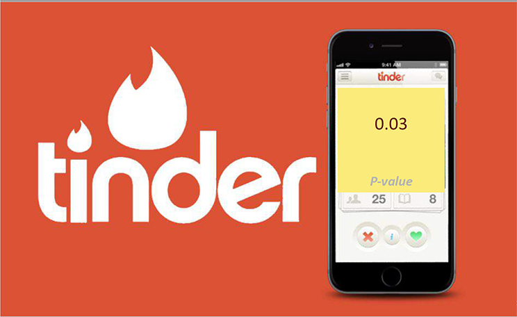
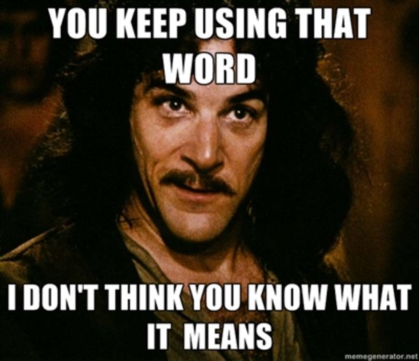

---
title       : P-Values
author      : Adam J Sullivan 
job         : Assistant Professor of Biostatistics
work        : Brown University
framework   : io2012        # {io2012, html5slides, shower, dzslides, ...}
highlighter : highlight.js # {highlight.js, prettify, highlight}
hitheme     :  github     # 
widgets     : [mathjax, quiz, bootstrap, interactive] # {mathjax, quiz, bootstrap}
ext_widgets : {rCharts: [libraries/nvd3, libraries/leaflet, libraries/dygraphs]}
mode        : selfcontained # {standalone, draft}
knit        : slidify::knit2slides
logo        : publichealthlogo.png
biglogo     : publichealthlogo.png
assets      : {assets: ../../assets}
---  .segue bg:grey


# Hypothesis Test on Proportions


--- .class #id

## Attrition Data

- We will look at the attrition data. 
- This is part of the `rsample` package. 
- You can call it with the following code:


```r
attr_pop <- rsample::attrition
```


--- .class #id

## Attrition Data

- This data is about employee attrition. 
- Many times people are interested in looking into attrition rates as it could be a sign of unhealthy work environments. 
- Attrition can happen for normal reasons like retirement or it can be through resignation, ...


--- .class #id

## Income of those who left vs stayed


```r
t.test(MonthlyIncome~Attrition, data=attr_pop)
```

--- .class #id

## Income of those who left vs stayed


```
## 
## 	Welch Two Sample t-test
## 
## data:  MonthlyIncome by Attrition
## t = 7.4826, df = 412.74, p-value = 4.434e-13
## alternative hypothesis: true difference in means is not equal to 0
## 95 percent confidence interval:
##  1508.244 2583.050
## sample estimates:
##  mean in group No mean in group Yes 
##          6832.740          4787.093
```


--- .class #id

## Another Question

- Among employees do female employees make up 1/2 of the company? 
- Among those who leave, is there a difference in males vs females? 

--- .class #id

## Coding Tables


```r
attr_pop %>%
  group_by(Gender, Attrition) %>%
  summarise(n = n()) %>%
  mutate(freq = n/sum(n))
```

--- .class #id

## Coding Tables


```
## # A tibble: 4 x 4
## # Groups:   Gender [2]
##   Gender Attrition     n  freq
##   <fct>  <fct>     <int> <dbl>
## 1 Female No          501 0.852
## 2 Female Yes          87 0.148
## 3 Male   No          732 0.830
## 4 Male   Yes         150 0.170
```


--- .class #id

## Coding Tables


```r
attr_pop %>%
  group_by(Attrition, Gender) %>%
  summarise(n = n()) %>%
  mutate(freq = n/sum(n))
```

--- .class #id

## Coding Tables


```
## # A tibble: 4 x 4
## # Groups:   Gender [2]
##   Gender Attrition     n  freq
##   <fct>  <fct>     <int> <dbl>
## 1 Female No          501 0.852
## 2 Female Yes          87 0.148
## 3 Male   No          732 0.830
## 4 Male   Yes         150 0.170
```


--- .class #id

## Coding Tables


```
## # A tibble: 4 x 4
## # Groups:   Gender [2]
##   Gender Attrition     n  freq
##   <fct>  <fct>     <int> <dbl>
## 1 Female No          501 0.852
## 2 Female Yes          87 0.148
## 3 Male   No          732 0.830
## 4 Male   Yes         150 0.170
## # A tibble: 4 x 4
## # Groups:   Attrition [2]
##   Attrition Gender     n  freq
##   <fct>     <fct>  <int> <dbl>
## 1 No        Female   501 0.406
## 2 No        Male     732 0.594
## 3 Yes       Female    87 0.367
## 4 Yes       Male     150 0.633
```


--- .class #id

## Hypothesis Test on Proportions

- We have proportions and this is different from means. 
- Proportions are from a binomial distribution. 
- This means we can actually use the *z* distribution. 
- When we assume $H_0$ we assume a probability which gives us the true variance. 

--- .class #id

## Hypothesis Test on Proportions

$$z = \dfrac{\hat{p} - \pi_0}{\sqrt{\dfrac{\pi_0(1-\pi_0)}{n}}}$$

- Where
    - $z$ is the test statistic which is normally distributed. 
    - $\hat{p}$ is the sample proportion estimate. 
    - $\pi_0$ is the proportion under the Null hypothesis. 


--- .class #id 

## Are Female employees 50% of the employees?

$$H_0:\pi=0.5 \text{ vs } H_1: \pi\ne0.5$$

- We can do this in R

--- .class #id

## Proportion Test in R


```r
table(attr_pop$Gender) %>% prop.table()
```

```
## 
## Female   Male 
##    0.4    0.6
```

--- .class #id

## Proportion Test in R


```r
table(attr_pop$Gender) %>% 
  prop.test()
```

```
## 
## 	1-sample proportions test with continuity correction
## 
## data:  ., null probability 0.5
## X-squared = 58.401, df = 1, p-value = 2.138e-14
## alternative hypothesis: true p is not equal to 0.5
## 95 percent confidence interval:
##  0.3749127 0.4256156
## sample estimates:
##   p 
## 0.4
```


--- .class #id


## Conclusions

- We can see that there is evidence that females do not make up half of the company. 
    - *p*-value <0.0001
    - 95% CI 0.37, 0.43)
    - Mean: 0.4
    

--- .class #id

## Note

- R did the test on the smaller proportion group. 
- You can force R to look at the larger group as well:

--- .class #id

## Proportion test on Males


```r
table(attr_pop$Gender) %>% 
  rev() %>%
  prop.test()
```

```
## 
## 	1-sample proportions test with continuity correction
## 
## data:  ., null probability 0.5
## X-squared = 58.401, df = 1, p-value = 2.138e-14
## alternative hypothesis: true p is not equal to 0.5
## 95 percent confidence interval:
##  0.5743844 0.6250873
## sample estimates:
##   p 
## 0.6
```

--- .class #id

## Comparing 2 Proportions

- We can then look at the difference in proportion of attrition with females vs males. 
- This can be done with a proportion test as well. 

$$z = \dfrac{\hat{p}_1 - \hat{p}_2}{\sqrt{\hat{p}(1-\hat{p})\left(\dfrac{1}{n_1} + \dfrac{1}{n_2}\right)}}$$

--- .class #id

## Comparing 2 Proportions


```r
table(attr_pop$Gender, attr_pop$Attrition) %>% 
  prop.test()
```

--- .class #id

## Comparing 2 Proportions


```
## 
## 	2-sample test for equality of proportions with continuity
## 	correction
## 
## data:  .
## X-squared = 1.117, df = 1, p-value = 0.2906
## alternative hypothesis: two.sided
## 95 percent confidence interval:
##  -0.01723399  0.06145168
## sample estimates:
##    prop 1    prop 2 
## 0.8520408 0.8299320
```


--- .class #id

## Conclusions

- There does not seem to be a difference based on employees leaving of different genders.
    - *p*-value: 0.29


--- .class #id

## *p*-Values Clarified

>  Informally, a *p*-value is the probability under a specified statistical model that a statistical summary of the data (for example, the sample mean difference between 2 compared groups) would be equal to or more extremee than its observed value
- (ASA Statement)

--- .class #id

## *p*-value Clarified

> That Definition is about as clear as mud. 
- Christie Aschwanden, lead writer for science, FiveThirtyEight. 

--- .class #id

## Clearer than This

> The simplest general definition of a *p*-value of a point null hypothesis that I know of is as follows. Suppose the hypothesis is that $\mathbb{P}$ is the probability distribution of the data $X$, which takes on values in the measurable space $\chi$. Let $\{R_\alpha\}_{\alpha\in[0,1]}$ be a collection of $\mathbb{P}$-measurble subsets of $\chi$ such that:

> 1. $\mathbb{P}(R_\alpha)= \alpha$
> 2.  $\alpha^\prime<\alpha$ then $R_{\alpha^\prime}\subset R_\alpha$. 

> Then the *p*-value of  $H_0$ for the data $X=x$ is $inf_{\alpha\in[0,1]}\{\alpha:x\in R_\alpha\}$


--- .class #id

## What the *p*-value?

- We know some stuff. 
- We want to know some more. 
- We design an experiment to help us. 
- We collect data from the experiment.
- We summarize the results. 
- What do we know now?

--- .class #id

## Summarizing the Data

- We summarize the data into a statistic. 
- We compute a probability from that statistic. (*p*-value)
- If it is small enough we say it is "Statistically Significant"
- This is typically 0.05. 


--- .class #id

## How do we Compute *p*-values?

- We assume a bunch of stuff. 
    - Normality
    - Independence
    - No difference between exposures. 
    - Same at baseline.
    - ...


--- .class #id

## What does a p-value of 0.03 mean?

- If there is no difference between the treatment and the placebo. 
- If everything else we assumed is also true. 
- Then the probability we would observe the difference we found or even larger is 0.03. 

--- .class #id

## Statistically Significant

- Small *p*-values are considered statistically significant. 
- R.A. Fisher was the first to call these significant. 

--- .class #id

## Definition


--- .class #id

## What did he mean?

- It was worth a closer look. 
- [Scientific American](https://www.scientificamerican.com/article/just-a-theory-7-misused-science-words/) says it is one of the 7 most misused science words. 

--- .class #id

## Another Approach



--- .class #id

## Correct Interpretation


--- .class #id

## What you read in Literature:
  


--- .class #id

## *p*-values in Literature $\approx 0.06$

- Almost Significant. 
- Almost attained significance. 
- Almost significant tendency
- Almost became significant. 
- Almost but not quite significant. 
- Almost Statistically Significant. 
- Almost reached statistical significance. 
- Just barely below the level of significance. 
- Just beyond Significance. 

--- .class #id

## *p*-values in Literature $\approx 0.08$

- A certain trend towards significance. 
- A definite trend. 
- A slight tendency towards significance. 
- A strong trend towards significance. 
- A trend close to significance. 
- An expected trend. 
- Approached our criteria for Significance. 
- Approaching borderline Signficance.
- Approaching, although not reaching, significance. 

--- .class #id

## *p*-values in Literature $\approx 0.05$

- Hovered at nearly a significant level (p=0.058)
- Hovers on the brink of significance (p=0.055)
- Just about significant (p=0.051)
- Just above the margin of significance (p=0.053)
- just at the conventional level of significance (p=0.05001)
- Just barely statistically significant (p=0.054)
- Just escaped significance (p=0.054)
- Just borderline significant (p=0.058)
- Just escaped significance (p=0.057)
- Just failed significance (p=0.057)

--- .class #id

## Inigo Montoya



--- .class #id

## Published Quotes

- THose are all quotes from published research. 
- [Matthew Hankins](http://www.academiaobscura.com/still-not-significant/) has even more quotes here. 
- [ASA Statement on P-values](https://amstat.tandfonline.com/doi/full/10.1080/00031305.2016.1154108#.XcyrAFdKhPa)

--- .class #id

## *p*-value Principles

1. *p*-value can indicate how incompatible the data are with a specified statistical model. 
2. *p*-value doe not measure the probability that the studied hypothesis is true, or the probability that the data were produced by random chance alone. 
3. Scientific conclusions and business or policy decisions should not be based only on whether a *p*-value passes a specific threshold. 

--- .class #id

## *p*-value Principles

4. Proper inference requires ful 	
5. A *p*-value, or statistical significance, does not measure the size of an effect or the importance of a result.l reporting and transparency
6. By itself, a *p*-value does not provide a good measure of evidence regarding a model or hypothesis.


--- .class #id

## What can we do?

- Thoughtful Research considers:
    - Related prior evidence.
    - Plausibility of mechanism.
    - Study design.
    - Data Quality
    - Real world costs and benefits. 
    - Novelty of finding. 

--- .class #id

## What can we do?

- Consider multiple approaches for solving problems. 
    - Multiple models
    - Multiple tests
    - confidence intervals
    - magnitude of estimates
    - Assume a minimal effect rather than no effect. 


--- .class #id

## What can we do?

- Remember all statistics contain error and are uncertain. 
- Encourage others to reproduce your work. 
- Statistical inference is just one part of the scientific inference process. 


--- .class #id

## Remarks

- Thank you to:
  - Allen Schirm
  - Ron Wasserstein
- Much of the content was from a talk they gave. 
- [Moving to a World Beyond p<0.05](https://www.causeweb.org/cause/uscots/uscots19/keynote/2)


