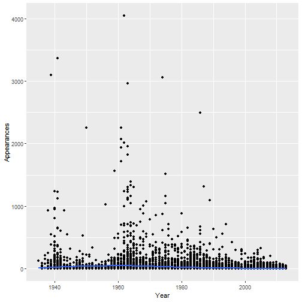
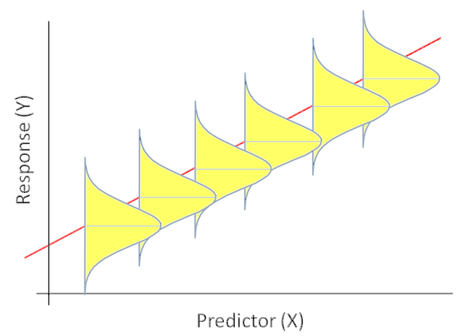
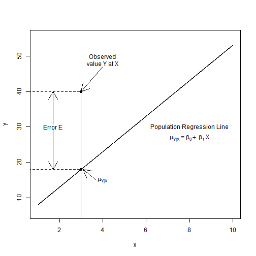
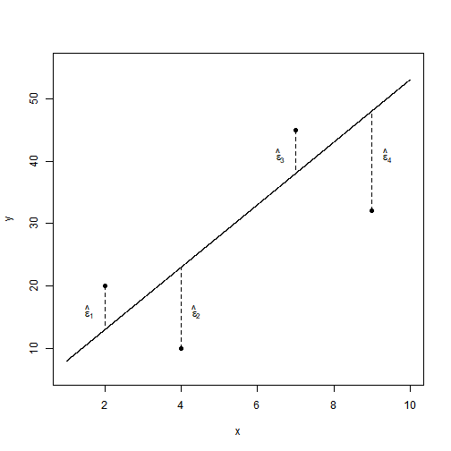

---
title       : Linear Regression Basics
author      : Adam J Sullivan 
job         : Assistant Professor of Biostatistics
work        : Brown University
framework   : io2012        # {io2012, html5slides, shower, dzslides, ...}
highlighter : highlight.js # {highlight.js, prettify, highlight}
hitheme     :  github     # 
widgets     : [mathjax, quiz, bootstrap, interactive] # {mathjax, quiz, bootstrap}
ext_widgets : {rCharts: [libraries/nvd3, libraries/leaflet, libraries/dygraphs]}
mode        : selfcontained # {standalone, draft}
knit        : slidify::knit2slides
logo        : publichealthlogo.png
biglogo     : publichealthlogo.png
assets      : {assets: ../../assets}
---  .segue bg:grey


--- .segue bg:grey


# Linear Regression 


--- .class #id

## Outline


1. One Categorical Covariate
2. One Continuous Covariate
3. Multiple Covariates


--- .class #id

## The Data for Class

- We will consider the data behind the story: ["Comic Books are Still Made By Men, For Men and About Men"](http://fivethirtyeight.com/features/women-in-comic-books/).
- This data is part of the `fivethirtyeight` package:
- To explore the variable names run the following code:


```r
library(fivethirtyeight)
?comic_characters
```

--- .class #id

## Appearances

- We will consider appearances on the comic books. 
- We will see what predicts the number of appearances. 

--- .segue bg:grey


# One Categorical Covariate - Binary

--- .class #id

## Binary Covariate

- With this type of covariate, we are comparing some outcome against 2 different groups. 
- In order to make these comparisons it depends on the outcome we are working with. 
- We will perform these tests based on the outcome and then use confidence intervals to assess. 

--- .class #id


## Differences in appearances by publisher

- Let's consider the difference in appearances by publisher


```r
library(fivethirtyeight)
library(tidyverse)

cnt <-  comic_characters%>% 
  group_by(publisher) %>%
  tally()
mn<- comic_characters%>% 
  group_by(publisher) %>%
  summarise(mean_app=mean(appearances, na.rm=T))
full_join(cnt,mn)
```

--- .class #id


## Differences in appearances by publisher

- Let's consider the difference in appearances by publisher


```
## # A tibble: 2 x 3
##   publisher     n mean_app
##   <chr>     <int>    <dbl>
## 1 DC         6896     23.6
## 2 Marvel    16376     17.0
```

--- .class #id


## Differences in Appearances by Publisher

- We have learned how to do this previously. 
- We first did this comparison with a t-test
- Then we did this with an F-test in ANOVA

--- .class #id


## Appearance by Publisher: t-test

- Consider this with a t-test


```r
t.test(appearances~publisher, comic_characters)
```

```
## 
## 	Welch Two Sample t-test
## 
## data:  appearances by publisher
## t = 4.9476, df = 13552, p-value = 7.605e-07
## alternative hypothesis: true difference in means is not equal to 0
## 95 percent confidence interval:
##  3.980214 9.203299
## sample estimates:
##     mean in group DC mean in group Marvel 
##             23.62513             17.03338
```

--- .class #id


## Appearances by publisher: ANOVA

- Consider with ANOVA


```r
library(broom)
tidy(aov(appearances~publisher, comic_characters))
```

```
## # A tibble: 2 x 6
##   term         df      sumsq  meansq statistic     p.value
##   <chr>     <dbl>      <dbl>   <dbl>     <dbl>       <dbl>
## 1 publisher     1    199019. 199019.      22.6  0.00000197
## 2 Residuals 21819 191840416.   8792.      NA   NA
```

--- .class #id


## ANOVA vs t-test

- t-test and ANOVA should give us the same results.
- We can see that in our output this is not true. 
- What were the assumptions of ANOVA?

--- .class #id
 

## Appearances by publisher: t-test

- Consider this with a t-test


```r
t.test(appearances~publisher, comic_characters, var.equal=TRUE)
```

```
## 
## 	Two Sample t-test
## 
## data:  appearances by publisher
## t = 4.7577, df = 21819, p-value = 1.971e-06
## alternative hypothesis: true difference in means is not equal to 0
## 95 percent confidence interval:
##  3.876078 9.307436
## sample estimates:
##     mean in group DC mean in group Marvel 
##             23.62513             17.03338
```

--- .class #id


## Linear Regression


```r
model <- lm(appearances~publisher, comic_characters)
tidy(model)
glance(model)
```

--- .class #id

## Linear Regression


```
## # A tibble: 2 x 5
##   term            estimate std.error statistic  p.value
##   <chr>              <dbl>     <dbl>     <dbl>    <dbl>
## 1 (Intercept)        23.6       1.16     20.4  1.89e-91
## 2 publisherMarvel    -6.59      1.39     -4.76 1.97e- 6
## # A tibble: 1 x 11
##   r.squared adj.r.squared sigma statistic p.value    df  logLik    AIC
##       <dbl>         <dbl> <dbl>     <dbl>   <dbl> <int>   <dbl>  <dbl>
## 1   0.00104      0.000991  93.8      22.6 1.97e-6     2 -1.30e5 2.60e5
## # ... with 3 more variables: BIC <dbl>, deviance <dbl>, df.residual <int>
```

--- .class #id


## Interpreting the Coefficients: Categorical

- Intercept is the average for the reference group. 
- Each coefficient is the average change between the reference group and the one of interest. 


--- .class #id


## Interpreting the Coefficients: Categorical

- Intercept interpretation: Every DC character has on average 23.6 appearances. 
- Marvel Coefficient: Every marvel character has on average 6.59 less appearances than DC. 


--- .class #id


## One Binary Categorical Variable - Continuous Outcome

- We can perform
    - t-test with equal variances
    - ANOVA
    - Linear Regression
- All yield the same exact results

--- .class #id


## Assumptions of Linear Regression

- ***Linearity:*** Function $f$ is linear. 
- Mean of error term is 0. 
    $$E(\varepsilon)=0$$
- ***Independence:*** Error term is independent of covariate. 
    $$Corr(X,\varepsilon)=0$$
- ***Homoscedacity:*** Variance of error term is same regardless of value of $X$. 
    $$Var(\varepsilon)=\sigma^2$$
- ***Normality:*** Errors are normally Distributed


--- .class #id

## What about more categories?

- We can also use linear regression with multiple categories. 


```r
mod <- lm(appearances~sex, comic_characters)
tidy(mod)
```


--- .class #id

## What about more categories?

- We can also use linear regression with multiple categories. 


```
## # A tibble: 6 x 5
##   term                      estimate std.error statistic  p.value
##   <chr>                        <dbl>     <dbl>     <dbl>    <dbl>
## 1 (Intercept)                 19.7        14.8    1.33   0.182   
## 2 sexFemale Characters         1.37       14.8    0.0927 0.926   
## 3 sexGenderfluid Characters  263.         69.2    3.80   0.000146
## 4 sexGenderless Characters    -6.82       26.4   -0.258  0.796   
## 5 sexMale Characters          -0.640      14.8   -0.0433 0.965   
## 6 sexTransgender Characters  -15.7        96.7   -0.162  0.871
```


--- .class #id

## How do we interpret? 

- We need to know the baseline. 


```
## # A tibble: 7 x 3
##   sex                        n mean_sex
##   <chr>                  <int>    <dbl>
## 1 Agender Characters        45    19.7 
## 2 Female Characters       5804    21.0 
## 3 Genderfluid Characters     2   282.  
## 4 Genderless Characters     20    12.8 
## 5 Male Characters        16421    19.0 
## 6 Transgender Characters     1     4   
## 7 <NA>                     979     5.13
```


--- .class #id

## Working with Factors

- Since we are interested in knowing whether or not male characters appear more often, we need to change how we view the factor.
- We will work on the following:
      - Renaming factors
      - Reordering factor levels. 


--- .class #id


## Working with Factors: Renaming


```r
comic_characters <- comic_characters %>%
      mutate(sex = fct_recode(sex, 
      "Agender" = "Agender Characters",
      "Female" = "Female Characters", 
      "Genderfluid" = "Genderfluid Characters",
      "Genderless" = "Genderless Characters",
      "Male" = "Male Characters",
      "Transgender" = "Transgender Characters"
      ))
```

--- .class #id


## Working with Factors: Relevel


```r
comic_characters <- comic_characters %>%
      mutate(sex = fct_relevel(sex, 
                  "Male",
                 "Female", 
                 "Transgender", 
                 "Agender",
                  "Genderfluid" ,
                  "Genderless" 
                  
      ))
```


--- .class #id

## Regression again


```r
mod <- lm(appearances~sex, comic_characters)
tidy(mod)
```


--- .class #id

## Regression again


```
## # A tibble: 6 x 5
##   term           estimate std.error statistic   p.value
##   <chr>             <dbl>     <dbl>     <dbl>     <dbl>
## 1 (Intercept)      19.0       0.770   24.7    5.16e-133
## 2 sexFemale         2.01      1.50     1.34   1.81e-  1
## 3 sexTransgender  -15.0      95.6     -0.157  8.75e-  1
## 4 sexAgender        0.640    14.8      0.0433 9.65e-  1
## 5 sexGenderfluid  263.       67.6      3.90   9.75e-  5
## 6 sexGenderless    -6.18     21.9     -0.282  7.78e-  1
```


--- .class #id

## Interpreting the Coefficients: Categorical

- Intercept interpretation: Every Male Character has on average 19 appearances. 
- Agender coefficient: Every Agender character has on average 0.64 more appearances than male characters
- ...


--- .class #id


## Whats happening?


```r
ggplot(comic_characters, aes(x = sex, y = appearances)) +
  geom_point()  + 
  geom_point(stat = "summary", fun.y = "mean", color = "red", size = 3) + 
  theme(axis.text.x = element_text(angle = 90, hjust = 1))
```


--- .class #id


## Whats happening?


---  .segue bg:grey


# One Continuous 


--- .class #id

## One Continuous Covariate

- We will consider one continuous covariate. 
- We will consider year. 


--- .class #id


## Example: Year and Appearances

- Consider the effect of year on appearances. 
- With categorical data we plotted this with box-whisker plots. 
- We can now use a scatter plot

--- .class #id


## Scatter Plot: Year and Appearances


```r
ggplot(comic_characters, aes(year, appearances)) + 
  geom_point() + 
  geom_smooth(method="lm") + 
  xlab("Year") + 
  ylab("Appearances")
```


--- .class #id

## Scatter Plot: Year and Appearances





--- .class #id


## Modeling What We See

- There might not be a connection or there might be a very small one, let's explore further.
- How can we do this? 
- How does linear regression work?


--- .class #id


## How do we Quantify this?

- One way we could quantify this is
$$\mu_{y|x} = \beta_0 + \beta_1X$$
- where
    - $\mu_{y|x}$ is the mean time for those whose year is $x$. 
    - $\beta_0$ is the $y$-intercept (mean value of $y$ when $x=0$, $\mu_y|0$)
    - $\beta_1$ is the slope (change in mean value of $Y$ corresponding to 1 unit increase in $x$).

--- .class #id


## Population Regression Line

- With the population regression line we have that the distribution of appearances for those at a particular year, $x$, is approximately normal with mean, $\mu_{y|x}$, and standard deviation, $\sigma_{y|x}$. 


--- .class #id


## Population Regression Line




--- .class #id

## Population Regression Line

- This shows the scatter about the mean due to natural variation. To accommodate this scatter we fit a regression model with 2 parts:
    - Systematic Part
    - Random Part

--- .class #id


## The Model

- This leads to the model
$$Y = \beta_0 + \beta_1X + \varepsilon$$
- Where $\beta_0+\beta_1X$ is the systematic part of the model and implies that $$E(Y|X=x) = \mu_{y|x} = \beta_0 + \beta_1x$$
- the variation part where we have $\varepsilon\sim N(0,\sigma^2)$ which is independent of $X$. 


--- .class #id

## What do We Have?

- Consider the scenario where we have $n$ subjects and for each subject we have the data points $(x,y)$. 
- This leads to us having data in the form $(X_i,Y_i)$ for $i=1,\ldots,n$.
- Then we have the model:
  $$Y_i = \beta_0 + \beta_1X_i + \varepsilon_i$$
- $Y_i|X_i \sim N\left(\beta_0 + \beta_1X_i , \sigma^2\right)$
- $E(Y_i|X_i) = \mu_{y|x} = \beta_0 + \beta_1X_i$
- $Var(Y|X_i ) = \sigma^2$

--- .class #id

## Picture of this





--- .class #id

## What Does This Tell Us?

- We can refer back to our scatter plot now and discuss what is the "best" line. 
- Given the previous image we can see that a good estimator would somehow have smaller residual errors. 
- So the "best" line would minimize the errors. 

--- .class #id


## Residual Errors




--- .class #id


## In Comes Least Squares

- The least squares estimator of regression coefficients in the estimator that minimizes the sum of squared errors.
- We denote these estimators as $\hat{\beta}_0$ and $\hat{\beta}_1$. 
- In other words we attempt to minimize 
$$\sum_{i=1}^n \left(\varepsilon_i\right)^2 = \sum_{i=1}^n \left(Y_i - \hat{\beta}_0 - \hat{\beta}_1X_i\right)^2$$

--- .class #id


## Inferences on OLS

- Once we have our intercept and slope estimators the next step is to determine if they are significant or not. 
- Typically with hypothesis testing we have needed the following:
    - Population/Assumed Value of interest
    - Estimated value
    - Standard error of Estimate


--- .class #id

## Confidence Interval Creation

- with 95% confidence intervals of
$$\hat{\beta}_1 \pm t_{n-2, 0.975} \cdot se\left(\hat{\beta}_1\right)$$
$$\hat{\beta}_0 \pm t_{n-2, 0.975} \cdot se\left(\hat{\beta}_0\right)$$
- In general we can find a  $100(1-\alpha)\%$ confidence interval as
$$\hat{\beta}_1 \pm t_{n-2, 1-\dfrac{\alpha}{2}} \cdot se\left(\hat{\beta}_1\right)$$
$$\hat{\beta}_0 \pm t_{n-2, 1-\dfrac{\alpha}{2}} \cdot se\left(\hat{\beta}_0\right)$$


--- .class #id

## Example: Year and Appearances


```r
model <- lm(appearances~year, data=comic_characters)
tidy(model, conf.int=TRUE)[,-c(3:4)]
glance(model)
```

--- .class #id


## Example: Year and Appearances


```
## # A tibble: 2 x 5
##   term         estimate std.error statistic  p.value
##   <chr>           <dbl>     <dbl>     <dbl>    <dbl>
## 1 (Intercept)  1204.      67.0         18.0 1.09e-71
## 2 year           -0.596    0.0337     -17.7 1.74e-69
```

--- .class #id


## Example: Year and Appearances


```
## # A tibble: 1 x 11
##   r.squared adj.r.squared sigma statistic  p.value    df  logLik    AIC
##       <dbl>         <dbl> <dbl>     <dbl>    <dbl> <int>   <dbl>  <dbl>
## 1    0.0146        0.0145  93.8      313. 1.74e-69     2 -1.26e5 2.52e5
## # ... with 3 more variables: BIC <dbl>, deviance <dbl>, df.residual <int>
```

--- .class #id

## Interpreting the Coefficients: Continuous

- Before we can discuss the regression coefficients we need to understand how to interpret what these coefficients mean. 
-  $\beta_0$ is mean value for $Y$ when $X=0$.
- What about $\beta_1$?


--- .class #id

## Interpreting the Coefficients: Continuous

- Then we consider $\beta_1$ to see the meaning of this we do the following
$$
\begin{aligned}
    E(Y|X=x+1) - E(Y|X=x) &= \beta_0 + \beta_1(x+1) - \beta_0 - \beta_1x\\
    &= \beta_1
\end{aligned}
$$


--- .class #id


## Interpreting the Coefficients: Continuous

- We consider $\beta_0$ first. 
- Does this value have meaning with our current data? 
    - The estimated value of time level is only applicable to year within the range of our data. 
    - Many times the intercept is scientifically meaningless. 
    - Even if meaningless on its own, $\beta_0$ is necessary to specify the equation of our regression line. 
    - **Note:** People do sometimes use mean centered data and the intercept is then interpretable.


--- .class #id


## Interpreting the Coefficients: Continuous

- This gives us the interpretation that $\beta_1$ represents the mean change in outcome $Y$ given a one unit increase in predictor $X$. 
- This is not an actual prescription though, this is considering different subjects or groups of subjects who differ by one unit. 
- Below are correct interpretations of $\beta_1$ in our example. 
    - *These results display that the mean difference in appearances for a 1 year difference is -0.596*
    - *These results display that the mean difference in time for a 10 year difference is -5.96*


