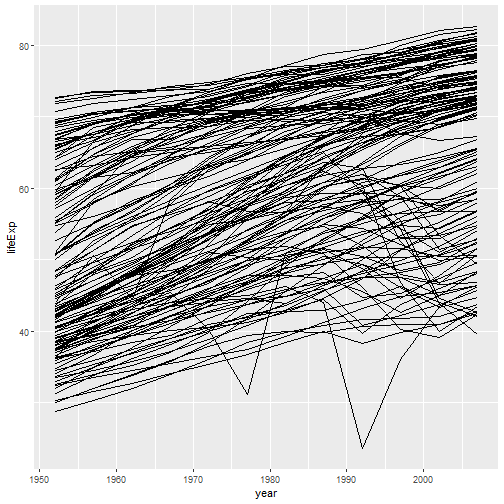
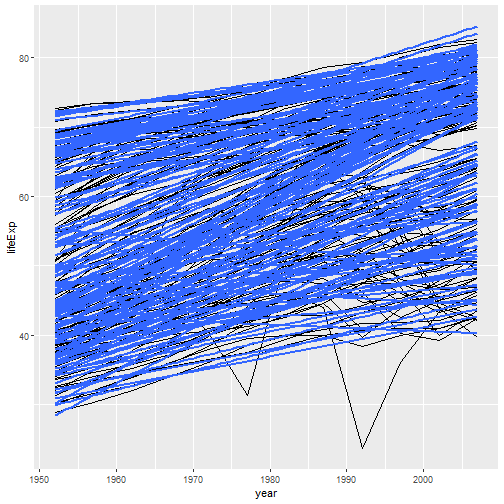
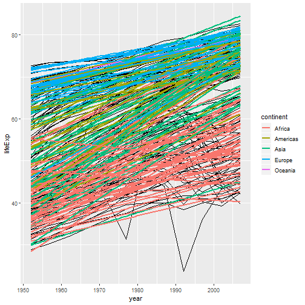
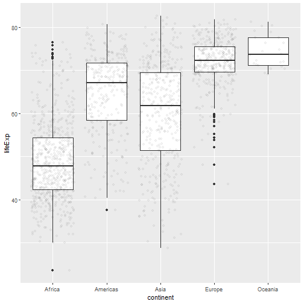

<style type="text/css">
.table {

    width: 80%;
    margin-left:10%; 
    margin-right:10%;
}
</style>

### Homework Policies:

*You are encouraged to discuss problem sets with your fellow students (and with the Course Instructor of course), but you must write your own final answers, in your own words. Solutions prepared ``in committee'' or by copying someone else's paper are not acceptable.  This violates the Brown standards of plagiarism, and you will not have the benefit of having thought about and worked the problem when you take the examinations.*

*All answers must be in complete sentences and all graphs must be properly labeled.*

***In this homework you will be required to use .Rmd to do it., you can then knit to a word document of PDF to turn it in.***

***For the PDF Version of this assignment: [PDF](https://raw.githubusercontent.com/php-1510-2510/php-1510-2510.github.io/master/homework/hw2.pdf)***

***For the R Markdown Version of this assignment: [RMarkdown](https://raw.githubusercontent.com/php-1510-2510/php-1510-2510.github.io/master/homework/hw2.Rmd)***

### Turning the Homework in:

*Please turn the homework in through canvas. You may use a pdf, html or word doc file to turn the assignment in.*

[PHP 1510 Assignment Link](https://canvas.brown.edu/courses/1078851/assignments/7744738)

[PHP 2510 Assignment Link](https://canvas.brown.edu/courses/1078852/assignments/7744739)


## The Data


We will work with the dataset called [gapminder](https://github.com/jennybc/gapminder), this is a cleaned up version from [Gapminder Data](http://www.gapminder.org/data/). Gapminder contains a lot of great data on all of the nations of the world. We first need to install the gapminder package in R. 

```
install.packages("gapminder")
```


```
library(dplyr)
library(gapminder)
gapminder
```


### Problems for Everyone


Use **dplyr** functions to address the following questions. For some you can just use arrange to print your solutions to the top. 

1. How many unique countries are represented per continent?


```r
library(gapminder)
```

```
## Warning: package 'gapminder' was built under R version 3.5.3
```

```r
library(dplyr)
```

```
## 
## Attaching package: 'dplyr'
```

```
## The following objects are masked from 'package:stats':
## 
##     filter, lag
```

```
## The following objects are masked from 'package:base':
## 
##     intersect, setdiff, setequal, union
```

```r
gapminder %>%
    group_by(continent) %>%
    summarise(unique_countries=n_distinct(country))
```

```
## Warning: The `printer` argument is deprecated as of rlang 0.3.0.
## This warning is displayed once per session.
```

```
## # A tibble: 5 x 2
##   continent unique_countries
##   <fct>                <int>
## 1 Africa                  52
## 2 Americas                25
## 3 Asia                    33
## 4 Europe                  30
## 5 Oceania                  2
```

**This is probably the easiest way to do this but there may be other ways. We can see that Oceania has the fewest number by far.**

2. Which European nation had the lowest GDP per capita in 1997? 


```r
gapminder %>%
    filter(year==1997) %>%
    filter(continent=="Europe") %>%
    filter(gdpPercap==min(gdpPercap))
```

```
## # A tibble: 1 x 6
##   country continent  year lifeExp     pop gdpPercap
##   <fct>   <fct>     <int>   <dbl>   <int>     <dbl>
## 1 Albania Europe     1997    73.0 3428038     3193.
```

**We can see that Albania has the lowest GDP per capita in 1997. There are other ways to display this using arrange below.**


```r
gapminder %>%
    filter(year==1997) %>%
    filter(continent=="Europe") %>%
    arrange(gdpPercap) %>%
    print(n=1)
```


3. According to the data available, what was the average life expectancy across each continent in the 1980s?


```r
gapminder %>%
    filter(year>=1980 & year<=1989) %>%
    group_by(continent) %>%
    summarize(avg_lifeExp=mean(lifeExp))
```

```
## # A tibble: 5 x 2
##   continent avg_lifeExp
##   <fct>           <dbl>
## 1 Africa           52.5
## 2 Americas         67.2
## 3 Asia             63.7
## 4 Europe           73.2
## 5 Oceania          74.8
```

**It appears that Europe and Oceania has a higher average life expectancy than the other continents. Another way to code this is shown below**


```r
gapminder %>%
    filter(between(year,1980,1989)) %>%
    group_by(continent) %>%
    summarize(avg_lifeExp=mean(lifeExp))
```

4. What 5 countries have the highest total GDP over all years combined?


```r
gapminder %>%
group_by(country) %>%
    summarize(totalGDP=sum(gdpPercap*pop)) %>%
    arrange(desc(totalGDP)) %>%
    print(n=5)
```

```
## # A tibble: 142 x 2
##   country        totalGDP
##   <fct>             <dbl>
## 1 United States   7.68e13
## 2 Japan           2.54e13
## 3 China           2.04e13
## 4 Germany         1.95e13
## 5 United Kingdom  1.33e13
## # ... with 137 more rows
```

**You first have to create Total GDP and then sum it all up. When doing this, we see that the US has the highest, followed by Japan and China. Additional Code Displayed Below.**


```r
gapminder %>%
group_by(country) %>%
    summarize(totalGDP=sum(gdpPercap*pop)) %>%
    top_n(5,totalGDP) %>%
    arrange(desc(totalGDP))
```


```r
gapminder %>%
group_by(country) %>%
    mutate(totalGDP =gdpPercap*pop ) %>%
    summarize(totalGDP=sum(totalGDP)) %>%
    arrange(desc(totalGDP)) %>%
    print(n=5)
```

5. What countries and years had life expectancies of _at least_ 80 years? *Only output the columns of interest: country, life expectancy and year (in that order).*


```r
gapminder %>%
    filter(lifeExp>=80) %>%
    select(country,lifeExp,year) %>%
    print(n=30)
```

```
## # A tibble: 22 x 3
##    country          lifeExp  year
##    <fct>              <dbl> <int>
##  1 Australia           80.4  2002
##  2 Australia           81.2  2007
##  3 Canada              80.7  2007
##  4 France              80.7  2007
##  5 Hong Kong, China    80    1997
##  6 Hong Kong, China    81.5  2002
##  7 Hong Kong, China    82.2  2007
##  8 Iceland             80.5  2002
##  9 Iceland             81.8  2007
## 10 Israel              80.7  2007
## 11 Italy               80.2  2002
## 12 Italy               80.5  2007
## 13 Japan               80.7  1997
## 14 Japan               82    2002
## 15 Japan               82.6  2007
## 16 New Zealand         80.2  2007
## 17 Norway              80.2  2007
## 18 Spain               80.9  2007
## 19 Sweden              80.0  2002
## 20 Sweden              80.9  2007
## 21 Switzerland         80.6  2002
## 22 Switzerland         81.7  2007
```

**We can see that the first time this was recorded was in 1997 in Hong Kong and Japan. Other countries achieved this in 2002 or 2007.**


6. Which three countries have had the most consistent population estimates (i.e. lowest standard deviation) across the years of available data? 


```r
gapminder %>%
    group_by(country) %>%
    summarize(standard_deviation=sd(pop)) %>%
    arrange(standard_deviation) %>%
    print(n=3)
```

```
## # A tibble: 142 x 2
##   country               standard_deviation
##   <fct>                              <dbl>
## 1 Sao Tome and Principe             45906.
## 2 Iceland                           48542.
## 3 Montenegro                        99738.
## # ... with 139 more rows
```

** We can see that Sao Tome and Principe as well as Iceland have a similar standard deviation. The next smallest is Montenegro and it has twice the standard deiation of the other 2.**


```r
gapminder %>%
    group_by(country) %>%
    summarize(standard_deviation=sd(pop)) %>%
    top_n(-3,standard_deviation) %>%
    arrange(standard_deviation)
```


7. Follow the steps below to create a plot about life expectancy.  
    a. Create a plot of life expectancy over time where each country has its own line (`group=country`).  
    
    ```r
    library(ggplot2)
    ggplot(data=gapminder, aes(x=year, y=lifeExp, group=country)) + 
      geom_line()
    ```
    
    
    b. Add a layer to this plot where you use `geom_smooth(method="lm")`
    
    ```r
    ggplot(data=gapminder, aes(x=year, y=lifeExp, group=country)) + 
      geom_line() + 
      geom_smooth(method="lm", se=FALSE)
    ```
    
    
    c. Add a layer to this plot where you use `geom_smooth(method="lm")` but it is colored by continent. 
    
    ```r
    ggplot(data=gapminder, aes(x=year, y=lifeExp, group=country)) + 
      geom_line() + 
      geom_smooth(method="lm", se=FALSE) + 
      geom_smooth(method="lm", se=FALSE, aes(color=continent)) 
    ```
    
    
    
**We can see the above plots. These are what we call Spaghetti Plots. They help us view data over time. The second plot adds a linear regression to see how the general trend is given country. I added `se=FALSE` which most will not have added. This gets rid of the variance bars around the lines. The final plot add the line but color each of them by continent.**


    
    
8. Interpret the graph you created in 7. 
    a. What types of patterns are you seeing? 
    b. Do all countries follow this pattern? 
    c. etc...

**We can see that most of them have an increasing trend. There are many countries that have some major dips in Life Expectancy. We can see that in 1994 one country dipped down to 36 years life expectancy. Later we will see that this is the Rwandan Genocide.**

9. Create boxplots of life expectancy by continent. Add a layer using `geom_jitter()` to see how the points fall in these boxplots. **Hint: using `alpha=0.04` inside the jitter will lighten the points*


```r
ggplot(data=gapminder, aes(x=continent, y=lifeExp)) + 
    geom_boxplot() + 
  geom_jitter(alpha=0.04) 
```


10. Interpret the plot you made in 9. 

**We can see that Africa has many data points compared to the rest of the continents. They appear to be normally distributed with some positive skewing. Europe may also have a normally distributed life expectancy except with negative skewing. The other distributions for continents shows skewing and the median not in the center of the box. Asia has the biggest variance of all continents. Oceania has the fewest points but this is due to only 2 countries being in this continent.**

## PHP 2560 Only

11. Which combinations of continent (besides Asia) and year have the highest average population across all countries? *your output should include all results sorted by highest average population*. With what you already know, this one may stump you. See [this Q&A](http://stackoverflow.com/q/27207963/654296) for how to `ungroup` before `arrange`ing. 


```r
gapminder %>%
    filter(continent!="Asia") %>%
    group_by(continent,year) %>%
    summarize(average_pop=mean(pop)) %>%
    ungroup() %>%
    arrange(desc(average_pop)) %>%
    select(continent,year,average_pop)
```

```
## # A tibble: 48 x 3
##    continent  year average_pop
##    <fct>     <int>       <dbl>
##  1 Americas   2007   35954847.
##  2 Americas   2002   33990910.
##  3 Americas   1997   31876016.
##  4 Americas   1992   29570964.
##  5 Americas   1987   27310159.
##  6 Americas   1982   25211637.
##  7 Americas   1977   23122708.
##  8 Americas   1972   21175368.
##  9 Europe     2007   19536618.
## 10 Europe     2002   19274129.
## # ... with 38 more rows
```

** We can see that the Americas have the highest 8 populations and then it goes to Europe in the top 10.**


12.  Consider the function below


```r
library(nycflights13)
```

```
## Warning: package 'nycflights13' was built under R version 3.5.3
```

```r
    hourly_delay <- filter(
              summarise(
                  group_by(
                      filter(
                        flights, 
                        !is.na(dep_delay)
                        ),
                        month, day, year, hour
                        ),
                        delay=mean(dep_delay),
                        n=n()
                        ),
                        n>10
                        )
```
    


  a. What are some problems with this function? 
  
  **The main issue with this is readability. Also consider what would happen if I asked for some changes to be made to this code. How would you re-nest it to get it to work. It is important to note that R has no problem with either of these and speed would be similar if not the same.**
  
  b. How easy is it to follow the logic of this? 
  **Logic for this type of code is not easy to follow**
  c. Rewrite this using piping to make it more understandable. 

```r
hourly_delay2 <- flights %>%
                    filter(!is.na(dep_delay)) %>%
                    group_by(month, day, year, hour) %>%
                    summarise(delay=mean(dep_delay), n=n()) %>%
                    filter(n>10)
```
  d. Does your rewritten command give the same results? 


```r
all.equal(hourly_delay, hourly_delay2)
```

```
## [1] TRUE
```
  

**This is the best way to compare if things are equal in R. Many of you did not know this function so a visual comparison will work as well. **

