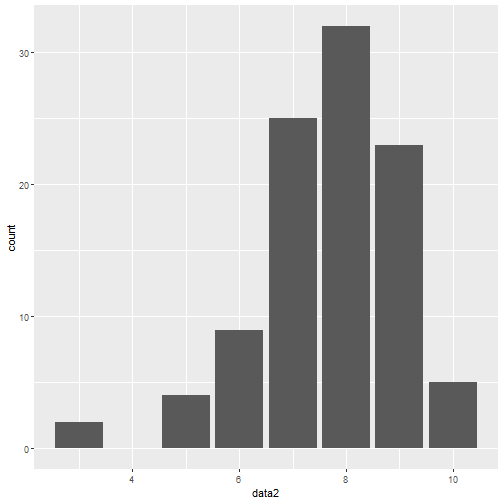

## Objectives

In this lab we will focus on using R to model probabilities based on common distributions. 


## Discrete Random Variable

1. Bernoulli

- Recall: Bernoulli random variable takes on only 2 values:
    - Success with probability $p$
    - Failure with probability $1-p$

2. Binomial

- Recall: Binomial is a sequence of $n$ independet Bernoulli trials. 
- Recall: This time we are interested in the total number of successes. 

### Discrete Random Variable Examples

1. Suppose that 10 randomly selected Breast cancer patients were observed for 5 year, and each patient from that population has an equal survival probability of 0.8. You are interested in the number of breast cancer patients who survive 5 years. 
    (a) What is the probability that exactly 2 patients will survive? 
    - Mathematically this would be:
$$Pr(X=2)$$
    - We recognize this as the PMF function which in R is the `dbinom()`. 
    
    ```r
    dbinom(2, 10, 0.8)
    ```
    
    ```
    ## [1] 7.3728e-05
    ```

    (b) What is the probability that all patients survive? 
    - Mathematically this would be:
$$Pr(X=10)$$
    - We recognize this as the PMF function which in R is the `dbinom()`. 
    
    ```r
    dbinom(10, 10, 0.8)
    ```
    
    ```
    ## [1] 0.1073742
    ```
    (c) What is the probability that less than 7 patients survive. 
    - Mathematically this would be:
$$Pr(X\le 7)$$
    - We recognize this as the CDF function which in R is the `dbinom()`. 
    
    ```r
    pbinom(7, 10, 0.8)
    ```
    
    ```
    ## [1] 0.3222005
    ```
    (d) What is the probability that between 3 and 7 patients survive?
    - Mathematically this would be:
$$Pr(3\le X\le 7)= PR(X\le 7) - Pr(X\le 3)$$
    - We recognize this as the CDF function which in R is the `dbinom()`. 
    
    ```r
    pbinom(7, 10, 0.8) - pbinom(3, 10, 0.8)
    ```
    
    ```
    ## [1] 0.3213361
    ```
    (e) What is the probability that at least one patient will survive? 
    - Mathematically this would be:
$$Pr(X\ge 1)= 1 - Pr(X<1) = 1- Pr(X=0)$$
    - We recognize this as the PMF function which in R is the `dbinom()`. 
    
    ```r
    1-dbinom(0, 10, 0.8)
    ```
    
    ```
    ## [1] 0.9999999
    ```
    (f) What is the number of patients we expect to survive and what is the variance? 
    - We know that this is binomial and that
    $$ E(X) = n\times p = 10*0.8 = 8$$
    $$Var(X) = np(1-p)= 10\times 0.8 \times 0.2 = 1.6$$
    - We can also simulate this:
    
    ```r
    T <- 100000
    data <- rbinom(T, 10, 0.8)
    mean(data)
    var(data)
    ```
    
    ```
    ## [1] 8.00127
    ## [1] 1.587744
    ```
    
2. Suppose you want to repeat this experiment 100 times over in a population that have a 75% chance of survival after 5 years.
    (a) Perform this simulation
    
    ```r
    set.seed(246)
    data2 <- rbinom(100, 10, 0.75)
    ```
    (b) Create a table of results
    
    ```r
    table(data2)
    ```
    
    ```
    ## data2
    ##  3  5  6  7  8  9 10 
    ##  2  4  9 25 32 23  5
    ```
    (c) Graph the results:
    
    ```r
    library(ggplot2)
    ggplot(data=NULL, aes(x=data2)) +
      geom_bar()
    ```
    
    
    (c) How does the sample mean compare to the theoretical mean? 
    $$np = 10*0.75=7.5$$
    
    ```r
    mean(data2)
    ```
    
    ```
    ## [1] 7.68
    ```
    - We can see that we have a slightly higher value of 7.68 compared the the theoretical mean of 7.5. 
    
## Further Simulations

- In notes there was a problem given that discussed considering bias of a jury were the population was 90% white. 
- Consider the code below which simulated this data for us:


```r
binom.sim <- function(t, n, p) {
juries <- rbinom(n=t, size=n, prob=p)
tab <- table(juries)

return(prop.table(tab))
}
```

- Set a seed and run this model and see what your proportions are. 


```r
binom.sim(1000, 12,0.1)
```

```
## juries
##     0     1     2     3     4     5 
## 0.280 0.380 0.218 0.092 0.028 0.002
```


- Play around by changing the probability for a success and see what number seems to provide a solution for having a non-white member on the jury. 

    
