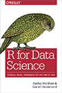
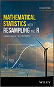
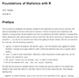
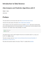
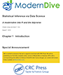

[PDF of Syllabus](../syllabus/php-1510-2510-syllabus.pdf)

## Course goals & objectives:

This course is intended to provide a basic foundation in the methods and applications of biostatistics, and is geared towards the students whose fields of study include a substantial statistical or quantitative component. Ideally, this course is the first in a two-part sequence (the sequel being PHP 1511/2511: Applied Regression ), designed to provide students in the public health, biological and life sciences with broad-based exposure to modern methods of biostatistical inference, in addition to an understanding of underlying mathematical principles and motivations.

Applications to real data from a variety of studies in public health and clinical research are used throughout the course to illustrate the materials, but the emphasis is on the principles of inference and the underlying theory.

In this course we also give students experience manipulating and analyzing data using the R
statistical software package with RStudio interface. Students will work with statistical software during
the weekly lab sessions, as well as in the homework.

### Course Objectives

After successful completion of this course you will understand and be able to use probability, statistical graphics and  hypothesis tests. In particular these include the following capabilities:

1. Manipulate and analyze data in R. 
2. Students will use RStudio with proficiency. 
3. Students will understand how to graph, test and interpret results for given probability distributions and data. 

## Pre-requisites

No prior coursework in statistics or probability is needed. Prior expereince in college level math such as Calculus will prove helpful but is not necessary. 

### Overall Course Expectations

Students in this course will be expected to do the following:

1. Attend all lectures and actively participate in discussion. 

2. Read all assigned material *prior* to coming to class and actively participate in class discussions. 

3. Complete and turn in all assignments on time. Solutions to homework must be clearly written with appropriate tables and figures included. 

4. Demonstrate an understanding on material on examinations. 

5. Respect each other, each others questions and each others discussion. 

### Topics

Course topics will be drawn (but subject to change) from

* Basic Probability
* Random Variables
* Exploratory Data Analysis
* Sampling Distributions
* Hypothesis Testing
    * Basic Methods
    * Categorical Data Comparisons
    * Non-parametric Methods
* Confidence Intervals
* Linear Regression

## Books and Resources

### Required

{:.right}

 **R for Data Science** by
  Hadley Wickham and Garrett Grolemund
  [R4DS](https://r4ds.had.co.nz/).
  

* * *

{:.right}

 **Mathematical Statistics with Resampling and R** by
   Laura M. Chihara, Tim C. Hesterberg
  [Amazon](https://www.amazon.com/Mathematical-Statistics-Resampling-Laura-Chihara/dp/111941654X/ref=sr_1_1?crid=1RCTXHSU4E7TI&keywords=mathematical+statistics+with+resampling+and+r&qid=1566224929&s=gateway&sprefix=mathematical+statistics+%2Caps%2C134&sr=8-1).
 

* * *

{:.right}

 **Foundations of Statistics with R** by 
  Darrin Speegle
  [Bookdown](https://bookdown.org/speegled/foundations-of-statistics/)
  
* * *

{:.right}

 **Introduction to Data Science** by 
  Rafael A. Irizarry
  [Bookdown](https://rafalab.github.io/dsbook/)
  

* * *

{:.right}

 **Statistical Inference via Data Science** by 
  Chester Ismay and Albert Y. Kim
  [Bookdown](https://moderndive.com/)
  

  

Other resources for reference books, statistical computing using R,
  etc are provided on the
  [Resource]({{site.baseurl}}/resources) tab
  

* * *

## Grading:

Students will be evaluated based on:

| Grade  Category | Percentage |
| --------------- | ----------------- | ------------- |
| Participation       |                    5%   |
| Homework             |                   20%  | 
| Exam 1 (03/13/2019)   |                  25% | 
| Exam 2 (05/8/2019)  |                 25%  |
| Reproducible Research Project  |           25% |

* * * 

## Course Hours

| Task | Hours Spent on Task | 
| :--------- | :-----------------: | 
| Class Time       |      42|
| Labs | 14 | 
| Out of Class Work / Reading | 122 | 
| Take Home Exam | 12 | 
|TOTAL | 180 | 

* * * 

## Evaluation Category Details

### Participation

This course will move very fast and it is crucial to success in the course that students attend and participate. Many classes will have polls or quizzes that will not be graded for having the most correct or best answer but for participating. Unexcused absences will result in a loss of percentage points. 

### Homework

Weekly assignments will be given out to students. Assignments will require data handling, data cleaning and interpretation of the results.  It is expected that all assignments are completed on time. No late assignments will be accepted. 

Students will also be graded on the conciseness and quality of work. Turning in many pages of just computer code and output will affect the grade in a negative fashion.

### Exam 1 (March 13, 2019 in Class)

An in class exam will be given. Students will be expected to interpret and analyze regression models. Students will also be expected to understand conceptual ideas. 

### Exam  2 (May 8, 2019 in Class)

An in class exam will be given. Students will be expected to interpret and analyze regression models. Students will also be expected to understand conceptual ideas. 

### Take Home Exam         

Students will be expected to complete a final project. Data as well as questions explored will be at a level appropriate of the background and other statistical courses taken. 

## Differences between PHP 1510/2510

Given the nature of this course with multiple levels of students from Undergraduate to PhD, it is important to discuss the differences of expectations and how students will be graded. 

### Undergraduates

| Grade Category | Comments | 
| ----------------- | ---------------------------------------------------- |
| Participation  |                 Graded the same as all students, Must be in class and prepared to work in groups.  |
| Homework        |                Students will be expected to complete a portion of the material with the exception of some more difficult problems which may be attempted but do not have to be complete. | 
| Exam 1 & 2              |        Students will be expected to complete a portion of the exam.  |
| Take Home Exam  |       This will be a complete data analysis. No part of this is allowed to be discussed with any other student.   |

 

### Graduate Students

| Grade Category | Comments | 
| ----------------- | ---------------------------------------------------- |
| Participation  |                 Graded the same as all students, Must be in class and prepared to work in groups.  |
| Homework        |                 Students will be expected to complete the entire assignment. | 
| Exam 1 & 2              |       Students will be expected to complete the entire exam.  |
| Take Home Exam  |       This will be a complete data analysis. No part of this is allowed to be discussed with any other student.   |

* * *

### Statistical Analysis:

 We will use R as a programming language for data analysis and use   existing packages written in R to support the course. You should have access to a laptop   or desktop capable of running [R or RStudio]({{site.baseurl}}/resources). 
 
See the   [Resources]({{site.baseurl}}/resources) page for books and other   resources for learning R.

* * *

### Email and Discussion Forums

* We will be using
[Slack](https://join.slack.com/t/php-1510-2510/shared_invite/enQtNzI0NTA2MjQxOTY5LTVjNGNlNjdiYzAyZmFlNWMxZTM1ZTU3MzA3MWU5MTNkNTFlNzNjN2I4MjgyM2I5MWY3ZmNlZTE4YzlhNjkzN2E) for class
discussion. 
* The system is highly catered to getting you help fast and efficiently from classmates, the TAs, and myself. 
* Rather than emailing questions to the teaching staff, I encourage you to post your questions on Slack (peer answers earn participation points!). 

Any non-personal questions related to the material covered in class,
problem sets, labs, projects, etc. should be posted on slack.
Before posting a new question please make sure to check if your question has already been answered. The TAs and myself will be answering questions on the forum daily and all students are expected to answer questions as well. Please use informative titles for your posts.

Note that it is more efficient to answer most statistical questions
``in person" so make use of Office Hours.

## Students with Special Needs

Brown University is committed to full inclusion of all students. Students who, by nature of a documented disability, require academic accommodations should contact the professor during office hours. Students may also speak with Student and Employee Accessibility Services at 401-863-9588 to discuss the process for requesting accommodations.

## Diversity Statement

This course is designed to support an inclusive learning environment where diverse perspectives are recognized, respected and seen as a source of strength. It is our intent to provide materials and activities that are respectful of various levels of diversity: mathematical background, previous computing skills, gender, sexuality, disability, age, socioeconomic status, ethnicity, race, and culture.  

Note: When we get involved with human subjects data, there can be very sensitive topics. The reality is that much of data that has been collected and used in research leaves out various groups or identities. We will pay close attention to understanding biases that this can induce in the data. However, this may bring up stressful situations or difficult memories at times. Please contact Professor Sullivan if any of these data cause you any harm.

## English Language Learners

Brown University welcomes students from around the world, and the unique perspectives international students bring enrich the campus community.  To empower students whose first language is not English, an array of ELL support is available on campus including language and culture workshops and individual appointments. For more information about English Language Learning at Brown, contact the ELL Specialists at ellwriting@brown.edu.

